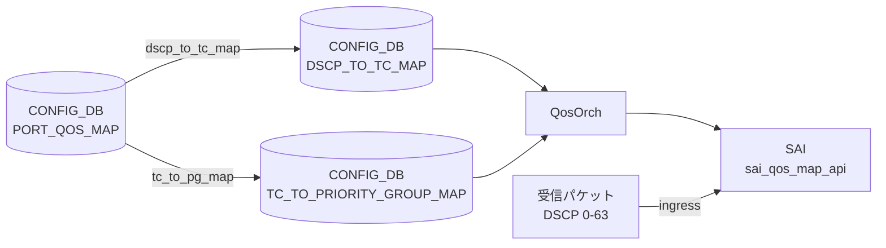

# DSCP_TO_PG_MAP テーブル

!!! warning "このテーブルは SONiC に存在しない"
    `DSCP_TO_PG_MAP` という CONFIG_DB テーブルは SONiC master ブランチに存在しない。DSCP 値から Priority Group (PG) へのマッピングは **2 段構成** で実現される。

## 概要

SONiC の QoS アーキテクチャでは DSCP 値を PG に直接マッピングするテーブルを持たない。実際の経路は以下のとおり:

```
DSCP (0-63)
  ──→ Traffic Class  (DSCP_TO_TC_MAP テーブル)
  ──→ Priority Group (TC_TO_PRIORITY_GROUP_MAP テーブル)
```

`PORT_QOS_MAP` テーブルの `dscp_to_tc_map` leaf と `tc_to_pg_map` leaf を組み合わせることで、入口ポートの DSCP 値が最終的に ingress buffer priority group へ到達する。

## 実際のアーキテクチャ

<!-- cdb-mermaid -->
### データフロー


<!-- /cdb-mermaid -->

### 段階 1 — DSCP → Traffic Class

`DSCP_TO_TC_MAP|<name>` テーブルに DSCP 値（0-63）→ Traffic Class 値（0-7）のエントリを定義する。`PORT_QOS_MAP.<port>.dscp_to_tc_map` から参照される。`qosorch` が `SAI_QOS_MAP_TYPE_DSCP_TO_TC` オブジェクトを生成する。

詳細: [DSCP_TO_TC_MAP](dscp-to-tc-map.md)

### 段階 2 — Traffic Class → Priority Group

`TC_TO_PRIORITY_GROUP_MAP|<name>` テーブルに TC 値（0-7）→ PG 値（0-7）のエントリを定義する。`PORT_QOS_MAP.<port>.tc_to_pg_map` から参照される。`qosorch` が `SAI_QOS_MAP_TYPE_TC_TO_PRIORITY_GROUP` オブジェクトを生成する。

詳細: [TC_TO_PRIORITY_GROUP_MAP](tc-to-priority-group-map.md)

## コード証拠

`qosorch.cpp:80-96` の `m_qos_maps` 初期化リストには以下のテーブルが登録されているが、`DSCP_TO_PG_MAP` は含まれない[^1]:

```cpp
type_map QosOrch::m_qos_maps = {
    {CFG_DSCP_TO_TC_MAP_TABLE_NAME, ...},              // "DSCP_TO_TC_MAP"
    {CFG_TC_TO_PRIORITY_GROUP_MAP_TABLE_NAME, ...},    // "TC_TO_PRIORITY_GROUP_MAP"
    // DSCP_TO_PG_MAP に対応するエントリはない
    ...
};
```

`qosorch.cpp:1329,1342` の handler 登録でも対応なし:

```cpp
m_qos_handler_map.insert(qos_handler_pair(CFG_DSCP_TO_TC_MAP_TABLE_NAME, &QosOrch::handleDscpToTcTable));
m_qos_handler_map.insert(qos_handler_pair(CFG_TC_TO_PRIORITY_GROUP_MAP_TABLE_NAME, &QosOrch::handleTcToPgTable));
// DSCP_TO_PG_MAP ハンドラは存在しない
```

`sonic-buildimage/src/sonic-yang-models/yang-models/` には `sonic-dscp-pg-map.yang` も存在しない[^2]。

<!-- defaults -->
## 暗黙デフォルト・コード由来挙動

`DSCP_TO_PG_MAP` テーブル自体が存在しないため、フィールドデフォルトは定義されない。2 段マッピングを構成する各テーブルのデフォルトは以下のとおり:

### DSCP_TO_TC_MAP のデフォルト（段階 1）

| フィールド | デフォルト有無 | 内容 |
|-----------|--------------|------|
| `name` | プラットフォーム依存 | ストレージバックエンドプラットフォームのみ `qos_config.j2` が `AZURE` / `AZURE_UPLINK` という名前のマップを自動注入する |
| `dscp` (key) | なし | 0-63 の値を明示的に設定する必要あり |
| `tc` | なし | 0-7 の Traffic Class 値を明示的に設定する必要あり |

`qos_config.j2` フォールバック AZURE マップのデフォルト値（抜粋）:

| DSCP | TC | 備考 |
|------|----|------|
| 3, 4 | 3, 4 | lossless クラス |
| 8 | 0 | CS1: best-effort |
| 46 | 5 | EF: expedited forwarding |
| 48 | 6 | CS6: network control |
| その他 | 1 | 低優先度デフォルト |

### TC_TO_PRIORITY_GROUP_MAP のデフォルト（段階 2）

| フィールド | デフォルト有無 | 内容 |
|-----------|--------------|------|
| `name` | プラットフォーム依存 | `qos_config.j2` の `generate_tc_to_pg_map()` マクロが platform 別に生成 |
| `tc` (key) | なし | 0-7 の Traffic Class 値を明示的に設定する必要あり |
| `pg` | なし | `pattern "[0-7]?"` — 0-7 または空文字を許可する YANG 制約 |

`qosorch.cpp:895` では `(uint8_t)stoi(fvValue(*i))` で pg 値を変換しており、例外処理なし。非整数文字列が CONFIG_DB に書き込まれると `std::invalid_argument` が伝播する。

> **Evidence**: `qosorch.cpp:80-96` (m_qos_maps 初期化), `qosorch.cpp:1329,1342` (handler 登録), `qosorch.cpp:880-910` (TcToPgMapHandler), `sonic-port-qos-map.yang:85-91,129-134` (leafref)

<!-- /defaults -->

<!-- ordering -->
## 書込み順依存 (Phase B)

`DSCP_TO_PG_MAP` テーブルは存在しないため、実際の 2 段マッピングチェーン全体の書き込み順依存を記述する。

### allPortsReady() ブロック

`QosOrch::doTask()` (`qosorch.cpp:2258`) は `gPortsOrch->allPortsReady()` が false の間は即 return する。`DSCP_TO_TC_MAP`・`TC_TO_PRIORITY_GROUP_MAP`・`PORT_QOS_MAP` すべての処理が**完全にブロック**される。orchdaemon が PortsOrch の初期化完了を保証するため通常は意識不要だが、起動シーケンス中の早期書き込みは処理待ちになる。

### SET 順序（マップ先行）

```
SET DSCP_TO_TC_MAP|<map_name>           # 段階 1 マップを先に作成
SET TC_TO_PRIORITY_GROUP_MAP|<pg_name>  # 段階 2 マップを先に作成
SET PORT_QOS_MAP|<port>  dscp_to_tc_map=<map_name> tc_to_pg_map=<pg_name>
```

`handlePortQosMapTable()` (`qosorch.cpp:2124`) は `resolveFieldRefValue()` を呼び、参照先マップが未作成の場合は `task_need_retry` を返す。orchagent のメインループで自動リトライされるが、マップが存在するまで PORT_QOS_MAP の SAI 反映はブロックされる。

### DEL 順序（参照元先行）

```
DEL PORT_QOS_MAP|<port>                 # 参照を先に解除
DEL DSCP_TO_TC_MAP|<map_name>           # 参照がなくなってから削除
DEL TC_TO_PRIORITY_GROUP_MAP|<pg_name>  # 参照がなくなってから削除
```

汎用マップハンドラ (`qosorch.cpp:181`) は `isObjectBeingReferenced()` が true の間は DEL 要求に対して `m_pendingRemove=true` をセットして `task_need_retry` を返す。`PORT_QOS_MAP` の参照が解除されるまで SAI 削除は実行されない。

### 依存関係サマリ

| 依存関係 | 方向 | 緩和策 |
|---------|------|-------|
| allPortsReady() 完了 → 全 QosOrch 処理 | 強制先行 | orchdaemon が自動管理 |
| DSCP_TO_TC_MAP SET → PORT_QOS_MAP SET (dscp_to_tc_map) | 必須先行 | task_need_retry で自動リトライ |
| TC_TO_PRIORITY_GROUP_MAP SET → PORT_QOS_MAP SET (tc_to_pg_map) | 必須先行 | task_need_retry で自動リトライ |
| PORT_QOS_MAP DEL → DSCP_TO_TC_MAP DEL | 必須先行 | m_pendingRemove + task_need_retry |
| PORT_QOS_MAP DEL → TC_TO_PRIORITY_GROUP_MAP DEL | 必須先行 | m_pendingRemove + task_need_retry |

> **スキャン証跡**: `QosOrch::doTask()` L2254-2299、`handlePortQosMapTable()` L2046-2134、汎用マップハンドラ L130-196 参照。
<!-- /ordering -->

<!-- cross-refs -->
## 暗黙参照・共依存テーブル (Phase C)

`DSCP_TO_PG_MAP` テーブルは存在しないため、DSCP → PG マッピング機能を実現する 2 段構成の各テーブル間の参照関係を記述する。

| 参照先テーブル / コンポーネント | YANG leafref | 参照種別 | 非充足時の挙動 | evidence |
|---|:---:|---|---|---|
| `PORT_QOS_MAP.dscp_to_tc_map` | ✅ | **被参照**（PORT_QOS_MAP が DSCP_TO_TC_MAP の名前を leafref で参照） | `DSCP_TO_TC_MAP` 未作成時に `PORT_QOS_MAP` SET は `task_need_retry`（自動リトライ） | `qosorch.cpp:2124`, `sonic-port-qos-map.yang:129-135` |
| `PORT_QOS_MAP.tc_to_pg_map` | ✅ | **被参照**（PORT_QOS_MAP が TC_TO_PRIORITY_GROUP_MAP の名前を leafref で参照） | `TC_TO_PRIORITY_GROUP_MAP` 未作成時に `PORT_QOS_MAP` SET は `task_need_retry`（自動リトライ） | `qosorch.cpp:2124`, `sonic-port-qos-map.yang:85-91` |
| `PortsOrch::allPortsReady()` | ✗ | 起動順序ガード | `false` の間は `QosOrch::doTask()` が即 return し、`DSCP_TO_TC_MAP`・`TC_TO_PRIORITY_GROUP_MAP`・`PORT_QOS_MAP` すべての処理がブロック | `qosorch.cpp:2258-2261` |

### YANG leafref の意味

`sonic-port-qos-map.yang` において:

- `PORT_QOS_MAP.dscp_to_tc_map` は `sonic-dscp-tc-map.yang` の `DSCP_TO_TC_MAP_LIST.name` への **leafref** を持つ（`sonic-port-qos-map.yang:129-135`）
- `PORT_QOS_MAP.tc_to_pg_map` は `sonic-tc-priority-group-map.yang` の `TC_TO_PRIORITY_GROUP_MAP_LIST.name` への **leafref** を持つ（`sonic-port-qos-map.yang:85-91`）

一方 `DSCP_TO_PG_MAP` はテーブルとして存在しないため、leafref を持つ YANG モジュール自体が存在しない。

### 参照カウンタの独立管理

`qosorch.cpp:80-96` の `m_qos_maps` では `DSCP_TO_TC_MAP` と `TC_TO_PRIORITY_GROUP_MAP` がそれぞれ独立した `object_reference_map` を持つ。一方のマップが PORT_QOS_MAP から参照されていても、もう一方の DEL には影響しない（参照カウンタは独立）。

```
DSCP_TO_TC_MAP
  ├─ [被参照]  PORT_QOS_MAP.dscp_to_tc_map  (YANG leafref, 参照中は DEL 保留)
  └─ [共用]    QosOrch::m_qos_maps (resolveFieldRefValue / isObjectBeingReferenced)

TC_TO_PRIORITY_GROUP_MAP
  ├─ [被参照]  PORT_QOS_MAP.tc_to_pg_map    (YANG leafref, 参照中は DEL 保留)
  └─ [共用]    QosOrch::m_qos_maps

PORT_QOS_MAP
  ├─ [参照元]  DSCP_TO_TC_MAP    (dscp_to_tc_map フィールド)
  └─ [参照元]  TC_TO_PRIORITY_GROUP_MAP  (tc_to_pg_map フィールド)
```

> **スキャン証跡**: `qosorch.cpp:80-96` (m_qos_maps 初期化), `qosorch.cpp:99-116` (qos_to_ref_table_map), `qosorch.cpp:2124-2133` (resolveFieldRefValue in handlePortQosMapTable), `qosorch.cpp:2258-2261` (allPortsReady ガード), `sonic-port-qos-map.yang:85-91,129-135` (leafref 定義)。
<!-- /cross-refs -->

<!-- failure -->
## 失敗挙動 (Phase D)

> 調査証跡: `meta/_intermediate/cdb-flow/dscp-to-pg-map-failure.md`

`DSCP_TO_PG_MAP` テーブルは存在しないため、2 段マッピングパイプラインを構成する `DSCP_TO_TC_MAP` および `TC_TO_PRIORITY_GROUP_MAP` の失敗挙動を記述する。

### 起動ガード

`QosOrch::doTask()` 冒頭 (`qosorch.cpp:2258-2261`) で `gPortsOrch->allPortsReady()` を確認する。ポート構成完了前は即時 `return` し、両テーブルのエントリが `Consumer::m_toSync` に滞留したまま暗黙 retry される（ログなし・CONFIG_DB 変更なし）。

### DSCP_TO_TC_MAP (段階 1) — SET 時の失敗パターン

| 失敗ケース | 発生箇所 | 挙動 | retry |
|---|---|---|---|
| `allPortsReady() == false` | `doTask()` L2258-2261 | 早期 return、`m_toSync` 滞留 | ポート準備完了まで暗黙 retry |
| dscp 値（key）が非整数文字列 | `convertFieldValuesToAttributes()` L245 `stoi()` | `std::invalid_argument` 未捕捉 → orchagent クラッシュ（例外処理なし） | なし（クラッシュ後の再起動） |
| tc 値（value）が非整数文字列 | `convertFieldValuesToAttributes()` L246 `stoi()` | 同上 | なし |
| SAI `create_qos_map` 失敗 | `addQosItem()` L273-277 | `SWSS_LOG_ERROR("Failed to create dscp_to_tc map. status:%d")` → `task_failed` → erase | なし |
| SAI `set_qos_map_attribute` 失敗 (modify) | `modifyQosItem()` | `SWSS_LOG_ERROR` → `task_failed` → erase | なし |
| `m_pendingRemove == true` (DEL pending 中に SET) | `processWorkItem()` L136-140 | `SWSS_LOG_NOTICE` → `task_need_retry` | PORT_QOS_MAP 参照解除後に自動解消 |

### DSCP_TO_TC_MAP (段階 1) — DEL 時の失敗パターン

| 失敗ケース | 発生箇所 | 挙動 | retry |
|---|---|---|---|
| エントリ未登録 (SAI oid なし) | `processWorkItem()` L177-181 | `SWSS_LOG_ERROR("Object with name:%s not found")` → `task_invalid_entry` → erase | なし |
| `PORT_QOS_MAP` から参照中 | `isObjectBeingReferenced()` L182-187 | `m_pendingRemove=true` + `task_need_retry` | PORT_QOS_MAP 参照解除まで無制限 retry |
| SAI `remove_qos_map` 失敗 | `removeQosItem()` L289-293 | `SWSS_LOG_ERROR("Failed to remove DSCP_TO_TC map, status:%d")` → `task_failed` → erase | なし |

### TC_TO_PRIORITY_GROUP_MAP (段階 2) — SET 時の失敗パターン

| 失敗ケース | 発生箇所 | 挙動 | retry |
|---|---|---|---|
| `allPortsReady() == false` | `doTask()` L2258-2261 | 早期 return | ポート準備完了まで暗黙 retry |
| tc 値（key）が非整数文字列 | `convertFieldValuesToAttributes()` L894 `stoi()` | `std::invalid_argument` 未捕捉 → orchagent クラッシュ（例外処理なし） | なし |
| pg 値（value）が非整数文字列 | `convertFieldValuesToAttributes()` L895 `stoi()` | 同上 | なし |
| SAI `create_qos_map` 失敗 | `addQosItem()` L920-924 | `SWSS_LOG_ERROR("Failed to create tc_to_pg map. status:%d")` → `task_failed` → erase | なし |
| `m_pendingRemove == true` (DEL pending 中に SET) | `processWorkItem()` L136-140 | `task_need_retry` | PORT_QOS_MAP 参照解除後に自動解消 |

### TC_TO_PRIORITY_GROUP_MAP (段階 2) — DEL 時の失敗パターン

| 失敗ケース | 発生箇所 | 挙動 | retry |
|---|---|---|---|
| エントリ未登録 | `processWorkItem()` L177-181 | `task_invalid_entry` → erase | なし |
| `PORT_QOS_MAP` から参照中 | `isObjectBeingReferenced()` L182-187 | `m_pendingRemove=true` + `task_need_retry` | PORT_QOS_MAP 参照解除まで無制限 retry |
| SAI `remove_qos_map` 失敗 | `removeQosItem()` | `SWSS_LOG_ERROR` → `task_failed` → erase | なし |

### 例外処理の非対称性（DscpToTcMapHandler vs ExpToFcMapHandler）

`ExpToFcMapHandler::convertFieldValuesToAttributes()` は L1181-1185 で `stoi()` を try/catch で囲み `task_invalid_entry` として安全に処理するが、`DscpToTcMapHandler` と `TcToPgHandler` には同等の保護がない。非整数文字列が投入されると未捕捉例外となる。

### エラー通知先

- `SWSS_LOG_ERROR` / `SWSS_LOG_NOTICE` → syslog のみ
- `ERROR_TABLE` への書き込みなし
- STATE_DB への反映なし（両テーブルとも STATE_DB エントリを持たない）
- CONFIG_DB のエントリは失敗後も残存（`task_invalid_entry` の erase はメモリ上の `m_toSync` のみ）

> **Evidence**: `qosorch.cpp:124-201` (QosMapHandler::processWorkItem); `qosorch.cpp:235-296` (DscpToTcMapHandler); `qosorch.cpp:884-934` (TcToPgHandler); `qosorch.cpp:2253-2300` (QosOrch::doTask)
<!-- /failure -->

## 制約

- `DSCP_TO_PG_MAP` テーブルは存在しないため、このキー名で CONFIG_DB に書き込んでも `qosorch` は無視する
- 実際の DSCP → PG 経路を設定するには `DSCP_TO_TC_MAP`、`TC_TO_PRIORITY_GROUP_MAP`、`PORT_QOS_MAP` の 3 テーブルを適切に設定する必要がある

## 関連 CONFIG_DB / YANG / CLI

- 関連 [CONFIG_DB](../../reference/glossary.md#term-config_db): `DSCP_TO_TC_MAP`、`TC_TO_PRIORITY_GROUP_MAP`、`PORT_QOS_MAP`
- 関連 CLI: `config qos`
- 関連 [YANG](../../reference/glossary.md#term-yang): `sonic-dscp-tc-map`、`sonic-tc-priority-group-map`

## 引用元

[^1]: QosOrch m_qos_maps 初期化: `sonic-swss/orchagent/qosorch.cpp:80-96`. <https://github.com/sonic-net/sonic-swss/blob/master/orchagent/qosorch.cpp>
[^2]: YANG モデル一覧: `sonic-buildimage/src/sonic-yang-models/yang-models/`. <https://github.com/sonic-net/sonic-buildimage/tree/master/src/sonic-yang-models/yang-models>

## 関連ページ

- [CONFIG_DB: DSCP_TO_TC_MAP](dscp-to-tc-map.md)
- [CONFIG_DB: TC_TO_PRIORITY_GROUP_MAP](tc-to-priority-group-map.md)
- [CONFIG_DB: PORT_QOS_MAP](port-qos-map.md)
