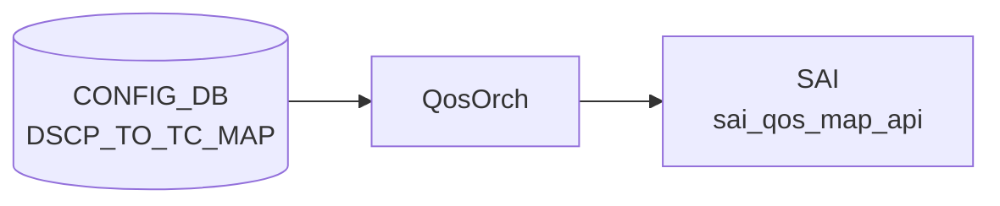

# DSCP_TO_PG_MAP テーブル

!!! warning "このテーブルは SONiC に存在しない"
    `DSCP_TO_PG_MAP` という CONFIG_DB テーブルは SONiC master ブランチに存在しない。DSCP 値から Priority Group (PG) へのマッピングは **2 段構成** で実現される。

## 概要

[SONiC](../../reference/glossary.md#term-sonic) の [QoS](../../reference/glossary.md#term-qos) アーキテクチャでは [DSCP](../../reference/glossary.md#term-dscp) 値を PG に直接マッピングするテーブルを持たない。実際の経路は以下のとおり:

```
DSCP (0-63)
  ──→ Traffic Class  (DSCP_TO_TC_MAP テーブル)
  ──→ Priority Group (TC_TO_PRIORITY_GROUP_MAP テーブル)
```

`PORT_QOS_MAP` テーブルの `dscp_to_tc_map` leaf と `tc_to_pg_map` leaf を組み合わせることで、入口ポートの [DSCP](../../reference/glossary.md#term-dscp) 値が最終的に ingress buffer priority group へ到達する。

## 実際のアーキテクチャ

<!-- cdb-mermaid -->
### データフロー (自動生成)



!!! note "凡例"
    CONFIG_DB から SAI までの典型経路を `docs/reference/config-db-orch-map.md` から機械生成したミニ図。詳細・例外は本ページ本文と対応表を参照。
<!-- /cdb-mermaid -->

### 段階 1 — DSCP → Traffic Class

`DSCP_TO_TC_MAP|<name>` テーブルに [DSCP](../../reference/glossary.md#term-dscp) 値（0-63）→ Traffic Class 値（0-7）のエントリを定義する。`PORT_QOS_MAP.<port>.dscp_to_tc_map` から参照される。`qosorch` が `SAI_QOS_MAP_TYPE_DSCP_TO_TC` オブジェクトを生成する。

詳細: [DSCP_TO_TC_MAP](dscp-to-tc-map.md)

### 段階 2 — Traffic Class → Priority Group

`TC_TO_PRIORITY_GROUP_MAP|<name>` テーブルに TC 値（0-7）→ PG 値（0-7）のエントリを定義する。`PORT_QOS_MAP.<port>.tc_to_pg_map` から参照される。`qosorch` が `SAI_QOS_MAP_TYPE_TC_TO_PRIORITY_GROUP` オブジェクトを生成する。

詳細: [TC_TO_PRIORITY_GROUP_MAP](tc-to-priority-group-map.md)

## コード証拠

`qosorch.cpp:80-96` の `m_qos_maps` 初期化リストには以下のテーブルが登録されているが、`DSCP_TO_PG_MAP` は含まれない[^1]:

```cpp
type_map QosOrch::m_qos_maps = {
    {CFG_DSCP_TO_TC_MAP_TABLE_NAME, ...},              // "DSCP_TO_TC_MAP"
    {CFG_TC_TO_PRIORITY_GROUP_MAP_TABLE_NAME, ...},    // "TC_TO_PRIORITY_GROUP_MAP"
    // DSCP_TO_PG_MAP に対応するエントリはない
    ...
};
```

`qosorch.cpp:1329,1342` の handler 登録でも対応なし:

```cpp
m_qos_handler_map.insert(qos_handler_pair(CFG_DSCP_TO_TC_MAP_TABLE_NAME, &QosOrch::handleDscpToTcTable));
m_qos_handler_map.insert(qos_handler_pair(CFG_TC_TO_PRIORITY_GROUP_MAP_TABLE_NAME, &QosOrch::handleTcToPgTable));
// DSCP_TO_PG_MAP ハンドラは存在しない
```

`sonic-buildimage/src/sonic-yang-models/yang-models/` には `sonic-dscp-pg-map.yang` も存在しない[^2]。

<!-- defaults -->
## 暗黙デフォルト・コード由来挙動

`DSCP_TO_PG_MAP` テーブル自体が存在しないため、フィールドデフォルトは定義されない。2 段マッピングを構成する各テーブルのデフォルトは以下のとおり:

### DSCP_TO_TC_MAP のデフォルト（段階 1）

| フィールド | デフォルト有無 | 内容 |
|-----------|--------------|------|
| `name` | プラットフォーム依存 | ストレージバックエンドプラットフォームのみ `qos_config.j2` が `AZURE` / `AZURE_UPLINK` という名前のマップを自動注入する |
| `dscp` (key) | なし | 0-63 の値を明示的に設定する必要あり |
| `tc` | なし | 0-7 の Traffic Class 値を明示的に設定する必要あり |

`qos_config.j2` フォールバック AZURE マップのデフォルト値（抜粋）:

| DSCP | TC | 備考 |
|------|----|------|
| 3, 4 | 3, 4 | lossless クラス |
| 8 | 0 | CS1: best-effort |
| 46 | 5 | EF: expedited forwarding |
| 48 | 6 | CS6: network control |
| その他 | 1 | 低優先度デフォルト |

### TC_TO_PRIORITY_GROUP_MAP のデフォルト（段階 2）

| フィールド | デフォルト有無 | 内容 |
|-----------|--------------|------|
| `name` | プラットフォーム依存 | `qos_config.j2` の `generate_tc_to_pg_map()` マクロが platform 別に生成 |
| `tc` (key) | なし | 0-7 の Traffic Class 値を明示的に設定する必要あり |
| `pg` | なし | `pattern "[0-7]?"` — 0-7 または空文字を許可する [YANG](../../reference/glossary.md#term-yang) 制約 |

`qosorch.cpp:895` では `(uint8_t)stoi(fvValue(*i))` で pg 値を変換しており、例外処理なし。非整数文字列が [CONFIG_DB](../../reference/glossary.md#term-config_db) に書き込まれると `std::invalid_argument` が伝播する。

> **Evidence**: `qosorch.cpp:80-96` (m_qos_maps 初期化), `qosorch.cpp:1329,1342` (handler 登録), `qosorch.cpp:880-910` (TcToPgMapHandler), `sonic-port-qos-map.yang:85-91,129-134` (leafref)

<!-- /defaults -->

<!-- ordering -->
## 書込み順依存

`DSCP_TO_PG_MAP` テーブルは存在しないため、実際の 2 段マッピングチェーン全体の書き込み順依存を記述する。

### allPortsReady() ブロック

`QosOrch::doTask()` (`qosorch.cpp:2258`) は `gPortsOrch->allPortsReady()` が false の間は即 return する。`DSCP_TO_TC_MAP`・`TC_TO_PRIORITY_GROUP_MAP`・`PORT_QOS_MAP` すべての処理が**完全にブロック**される。orchdaemon が PortsOrch の初期化完了を保証するため通常は意識不要だが、起動シーケンス中の早期書き込みは処理待ちになる。

### SET 順序（マップ先行）

```
SET DSCP_TO_TC_MAP|<map_name>           # 段階 1 マップを先に作成
SET TC_TO_PRIORITY_GROUP_MAP|<pg_name>  # 段階 2 マップを先に作成
SET PORT_QOS_MAP|<port>  dscp_to_tc_map=<map_name> tc_to_pg_map=<pg_name>
```

`handlePortQosMapTable()` (`qosorch.cpp:2124`) は `resolveFieldRefValue()` を呼び、参照先マップが未作成の場合は `task_need_retry` を返す。[orchagent](../../reference/glossary.md#term-orchagent) のメインループで自動リトライされるが、マップが存在するまで PORT_QOS_MAP の [SAI](../../reference/glossary.md#term-sai) 反映はブロックされる。

### DEL 順序（参照元先行）

```
DEL PORT_QOS_MAP|<port>                 # 参照を先に解除
DEL DSCP_TO_TC_MAP|<map_name>           # 参照がなくなってから削除
DEL TC_TO_PRIORITY_GROUP_MAP|<pg_name>  # 参照がなくなってから削除
```

汎用マップハンドラ (`qosorch.cpp:181`) は `isObjectBeingReferenced()` が true の間は DEL 要求に対して `m_pendingRemove=true` をセットして `task_need_retry` を返す。`PORT_QOS_MAP` の参照が解除されるまで [SAI](../../reference/glossary.md#term-sai) 削除は実行されない。

### 依存関係サマリ

| 依存関係 | 方向 | 緩和策 |
|---------|------|-------|
| allPortsReady() 完了 → 全 QosOrch 処理 | 強制先行 | orchdaemon が自動管理 |
| DSCP_TO_TC_MAP SET → PORT_QOS_MAP SET (dscp_to_tc_map) | 必須先行 | task_need_retry で自動リトライ |
| TC_TO_PRIORITY_GROUP_MAP SET → PORT_QOS_MAP SET (tc_to_pg_map) | 必須先行 | task_need_retry で自動リトライ |
| PORT_QOS_MAP DEL → DSCP_TO_TC_MAP DEL | 必須先行 | m_pendingRemove + task_need_retry |
| PORT_QOS_MAP DEL → TC_TO_PRIORITY_GROUP_MAP DEL | 必須先行 | m_pendingRemove + task_need_retry |

> **裏取り**: `QosOrch::doTask()` L2254-2299、`handlePortQosMapTable()` L2046-2134、汎用マップハンドラ L130-196 参照。
<!-- /ordering -->

<!-- cross-refs -->
## 暗黙参照・共依存テーブル

`DSCP_TO_PG_MAP` テーブルは存在しないため、DSCP → PG マッピング機能を実現する 2 段構成の各テーブル間の参照関係を記述する。

| 参照先テーブル / コンポーネント | [YANG](../../reference/glossary.md#term-yang) leafref | 参照種別 | 非充足時の挙動 | evidence |
|---|:---:|---|---|---|
| `PORT_QOS_MAP.dscp_to_tc_map` | ✅ | **被参照**（PORT_QOS_MAP が DSCP_TO_TC_MAP の名前を leafref で参照） | `DSCP_TO_TC_MAP` 未作成時に `PORT_QOS_MAP` SET は `task_need_retry`（自動リトライ） | `qosorch.cpp:2124`, `sonic-port-qos-map.yang:129-135` |
| `PORT_QOS_MAP.tc_to_pg_map` | ✅ | **被参照**（PORT_QOS_MAP が TC_TO_PRIORITY_GROUP_MAP の名前を leafref で参照） | `TC_TO_PRIORITY_GROUP_MAP` 未作成時に `PORT_QOS_MAP` SET は `task_need_retry`（自動リトライ） | `qosorch.cpp:2124`, `sonic-port-qos-map.yang:85-91` |
| `PortsOrch::allPortsReady()` | ✗ | 起動順序ガード | `false` の間は `QosOrch::doTask()` が即 return し、`DSCP_TO_TC_MAP`・`TC_TO_PRIORITY_GROUP_MAP`・`PORT_QOS_MAP` すべての処理がブロック | `qosorch.cpp:2258-2261` |

### YANG leafref の意味

`sonic-port-qos-map.yang` において:

- `PORT_QOS_MAP.dscp_to_tc_map` は `sonic-dscp-tc-map.yang` の `DSCP_TO_TC_MAP_LIST.name` への **leafref** を持つ（`sonic-port-qos-map.yang:129-135`）
- `PORT_QOS_MAP.tc_to_pg_map` は `sonic-tc-priority-group-map.yang` の `TC_TO_PRIORITY_GROUP_MAP_LIST.name` への **leafref** を持つ（`sonic-port-qos-map.yang:85-91`）

一方 `DSCP_TO_PG_MAP` はテーブルとして存在しないため、leafref を持つ YANG モジュール自体が存在しない。

### 参照カウンタの独立管理

`qosorch.cpp:80-96` の `m_qos_maps` では `DSCP_TO_TC_MAP` と `TC_TO_PRIORITY_GROUP_MAP` がそれぞれ独立した `object_reference_map` を持つ。一方のマップが PORT_QOS_MAP から参照されていても、もう一方の DEL には影響しない（参照カウンタは独立）。

```
DSCP_TO_TC_MAP
  ├─ [被参照]  PORT_QOS_MAP.dscp_to_tc_map  (YANG leafref, 参照中は DEL 保留)
  └─ [共用]    QosOrch::m_qos_maps (resolveFieldRefValue / isObjectBeingReferenced)

TC_TO_PRIORITY_GROUP_MAP
  ├─ [被参照]  PORT_QOS_MAP.tc_to_pg_map    (YANG leafref, 参照中は DEL 保留)
  └─ [共用]    QosOrch::m_qos_maps

PORT_QOS_MAP
  ├─ [参照元]  DSCP_TO_TC_MAP    (dscp_to_tc_map フィールド)
  └─ [参照元]  TC_TO_PRIORITY_GROUP_MAP  (tc_to_pg_map フィールド)
```

> **裏取り**: `qosorch.cpp:80-96` (m_qos_maps 初期化), `qosorch.cpp:99-116` (qos_to_ref_table_map), `qosorch.cpp:2124-2133` (resolveFieldRefValue in handlePortQosMapTable), `qosorch.cpp:2258-2261` (allPortsReady ガード), `sonic-port-qos-map.yang:85-91,129-135` (leafref 定義)。
<!-- /cross-refs -->

<!-- failure -->
## 失敗挙動

`DSCP_TO_PG_MAP` テーブルは存在しないため、2 段マッピングパイプラインを構成する `DSCP_TO_TC_MAP` および `TC_TO_PRIORITY_GROUP_MAP` の失敗挙動を記述する。

### 起動ガード

`QosOrch::doTask()` 冒頭 (`qosorch.cpp:2258-2261`) で `gPortsOrch->allPortsReady()` を確認する。ポート構成完了前は即時 `return` し、両テーブルのエントリが `Consumer::m_toSync` に滞留したまま暗黙 retry される（ログなし・[CONFIG_DB](../../reference/glossary.md#term-config_db) 変更なし）。

### DSCP_TO_TC_MAP (段階 1) — SET 時の失敗パターン

| 失敗ケース | 発生箇所 | 挙動 | retry |
|---|---|---|---|
| `allPortsReady() == false` | `doTask()` L2258-2261 | 早期 return、`m_toSync` 滞留 | ポート準備完了まで暗黙 retry |
| dscp 値（key）が非整数文字列 | `convertFieldValuesToAttributes()` L245 `stoi()` | `std::invalid_argument` 未捕捉 → [orchagent](../../reference/glossary.md#term-orchagent) クラッシュ（例外処理なし） | なし（クラッシュ後の再起動） |
| tc 値（value）が非整数文字列 | `convertFieldValuesToAttributes()` L246 `stoi()` | 同上 | なし |
| [SAI](../../reference/glossary.md#term-sai) `create_qos_map` 失敗 | `addQosItem()` L273-277 | `SWSS_LOG_ERROR("Failed to create dscp_to_tc map. status:%d")` → `task_failed` → erase | なし |
| SAI `set_qos_map_attribute` 失敗 (modify) | `modifyQosItem()` | `SWSS_LOG_ERROR` → `task_failed` → erase | なし |
| `m_pendingRemove == true` (DEL pending 中に SET) | `processWorkItem()` L136-140 | `SWSS_LOG_NOTICE` → `task_need_retry` | PORT_QOS_MAP 参照解除後に自動解消 |

### DSCP_TO_TC_MAP (段階 1) — DEL 時の失敗パターン

| 失敗ケース | 発生箇所 | 挙動 | retry |
|---|---|---|---|
| エントリ未登録 (SAI oid なし) | `processWorkItem()` L177-181 | `SWSS_LOG_ERROR("Object with name:%s not found")` → `task_invalid_entry` → erase | なし |
| `PORT_QOS_MAP` から参照中 | `isObjectBeingReferenced()` L182-187 | `m_pendingRemove=true` + `task_need_retry` | PORT_QOS_MAP 参照解除まで無制限 retry |
| SAI `remove_qos_map` 失敗 | `removeQosItem()` L289-293 | `SWSS_LOG_ERROR("Failed to remove DSCP_TO_TC map, status:%d")` → `task_failed` → erase | なし |

### TC_TO_PRIORITY_GROUP_MAP (段階 2) — SET 時の失敗パターン

| 失敗ケース | 発生箇所 | 挙動 | retry |
|---|---|---|---|
| `allPortsReady() == false` | `doTask()` L2258-2261 | 早期 return | ポート準備完了まで暗黙 retry |
| tc 値（key）が非整数文字列 | `convertFieldValuesToAttributes()` L894 `stoi()` | `std::invalid_argument` 未捕捉 → [orchagent](../../reference/glossary.md#term-orchagent) クラッシュ（例外処理なし） | なし |
| pg 値（value）が非整数文字列 | `convertFieldValuesToAttributes()` L895 `stoi()` | 同上 | なし |
| SAI `create_qos_map` 失敗 | `addQosItem()` L920-924 | `SWSS_LOG_ERROR("Failed to create tc_to_pg map. status:%d")` → `task_failed` → erase | なし |
| `m_pendingRemove == true` (DEL pending 中に SET) | `processWorkItem()` L136-140 | `task_need_retry` | PORT_QOS_MAP 参照解除後に自動解消 |

### TC_TO_PRIORITY_GROUP_MAP (段階 2) — DEL 時の失敗パターン

| 失敗ケース | 発生箇所 | 挙動 | retry |
|---|---|---|---|
| エントリ未登録 | `processWorkItem()` L177-181 | `task_invalid_entry` → erase | なし |
| `PORT_QOS_MAP` から参照中 | `isObjectBeingReferenced()` L182-187 | `m_pendingRemove=true` + `task_need_retry` | PORT_QOS_MAP 参照解除まで無制限 retry |
| SAI `remove_qos_map` 失敗 | `removeQosItem()` | `SWSS_LOG_ERROR` → `task_failed` → erase | なし |

### 例外処理の非対称性（DscpToTcMapHandler vs ExpToFcMapHandler）

`ExpToFcMapHandler::convertFieldValuesToAttributes()` は L1181-1185 で `stoi()` を try/catch で囲み `task_invalid_entry` として安全に処理するが、`DscpToTcMapHandler` と `TcToPgHandler` には同等の保護がない。非整数文字列が投入されると未捕捉例外となる。

### エラー通知先

- `SWSS_LOG_ERROR` / `SWSS_LOG_NOTICE` → syslog のみ
- `ERROR_TABLE` への書き込みなし
- [STATE_DB](../../reference/glossary.md#term-state_db) への反映なし（両テーブルとも [STATE_DB](../../reference/glossary.md#term-state_db) エントリを持たない）
- CONFIG_DB のエントリは失敗後も残存（`task_invalid_entry` の erase はメモリ上の `m_toSync` のみ）

> **Evidence**: `qosorch.cpp:124-201` (QosMapHandler::processWorkItem); `qosorch.cpp:235-296` (DscpToTcMapHandler); `qosorch.cpp:884-934` (TcToPgHandler); `qosorch.cpp:2253-2300` (QosOrch::doTask)
<!-- /failure -->

<!-- constants -->
## ハードコード定数

`DSCP_TO_PG_MAP` テーブルは存在しないため、2 段マッピングパイプライン (`DSCP_TO_TC_MAP` → `TC_TO_PRIORITY_GROUP_MAP` → `PORT_QOS_MAP`) を構成するハードコード定数を記述する。出典は `qosorch.h`、`qosorch.cpp`、および各 YANG モジュール。

### CONFIG_DB フィールド名定数 (qosorch.h)

`PORT_QOS_MAP` テーブルのフィールド名は `qosorch.h` に `const string` としてハードコードされている。

| 定数名 | 値 | 用途 | ソース |
|-------|----|------|--------|
| `dscp_to_tc_field_name` | `"dscp_to_tc_map"` | `PORT_QOS_MAP.<port>.dscp_to_tc_map` フィールド名。`DSCP_TO_TC_MAP` へのリファレンス | qosorch.h L11 |
| `tc_to_pg_map_field_name` | `"tc_to_pg_map"` | `PORT_QOS_MAP.<port>.tc_to_pg_map` フィールド名。`TC_TO_PRIORITY_GROUP_MAP` へのリファレンス | qosorch.h L18 |
| `decap_dscp_to_tc_field_name` | `"decap_dscp_to_tc_map"` | トンネル decap 側 DSCP→TC フィールド名 | qosorch.h L34 |
| `decap_tc_to_pg_field_name` | `"decap_tc_to_pg_map"` | トンネル decap 側 TC→PG フィールド名 | qosorch.h L35 |

### SAI QOS マップタイプ定数

各ハンドラが SAI オブジェクト作成時に `qos_map_attr.value` にセットするハードコード定数。

| SAI 定数 | 使用箇所 | 意味 |
|----------|---------|------|
| `SAI_QOS_MAP_TYPE_DSCP_TO_TC` | `qosorch.cpp:265` | DSCP → Traffic Class マップの SAI タイプ |
| `SAI_QOS_MAP_TYPE_TC_TO_PRIORITY_GROUP` | `qosorch.cpp:913` | TC → [Priority Group](../../reference/glossary.md#term-priority-group) マップの SAI タイプ |

> **重要**: `SAI_QOS_MAP_TYPE_DSCP_TO_PRIORITY_GROUP` は SAI 仕様に存在しない。これが `DSCP_TO_PG_MAP` テーブルが [SONiC](../../reference/glossary.md#term-sonic) に存在しない根本理由の一つである。

### SAI ポート属性定数

`PORT_QOS_MAP` を SAI ポートオブジェクトに適用する際の属性 ID。

| SAI 定数 | 対応フィールド | ソース |
|----------|-------------|--------|
| `SAI_PORT_ATTR_QOS_DSCP_TO_TC_MAP` | `dscp_to_tc_map` | qosorch.cpp:61 |
| `SAI_PORT_ATTR_QOS_TC_TO_PRIORITY_GROUP_MAP` | `tc_to_pg_map` | qosorch.cpp:67 |

### YANG 値域制約（ハードコードパターン）

YANG バリデーションで強制される値域はコードではなく YANG ファイルにハードコードされている。

#### DSCP_TO_TC_MAP の値域制約

| フィールド | YANG パターン / 型 | 許容値 | ソース |
|-----------|-----------------|--------|--------|
| `name` | `[a-zA-Z0-9]{1}([-a-zA-Z0-9_]{0,31})` | 英数字始まり、英数字・ハイフン・アンダースコア、最大 32 文字 | sonic-dscp-tc-map.yang L40-41 |
| `dscp` (key) | `"6[0-3]\|[1-5][0-9]?\|[0-9]?"` | `0`〜`63` の整数文字列のみ | sonic-dscp-tc-map.yang L57-62 |
| `tc` (value) | `stypes:tc_type` (`uint8` range `0..15`) | `0`〜`15` | sonic-types.yang (stypes) |

#### TC_TO_PRIORITY_GROUP_MAP の値域制約

| フィールド | YANG パターン / 型 | 許容値 | ソース |
|-----------|-----------------|--------|--------|
| `name` | `[a-zA-Z0-9]{1}([-a-zA-Z0-9_]{0,31})` | 英数字始まり、最大 32 文字 | sonic-tc-priority-group-map.yang L40-41 |
| `tc` (key) | `stypes:tc_type` (`uint8` range `0..15`) | `0`〜`15` | sonic-types.yang (stypes) |
| `pg` (value) | `"[0-7]?"` | `0`〜`7` または空文字 | sonic-tc-priority-group-map.yang L62-65 |

> **注意**: `pg` パターン `[0-7]?` は空文字を許容するが、`qosorch.cpp:895` の `stoi()` は空文字で `std::invalid_argument` を送出してクラッシュする（`stoi("")` の例外処理なし）。

> **Evidence**: `qosorch.h:11,18,34-35`; `qosorch.cpp:61,67,245-246,265,894-895,913`; `sonic-dscp-tc-map.yang:40-66`; `sonic-tc-priority-group-map.yang:40-65`
<!-- /constants -->

<!-- side-effects -->
## 副次 DB 書き込み・連鎖副作用

`DSCP_TO_PG_MAP` テーブルは存在しないため、2 段マッピングパイプライン (`DSCP_TO_TC_MAP` → `TC_TO_PRIORITY_GROUP_MAP` → `PORT_QOS_MAP`) の CONFIG_DB 書き込みが引き起こす副次的な DB 変更および連鎖動作を記述する。CONFIG_DB → QosOrch 直結であり、cfgmgr ステージ / [APPL_DB](../../reference/glossary.md#term-appl_db) ステージは存在しない。

### DSCP_TO_TC_MAP (段階 1) の副次書き込み

| 操作 | 副次書き込み先 DB / テーブル | フィールド | 条件 |
|------|--------------------------|----------|------|
| SET (新規) | [ASIC_DB](../../reference/glossary.md#term-asic_db) `ASIC_STATE:SAI_OBJECT_TYPE_QOS_MAP` | `<qos_map_oid>` 新規 | `create_qos_map(SAI_QOS_MAP_TYPE_DSCP_TO_TC, ...)` (qosorch.cpp:265-276) |
| SET (更新) | [ASIC_DB](../../reference/glossary.md#term-asic_db) `ASIC_STATE:SAI_OBJECT_TYPE_QOS_MAP` | `SAI_QOS_MAP_ATTR_MAP_TO_VALUE_LIST` | `set_qos_map_attribute(...)` in-place 更新; 全参照ポートに即時反映 (qosorch.cpp:207) |
| DEL | [ASIC_DB](../../reference/glossary.md#term-asic_db) `ASIC_STATE:SAI_OBJECT_TYPE_QOS_MAP` | `<qos_map_oid>` 削除 | 非参照時のみ (qosorch.cpp:284-295) |

**in-place 更新の重要特性**: `set_qos_map_attribute` は SAI オブジェクト OID を変えずにマップ内容を書き換えるため、`PORT_QOS_MAP` や `TUNNEL_DECAP_TABLE` が持つバインドはそのまま有効となり、**参照中の全ポート・全トンネルに即時反映**される（PORT_QOS_MAP の再適用不要）。

### PORT_QOS_MAP バインド時の連鎖副次書き込み

`PORT_QOS_MAP` SET は `dscp_to_tc_map` / `tc_to_pg_map` フィールドだけでなく、同一トランザクションで [PFC](../../reference/glossary.md#term-pfc) ビットマスクも処理し、ポート SAI オブジェクトを複数属性にわたって変更する。

| 操作 | 副次書き込み先 DB / テーブル | フィールド | 条件 |
|------|--------------------------|----------|------|
| PORT_QOS_MAP SET (dscp_to_tc_map) | ASIC_DB `ASIC_STATE:SAI_OBJECT_TYPE_PORT` | `SAI_PORT_ATTR_QOS_DSCP_TO_TC_MAP` | 指定ポート全対象 (qosorch.cpp:2086, 2193) |
| PORT_QOS_MAP SET (tc_to_pg_map) | ASIC_DB `ASIC_STATE:SAI_OBJECT_TYPE_PORT` | `SAI_PORT_ATTR_QOS_TC_TO_PRIORITY_GROUP_MAP` | 指定ポート全対象 (qosorch.cpp:2086, 2193) |
| PORT_QOS_MAP SET (pfc_enable) | ASIC_DB `ASIC_STATE:SAI_OBJECT_TYPE_PORT` | `SAI_PORT_ATTR_PRIORITY_FLOW_CONTROL` | pfc_enable != 0 または旧値 != 0 時 (qosorch.cpp:2208-2216) |
| PORT_QOS_MAP SET (pfcwd_sw_enable) | PortsOrch 内部 `m_port.m_pfcwd_sw_bitmap` (メモリのみ) | — | 無条件; [STATE_DB](../../reference/glossary.md#term-state_db) への書き込みなし (qosorch.cpp:2224) |
| PORT_QOS_MAP DEL | ASIC_DB `ASIC_STATE:SAI_OBJECT_TYPE_PORT` | `SAI_PORT_ATTR_QOS_DSCP_TO_TC_MAP` = `SAI_NULL_OBJECT_ID` および `SAI_PORT_ATTR_QOS_TC_TO_PRIORITY_GROUP_MAP` = `SAI_NULL_OBJECT_ID` | DEL 時に全マップ属性をクリア (qosorch.cpp:2086) |
| PORT_QOS_MAP DEL ([PFC](../../reference/glossary.md#term-pfc)) | ASIC_DB `ASIC_STATE:SAI_OBJECT_TYPE_PORT` | `SAI_PORT_ATTR_PRIORITY_FLOW_CONTROL` = 0 | DEL 時に [PFC](../../reference/glossary.md#term-pfc) 強制無効化 (qosorch.cpp:2100) |

### PORT_QOS_MAP|global — スイッチレベル副次書き込み

キーが `global` の場合、ポートではなくスイッチ全体へ DSCP→TC マップを適用する。

| 操作 | 副次書き込み先 DB / テーブル | フィールド | 条件 |
|------|--------------------------|----------|------|
| PORT_QOS_MAP\|global SET | ASIC_DB `ASIC_STATE:SAI_OBJECT_TYPE_SWITCH` | `SAI_SWITCH_ATTR_QOS_DSCP_TO_TC_MAP` | SAI capability あり (qosorch.cpp:1956-1975) |
| PORT_QOS_MAP\|global DEL | ASIC_DB `ASIC_STATE:SAI_OBJECT_TYPE_SWITCH` | `SAI_SWITCH_ATTR_QOS_DSCP_TO_TC_MAP` = `SAI_NULL_OBJECT_ID` | dscp_to_tc_map フィールド存在時 (qosorch.cpp:1993) |

### TunnelDecapOrch からの連鎖参照

`TUNNEL_DECAP_TABLE` の `decap_dscp_to_tc_map` / `decap_tc_to_pg_map` フィールドが `DSCP_TO_TC_MAP` / `TC_TO_PRIORITY_GROUP_MAP` を参照する場合、トンネル SAI オブジェクト作成時に同マップ OID が適用される（`tunneldecaporch.cpp:832-843`）。参照中のマップを DEL しようとすると `m_pendingRemove=true` + `task_need_retry` でブロックされる（参照カウンタは `APP_TUNNEL_DECAP_TABLE_NAME` エントリとして `m_qos_maps` に登録）。

### 副次書き込みサマリ

| DB | 副次書き込みテーブル | SET 時 | DEL 時 |
|----|---------------------|--------|--------|
| ASIC_DB | `ASIC_STATE:SAI_OBJECT_TYPE_QOS_MAP` | create / set_attribute ([syncd](../../reference/glossary.md#term-syncd) 経由) | remove ([syncd](../../reference/glossary.md#term-syncd) 経由) |
| ASIC_DB | `ASIC_STATE:SAI_OBJECT_TYPE_PORT` | `SAI_PORT_ATTR_QOS_DSCP_TO_TC_MAP`, `SAI_PORT_ATTR_QOS_TC_TO_PRIORITY_GROUP_MAP`, `SAI_PORT_ATTR_PRIORITY_FLOW_CONTROL` | 各属性を SAI_NULL_OBJECT_ID / 0 にクリア |
| ASIC_DB | `ASIC_STATE:SAI_OBJECT_TYPE_SWITCH` | `SAI_SWITCH_ATTR_QOS_DSCP_TO_TC_MAP` (global キーのみ) | SAI_NULL_OBJECT_ID |
| ASIC_DB | `ASIC_STATE:SAI_OBJECT_TYPE_TUNNEL` | decap [QoS](../../reference/glossary.md#term-qos) 属性 (tunneldecaporch 経由) | — |
| PortsOrch 内部 | `m_port.m_pfcwd_sw_bitmap` (メモリ) | setPortPfcWatchdogStatus 呼び出し | — |
| [APPL_DB](../../reference/glossary.md#term-appl_db) | — | なし | なし |
| STATE_DB | — | なし | なし |
| [COUNTERS_DB](../../reference/glossary.md#term-counters_db) | — | なし | なし |

> **Evidence**: `qosorch.cpp:61,67,181-186,207,265-276,913-925,1956-1993,2086,2100,2193,2208-2224`; `tunneldecaporch.cpp:832-843`
<!-- /side-effects -->

<!-- pubsub -->
## 通信メカニズム

`DSCP_TO_PG_MAP` テーブルは存在しないため、DSCP → PG マッピング機能を構成する 3 テーブル (`DSCP_TO_TC_MAP` / `TC_TO_PRIORITY_GROUP_MAP` / `PORT_QOS_MAP`) の通信メカニズムを記述する。

### Producer/Consumer ペア

3 テーブルはすべて CONFIG_DB から `QosOrch` が **直接購読**する。[APPL_DB](../../reference/glossary.md#term-appl_db) への中継は行わない。

| 区間 | 方式 | チャンネル/パターン |
|------|------|--------------------|
| CONFIG_DB → QosOrch (DSCP_TO_TC_MAP) | `SubscriberStateTable` | `PSUBSCRIBE __keyspace@{config_db_id}__:DSCP_TO_TC_MAP\|*` |
| CONFIG_DB → QosOrch (TC_TO_PRIORITY_GROUP_MAP) | `SubscriberStateTable` | `PSUBSCRIBE __keyspace@{config_db_id}__:TC_TO_PRIORITY_GROUP_MAP\|*` |
| CONFIG_DB → QosOrch (PORT_QOS_MAP) | `SubscriberStateTable` | `PSUBSCRIBE __keyspace@{config_db_id}__:PORT_QOS_MAP\|*` |
| QosOrch → SAI (マップ操作) | SAI API 直接呼び出し | `sai_qos_map_api->create_qos_map()` / `set_qos_map_attribute()` / `remove_qos_map()` |
| QosOrch → SAI (ポートバインド) | SAI API 直接呼び出し | `sai_port_api->set_port_attribute(SAI_PORT_ATTR_QOS_DSCP_TO_TC_MAP / TC_TO_PRIORITY_GROUP_MAP)` |

### SubscriberStateTable の登録

`orchdaemon.cpp:367-384` で `gQosOrch = new QosOrch(m_configDb, qos_tables)` として生成される。`qos_tables` ベクタに `CFG_DSCP_TO_TC_MAP_TABLE_NAME` (L370)、`CFG_TC_TO_PRIORITY_GROUP_MAP_TABLE_NAME` (L376)、`CFG_PORT_QOS_MAP_TABLE_NAME` (L374) が含まれる。`Orch` 基底クラスが各テーブル名に対して `addConsumer()` を呼び、`SubscriberStateTable` を生成する。初回起動時は `getKeys()` で既存エントリを先読みする。

### select() ループと doTask 実行順序

orchdaemon は `Select::select()` を 1000 ms タイムアウトで実行する。イベント受信時は `Consumer::drain()` → `QosOrch::doTask()` が呼ばれる。

`QosOrch::doTask()` (`qosorch.cpp:2231-2252`) は**カスタム drain 順序**を実装する:

1. `PORT_QOS_MAP` と `QUEUE` 以外のすべての Consumer (`DSCP_TO_TC_MAP`、`TC_TO_PRIORITY_GROUP_MAP`、`SCHEDULER` 等) を先に drain
2. `PORT_QOS_MAP` を drain（参照先マップが揃った後に実行）
3. 最後に `QUEUE` を drain

この順序により `DSCP_TO_TC_MAP` / `TC_TO_PRIORITY_GROUP_MAP` の SAI 反映が常に `PORT_QOS_MAP` の `resolveFieldRefValue()` より先に行われ、`task_need_retry` を最小化する。

`doTask(Consumer&)` の冒頭では `gPortsOrch->allPortsReady()` チェック (`qosorch.cpp:2258-2261`) があり、全ポート初期化完了まで全 QosOrch 処理を保留する。

### データフロー図

```
CONFIG_DB[DSCP_TO_TC_MAP|<name>]  CONFIG_DB[TC_TO_PRIORITY_GROUP_MAP|<name>]
  ↓ SubscriberStateTable                    ↓ SubscriberStateTable
  ↓ PSUBSCRIBE keyspace@config_db:DSCP_TO_TC_MAP|*
orchdaemon select() loop (SELECT_TIMEOUT=1000ms)
  ↓ Consumer::drain() → QosOrch::doTask()
  ↓   [allPortsReady() チェック]
  ↓   [実行順序: DSCP_TO_TC_MAP / TC_TO_PRIORITY_GROUP_MAP → PORT_QOS_MAP → QUEUE]
  ↓ handleDscpToTcTable()  /  handleTcToPgTable()
    ↓ sai_qos_map_api->create_qos_map(SAI_QOS_MAP_TYPE_DSCP_TO_TC / TC_TO_PRIORITY_GROUP)
    ↓ (PORT_QOS_MAP SET 時) sai_port_api->set_port_attribute(SAI_PORT_ATTR_QOS_DSCP_TO_TC_MAP / TC_TO_PRIORITY_GROUP_MAP)
ASIC (sairedis → ASIC_DB 経由)

APPL_DB 書き込み: なし
STATE_DB 書き込み: なし
NotificationConsumer: なし
```

> **Evidence**: `orchdaemon.cpp:367-384`; `qosorch.cpp:2231-2261` (doTask 実行順序・allPortsReady ガード); `qosorch.cpp:1326-1344` (initTableHandlers)
<!-- /pubsub -->

<!-- platform -->
## プラットフォーム差

`DSCP_TO_PG_MAP` テーブルは存在しないため、2 段マッピングパイプライン (`DSCP_TO_TC_MAP` / `TC_TO_PRIORITY_GROUP_MAP` / `PORT_QOS_MAP`) のプラットフォーム依存挙動を記述する。

### DSCP_TO_TC_MAP / TC_TO_PRIORITY_GROUP_MAP ハンドラ本体 — プラットフォーム差なし

`DscpToTcMapHandler` / `TcToPgHandler` の各コンバータ・addQosItem・removeQosItem には `gMySwitchType` / `platform` / [ASIC](../../reference/glossary.md#term-asic) ベンダー参照が存在しない。全 switch_type で同一経路（`sai_qos_map_api->create_qos_map / set_qos_map_attribute / remove_qos_map`）が実行される。

`gMySwitchType == "voq"` 分岐は `applySchedulerToQueueSchedulerGroup()` (L1637)・`applyWredProfileToQueue()` (L1715)・`handleQueueTable()` (L1772) のみに存在し、DSCP/TC/PG マップハンドラには影響しない。

### switch_type="fabric" — QosOrch 未初期化

`FabricOrchDaemon`（ファブリックスイッチ）は `QosOrch` を初期化しない。ファブリックスイッチでは `DSCP_TO_TC_MAP` / `TC_TO_PRIORITY_GROUP_MAP` の CONFIG_DB 購読自体が行われず、エントリを書き込んでも処理されない。

### PORT_QOS_MAP|global — SAI switch-level capability ゲート

`applyDscpToTcMapToSwitch()` (L1950-1975) は `querySwitchCapability(SAI_OBJECT_TYPE_SWITCH, SAI_SWITCH_ATTR_QOS_DSCP_TO_TC_MAP)` を事前確認する。非対応 [ASIC](../../reference/glossary.md#term-asic) では `PORT_QOS_MAP|global` の SAI 適用がスキップされ（エラーログのみ）、`DSCP_TO_TC_MAP` をスイッチ全体に適用できない。ポート個別の `PORT_QOS_MAP|<port>` には影響しない。

### qos_config.j2 テンプレート初期値のプラットフォーム差

CONFIG_DB への初期投入は `qos_config.j2` テンプレートが担う。以下のプラットフォーム分岐が存在する:

| プラットフォーム条件 | 差分 |
|---|---|
| [DPU](../../reference/glossary.md#term-dpu) 接続ポート (`PORT_DPC`) | `TC_TO_PRIORITY_GROUP_MAP|AZURE_DPC` が追加される（TC 0-6 → PG 0、TC 7 → PG 7）。`PORT_QOS_MAP.<port>.tc_to_pg_map = "AZURE_DPC"` に切り替わる |
| `generate_tc_to_pg_map` マクロ定義あり（tunnel_qos_remap / BackEnd ComputeAI） | `TC_TO_PRIORITY_GROUP_MAP` の内容がプラットフォーム固有マクロで置換される |
| BackEndToR/LeafRouter かつ `storage_device=true` | `DSCP_TO_TC_MAP` が投入されず `DOT1P_TO_TC_MAP` が代わりに設定される。`PORT_QOS_MAP` フィールドも `dot1p_to_tc_map` に切り替わる。`require_global_dscp_to_tc_map=false` となり global エントリも投入されない |
| `asic_type` が `mellanox` / `barefoot` | `PFC_PRIORITY_TO_PRIORITY_GROUP_MAP` テーブルおよび `PORT_QOS_MAP.<port>.pfc_to_pg_map` フィールドが追加される（他 [ASIC](../../reference/glossary.md#term-asic) では存在しない） |

> **Evidence**: `qosorch.cpp:L32,L1637,L1715,L1772,L1950-1975`; `qos_config.j2:L163,L170-205,L265-360,L395-480,L450-478`
<!-- /platform -->

## 制約

- `DSCP_TO_PG_MAP` テーブルは存在しないため、このキー名で CONFIG_DB に書き込んでも `qosorch` は無視する
- 実際の DSCP → PG 経路を設定するには `DSCP_TO_TC_MAP`、`TC_TO_PRIORITY_GROUP_MAP`、`PORT_QOS_MAP` の 3 テーブルを適切に設定する必要がある

## 関連 CONFIG_DB / YANG / CLI

- 関連 [CONFIG_DB](../../reference/glossary.md#term-config_db): `DSCP_TO_TC_MAP`、`TC_TO_PRIORITY_GROUP_MAP`、`PORT_QOS_MAP`
- 関連 CLI: `config qos`
- 関連 [YANG](../../reference/glossary.md#term-yang): `sonic-dscp-tc-map`、`sonic-tc-priority-group-map`

## 引用元

[^1]: QosOrch m_qos_maps 初期化: `sonic-swss/orchagent/qosorch.cpp:80-96`. <https://github.com/sonic-net/sonic-swss/blob/master/orchagent/qosorch.cpp>
[^2]: YANG モデル一覧: `sonic-buildimage/src/sonic-yang-models/yang-models/`. <https://github.com/sonic-net/sonic-buildimage/tree/master/src/sonic-yang-models/yang-models>

## 関連ページ

- [CONFIG_DB: DSCP_TO_TC_MAP](dscp-to-tc-map.md)
- [CONFIG_DB: TC_TO_PRIORITY_GROUP_MAP](tc-to-priority-group-map.md)
- [CONFIG_DB: PORT_QOS_MAP](port-qos-map.md)

## 実装との乖離

本テーブルは [HLD](../../reference/glossary.md#term-hld) では言及があるものの、実装側で完全な扱いがなされていない箇所が確認されている。詳細は本ページ本文の各節を参照。

<!-- glossary-links-injected: f4033036e79c -->
