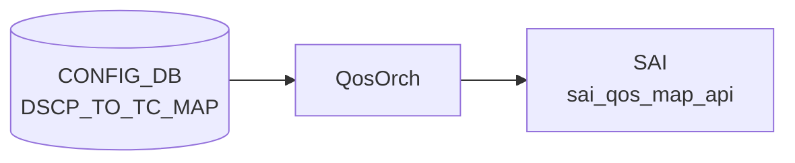

# DSCP_TO_TC_MAP テーブル

## 概要

[DSCP](../../reference/glossary.md#term-dscp) 値 (0..63) を Traffic Class へマップする ingress [QoS](../../reference/glossary.md#term-qos) 分類定義[^1]。`qosorch` が [SAI](../../reference/glossary.md#term-sai) [QoS](../../reference/glossary.md#term-qos) map (`SAI_QOS_MAP_TYPE_DSCP_TO_TC`) を生成し、ポートにバインドする (`PORT_QOS_MAP.dscp_to_tc_map`)。

<!-- cdb-mermaid -->
### データフロー (自動生成)



!!! note "凡例"
    CONFIG_DB から SAI までの典型経路を `docs/reference/config-db-orch-map.md` から機械生成したミニ図。詳細・例外は本ページ本文と対応表を参照。
<!-- /cdb-mermaid -->

## key 構造

```text
DSCP_TO_TC_MAP|<name>|<dscp>
```

`<name>` はマップ名（1..32 文字、`[a-zA-Z0-9][-a-zA-Z0-9_]*`）。`<dscp>` は 0..63。

## フィールド一覧

| フィールド | 型 | 必須 | 説明 |
|-----------|----|------|------|
| `name` (key) | string (1..32) | ✅ | マップ名 |
| `dscp` (key) | string `0..63` | ✅ | [DSCP](../../reference/glossary.md#term-dscp) 値 |
| `tc` | `tc_type` (0..7) | - | 対応 TC |

[YANG](../../reference/glossary.md#term-yang) 上は親子 list 構造。[Redis](../../reference/glossary.md#term-redis) に展開すると `DSCP_TO_TC_MAP|<name>` の hash field として `<dscp>: <tc>` ペアが格納される。

<!-- value-behavior -->
## 値依存挙動マトリクス

### `dscp` (key: string 0..63)

| 値 | 挙動 |
|----|------|
| `0`..`63` | qosorch が SAI_QOS_MAP_TYPE_DSCP_TO_TC エントリを生成 |
| 範囲外 | YANG 違反で reject |

### `tc` (tc_type: 0..7)

| 値 | 挙動 |
|----|------|
| `0`..`7` | [SAI](../../reference/glossary.md#term-sai) QoS map オブジェクトの Traffic Class 値として設定 |
| 8 以上 | [ASIC](../../reference/glossary.md#term-asic) が拒否（SAI エラー） |

> 明示的な enum 制約なし（スパース定義可能）。PORT_QOS_MAP.dscp_to_tc_map から参照されない限り SAI に反映されない。未定義 [DSCP](../../reference/glossary.md#term-dscp) はデフォルト TC=0 になるのが一般的。

<!-- /value-behavior -->

## 購読者

- `qosorch`: [SAI](../../reference/glossary.md#term-sai) [QoS](../../reference/glossary.md#term-qos) map 生成
- `bufferorch` 経由でポート PG への影響あり

## 関連 CONFIG_DB / YANG / CLI

- 関連 [CONFIG_DB](../../reference/glossary.md#term-config_db): `PORT_QOS_MAP`、`TC_TO_QUEUE_MAP`、`TC_TO_PRIORITY_GROUP_MAP`
- 関連 CLI: なし
- 関連 [YANG](../../reference/glossary.md#term-yang): `sonic-dscp-tc-map`

<!-- ref-triangle:start -->

## 関連リファレンス

- [YANG](../../reference/glossary.md#term-yang): [`sonic-dscp-tc-map`](../yang/sonic-dscp-tc-map.md)

<!-- ref-triangle:end -->

## 引用元

[^1]: YANG 定義: `sonic-dscp-tc-map.yang`. <https://github.com/sonic-net/sonic-buildimage/blob/9ea932ec2e18f35e58268ec2e4456b1d4afd65cd/src/sonic-yang-models/yang-models/sonic-dscp-tc-map.yang>

<!-- topics-back-ref -->
## 関連 Topics

- [Topics: QoS / Buffer / PFC / Watermark](../../topics/08-qos-buffer/index.md)

<!-- /topics-back-ref -->

<!-- ops-hint -->
## 運用ヒント

### 典型値

- key 形式: `DSCP_TO_TC_MAP|<name>` (例 `AZURE`)。
- 値: `0:0`, `8:1`, `16:0`, `24:3`, `48:6` 等の dscp→TC マップ。

### よくある誤設定

- TC を 8 以上に書くと [ASIC](../../reference/glossary.md#term-asic) が拒否（TC は 0..7）。

### 確認コマンド

```bash
sonic-db-cli CONFIG_DB hgetall 'DSCP_TO_TC_MAP|AZURE'
show qos map dscp-tc
```
<!-- /ops-hint -->

<!-- cdb-exceptions -->
## 例外条件・特殊挙動

| consumer | 条件 | 挙動 |
|---|---|---|
| [orchagent](../../reference/glossary.md#term-orchagent) | DEL 時に PORT / TUNNEL から参照中 | `m_pendingRemove=true` を立てて `task_need_retry` を返す（qosorch.cpp:181-186） |
| [orchagent](../../reference/glossary.md#term-orchagent) | スイッチに DSCP→TC map 適用前の capability 確認 | `querySwitchCapability(SAI_SWITCH_ATTR_QOS_DSCP_TO_TC_MAP)` で未対応の場合はスイッチレベルへの適用をスキップ（qosorch.cpp:1956） |
| [orchagent](../../reference/glossary.md#term-orchagent) | スイッチレベルで DSCP map 解除 (null 設定) | `SAI_NULL_OBJECT_ID` を渡して解除可能（qosorch.cpp:1993） |
| orchagent | SAI 生成・変更・削除失敗 | `task_failed` を返す。DOT1P_TO_TC_MAP と同一の `QosMapHandler` を使用（qosorch.cpp:151-191） |

> **Evidence**: [sonic-swss](../../reference/glossary.md#term-sonic-swss) `orchagent/qosorch.cpp:1956,1993`; `orchagent/tunneldecaporch.cpp:831-834`
<!-- /cdb-exceptions -->

<!-- failure -->
## 失敗挙動 (Phase D)

### 不正 DSCP / TC 値 → `task_invalid_entry`

`DscpToTcMapHandler::convertFieldValuesToAttributes()` は DSCP キーと TC 値を `stoi()` で `uint8_t` に変換するのみで **範囲バリデーションを行わない**。

| 条件 | 挙動 |
|------|------|
| DSCP フィールドが非数値文字列 | `std::invalid_argument` 例外 → `task_invalid_entry` (qosorch.cpp:147) |
| TC 値が非数値文字列 | 同上 |
| 未知オペレーション (SET/DEL 以外) | `"Unknown operation type %s"` ログ → `task_invalid_entry` (qosorch.cpp:198-199) |

> `#define DSCP_MAX_VAL 63` (qosorch.cpp:119) は `DscpToFcMapHandler` の検証に使われるが、`DscpToTcMapHandler` では **使用されない**。範囲外 DSCP (64..255) を書いても orchagent 側ではじかれず SAI に渡される（[ASIC](../../reference/glossary.md#term-asic) が reject する）。

### SAI `qos_map_api` 失敗 → `task_failed`

| 操作 | SAI API | エラーログ | 戻り値 |
|------|---------|-----------|--------|
| 新規作成 | `create_qos_map()` | `"Failed to create dscp_to_tc map. status:%d"` | `SAI_NULL_OBJECT_ID` → `task_failed` (qosorch.cpp:274-277) |
| 既存更新 | `set_qos_map_attribute()` | `"Failed to modify map. status:%d"` | `false` → `task_failed` (qosorch.cpp:210-212) |
| 削除 | `remove_qos_map()` | `"Failed to remove DSCP_TO_TC map, status:%d"` | `false` → `task_failed` (qosorch.cpp:290-293) |

`task_failed` を受け取った orchagent はエラーとして記録し **自動再試行しない**。

### MAP 削除時の参照存在チェック → `task_need_retry` ロック

DEL 受信時に `processWorkItem()` は以下を順に評価する (qosorch.cpp:174-194):

1. **MAP が存在しない** (`sai_object == SAI_NULL_OBJECT_ID`) → `"Object with name:%s not found."` + `task_invalid_entry`
2. **参照中** (`isObjectBeingReferenced()` = true) → `m_pendingRemove = true` セット + `task_need_retry`
   - 参照元: `PORT_QOS_MAP` の `dscp_to_tc_map` フィールド、`TUNNEL_DECAP_TABLE` の tunnel qos map
   - pending_remove 中に SET が届いた場合も `task_need_retry` を返す (qosorch.cpp:136-139)
   - 参照が解除されると次回 Consumer ループで DEL が再処理され正常削除される
3. **SAI 削除失敗** → `"Failed to remove QoS map. db name:%s sai object:..."` + `task_failed` (qosorch.cpp:190-191)

> **Evidence**: `sonic-swss/orchagent/qosorch.cpp:119,124-201,235-303`
<!-- /failure -->

<!-- runtime-trace -->
## 実コンテナ動作トレース

### 段階 1 — Consumer 登録

`QosOrch` (orchagent 直接 CFG 購読) が [CONFIG_DB](../../reference/glossary.md#term-config_db) の `DSCP_TO_TC_MAP` テーブルを購読する。

`DSCP_TO_TC_MAP` の key はマップ名 (例: `AZURE`)。DSCP 値 (0-63) → TC (0-7) のマッピング。

### 段階 2 — CFG→APPL 翻訳

なし (orchagent が直接 CONFIG_DB を購読)

### 段階 3 — APPL→SAI

`sai_qos_map_api` — `sai_create_qos_map` で DSCP→TC マッピングテーブルを作成

### 段階 4 — タイミングと副作用

**適用タイミング**: orchagent が CONFIG_DB 変化を検知後即座に SAI QoS map を作成/更新。ポートへの割り当ては `PORT_QOS_MAP` で行う。

**副作用**: DSCP→TC マップ変更はそのマップを使用するすべてのポートの QoS 分類に即座に影響。L3 traffic の優先度処理が変化する。
<!-- /runtime-trace -->

<!-- pubsub -->
## 通信メカニズム (Phase G)

### 購読方式

`QosOrch` は `orchdaemon.cpp:367-384` で `qos_tables` ベクタの一員として `CFG_DSCP_TO_TC_MAP_TABLE_NAME` を指定され、`new QosOrch(m_configDb, qos_tables)` に渡される。基底 `Orch(db, tableNames)` が `Orch::addConsumer()` を呼び、CONFIG_DB ID の分岐により **`swss::SubscriberStateTable`** が選択される（`orch.cpp:1186-1196`）。

`SubscriberStateTable` は [Redis](../../reference/glossary.md#term-redis) keyspace 通知 `__keyspace@<dbId>__:DSCP_TO_TC_MAP|*` を **`PSUBSCRIBE`** で購読し、通知受信後に `HGETALL` で値を再取得して `(key, op, fvs)` タプルを返す。バッチサイズは `TableConsumable::DEFAULT_POP_BATCH_SIZE = 128`（ハードコード、`orchagent -b` の `gBatchSize` 影響なし）。

### ハンドラ登録とディスパッチ

```
orchdaemon.cpp:367-384  qos_tables に CFG_DSCP_TO_TC_MAP_TABLE_NAME を追加
qosorch.cpp:1329        initTableHandlers() で m_qos_handler_map[CFG_DSCP_TO_TC_MAP_TABLE_NAME]
                         = &QosOrch::handleDscpToTcTable を登録
qosorch.cpp:2231-2252   QosOrch::doTask() が PORT_QOS_MAP / QUEUE より先に本テーブルを drain
                         （DSCP map の先行処理を保証）
qosorch.cpp:2254-2295   QosOrch::doTask(Consumer&) がハンドラ関数ポインタ経由でディスパッチ
```

`handleDscpToTcTable()` → `DscpToTcMapHandler::processWorkItem()` → `DscpToTcMapHandler::createAttributeList()` → `sai_qos_map_api->create_qos_map()` / `set_qos_map_attribute()` / `remove_qos_map()`。

### select タイムアウト・リトライ

select タイムアウト: **1000 ms**（`SELECT_TIMEOUT`、`orchdaemon.cpp:23`）。keyspace 通知到着時は即時 wake up。リトライキャッシュは未使用で `m_toSync` 残留方式（`task_need_retry` 時はエントリを保持し次回 drain で再処理）。

| 観点 | 内容 |
|---|---|
| 購読方式 | `SubscriberStateTable`（keyspace `PSUBSCRIBE` + `HGETALL`） |
| バッチサイズ | 128（`DEFAULT_POP_BATCH_SIZE`、固定） |
| select タイムアウト | 1000 ms |
| SAI 呼び出し | `sai_qos_map_api->create_qos_map()` / `set_qos_map_attribute()` / `remove_qos_map()` |
| リトライ方式 | `m_toSync` 残留（キャッシュなし） |
| channel PUBLISH | 使わない |
| TTL | 未使用（CONFIG_DB 永続） |

> **Evidence**: `orchdaemon.cpp:22-23,367-384`; `orch.cpp:1186-1196`; `qosorch.cpp:1313-1345,2231-2295`; `table.h:164`
<!-- /pubsub -->

<!-- entry-points -->
## 書き込み入り口 (Direction A)

対象テーブル: `DSCP_TO_TC_MAP`

### CLI
- `config qos map dscp-tc add/del <map-name> <dscp> <tc>`
  - ソース: `sonic-utilities/config/main.py (qos グループ)`

### minigraph / sonic-cfggen
- なし

### REST / gNMI (sonic-mgmt-common)
- なし (対応 OpenConfig/[SONiC](../../reference/glossary.md#term-sonic) YANG transformer なし)

### db_migrator
- なし

### ビルド時デフォルト (init_cfg / j2 テンプレート)
- `qos_config.j2` から platform 別 DSCP→TC マップが生成される場合あり

### ハードコードデフォルト
- なし

### ランタイム注入 (デーモン自動書き込み)
- なし
<!-- /entry-points -->

<!-- ordering -->
## 書込み順依存 (Phase B)

対象テーブル: `DSCP_TO_TC_MAP`。Consumer: `QosOrch::handleDscpToTcTable()` / `handlePortQosMapTable()` (`qosorch.cpp`)。
スキャン範囲: `qosorch.cpp` 全行精読、`tunneldecaporch.cpp:101-302`、`db_migrator.py:700-715`。

### SET 時の順序制約

| # | 依存関係 | 方向 | 挙動 |
|---|----------|------|------|
| 1 | `DSCP_TO_TC_MAP\|<name>` SAI 作成完了 → `PORT_QOS_MAP\|<port>` SET | 強制先行 | `resolveFieldRefValue()` 未解決で `task_need_retry`（自動再試行） |
| 2 | `DSCP_TO_TC_MAP\|<name>` 作成 → `PORT_QOS_MAP\|global` SET（Broadcom） | 強制先行 | 同上。db_migrator が自動生成するが複数マップ時は `get_keys()` 先頭 1 件（順序未定義） |
| 4 | `DSCP_TO_TC_MAP\|<name>` 作成 → `TUNNEL_DECAP_TABLE\|<name>` SET | 強制先行 | `resolveTunnelQosMap()` 未解決で `task_need_retry`（フィールド未指定は silent skip） |
| 6 | dscp 値は数値文字列のみ | 必須 | `stoi()` に例外処理なし。非数値 → `std::invalid_argument` → `task_failed`（自動 retry なし） |

> **推奨順序（SET）**: `DSCP_TO_TC_MAP|<name>` → `PORT_QOS_MAP|<port>` → `TUNNEL_DECAP_TABLE`（参照順に書く）。

### DEL 時の順序制約

| # | 依存関係 | 方向 | 挙動 |
|---|----------|------|------|
| 3 | `PORT_QOS_MAP\|<port>` / Tunnel の参照解除 → `DSCP_TO_TC_MAP\|<name>` DEL | 強制先行 | 参照中は `m_pendingRemove=true` + `task_need_retry` ロック（`qosorch.cpp:181-186`） |
| 5 | pending_remove 解消 → SET（再書き込み）実行可能 | 強制先行 | pending_remove 中の SET も即 `task_need_retry` 返却（ロールバック・入れ替えもブロック） |

> **推奨順序（DEL）**: `PORT_QOS_MAP|<port>` の `dscp_to_tc_map` フィールド削除（参照ポート全解除）→ `DSCP_TO_TC_MAP|<name>` DEL。

### SAI 操作失敗と retry なし

- CREATE / SET / DELETE で SAI エラーが発生した場合、`task_failed` を返し自動 retry は行われない（`qosorch.cpp:151-191`）。
- `DscpToTcMapHandler` の dscp 文字列変換 (`stoi()`) に例外処理なし。非数値文字列 → `std::invalid_argument` → `task_failed`（`Dot1pToTcMapHandler` は try/catch あり、`DscpToTcMapHandler` はなし）。

### PORT_QOS_MAP からの参照順（SAI_PORT_ATTR_QOS_DSCP_TO_TC_MAP）

- `PORT_QOS_MAP` の `dscp_to_tc_map` フィールドが `SAI_PORT_ATTR_QOS_DSCP_TO_TC_MAP` にマップされる（`qosorch.cpp:61`）。
- `PORT_QOS_MAP|global` ではスイッチレベル属性 `SAI_SWITCH_ATTR_QOS_DSCP_TO_TC_MAP` を使用（ポートごとと別属性）。
- Broadcom 向け自動生成: `db_migrator.migrate_port_qos_map_global()` が `DSCP_TO_TC_MAP` の最初の 1 件を `PORT_QOS_MAP|global` へ自動登録（複数マップ存在時は `get_keys()` 返却順で先頭、順序未定義）。

> **Evidence**: `qosorch.cpp:61,136-139,181-191,2021-2026,2124-2129`; `tunneldecaporch.cpp:217-221,831-836`; `db_migrator.py:700-715`
<!-- /ordering -->

<!-- defaults -->
## コード由来の暗黙デフォルト・制約

### `tc` フィールド — YANG-実装 discrepancy

| 観点 | 内容 |
|------|------|
| YANG 定義 | `stypes:tc_type` = `uint8 range "0..15"` (`sonic-types.yang.j2:338`) |
| SAI/ASIC 実態 | 大多数の ASIC は TC 0..7 のみサポート。TC 8..15 を設定すると SAI エラー → `task_failed` |
| 結論 | **YANG は 0..15 を許可するが、実運用上 8..15 は ASIC に reject される** (silent エラーでなく task_failed) |

### `dscp` フィールド (key) — 暗黙の型変換と例外処理欠如

- CONFIG_DB に格納される型は **string** (`"0"`..`"63"`)
- `qosorch.cpp:245`: `(uint8_t)stoi(fvField(*i))` で uint8 変換 → SAI へ渡す
- **例外処理なし**: 数値以外の文字列を書くと `std::invalid_argument` が投げられ `task_failed`（[`Dot1pToTcMapHandler`](../../reference/glossary.md#term-orchagent) は try/catch あり、`DscpToTcMapHandler` は **なし**）

### 未定義 DSCP のデフォルト TC (スパース定義時)

- 0..63 全エントリの定義は不要（スパース定義可能）
- 未定義 DSCP のデフォルト TC は **ASIC/SAI 実装依存**（一般的に TC=0 だが非保証）
- [SONiC](../../reference/glossary.md#term-sonic) 標準 AZURE マップは全 64 エントリを明示定義 (`qos_config.j2:265-332`)

### ビルド時ハードコードデフォルト (`qos_config.j2`)

プラットフォーム固有 `generate_dscp_to_tc_map` マクロ未定義時のフォールバック AZURE マップ:

| DSCP | TC | 備考 |
|------|----|------|
| 3 | 3 | CS0 相当 lossless |
| 4 | 4 | CS0 相当 lossless |
| 5 | 2 | — |
| 8 | 0 | CS1: best-effort |
| 46 | 5 | EF: expedited forwarding |
| 48 | 6 | CS6: network control |
| その他 | 1 | デフォルト低優先度 |

- **LeafRouter + tunnel_qos_remap_enable**: uplink ポートには `AZURE_UPLINK` マップを使用
- **DualToR + uplink**: 同様に `AZURE_UPLINK` を使用

### `PORT_QOS_MAP|global` — スイッチレベル適用の条件分岐

| 条件 | 挙動 |
|------|------|
| `SAI_SWITCH_ATTR_QOS_DSCP_TO_TC_MAP` 非対応 | `querySwitchCapability()` が false → **適用スキップ（エラーなし）** |
| Broadcom ASIC かつ `PORT_QOS_MAP|global` 未存在 | `db_migrator.migrate_port_qos_map_global()` が **自動生成** |
| 複数の DSCP_TO_TC_MAP 存在時 | `get_keys()` の **最初の 1 件** を使用（順序未定義） |

> **Evidence**: `qosorch.cpp:1956` (capability check), `db_migrator.py:704-715` (Broadcom 限定自動生成)

### DEL 時の pending_remove ロック

- 参照中 (PORT_QOS_MAP / TUNNEL) のマップへ DEL → `m_pendingRemove = true` + `task_need_retry`
- pending_remove 中に SET が来ても **実行せず** `task_need_retry` を返す
- Tunnel decap 経路 (`tunneldecaporch.cpp:832-836`): `dscp_to_tc_map_id == SAI_NULL_OBJECT_ID` 時はトンネル作成時に設定しない（silent skip）
<!-- /defaults -->

<!-- constants -->
## ハードコード定数 (Phase E)

ソース: `sonic-swss/orchagent/qosorch.cpp`、`sonic-swss/orchagent/qosorch.h`

### DSCP / TC 範囲定数

| 定数名 | 値 | 定義箇所 | 説明 |
|--------|----|---------|------|
| `DSCP_MAX_VAL` | `63` | `qosorch.cpp:119` | `DscpToFcMapHandler` のみで参照される定数。`DscpToTcMapHandler` では使用されない |
| DSCP key 範囲 | `0`..`63` | YANG / 仕様上の有効範囲 | `DscpToTcMapHandler` では範囲チェックなし。64..255 も `stoi` 成功すれば SAI に渡され ASIC が reject する |
| TC value 範囲 (YANG) | `0`..`15` | `sonic-types.yang.j2:338` | YANG 定義上の上限 |
| TC value 範囲 (実運用) | `0`..`7` | ASIC/SAI 制約 | 8 以上は SAI エラー → `task_failed` |

### フィールド名定数

| 定数名 | 値 | 定義箇所 | 説明 |
|--------|----|---------|------|
| `dscp_to_tc_field_name` | `"dscp_to_tc_map"` | `qosorch.h:11` | PORT_QOS_MAP フィールド名 |
| `decap_dscp_to_tc_field_name` | `"decap_dscp_to_tc_map"` | `qosorch.h:34` | Tunnel decap 用フィールド名 |

### デフォルトマップ名

| マップ名 | 用途 |
|---------|------|
| `"AZURE"` | 標準 DSCP→TC マップ（`qos_config.j2` フォールバック） |
| `"AZURE_TUNNEL"` | Tunnel QoS 用 `decap_dscp_to_tc_map` |

### SAI 定数

| 定数 | 使用箇所 | 説明 |
|------|---------|------|
| `SAI_QOS_MAP_TYPE_DSCP_TO_TC` | `qosorch.cpp:265` | SAI qos_map_type — マップ種別指定 |
| `SAI_QOS_MAP_ATTR_TYPE` | `qosorch.cpp:264` | create 時の type 属性 ID |
| `SAI_QOS_MAP_ATTR_MAP_TO_VALUE_LIST` | `qosorch.cpp:249,268` | マップエントリリスト属性 ID |
| `SAI_PORT_ATTR_QOS_DSCP_TO_TC_MAP` | `qosorch.cpp:61` | ポートバインド属性 ID |
| `SAI_SWITCH_ATTR_QOS_DSCP_TO_TC_MAP` | `qosorch.cpp:1993,2030` | スイッチレベルバインド属性 ID |

### 型変換・例外処理

- `qosorch.cpp:245`: `(uint8_t)stoi(fvField(*i))` — DSCP key を uint8 変換。非数値文字列は `std::invalid_argument` → `task_failed`（try/catch なし）
- `qosorch.cpp:246`: `(uint8_t)stoi(fvValue(*i))` — TC 値も同様

> **Evidence**: `sonic-swss/orchagent/qosorch.cpp:119,245-246,264-265,273`; `orchagent/qosorch.h:11,34`
<!-- /constants -->

<!-- cross-refs -->
## 暗黙参照テーブル (Phase C)

ソース: `sonic-swss/orchagent/qosorch.cpp`

### PORT_QOS_MAP への参照

`DSCP_TO_TC_MAP|<name>` は `PORT_QOS_MAP|<port>` の `dscp_to_tc_map` フィールドから名前参照される。
`QosOrch::handlePortQosMapTable()` が `resolveFieldRefValue()` で DSCP_TO_TC_MAP オブジェクトを解決し、`SAI_PORT_ATTR_QOS_DSCP_TO_TC_MAP` としてポートへバインドする（`qosorch.cpp:100,103`）。

`PORT_QOS_MAP|global`（スイッチレベル）では `handleGlobalQosMap()` が `applyDscpToTcMapToSwitch(SAI_SWITCH_ATTR_QOS_DSCP_TO_TC_MAP, id)` を呼び出して SAI スイッチ属性として設定する（`qosorch.cpp:1988,2030-2032`）。

| 参照元 | フィールド | SAI 属性 | ソース行 |
|--------|-----------|----------|---------|
| `PORT_QOS_MAP\|<port>` | `dscp_to_tc_map` | `SAI_PORT_ATTR_QOS_DSCP_TO_TC_MAP` | `qosorch.cpp:61,100` |
| `PORT_QOS_MAP\|global` | `dscp_to_tc_map` | `SAI_SWITCH_ATTR_QOS_DSCP_TO_TC_MAP` | `qosorch.cpp:1956,1988,2030` |

### SWITCH_TABLE (スイッチ capability) への参照

スイッチレベル適用前に `gSwitchOrch->querySwitchCapability(SAI_OBJECT_TYPE_SWITCH, SAI_SWITCH_ATTR_QOS_DSCP_TO_TC_MAP)` で対応可否を問い合わせる。
未対応の場合は適用をスキップ（エラーなし）。スイッチ能力テーブル `SWITCH_TABLE` に格納された capability 情報を参照している（`qosorch.cpp:1955-1961`）。

| 参照先 | 用途 | ソース行 |
|--------|------|---------|
| `SWITCH_TABLE` (capability) | `SAI_SWITCH_ATTR_QOS_DSCP_TO_TC_MAP` サポート確認 | `qosorch.cpp:1956` |

### TC_TO_QUEUE_MAP との関係

`PORT_QOS_MAP` は `dscp_to_tc_map` と `tc_to_queue_map` を同一エントリで保持し、DSCP→TC→Queue の 2 段マッピングを形成する。
`qos_to_ref_table_map` に両テーブルが同列で登録されており、`PORT_QOS_MAP` SET 時は両マップが未解決なら `task_need_retry` となる（`qosorch.cpp:103,1332`）。

| 参照元 | フィールド | 関連テーブル | ソース行 |
|--------|-----------|-------------|---------|
| `PORT_QOS_MAP\|<port>` | `tc_to_queue_map` | `TC_TO_QUEUE_MAP` | `qosorch.cpp:64,103` |

> **Evidence**: `sonic-swss/orchagent/qosorch.cpp:61,64,81,84,100,103,1329,1332,1955-1956,1988,2030-2032`
<!-- /cross-refs -->

<!-- side-effects -->
## 副次 DB 書込 (Phase F)

ソース: `sonic-swss/orchagent/qosorch.cpp`、`sonic-swss/orchagent/tunneldecaporch.cpp`

`DSCP_TO_TC_MAP` を SET/DEL した際に [orchagent](../../reference/glossary.md#term-orchagent) が書き込む副次 DB を示す。cfgmgr ステージは存在しない（[CONFIG_DB](../../reference/glossary.md#term-config_db) → orchagent 直結）。[STATE_DB](../../reference/glossary.md#term-state_db) / APPL_STATE_DB への書き込みはない。

### SET — DSCP_TO_TC_MAP 作成・更新

| 操作 | 対象 DB / テーブル | キー / フィールド | 条件 |
|------|------------------|-----------------|------|
| `sai_qos_map_api->create_qos_map(SAI_QOS_MAP_TYPE_DSCP_TO_TC, ...)` | [ASIC_DB](../../reference/glossary.md#term-asic_db) ([syncd](../../reference/glossary.md#term-syncd) 経由) / `ASIC_STATE:SAI_OBJECT_TYPE_QOS_MAP` | `<qos_map_oid>` | 新規マップ作成 (qosorch.cpp:265-276) |
| `sai_qos_map_api->set_qos_map_attribute(...)` | [ASIC_DB](../../reference/glossary.md#term-asic_db) ([syncd](../../reference/glossary.md#term-syncd) 経由) / `ASIC_STATE:SAI_OBJECT_TYPE_QOS_MAP` | `<qos_map_oid>` field=`SAI_QOS_MAP_ATTR_MAP_TO_VALUE_LIST` | 既存マップ更新時 (qosorch.cpp:207) |

### SET — PORT_QOS_MAP によるポートバインド

`PORT_QOS_MAP|<port>` に `dscp_to_tc_map` フィールドを書いた際の副次書き込み:

| 操作 | 対象 DB / テーブル | キー / フィールド | 条件 |
|------|------------------|-----------------|------|
| `sai_port_api->set_port_attribute(SAI_PORT_ATTR_QOS_DSCP_TO_TC_MAP, oid)` | [ASIC_DB](../../reference/glossary.md#term-asic_db) ([syncd](../../reference/glossary.md#term-syncd) 経由) / `ASIC_STATE:SAI_OBJECT_TYPE_PORT` | `<port_oid>` field=`SAI_PORT_ATTR_QOS_DSCP_TO_TC_MAP` | 参照先 DSCP_TO_TC_MAP が SAI 解決済みの各ポート (qosorch.cpp:2086,2193) |

### SET — PORT_QOS_MAP|global によるスイッチレベル適用

| 操作 | 対象 DB / テーブル | キー / フィールド | 条件 |
|------|------------------|-----------------|------|
| `sai_switch_api->set_switch_attribute(SAI_SWITCH_ATTR_QOS_DSCP_TO_TC_MAP, oid)` | ASIC_DB (syncd 経由) / `ASIC_STATE:SAI_OBJECT_TYPE_SWITCH` | `<switch_oid>` field=`SAI_SWITCH_ATTR_QOS_DSCP_TO_TC_MAP` | PORT_QOS_MAP\|global 指定かつ `querySwitchCapability()` が true (qosorch.cpp:1956-1975) |

### DEL — DSCP_TO_TC_MAP 削除

| 操作 | 対象 DB / テーブル | キー / フィールド | 条件 |
|------|------------------|-----------------|------|
| `sai_qos_map_api->remove_qos_map(sai_object)` | ASIC_DB (syncd 経由) / `ASIC_STATE:SAI_OBJECT_TYPE_QOS_MAP` 削除 | `<qos_map_oid>` | PORT_QOS_MAP / TUNNEL 非参照時 (qosorch.cpp:289-293) |
| pending_remove=true → `task_need_retry`（削除スキップ） | — | — | PORT_QOS_MAP または TUNNEL_DECAP_TABLE から参照中 (qosorch.cpp:181-186) |

### DEL — PORT_QOS_MAP|global によるスイッチレベル解除

| 操作 | 対象 DB / テーブル | キー / フィールド | 条件 |
|------|------------------|-----------------|------|
| `sai_switch_api->set_switch_attribute(SAI_SWITCH_ATTR_QOS_DSCP_TO_TC_MAP, SAI_NULL_OBJECT_ID)` | ASIC_DB (syncd 経由) / `ASIC_STATE:SAI_OBJECT_TYPE_SWITCH` | `<switch_oid>` field=`SAI_SWITCH_ATTR_QOS_DSCP_TO_TC_MAP` | PORT_QOS_MAP\|global の dscp_to_tc_map フィールド存在時 (qosorch.cpp:1993) |

### TUNNEL_DECAP_TABLE 経由の副次書き込み

DSCP_TO_TC_MAP は `TUNNEL_DECAP_TABLE` の `decap_dscp_to_tc_map` フィールドからも参照される:

| 操作 | 対象 DB / テーブル | キー / フィールド | 条件 |
|------|------------------|-----------------|------|
| `sai_tunnel_api->create_tunnel(..., SAI_TUNNEL_ATTR_DECAP_QOS_DSCP_TO_TC_MAP, oid)` | ASIC_DB (syncd 経由) / `ASIC_STATE:SAI_OBJECT_TYPE_TUNNEL` | `<tunnel_oid>` field=`SAI_TUNNEL_ATTR_DECAP_QOS_DSCP_TO_TC_MAP` | `dscp_to_tc_map_id != SAI_NULL_OBJECT_ID` (tunneldecaporch.cpp:831-834) |

`dscp_to_tc_map_id == SAI_NULL_OBJECT_ID` の場合はトンネル作成時に属性をスキップ（silent skip）。

### 副次書き込みサマリ

| DB | テーブル / 属性 | SET 時 | DEL 時 |
|----|----------------|--------|--------|
| ASIC_DB | `ASIC_STATE:SAI_OBJECT_TYPE_QOS_MAP` | create / update (syncd 経由) | remove (syncd 経由, 非参照時のみ) |
| ASIC_DB | `ASIC_STATE:SAI_OBJECT_TYPE_PORT` field=`SAI_PORT_ATTR_QOS_DSCP_TO_TC_MAP` | set_port_attribute (syncd 経由) | set SAI_NULL_OBJECT_ID (PORT_QOS_MAP DEL 時) |
| ASIC_DB | `ASIC_STATE:SAI_OBJECT_TYPE_SWITCH` field=`SAI_SWITCH_ATTR_QOS_DSCP_TO_TC_MAP` | set_switch_attribute (syncd 経由, global あり) | SAI_NULL_OBJECT_ID (global DEL 時) |
| ASIC_DB | `ASIC_STATE:SAI_OBJECT_TYPE_TUNNEL` field=`SAI_TUNNEL_ATTR_DECAP_QOS_DSCP_TO_TC_MAP` | create_tunnel (syncd 経由, 非 null 時) | — |
| [APPL_DB](../../reference/glossary.md#term-appl_db) | — | なし | なし |
| [STATE_DB](../../reference/glossary.md#term-state_db) | — | なし | なし |
| APPL_STATE_DB | — | なし | なし |
| [COUNTERS_DB](../../reference/glossary.md#term-counters_db) | — | なし | なし |

> **Evidence**: `sonic-swss/orchagent/qosorch.cpp:61,181-186,207,265-276,289-293,1956-1975,1993,2086,2193`; `orchagent/tunneldecaporch.cpp:831-834,1084`
<!-- /side-effects -->

<!-- platform -->
## プラットフォーム差分 (Phase H)

> 調査証跡: `meta/_intermediate/cdb-flow/dscp-to-tc-map-platform.md`

### SAI capability クエリによる分岐

スイッチレベルへの DSCP→TC map 適用時、`applyDscpToTcMapToSwitch()` は
`sai_query_attribute_capability(SAI_SWITCH_ATTR_QOS_DSCP_TO_TC_MAP)` で
`set_implemented` を確認する (`qosorch.cpp:1955-1975`)。

| SAI 応答 | 挙動 |
|---------|------|
| `set_implemented == true` | `sai_switch_api->set_switch_attribute()` を発行 |
| `set_implemented == false` または query 失敗 | **silent skip**（エラーなし、`true` を返す） |

`SAI_SWITCH_ATTR_QOS_DSCP_TO_TC_MAP` 非対応 ASIC では `PORT_QOS_MAP|global` 設定はノーオペレーションになる。

### Broadcom: スイッチレベル global map の自動生成

`db_migrator.py:700-715` の `migrate_port_qos_map_global()`:

```python
asics_require_global_dscp_to_tc_map = ["broadcom"]
if self.asic_type not in asics_require_global_dscp_to_tc_map:
    return
```

- **Broadcom ASIC のみ**がアップグレード時に `PORT_QOS_MAP|global` を自動生成する。
- 複数の `DSCP_TO_TC_MAP` が存在する場合は `get_keys()` の **先頭 1 件（順序未定義）** を適用。
- Mellanox / その他 ASIC ではこの自動生成は行われない。

### Mellanox: AZURE_UPLINK マップと tunnel_qos_remap

Mellanox プラットフォーム向け `qos.json.j2` は `different_dscp_to_tc_map = true` を設定し、
`generate_dscp_to_tc_map()` マクロで `AZURE` と `AZURE_UPLINK` の 2 種類を生成する。

`qos_config.j2` はデバイスタイプに応じてポートへの割り当てを切り替える:

| デバイスタイプ | `tunnel_qos_remap` | 適用マップ |
|---|---|---|
| LeafRouter（ToR 隣接ポート） | enabled | `AZURE_UPLINK` |
| DualToR（LeafRouter 隣接ポート） | enabled | `AZURE_UPLINK` |
| その他全ポート | enabled | `AZURE` |
| 全デバイス | disabled | `AZURE`（single map） |

### TC 範囲の ASIC 差分

YANG 定義は `tc_type: uint8 range "0..15"` だが、実際の ASIC 対応は以下の通り:

| ASIC | 実用 TC 範囲 | 備考 |
|------|------------|------|
| Broadcom（大多数） | 0..7 | TC 8+ で SAI エラー → `task_failed` |
| Mellanox（大多数） | 0..7 | 同上 |
| 一部高性能 ASIC | 0..15（可能性） | SAI ベンダー実装依存 |

> **Evidence**: `qosorch.cpp:1955-1975` (capability check); `db_migrator.py:700-715` (Broadcom 限定自動生成); `qos_config.j2:437-447` (AZURE_UPLINK 条件分岐); `device/mellanox/.../qos.json.j2:23,160-170` (`different_dscp_to_tc_map`)
<!-- /platform -->

<!-- glossary-links-injected: c34ced7733b8 -->
