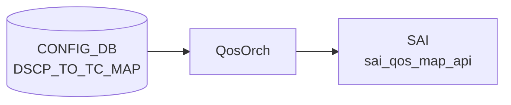

# DSCP_TO_TC_MAP テーブル

## 概要

DSCP 値 (0..63) を Traffic Class へマップする ingress [QoS](../../reference/glossary.md#term-qos) 分類定義[^1]。`qosorch` が [SAI](../../reference/glossary.md#term-sai) [QoS](../../reference/glossary.md#term-qos) map (`SAI_QOS_MAP_TYPE_DSCP_TO_TC`) を生成し、ポートにバインドする (`PORT_QOS_MAP.dscp_to_tc_map`)。

<!-- cdb-mermaid -->
### データフロー (自動生成)



!!! note "凡例"
    CONFIG_DB から SAI までの典型経路を `docs/reference/config-db-orch-map.md` から機械生成したミニ図。詳細・例外は本ページ本文と対応表を参照。
<!-- /cdb-mermaid -->

## key 構造

```
DSCP_TO_TC_MAP|<name>|<dscp>
```

`<name>` はマップ名（1..32 文字、`[a-zA-Z0-9][-a-zA-Z0-9_]*`）。`<dscp>` は 0..63。

## フィールド一覧

| フィールド | 型 | 必須 | 説明 |
|-----------|----|------|------|
| `name` (key) | string (1..32) | ✅ | マップ名 |
| `dscp` (key) | string `0..63` | ✅ | DSCP 値 |
| `tc` | `tc_type` (0..7) | - | 対応 TC |

[YANG](../../reference/glossary.md#term-yang) 上は親子 list 構造。[Redis](../../reference/glossary.md#term-redis) に展開すると `DSCP_TO_TC_MAP|<name>` の hash field として `<dscp>: <tc>` ペアが格納される。

## 購読者

- `qosorch`: [SAI](../../reference/glossary.md#term-sai) [QoS](../../reference/glossary.md#term-qos) map 生成
- `bufferorch` 経由でポート PG への影響あり

## 関連 CONFIG_DB / YANG / CLI

- 関連 [CONFIG_DB](../../reference/glossary.md#term-config_db): `PORT_QOS_MAP`、`TC_TO_QUEUE_MAP`、`TC_TO_PRIORITY_GROUP_MAP`
- 関連 CLI: なし
- 関連 [YANG](../../reference/glossary.md#term-yang): `sonic-dscp-tc-map`

<!-- ref-triangle:start -->

## 関連リファレンス

- [YANG](../../reference/glossary.md#term-yang): [`sonic-dscp-tc-map`](../yang/sonic-dscp-tc-map.md)

<!-- ref-triangle:end -->

## 引用元

[^1]: YANG 定義: `sonic-dscp-tc-map.yang`. <https://github.com/sonic-net/sonic-buildimage/blob/9ea932ec2e18f35e58268ec2e4456b1d4afd65cd/src/sonic-yang-models/yang-models/sonic-dscp-tc-map.yang>

<!-- topics-back-ref -->
## 関連 Topics

- [Topics: QoS / Buffer / PFC / Watermark](../../topics/08-qos-buffer/index.md)

<!-- /topics-back-ref -->

<!-- ops-hint -->
## 運用ヒント

### 典型値

- key 形式: `DSCP_TO_TC_MAP|<name>` (例 `AZURE`)。
- 値: `0:0`, `8:1`, `16:0`, `24:3`, `48:6` 等の dscp→TC マップ。

### よくある誤設定

- TC を 8 以上に書くと ASIC が拒否（TC は 0..7）。

### 確認コマンド

```bash
sonic-db-cli CONFIG_DB hgetall 'DSCP_TO_TC_MAP|AZURE'
show qos map dscp-tc
```
<!-- /ops-hint -->

<!-- glossary-links-injected: 1024efc8dead -->
