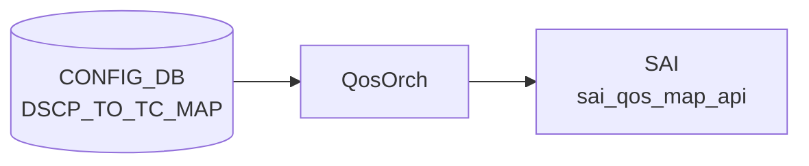

# DSCP_TO_TC_MAP テーブル

## 概要

[DSCP](../../reference/glossary.md#term-dscp) 値 (0..63) を Traffic Class へマップする ingress [QoS](../../reference/glossary.md#term-qos) 分類定義[^1]。`qosorch` が [SAI](../../reference/glossary.md#term-sai) [QoS](../../reference/glossary.md#term-qos) map (`SAI_QOS_MAP_TYPE_DSCP_TO_TC`) を生成し、ポートにバインドする (`PORT_QOS_MAP.dscp_to_tc_map`)。

<!-- cdb-mermaid -->
### データフロー (自動生成)



!!! note "凡例"
    CONFIG_DB から SAI までの典型経路を `docs/reference/config-db-orch-map.md` から機械生成したミニ図。詳細・例外は本ページ本文と対応表を参照。
<!-- /cdb-mermaid -->

## key 構造

```text
DSCP_TO_TC_MAP|<name>|<dscp>
```

`<name>` はマップ名（1..32 文字、`[a-zA-Z0-9][-a-zA-Z0-9_]*`）。`<dscp>` は 0..63。

## フィールド一覧

| フィールド | 型 | 必須 | 説明 |
|-----------|----|------|------|
| `name` (key) | string (1..32) | ✅ | マップ名 |
| `dscp` (key) | string `0..63` | ✅ | [DSCP](../../reference/glossary.md#term-dscp) 値 |
| `tc` | `tc_type` (0..7) | - | 対応 TC |

[YANG](../../reference/glossary.md#term-yang) 上は親子 list 構造。[Redis](../../reference/glossary.md#term-redis) に展開すると `DSCP_TO_TC_MAP|<name>` の hash field として `<dscp>: <tc>` ペアが格納される。

<!-- value-behavior -->
## 値依存挙動マトリクス

### `dscp` (key: string 0..63)

| 値 | 挙動 |
|----|------|
| `0`..`63` | qosorch が SAI_QOS_MAP_TYPE_DSCP_TO_TC エントリを生成 |
| 範囲外 | YANG 違反で reject |

### `tc` (tc_type: 0..7)

| 値 | 挙動 |
|----|------|
| `0`..`7` | [SAI](../../reference/glossary.md#term-sai) QoS map オブジェクトの Traffic Class 値として設定 |
| 8 以上 | ASIC が拒否（SAI エラー） |

> 明示的な enum 制約なし（スパース定義可能）。PORT_QOS_MAP.dscp_to_tc_map から参照されない限り SAI に反映されない。未定義 [DSCP](../../reference/glossary.md#term-dscp) はデフォルト TC=0 になるのが一般的。

<!-- /value-behavior -->

## 購読者

- `qosorch`: [SAI](../../reference/glossary.md#term-sai) [QoS](../../reference/glossary.md#term-qos) map 生成
- `bufferorch` 経由でポート PG への影響あり

## 関連 CONFIG_DB / YANG / CLI

- 関連 [CONFIG_DB](../../reference/glossary.md#term-config_db): `PORT_QOS_MAP`、`TC_TO_QUEUE_MAP`、`TC_TO_PRIORITY_GROUP_MAP`
- 関連 CLI: なし
- 関連 [YANG](../../reference/glossary.md#term-yang): `sonic-dscp-tc-map`

<!-- ref-triangle:start -->

## 関連リファレンス

- [YANG](../../reference/glossary.md#term-yang): [`sonic-dscp-tc-map`](../yang/sonic-dscp-tc-map.md)

<!-- ref-triangle:end -->

## 引用元

[^1]: YANG 定義: `sonic-dscp-tc-map.yang`. <https://github.com/sonic-net/sonic-buildimage/blob/9ea932ec2e18f35e58268ec2e4456b1d4afd65cd/src/sonic-yang-models/yang-models/sonic-dscp-tc-map.yang>

<!-- topics-back-ref -->
## 関連 Topics

- [Topics: QoS / Buffer / PFC / Watermark](../../topics/08-qos-buffer/index.md)

<!-- /topics-back-ref -->

<!-- ops-hint -->
## 運用ヒント

### 典型値

- key 形式: `DSCP_TO_TC_MAP|<name>` (例 `AZURE`)。
- 値: `0:0`, `8:1`, `16:0`, `24:3`, `48:6` 等の dscp→TC マップ。

### よくある誤設定

- TC を 8 以上に書くと ASIC が拒否（TC は 0..7）。

### 確認コマンド

```bash
sonic-db-cli CONFIG_DB hgetall 'DSCP_TO_TC_MAP|AZURE'
show qos map dscp-tc
```
<!-- /ops-hint -->

<!-- cdb-exceptions -->
## 例外条件・特殊挙動

| consumer | 条件 | 挙動 |
|---|---|---|
| [orchagent](../../reference/glossary.md#term-orchagent) | DEL 時に PORT / TUNNEL から参照中 | `m_pendingRemove=true` を立てて `task_need_retry` を返す（qosorch.cpp:181-186） |
| [orchagent](../../reference/glossary.md#term-orchagent) | スイッチに DSCP→TC map 適用前の capability 確認 | `querySwitchCapability(SAI_SWITCH_ATTR_QOS_DSCP_TO_TC_MAP)` で未対応の場合はスイッチレベルへの適用をスキップ（qosorch.cpp:1956） |
| [orchagent](../../reference/glossary.md#term-orchagent) | スイッチレベルで DSCP map 解除 (null 設定) | `SAI_NULL_OBJECT_ID` を渡して解除可能（qosorch.cpp:1993） |
| orchagent | SAI 生成・変更・削除失敗 | `task_failed` を返す。DOT1P_TO_TC_MAP と同一の `QosMapHandler` を使用（qosorch.cpp:151-191） |

> **Evidence**: [sonic-swss](../../reference/glossary.md#term-sonic-swss) `orchagent/qosorch.cpp:1956,1993`; `orchagent/tunneldecaporch.cpp:831-834`
<!-- /cdb-exceptions -->


<!-- runtime-trace -->
## 実コンテナ動作トレース

### 段階 1 — Consumer 登録

`QosOrch` (orchagent 直接 CFG 購読) が CONFIG_DB の `DSCP_TO_TC_MAP` テーブルを購読する。

`DSCP_TO_TC_MAP` の key はマップ名 (例: `AZURE`)。DSCP 値 (0-63) → TC (0-7) のマッピング。

### 段階 2 — CFG→APPL 翻訳

なし (orchagent が直接 CONFIG_DB を購読)

### 段階 3 — APPL→SAI

`sai_qos_map_api` — `sai_create_qos_map` で DSCP→TC マッピングテーブルを作成

### 段階 4 — タイミングと副作用

**適用タイミング**: orchagent が CONFIG_DB 変化を検知後即座に SAI QoS map を作成/更新。ポートへの割り当ては `PORT_QOS_MAP` で行う。

**副作用**: DSCP→TC マップ変更はそのマップを使用するすべてのポートの QoS 分類に即座に影響。L3 traffic の優先度処理が変化する。
<!-- /runtime-trace -->

<!-- entry-points -->
## 書き込み入り口 (Direction A)

対象テーブル: `DSCP_TO_TC_MAP`

### CLI
- `config qos map dscp-tc add/del <map-name> <dscp> <tc>`
  - ソース: `sonic-utilities/config/main.py (qos グループ)`

### minigraph / sonic-cfggen
- なし

### REST / gNMI (sonic-mgmt-common)
- なし (対応 OpenConfig/SONiC YANG transformer なし)

### db_migrator
- なし

### ビルド時デフォルト (init_cfg / j2 テンプレート)
- `qos_config.j2` から platform 別 DSCP→TC マップが生成される場合あり

### ハードコードデフォルト
- なし

### ランタイム注入 (デーモン自動書き込み)
- なし
<!-- /entry-points -->

<!-- platform -->
## プラットフォーム差分

### SAI capability クエリによる分岐

スイッチレベルへの DSCP→TC map 適用時、`applyDscpToTcMapToSwitch()` は
`sai_query_attribute_capability(SAI_SWITCH_ATTR_QOS_DSCP_TO_TC_MAP)` で
`set_implemented` を確認する (`qosorch.cpp:1955-1975`)。

| SAI 応答 | 挙動 |
|---------|------|
| `set_implemented == true` | `sai_switch_api->set_switch_attribute()` を発行 |
| `set_implemented == false` または query 失敗 | **silent skip**（エラーなし、`true` を返す） |

`SAI_SWITCH_ATTR_QOS_DSCP_TO_TC_MAP` 非対応 ASIC では `PORT_QOS_MAP|global` 設定はノーオペレーションになる。

### Broadcom: スイッチレベル global map の自動生成

`db_migrator.py:700-715` の `migrate_port_qos_map_global()`:

```python
asics_require_global_dscp_to_tc_map = ["broadcom"]
if self.asic_type not in asics_require_global_dscp_to_tc_map:
    return
```

- **Broadcom ASIC のみ**がアップグレード時に `PORT_QOS_MAP|global` を自動生成する。
- 複数の `DSCP_TO_TC_MAP` が存在する場合は `get_keys()` の **先頭 1 件（順序未定義）** を適用。
- Mellanox / その他 ASIC ではこの自動生成は行われない。

### Mellanox: AZURE_UPLINK マップと tunnel_qos_remap

Mellanox プラットフォーム向け `qos.json.j2` は `different_dscp_to_tc_map = true` を設定し、
`generate_dscp_to_tc_map()` マクロで `AZURE` と `AZURE_UPLINK` の 2 種類を生成する。

`qos_config.j2` はデバイスタイプに応じてポートへの割り当てを切り替える:

| デバイスタイプ | `tunnel_qos_remap` | 適用マップ |
|---|---|---|
| LeafRouter（ToR 隣接ポート） | enabled | `AZURE_UPLINK` |
| DualToR（LeafRouter 隣接ポート） | enabled | `AZURE_UPLINK` |
| その他全ポート | enabled | `AZURE` |
| 全デバイス | disabled | `AZURE`（single map） |

### TC 範囲の ASIC 差分

YANG 定義は `tc_type: uint8 range "0..15"` だが、実際の ASIC 対応は以下の通り:

| ASIC | 実用 TC 範囲 | 備考 |
|------|------------|------|
| Broadcom（大多数） | 0..7 | TC 8+ で SAI エラー → `task_failed` |
| Mellanox（大多数） | 0..7 | 同上 |
| 一部高性能 ASIC | 0..15（可能性） | SAI ベンダー実装依存 |

> **Evidence**: `qosorch.cpp:1955-1975` (capability check); `db_migrator.py:700-715` (Broadcom 限定自動生成); `qos_config.j2:437-447` (AZURE_UPLINK 条件分岐); `device/mellanox/.../qos.json.j2:23,160-170` (`different_dscp_to_tc_map`)
<!-- /platform -->

<!-- glossary-links-injected: 9e94f614fc2c -->
