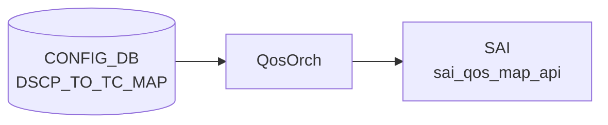

# DSCP_TO_TC_MAP テーブル

## 概要

[DSCP](../../reference/glossary.md#term-dscp) 値 (0..63) を Traffic Class へマップする ingress [QoS](../../reference/glossary.md#term-qos) 分類定義[^1]。`qosorch` が [SAI](../../reference/glossary.md#term-sai) [QoS](../../reference/glossary.md#term-qos) map (`SAI_QOS_MAP_TYPE_DSCP_TO_TC`) を生成し、ポートにバインドする (`PORT_QOS_MAP.dscp_to_tc_map`)。

<!-- cdb-mermaid -->
### データフロー (自動生成)



!!! note "凡例"
    CONFIG_DB から SAI までの典型経路を `docs/reference/config-db-orch-map.md` から機械生成したミニ図。詳細・例外は本ページ本文と対応表を参照。
<!-- /cdb-mermaid -->

## key 構造

```text
DSCP_TO_TC_MAP|<name>|<dscp>
```

`<name>` はマップ名（1..32 文字、`[a-zA-Z0-9][-a-zA-Z0-9_]*`）。`<dscp>` は 0..63。

## フィールド一覧

| フィールド | 型 | 必須 | 説明 |
|-----------|----|------|------|
| `name` (key) | string (1..32) | ✅ | マップ名 |
| `dscp` (key) | string `0..63` | ✅ | [DSCP](../../reference/glossary.md#term-dscp) 値 |
| `tc` | `tc_type` (0..7) | - | 対応 TC |

[YANG](../../reference/glossary.md#term-yang) 上は親子 list 構造。[Redis](../../reference/glossary.md#term-redis) に展開すると `DSCP_TO_TC_MAP|<name>` の hash field として `<dscp>: <tc>` ペアが格納される。

<!-- value-behavior -->
## 値依存挙動マトリクス

### `dscp` (key: string 0..63)

| 値 | 挙動 |
|----|------|
| `0`..`63` | qosorch が SAI_QOS_MAP_TYPE_DSCP_TO_TC エントリを生成 |
| 範囲外 | YANG 違反で reject |

### `tc` (tc_type: 0..7)

| 値 | 挙動 |
|----|------|
| `0`..`7` | [SAI](../../reference/glossary.md#term-sai) QoS map オブジェクトの Traffic Class 値として設定 |
| 8 以上 | ASIC が拒否（SAI エラー） |

> 明示的な enum 制約なし（スパース定義可能）。PORT_QOS_MAP.dscp_to_tc_map から参照されない限り SAI に反映されない。未定義 [DSCP](../../reference/glossary.md#term-dscp) はデフォルト TC=0 になるのが一般的。

<!-- /value-behavior -->

## 購読者

- `qosorch`: [SAI](../../reference/glossary.md#term-sai) [QoS](../../reference/glossary.md#term-qos) map 生成
- `bufferorch` 経由でポート PG への影響あり

## 関連 CONFIG_DB / YANG / CLI

- 関連 [CONFIG_DB](../../reference/glossary.md#term-config_db): `PORT_QOS_MAP`、`TC_TO_QUEUE_MAP`、`TC_TO_PRIORITY_GROUP_MAP`
- 関連 CLI: なし
- 関連 [YANG](../../reference/glossary.md#term-yang): `sonic-dscp-tc-map`

<!-- ref-triangle:start -->

## 関連リファレンス

- [YANG](../../reference/glossary.md#term-yang): [`sonic-dscp-tc-map`](../yang/sonic-dscp-tc-map.md)

<!-- ref-triangle:end -->

## 引用元

[^1]: YANG 定義: `sonic-dscp-tc-map.yang`. <https://github.com/sonic-net/sonic-buildimage/blob/9ea932ec2e18f35e58268ec2e4456b1d4afd65cd/src/sonic-yang-models/yang-models/sonic-dscp-tc-map.yang>

<!-- topics-back-ref -->
## 関連 Topics

- [Topics: QoS / Buffer / PFC / Watermark](../../topics/08-qos-buffer/index.md)

<!-- /topics-back-ref -->

<!-- ops-hint -->
## 運用ヒント

### 典型値

- key 形式: `DSCP_TO_TC_MAP|<name>` (例 `AZURE`)。
- 値: `0:0`, `8:1`, `16:0`, `24:3`, `48:6` 等の dscp→TC マップ。

### よくある誤設定

- TC を 8 以上に書くと ASIC が拒否（TC は 0..7）。

### 確認コマンド

```bash
sonic-db-cli CONFIG_DB hgetall 'DSCP_TO_TC_MAP|AZURE'
show qos map dscp-tc
```
<!-- /ops-hint -->

<!-- cdb-exceptions -->
## 例外条件・特殊挙動

| consumer | 条件 | 挙動 |
|---|---|---|
| [orchagent](../../reference/glossary.md#term-orchagent) | DEL 時に PORT / TUNNEL から参照中 | `m_pendingRemove=true` を立てて `task_need_retry` を返す（qosorch.cpp:181-186） |
| [orchagent](../../reference/glossary.md#term-orchagent) | スイッチに DSCP→TC map 適用前の capability 確認 | `querySwitchCapability(SAI_SWITCH_ATTR_QOS_DSCP_TO_TC_MAP)` で未対応の場合はスイッチレベルへの適用をスキップ（qosorch.cpp:1956） |
| [orchagent](../../reference/glossary.md#term-orchagent) | スイッチレベルで DSCP map 解除 (null 設定) | `SAI_NULL_OBJECT_ID` を渡して解除可能（qosorch.cpp:1993） |
| orchagent | SAI 生成・変更・削除失敗 | `task_failed` を返す。DOT1P_TO_TC_MAP と同一の `QosMapHandler` を使用（qosorch.cpp:151-191） |

> **Evidence**: [sonic-swss](../../reference/glossary.md#term-sonic-swss) `orchagent/qosorch.cpp:1956,1993`; `orchagent/tunneldecaporch.cpp:831-834`
<!-- /cdb-exceptions -->


<!-- runtime-trace -->
## 実コンテナ動作トレース

### 段階 1 — Consumer 登録

`QosOrch` (orchagent 直接 CFG 購読) が CONFIG_DB の `DSCP_TO_TC_MAP` テーブルを購読する。

`DSCP_TO_TC_MAP` の key はマップ名 (例: `AZURE`)。DSCP 値 (0-63) → TC (0-7) のマッピング。

### 段階 2 — CFG→APPL 翻訳

なし (orchagent が直接 CONFIG_DB を購読)

### 段階 3 — APPL→SAI

`sai_qos_map_api` — `sai_create_qos_map` で DSCP→TC マッピングテーブルを作成

### 段階 4 — タイミングと副作用

**適用タイミング**: orchagent が CONFIG_DB 変化を検知後即座に SAI QoS map を作成/更新。ポートへの割り当ては `PORT_QOS_MAP` で行う。

**副作用**: DSCP→TC マップ変更はそのマップを使用するすべてのポートの QoS 分類に即座に影響。L3 traffic の優先度処理が変化する。
<!-- /runtime-trace -->

<!-- entry-points -->
## 書き込み入り口 (Direction A)

対象テーブル: `DSCP_TO_TC_MAP`

### CLI
- `config qos map dscp-tc add/del <map-name> <dscp> <tc>`
  - ソース: `sonic-utilities/config/main.py (qos グループ)`

### minigraph / sonic-cfggen
- なし

### REST / gNMI (sonic-mgmt-common)
- なし (対応 OpenConfig/SONiC YANG transformer なし)

### db_migrator
- なし

### ビルド時デフォルト (init_cfg / j2 テンプレート)
- `qos_config.j2` から platform 別 DSCP→TC マップが生成される場合あり

### ハードコードデフォルト
- なし

### ランタイム注入 (デーモン自動書き込み)
- なし
<!-- /entry-points -->

<!-- ordering -->
## 書込み順依存 (Phase B)

対象テーブル: `DSCP_TO_TC_MAP`。Consumer: `QosOrch::handleDscpToTcTable()` / `handlePortQosMapTable()` (`qosorch.cpp`)。
スキャン範囲: `qosorch.cpp` 全行精読、`tunneldecaporch.cpp:101-302`、`db_migrator.py:700-715`。

### SET 時の順序制約

| # | 依存関係 | 方向 | 挙動 |
|---|----------|------|------|
| 1 | `DSCP_TO_TC_MAP\|<name>` SAI 作成完了 → `PORT_QOS_MAP\|<port>` SET | 強制先行 | `resolveFieldRefValue()` 未解決で `task_need_retry`（自動再試行） |
| 2 | `DSCP_TO_TC_MAP\|<name>` 作成 → `PORT_QOS_MAP\|global` SET（Broadcom） | 強制先行 | 同上。db_migrator が自動生成するが複数マップ時は `get_keys()` 先頭 1 件（順序未定義） |
| 4 | `DSCP_TO_TC_MAP\|<name>` 作成 → `TUNNEL_DECAP_TABLE\|<name>` SET | 強制先行 | `resolveTunnelQosMap()` 未解決で `task_need_retry`（フィールド未指定は silent skip） |
| 6 | dscp 値は数値文字列のみ | 必須 | `stoi()` に例外処理なし。非数値 → `std::invalid_argument` → `task_failed`（自動 retry なし） |

> **推奨順序（SET）**: `DSCP_TO_TC_MAP|<name>` → `PORT_QOS_MAP|<port>` → `TUNNEL_DECAP_TABLE`（参照順に書く）。

### DEL 時の順序制約

| # | 依存関係 | 方向 | 挙動 |
|---|----------|------|------|
| 3 | `PORT_QOS_MAP\|<port>` / Tunnel の参照解除 → `DSCP_TO_TC_MAP\|<name>` DEL | 強制先行 | 参照中は `m_pendingRemove=true` + `task_need_retry` ロック（`qosorch.cpp:181-186`） |
| 5 | pending_remove 解消 → SET（再書き込み）実行可能 | 強制先行 | pending_remove 中の SET も即 `task_need_retry` 返却（ロールバック・入れ替えもブロック） |

> **推奨順序（DEL）**: `PORT_QOS_MAP|<port>` の `dscp_to_tc_map` フィールド削除（参照ポート全解除）→ `DSCP_TO_TC_MAP|<name>` DEL。

### SAI 操作失敗と retry なし

- CREATE / SET / DELETE で SAI エラーが発生した場合、`task_failed` を返し自動 retry は行われない（`qosorch.cpp:151-191`）。
- `DscpToTcMapHandler` の dscp 文字列変換 (`stoi()`) に例外処理なし。非数値文字列 → `std::invalid_argument` → `task_failed`（`Dot1pToTcMapHandler` は try/catch あり、`DscpToTcMapHandler` はなし）。

### PORT_QOS_MAP からの参照順（SAI_PORT_ATTR_QOS_DSCP_TO_TC_MAP）

- `PORT_QOS_MAP` の `dscp_to_tc_map` フィールドが `SAI_PORT_ATTR_QOS_DSCP_TO_TC_MAP` にマップされる（`qosorch.cpp:61`）。
- `PORT_QOS_MAP|global` ではスイッチレベル属性 `SAI_SWITCH_ATTR_QOS_DSCP_TO_TC_MAP` を使用（ポートごとと別属性）。
- Broadcom 向け自動生成: `db_migrator.migrate_port_qos_map_global()` が `DSCP_TO_TC_MAP` の最初の 1 件を `PORT_QOS_MAP|global` へ自動登録（複数マップ存在時は `get_keys()` 返却順で先頭、順序未定義）。

> **Evidence**: `qosorch.cpp:61,136-139,181-191,2021-2026,2124-2129`; `tunneldecaporch.cpp:217-221,831-836`; `db_migrator.py:700-715`
<!-- /ordering -->

<!-- defaults -->
## コード由来の暗黙デフォルト・制約

### `tc` フィールド — YANG-実装 discrepancy

| 観点 | 内容 |
|------|------|
| YANG 定義 | `stypes:tc_type` = `uint8 range "0..15"` (`sonic-types.yang.j2:338`) |
| SAI/ASIC 実態 | 大多数の ASIC は TC 0..7 のみサポート。TC 8..15 を設定すると SAI エラー → `task_failed` |
| 結論 | **YANG は 0..15 を許可するが、実運用上 8..15 は ASIC に reject される** (silent エラーでなく task_failed) |

### `dscp` フィールド (key) — 暗黙の型変換と例外処理欠如

- CONFIG_DB に格納される型は **string** (`"0"`..`"63"`)
- `qosorch.cpp:245`: `(uint8_t)stoi(fvField(*i))` で uint8 変換 → SAI へ渡す
- **例外処理なし**: 数値以外の文字列を書くと `std::invalid_argument` が投げられ `task_failed`（[`Dot1pToTcMapHandler`](../../reference/glossary.md#term-orchagent) は try/catch あり、`DscpToTcMapHandler` は **なし**）

### 未定義 DSCP のデフォルト TC (スパース定義時)

- 0..63 全エントリの定義は不要（スパース定義可能）
- 未定義 DSCP のデフォルト TC は **ASIC/SAI 実装依存**（一般的に TC=0 だが非保証）
- SONiC 標準 AZURE マップは全 64 エントリを明示定義 (`qos_config.j2:265-332`)

### ビルド時ハードコードデフォルト (`qos_config.j2`)

プラットフォーム固有 `generate_dscp_to_tc_map` マクロ未定義時のフォールバック AZURE マップ:

| DSCP | TC | 備考 |
|------|----|------|
| 3 | 3 | CS0 相当 lossless |
| 4 | 4 | CS0 相当 lossless |
| 5 | 2 | — |
| 8 | 0 | CS1: best-effort |
| 46 | 5 | EF: expedited forwarding |
| 48 | 6 | CS6: network control |
| その他 | 1 | デフォルト低優先度 |

- **LeafRouter + tunnel_qos_remap_enable**: uplink ポートには `AZURE_UPLINK` マップを使用
- **DualToR + uplink**: 同様に `AZURE_UPLINK` を使用

### `PORT_QOS_MAP|global` — スイッチレベル適用の条件分岐

| 条件 | 挙動 |
|------|------|
| `SAI_SWITCH_ATTR_QOS_DSCP_TO_TC_MAP` 非対応 | `querySwitchCapability()` が false → **適用スキップ（エラーなし）** |
| Broadcom ASIC かつ `PORT_QOS_MAP|global` 未存在 | `db_migrator.migrate_port_qos_map_global()` が **自動生成** |
| 複数の DSCP_TO_TC_MAP 存在時 | `get_keys()` の **最初の 1 件** を使用（順序未定義） |

> **Evidence**: `qosorch.cpp:1956` (capability check), `db_migrator.py:704-715` (Broadcom 限定自動生成)

### DEL 時の pending_remove ロック

- 参照中 (PORT_QOS_MAP / TUNNEL) のマップへ DEL → `m_pendingRemove = true` + `task_need_retry`
- pending_remove 中に SET が来ても **実行せず** `task_need_retry` を返す
- Tunnel decap 経路 (`tunneldecaporch.cpp:832-836`): `dscp_to_tc_map_id == SAI_NULL_OBJECT_ID` 時はトンネル作成時に設定しない（silent skip）
<!-- /defaults -->

<!-- glossary-links-injected: 9e94f614fc2c -->
