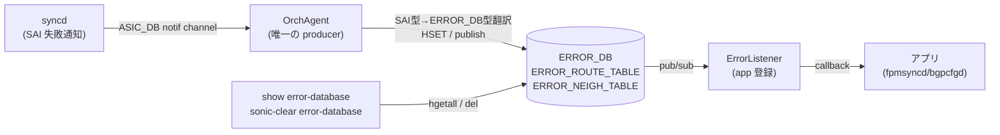

# ERROR_DB テーブル (ERROR_ROUTE_TABLE / ERROR_NEIGH_TABLE)

!!! warning "実装状況: 部分実装 (partially_implemented)"
    本ページに記載の **ERROR_DB / ErrorReporter / ErrorListener クラス / CLI (`show error-database` / `sonic-clear error-database`) は 2026-05 時点で master にマージされていない**。  
    HLD (2019-05-06, Rev 0.1) に設計が記載されているが、採用済みなのは `SWSS_RC_*` enum (`sonic-swss-common/common/status_code_util.h`) のみ。  
    詳細: [Error Handling Framework 制限事項と乖離](../../architecture/error-handling-framework-in-sonic-limitations.md)

## 概要

**ERROR_DB** は SONiC Error Handling Framework が導入する専用 Redis データベースである[^1]。  
SAI CREATE/SET 操作が失敗した場合、syncd が ASIC_DB の通知チャネル経由で OrchAgent に通知し、OrchAgent が SAI 型 → ERROR_DB 型へ翻訳してエントリを書き込む。

> **注意**: ERROR_DB は **CONFIG_DB ではなく独立した Redis データベース** (database_config.json 未登録、実装時に新 DB ID が割り当てられる予定) である。  
> 本ページをこのセクション (config-db/) に置いているのは、関連テーブルの一元参照性のためである。

主な特徴:

- **OrchAgent が唯一の producer** — ErrorListener が registered app への通知を担う
- **失敗エントリのみ保持** — 成功時は DB に書き込まず通知のみ (メモリ効率優先)
- **last-known error の上書き** — 同一オブジェクトが複数回失敗した場合は最新エラーで更新
- **warm reboot 非対応** — ERROR_DB の内容は warm reboot をまたいで永続しない[^1]

<!-- cdb-mermaid -->
### データフロー (自動生成)



!!! note "凡例"
    OrchAgent は SAI type を SWSS_RC_* 文字列に変換してから ERROR_DB に書き込む。  
    成功時はエントリを書かず通知のみ送る（DB からエントリを削除して publish）。
<!-- /cdb-mermaid -->

---

## ERROR_ROUTE_TABLE

### key 構造

```text
ERROR_ROUTE_TABLE|<prefix>
```

`<prefix>` は IPv4 または IPv6 プレフィックス (例: `20.20.20.0/24`)。

### フィールド

| フィールド | 型 | デフォルト | 説明 |
|-----------|----|-----------|------|
| `opcode` | string enum | — (必須) | 操作種別: `CREATE` / `SET` / `DELETE` |
| `nexthop` | string | `""` (空可) | カンマ区切り IP アドレス列 (0 個以上) |
| `intf` | string | `""` (空可) | カンマ区切りインタフェース名/ifindex (0 個以上) |
| `rc` | string | — (必須) | SWSS_RC_* 文字列 (例: `SWSS_RC_TABLE_FULL`) |

実際の redis 出力例 (HLD Section 4.1)[^1]:

```
"ERROR_ROUTE_TABLE:20.20.20.0/24"
1) "opcode"   2) "CREATE"
3) "nexthop"  4) "10.10.10.2"
5) "intf"     6) "Vlan10"
7) "rc"       8) "SWSS_RC_TABLE_FULL"
```

---

## ERROR_NEIGH_TABLE

### key 構造

```text
ERROR_NEIGH_TABLE|<intf>|<prefix>
```

`<intf>` は `INTF_TABLE.name` / `VLAN_INTF_TABLE.name` / `LAG_INTF_TABLE.name` のいずれか。  
`<prefix>` は IPv4 または IPv6 アドレス。

### フィールド

| フィールド | 型 | デフォルト | 説明 |
|-----------|----|-----------|------|
| `opcode` | string enum | — (必須) | `CREATE` / `SET` / `DELETE` |
| `neigh` | string | — (必須) | MAC アドレス (12 hex digits, 例: `aa:bb:cc:dd:ee:ff`) |
| `family` | string enum | — (必須) | `"IPv4"` または `"IPv6"` |
| `rc` | string | — (必須) | SWSS_RC_* 文字列 |

---

## SWSS_RC コード体系

`sonic-swss-common/common/status_code_util.h` に定義された `StatusCode` enum[^2]:

| SWSS_RC コード | 対応する SAI status (HLD 時点) | 説明 |
|--------------|------------------------------|------|
| `SWSS_RC_SUCCESS` | `SAI_STATUS_SUCCESS` | 成功 |
| `SWSS_RC_INVALID_PARAM` | `SAI_STATUS_INVALID_PARAMETER` | 無効パラメータ |
| `SWSS_RC_UNAVAIL` | `SAI_STATUS_NOT_SUPPORTED` | 非サポート |
| `SWSS_RC_NOT_FOUND` | `SAI_STATUS_ITEM_NOT_FOUND` | エントリ未発見 |
| `SWSS_RC_NO_MEMORY` | `SAI_STATUS_NO_MEMORY` | メモリ不足 |
| `SWSS_RC_EXISTS` | `SAI_STATUS_ITEM_ALREADY_EXISTS` | 既存エントリあり |
| `SWSS_RC_FULL` | `SAI_STATUS_TABLE_FULL` | テーブル満杯 |
| `SWSS_RC_IN_USE` | `SAI_STATUS_OBJECT_IN_USE` | 使用中 |
| `SWSS_RC_DEADLINE_EXCEEDED` | — (HLD 後追加) | タイムアウト |
| `SWSS_RC_PERMISSION_DENIED` | — (HLD 後追加) | 権限エラー |
| `SWSS_RC_INTERNAL` | — (HLD 後追加) | 内部エラー |
| `SWSS_RC_UNIMPLEMENTED` | — (HLD 後追加) | 未実装 |
| `SWSS_RC_NOT_EXECUTED` | — (HLD 後追加) | 未実行 |
| `SWSS_RC_FAILED_PRECONDITION` | — (HLD 後追加) | 前提条件違反 |
| `SWSS_RC_UNKNOWN` | — | 不明エラー |

!!! note "乖離"
    HLD は 8 コードを定義していたが、実装 (`status_code_util.h`) では 15 コードに拡張されている。

---

## エントリライフサイクル

| 状況 | DB への影響 |
|-----|-----------|
| CREATE 失敗 | エントリ追加 |
| UPDATE 失敗 | 既存エントリを最新エラーで上書き (last-known error) |
| DELETE 失敗 | エントリ除去 + 通知 |
| CREATE 成功 | エントリを書かず通知のみ (publish) |
| `sonic-clear error-database` | アプリへの通知なしで削除 |

---

<!-- defaults -->
## フィールド暗黙デフォルト (Phase A — コード由来)

ERROR_DB のフィールドはすべて OrchAgent が SAI 通知から動的に生成する。  
コード実装が master 未マージのため、デフォルト値根拠は HLD スキーマ定義による。

### ERROR_ROUTE_TABLE

| フィールド | コード由来デフォルト | fallback 源 |
|-----------|-------------------|------------|
| `opcode` | なし (必須) | OrchAgent が SAI opcode から書き込む — HLD Section 3.3.1 |
| `nexthop` | `""` (空文字列) | HLD スキーマ `*prefix,` = 0 個以上を許容 — Section 3.4.3.2 |
| `intf` | `""` (空文字列) | HLD スキーマ `zero or more separated by ","` — Section 3.4.3.2 |
| `rc` | なし (必須) | SWSS_RC_* 文字列、失敗時のみ存在 |

### ERROR_NEIGH_TABLE

| フィールド | コード由来デフォルト | fallback 源 |
|-----------|-------------------|------------|
| `opcode` | なし (必須) | SAI opcode から翻訳 |
| `neigh` | なし (必須) | MAC アドレス文字列 |
| `family` | なし (必須) | `"IPv4"` / `"IPv6"` のみ、enum 制約 |
| `rc` | なし (必須) | SWSS_RC_* 文字列 |

### 補足

- **`nexthop` / `intf` の空文字列**: HLD のスキーマ記法 `*prefix,` は ABNF 的に「0 個以上」を意味する。実装上は DELETE 失敗時など nexthop が空のケースが想定される。
- **デフォルト通知種別**: HLD 1.1.2 に「By default, only failed operations are notified」と明記。アプリが `ERR_NOTIFY_POSITIVE_ACK` フラグを付与した場合のみ成功通知を受け取る。
- **SWSS_RC_UNKNOWN のフォールバック**: `status_code_util.h:74` — `strToStatusCode()` が未知文字列を受けると `SWSS_RC_UNKNOWN` を返す。つまり未知の SAI エラーコードは `SWSS_RC_UNKNOWN` にマップされる。
<!-- /defaults -->

<!-- cdb-exceptions -->
## 例外条件・特殊挙動

| 条件 | 挙動 |
|------|------|
| 同一オブジェクトが複数回失敗 | 各回を個別通知 + DB エントリは最新エラーで上書き (HLD 1.1.7) |
| DELETE 失敗後に CREATE 成功 | エントリを DB から削除して通知 (HLD Table Section 3.3.1) |
| CREATE 失敗後に DELETE 失敗 | エントリ除去 + 通知 |
| warm reboot | ERROR_DB の内容はクリア (非永続) — HLD Section 6 |
| `sonic-clear error-database` | app への通知なしで DB エントリを削除 — HLD Section 3.3.3 |
| fpmsyncd の bgp error-handling が disable | `ERROR_ROUTE_TABLE` の購読解除、通知受信なし — BGP HLD Section 3.7.1 |

<!-- /cdb-exceptions -->

<!-- ref-triangle:start -->

## 関連リファレンス

- HLD: [Error Handling Framework Design Spec](https://github.com/sonic-net/SONiC/blob/master/doc/error-handling/error_handling_design_spec.md)
- HLD: [BGP Route Install Error Handling](https://github.com/sonic-net/SONiC/blob/master/doc/bgp_error_handling/BGP_Route_Error_Handling_Arlo.md)
- 実装: `sonic-swss-common/common/status_code_util.h` (SWSS_RC enum)
- アーキテクチャ: [Error Handling Framework 概念](../../architecture/error-handling-framework-in-sonic-concepts.md)
- アーキテクチャ: [Error Handling Framework 制限事項](../../architecture/error-handling-framework-in-sonic-limitations.md)

<!-- ref-triangle:end -->

## 引用元

[^1]: `SONiC/doc/error-handling/error_handling_design_spec.md` Rev 0.1 (2019-05-06), Section 3.4.3 — ERROR テーブル定義・スキーマ・ライフサイクル・warm boot 非対応。<https://github.com/sonic-net/SONiC/blob/master/doc/error-handling/error_handling_design_spec.md>

[^2]: `sonic-swss-common/common/status_code_util.h` — `StatusCode` enum と `statusCodeMapping` テーブル (15 コード定義)。

## 関連ページ

- [Error Handling Framework（概要ハブ）](../../architecture/error-handling-framework-in-sonic.md)
- [BGP GLOBALS](bgp-globals.md)

<!-- ops-hint -->
## 運用ヒント

### 注意事項

ERROR_DB / ERROR_ROUTE_TABLE / ERROR_NEIGH_TABLE は **2026-05 時点で未実装** のため、実際の SONiC 環境では以下の代替手段を使う:

```bash
# 現行: ASIC リソース枯渇は CRM で監視
show crm resources all

# BGP ルートの未インストール状態 (BGP Suppress FIB Pending 機能が後継)
show ip route not-installed
show ipv6 route not-installed

# ERROR_DB が実装された場合の想定コマンド (未実装)
# show error-database route
# sonic-clear error-database route
```

### 実装確認方法

```bash
# SWSS_RC_* enum が利用可能か確認 (実装済み)
grep -r "SWSS_RC_" /usr/include/swss/

# ERROR_DB が Redis に存在するか確認 (未実装時は存在しない)
sonic-db-cli ERROR_DB keys '*'
```
<!-- /ops-hint -->
