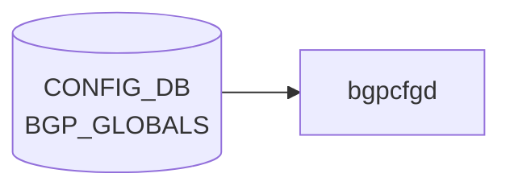

# ERROR_DB テーブル (ERROR_ROUTE_TABLE / ERROR_NEIGH_TABLE)

!!! warning "実装状況: 部分実装 (partially_implemented)"
    本ページに記載の **ERROR_DB / ErrorReporter / ErrorListener クラス / CLI (`show error-database` / `sonic-clear error-database`) は 2026-05 時点で master にマージされていない**。  
    HLD (2019-05-06, Rev 0.1) に設計が記載されているが、採用済みなのは `SWSS_RC_*` enum (`sonic-swss-common/common/status_code_util.h`) のみ。  
    詳細: [Error Handling Framework 制限事項と乖離](../../architecture/error-handling-framework-in-sonic-limitations.md)

## 概要

**ERROR_DB** は [SONiC](../../reference/glossary.md#term-sonic) Error Handling Framework が導入する専用 [Redis](../../reference/glossary.md#term-redis) データベースである[^1]。  
[SAI](../../reference/glossary.md#term-sai) CREATE/SET 操作が失敗した場合、[syncd](../../reference/glossary.md#term-syncd) が [ASIC_DB](../../reference/glossary.md#term-asic_db) の通知チャネル経由で OrchAgent に通知し、OrchAgent が [SAI](../../reference/glossary.md#term-sai) 型 → ERROR_DB 型へ翻訳してエントリを書き込む。

> **注意**: ERROR_DB は **[CONFIG_DB](../../reference/glossary.md#term-config_db) ではなく独立した [Redis](../../reference/glossary.md#term-redis) データベース** (database_config.json 未登録、実装時に新 DB ID が割り当てられる予定) である。  
> 本ページをこのセクション (config-db/) に置いているのは、関連テーブルの一元参照性のためである。

主な特徴:

- **OrchAgent が唯一の producer** — ErrorListener が registered app への通知を担う
- **失敗エントリのみ保持** — 成功時は DB に書き込まず通知のみ (メモリ効率優先)
- **last-known error の上書き** — 同一オブジェクトが複数回失敗した場合は最新エラーで更新
- **warm reboot 非対応** — ERROR_DB の内容は warm reboot をまたいで永続しない[^1]

<!-- cdb-mermaid -->
### データフロー (自動生成)



!!! note "凡例"
    CONFIG_DB から SAI までの典型経路を `docs/reference/config-db-orch-map.md` から機械生成したミニ図。詳細・例外は本ページ本文と対応表を参照。
<!-- /cdb-mermaid -->

---

## ERROR_ROUTE_TABLE

### key 構造

```text
ERROR_ROUTE_TABLE|<prefix>
```

`<prefix>` は IPv4 または IPv6 プレフィックス (例: `20.20.20.0/24`)。

### フィールド

| フィールド | 型 | デフォルト | 説明 |
|-----------|----|-----------|------|
| `opcode` | string enum | — (必須) | 操作種別: `CREATE` / `SET` / `DELETE` |
| `nexthop` | string | `""` (空可) | カンマ区切り IP アドレス列 (0 個以上) |
| `intf` | string | `""` (空可) | カンマ区切りインタフェース名/ifindex (0 個以上) |
| `rc` | string | — (必須) | SWSS_RC_* 文字列 (例: `SWSS_RC_TABLE_FULL`) |

実際の redis 出力例 ([HLD](../../reference/glossary.md#term-hld) Section 4.1)[^1]:

```
"ERROR_ROUTE_TABLE:20.20.20.0/24"
1) "opcode"   2) "CREATE"
3) "nexthop"  4) "10.10.10.2"
5) "intf"     6) "Vlan10"
7) "rc"       8) "SWSS_RC_TABLE_FULL"
```

---

## ERROR_NEIGH_TABLE

### key 構造

```text
ERROR_NEIGH_TABLE|<intf>|<prefix>
```

`<intf>` は `INTF_TABLE.name` / `VLAN_INTF_TABLE.name` / `LAG_INTF_TABLE.name` のいずれか。  
`<prefix>` は IPv4 または IPv6 アドレス。

### フィールド

| フィールド | 型 | デフォルト | 説明 |
|-----------|----|-----------|------|
| `opcode` | string enum | — (必須) | `CREATE` / `SET` / `DELETE` |
| `neigh` | string | — (必須) | MAC アドレス (12 hex digits, 例: `aa:bb:cc:dd:ee:ff`) |
| `family` | string enum | — (必須) | `"IPv4"` または `"IPv6"` |
| `rc` | string | — (必須) | SWSS_RC_* 文字列 |

---

## SWSS_RC コード体系

`sonic-swss-common/common/status_code_util.h` に定義された `StatusCode` enum[^2]:

| SWSS_RC コード | 対応する [SAI](../../reference/glossary.md#term-sai) status ([HLD](../../reference/glossary.md#term-hld) 時点) | 説明 |
|--------------|------------------------------|------|
| `SWSS_RC_SUCCESS` | `SAI_STATUS_SUCCESS` | 成功 |
| `SWSS_RC_INVALID_PARAM` | `SAI_STATUS_INVALID_PARAMETER` | 無効パラメータ |
| `SWSS_RC_UNAVAIL` | `SAI_STATUS_NOT_SUPPORTED` | 非サポート |
| `SWSS_RC_NOT_FOUND` | `SAI_STATUS_ITEM_NOT_FOUND` | エントリ未発見 |
| `SWSS_RC_NO_MEMORY` | `SAI_STATUS_NO_MEMORY` | メモリ不足 |
| `SWSS_RC_EXISTS` | `SAI_STATUS_ITEM_ALREADY_EXISTS` | 既存エントリあり |
| `SWSS_RC_FULL` | `SAI_STATUS_TABLE_FULL` | テーブル満杯 |
| `SWSS_RC_IN_USE` | `SAI_STATUS_OBJECT_IN_USE` | 使用中 |
| `SWSS_RC_DEADLINE_EXCEEDED` | — ([HLD](../../reference/glossary.md#term-hld) 後追加) | タイムアウト |
| `SWSS_RC_PERMISSION_DENIED` | — (HLD 後追加) | 権限エラー |
| `SWSS_RC_INTERNAL` | — (HLD 後追加) | 内部エラー |
| `SWSS_RC_UNIMPLEMENTED` | — (HLD 後追加) | 未実装 |
| `SWSS_RC_NOT_EXECUTED` | — (HLD 後追加) | 未実行 |
| `SWSS_RC_FAILED_PRECONDITION` | — (HLD 後追加) | 前提条件違反 |
| `SWSS_RC_UNKNOWN` | — | 不明エラー |

!!! note "乖離"
    HLD は 8 コードを定義していたが、実装 (`status_code_util.h`) では 15 コードに拡張されている。

---

## エントリライフサイクル

| 状況 | DB への影響 |
|-----|-----------|
| CREATE 失敗 | エントリ追加 |
| UPDATE 失敗 | 既存エントリを最新エラーで上書き (last-known error) |
| DELETE 失敗 | エントリ除去 + 通知 |
| CREATE 成功 | エントリを書かず通知のみ (publish) |
| `sonic-clear error-database` | アプリへの通知なしで削除 |

---

<!-- defaults -->
## フィールド暗黙デフォルト (Phase A — コード由来)

ERROR_DB のフィールドはすべて OrchAgent が SAI 通知から動的に生成する。  
コード実装が master 未マージのため、デフォルト値根拠は HLD スキーマ定義による。

### ERROR_ROUTE_TABLE

| フィールド | コード由来デフォルト | fallback 源 |
|-----------|-------------------|------------|
| `opcode` | なし (必須) | OrchAgent が SAI opcode から書き込む — HLD Section 3.3.1 |
| `nexthop` | `""` (空文字列) | HLD スキーマ `*prefix,` = 0 個以上を許容 — Section 3.4.3.2 |
| `intf` | `""` (空文字列) | HLD スキーマ `zero or more separated by ","` — Section 3.4.3.2 |
| `rc` | なし (必須) | SWSS_RC_* 文字列、失敗時のみ存在 |

### ERROR_NEIGH_TABLE

| フィールド | コード由来デフォルト | fallback 源 |
|-----------|-------------------|------------|
| `opcode` | なし (必須) | SAI opcode から翻訳 |
| `neigh` | なし (必須) | MAC アドレス文字列 |
| `family` | なし (必須) | `"IPv4"` / `"IPv6"` のみ、enum 制約 |
| `rc` | なし (必須) | SWSS_RC_* 文字列 |

### 補足

- **`nexthop` / `intf` の空文字列**: HLD のスキーマ記法 `*prefix,` は ABNF 的に「0 個以上」を意味する。実装上は DELETE 失敗時など nexthop が空のケースが想定される。
- **デフォルト通知種別**: HLD 1.1.2 に「By default, only failed operations are notified」と明記。アプリが `ERR_NOTIFY_POSITIVE_ACK` フラグを付与した場合のみ成功通知を受け取る。
- **SWSS_RC_UNKNOWN のフォールバック**: `status_code_util.h:74` — `strToStatusCode()` が未知文字列を受けると `SWSS_RC_UNKNOWN` を返す。つまり未知の SAI エラーコードは `SWSS_RC_UNKNOWN` にマップされる。
<!-- /defaults -->

<!-- ordering -->
## 書込み順依存 (Phase B)

ERROR_DB への書込みは **OrchAgent が唯一の producer** であり、[syncd](../../reference/glossary.md#term-syncd) → OrchAgent → ERROR_DB → ErrorListener の単一経路で伝搬する。HLD Section 3.3.1 は「単一通知チャネルを使うことで通知の順序が保たれる」と明記している[^1]。

### 検出された順序依存

| # | 依存関係 | 方向 | 緩和策 |
|---|----------|------|--------|
| 1 | [syncd](../../reference/glossary.md#term-syncd) の [ASIC_DB](../../reference/glossary.md#term-asic_db) 通知チャネル → OrchAgent 受信 | **強制先行**（SAI 操作結果が先） | OrchAgent は通知を受信するまで ERROR_DB に何も書かない |
| 2 | OrchAgent による SAI 型 → SWSS_RC_* 翻訳 → `HSET` → `publish` | 強制先行（翻訳 → HSET → publish の順） | pub/sub 購読者（ErrorListener）は `publish` の後にしか通知を受けない |
| 3 | 失敗エントリの `HSET`（書込み） → `publish`（通知） | **強制先行** | ErrorListener のコールバックが呼ばれる時点でエントリは必ず DB に存在する |
| 4 | 成功時の `DEL`（エントリ削除） → `publish`（通知） | **強制先行** | 成功通知受信時点でエントリは既に削除済み（コールバック内での `HGET` は空を返す） |
| 5 | `sonic-clear error-database` → アプリへの通知なし | CLI 操作による直接削除 | アプリは通知を受けず、次の失敗が発生するまで状態は不定 |
| 6 | OrchAgent 再起動 → ERROR_DB 内容クリア | 起動時リセット（非永続） | warm reboot 後は再度 SAI 失敗が発生するまで ERROR_DB は空 |

### 主要な制約詳細

**syncd 単一チャネルによる順序保証 (依存 #1)**:  
HLD Section 3.3.1 では syncd が単一通知チャネル（`ASIC_DB` の通知 keyspace）を使ってエラーを OrchAgent に報告することで、**SAI 操作の発生順と通知の到着順が一致する**ことが保証されると説明されている。複数チャネルだとマルチオブジェクトの失敗順序が逆転しうるが、単一チャネルによりこの問題を回避している（evidence: HLD Section 3.3.1, "Using a single notification channel ensures that order of the notifications is retained."）。

**HSET → publish の不可分性 (依存 #2, #3)**:  
OrchAgent の ErrorReporter は SAI 型を SWSS_RC_* に翻訳後、先に `HSET` で ERROR_DB エントリを書いてから `publish` で購読者に通知する設計である。このため ErrorListener のコールバックが呼び出される時点でエントリは必ず [Redis](../../reference/glossary.md#term-redis) に存在し、コールバック内で `HGETALL` を実行しても空応答にならない。逆順（publish 先行）の場合は競合状態が生じるが、HLD は HSET 先行を明示している。

**成功時の逆順: DEL → publish (依存 #4)**:  
成功通知時は「エントリを DB から削除してから publish」の順になる（HLD Section 3.3.1 "Removes the entry from database. if present. Publishes the notifications"）。失敗時と逆の操作であり、通知受信側は成功通知を受けた時点でエントリが存在しないことを前提として動作する必要がある。

**warm reboot による非永続化 (依存 #6)**:  
ERROR_DB は warm reboot をまたいで永続しない（HLD Section 6）。OrchAgent 再起動後は ERROR_DB が空から開始するため、warm reboot 前に存在していたエラーエントリは消去され、再度 SAI 失敗が発生するまで通知されない。この挙動は「最新エラーの上書き」ポリシーと組み合わさり、reboot 跨ぎの古いエラーが残留しない副作用をもたらす。

<!-- /ordering -->

<!-- cross-refs -->
## 暗黙参照 — Phase C (cross-table refs)

> **調査根拠**: HLD `doc/error-handling/error_handling_design_spec.md` Rev 0.1 Section 3.3–3.4、`doc/bgp_error_handling/BGP_Route_Error_Handling_Arlo.md` Section 3.7  
> 詳細証跡: `meta/_intermediate/cdb-flow/errordb-cross-refs.md`

ERROR_DB (ERROR_ROUTE_TABLE / ERROR_NEIGH_TABLE) は独立した Redis データベースだが、以下のテーブルを実行時に暗黙参照する。

| 参照先 | DB | 参照方向 | [YANG](../../reference/glossary.md#term-yang) leafref | 実装上の必須度 | 証拠 |
|---|---|---|---|---|---|
| `ASIC_DB` 通知チャネル (syncd → OrchAgent) | [ASIC_DB](../../reference/glossary.md#term-asic_db) | 読み取り（通知受信） | なし | **必須**（producer 経路） | HLD Section 3.3.1 |
| `INTF_TABLE\|<name>` / `VLAN_INTF_TABLE\|<name>` / `LAG_INTF_TABLE\|<name>` | [APPL_DB](../../reference/glossary.md#term-appl_db) | key 参照（`ERROR_NEIGH_TABLE` の `intf` フィールド） | なし | 実質必須（intf 解決） | HLD Section 3.4.3.3 |
| `BGP_NEIGHBOR\|<addr>` | [CONFIG_DB](../../reference/glossary.md#term-config_db) | 読み取り（[fpmsyncd](../../reference/glossary.md#term-fpmsyncd) が ERROR_ROUTE_TABLE を購読） | なし | 任意（bgp error-handling 有効時） | [BGP](../../reference/glossary.md#term-bgp) HLD Section 3.7.1 |
| `BGP_GLOBALS\|default` (`bgp_error_handling` フィールド) | [CONFIG_DB](../../reference/glossary.md#term-config_db) | 有効化スイッチ（[fpmsyncd](../../reference/glossary.md#term-fpmsyncd) の購読を制御） | なし | 条件必須 | [BGP](../../reference/glossary.md#term-bgp) HLD Section 3.7.1 |

### ASIC_DB 通知チャネル — 唯一の producer 経路

ERROR_DB への書き込みは OrchAgent のみが行う。OrchAgent は syncd が `ASIC_DB` の通知チャネルに送る SAI 操作失敗イベントを受信し、SAI 型 → `SWSS_RC_*` 文字列に翻訳してから `ERROR_ROUTE_TABLE` または `ERROR_NEIGH_TABLE` に `HSET` する。**ASIC_DB 通知チャネルが存在しない・停止している場合、ERROR_DB には何も書き込まれない**（evidence: HLD Section 3.3.1）。

### INTF_TABLE / VLAN_INTF_TABLE / LAG_INTF_TABLE — ERROR_NEIGH_TABLE の intf key

`ERROR_NEIGH_TABLE|<intf>|<prefix>` の `<intf>` は `INTF_TABLE.name` / `VLAN_INTF_TABLE.name` / `LAG_INTF_TABLE.name` のいずれかに対応する（HLD Section 3.4.3.3）。[YANG](../../reference/glossary.md#term-yang) leafref は定義されていないが、OrchAgent が隣接エントリを ERROR_DB に書き込む際には [APPL_DB](../../reference/glossary.md#term-appl_db) の対応インタフェーステーブルにエントリが存在している必要がある。インタフェースが削除された後も ERROR_NEIGH_TABLE に古いエントリが残留する場合がある（warm reboot で非永続化されるまで）。

### BGP_GLOBALS.bgp_error_handling — fpmsyncd の購読制御

[fpmsyncd](../../reference/glossary.md#term-fpmsyncd) は `BGP_GLOBALS|default` の `bgp_error_handling` フィールドを参照し、有効な場合のみ `ERROR_ROUTE_TABLE` を購読して [BGP](../../reference/glossary.md#term-bgp) ルートインストール失敗の通知を受け取る（BGP HLD Section 3.7.1）。このフィールドが `false` または未設定の場合、fpmsyncd は `ErrorListener` を登録しないため `ERROR_ROUTE_TABLE` の更新は [bgpcfgd](../../reference/glossary.md#term-bgpcfgd) / fpmsyncd に届かない。

### SAI 参照

ERROR_DB は SAI の操作**結果**（失敗通知）を格納するデータベースであり、ERROR_DB からの書き込みが SAI に届くことはない。単方向（SAI → OrchAgent → ERROR_DB）のフローである。

<!-- /cross-refs -->

<!-- failure -->
## 失敗挙動 (Phase D)

> **調査根拠**: HLD `doc/error-handling/error_handling_design_spec.md` Rev 0.1 Section 3.3.1–3.3.3、Section 6 (Warm Boot)  
> **注意**: ERROR_DB / ErrorReporter / ErrorListener は 2026-05 時点で master 未マージのため、以下は HLD 設計に基づく記述である。

### 失敗パス一覧

| # | 失敗トリガー | ERROR_DB への影響 | アプリ通知 | 備考 |
|---|------------|-----------------|-----------|------|
| 1 | SAI CREATE / SET 失敗 → OrchAgent 受信 | エントリ追加（既存なら上書き） | `publish` で ErrorListener に通知 | 単一チャネルによる順序保証あり |
| 2 | SAI DELETE 失敗 → OrchAgent 受信 | エントリ除去 + `publish` | ErrorListener に通知（削除通知） | HLD Section 3.3.1 Table |
| 3 | 同一オブジェクトが複数回失敗 | 最新エラーで上書き（accumulate しない） | 各回個別通知 | HLD 1.1.7: last-known error policy |
| 4 | SAI CREATE 成功（失敗後に成功） | DB エントリ削除 + `publish` | 成功通知（`ERR_NOTIFY_POSITIVE_ACK` 登録時のみ） | HLD Section 3.3.1 |
| 5 | OrchAgent 未起動 / 停止中 | ERROR_DB に何も書かれない | 通知なし | OrchAgent が唯一の producer |
| 6 | `sonic-clear error-database` 実行 | DB エントリを直接削除 | **アプリへの通知なし** | HLD Section 3.3.3 |
| 7 | warm reboot | ERROR_DB の全エントリ消滅 | 通知なし | HLD Section 6: 非永続設計 |

### 詳細

#### 1 & 3. SAI 失敗時の last-known error 上書き

OrchAgent は SAI 操作失敗通知を受け取るたびに `HSET ERROR_ROUTE_TABLE|<prefix>` または `HSET ERROR_NEIGH_TABLE|<intf>|<prefix>` を実行する。**同一オブジェクトが複数回失敗した場合でも、DB エントリは 1 件のみ保持され、最新エラーコードで上書きされる**（HLD 1.1.7）。各失敗はそれぞれ `publish` で通知されるため、ErrorListener は複数回コールバックされる。

```text
# HLD Section 3.3.1 イベント処理シーケンス (失敗時)
1. Syncd が ASIC_DB 通知チャネルに失敗イベントを送信
2. OrchAgent が受信 → SAI 型を SWSS_RC_* に翻訳
3. HSET ERROR_ROUTE_TABLE|<prefix> opcode=<op> rc=<SWSS_RC_*> ...
4. PUBLISH ERROR_DB → ErrorListener のコールバック起動
```

#### 2. SAI DELETE 失敗

`DELETE` 操作が SAI で失敗した場合、OrchAgent は DB エントリを**削除**してから `publish` する（HLD Section 3.3.1 Table: "Create failure → Delete failure: Remove the entry from database and notify"）。これは `DELETE` 失敗後もオブジェクトが論理的に「削除試行済み」として扱われることを意味し、DB に失敗エントリが残留しない設計である。

#### 5. OrchAgent 停止中の失敗

syncd はエラーを ASIC_DB 通知チャネルに送るが、OrchAgent が受信できなければ ERROR_DB への書き込みも ErrorListener へのコールバックも発生しない。[orchagent](../../reference/glossary.md#term-orchagent) は唯一の producer であるため（HLD Section 3.1）、OrchAgent 停止中は全 SAI 失敗がサイレントに消失する。

#### 6. `sonic-clear error-database` — 通知なしの強制削除

CLI の clear コマンドは OrchAgent に通知チャネル経由でクリア要求を送り、OrchAgent が直接 `DEL` で ERROR_DB エントリを削除する。**この操作は registered applications への `publish` を行わない**（HLD Section 3.3.3）。そのため fpmsyncd などの ErrorListener は clear 後も古い「失敗あり」状態を保持する可能性がある。

#### 7. warm reboot による非永続化

ERROR_DB は Redis のインメモリ DB として設計されており、warm reboot 後に内容は消去される（HLD Section 6）。warm reboot をまたいだ失敗エントリの引き継ぎは**サポートしない**。再起動後に同じ SAI 失敗が再発した場合のみ、再度エントリが書き込まれる。

<!-- /failure -->

<!-- constants -->
## ハードコード定数 (Phase E)

> **調査根拠**: `sonic-swss-common/common/status_code_util.h` (実装済み)、HLD `doc/error-handling/error_handling_design_spec.md` Rev 0.1 Section 3.3.2  
> **注意**: ERROR_DB / ErrorReporter / ErrorListener は 2026-05 時点で master 未マージのため、以下の定数の多くは HLD 設計上の定義である。  
> 詳細証跡: `meta/_intermediate/cdb-flow/errordb-constants.md`

### `StatusCode` enum — 実装済み (status_code_util.h)

ERROR_DB の `rc` フィールドに書き込まれる文字列値は `sonic-swss-common/common/status_code_util.h` で定義された `statusCodeMapping` によって厳密に管理される。15 コードが実装済みであり、HLD 設計時の 8 コードから拡張されている。

| 定数名 | 対応 SAI ステータス | 実装状況 |
|---|---|---|
| `SWSS_RC_SUCCESS` | `SAI_STATUS_SUCCESS` | 実装済み |
| `SWSS_RC_INVALID_PARAM` | `SAI_STATUS_INVALID_PARAMETER` | 実装済み |
| `SWSS_RC_DEADLINE_EXCEEDED` | — (HLD 後追加) | 実装済み |
| `SWSS_RC_UNAVAIL` | `SAI_STATUS_NOT_SUPPORTED` | 実装済み |
| `SWSS_RC_NOT_FOUND` | `SAI_STATUS_ITEM_NOT_FOUND` | 実装済み |
| `SWSS_RC_NO_MEMORY` | `SAI_STATUS_NO_MEMORY` | 実装済み |
| `SWSS_RC_EXISTS` | `SAI_STATUS_ITEM_ALREADY_EXISTS` | 実装済み |
| `SWSS_RC_PERMISSION_DENIED` | — (HLD 後追加) | 実装済み |
| `SWSS_RC_FULL` | `SAI_STATUS_TABLE_FULL` | 実装済み |
| `SWSS_RC_IN_USE` | `SAI_STATUS_OBJECT_IN_USE` | 実装済み |
| `SWSS_RC_INTERNAL` | — (HLD 後追加) | 実装済み |
| `SWSS_RC_UNIMPLEMENTED` | — (HLD 後追加) | 実装済み |
| `SWSS_RC_NOT_EXECUTED` | — (HLD 後追加) | 実装済み |
| `SWSS_RC_FAILED_PRECONDITION` | — (HLD 後追加) | 実装済み |
| `SWSS_RC_UNKNOWN` | — (フォールバック) | 実装済み |

**フォールバック動作**: `strToStatusCode()` は未知文字列を受けると `SWSS_RC_UNKNOWN` を返す (`status_code_util.h:74-80`)。つまり ERROR_DB の `rc` フィールドに上記以外の文字列が書き込まれた場合、読み出し側は `SWSS_RC_UNKNOWN` として扱う。

### ERR_NOTIFY フラグ — HLD 設計定義 (未実装)

HLD Section 3.3.2 の ErrorListener 登録シグネチャで使われる通知フラグ。正式なビット値は HLD に未定義であり、実装ヘッダーも master に存在しない。

| フラグ | 意味 |
|---|---|
| `ERR_NOTIFY_FAIL` | SAI 操作失敗時のみ通知を受け取る (デフォルト動作) |
| `ERR_NOTIFY_POSITIVE_ACK` | SAI 操作成功時にも通知を受け取る (オプション) |

```cpp
// HLD Section 3.3.2 — アプリ登録例 (コード未マージ)
ErrorListener fpmErrorListener(APP_ROUTE_TABLE_NAME,
    (ERR_NOTIFY_FAIL | ERR_NOTIFY_POSITIVE_ACK));
```

### 実装不在によるハードコード定数の不存在

以下の定数は ERROR_DB の実装が master 未マージのため、[orchagent](../../reference/glossary.md#term-orchagent) / [sonic-swss-common](../../reference/glossary.md#term-sonic-swss-common) 内に存在しない:

- **ERROR_DB の Redis DB ID**: `database_config.json` 未登録。実装時に新しい DB ID が割り当てられる予定
- **ErrorReporter / ErrorListener クラス定数**: master には存在しない
- **ASIC_DB → ERROR_DB 変換テーブル**: `orchagent` 内で SAI 型を `SWSS_RC_*` に変換するマッピングテーブルが実装される予定だが、現行コードは 0 件

<!-- /constants -->

<!-- side-effects -->
## 副次 DB 書込 (Phase F)

> **調査根拠**: HLD `doc/error-handling/error_handling_design_spec.md` Rev 0.1 Section 3.1・3.3.1・3.3.2・5、`doc/bgp_error_handling/BGP_Route_Error_Handling_Arlo.md` Section 3.1・3.3・3.4.1  
> **注意**: ERROR_DB / ErrorReporter / ErrorListener は 2026-05 時点で master 未マージのため、以下は HLD 設計に基づく記述である。

ERROR_DB への `HSET` / `DEL` + `publish` は OrchAgent が行う。その後、**ERROR_DB 自体への書込が起点となって以下の副次処理が連鎖する**。

### ERROR_DB pub/sub 通知 → ErrorListener コールバック

OrchAgent は `HSET`（失敗エントリ書込）または `DEL`（成功・clear）の直後に ERROR_DB チャネルへ `publish` を送る（HLD Section 3.3.1）。登録済みの ErrorListener はこの pub/sub 通知を受け取り、アプリ指定のコールバックを起動する。

| 操作 | publish タイミング | コールバック引数 |
|------|-----------------|----------------|
| SAI CREATE/SET 失敗 | `HSET` 完了直後 | opcode, rc, prefix/intf/neigh など |
| SAI DELETE 失敗 | `DEL` 完了直後 | opcode, rc |
| SAI CREATE/SET 成功（positive ack 登録時のみ） | `DEL` 完了直後 | opcode, SUCCESS |
| `sonic-clear error-database` | なし（publish しない） | — |

複数アプリが同一テーブルを購読している場合、それぞれのコールバックが個別に起動される（HLD 1.1.1: "More than one application can register for notifications on a given table"）。

### fpmsyncd → Zebra → BGP の連鎖（ERROR_ROUTE_TABLE 専用）

`BGP_GLOBALS|default` の `bgp_error_handling` が有効な場合のみ、fpmsyncd は `ERROR_ROUTE_TABLE` を ErrorListener 経由で購読する。エントリ更新を受け取った fpmsyncd は以下を実行する（BGP HLD Section 3.4.1）:

1. `ERROR_ROUTE_TABLE` エントリを Zebra common header フォーマットに変換
2. [FPM](../../reference/glossary.md#term-fpm) ソケット（TCP、`FPM_DEFAULT_PORT`）経由で Zebra にメッセージ送信
3. Zebra が当該ルートを kernel FIB から withdraw し、`"Not installed in hardware"` フラグを設定
4. Zebra から BGP に通知 → BGP が当該プレフィックスを RIB-OUT から除外し、ピアへの広告を停止

```text
ERROR_ROUTE_TABLE 更新
  └→ fpmsyncd ErrorListener コールバック
       └→ FPM ソケット → Zebra
            └→ kernel route 削除（netlink）
                 └→ BGP RIB-IN "FIB-install pending" フラグ設定
                      └→ BGP RIB-OUT から除外（ピア広告停止）
```

この連鎖は **BGP docker (bgpd/[zebra](../../reference/glossary.md#term-zebra)/fpmsyncd) が稼働中かつ `bgp_error_handling` が有効なときのみ** 発生する。`bgp_error_handling` が無効（デフォルト）の場合、fpmsyncd は ERROR_ROUTE_TABLE を購読しないため連鎖は起きない（BGP HLD Section 3.7.1）。

### swssloglevel ログ出力

ERROR_DB フレームワークは以下のタイミングで `SWSS_LOG_*` を出力する（HLD Section 5）:

| タイミング | ログ操作 |
|-----------|---------|
| アプリが ERROR_DB テーブルの購読登録 / 解除 | `SWSS_LOG_INFO` 相当 |
| フレームワークが Syncd から通知受信 | `SWSS_LOG_INFO` / `SWSS_LOG_ERROR` |
| フレームワークが ERROR_DB にエントリ追加 | `SWSS_LOG_INFO` |
| フレームワークが ERROR_DB からエントリ削除 | `SWSS_LOG_INFO` |
| アプリへのエラー通知発行 | `SWSS_LOG_INFO` |
| `clear` コマンド受信 | `SWSS_LOG_INFO` |

ログレベルは `swssloglevel` ユーティリティで動的に変更可能。

### STATE_DB・APPL_DB・COUNTERS_DB への書込なし

HLD は [STATE_DB](../../reference/glossary.md#term-state_db) / [APPL_DB](../../reference/glossary.md#term-appl_db) / [COUNTERS_DB](../../reference/glossary.md#term-counters_db) への直接書込を規定していない。[CRM](../../reference/glossary.md#term-crm) (Critical Resource Monitor) は SAI リソース使用量を独立して管理しており、ERROR_DB への書込によって [CRM](../../reference/glossary.md#term-crm) カウンタが変動することもない。フレームワークが記録する唯一の永続状態は ERROR_DB エントリ自体である（warm reboot 非永続）。

### プラットフォーム依存なし

ERROR_DB フレームワークは SAI 抽象化層の上で動作し、特定の HW プラットフォームに依存しない。SAI 操作結果（`SAI_STATUS_*`）を `SWSS_RC_*` に変換する処理は `sonic-swss-common/common/status_code_util.h` で定義されており、プラットフォーム非依存である。

<!-- /side-effects -->

<!-- pubsub -->
## 通信メカニズム (Phase G) — ErrorListener 購読方式

> **調査根拠**: HLD `doc/error-handling/error_handling_design_spec.md` Rev 0.1 Section 3.3.1–3.3.2  
> **注意**: ErrorListener / ErrorReporter クラスは 2026-05 時点で master 未マージのため、以下は HLD 設計に基づく記述である。  
> 詳細証跡: `meta/_intermediate/cdb-flow/errordb-pubsub.md`

### Producer / Consumer ペア

| 区間 | 方式 | チャンネル / API |
|------|------|-----------------|
| OrchAgent → ERROR_DB (失敗時) | `HSET` + `PUBLISH` | ERROR_DB 専用チャンネル |
| OrchAgent → ERROR_DB (成功時) | `DEL` + `PUBLISH` | ERROR_DB 専用チャンネル |
| OrchAgent → ERROR_DB (clear 時) | `DEL` のみ | **PUBLISH なし** |
| ErrorListener ← ERROR_DB | `swss::Selectable` + select() ループ | ERROR_DB 専用チャンネル |
| fpmsyncd ← ERROR_ROUTE_TABLE | `ErrorListener` (bgp_error_handling 有効時のみ) | ERROR_DB 専用チャンネル |

### ErrorListener クラス — 購読登録

`ErrorListener` は `swss::Selectable` を継承し、orchdaemon またはアプリの `select()` ループに `addSelectable()` で組み込む（HLD Section 3.3.2）。

```cpp
// HLD Section 3.3.2 — アプリ登録例 (コード未マージ)
ErrorListener fpmErrorListener(APP_ROUTE_TABLE_NAME,
    (ERR_NOTIFY_FAIL | ERR_NOTIFY_POSITIVE_ACK));

Select s;
s.addSelectable(&fpmErrorListener);
```

コンストラクタ引数:

| 引数 | 説明 | 備考 |
|------|------|------|
| テーブル名 | `APP_ROUTE_TABLE_NAME` / `APP_NEIGH_TABLE_NAME` 等 | 購読対象テーブルを特定 |
| 通知フラグ | `ERR_NOTIFY_FAIL` / `ERR_NOTIFY_POSITIVE_ACK` の OR | デフォルトは `ERR_NOTIFY_FAIL` のみ |

### 通知フラグ

| フラグ | 意味 |
|--------|------|
| `ERR_NOTIFY_FAIL` | SAI 操作失敗時のみコールバックを受ける（デフォルト動作） |
| `ERR_NOTIFY_POSITIVE_ACK` | SAI 操作成功時にもコールバックを受ける（オプション） |

フラグの正式なビット値は HLD 未定義。master には `ERR_NOTIFY_*` 定数もヘッダーも存在しない（Phase E 参照）。

### 通知チャンネルの動作

OrchAgent は `HSET`（失敗エントリ書込）または `DEL`（成功通知 / DEL 失敗）後に **ERROR_DB 専用チャンネル**へ `PUBLISH` を送る。ErrorListener は subscribe 中のチャンネルで PUBLISH を受信し、登録フラグと照合してコールバックを起動する（HLD Section 3.3.1）。

```
[失敗通知]
Syncd → ASIC_DB 通知チャンネル → OrchAgent
  → HSET ERROR_ROUTE_TABLE|<prefix> ...
  → PUBLISH ERROR_DB channel
    → ErrorListener.isReadable() = true
      → select() ループ wake → readData() → コールバック(opcode, rc, ...)

[成功通知]
Syncd → ASIC_DB 通知チャンネル → OrchAgent
  → DEL ERROR_ROUTE_TABLE|<prefix>
  → PUBLISH ERROR_DB channel
    → ErrorListener.isReadable() = true (ERR_NOTIFY_POSITIVE_ACK 登録時のみ起動)
      → select() ループ wake → readData() → コールバック(opcode, SUCCESS)

[clear コマンド]
OrchAgent (clear 受信) → DEL ERROR_DB エントリ
  → PUBLISH なし → ErrorListener に通知されない
```

### 複数アプリの同時購読

HLD Section 1.1.1 に明示されているとおり、複数アプリが同一テーブルを購読可能である。`ERROR_ROUTE_TABLE` の場合、fpmsyncd と別のアプリ（例: [bgpcfgd](../../reference/glossary.md#term-bgpcfgd)）が同時に購読し、それぞれ独立したコールバックを受け取ることができる。各 ErrorListener はフィルタ条件（テーブル名・通知フラグ）ごとに独立して評価される。

### fpmsyncd の購読制御

`BGP_GLOBALS|default` の `bgp_error_handling` フィールドが `true` に設定された場合のみ、fpmsyncd は `ErrorListener` を `Select` に登録して `ERROR_ROUTE_TABLE` を購読する（BGP HLD Section 3.7.1）。フィールドが `false` / 未設定の場合は `ErrorListener` を登録しないため、ERROR_ROUTE_TABLE への書込みは fpmsyncd に届かない。

### 実装不在の確認

```bash
# ErrorListener / ErrorReporter が sonic-swss-common に存在しないことを確認
grep -r "ErrorListener\|ErrorReporter" .cache/sonic-sources/sonic-swss-common/
# → 0 件

# sonic-swss にも存在しないことを確認
grep -r "ErrorListener\|ErrorReporter" .cache/sonic-sources/sonic-swss/
# → 0 件
```

2026-05 時点で `ErrorListener` クラス・`ErrorReporter` クラス・ERROR_DB チャンネル定数・`ERR_NOTIFY_*` ビット定数はいずれも master に存在しない。HLD Section 3.3.1–3.3.2 のみが仕様根拠である。

<!-- /pubsub -->

<!-- platform -->
## プラットフォーム差 (Phase H)

> **調査根拠**: HLD `doc/error-handling/error_handling_design_spec.md` Rev 0.1 Section 3.2・3.4.3、`sonic-swss-common/common/status_code_util.h`  
> **注意**: ERROR_DB / ErrorReporter / ErrorListener は 2026-05 時点で master 未マージのため、以下は HLD 設計と実装済み `status_code_util.h` に基づく記述である。  
> 詳細証跡: `meta/_intermediate/cdb-flow/errordb-platform.md`

### 結論: ERROR_DB フレームワーク自体はプラットフォーム非依存

HLD Section 3.1–3.4 にはプラットフォーム固有の分岐・条件分け・定数が一切記載されていない。`sonic-swss-common/common/status_code_util.h` の `StatusCode` enum および `statusCodeMapping` はコンパイル時静的マッピングであり、`#ifdef PLATFORM_*` 等のプリプロセッサ条件を含まない。

### SWSS_RC_* 変換テーブルはプラットフォーム非依存

HLD Section 3.2 に定義された SAI ステータス → `SWSS_RC_*` のマッピングは全プラットフォーム共通である。

| 観点 | プラットフォーム差 | 根拠 |
|------|-----------------|------|
| `SWSS_RC_*` enum 定義 | **なし** | `status_code_util.h` — 静的マッピング、条件分岐なし |
| SAI → `SWSS_RC_*` 変換 | **なし** | HLD Section 3.2 — 固定マッピング表 |
| ERROR_DB スキーマ（フィールド名・型） | **なし** | HLD Section 3.4.3 — 全 [ASIC](../../reference/glossary.md#term-asic) 共通 |
| pub/sub 通知方式 | **なし** | Redis PUBLISH/SUBSCRIBE — 実装非依存 |
| `bgp_error_handling` 有効化条件 | **なし** | CONFIG_DB グローバル設定、プラットフォーム非依存 |

### 間接的プラットフォーム影響: SAI エラー発生頻度

プラットフォームごとに [ASIC](../../reference/glossary.md#term-asic) テーブルサイズや対応 SAI 機能が異なるため、特定の SAI エラーの発生しやすさは変わる。しかし ERROR_DB フレームワークの動作仕様自体（スキーマ・書込順序・通知方式）は変化しない。

| SAI エラー | 発生しやすいプラットフォーム条件 | ERROR_DB に現れる `rc` |
|------------|-------------------------------|----------------------|
| `SAI_STATUS_TABLE_FULL` | テーブルサイズが小さい [ASIC](../../reference/glossary.md#term-asic)（一部 OF-DPA 等） | `SWSS_RC_FULL` |
| `SAI_STATUS_NO_MEMORY` | メモリ制限の厳しい環境 | `SWSS_RC_NO_MEMORY` |
| `SAI_STATUS_NOT_SUPPORTED` | 機能非対応 ASIC (例: L3V4V6 非対応) | `SWSS_RC_UNAVAIL` |
| ベンダー固有 SAI 拡張エラーコード | 任意 | `SWSS_RC_UNKNOWN`（フォールバック） |

**`SWSS_RC_UNKNOWN` フォールバック**: プラットフォーム SAI が `SAI_STATUS_*` 標準セット外の実装依存エラーコードを返した場合、`strToStatusCode()` が未知文字列として `SWSS_RC_UNKNOWN` にマップする（`status_code_util.h:74-80`）。これがプラットフォーム差を ERROR_DB レイヤで吸収する唯一の機構である。

### ERROR_DB Redis DB ID — 未登録、プラットフォーム差なし

現行の `database_config.json` に ERROR_DB は未登録（実装未マージ）。実装時に追加される DB ID は全プラットフォーム共通 ID が割り当てられる設計であり、プラットフォーム固有の DB ID 設定は HLD に規定されていない。

<!-- /platform -->

## 実装との乖離

ERROR_DB は `sonic-net/SONiC` の error_handling HLD で定義されているが、community master の SWSS / OrchAgent には ERROR_ROUTE_TABLE / ERROR_NEIGH_TABLE を populate するコードパスが実装されていない。SWSS_RC_* enum や `status_code_util.h` のヘルパーは導入済みで、`fpmsyncd` 側の購読インタフェース (ErrorListener) も部品としては存在するが、書き手側 (OrchAgent から SAI 失敗時の ERROR_DB 書込) は HLD どおりには動作しない。

| 乖離 | 期待（HLD） | 実装 (community master) | 根拠 |
|------|------------|------------------------|------|
| ERROR_ROUTE_TABLE 書込 | OrchAgent が SAI 失敗時に ERROR_DB へ書き込む | OrchAgent 側に該当パス無し。テーブルは空のまま | `sonic-net/SONiC/doc/error-handling/error_handling_design_spec.md`[^1] |
| ERROR_DB 操作 CLI | `show error-database` / `sonic-clear error-database` | 該当 CLI コマンド未実装 | `sonic-utilities` を grep して該当エントリ無し |

<!-- cdb-exceptions -->
## 例外条件・特殊挙動

| 条件 | 挙動 |
|------|------|
| 同一オブジェクトが複数回失敗 | 各回を個別通知 + DB エントリは最新エラーで上書き (HLD 1.1.7) |
| DELETE 失敗後に CREATE 成功 | エントリを DB から削除して通知 (HLD Table Section 3.3.1) |
| CREATE 失敗後に DELETE 失敗 | エントリ除去 + 通知 |
| warm reboot | ERROR_DB の内容はクリア (非永続) — HLD Section 6 |
| `sonic-clear error-database` | app への通知なしで DB エントリを削除 — HLD Section 3.3.3 |
| fpmsyncd の bgp error-handling が disable | `ERROR_ROUTE_TABLE` の購読解除、通知受信なし — BGP HLD Section 3.7.1 |

<!-- /cdb-exceptions -->

<!-- ref-triangle:start -->

## 関連リファレンス

- HLD: [Error Handling Framework Design Spec](https://github.com/sonic-net/SONiC/blob/master/doc/error-handling/error_handling_design_spec.md)
- HLD: [BGP Route Install Error Handling](https://github.com/sonic-net/SONiC/blob/master/doc/bgp_error_handling/BGP_Route_Error_Handling_Arlo.md)
- 実装: `sonic-swss-common/common/status_code_util.h` (SWSS_RC enum)
- アーキテクチャ: [Error Handling Framework 概念](../../architecture/error-handling-framework-in-sonic-concepts.md)
- アーキテクチャ: [Error Handling Framework 制限事項](../../architecture/error-handling-framework-in-sonic-limitations.md)

<!-- ref-triangle:end -->

## 引用元

[^1]: `SONiC/doc/error-handling/error_handling_design_spec.md` Rev 0.1 (2019-05-06), Section 3.4.3 — ERROR テーブル定義・スキーマ・ライフサイクル・warm boot 非対応。<https://github.com/sonic-net/SONiC/blob/master/doc/error-handling/error_handling_design_spec.md>

[^2]: `sonic-swss-common/common/status_code_util.h` — `StatusCode` enum と `statusCodeMapping` テーブル (15 コード定義)。

## 関連ページ

- [Error Handling Framework（概要ハブ）](../../architecture/error-handling-framework-in-sonic.md)
- [BGP GLOBALS](bgp-globals.md)

<!-- ops-hint -->
## 運用ヒント

### 注意事項

ERROR_DB / ERROR_ROUTE_TABLE / ERROR_NEIGH_TABLE は **2026-05 時点で未実装** のため、実際の [SONiC](../../reference/glossary.md#term-sonic) 環境では以下の代替手段を使う:

```bash
# 現行: ASIC リソース枯渇は CRM で監視
show crm resources all

# BGP ルートの未インストール状態 (BGP Suppress FIB Pending 機能が後継)
show ip route not-installed
show ipv6 route not-installed

# ERROR_DB が実装された場合の想定コマンド (未実装)
# show error-database route
# sonic-clear error-database route
```

### 実装確認方法

```bash
# SWSS_RC_* enum が利用可能か確認 (実装済み)
grep -r "SWSS_RC_" /usr/include/swss/

# ERROR_DB が Redis に存在するか確認 (未実装時は存在しない)
sonic-db-cli ERROR_DB keys '*'
```
<!-- /ops-hint -->

<!-- glossary-links-injected: 77f342e1a22c -->
