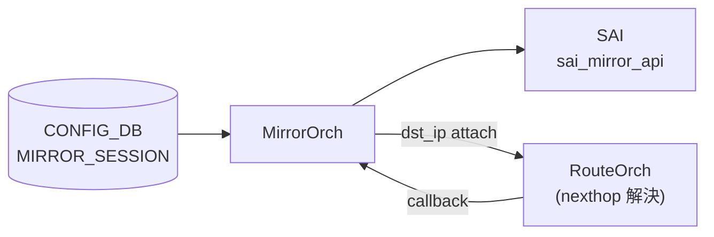

# MIRROR_SESSION (ERSPAN 種別)

## 概要

[CONFIG_DB](../../reference/glossary.md#term-config_db) の `MIRROR_SESSION` テーブルで `type=ERSPAN`（または `type` を省略）した場合の詳細リファレンス。外側 GRE/IP ヘッダ各フィールドのコード由来の暗黙デフォルト、プラットフォーム依存挙動、YANG との乖離を記述する[^1][^2]。

SPAN 共通項目（テーブル構造・key 形式・購読者・書き込み入り口）は [`MIRROR_SESSION` テーブル](./mirror-session.md) を参照。

<!-- cdb-mermaid -->
### データフロー (自動生成)



!!! note "凡例"
    ERSPAN の場合、RouteOrch に `dst_ip` を登録して nexthop 解決を待つ非同期フローになる。

<!-- /cdb-mermaid -->

## ERSPAN 専用フィールド

| フィールド | 型 | 必須 | YANG default | コード実初期値 | 説明 |
|-----------|----|------|-------------|---------------|------|
| `src_ip` | ip-address | ERSPAN 時必須 | — | — | 外側 IP ソースアドレス |
| `dst_ip` | ip-address | ERSPAN 時必須 | — | — | 外側 IP 宛先。nexthop 解決に使用 |
| `gre_type` | hex/dec uint16 | no | `0x88be` | `0x88be` (非 Mellanox) / `0x8949` (Mellanox) | GRE EtherType |
| `dscp` | uint8 (0..63) | no | **なし** | `8` (CS1 相当) | 外側 IP の DSCP。省略時 SAI に DSCP=8 が渡る |
| `ttl` | uint8 (0..255) | no | **なし** | `255` | 外側 IP の TTL。省略時 SAI に TTL=255 が渡る |
| `queue` | uint8 | no | **なし** | `0` | ミラーフレームの egress TC。`0` のとき SAI へ TC 属性を送らない |

<!-- defaults -->
## コード由来の暗黙デフォルト

<!-- evidence: sonic-swss/orchagent/mirrororch.cpp MirrorEntry constructor L57-77, activateSession L921-1100, sonic-buildimage/src/sonic-yang-models/yang-models/sonic-mirror-session.yang -->

### `gre_type` — プラットフォーム依存 discrepancy

YANG は `default 0x88be` を宣言しているが、`MirrorEntry` コンストラクタは `platform` 環境変数を参照し、Mellanox プラットフォームでは `greType = 0x8949` を使用する[^2]。

```cpp
// mirrororch.cpp:65-72
if (platform == MLNX_PLATFORM_SUBSTRING)
    greType = 0x8949;   // ERSPAN Type III / Broadcom 互換
else
    greType = 0x88be;   // ERSPAN Type II / Cisco 互換 (YANG default)
```

!!! warning "運用上の注意"
    `gre_type` を CONFIG_DB に書かない場合、Mellanox 環境では `0x8949` が使われる。対向コレクタが `0x88be` 期待であると mirror パケットが parse 不能になる。必ず明示的に指定すること。

### `dscp` — YANG に default なし、コードで 8 (CS1) が暗黙付与

YANG の `dscp` leaf に `default` 文なし。`MirrorEntry` コンストラクタで `dscp=8` が初期化され、`activateSession()` が `TOS = dscp << 2 = 32` として SAI に渡す[^2]。

| 状態 | SAI TOS 値 | 外側 IP DSCP |
|------|-----------|-------------|
| `dscp` 省略 | 32 (0x20) | 8 (CS1) |
| `dscp=0` 指定 | 0 | 0 (ベストエフォート) |
| `dscp=46` 指定 | 184 (0xB8) | 46 (EF) |

!!! note "YANG との乖離"
    YANG はデフォルト値を規定していないが、実装は DSCP=8 を暗黙使用する。QoS ポリシーと合わせる必要がある場合は明示的に `dscp` を指定すること。

### `ttl` — YANG に default なし、コードで 255 が暗黙付与

YANG の `ttl` leaf に `default` 文なし。コンストラクタで `ttl=255` が初期化され、`activateSession()` が `SAI_MIRROR_SESSION_ATTR_TTL = 255` として送出する[^2]。TTL 255 の ERSPAN パケットはルーティングに問題がなければ実害はないが、traceroute や TTL 制限ポリシーの対象になりうる。

### `queue` — 0 のとき SAI_MIRROR_SESSION_ATTR_TC を push しない

コンストラクタで `queue=0` が初期化される。`activateSession()` 内の条件分岐[^2]:

```cpp
// mirrororch.cpp:933-938
if (session.queue != 0)
{
    attr.id = SAI_MIRROR_SESSION_ATTR_TC;
    attr.value.u8 = session.queue;
    attrs.push_back(attr);
}
```

`queue=0` のとき TC 属性を SAI に送らない。コード注釈「Some platforms don't support `SAI_MIRROR_SESSION_ATTR_TC` and only support global mirror session traffic class」。プラットフォームの global mirror TC が使われる。

### `direction` — YANG default `BOTH` だが DB 省略時は空文字で silent drop

YANG `direction` の default は `"BOTH"` だが、CONFIG_DB に `direction` キーが存在しない場合、orchagent は `MirrorEntry.direction = ""` のまま処理する[^2]。

```cpp
// mirrororch.cpp:897, 906
if (session.direction == MIRROR_RX_DIRECTION || session.direction == MIRROR_BOTH_DIRECTION)
    setUnsetPortMirror(port, true, set, session.sessionId);   // RX
if (session.direction == MIRROR_TX_DIRECTION || session.direction == MIRROR_BOTH_DIRECTION)
    setUnsetPortMirror(port, false, set, session.sessionId);  // TX
```

`direction=""` はどの条件にもマッチしない → `src_port` が設定されていても RX/TX ミラーが silent drop になる。

!!! warning "CLI と直接 DB 操作の差異"
    `config mirror_session add` CLI は `src_port` 指定時に `direction` を自動補完して CONFIG_DB に書く。REST API や `sonic-db-cli` 直接操作では補完なし。ERSPAN + src_port の組み合わせでは `direction` を明示的に設定すること。

### ハードコード SAI 属性（CONFIG_DB から変更不可）

| SAI 属性 | 固定値 | コード |
|---------|-------|-------|
| `SAI_ERSPAN_ENCAPSULATION_TYPE` | `SAI_ERSPAN_ENCAPSULATION_TYPE_MIRROR_L3_GRE_TUNNEL` | `mirrororch.cpp:1005-1007` |
| IP ヘッダバージョン | `dst_ip` が v4 なら `4`、v6 なら `6`（自動） | `mirrororch.cpp:1009-1011` |
| src MAC | ルータ MAC (`gMacAddress`) | `mirrororch.cpp:1031-1033` |
| dst MAC | nexthop neighbor の解決済み MAC（voq では router MAC 固定） | `mirrororch.cpp:1035-1045` |
| VLAN PRI / CFI | `0` / `0`（nexthop が VLAN ポートの場合のみ付与） | `mirrororch.cpp:996-1001` |

### `m_maxNumTC` fallback — SAI 取得失敗時 255

MirrorOrch 初期化時に `SAI_SWITCH_ATTR_QOS_MAX_NUMBER_OF_TRAFFIC_CLASSES` を SAI から取得する。取得失敗時は `m_maxNumTC = 255`（`MIRROR_SESSION_DEFAULT_NUM_TC`）を使用し、`queue` バリデーション（`queue >= m_maxNumTC`）が実質無効化される[^2]。

### STATE_DB MIRROR_SESSION_TABLE — ERSPAN 種別の書き込みフィールド

`MirrorOrch::setSessionState()` (`mirrororch.cpp:579-637`) が活性化後に STATE_DB へ書き込む読み取り専用フィールド:

| フィールド | 値の由来 | ERSPAN 固有挙動 |
|-----------|---------|---------------|
| `status` | `"active"` / `"inactive"` | dst_ip nexthop 解決完了まで `"inactive"` のまま |
| `monitor_port` | nexthop 出口ポート alias | **voq switch では recirc port alias に置換**（非voq: neighbor port） |
| `dst_mac` | neighbor の解決済み MAC | **voq switch では gMacAddress（ルータ MAC）に固定** |
| `route_prefix` | RouteOrch が解決した dst_ip の prefix | 例: `192.168.1.0/24` |
| `vlan_id` | nexthop が VLAN ポートの場合の VLAN ID | 非VLAN時は `"0"` |
| `next_hop_ip` | RouteOrch が返す nexthop IP | 直接接続ルートでは dst_ip と同値になりうる |

ウォームリブート時は `status`・`monitor_port`・`next_hop_ip` の 3 フィールドのみ読み戻す（`mirrororch.cpp:118-151`）。`dst_mac`・`route_prefix`・`vlan_id` は再計算される。

<!-- /defaults -->

## セッション活性化タイミング

ERSPAN セッションは以下の非同期チェーンで活性化される:

1. `createEntry()` → `m_routeOrch->attach(this, entry.dstIp)` で dst_ip を RouteOrch に登録
2. RouteOrch が nexthop 解決 callback → `MirrorOrch::updateNextHop()` → `updateSession()`
3. neighbor 情報（MAC・port）取得後 → `activateSession()` → `sai_mirror_api->create_mirror_session()`
4. STATE_DB `MIRROR_SESSION_TABLE.<name>.status` が `"active"` に更新

dst_ip のルートが存在しない場合、セッションは永久に `inactive` のまま。

<!-- cdb-exceptions -->
## ERSPAN 固有の例外条件

<!-- evidence: sonic-swss/orchagent/mirrororch.cpp -->

- **`src_ip`/`dst_ip` のアドレスファミリ不一致 → task_invalid_entry**: `mirrororch.cpp:494-498` で address family チェック。YANG `must` 制約でも拒否。
- **`dscp` が 0-63 の範囲外 → task_invalid_entry**: YANG `range "0..63"` 制約。`to_uint` 変換例外を catch して `task_invalid_entry`。
- **dst_ip が経路解決不能 → セッションが inactive のまま**: static/dynamic route が存在しない場合、RouteOrch callback が来ない。
- **voq switch での monitor port 変更**: ERSPAN セッションは nexthop portId の代わりに recirc port を使用。STATE_DB の `monitor_port` も recirc port 名になる（`mirrororch.cpp:960-975`）。
- **HW リソース不足 → task_failed**: `isHwResourcesAvailable()` が false の場合 `"HW resources are not available"` をログし `task_failed`（`mirrororch.cpp:500-503`）。

<!-- /cdb-exceptions -->

<!-- value-behavior -->
## 値依存挙動マトリクス（ERSPAN 固有）

| フィールド | 値 | 挙動 |
|-----------|-----|------|
| `gre_type` | 省略 (非 Mellanox) | `0x88be`（ERSPAN Type II / Cisco）で SAI へ |
| `gre_type` | 省略 (Mellanox) | `0x8949`（ERSPAN Type III / Broadcom）で SAI へ — YANG default と異なる |
| `gre_type` | `0x88be` 明示 | ERSPAN Type II（Cisco 準拠コレクタ向け） |
| `gre_type` | `0x8949` 明示 | ERSPAN Type III（Broadcom 準拠コレクタ向け） |
| `dscp` | 省略 | DSCP=8 (CS1) を SAI TOS として付与 |
| `dscp` | `0` 明示 | DSCP=0 (BE) を SAI TOS として付与 |
| `ttl` | 省略 | TTL=255 で ERSPAN パケット送出 |
| `queue` | 省略 / `0` | `SAI_MIRROR_SESSION_ATTR_TC` を SAI に push しない（global TC 使用） |
| `queue` | 1 以上 | `SAI_MIRROR_SESSION_ATTR_TC` を指定値で push |
| `direction` | 省略 (DB 直書き) | `configurePortMirrorSession()` で RX/TX ともに silent drop |
| `direction` | `BOTH` (CLI 経由) | RX・TX 両方で `setUnsetPortMirror` を呼び出す |
| `src_ip`/`dst_ip` | アドレスファミリ不一致 | `task_invalid_entry` |

<!-- /value-behavior -->

## 確認コマンド

```bash
# CONFIG_DB のエントリを確認
sonic-db-cli CONFIG_DB hgetall 'MIRROR_SESSION|everflow0'

# セッション活性化状態を確認
sonic-db-cli STATE_DB hgetall 'MIRROR_SESSION_TABLE|everflow0'

# CLI での表示
show mirror_session
```

## 引用元

[^1]: YANG 定義: `sonic-mirror-session.yang`. <https://github.com/sonic-net/sonic-buildimage/blob/9ea932ec2e18f35e58268ec2e4456b1d4afd65cd/src/sonic-yang-models/yang-models/sonic-mirror-session.yang>

[^2]: 実装: `mirrororch.cpp` / `mirrororch.h`. <https://github.com/sonic-net/sonic-swss/blob/master/orchagent/mirrororch.cpp>

<!-- topics-back-ref -->
## 関連 Topics

- [Topics: ACL / CoPP / Mirror / Packet Action](../../topics/07-acl-copp-mirror/index.md)

<!-- /topics-back-ref -->

<!-- ref-triangle:start -->

## 関連リファレンス

- [MIRROR_SESSION テーブル（SPAN/ERSPAN 共通）](./mirror-session.md)
- [YANG](../../reference/glossary.md#term-yang): [`sonic-mirror-session`](../yang/sonic-mirror-session.md)
- CLI: [`config mirror_session`](../cli/config-mirror-session.md)

<!-- ref-triangle:end -->
