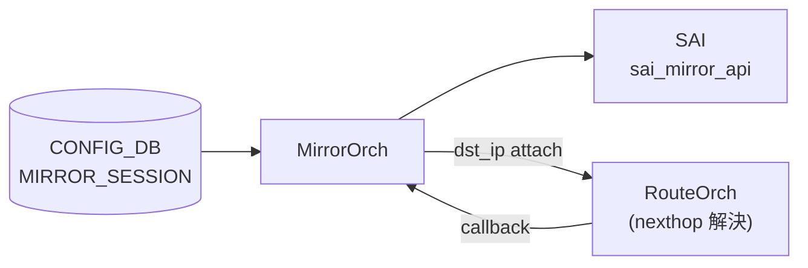

# MIRROR_SESSION (ERSPAN 種別)

## 概要

[CONFIG_DB](../../reference/glossary.md#term-config_db) の `MIRROR_SESSION` テーブルで `type=ERSPAN`（または `type` を省略）した場合の詳細リファレンス。外側 GRE/IP ヘッダ各フィールドのコード由来の暗黙デフォルト、プラットフォーム依存挙動、YANG との乖離を記述する[^1][^2]。

SPAN 共通項目（テーブル構造・key 形式・購読者・書き込み入り口）は [`MIRROR_SESSION` テーブル](./mirror-session.md) を参照。

<!-- cdb-mermaid -->
### データフロー (自動生成)



!!! note "凡例"
    ERSPAN の場合、RouteOrch に `dst_ip` を登録して nexthop 解決を待つ非同期フローになる。

<!-- /cdb-mermaid -->

## ERSPAN 専用フィールド

| フィールド | 型 | 必須 | YANG default | コード実初期値 | 説明 |
|-----------|----|------|-------------|---------------|------|
| `src_ip` | ip-address | ERSPAN 時必須 | — | — | 外側 IP ソースアドレス |
| `dst_ip` | ip-address | ERSPAN 時必須 | — | — | 外側 IP 宛先。nexthop 解決に使用 |
| `gre_type` | hex/dec uint16 | no | `0x88be` | `0x88be` (非 Mellanox) / `0x8949` (Mellanox) | GRE EtherType |
| `dscp` | uint8 (0..63) | no | **なし** | `8` (CS1 相当) | 外側 IP の DSCP。省略時 SAI に DSCP=8 が渡る |
| `ttl` | uint8 (0..255) | no | **なし** | `255` | 外側 IP の TTL。省略時 SAI に TTL=255 が渡る |
| `queue` | uint8 | no | **なし** | `0` | ミラーフレームの egress TC。`0` のとき SAI へ TC 属性を送らない |

<!-- defaults -->
## コード由来の暗黙デフォルト

<!-- evidence: sonic-swss/orchagent/mirrororch.cpp MirrorEntry constructor L57-77, activateSession L921-1100, sonic-buildimage/src/sonic-yang-models/yang-models/sonic-mirror-session.yang -->

### `gre_type` — プラットフォーム依存 discrepancy

YANG は `default 0x88be` を宣言しているが、`MirrorEntry` コンストラクタは `platform` 環境変数を参照し、Mellanox プラットフォームでは `greType = 0x8949` を使用する[^2]。

```cpp
// mirrororch.cpp:65-72
if (platform == MLNX_PLATFORM_SUBSTRING)
    greType = 0x8949;   // ERSPAN Type III / Broadcom 互換
else
    greType = 0x88be;   // ERSPAN Type II / Cisco 互換 (YANG default)
```

!!! warning "運用上の注意"
    `gre_type` を CONFIG_DB に書かない場合、Mellanox 環境では `0x8949` が使われる。対向コレクタが `0x88be` 期待であると mirror パケットが parse 不能になる。必ず明示的に指定すること。

### `dscp` — YANG に default なし、コードで 8 (CS1) が暗黙付与

YANG の `dscp` leaf に `default` 文なし。`MirrorEntry` コンストラクタで `dscp=8` が初期化され、`activateSession()` が `TOS = dscp << 2 = 32` として SAI に渡す[^2]。

| 状態 | SAI TOS 値 | 外側 IP DSCP |
|------|-----------|-------------|
| `dscp` 省略 | 32 (0x20) | 8 (CS1) |
| `dscp=0` 指定 | 0 | 0 (ベストエフォート) |
| `dscp=46` 指定 | 184 (0xB8) | 46 (EF) |

!!! note "YANG との乖離"
    YANG はデフォルト値を規定していないが、実装は DSCP=8 を暗黙使用する。QoS ポリシーと合わせる必要がある場合は明示的に `dscp` を指定すること。

### `ttl` — YANG に default なし、コードで 255 が暗黙付与

YANG の `ttl` leaf に `default` 文なし。コンストラクタで `ttl=255` が初期化され、`activateSession()` が `SAI_MIRROR_SESSION_ATTR_TTL = 255` として送出する[^2]。TTL 255 の ERSPAN パケットはルーティングに問題がなければ実害はないが、traceroute や TTL 制限ポリシーの対象になりうる。

### `queue` — 0 のとき SAI_MIRROR_SESSION_ATTR_TC を push しない

コンストラクタで `queue=0` が初期化される。`activateSession()` 内の条件分岐[^2]:

```cpp
// mirrororch.cpp:933-938
if (session.queue != 0)
{
    attr.id = SAI_MIRROR_SESSION_ATTR_TC;
    attr.value.u8 = session.queue;
    attrs.push_back(attr);
}
```

`queue=0` のとき TC 属性を SAI に送らない。コード注釈「Some platforms don't support `SAI_MIRROR_SESSION_ATTR_TC` and only support global mirror session traffic class」。プラットフォームの global mirror TC が使われる。

### `direction` — YANG default `BOTH` だが DB 省略時は空文字で silent drop

YANG `direction` の default は `"BOTH"` だが、CONFIG_DB に `direction` キーが存在しない場合、orchagent は `MirrorEntry.direction = ""` のまま処理する[^2]。

```cpp
// mirrororch.cpp:897, 906
if (session.direction == MIRROR_RX_DIRECTION || session.direction == MIRROR_BOTH_DIRECTION)
    setUnsetPortMirror(port, true, set, session.sessionId);   // RX
if (session.direction == MIRROR_TX_DIRECTION || session.direction == MIRROR_BOTH_DIRECTION)
    setUnsetPortMirror(port, false, set, session.sessionId);  // TX
```

`direction=""` はどの条件にもマッチしない → `src_port` が設定されていても RX/TX ミラーが silent drop になる。

!!! warning "CLI と直接 DB 操作の差異"
    `config mirror_session add` CLI は `src_port` 指定時に `direction` を自動補完して CONFIG_DB に書く。REST API や `sonic-db-cli` 直接操作では補完なし。ERSPAN + src_port の組み合わせでは `direction` を明示的に設定すること。

### ハードコード SAI 属性（CONFIG_DB から変更不可）

| SAI 属性 | 固定値 | コード |
|---------|-------|-------|
| `SAI_ERSPAN_ENCAPSULATION_TYPE` | `SAI_ERSPAN_ENCAPSULATION_TYPE_MIRROR_L3_GRE_TUNNEL` | `mirrororch.cpp:1005-1007` |
| IP ヘッダバージョン | `dst_ip` が v4 なら `4`、v6 なら `6`（自動） | `mirrororch.cpp:1009-1011` |
| src MAC | ルータ MAC (`gMacAddress`) | `mirrororch.cpp:1031-1033` |
| dst MAC | nexthop neighbor の解決済み MAC（voq では router MAC 固定） | `mirrororch.cpp:1035-1045` |
| VLAN PRI / CFI | `0` / `0`（nexthop が VLAN ポートの場合のみ付与） | `mirrororch.cpp:996-1001` |

### `m_maxNumTC` fallback — SAI 取得失敗時 255

MirrorOrch 初期化時に `SAI_SWITCH_ATTR_QOS_MAX_NUMBER_OF_TRAFFIC_CLASSES` を SAI から取得する。取得失敗時は `m_maxNumTC = 255`（`MIRROR_SESSION_DEFAULT_NUM_TC`）を使用し、`queue` バリデーション（`queue >= m_maxNumTC`）が実質無効化される[^2]。

### STATE_DB MIRROR_SESSION_TABLE — ERSPAN 種別の書き込みフィールド

`MirrorOrch::setSessionState()` (`mirrororch.cpp:579-637`) が活性化後に STATE_DB へ書き込む読み取り専用フィールド:

| フィールド | 値の由来 | ERSPAN 固有挙動 |
|-----------|---------|---------------|
| `status` | `"active"` / `"inactive"` | dst_ip nexthop 解決完了まで `"inactive"` のまま |
| `monitor_port` | nexthop 出口ポート alias | **voq switch では recirc port alias に置換**（非voq: neighbor port） |
| `dst_mac` | neighbor の解決済み MAC | **voq switch では gMacAddress（ルータ MAC）に固定** |
| `route_prefix` | RouteOrch が解決した dst_ip の prefix | 例: `192.168.1.0/24` |
| `vlan_id` | nexthop が VLAN ポートの場合の VLAN ID | 非VLAN時は `"0"` |
| `next_hop_ip` | RouteOrch が返す nexthop IP | 直接接続ルートでは dst_ip と同値になりうる |

ウォームリブート時は `status`・`monitor_port`・`next_hop_ip` の 3 フィールドのみ読み戻す（`mirrororch.cpp:118-151`）。`dst_mac`・`route_prefix`・`vlan_id` は再計算される。

<!-- /defaults -->

## セッション活性化タイミング

ERSPAN セッションは以下の非同期チェーンで活性化される:

1. `createEntry()` → `m_routeOrch->attach(this, entry.dstIp)` で dst_ip を RouteOrch に登録
2. RouteOrch が nexthop 解決 callback → `MirrorOrch::updateNextHop()` → `updateSession()`
3. neighbor 情報（MAC・port）取得後 → `activateSession()` → `sai_mirror_api->create_mirror_session()`
4. STATE_DB `MIRROR_SESSION_TABLE.<name>.status` が `"active"` に更新

dst_ip のルートが存在しない場合、セッションは永久に `inactive` のまま。

<!-- ordering -->
## 書込み順依存 (Phase B)

`MirrorOrch` は CONFIG_DB `MIRROR_SESSION` を消費し、ERSPAN セッションを SAI に反映する。ERSPAN 種別は RouteOrch / NeighOrch との非同期協調を必要とするため、書込み順依存が複数存在する。

### 検出された順序依存

| # | 依存関係 | 方向 | 緩和策 |
|---|----------|------|--------|
| 1 | `gPortsOrch->allPortsReady()` が true になる → `doTask()` が MIRROR_SESSION を処理し始める | **強制先行** | allPortsReady() が false の間は `doTask()` が即リターン。SET コマンドは Consumer キューに滞留し、ポート初期化完了後に一括処理される |
| 2 | `MIRROR_SESSION` SET → `m_routeOrch->attach(this, entry.dstIp)` → RouteOrch が nexthop 解決 callback → `activateSession()` | **非同期先行**（RouteOrch 依存） | dst_ip のルートが未確定の間はセッションが `inactive` のまま。RouteOrch の処理完了 (callback) まで SAI への create_mirror_session は実行されない |
| 3 | nexthop 解決済み neighbor MAC → `NeighOrch::getNeighborEntry()` 成功 → `activateSession()` 実行 | **非同期先行**（NeighOrch 依存） | neighbor が ARP/ND 解決済みでない場合は `getNeighborInfo()` が失敗し `activateSession()` がスキップされる（`mirrororch.cpp:656-664`） |
| 4 | `createEntry()` 成功 (SAI create_mirror_session) → STATE_DB `MIRROR_SESSION_TABLE.<name>.status = "active"` | SET 成功後即時 | STATUS は `setSessionState()` 内で `status=active` に書き込まれる。consumer は `inactive` を一時的に観測しうる |
| 5 | orchdaemon 起動時: PortsOrch / RouteOrch / NeighOrch / FdbOrch / PolicerOrch / SwitchOrch の 3 ループが先行 → その後 MirrorOrch `doTask()` → さらに AclOrch `doTask()` | **強制順序**（orchdaemon 設計） | `orchdaemon.cpp:1127-1142` コメント「MirrorOrch depends on everything else being settled before it can run, and mirror ACL rules depend on MirrorOrch, so run these two at the end」。AclOrch の mirror アクション ACL はセッションが active になった後に処理される |
| 6 | `POLICER` SET が先行 → `MIRROR_SESSION` で `policer` フィールド参照 | 任意先行（省略可） | `policer` フィールド省略時は PolicerOrch 参照なし。指定時は `gPolicerOrch->getPolicer()` が失敗すると `task_need_retry` でキュー再試行 |

### 主要な制約詳細

**PortsOrch 初期化ガード (依存 #1)**: `doTask()` 冒頭で `gPortsOrch->allPortsReady()` をチェックし、false の場合は即 return する（`mirrororch.cpp:1571`）。これにより起動直後の設定投入は全ポート初期化完了まで実際の処理がされない。

**RouteOrch 非同期依存 (依存 #2)**: ERSPAN セッション作成時、`createEntry()` は `m_routeOrch->attach(this, entry.dstIp)` で MirrorOrch を RouteOrch の observer に登録する（`mirrororch.cpp:517`）。RouteOrch が dst_ip のルート/nexthop を解決すると `MirrorOrch::updateNextHop()` → `updateSession()` → `activateSession()` の callback チェーンが走る。`MIRROR_SESSION` SET と SAI create の間に任意の遅延が発生しうる。

**orchdaemon の MirrorOrch 後回し設計 (依存 #5)**: warm reboot リストア時も通常 Select ループ時も、`orchdaemon` は MirrorOrch を 3 ループの最後に実行し (`orchdaemon.cpp:1142`)、さらにその後 AclOrch を実行する。ACL ルールの `MIRROR_INGRESS_ACTION` / `MIRROR_EGRESS_ACTION` は参照するセッションが active でなければ SAI に反映されない点に注意（evidence: `mirrororch.cpp:80-95, 1567-1571`, `orchdaemon.cpp:1127-1142`）。

<!-- /ordering -->

<!-- cross-refs -->
## 暗黙参照・共依存テーブル (Phase C)

> 調査証跡: `meta/_intermediate/cdb-flow/erspan-cross-refs.md`

`MIRROR_SESSION` (ERSPAN 種別) は YANG leafref を持たないが、実装レベルで以下の外部テーブル・コンポーネントへの依存が存在する。

| 参照先テーブル / コンポーネント | YANG leafref | 参照種別 | 非充足時の挙動 | evidence |
|---|:---:|---|---|---|
| `PORT` (PortsOrch `allPortsReady()`) | ✗ | 起動順序ガード（常時） | false の間は全 MIRROR_SESSION 処理がブロック。CONFIG_DB エントリは Consumer キューに滞留し、全ポート初期化完了後に一括処理される | `mirrororch.cpp:1571` |
| RouteOrch (`m_routeOrch->attach(dst_ip)`) | ✗ | 非同期 nexthop 解決（ERSPAN 常時） | dst_ip のルートが未確定の間は `activateSession()` が実行されず、セッションは `inactive` のまま。RouteOrch callback を受信後に初めて SAI create が実行される | `mirrororch.cpp:517, 557` |
| NeighOrch (`getNeighborEntry()`) | ✗ | nexthop neighbor MAC/port 解決（ERSPAN 常時） | ARP/ND が未解決の場合 `getNeighborInfo()` が false を返し `activateSession()` がスキップされる。解決後に FdbOrch / NeighOrch callback 経由で再実行 | `mirrororch.cpp:656-664` |
| `POLICER` (PolicerOrch `getPolicerOid()`) | ✗ | policer OID 解決（`policer` フィールド指定時のみ） | POLICER エントリ未登録なら `getPolicerOid()` が false → `activateSession()` return false → セッション `inactive` のまま | `mirrororch.cpp:1052-1060` |
| `PORT` / `LAG` (PortsOrch `getPort()`) | ✗ | src_port ポートオブジェクト解決（`src_port` 指定時のみ） | ポート未登録なら `task_invalid_entry`（LAG メンバが src_port の別 LAG と重複する場合もエラー） | `mirrororch.cpp:316, 892` |
| FdbOrch | ✗ | FDB 変化通知受信（起動時 attach、常時） | FDB エントリ変化で `updateSession()` callback → nexthop MAC 更新 → `activateSession()` 再実行 | `mirrororch.cpp:95` |
| `STATE_DB MIRROR_SESSION_TABLE` | ✗ | 書き込み先（producer only） | `activateSession()` / `deactivateSession()` 成功後に `status`, `monitor_port`, `dst_mac`, `route_prefix` 等を書き込む | `mirrororch.cpp:579-637` |
| SAI Switch (`SAI_SWITCH_ATTR_QOS_MAX_NUMBER_OF_TRAFFIC_CLASSES`) | ✗ | queue 値上限の SAI 問い合わせ（初期化時 1 回） | 取得失敗時は `m_maxNumTC = 255`（`MIRROR_SESSION_DEFAULT_NUM_TC`）でフォールバック。queue バリデーションが実質無効化 | `mirrororch.cpp:100-109` |
| SAI Mirror Session resource count | ✗ | HW リソース残量確認（SET 時毎回） | `isHwResourcesAvailable()` が false なら `task_failed`（`"HW resources are not available"`） | `mirrororch.cpp:360-370` |

### YANG leafref 非存在の補足

`sonic-mirror-session.yang` では `policer` フィールドに POLICER テーブルへの leafref がなく、`src_port` にも PORT/LAG への leafref がない。参照整合性は実装レベル（`getPolicerOid()` の戻り値チェック・`getPort()` の失敗処理）のみで担保される。

### 活性化コールバックチェーン

```
MIRROR_SESSION SET
  → createEntry() → m_routeOrch->attach(this, dst_ip)  # RouteOrch observer 登録
       ↓（非同期: RouteOrch が nexthop 解決後）
  MirrorOrch::updateNextHop() → updateSession() → activateSession()
       ↓（NeighOrch がARP/ND 解決後）
  getNeighborInfo() 成功 → sai_mirror_api->create_mirror_session()
       ↓
  STATE_DB MIRROR_SESSION_TABLE.<name>.status = "active"
```

`dst_ip` 経路が存在しない場合は RouteOrch callback が発生せず、セッションは永久に `inactive` のまま滞留する（ログ・エラー通知なし）。

> **Evidence**: `mirrororch.cpp:80-95` (コンストラクタ・observer attach); `mirrororch.cpp:517` (routeOrch attach); `mirrororch.cpp:647-670` (getNeighborInfo); `mirrororch.cpp:1052-1060` (policer 解決); `mirrororch.cpp:1571` (allPortsReady ガード)
<!-- /cross-refs -->

<!-- failure -->
## 失敗挙動マトリクス (Phase D)

> 調査証跡: `meta/_intermediate/cdb-flow/erspan-failure.md`

### SET 処理 (createEntry) における失敗経路

| 失敗条件 | 結果 | ログ出力 | evidence |
|---|---|---|---|
| セッション名が既に存在 | `task_duplicated`（処理なし） | NOTICE "Failed to create session %s: object already exists" | `mirrororch.cpp:391-392` |
| `queue` 値が `m_maxNumTC` 以上 | `task_invalid_entry` | ERROR "Failed to get valid queue %s" | `mirrororch.cpp:428-429` |
| `policer` 名が PolicerOrch に未登録 | `task_need_retry`（POLICER 追加後に自動再試行） | ERROR "Failed to get policer %s" | `mirrororch.cpp:436-438` |
| `src_port` にポートが存在しない / PHY・LAG 以外 | `task_invalid_entry` | ERROR "Failed to locate Port/LAG %s" / "Not supported port type %d" | `mirrororch.cpp:447-449` |
| `dst_port` が存在しない / PHY 以外 | `task_invalid_entry` | ERROR "Not supported port %s type %d" | `mirrororch.cpp:455-458` |
| `direction` が RX/TX/BOTH 以外 | `task_invalid_entry` | ERROR "Failed to get valid direction %s" | `mirrororch.cpp:466-468` |
| 不明フィールド名 | `task_invalid_entry` | ERROR "Failed to parse session %s configuration. Unknown attribute %s" | `mirrororch.cpp:477-479` |
| フィールド値数値変換で `std::exception` | `task_invalid_entry` | ERROR "Failed to parse session %s attribute %s error: %s." | `mirrororch.cpp:483-485` |
| フィールド値数値変換で不明例外 (`...`) | `task_failed` | ERROR "Failed to parse session %s attribute %s. Unknown error has been occurred" | `mirrororch.cpp:488-490` |
| `src_ip`/`dst_ip` のアドレスファミリ不一致 | `task_invalid_entry` | ERROR "Address family of source and destination IPs is different" | `mirrororch.cpp:494-497` |
| `isHwResourcesAvailable()` が false（HW リソース枯渇） | `task_failed` | ERROR "Failed to create session %s: HW resources are not available" | `mirrororch.cpp:500-503` |

### DEL 処理 (deleteEntry) における失敗経路

| 失敗条件 | 結果 | ログ出力 | evidence |
|---|---|---|---|
| 存在しないセッション名を DEL | `task_invalid_entry` | ERROR "Failed to remove non-existent mirror session %s" | `mirrororch.cpp:532-534` |
| `refCount > 0`（ACL_RULE 等から参照中） | `task_need_retry`（参照解除後に自動再試行） | WARN "Failed to remove still referenced mirror session %s, retry..." | `mirrororch.cpp:541-543` |
| `deactivateSession()` が false（SAI remove 失敗） | `task_failed` | ERROR "Failed to remove mirror session %s" | `mirrororch.cpp:549-551` |

### activateSession における失敗経路（ERSPAN 固有）

| 失敗条件 | 結果 | ログ出力 | evidence |
|---|---|---|---|
| `getNeighborInfo()` が false（ARP/ND 未解決） | `false` 返却 → INACTIVE 維持（非同期回復） | — | `mirrororch.cpp:656-664` |
| VoQ スイッチで recirc ポート取得失敗 | `false` 返却 → INACTIVE 維持 | ERROR "Failed to get recirc port" | `mirrororch.cpp:966-967` |
| policer OID 取得失敗 | `false` 返却 → INACTIVE 維持 | ERROR "Failed to get policer %s" | `mirrororch.cpp:1052-1060` |
| `sai_mirror_api->create_mirror_session()` エラー | `session.status = false` → INACTIVE | ERROR "Failed to activate mirroring session %s" | `mirrororch.cpp:1070-1077` |

### 失敗パターン分類

| 分類 | doTask 後の挙動 | 自動回復 |
|---|---|---|
| `task_duplicated` | キューから除去・処理なし | — |
| `task_invalid_entry` | キューから除去（永続的失敗） | なし |
| `task_need_retry` | キューに残し次イベントで再試行 | POLICER 追加 / refCount 減少後に自動回復 |
| `task_failed` | キューから除去 | なし（HW リソース増加は不可） |
| `false`（activateSession） | INACTIVE 状態維持 | RouteOrch/NeighOrch 等の変化による非同期回復 |

!!! note "allPortsReady guard — silent 待機"
    `doTask()` 冒頭（`mirrororch.cpp:1571-1574`）で `gPortsOrch->allPortsReady()` が false の間は全エントリを処理せず早期 return する。エラーログは出ず silent 待機となる。

!!! note "task_need_retry の再試行タイミング"
    `mirrororch.cpp:1599-1604` にて `task_need_retry` のエントリだけキューに残す。再試行は次回 `doTask()` 実行時（Consumer イベント受信時）に自動で行われる。POLICER 未登録の場合は POLICER の SET イベントが MirrorOrch の Consumer をウェイクアップしないため、手動でミラーセッションを再 SET するか swss を再起動する必要がある点に注意。
<!-- /failure -->

<!-- cdb-exceptions -->
## ERSPAN 固有の例外条件

<!-- evidence: sonic-swss/orchagent/mirrororch.cpp -->

- **`src_ip`/`dst_ip` のアドレスファミリ不一致 → task_invalid_entry**: `mirrororch.cpp:494-498` で address family チェック。YANG `must` 制約でも拒否。
- **`dscp` が 0-63 の範囲外 → task_invalid_entry**: YANG `range "0..63"` 制約。`to_uint` 変換例外を catch して `task_invalid_entry`。
- **dst_ip が経路解決不能 → セッションが inactive のまま**: static/dynamic route が存在しない場合、RouteOrch callback が来ない。
- **voq switch での monitor port 変更**: ERSPAN セッションは nexthop portId の代わりに recirc port を使用。STATE_DB の `monitor_port` も recirc port 名になる（`mirrororch.cpp:960-975`）。
- **HW リソース不足 → task_failed**: `isHwResourcesAvailable()` が false の場合 `"HW resources are not available"` をログし `task_failed`（`mirrororch.cpp:500-503`）。

<!-- /cdb-exceptions -->

<!-- constants -->
## ハードコード定数 (Phase E)

`MirrorOrch` (`mirrororch.cpp` / `mirrororch.h`) 内に存在する、CONFIG_DB / YANG で管理されないハードコード定数の一覧。これらの値は ERSPAN セッションの SAI 設定・STATE_DB 書き込み値・バリデーション上限に直接影響する。

### MirrorEntry コンストラクタ初期値

| 定数 / フィールド | 値 | 用途 | ソース |
|------------------|----|------|--------|
| `dscp` 初期値 | `8` (CS1 相当) | `MirrorEntry` コンストラクタで初期化。CONFIG_DB に `dscp` フィールドがない場合に使用される。`activateSession()` が `TOS = dscp << 2 = 32` として SAI へ渡す | `mirrororch.cpp:L60` |
| `ttl` 初期値 | `255` | `MirrorEntry` コンストラクタで初期化。CONFIG_DB に `ttl` フィールドがない場合に使用される。`SAI_MIRROR_SESSION_ATTR_TTL = 255` として SAI へ渡す | `mirrororch.cpp:L61` |
| `queue` 初期値 | `0` | `MirrorEntry` コンストラクタで初期化。`queue == 0` のとき `SAI_MIRROR_SESSION_ATTR_TC` を SAI に送らない（global TC を使用） | `mirrororch.cpp:L62` |
| `greType` 非 Mellanox | `0x88be` | Mellanox プラットフォーム以外でのデフォルト GRE EtherType（ERSPAN Type II / Cisco 互換）。YANG `default` と一致 | `mirrororch.cpp:L71` |
| `greType` Mellanox | `0x8949` | `platform == "mellanox"` 時のデフォルト GRE EtherType（ERSPAN Type III / Broadcom 互換）。YANG `default 0x88be` と乖離 | `mirrororch.cpp:L67` |

### SAI 属性ハードコード値

| 定数 | 値 | 用途 | ソース |
|------|----|------|--------|
| `MIRROR_SESSION_DEFAULT_VLAN_PRI` | `0` | nexthop が VLAN ポートの場合に SAI `SAI_MIRROR_SESSION_ATTR_VLAN_PRI` へ設定する固定値 | `mirrororch.cpp:L35, L997, L1250` |
| `MIRROR_SESSION_DEFAULT_VLAN_CFI` | `0` | nexthop が VLAN ポートの場合に SAI `SAI_MIRROR_SESSION_ATTR_VLAN_CFI` へ設定する固定値 | `mirrororch.cpp:L36, L1001, L1254` |
| `MIRROR_SESSION_IP_HDR_VER_4` | `4` | IPv4 ヘッダバージョン。`dst_ip` が v4 アドレスのとき `SAI_MIRROR_SESSION_ATTR_IPHDR_VERSION = 4` | `mirrororch.cpp:L37` |
| `MIRROR_SESSION_IP_HDR_VER_6` | `6` | IPv6 ヘッダバージョン。`dst_ip` が v6 アドレスのとき `SAI_MIRROR_SESSION_ATTR_IPHDR_VERSION = 6` | `mirrororch.cpp:L38` |
| `MIRROR_SESSION_DSCP_SHIFT` | `2` | DSCP 値を左シフトして TOS バイト変換する際のシフト量（TOS = dscp << 2） | `mirrororch.cpp:L39` |
| `MIRROR_SESSION_DSCP_MIN` / `MIRROR_SESSION_DSCP_MAX` | `0` / `63` | `to_uint<uint8_t>()` の範囲バリデーション上下限。範囲外は `std::exception` → `task_invalid_entry` | `mirrororch.cpp:L40-41` |
| ERSPAN カプセル化タイプ | `SAI_ERSPAN_ENCAPSULATION_TYPE_MIRROR_L3_GRE_TUNNEL` | ERSPAN セッションに固定設定される SAI カプセル化タイプ。CONFIG_DB から変更不可 | `mirrororch.cpp:L1006` |

### TC 上限フォールバック

| 定数 | 値 | 用途 | ソース |
|------|----|------|--------|
| `MIRROR_SESSION_DEFAULT_NUM_TC` | `255` | `SAI_SWITCH_ATTR_QOS_MAX_NUMBER_OF_TRAFFIC_CLASSES` の SAI 取得失敗時のフォールバック値。`m_maxNumTC = 255` となり `queue >= m_maxNumTC` の上限チェックが実質無効化される | `mirrororch.cpp:L45, L104` |

### STATE_DB フィールド値定数

| 定数 | 値 | 用途 | ソース |
|------|----|------|--------|
| `MIRROR_SESSION_STATUS_ACTIVE` | `"active"` | `activateSession()` 成功後に `STATE_DB MIRROR_SESSION_TABLE.<name>.status` へ書き込む固定文字列 | `mirrororch.cpp:L16` |
| `MIRROR_SESSION_STATUS_INACTIVE` | `"inactive"` | `deactivateSession()` 後に `status` へ書き込む固定文字列。セッションが inactive 状態になるすべてのケースで使用 | `mirrororch.cpp:L17` |

### プラットフォーム判定文字列

| 定数 | 値 | 用途 | ソース |
|------|----|------|--------|
| `MLNX_PLATFORM_SUBSTRING` | `"mellanox"` | `getenv("platform")` の戻り値と比較して Mellanox プラットフォームを判定。`greType` の分岐に使用（`mirrororch.cpp:L395, L65`）。完全一致比較（`== MLNX_PLATFORM_SUBSTRING`）であり、部分一致ではない点に注意 | `orch.h:L42` |

> **スキャン証跡**: `mirrororch.cpp` L14-45 (define 定数), L57-77 (MirrorEntry コンストラクタ), L100-109 (m_maxNumTC 初期化), L395 (platform getenv), L997-1011 (VLAN PRI/CFI + IP HDR VER), L1003-1007 (ERSPAN カプセル化タイプ) 読了。`mirrororch.h` L36, L99-100 読了。`orch.h` L42 読了。定数 6 種別 16 件を確認。
<!-- /constants -->

<!-- side-effects -->
## 副次 DB 書込み (Phase F)

> 調査証跡: `meta/_intermediate/cdb-flow/erspan-side-effects.md`  
> ソース: `sonic-swss/orchagent/mirrororch.cpp` (setSessionState L574-637, removeSessionState L640-645, activateSession L921-1100, deactivateSession L1104-1151)

### STATE_DB — MIRROR_SESSION_TABLE

`MirrorOrch` コンストラクタで `m_mirrorTable` が `STATE_DB` の `"MIRROR_SESSION_TABLE"` に初期化される（`mirrororch.cpp:88`）。`setSessionState()` が `m_mirrorTable.set()` で以下のフィールドを書き込み、`removeSessionState()` が `m_mirrorTable.del()` でエントリ全体を削除する。

| 書込みタイミング | フィールド | 値 | evidence |
|---|---|---|---|
| `activateSession()` 成功 | `status` | `"active"` | `mirrororch.cpp:583-586, 1093` |
| `deactivateSession()` 成功 | `status` | `"inactive"` | `mirrororch.cpp:1138, 583-586` |
| `activateSession()` 成功 (ERSPAN) | `monitor_port` | nexthop 出口ポート alias。VoQ switch では recirc ポート alias | `mirrororch.cpp:589-605` |
| `activateSession()` 成功 (ERSPAN) | `dst_mac` | nexthop の解決済み MAC アドレス。VoQ では `gMacAddress`（ルータ MAC）に固定 | `mirrororch.cpp:607-616` |
| `activateSession()` 成功 (ERSPAN) | `route_prefix` | RouteOrch が解決した `dst_ip` の prefix 文字列（例: `192.168.1.0/24`） | `mirrororch.cpp:619-623` |
| `activateSession()` 成功 (ERSPAN, VLAN 経由 nexthop) | `vlan_id` | VLAN ID（十進文字列）。非 VLAN 経由時は `"0"` | `mirrororch.cpp:625-629` |
| `activateSession()` 成功 (ERSPAN) | `next_hop_ip` | RouteOrch が返す nexthop IP アドレス文字列 | `mirrororch.cpp:631-635` |
| nexthop 変化時（部分更新） | 変化したフィールドのみ | 対応する最新値 | `mirrororch.cpp:1176, 1223, 1285, 1310, 1363` |
| `removeSessionState()` (セッション DEL) | — | エントリ全体を削除 | `mirrororch.cpp:644` |

!!! note "ウォームリブート時の読み戻し"
    `MirrorOrch` 起動時（`mirrororch.cpp:118-151`）に STATE_DB の既存エントリを読み込み内部構造体を復元する。`status`・`monitor_port`・`next_hop_ip` の 3 フィールドのみ読み戻し、`dst_mac`・`route_prefix`・`vlan_id` は再計算される。

```bash
# 確認コマンド
sonic-db-cli STATE_DB hgetall 'MIRROR_SESSION_TABLE|everflow0'
```

### ASIC_DB 書込み (SAI 経由)

MirrorOrch は `sai_mirror_api` を直接呼び出す。`syncd` がその SAI 操作を ASIC_DB に記録する。

| タイミング | SAI API | ASIC_DB への反映 | evidence |
|---|---|---|---|
| `activateSession()` 成功 | `sai_mirror_api->create_mirror_session()` | `ASIC_STATE:SAI_OBJECT_TYPE_MIRROR_SESSION:<oid>` 生成 | `mirrororch.cpp:1066-1067` |
| src_port ミラー設定 | `sai_port_api->set_port_attribute(SAI_PORT_ATTR_INGRESS/EGRESS_MIRROR_SESSION)` | 対応ポート OID の mirror session 属性更新 | `mirrororch.cpp:813-877` |
| `deactivateSession()` 成功 | `sai_mirror_api->remove_mirror_session()` | `ASIC_STATE:SAI_OBJECT_TYPE_MIRROR_SESSION:<oid>` 削除 | `mirrororch.cpp:1123` |
| policer 指定時 | `create_mirror_session()` attrs に `SAI_MIRROR_SESSION_ATTR_POLICER` を含む | ASIC_DB mirror session OID に policer OID が関連付けられる | `mirrororch.cpp:1062-1065` |

### Observer 通知 (SUBJECT_TYPE_MIRROR_SESSION_CHANGE)

セッションのアクティブ化・非アクティブ化時に `notify(SUBJECT_TYPE_MIRROR_SESSION_CHANGE, ...)` を呼び出し、`AclOrch` 等の Observer に通知する。これにより ACL ルールのミラーアクション OID が即座に更新される。STATE_DB / ASIC_DB への直接書き込みではなくオブジェクト内 OID の更新のみ。

| タイミング | evidence |
|---|---|
| `activateSession()` 成功直後 | `mirrororch.cpp:1096` |
| `deactivateSession()` 実行直前 | `mirrororch.cpp:1111` |

### COUNTERS_DB / APPL_DB / APPL_STATE_DB

MirrorOrch はこれらへの書き込みを行わない。CRM カウンタ・FlexCounter 連携もない（`mirrororch.cpp` 内に `CrmOrch` / `flex_counter` 呼び出しなし）。

<!-- /side-effects -->

<!-- pubsub -->
## Redis 通知メカニズム (Phase G)

> 調査証跡: `meta/_intermediate/cdb-flow/erspan-pubsub.md`  
> ソース: `sonic-swss/orchagent/mirrororch.cpp`, `sonic-swss/orchagent/orchdaemon.cpp`, `sonic-swss/orchagent/orch.cpp`, `sonic-swss/orchagent/aclorch.cpp`

### 購読方式: SubscriberStateTable + keyspace PSUBSCRIBE

`MirrorOrch` は `Orch::addConsumer()` (`orch.cpp:1186-1190`) 経由で CONFIG_DB `MIRROR_SESSION` テーブルを購読する。内部では `SubscriberStateTable` が Redis keyspace notification を PSUBSCRIBE する。

購読チャンネルパターン:

```
PSUBSCRIBE __keyspace@4__:MIRROR_SESSION|*
```

書き込み側が `ProducerStateTable` を使う場合（`sonic-cfggen` / `config mirror_session` CLI など）は `MIRROR_SESSION_CHANNEL@4` への PUBLISH も行われるが、`SubscriberStateTable` は keyspace notification を使うため、**書き込み元が ProducerStateTable か直接 HSET かを問わずイベントを受信できる**。

### イベント発火から SAI 反映までの流れ

```
CONFIG_DB MIRROR_SESSION|<name> に SET/DEL
  → Redis: __keyspace@4__:MIRROR_SESSION|<name> に pmessage 発火
  → SubscriberStateTable::readData() が hiredis 経由で受信
  → orchdaemon select ループ (SELECT_TIMEOUT = 1000 ms、orchdaemon.cpp:23,959)
  → MirrorOrch::doTask(Consumer&) 呼び出し (mirrororch.cpp:1566)
      ├─ gPortsOrch->allPortsReady() が false → 即 return (全ポート初期化待ち)
      ├─ SET → createEntry()
      │    ├─ ポート・policer バリデーション
      │    ├─ ERSPAN: m_routeOrch->attach(this, dst_ip)
      │    │    └─ (非同期) RouteOrch callback → updateNextHop()
      │    │         → activateSession()
      │    │              → sai_mirror_api->create_mirror_session()
      │    │              → STATE_DB MIRROR_SESSION_TABLE.set()
      │    │              → notify(SUBJECT_TYPE_MIRROR_SESSION_CHANGE, ...)
      │    └─ task_need_retry (policer 未定義) → it++ で次ループ再試行
      └─ DEL → deleteEntry()
               → deactivateSession()
                    → sai_mirror_api->remove_mirror_session()
                    → notify(SUBJECT_TYPE_MIRROR_SESSION_CHANGE, ...)
               → STATE_DB MIRROR_SESSION_TABLE.del()
```

### 内部 Observer 通知 (Redis 非介在)

`MirrorOrch::activateSession()` (`mirrororch.cpp:1096`) と `deactivateSession()` (`mirrororch.cpp:1111`) は `Subject::notify(SUBJECT_TYPE_MIRROR_SESSION_CHANGE, ...)` を呼び出す。`AclOrch` が `m_mirrorOrch->attach(this)` (`aclorch.cpp:3720`) で登録しており、セッション変化時に ACL ルールの mirror OID を即座に更新する。**これは Redis pub/sub ではなく C++ オブジェクト内のコールバック**であり、STATE_DB への追加書き込みは伴わない。

### STATE_DB への書き込み方式

`MirrorOrch` は STATE_DB に対して `Table::set()` / `Table::del()` を直接使用する (`mirrororch.cpp:637,644`)。`ProducerStateTable` を経由しないため通常の Consumer/Producer チャンネルは使われない。STATE_DB `MIRROR_SESSION_TABLE` チャンネルへの keyspace pmessage は `Table::set()` が自動発火するが、このチャンネルを SUBSCRIBE する consumer プロセスは存在せず、`show mirror_session` は HGETALL で直接読み取る。

### retry 動作

`task_need_retry` 返却時（policer 未登録など）は `it++` で `m_toSync` に残留し、次回 select イベントループ (1000 ms 以内) で `doTask` が再呼び出しされる。明示的な sleep / timer は存在しない。

> 中間調査詳細: `meta/_intermediate/cdb-flow/erspan-pubsub.md`
<!-- /pubsub -->

<!-- platform -->

## プラットフォーム / SAI Capability 差異 (Phase H)

<!-- evidence: meta/_intermediate/cdb-flow/erspan-platform.md -->

### 差異 1: GRE protocol type の Mellanox 分岐

`MirrorEntry` コンストラクタ (`mirrororch.cpp:57-77`) は `getenv("platform")` を `MLNX_PLATFORM_SUBSTRING`（`"mellanox"`）と完全一致比較し、GRE type のデフォルトを分岐する[^3]:

```cpp
if (platform == MLNX_PLATFORM_SUBSTRING)
    greType = 0x8949;   // ERSPAN Type III / Broadcom 互換
else
    greType = 0x88be;   // ERSPAN Type II / Cisco 準拠
```

| プラットフォーム | デフォルト `gre_type` | YANG `default` | 整合性 |
|----------------|----------------------|----------------|--------|
| mellanox | `0x8949` | `0x88be` | **乖離あり** |
| その他全て | `0x88be` | `0x88be` | 一致 |

YANG 定義の `default 0x88be` は Mellanox では適用されない。`gre_type` を省略した MIRROR_SESSION エントリを Mellanox に投入した場合、コレクタは `0x8949` フレームを受信することに注意が必要。

### 差異 2: TC (Traffic Class) 属性の一部 ASIC 非対応

`activateSession()` (`mirrororch.cpp:931-938`) は `session.queue != 0` の場合のみ `SAI_MIRROR_SESSION_ATTR_TC` を SAI に push する:

```cpp
// Some platforms don't support SAI_MIRROR_SESSION_ATTR_TC and only
// support global mirror session traffic class.
if (session.queue != 0)
{
    attr.id = SAI_MIRROR_SESSION_ATTR_TC;
    attr.value.u8 = session.queue;
    attrs.push_back(attr);
}
```

`queue` を省略（デフォルト `0`）した場合は TC 属性を送らず、プラットフォームの global mirror session TC が採用される。`queue >= 1` を指定した際に `SAI_MIRROR_SESSION_ATTR_TC` 非対応 ASIC では `create_mirror_session()` がエラーを返す可能性がある[^4]。

### 差異 3: VoQ シャーシ — monitor port と DST MAC の自動置換

`gMySwitchType == "voq"` かつ ERSPAN セッションの場合、通常フローとは異なるフィールドが SAI に渡される:

| SAI 属性 | 非 VoQ | VoQ シャーシ |
|----------|--------|------------|
| `SAI_MIRROR_SESSION_ATTR_MONITOR_PORT` | 宛先物理ポートの OID | `getRecircPort(Rec)` の OID（recirc port）|
| `SAI_MIRROR_SESSION_ATTR_DST_MAC_ADDRESS` | 隣接 NEP 解決済み MAC | `gMacAddress`（スイッチ router MAC）|

VoQ ではチャーシス ファブリック側が L3 転送を担当するため、ERSPAN outer GRE パケットは recirc port 経由でファブリックに送出され、DST MAC は router MAC で事足りる。この自動置換は `mirrororch.cpp:961-969` (monitor port) および `mirrororch.cpp:1037-1041` (DST MAC) で実装されている[^4]。

### 差異 4: ハードウェアリソース可用性の SAI 依存

`isHwResourcesAvailable()` (`mirrororch.cpp:357-379`) が `sai_object_type_get_availability(SAI_OBJECT_TYPE_MIRROR_SESSION)` を呼ぶ。SAI が `NOT_SUPPORTED` / `NOT_IMPLEMENTED` を返す ASIC では警告ログのみで `true`（利用可能）として扱い、リソース上限監視を省略する。`availCount == 0` の場合は `createEntry()` が `task_need_retry` を返してセッション作成を保留する[^4]。

### 差異 5: Ingress / Egress mirror ASIC capability チェック

`setUnsetPortMirror()` (`mirrororch.cpp:817-826`) は `SwitchOrch::isPortIngressMirrorSupported()` / `isPortEgressMirrorSupported()` を確認する。Ingress mirror 非対応 ASIC に対して ingress 方向の mirror を設定しようとするとエラーログを出力して `false` を返し、SAI には属性が渡らない（セッション自体は STATE_DB に残る）[^4]。

[^3]: MirrorEntry コンストラクタ platform 分岐: `sonic-swss/orchagent/mirrororch.cpp:57-77`. <https://github.com/sonic-net/sonic-swss/blob/4305596156d7/orchagent/mirrororch.cpp#L57>

[^4]: MirrorOrch platform 分岐詳細 (TC / VoQ / HW resource / ASIC capability): `sonic-swss/orchagent/mirrororch.cpp:357-379,817-826,931-938,961-969,1037-1041`. <https://github.com/sonic-net/sonic-swss/blob/4305596156d7/orchagent/mirrororch.cpp#L357>

<!-- /platform -->

<!-- value-behavior -->
## 値依存挙動マトリクス（ERSPAN 固有）

| フィールド | 値 | 挙動 |
|-----------|-----|------|
| `gre_type` | 省略 (非 Mellanox) | `0x88be`（ERSPAN Type II / Cisco）で SAI へ |
| `gre_type` | 省略 (Mellanox) | `0x8949`（ERSPAN Type III / Broadcom）で SAI へ — YANG default と異なる |
| `gre_type` | `0x88be` 明示 | ERSPAN Type II（Cisco 準拠コレクタ向け） |
| `gre_type` | `0x8949` 明示 | ERSPAN Type III（Broadcom 準拠コレクタ向け） |
| `dscp` | 省略 | DSCP=8 (CS1) を SAI TOS として付与 |
| `dscp` | `0` 明示 | DSCP=0 (BE) を SAI TOS として付与 |
| `ttl` | 省略 | TTL=255 で ERSPAN パケット送出 |
| `queue` | 省略 / `0` | `SAI_MIRROR_SESSION_ATTR_TC` を SAI に push しない（global TC 使用） |
| `queue` | 1 以上 | `SAI_MIRROR_SESSION_ATTR_TC` を指定値で push |
| `direction` | 省略 (DB 直書き) | `configurePortMirrorSession()` で RX/TX ともに silent drop |
| `direction` | `BOTH` (CLI 経由) | RX・TX 両方で `setUnsetPortMirror` を呼び出す |
| `src_ip`/`dst_ip` | アドレスファミリ不一致 | `task_invalid_entry` |

<!-- /value-behavior -->

## 確認コマンド

```bash
# CONFIG_DB のエントリを確認
sonic-db-cli CONFIG_DB hgetall 'MIRROR_SESSION|everflow0'

# セッション活性化状態を確認
sonic-db-cli STATE_DB hgetall 'MIRROR_SESSION_TABLE|everflow0'

# CLI での表示
show mirror_session
```

## 引用元

[^1]: YANG 定義: `sonic-mirror-session.yang`. <https://github.com/sonic-net/sonic-buildimage/blob/9ea932ec2e18f35e58268ec2e4456b1d4afd65cd/src/sonic-yang-models/yang-models/sonic-mirror-session.yang>

[^2]: 実装: `mirrororch.cpp` / `mirrororch.h`. <https://github.com/sonic-net/sonic-swss/blob/master/orchagent/mirrororch.cpp>

<!-- topics-back-ref -->
## 関連 Topics

- [Topics: ACL / CoPP / Mirror / Packet Action](../../topics/07-acl-copp-mirror/index.md)

<!-- /topics-back-ref -->

<!-- ref-triangle:start -->

## 関連リファレンス

- [MIRROR_SESSION テーブル（SPAN/ERSPAN 共通）](./mirror-session.md)
- [YANG](../../reference/glossary.md#term-yang): [`sonic-mirror-session`](../yang/sonic-mirror-session.md)
- CLI: [`config mirror_session`](../cli/config-mirror-session.md)

<!-- ref-triangle:end -->
