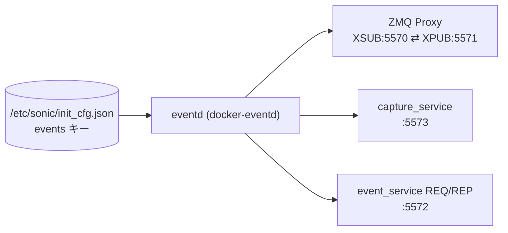

# イベントパブリッシャー設定 (init_cfg events)

## 概要

SONiC の Event and Alarm Framework は `eventd` デーモンが中心となり、ZeroMQ (ZMQ) メッセージバスを介して全コンテナ・プロセスからのイベントを収集・配信する[^1]。`eventd` は起動時に `/etc/sonic/init_cfg.json` の `"events"` キーを読み込み、ZMQ エンドポイントアドレス・キャッシュ上限・統計更新間隔を取得する。

これらのパラメータは従来の [CONFIG_DB](../../reference/glossary.md#term-config_db) テーブルではなく、ファイルベース設定として管理される点が他テーブルと異なる。

<!-- cdb-mermaid -->
### データフロー (自動生成)



!!! note "凡例"
    CONFIG_DB ではなく `init_cfg.json` から読み込まれる起動時設定。`eventd` が各 ZMQ ソケットをバインドし、パブリッシャー・サブスクライバー・テレメトリコンテナが接続する。
<!-- /cdb-mermaid -->

## 設定ファイル構造

```json
// /etc/sonic/init_cfg.json
{
  "events": {
    "xsub_path":      "tcp://127.0.0.1:5570",
    "xpub_path":      "tcp://127.0.0.1:5571",
    "req_rep_path":   "tcp://127.0.0.1:5572",
    "capture_path":   "tcp://127.0.0.1:5573",
    "stats_upd_secs": "5",
    "cache_max_cnt":  ""
  }
}
```

キーが存在しない場合は `events_common.cpp` 内の `cfg_default` マップがフォールバックとして使われる[^2]。

## フィールド

| フィールド | 型 | デフォルト | 説明 |
|-----------|----|-----------|------|
| `xsub_path` | string (ZMQ URI) | `tcp://127.0.0.1:5570` | パブリッシャーが接続する ZMQ XSUB エンドポイント |
| `xpub_path` | string (ZMQ URI) | `tcp://127.0.0.1:5571` | サブスクライバーが接続する ZMQ XPUB エンドポイント |
| `req_rep_path` | string (ZMQ URI) | `tcp://127.0.0.1:5572` | eventd 制御サービスの REQ/REP エンドポイント |
| `capture_path` | string (ZMQ URI) | `tcp://127.0.0.1:5573` | キャッシュ収集用内部 PUB エンドポイント |
| `stats_upd_secs` | string (数値) | `"5"` | [COUNTERS_DB](../../reference/glossary.md#term-counters_db) への統計書き込み間隔 (秒) |
| `cache_max_cnt` | string (数値) | `""` → 699050 件 | イベントキャッシュの最大件数。空文字列の場合は MAX_CACHE_SIZE (≈ 100 MB / 150 B) が使用される |

## ハートビート設定

`eventd` はハートビートイベントを定期的に `sonic-events-eventd:heartbeat` タグで発行する。

| 設定項目 | デフォルト | 説明 |
|---------|-----------|------|
| ハートビート間隔 | `2` 秒 | `HEARTBEAT_INTERVAL_SECS` 定数。`EVENT_OPTIONS` リクエストで動的変更可能 |
| 最小分解能 | `300` ms | `STATS_HEARTBEAT_MIN` — 内部ポーリング周期 |
| 無効化 | `-1` 指定 | `set_heartbeat_interval(-1)` で送出停止 |

## 主要内部定数

| 定数 | 値 | 説明 |
|-----|---|------|
| `MAX_PUBLISHERS_COUNT` | 1000 | 同時パブリッシャー上限 (runtime-ID キャッシュ上限) |
| `LINGER_TIMEOUT` | 100 ms | ZMQ ソケット linger タイムアウト |
| `CACHE_DRAIN_IN_MILLISECS` | 1000 ms | capture stop 時のドレイン待機 |
| `CAPTURE_SOCK_TIMEOUT` | 800 ms | capture SUB ソケットの recv タイムアウト |
| `READ_SET_SIZE` | 100 件 | `EVENT_CACHE_READ` 1 回の返却件数上限 |
| `EVT_SIZE_AVG` | 150 バイト | キャッシュサイズ計算用イベント平均サイズ |

## 購読者・利用者

- `eventd` (`docker-eventd`): 全パラメータを消費し ZMQ プロキシ・capture service・stats collector を管理
- `events_init_publisher()` 呼び出し元 (swss / [syncd](../../reference/glossary.md#term-syncd) / bgp / dhcp-relay 等の全コンテナ): `xsub_path` に接続してイベントを発行
- `events_init_subscriber()` 呼び出し元 (telemetry コンテナ等): `xpub_path` に接続してイベントを受信
- `sonic-gnmi` (`events_client.go`): `xpub_path` 経由でイベントストリームを [gNMI](../../reference/glossary.md#term-gnmi) クライアントに転送

## 関連 CONFIG_DB / YANG / CLI

- 直接の [CONFIG_DB](../../reference/glossary.md#term-config_db) テーブルなし (ファイル設定のみ)
- 関連 [HLD](../../reference/glossary.md#term-hld): `SONiC/doc/event-alarm-framework/event-alarm-framework.md`、`events-producer.md`

<!-- ordering -->
## 書込み順依存 (Phase B)

`init_cfg.json` はファイルベース設定であり、通常の [CONFIG_DB](../../reference/glossary.md#term-config_db) テーブルとは異なる読み込みメカニズムを持つ。
`get_config(key)` (`events_common.cpp:74-83`) は lazy 初期化パターンを採用しており、
最初の `get_config()` 呼び出し時に `read_init_config(INIT_CFG_PATH)` を一度だけ実行する。

### `eventd` 内部起動順序

`run_eventd_service()` (`eventd.cpp:656-`) は以下の順序で初期化する:

1. `zmq_ctx_new()` — ZMQ コンテキスト生成
2. `get_config_data(CACHE_MAX_CNT, MAX_CACHE_SIZE)` — **ここで `init_cfg.json` を初読み** (`eventd.cpp:674`)
3. `proxy->init()` — XSUB(:5570)/XPUB(:5571)/CAPTURE(:5573) ソケット bind (`eventd.cpp:680`)
4. `service.init_server(zctx)` — REQ_REP(:5572) ソケット bind (`eventd.cpp:682`)
5. `stats_instance.start()` — stats collector スレッド起動 (`eventd.cpp:684`)
6. `capture->set_control(START_CAPTURE)` — イベントキャッシュ開始 (`eventd.cpp:700`)
7. `sleep(200ms)` — stats スレッド初期化完了待ち (`eventd.cpp:703`)

### 検出された順序依存

| # | 依存関係 | 方向 | 緩和策 |
|---|---------|------|--------|
| 1 | `init_cfg.json ["events"]` → `eventd` コンテナ起動 | **先行必須** | 起動後の `init_cfg.json` 変更は `eventd` を再起動するまで無効。`cfg_data` は lazy 初期化後は再読込しない (`events_common.cpp:77`) |
| 2 | `eventd` ZMQ proxy bind 完了 → パブリッシャーのメッセージ送信 | **先行推奨** | ZMQ の `zmq_connect()` 自体は lazy で失敗しないが、proxy が bind する前に publish されたメッセージは消失する |
| 3 | `eventd` 全サービス起動（`sleep(200ms)` 後） → telemetry コンテナ起動 | **推奨** | telemetry が `EVENT_CACHE_READ` を送る前に `capture_service` が `START_CAPTURE` 状態でなければキャッシュが空になる |
| 4 | ZMQ エンドポイント変更 → 全パブリッシャー・サブスクライバー再起動 | **全コンテナ再起動必須** | `init_cfg.json` の `xsub_path` / `xpub_path` 変更後は `eventd` + 全クライアントコンテナの再起動が必要 |

### 主要な制約詳細

**`init_cfg.json` の先行書き込み (依存 #1)**: `eventd` が起動すると `run_eventd_service()` の最初の `get_config_data()` 呼び出しで `cfg_data` が確定し、以後変更できない。`docker restart eventd` でのみ再読み込みされる。SONiC の `config reload` は `init_cfg.json` の再書き込みを含まないため、手動で `init_cfg.json` を編集した後は `systemctl restart eventd` が必要。

**ZMQ メッセージ消失リスク (依存 #2)**: `zmq_connect()` は ZMQ 設計上 lazy であり、eventd bind 完了前でも呼び出し自体はエラーにならない。しかし `eventd_proxy` が XSUB にバインドされるまでに publish されたメッセージは ZMQ の内部キューに保持されず消失する。`docker-eventd` は他コンテナより先に起動するよう systemd の After= 依存関係で制御される。

**telemetry キャッシュハンドシェイク (依存 #3)**: `capture_service` は `eventd` 起動直後に `START_CAPTURE` 状態になり、telemetry コンテナが `event_service` REQ/REP (:5572) 経由で `EVENT_CACHE_STOP_SUBCRIBER` を送るまでイベントを蓄積する。telemetry コンテナが eventd より先に起動した場合は接続待ちとなり、キャッシュ収集が遅延する可能性がある。

<!-- /ordering -->

<!-- cross-refs -->
## 暗黙参照テーブル (Phase C)

`eventd` がイベントフレームワーク設定を処理する際に暗黙的に依存する外部リソースとの関係を示す。

<!-- evidence: sonic-buildimage/src/sonic-eventd/src/eventd.cpp stats_collector::start() L172-225 / run_eventd_service() L659-704 / sonic-swss-common/common/events_common.h INIT_CFG_PATH:129 / sonic-swss-common/common/schema.h COUNTERS_EVENTS_TABLE:266, COUNTERS_EVENTS_PUBLISHED:275, COUNTERS_EVENTS_MISSED_CACHE:278 -->

| 依存方向 | 参照元 | 参照先 | 参照先キー形式 | 依存内容 | 証跡 |
|---------|--------|--------|--------------|---------|------|
| eventd → `/etc/sonic/init_cfg.json` | `get_config()` — lazy 初期化 (`events_common.cpp:78`) | ファイルシステム (`INIT_CFG_PATH`) | `"events"` キー配下 | 起動時に ZMQ エンドポイント・キャッシュ上限・統計間隔を一度だけ読み込む。ファイル不在でも `cfg_default` でフォールバック | `events_common.h:129`, `events_common.cpp:38-83` |
| eventd → [COUNTERS_DB](../../reference/glossary.md#term-counters_db) | `stats_collector::start()` — `m_counters_db` 接続 | `COUNTERS_DB` (DB index 2) | `COUNTERS_EVENTS\|published`, `COUNTERS_EVENTS\|missed_to_cache` | `stats_upd_secs` 間隔でパブリッシュ数・キャッシュ未達数を [COUNTERS_DB](../../reference/glossary.md#term-counters_db) へ書き込む。COUNTERS_DB 接続失敗は `RET_ON_ERR` でサービス異常終了 | `eventd.cpp:178-210` |
| パブリッシャー (全コンテナ) → eventd | `events_init_publisher()` — ZMQ connect | ZMQ XSUB `:5570` (`xsub_path`) | N/A (ZMQ socket) | swss / [syncd](../../reference/glossary.md#term-syncd) / bgp / dhcp-relay 等が `events_init_publisher()` でこのエンドポイントに接続してイベントを発行する。`xsub_path` 変更時は全コンテナ再起動が必要 | `events_common.cpp:80-81`, `eventd.cpp:80-81` |
| サブスクライバー (telemetry 等) → eventd | `events_init_subscriber()` — ZMQ connect | ZMQ XPUB `:5571` (`xpub_path`) | N/A (ZMQ socket) | telemetry / sonic-gnmi が `events_init_subscriber()` でこのエンドポイントに接続してイベントストリームを受信する | `events_common.cpp:83-87`, `eventd.cpp:83-87` |
| telemetry → eventd | `event_service` REQ/REP — `EVENT_CACHE_INIT` / `EVENT_CACHE_STOP_SUBCRIBER` / `EVENT_CACHE_READ` リクエスト | ZMQ REQ/REP `:5572` (`req_rep_path`) | N/A (ZMQ socket) | telemetry コンテナが起動時に eventd へキャッシュ転送を要求する。この接続が確立するまで eventd はキャッシュを保持し続ける | `eventd.cpp:682`, `eventd.cpp:706-819` |

### 解決タイミング

- **`init_cfg.json` 読み込み**: `eventd` 起動中の `get_config_data(CACHE_MAX_CNT, ...)` 呼び出し時点（`eventd.cpp:674`）で `cfg_data` が確定する。同一 eventd プロセスライフタイム内では再読み込みされない。
- **COUNTERS_DB 接続**: `stats_collector::start()` (`eventd.cpp:684`) が `stats_instance` スレッドを起動し、`COUNTERS_DB` への接続に失敗した場合 `stats_instance.is_running()` が偽を返し eventd サービスが異常終了する (`eventd.cpp:704`)。
- **ZMQ エンドポイント依存**: パブリッシャー・サブスクライバーは `zmq_connect()` を lazy で呼び出すため接続自体はエラーにならないが、`eventd_proxy` が XSUB/XPUB にバインドする前に publish されたメッセージは消失する。`docker-eventd` は他コンテナの起動に先行するよう systemd 依存関係で制御される。

<!-- /cross-refs -->

<!-- failure -->
## 障害時挙動 (Phase D)

`eventd` の障害パスは「起動時致命的失敗」と「ループ内ソフト失敗」の 2 種類に分類される。
いずれも `RET_ON_ERR` マクロ (`events_common.h:47-54`) が中心機構であり、
条件が偽になると `SWSS_LOG_INFO` でログを出力した後 `goto out` にジャンプして関数から返る。

<!-- evidence: sonic-buildimage/src/sonic-eventd/src/eventd.cpp run_eventd_service() L656-832 / events_common.h RET_ON_ERR L47-54 -->

### 起動時致命的失敗 — `goto out` → プロセス終了

`run_eventd_service()` 内の以下のいずれかが失敗すると `out:` ラベルへジャンプし、
リソースを解放してサービスが終了する。再起動は systemd または supervisord が担う。

| 失敗箇所 | 原因 | コード証跡 |
|---------|------|----------|
| `zmq_ctx_new()` が NULL | ZMQ コンテキスト生成失敗 | `eventd.cpp:672` |
| `cache_max <= 0` | `cache_max_cnt` に 0 以下の値が設定された | `eventd.cpp:675` |
| `proxy->init()` 失敗 | XSUB/XPUB/CAPTURE ソケットの bind 失敗（ポート競合等） | `eventd.cpp:680` |
| `service.init_server()` 失敗 | REQ/REP (:5572) ソケットの bind 失敗 | `eventd.cpp:682` |
| `stats_instance.start()` 失敗 | COUNTERS_DB 接続失敗 (`exception` キャッチ → NULL チェック) | `eventd.cpp:684` |
| `capture->set_control(START_CAPTURE)` 失敗 | capture スレッド起動失敗 | `eventd.cpp:700` |
| `stats_instance.is_running()` が偽 | stats スレッドが 200 ms 以内に立ち上がらなかった | `eventd.cpp:704` |

`out:` ラベル以降でリソースが解放される: `service.close_service()` → `stats_instance.stop()` → `zmq_ctx_term(zctx)` → `delete proxy`。

### capture service 初期化失敗 — ソフト縮退動作

`INIT_CAPTURE` が失敗した場合は致命的とはみなされず、`skip_caching = true` フラグが立ち、
capture サービスが NULL のままサービスが継続する (`eventd.cpp:696`)。

| リクエスト | capture が NULL/skip 時の挙動 |
|-----------|------------------------------|
| `EVENT_CACHE_INIT` | 新規 `capture_service` を再生成して試行（ソフトリトライ） |
| `EVENT_CACHE_START` | `SWSS_LOG_WARN` + `resp = -1` でエラー応答 |
| `EVENT_CACHE_STOP` | `SWSS_LOG_WARN` + `resp = -1` でエラー応答 |
| `EVENT_CACHE_READ` | `skip_caching` が真なら `SWSS_LOG_WARN` + `resp = -1`。capture 未停止なら `SWSS_LOG_ERROR` + `resp = -1` |

### ループ内致命的失敗 — `goto out` → サービス終了

メインループ内の以下が失敗すると `goto out` でサービスが終了する。

| 失敗箇所 | 原因 | コード証跡 |
|---------|------|----------|
| `service.channel_read()` 失敗 | ZMQ REQ/REP ソケットの受信失敗 | `eventd.cpp:710-711` |
| `service.channel_write()` 失敗 | ZMQ REQ/REP ソケットへの送信失敗 | `eventd.cpp:819` |

### ERR_MESSAGE_INVALID と stats 受信ループ

`stats_collector` 内部の ZMQ 受信ループ (`eventd.cpp:265-275`) は `ERR_MESSAGE_INVALID` (`events_common.h:27`, 値 `-2`) を受け取った場合のみ `RET_ON_ERR` でループを抜ける。
`EAGAIN`（タイムアウト）は正常扱いでループ継続、それ以外の受信エラーは `SWSS_LOG_ERROR` + `goto out`。
キャッシュオーバーフロー時 (`VEC_SIZE(m_events) >= m_cache_max`) は `SWSS_LOG_ERROR` を出力して
`cap_state = CAP_STATE_LAST` に遷移し、各 runtime_id の最終イベントのみ保持して古いものを破棄する。

<!-- /failure -->

<!-- cdb-exceptions -->
## 例外条件・特殊挙動

| 条件 | 挙動 |
|------|------|
| `init_cfg.json` が存在しない | `cfg_default` のハードコード値をそのまま使用 (エラーなし) |
| `"events"` キーが `init_cfg.json` に存在しない | `cfg_default` のハードコード値をそのまま使用 |
| `cache_max_cnt` が空文字列 | `get_config_data()` が `MAX_CACHE_SIZE` (699050) を返す |
| `cache_max_cnt` が `0` 以下 | `RET_ON_ERR(cache_max > 0, ...)` でサービス異常終了 |
| キャッシュが `cache_max_cnt` 超過 | `CAP_STATE_LAST` へ移行、runtime_id ごとの最終イベントのみ保持し古いものを破棄 |
| パブリッシャークラッシュ | runtime-ID が `MAX_PUBLISHERS_COUNT` 上限超過後、古い ID が時刻順に retirement される |

<!-- /cdb-exceptions -->

<!-- defaults -->
## フィールド暗黙デフォルト (Phase A — コード由来)

[YANG](../../reference/glossary.md#term-yang) definition が存在しないため、デフォルト値はすべて `events_common.cpp` の `cfg_default` マップおよび `eventd.cpp` の定数から導出される[^2][^3]。

| フィールド | コード由来デフォルト | fallback 源 |
|-----------|-------------------|------------|
| `xsub_path` | `"tcp://127.0.0.1:5570"` | `cfg_default` map — `events_common.cpp:10`; `XSUB_END_KEY` 定数 |
| `xpub_path` | `"tcp://127.0.0.1:5571"` | `cfg_default` map — `events_common.cpp:11`; `XPUB_END_KEY` 定数 |
| `req_rep_path` | `"tcp://127.0.0.1:5572"` | `cfg_default` map — `events_common.cpp:12`; `REQ_REP_END_KEY` 定数 |
| `capture_path` | `"tcp://127.0.0.1:5573"` | `cfg_default` map — `events_common.cpp:13`; `CAPTURE_END_KEY` 定数 |
| `stats_upd_secs` | `"5"` | `cfg_default` map — `events_common.cpp:14`; `STATS_UPD_SECS` 定数 |
| `cache_max_cnt` | `""` → **699050** 件 | `cfg_default` map — `events_common.cpp:15`; 空文字 → `get_config_data()` の型デフォルト引数 `MAX_CACHE_SIZE = MB(100)/EVT_SIZE_AVG` (`eventd.cpp:31-33,674`) |
| heartbeat interval | **2 秒** | `HEARTBEAT_INTERVAL_SECS = 2` — `eventd.cpp:43`; `stats_collector.__init__()` が `set_heartbeat_interval(2)` を呼ぶ (`eventd.cpp:130`) |

### 補足

- `read_init_config()` (`events_common.cpp:38-72`) は `cfg_data = cfg_default` でデフォルトを設定後、`init_cfg.json` の `"events"` オブジェクトで上書きする。ファイルに存在するキーのみ上書きされ、不在キーはデフォルトのまま。
- `cache_max_cnt` の空文字列は、`get_config_data<int>(key, MAX_CACHE_SIZE)` で `stringstream` からの変換が空文字列では成功しないため、デフォルト引数 `MAX_CACHE_SIZE` が返る。結果は `(100 * 1024 * 1024) / 150 = 699050` 件。
- ハートビート間隔は `stats_collector` が持つ `m_heartbeats_interval_cnt` で管理。`STATS_HEARTBEAT_MIN = 300` ms 単位に丸められるため、`set_heartbeat_interval(2)` は `(2000 + 299) / 300 = 7` カウント → 7 × 300 ms = **2100 ms** が実効値。
- `GLOBAL_OPTION_HEARTBEAT` オプションは `EVENT_OPTIONS` リクエスト (`event_service` REQ/REP) で動的取得・設定が可能。

<!-- /defaults -->

<!-- constants -->
## ハードコード定数 (Phase E)

`eventd` および `events_common` に存在する、`init_cfg.json` / [YANG](../../reference/glossary.md#term-yang) では管理されないハードコード定数の一覧。
出典は `sonic-buildimage/src/sonic-eventd/src/eventd.cpp`、`eventd.h`、`events_common.h`。

### キャッシュ・バッファサイズ定数

| 定数 | 値 | 用途 | ソース |
|------|----|------|--------|
| `MB(N)` | `(N) * 1024 * 1024` | バイト換算マクロ | `eventd.cpp:30` |
| `EVT_SIZE_AVG` | `150` バイト | キャッシュサイズ計算用イベント平均サイズ | `eventd.cpp:31` |
| `MAX_CACHE_SIZE` | `MB(100) / EVT_SIZE_AVG` = **699050** 件 | `cache_max_cnt` 空文字列時のフォールバック上限 | `eventd.cpp:33` |
| `READ_SET_SIZE` | `100` 件 | `EVENT_CACHE_READ` 1 回あたりの返却件数上限 | `eventd.cpp:36` |
| `MAX_PUBLISHERS_COUNT` | `1000` | runtime-ID キャッシュ上限（同時パブリッシャー最大数） | `events_common.h:45` |

### タイムアウト・インターバル定数

| 定数 | 値 | 用途 | ソース |
|------|----|------|--------|
| `LINGER_TIMEOUT` | `100` ms | ZMQ ソケット linger タイムアウト（close 後の送信バッファ保持時間） | `events_common.h:54` |
| `CAPTURE_SOCK_TIMEOUT` | `800` ms | capture SUB ソケットの `zmq_recv` タイムアウト（制御シグナル検知のためのポーリング周期） | `eventd.cpp:41` |
| `CACHE_DRAIN_IN_MILLISECS` | `1000` ms | capture stop 時の ZMQ ドレイン待機時間 | `events_common.h:470` |
| `HEARTBEAT_INTERVAL_SECS` | `2` 秒 | `stats_collector` が発行するハートビート間隔のデフォルト値 | `eventd.cpp:43` |
| `STATS_HEARTBEAT_MIN` | `300` ms | ハートビートカウント最小分解能（内部ポーリング周期）。`set_heartbeat_interval(2)` は `(2000 + 299) / 300 = 7` カウント → **2100 ms** が実効値 | `eventd.h:24` |

### キャプチャサービス・ポーリング定数

| 定数 | 値 | 用途 | ソース |
|------|----|------|--------|
| `CAPTURE_SERVICE_POLLING_DURATION` | `10` ms | キャプチャループ初期ポーリング間隔 | `eventd.h:25` |
| `CAPTURE_SERVICE_POLLING_INCREMENT` | `10` ms | ポーリング間隔の増分（バックオフ） | `eventd.h:26` |
| `CAPTURE_SERVICE_POLLING_MAX_DURATION` | `100` ms | ポーリング間隔の上限 | `eventd.h:27` |
| `CAPTURE_SERVICE_POLLING_RETRIES` | `100` 回 | キャプチャ停止待ちの最大リトライ回数 | `eventd.h:28` |

### イベント識別子定数

| 定数 | 値 | 用途 | ソース |
|------|----|------|--------|
| `EVENTD_PUBLISHER_SOURCE` | `"sonic-events-eventd"` | `eventd` 自身が発行するハートビートイベントのソース名 | `eventd.cpp:46` |
| `EVENTD_HEARTBEAT_TAG` | `"heartbeat"` | ハートビートイベントのタグ名（`sonic-events-eventd:heartbeat` として発行） | `eventd.cpp:47` |
| `INIT_CFG_PATH` | `"/etc/sonic/init_cfg.json"` | `read_init_config()` が参照する設定ファイルパス（変更不可） | `events_common.h:129` |
| `CFG_EVENTS_KEY` | `"events"` | `init_cfg.json` 内の eventd 設定セクションキー名 | `events_common.h:130` |

> **注意**: `HEARTBEAT_INTERVAL_SECS = 2` はデフォルト値だが、`event_service` REQ/REP (:5572) 経由の `EVENT_OPTIONS` リクエストで動的に変更可能。最小分解能 `STATS_HEARTBEAT_MIN = 300 ms` により、実際の発行間隔は `ceil(設定秒 * 1000 / 300) * 300` ms に丸められる。

<!-- /constants -->

<!-- side-effects -->
## 副次 DB 書込 (Phase F)

`eventd` が `init_cfg.json` の `"events"` 設定を読み込んで ZMQ フレームワークを起動する際の副次 DB 書込みを示す。

| 副次 DB / リソース | 書込有無 | 根拠 |
|---|---|---|
| `COUNTERS_DB COUNTERS_EVENTS` | **あり（定期書込）** | `stats_collector::run_writer()` が `stats_upd_secs` 間隔で `COUNTERS_EVENTS_TABLE` (`"COUNTERS_EVENTS"`) に 3 カウンタを `set()` する。キーは `"published"` / `"missed_to_cache"` / 内部カウンタ (`eventd.cpp:50-52, 205-210`) |
| `CONFIG_DB` | なし | `eventd` は `init_cfg.json` をファイル直接読みする。CONFIG_DB へのアクセスなし |
| `APPL_DB` | なし | `eventd` は [APPL_DB](../../reference/glossary.md#term-appl_db) への書き込みパスを持たない |
| `STATE_DB` | なし | `eventd` は [STATE_DB](../../reference/glossary.md#term-state_db) への書き込みパスを持たない |
| `ASIC_DB` | なし | [SAI](../../reference/glossary.md#term-sai) 非経由のため [ASIC_DB](../../reference/glossary.md#term-asic_db) 書込なし |
| `FLEX_COUNTER_DB` | なし | Flex カウンタ設定は存在しない |

### COUNTERS_DB への書込詳細

`stats_collector` は 2 スレッド構成で動作する:

1. **`run_collector` スレッド**: ZMQ XPUB (:5571) からイベントを受信し、インメモリカウンタ (`m_lst_counters[]`) を更新する。受信ごとに `m_updated` フラグをセットする。
2. **`run_writer` スレッド**: `m_updated` フラグが真の場合、以下の 3 エントリを `COUNTERS_DB COUNTERS_EVENTS` テーブルに書き込む (`eventd.cpp:198-210`):

| キー (`COUNTERS_EVENTS|<key>`) | フィールド | 意味 |
|---|---|---|
| `published` | `"value"` | `eventd` 起動以降の累計受信・発行イベント数 |
| `missed_to_cache` | `"value"` | キャッシュ上限 (`cache_max_cnt`) 超過により破棄されたイベント数 |
| *(内部カウンタ)* | `"value"` | `COUNTERS_EVENTS_TOTAL` 分だけ順次書込み |

書込み周期は `stats_upd_secs`（デフォルト: 5 秒）ではなく、`run_writer` 内部の `sleep_for(10ms)` ループで `m_updated` を確認する設計であり、実際の書込み遅延は最大 10 ms である (`eventd.cpp:215-221`)。`stats_upd_secs` はハートビート間隔 (`STATS_HEARTBEAT_MIN`) と組み合わせた設計意図を持つが、現実装では `run_writer` の書込みタイミングとは独立している。

### ZMQ ハートビートの副次作用

`stats_collector::run_collector()` は `events_init_publisher(EVENTD_PUBLISHER_SOURCE)` でハートビートパブリッシャーを作成し、`sonic-events-eventd:heartbeat` イベントを `xsub_path`(:5570) 経由で発行する (`eventd.cpp:240-296`)。このイベントはすべての ZMQ サブスクライバー（`xpub_path` :5571 に接続する telemetry コンテナ等）に配信される。ハートビート自体は DB への書込みではなく ZMQ ブロードキャストである。

<!-- /side-effects -->

<!-- pubsub -->
## 通信メカニズム (Phase G)

> **調査根拠**: `sonic-swss-common/common/events_common.cpp` `read_init_config()` L38-83 / `sonic-buildimage/src/sonic-eventd/src/eventd.cpp` `run_eventd_service()` L656-704 / `stats_collector::start()` L172-225 精読 (2026-05-19)
> 詳細証跡: `meta/_intermediate/cdb-flow/event-publisher-pubsub.md`

### 購読方式: なし (ファイル起動時読み込みのみ — ZMQ が内部 pub/sub メカニズム)

`init_cfg.json` の `"events"` 設定を **[Redis](../../reference/glossary.md#term-redis) keyspace 通知で購読するプロセスは存在しない**。
`eventd` は起動時に `read_init_config(INIT_CFG_PATH)` (`events_common.cpp:38-83`) でファイルを直接読み込む。
`SubscriberStateTable` / `ConsumerStateTable` / `ConfigDBConnector.subscribe()` はいずれも使用しない。

代わりに `eventd` 自体が **ZeroMQ (ZMQ) ブローカー**として動作し、全コンテナ間のイベント転送に ZMQ を使用する。

| コンポーネント | 通信方式 | 対象 | 備考 |
|---|---|---|---|
| `eventd` (`run_eventd_service`) | `ifstream` ファイル直接読み取り | `init_cfg.json ["events"]` キー | 起動時 1 回のみ。lazy 初期化後は `docker restart eventd` でのみ再読み込み |
| パブリッシャー（全コンテナ） | ZMQ XSUB `zmq_connect` | `:5570` (`xsub_path`) | `events_init_publisher()` で接続。`eventd` proxy が XSUB/XPUB 間でメッセージを転送 |
| サブスクライバー（telemetry 等） | ZMQ XPUB `zmq_connect` | `:5571` (`xpub_path`) | `events_init_subscriber()` で接続。`sonic-gnmi` も直接接続してイベントストリームを [gNMI](../../reference/glossary.md#term-gnmi) に転送 |
| telemetry → eventd (キャッシュ制御) | ZMQ REQ/REP | `:5572` (`req_rep_path`) | `EVENT_CACHE_INIT` / `EVENT_CACHE_STOP_SUBCRIBER` / `EVENT_CACHE_READ` リクエスト |
| `stats_collector` (内部) | ZMQ XPUB `events_init_subscriber` | `:5571` (`xpub_path`) | ハートビート・カウンタ収集用内部サブスクライバー (`eventd.cpp:244`) |
| `hostcfgd` | 購読しない | — | — |
| `orchagent` | 処理しない | — | — |

### 変更の反映経路

CONFIG_DB を経由しないため、[Redis](../../reference/glossary.md#term-redis) keyspace notification は発火しない:

```
管理者: /etc/sonic/init_cfg.json を手動編集
  ↓ (Redis への書き込みなし — ファイル直接編集)
systemctl restart eventd
  ↓ run_eventd_service() → get_config_data() で init_cfg.json を再読み込み (eventd.cpp:674)
  ↓ ZMQ ソケット再バインド (xsub:5570 / xpub:5571 / req_rep:5572 / capture:5573)
全 ZMQ クライアント (パブリッシャー・サブスクライバー) が lazy connect で自動再接続
```

`config reload` は `init_cfg.json` を書き直さないため、ZMQ エンドポイント等の変更には
手動での `init_cfg.json` 編集 + `systemctl restart eventd` が必要となる。

### APPL_DB / SAI 中継

なし。`init_cfg.json ["events"]` 設定は `eventd` の ZMQ フレームワーク起動パラメータとして機能し、
[APPL_DB](../../reference/glossary.md#term-appl_db) / [STATE_DB](../../reference/glossary.md#term-state_db) / [ASIC_DB](../../reference/glossary.md#term-asic_db) への伝播も [SAI](../../reference/glossary.md#term-sai) 書き込みも発生しない。

<!-- /pubsub -->

<!-- platform -->
## プラットフォーム差 (Phase H)

**プラットフォーム差なし**: `eventd` は ZMQ ブローカーおよびファイルベース設定 (`init_cfg.json`) のみで動作し、[SAI](../../reference/glossary.md#term-sai) / ASIC ベンダー依存コードを一切持たない。

| 観点 | 結果 | 根拠 |
|------|------|------|
| ASIC 種別 (Broadcom / Mellanox / Marvell / Cisco-8000 等) | 影響なし | `eventd.cpp` / `eventd.h` / `events_common.cpp` に `getenv("platform")` 参照・ASIC 種別分岐はゼロ。SAI API 呼び出しなし (`eventd.cpp` 全行確認) |
| multi-asic (`IS_MULTI_NPU`) | 影響なし | `eventd` は単一コンテナとして host network namespace で動作する。`asicN` namespace への個別接続・ループ処理なし。`IS_MULTI_NPU` / `gMySwitchType` 参照もなし |
| [VOQ](../../reference/glossary.md#term-voq) chassis (supervisor + line cards) | 各ノードで独立動作 | `eventd` は各ノードの `docker-eventd` コンテナとして独立起動する。ノード間でイベントを集約する仕組みは community master に存在しない |
| VS (仮想スイッチ / sonic-vs) | 完全サポート (差異なし) | `eventd_ut.cpp` テストが VS 環境で動作する。ZMQ ポートアドレスは `init_cfg.json` で変更可能なため環境依存なし |
| ベンダー固有 eventd プラグイン | なし | `rsyslog_plugin/` は `eventd` 本体と別バイナリ。syslog テキストを ZMQ に変換する補助コンポーネントであり、platform 条件分岐を持たない (`rsyslog_plugin/rsyslog_plugin.cpp` 全行確認) |

> **スキャン証跡**: `sonic-buildimage/src/sonic-eventd/src/eventd.cpp`・`eventd.h`・`rsyslog_plugin/rsyslog_plugin.cpp`・`sonic-swss-common/common/events_common.cpp`・`events.cpp` を `platform|PLATFORM|asic|ASIC|multi_npu|IS_MULTI_NPU|chassis|vendor` で grep → 全ファイル 0 ヒット。platform 分岐なしを確認。

<!-- /platform -->

## 引用元

[^1]: `SONiC/doc/event-alarm-framework/event-alarm-framework.md` — Event and Alarm Framework [HLD](../../reference/glossary.md#term-hld). <https://github.com/sonic-net/SONiC/blob/master/doc/event-alarm-framework/event-alarm-framework.md>

[^2]: `sonic-net/sonic-swss-common/common/events_common.cpp` — `cfg_default` マップ (xsub/xpub/req_rep/capture/stats_upd_secs/cache_max_cnt デフォルト値) および `read_init_config()` 実装. <https://github.com/sonic-net/sonic-swss-common/blob/master/common/events_common.cpp>

[^3]: `sonic-net/sonic-buildimage/src/sonic-eventd/src/eventd.cpp` — `HEARTBEAT_INTERVAL_SECS`、`MAX_CACHE_SIZE`、`EVT_SIZE_AVG` 定数定義および `stats_collector` 実装. <https://github.com/sonic-net/sonic-buildimage/blob/master/src/sonic-eventd/src/eventd.cpp>

<!-- glossary-links-injected: dad1e1df7f04 -->
