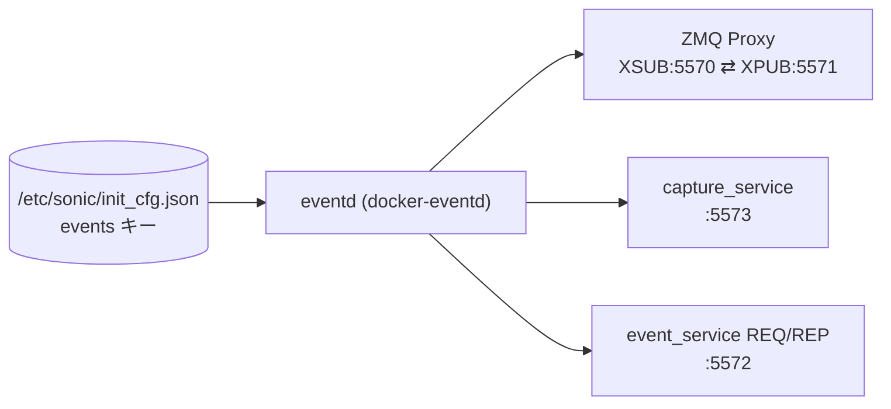

# イベントパブリッシャー設定 (init_cfg events)

## 概要

SONiC の Event and Alarm Framework は `eventd` デーモンが中心となり、ZeroMQ (ZMQ) メッセージバスを介して全コンテナ・プロセスからのイベントを収集・配信する[^1]。`eventd` は起動時に `/etc/sonic/init_cfg.json` の `"events"` キーを読み込み、ZMQ エンドポイントアドレス・キャッシュ上限・統計更新間隔を取得する。

これらのパラメータは従来の [CONFIG_DB](../../reference/glossary.md#term-config_db) テーブルではなく、ファイルベース設定として管理される点が他テーブルと異なる。

<!-- cdb-mermaid -->
### データフロー (自動生成)



!!! note "凡例"
    CONFIG_DB ではなく `init_cfg.json` から読み込まれる起動時設定。`eventd` が各 ZMQ ソケットをバインドし、パブリッシャー・サブスクライバー・テレメトリコンテナが接続する。
<!-- /cdb-mermaid -->

## 設定ファイル構造

```json
// /etc/sonic/init_cfg.json
{
  "events": {
    "xsub_path":      "tcp://127.0.0.1:5570",
    "xpub_path":      "tcp://127.0.0.1:5571",
    "req_rep_path":   "tcp://127.0.0.1:5572",
    "capture_path":   "tcp://127.0.0.1:5573",
    "stats_upd_secs": "5",
    "cache_max_cnt":  ""
  }
}
```

キーが存在しない場合は `events_common.cpp` 内の `cfg_default` マップがフォールバックとして使われる[^2]。

## フィールド

| フィールド | 型 | デフォルト | 説明 |
|-----------|----|-----------|------|
| `xsub_path` | string (ZMQ URI) | `tcp://127.0.0.1:5570` | パブリッシャーが接続する ZMQ XSUB エンドポイント |
| `xpub_path` | string (ZMQ URI) | `tcp://127.0.0.1:5571` | サブスクライバーが接続する ZMQ XPUB エンドポイント |
| `req_rep_path` | string (ZMQ URI) | `tcp://127.0.0.1:5572` | eventd 制御サービスの REQ/REP エンドポイント |
| `capture_path` | string (ZMQ URI) | `tcp://127.0.0.1:5573` | キャッシュ収集用内部 PUB エンドポイント |
| `stats_upd_secs` | string (数値) | `"5"` | COUNTERS_DB への統計書き込み間隔 (秒) |
| `cache_max_cnt` | string (数値) | `""` → 699050 件 | イベントキャッシュの最大件数。空文字列の場合は MAX_CACHE_SIZE (≈ 100 MB / 150 B) が使用される |

## ハートビート設定

`eventd` はハートビートイベントを定期的に `sonic-events-eventd:heartbeat` タグで発行する。

| 設定項目 | デフォルト | 説明 |
|---------|-----------|------|
| ハートビート間隔 | `2` 秒 | `HEARTBEAT_INTERVAL_SECS` 定数。`EVENT_OPTIONS` リクエストで動的変更可能 |
| 最小分解能 | `300` ms | `STATS_HEARTBEAT_MIN` — 内部ポーリング周期 |
| 無効化 | `-1` 指定 | `set_heartbeat_interval(-1)` で送出停止 |

## 主要内部定数

| 定数 | 値 | 説明 |
|-----|---|------|
| `MAX_PUBLISHERS_COUNT` | 1000 | 同時パブリッシャー上限 (runtime-ID キャッシュ上限) |
| `LINGER_TIMEOUT` | 100 ms | ZMQ ソケット linger タイムアウト |
| `CACHE_DRAIN_IN_MILLISECS` | 1000 ms | capture stop 時のドレイン待機 |
| `CAPTURE_SOCK_TIMEOUT` | 800 ms | capture SUB ソケットの recv タイムアウト |
| `READ_SET_SIZE` | 100 件 | `EVENT_CACHE_READ` 1 回の返却件数上限 |
| `EVT_SIZE_AVG` | 150 バイト | キャッシュサイズ計算用イベント平均サイズ |

## 購読者・利用者

- `eventd` (`docker-eventd`): 全パラメータを消費し ZMQ プロキシ・capture service・stats collector を管理
- `events_init_publisher()` 呼び出し元 (swss / syncd / bgp / dhcp-relay 等の全コンテナ): `xsub_path` に接続してイベントを発行
- `events_init_subscriber()` 呼び出し元 (telemetry コンテナ等): `xpub_path` に接続してイベントを受信
- `sonic-gnmi` (`events_client.go`): `xpub_path` 経由でイベントストリームを gNMI クライアントに転送

## 関連 CONFIG_DB / YANG / CLI

- 直接の CONFIG_DB テーブルなし (ファイル設定のみ)
- 関連 HLD: `SONiC/doc/event-alarm-framework/event-alarm-framework.md`、`events-producer.md`

<!-- cdb-exceptions -->
## 例外条件・特殊挙動

| 条件 | 挙動 |
|------|------|
| `init_cfg.json` が存在しない | `cfg_default` のハードコード値をそのまま使用 (エラーなし) |
| `"events"` キーが `init_cfg.json` に存在しない | `cfg_default` のハードコード値をそのまま使用 |
| `cache_max_cnt` が空文字列 | `get_config_data()` が `MAX_CACHE_SIZE` (699050) を返す |
| `cache_max_cnt` が `0` 以下 | `RET_ON_ERR(cache_max > 0, ...)` でサービス異常終了 |
| キャッシュが `cache_max_cnt` 超過 | `CAP_STATE_LAST` へ移行、runtime_id ごとの最終イベントのみ保持し古いものを破棄 |
| パブリッシャークラッシュ | runtime-ID が `MAX_PUBLISHERS_COUNT` 上限超過後、古い ID が時刻順に retirement される |

<!-- /cdb-exceptions -->

<!-- defaults -->
## フィールド暗黙デフォルト (Phase A — コード由来)

YANG definition が存在しないため、デフォルト値はすべて `events_common.cpp` の `cfg_default` マップおよび `eventd.cpp` の定数から導出される[^2][^3]。

| フィールド | コード由来デフォルト | fallback 源 |
|-----------|-------------------|------------|
| `xsub_path` | `"tcp://127.0.0.1:5570"` | `cfg_default` map — `events_common.cpp:10`; `XSUB_END_KEY` 定数 |
| `xpub_path` | `"tcp://127.0.0.1:5571"` | `cfg_default` map — `events_common.cpp:11`; `XPUB_END_KEY` 定数 |
| `req_rep_path` | `"tcp://127.0.0.1:5572"` | `cfg_default` map — `events_common.cpp:12`; `REQ_REP_END_KEY` 定数 |
| `capture_path` | `"tcp://127.0.0.1:5573"` | `cfg_default` map — `events_common.cpp:13`; `CAPTURE_END_KEY` 定数 |
| `stats_upd_secs` | `"5"` | `cfg_default` map — `events_common.cpp:14`; `STATS_UPD_SECS` 定数 |
| `cache_max_cnt` | `""` → **699050** 件 | `cfg_default` map — `events_common.cpp:15`; 空文字 → `get_config_data()` の型デフォルト引数 `MAX_CACHE_SIZE = MB(100)/EVT_SIZE_AVG` (`eventd.cpp:31-33,674`) |
| heartbeat interval | **2 秒** | `HEARTBEAT_INTERVAL_SECS = 2` — `eventd.cpp:43`; `stats_collector.__init__()` が `set_heartbeat_interval(2)` を呼ぶ (`eventd.cpp:130`) |

### 補足

- `read_init_config()` (`events_common.cpp:38-72`) は `cfg_data = cfg_default` でデフォルトを設定後、`init_cfg.json` の `"events"` オブジェクトで上書きする。ファイルに存在するキーのみ上書きされ、不在キーはデフォルトのまま。
- `cache_max_cnt` の空文字列は、`get_config_data<int>(key, MAX_CACHE_SIZE)` で `stringstream` からの変換が空文字列では成功しないため、デフォルト引数 `MAX_CACHE_SIZE` が返る。結果は `(100 * 1024 * 1024) / 150 = 699050` 件。
- ハートビート間隔は `stats_collector` が持つ `m_heartbeats_interval_cnt` で管理。`STATS_HEARTBEAT_MIN = 300` ms 単位に丸められるため、`set_heartbeat_interval(2)` は `(2000 + 299) / 300 = 7` カウント → 7 × 300 ms = **2100 ms** が実効値。
- `GLOBAL_OPTION_HEARTBEAT` オプションは `EVENT_OPTIONS` リクエスト (`event_service` REQ/REP) で動的取得・設定が可能。

<!-- /defaults -->

## 引用元

[^1]: `SONiC/doc/event-alarm-framework/event-alarm-framework.md` — Event and Alarm Framework HLD. <https://github.com/sonic-net/SONiC/blob/master/doc/event-alarm-framework/event-alarm-framework.md>

[^2]: `sonic-net/sonic-swss-common/common/events_common.cpp` — `cfg_default` マップ (xsub/xpub/req_rep/capture/stats_upd_secs/cache_max_cnt デフォルト値) および `read_init_config()` 実装. <https://github.com/sonic-net/sonic-swss-common/blob/master/common/events_common.cpp>

[^3]: `sonic-net/sonic-buildimage/src/sonic-eventd/src/eventd.cpp` — `HEARTBEAT_INTERVAL_SECS`、`MAX_CACHE_SIZE`、`EVT_SIZE_AVG` 定数定義および `stats_collector` 実装. <https://github.com/sonic-net/sonic-buildimage/blob/master/src/sonic-eventd/src/eventd.cpp>
