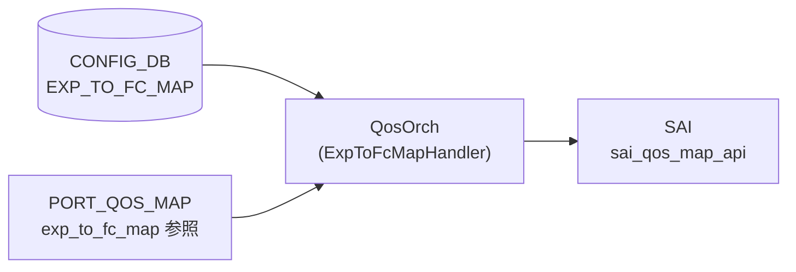

# EXP_TO_FC_MAP テーブル

## 概要

MPLS [EXP](../../reference/glossary.md#term-exp) ビット (0..7) を Forwarding Class (FC) へマップする ingress [QoS](../../reference/glossary.md#term-qos) 分類定義[^1]。Class-Based Forwarding (CBF) 機能で使用される。`QosOrch` が [SAI](../../reference/glossary.md#term-sai) QoS map (`SAI_QOS_MAP_TYPE_MPLS_EXP_TO_FORWARDING_CLASS`) を生成し、ポートにバインドする (`PORT_QOS_MAP.exp_to_fc_map`)。

<!-- cdb-mermaid -->
### データフロー (自動生成)



!!! note "凡例"
    CONFIG_DB から SAI までの典型経路。詳細・例外は本ページ本文を参照。
<!-- /cdb-mermaid -->

## key 構造

```text
EXP_TO_FC_MAP|<name>|<exp>
```

`<name>` はマップ名（1..32 文字、`[a-zA-Z0-9][-a-zA-Z0-9_]*`）。`<exp>` は 0..7。

Redis 上の実際の格納形式:

```
HSET "EXP_TO_FC_MAP|AZURE" "0" "0" "1" "1" "2" "2" "3" "3" "4" "4" "5" "5" "6" "6" "7" "7"
```

## フィールド一覧

| フィールド | 型 | 必須 | 説明 |
|-----------|----|------|------|
| `name` (key: outer) | string (1..32) | ✅ | マップ名 |
| `exp` (key: inner) | string `"[0-7]"` | ✅ | MPLS EXP ビット値 (0..7) |
| `fc` | string `"[0-7]"` | ✅ | 対応 Forwarding Class (0..max_num_fcs-1) |

YANG 上は親子 list 構造 (`EXP_TO_FC_MAP_LIST` / `EXP_TO_FC_MAP`)。Redis に展開すると `EXP_TO_FC_MAP|<name>` の hash field として `<exp>: <fc>` ペアが格納される。

<!-- defaults -->
## フィールド別コード由来デフォルト / 暗黙挙動

### `exp` (key フィールド)

| 発見種別 | 詳細 |
|---------|------|
| ハードコード上限 | `#define EXP_MAX_VAL 7` (`qosorch.cpp:120`)。value < 0 または value > 7 は `SWSS_LOG_ERROR` を出して `task_invalid_entry` を返す（エントリ全体が silent drop） |
| YANG 制約との乖離 | YANG では `pattern "[0-7]?"` — `?` により**空文字列も YANG 上は valid** だが、`qosorch` は `stoi()` に渡し例外 → `task_invalid_entry` で reject。実質空文字列は不可 |
| 書込み順依存なし | key は Redis hash field として atomic に格納される |

### `fc` (value フィールド)

| 発見種別 | 詳細 |
|---------|------|
| 実行時上限（プラットフォーム依存） | `NhgMapOrch::getMaxNumFcs()` が `SAI_SWITCH_ATTR_MAX_NUMBER_OF_FORWARDING_CLASSES` を初回 SAI 問い合わせで取得しキャッシュ。FC 値は `[0, max_num_fcs)` の範囲外なら reject |
| 静的初期値 | `static int max_num_fcs = -1` — 初回呼び出しまで未初期化。スイッチが FC 未サポートなら `max_num_fcs = 0` となり **全 FC 値が invalid** になる (`nhgmaporch.cpp:319: SWSS_LOG_WARN("Switch does not support FCs")`) |
| YANG 制約との乖離 | YANG では `fc` を `pattern "[0-7]?"` と定義（最大 7）。しかし実装は `SAI_SWITCH_ATTR_MAX_NUMBER_OF_FORWARDING_CLASSES` の返値次第で上限が異なる（テストでは 63 を使用 `test_qos_map.py:314`）。**YANG は実装より保守的** |
| silent drop | `convertFieldValuesToAttributes` が false を返すと `processWorkItem` は `task_invalid_entry` を返す。orchagent はエラーログを出力するが CONFIG_DB からエントリは削除しない（次回再試行なし） |

### マップ名 (`name` key)

| 発見種別 | 詳細 |
|---------|------|
| YANG パターン | `[a-zA-Z0-9]{1}([-a-zA-Z0-9_]{0,31})` — 先頭英数字必須、最大 32 文字 |
| デフォルト名なし | ハードコードされたデフォルトマップ名は存在しない。プラットフォーム初期設定 (`qos_config.j2`) で定義される場合あり |

### エントリ数（スパース定義）

| 発見種別 | 詳細 |
|---------|------|
| 未定義 EXP の fallback | EXP_TO_FC_MAP に EXP 値を記述しない場合、その EXP ビットに対する FC は未定義。ASIC 実装依存（多くは FC=0 にフォールバック） |
| 空マップ | kfvFieldsValues が空でも YANG は reject しないが、SAI map count=0 で `sai_create_qos_map` を呼ぶ。SAI の動作は ASIC 依存 |

<!-- /defaults -->

<!-- value-behavior -->
## 値依存挙動マトリクス

### `exp` (key: string "0".."7")

| 値 | 挙動 |
|----|------|
| `"0"`..`"7"` | `stoi()` でパース → `list_attr.value.qosmap.list[ind].key.mpls_exp` に設定 |
| 負の整数文字列 | `SWSS_LOG_ERROR` → `task_invalid_entry`（エントリ全体を reject） |
| `"8"` 以上 | `value > EXP_MAX_VAL (7)` → `SWSS_LOG_ERROR` → `task_invalid_entry` |
| 空文字列・非整数 | `stoi()` が `invalid_argument` → catch → `task_invalid_entry` |

### `fc` (value: string, 実行時上限あり)

| 値 | 挙動 |
|----|------|
| `0` .. `max_num_fcs - 1` | `list_attr.value.qosmap.list[ind].value.fc` に設定 |
| 負の整数 | reject |
| `max_num_fcs` 以上 | reject（スイッチ FC 未サポート時は全値が reject） |
| 非整数 | `stoi()` 例外 → `task_invalid_entry` |

> **重要**: `max_num_fcs` はプラットフォーム依存（YANG の `[0-7]` 制約より広い場合も狭い場合もある）。スイッチが FC を未サポートの場合は `max_num_fcs=0` となり、`fc` 値 0 を含む全エントリが reject される。
<!-- /value-behavior -->

## 購読者

- `qosorch` (`ExpToFcMapHandler`): [SAI](../../reference/glossary.md#term-sai) QoS map 生成 (`sai_create_qos_map` / `sai_remove_qos_map`)
- 生成された SAI オブジェクトは `PORT_QOS_MAP.exp_to_fc_map` 経由でポートに適用 → `SAI_PORT_ATTR_QOS_MPLS_EXP_TO_FORWARDING_CLASS_MAP`

## 関連 CONFIG_DB / YANG / CLI

- 関連 [CONFIG_DB](../../reference/glossary.md#term-config_db): `PORT_QOS_MAP`（`exp_to_fc_map` フィールドで参照）
- 関連 CLI: なし（CLI コマンドは未実装）
- 関連 [YANG](../../reference/glossary.md#term-yang): `sonic-exp-fc-map`

<!-- ref-triangle:start -->

## 関連リファレンス

- [YANG](../../reference/glossary.md#term-yang): `sonic-exp-fc-map` (sonic-buildimage)
- 関連: `DSCP_TO_FC_MAP` — DSCP 版の同等テーブル

<!-- ref-triangle:end -->

## 引用元

[^1]: YANG 定義: `sonic-exp-fc-map.yang`. <https://github.com/sonic-net/sonic-buildimage/blob/9ea932ec2e18f35e58268ec2e4456b1d4afd65cd/src/sonic-yang-models/yang-models/sonic-exp-fc-map.yang>

<!-- topics-back-ref -->
## 関連 Topics

- [Topics: QoS / Buffer / PFC / Watermark](../../topics/08-qos-buffer/index.md)

<!-- /topics-back-ref -->

<!-- ops-hint -->
## 運用ヒント

### 典型値

```
EXP_TO_FC_MAP|AZURE
  "0": "0"
  "1": "1"
  "2": "2"
  "3": "3"
  "4": "4"
  "5": "5"
  "6": "6"
  "7": "7"
```

### よくある誤設定

- `fc` 値がスイッチの `SAI_SWITCH_ATTR_MAX_NUMBER_OF_FORWARDING_CLASSES` 上限以上の場合、エントリ全体が silent drop（ログのみ、CONFIG_DB は汚染されたまま）。
- EXP 値 8 以上または負数を key に指定すると reject。
- マップを定義しても `PORT_QOS_MAP` で `exp_to_fc_map` を参照しない限り SAI に反映されない。

### 確認コマンド

```bash
sonic-db-cli CONFIG_DB hgetall 'EXP_TO_FC_MAP|AZURE'
sonic-db-cli CONFIG_DB hgetall 'PORT_QOS_MAP|Ethernet0'
```
<!-- /ops-hint -->

<!-- cdb-exceptions -->
## 例外条件・特殊挙動

| consumer | 条件 | 挙動 |
|---|---|---|
| [orchagent](../../reference/glossary.md#term-orchagent) | DEL 時に PORT_QOS_MAP から参照中 | `m_pendingRemove=true` を立てて `task_need_retry` を返す（qosorch.cpp:181-186） |
| [orchagent](../../reference/glossary.md#term-orchagent) | FC 値が `max_num_fcs` 以上 | `SWSS_LOG_ERROR` → `task_invalid_entry`（CONFIG_DB からは削除されない） |
| [orchagent](../../reference/glossary.md#term-orchagent) | スイッチが FC 未サポート (`max_num_fcs=0`) | 全エントリが reject。`SWSS_LOG_WARN("Switch does not support FCs")` のみ出力 |
| [orchagent](../../reference/glossary.md#term-orchagent) | SAI `sai_create_qos_map` 失敗 | `SWSS_LOG_ERROR("Failed to create exp_to_fc map")` → `task_failed` |
| YANG validator | EXP または FC の値が `[0-7]?` パターン違反 | YANG レベルで reject（DB への書き込み自体が失敗） |
| 実装 vs YANG 乖離 | YANG `fc` は `[0-7]` 最大、実装上限は SAI 問い合わせ結果（最大 255）| 実装がより広い値域を許容する可能性あり |

> **Evidence**: [sonic-swss](../../reference/glossary.md#term-sonic-swss) `orchagent/qosorch.cpp:1132-1213`; `orchagent/cbf/nhgmaporch.cpp:299-325`; `orchagent/qosorch.h:33`
<!-- /cdb-exceptions -->

<!-- runtime-trace -->
## 実コンテナ動作トレース

### 段階 1 — Consumer 登録

`QosOrch` (orchagent 直接 CFG 購読) が CONFIG_DB の `EXP_TO_FC_MAP` テーブルを購読する。`orchdaemon.cpp` で `CFG_EXP_TO_FC_MAP_TABLE_NAME` が tableNames に登録される。

### 段階 2 — CFG→APPL 翻訳

なし (orchagent が直接 CONFIG_DB を購読)

### 段階 3 — APPL→SAI

1. `handleExpToFcTable` → `ExpToFcMapHandler::processWorkItem`
2. `convertFieldValuesToAttributes`: EXP/FC 値を検証、`SAI_QOS_MAP_ATTR_MAP_TO_VALUE_LIST` を構築
3. `addQosItem`: `SAI_QOS_MAP_ATTR_TYPE = SAI_QOS_MAP_TYPE_MPLS_EXP_TO_FORWARDING_CLASS` で `sai_create_qos_map` 呼び出し
4. 生成された SAI oid を `m_qos_maps[CFG_EXP_TO_FC_MAP_TABLE_NAME]` にキャッシュ

### 段階 4 — タイミングと副作用

**適用タイミング**: orchagent が CONFIG_DB 変化を検知後即座に SAI QoS map を作成/更新。ポートへの割り当ては `PORT_QOS_MAP.exp_to_fc_map` 設定後。

**副作用**: EXP→FC マップ変更はそのマップを使用するすべてのポートの CBF 分類に即座に影響。MPLS パケットの Forwarding Class 判定が変化する。
<!-- /runtime-trace -->

<!-- entry-points -->
## 書き込み入り口 (Direction A)

対象テーブル: `EXP_TO_FC_MAP`

### CLI

- 現時点で専用 CLI コマンドなし（`sonic-utilities` に `config qos map exp-fc` 相当は未実装）
- `sonic-db-cli` による直接書き込みまたは JSON import (`config load`) が主な手段

### minigraph / sonic-cfggen

- なし（minigraph テンプレートに EXP_TO_FC_MAP 生成は未確認）

### REST / gNMI (sonic-mgmt-common)

- なし（対応 OpenConfig/SONiC YANG transformer なし）

### db_migrator

- なし

### ビルド時デフォルト (init_cfg / j2 テンプレート)

- プラットフォーム固有の `qos_config.j2` で定義される場合あり（platform 依存）

### ハードコードデフォルト

- なし（デフォルトマップは qosorch 内に存在しない）

### ランタイム注入 (デーモン自動書き込み)

- なし
<!-- /entry-points -->

<!-- ordering -->
## 書込み順依存 (Phase B)

> 調査証跡: `meta/_intermediate/cdb-flow/exp-to-fc-map-ordering.md`

対象テーブル: `EXP_TO_FC_MAP`。Consumer: `QosOrch::handleExpToFcTable()` / `QosOrch::handlePortQosMapTable()` (`qosorch.cpp`)。

### SET 時の先行必須テーブル

| # | 依存 | 方向 | 挙動 |
|---|------|------|------|
| 1 | `EXP_TO_FC_MAP\|<name>` SAI 作成 → `PORT_QOS_MAP\|<port>` SET | 強制先行 | `resolveFieldRefValue()` が未解決で `task_need_retry`（自動再試行） |
| 2 | SAI 起動 / `NhgMapOrch::getMaxNumFcs()` 完了 → `EXP_TO_FC_MAP` SET | 暗黙先行 | `max_num_fcs = -1`（初期値）の状態で FC 値を渡すと全エントリが `task_invalid_entry` で reject される |
| 3 | EXP キー値は `"0"`..`"7"` の整数文字列 | 必須形式 | `stoi()` 失敗 or 範囲外（負数・8以上）は `task_invalid_entry`（エントリ全体が reject） |

> **推奨順序（SET）**: orchagent 起動・SAI 準備完了後 → `EXP_TO_FC_MAP|<name>` → `PORT_QOS_MAP|<port>` の `exp_to_fc_map` フィールド設定

### DEL 時の順序制約

| # | 依存 | 方向 | 挙動 |
|---|------|------|------|
| 1 | `PORT_QOS_MAP\|<port>` の `exp_to_fc_map` 参照解除 → `EXP_TO_FC_MAP\|<name>` DEL | 強制先行 | 参照中は `m_pendingRemove=true` + `task_need_retry` ロック (`qosorch.cpp:181-186`) |
| 2 | pending_remove 解消後のみ SET 可能 | 強制先行 | pending_remove 中の SET は即 `task_need_retry` を返す (`qosorch.cpp:136-139`) |

> **推奨順序（DEL）**: `PORT_QOS_MAP|<port>` の `exp_to_fc_map` フィールド削除 → `EXP_TO_FC_MAP|<name>` DEL

> **Evidence**: `qosorch.cpp:124-201` (QosMapHandler::processWorkItem); `qosorch.cpp:2046-2134` (handlePortQosMapTable); `qosorch.cpp:1132-1213` (ExpToFcMapHandler)
<!-- /ordering -->

<!-- cross-refs -->
## 暗黙参照・共依存テーブル (Phase C)

> 調査証跡: `meta/_intermediate/cdb-flow/exp-to-fc-map-cross-refs.md`

`EXP_TO_FC_MAP` は YANG leafref を持たない自己完結テーブルだが、実装レベルで以下の外部依存が存在する。

| 参照先テーブル / コンポーネント | YANG leafref | 参照種別 | 非充足時の挙動 | evidence |
|---|:---:|---|---|---|
| `PORT_QOS_MAP.exp_to_fc_map` | ✗ | **被参照**（`PORT_QOS_MAP` が OID を名前解決） | `EXP_TO_FC_MAP` 未登録時に `PORT_QOS_MAP` SET は `task_need_retry`（自動再試行） | `qosorch.cpp:112`, `qosorch.cpp:2124-2131` |
| `NhgMapOrch::getMaxNumFcs()` | ✗ | FC 値上限の動的クエリ（SAI 経由） | 未初期化 (`max_num_fcs=-1`) または FC 未サポート (`max_num_fcs=0`) の場合、全 FC 値が `task_invalid_entry` で reject | `nhgmaporch.cpp:299-325`, `nhgmaporch.cpp:346-370` |
| `PortsOrch::allPortsReady()` | ✗ | 起動順序ガード | `false` の間は orchagent で全 QoS テーブル処理がブロック（`EXP_TO_FC_MAP` SET も未処理のまま待機） | `qosorch.cpp:2253-2258` |

### YANG leafref 非存在の補足

`sonic-port-qos-map.yang` の `PORT_QOS_MAP_LIST` において、他の QoS マップフィールド（`tc_to_pg_map`, `tc_to_queue_map`, `dscp_to_tc_map` 等）は各 YANG モジュールへ leafref が定義されているが、**`exp_to_fc_map` フィールドは leafref なし**（YANG モジュール不在のため）。参照整合性は実装レベル（`resolveFieldRefValue()` + `m_pendingRemove` ロック）のみで担保される。

### doTask() 実行順序による自然解決

`QosOrch::doTask()` は `EXP_TO_FC_MAP` 等の参照先マップを先に drain し、`PORT_QOS_MAP` を後から drain する（`qosorch.cpp:2231-2260`）。同一イベントループ内で `EXP_TO_FC_MAP` SET → `PORT_QOS_MAP` SET の順に投入されていれば、`task_need_retry` は発生せずに 1 イテレーションで解決される。

<!-- /cross-refs -->
