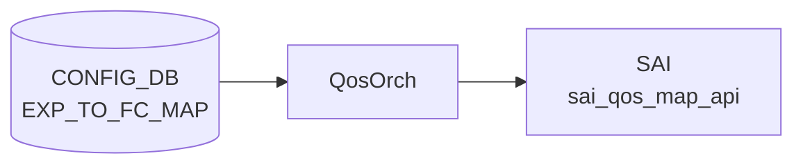

# EXP_TO_FC_MAP テーブル

## 概要

[MPLS](../../reference/glossary.md#term-mpls) [EXP](../../reference/glossary.md#term-exp) ビット (0..7) を Forwarding Class (FC) へマップする ingress [QoS](../../reference/glossary.md#term-qos) 分類定義[^1]。Class-Based Forwarding (CBF) 機能で使用される。`QosOrch` が [SAI](../../reference/glossary.md#term-sai) [QoS](../../reference/glossary.md#term-qos) map (`SAI_QOS_MAP_TYPE_MPLS_EXP_TO_FORWARDING_CLASS`) を生成し、ポートにバインドする (`PORT_QOS_MAP.exp_to_fc_map`)。

<!-- cdb-mermaid -->
### データフロー (自動生成)



!!! note "凡例"
    CONFIG_DB から SAI までの典型経路を `docs/reference/config-db-orch-map.md` から機械生成したミニ図。詳細・例外は本ページ本文と対応表を参照。
<!-- /cdb-mermaid -->

## key 構造

```text
EXP_TO_FC_MAP|<name>|<exp>
```

`<name>` はマップ名（1..32 文字、`[a-zA-Z0-9][-a-zA-Z0-9_]*`）。`<exp>` は 0..7。

[Redis](../../reference/glossary.md#term-redis) 上の実際の格納形式:

```
HSET "EXP_TO_FC_MAP|AZURE" "0" "0" "1" "1" "2" "2" "3" "3" "4" "4" "5" "5" "6" "6" "7" "7"
```

## フィールド一覧

| フィールド | 型 | 必須 | 説明 |
|-----------|----|------|------|
| `name` (key: outer) | string (1..32) | ✅ | マップ名 |
| `exp` (key: inner) | string `"[0-7]"` | ✅ | [MPLS](../../reference/glossary.md#term-mpls) EXP ビット値 (0..7) |
| `fc` | string `"[0-7]"` | ✅ | 対応 Forwarding Class (0..max_num_fcs-1) |

[YANG](../../reference/glossary.md#term-yang) 上は親子 list 構造 (`EXP_TO_FC_MAP_LIST` / `EXP_TO_FC_MAP`)。[Redis](../../reference/glossary.md#term-redis) に展開すると `EXP_TO_FC_MAP|<name>` の hash field として `<exp>: <fc>` ペアが格納される。

<!-- defaults -->
## フィールド別コード由来デフォルト / 暗黙挙動

### `exp` (key フィールド)

| 発見種別 | 詳細 |
|---------|------|
| ハードコード上限 | `#define EXP_MAX_VAL 7` (`qosorch.cpp:120`)。value < 0 または value > 7 は `SWSS_LOG_ERROR` を出して `task_invalid_entry` を返す（エントリ全体が silent drop） |
| YANG 制約との乖離 | YANG では `pattern "[0-7]?"` — `?` により**空文字列も YANG 上は valid** だが、`qosorch` は `stoi()` に渡し例外 → `task_invalid_entry` で reject。実質空文字列は不可 |
| 書込み順依存なし | key は [Redis](../../reference/glossary.md#term-redis) hash field として atomic に格納される |

### `fc` (value フィールド)

| 発見種別 | 詳細 |
|---------|------|
| 実行時上限（プラットフォーム依存） | `NhgMapOrch::getMaxNumFcs()` が `SAI_SWITCH_ATTR_MAX_NUMBER_OF_FORWARDING_CLASSES` を初回 [SAI](../../reference/glossary.md#term-sai) 問い合わせで取得しキャッシュ。FC 値は `[0, max_num_fcs)` の範囲外なら reject |
| 静的初期値 | `static int max_num_fcs = -1` — 初回呼び出しまで未初期化。スイッチが FC 未サポートなら `max_num_fcs = 0` となり **全 FC 値が invalid** になる (`nhgmaporch.cpp:319: SWSS_LOG_WARN("Switch does not support FCs")`) |
| YANG 制約との乖離 | YANG では `fc` を `pattern "[0-7]?"` と定義（最大 7）。しかし実装は `SAI_SWITCH_ATTR_MAX_NUMBER_OF_FORWARDING_CLASSES` の返値次第で上限が異なる（テストでは 63 を使用 `test_qos_map.py:314`）。**YANG は実装より保守的** |
| silent drop | `convertFieldValuesToAttributes` が false を返すと `processWorkItem` は `task_invalid_entry` を返す。orchagent はエラーログを出力するが [CONFIG_DB](../../reference/glossary.md#term-config_db) からエントリは削除しない（次回再試行なし） |

### マップ名 (`name` key)

| 発見種別 | 詳細 |
|---------|------|
| YANG パターン | `[a-zA-Z0-9]{1}([-a-zA-Z0-9_]{0,31})` — 先頭英数字必須、最大 32 文字 |
| デフォルト名なし | ハードコードされたデフォルトマップ名は存在しない。プラットフォーム初期設定 (`qos_config.j2`) で定義される場合あり |

### エントリ数（スパース定義）

| 発見種別 | 詳細 |
|---------|------|
| 未定義 EXP の fallback | EXP_TO_FC_MAP に EXP 値を記述しない場合、その EXP ビットに対する FC は未定義。[ASIC](../../reference/glossary.md#term-asic) 実装依存（多くは FC=0 にフォールバック） |
| 空マップ | kfvFieldsValues が空でも YANG は reject しないが、SAI map count=0 で `sai_create_qos_map` を呼ぶ。SAI の動作は [ASIC](../../reference/glossary.md#term-asic) 依存 |

<!-- /defaults -->

<!-- value-behavior -->
## 値依存挙動マトリクス

### `exp` (key: string "0".."7")

| 値 | 挙動 |
|----|------|
| `"0"`..`"7"` | `stoi()` でパース → `list_attr.value.qosmap.list[ind].key.mpls_exp` に設定 |
| 負の整数文字列 | `SWSS_LOG_ERROR` → `task_invalid_entry`（エントリ全体を reject） |
| `"8"` 以上 | `value > EXP_MAX_VAL (7)` → `SWSS_LOG_ERROR` → `task_invalid_entry` |
| 空文字列・非整数 | `stoi()` が `invalid_argument` → catch → `task_invalid_entry` |

### `fc` (value: string, 実行時上限あり)

| 値 | 挙動 |
|----|------|
| `0` .. `max_num_fcs - 1` | `list_attr.value.qosmap.list[ind].value.fc` に設定 |
| 負の整数 | reject |
| `max_num_fcs` 以上 | reject（スイッチ FC 未サポート時は全値が reject） |
| 非整数 | `stoi()` 例外 → `task_invalid_entry` |

> **重要**: `max_num_fcs` はプラットフォーム依存（YANG の `[0-7]` 制約より広い場合も狭い場合もある）。スイッチが FC を未サポートの場合は `max_num_fcs=0` となり、`fc` 値 0 を含む全エントリが reject される。
<!-- /value-behavior -->

<!-- ordering -->
## 書込み順依存 (Phase B)

`QosOrch` (`ExpToFcMapHandler`) は [CONFIG_DB](../../reference/glossary.md#term-config_db) の `EXP_TO_FC_MAP` を直接購読し、SAI [QoS](../../reference/glossary.md#term-qos) map を生成する。生成された SAI oid は内部キャッシュ `m_qos_maps[CFG_EXP_TO_FC_MAP_TABLE_NAME]` に保持され、`PORT_QOS_MAP` ハンドラからの参照解決に使われる。

### 検出された順序依存

| # | 依存関係 | 方向 | 緩和策 |
|---|----------|------|--------|
| 1 | `EXP_TO_FC_MAP|<name>` SAI 登録 → `PORT_QOS_MAP.exp_to_fc_map` 適用 | **強制先行** | マップが未登録の場合 `handlePortQosMapTable` は `task_need_retry` を返し、次イテレーションで再試行される |
| 2 | `PORT_QOS_MAP` 参照解除 → `EXP_TO_FC_MAP` DEL | **強制先行** | DEL 時に `isObjectBeingReferenced` が真なら `m_pendingRemove=true` + `task_need_retry` で削除を defer |
| 3 | `EXP_TO_FC_MAP` DEL 完了 → 同名エントリへの SET | **先行必須** | DEL 保留中 (`m_pendingRemove=true`) に同名 SET が来ると `task_need_retry` で defer される |

### 主要な制約詳細

**EXP_TO_FC_MAP → PORT_QOS_MAP 先行制約 (依存 #1)**:
`handlePortQosMapTable` は `kfvFieldsValues` をイテレーションし、`exp_to_fc_map` フィールドを見つけると `resolveFieldRefValue(m_qos_maps, CFG_EXP_TO_FC_MAP_TABLE_NAME, ...)` を呼ぶ。`m_qos_maps` にエントリが存在しない場合 `ref_resolve_status::not_resolved` が返り、即座に `task_need_retry` を返す。このため、CONFIG_DB に `PORT_QOS_MAP` と `EXP_TO_FC_MAP` を同時に投入しても、オーケストレーション上は `EXP_TO_FC_MAP` の SAI 登録が先に完了するまで `PORT_QOS_MAP` への SAI 反映は行われない（evidence: `qosorch.cpp:2120-2131`）。

**参照保護による DEL defer (依存 #2)**:
`QosMapHandler::processWorkItem` の DEL パスで `gQosOrch->isObjectBeingReferenced(QosOrch::getTypeMap(), CFG_EXP_TO_FC_MAP_TABLE_NAME, qos_object_name)` を評価し、真なら `m_pendingRemove=true` にセットして `task_need_retry` を返す。`PORT_QOS_MAP` で `exp_to_fc_map` を参照している限りマップは削除されない。PORT_QOS_MAP から参照が外れた後の次イテレーションで削除が実行される（evidence: `qosorch.cpp:181-186`）。

**pendingRemove 中の SET defer (依存 #3)**:
SET コマンド処理の冒頭で `m_pendingRemove` フラグを確認し、真であれば `task_need_retry` を返す。これにより「DEL → 即 SET（rename 相当）」は DEL 完了まで SET が defer され、中間状態で旧名と新名が SAI 上で共存しない（evidence: `qosorch.cpp:136-139`）。

## 購読者

- `qosorch` (`ExpToFcMapHandler`): [SAI](../../reference/glossary.md#term-sai) QoS map 生成 (`sai_create_qos_map` / `sai_remove_qos_map`)
- 生成された SAI オブジェクトは `PORT_QOS_MAP.exp_to_fc_map` 経由でポートに適用 → `SAI_PORT_ATTR_QOS_MPLS_EXP_TO_FORWARDING_CLASS_MAP`

## 関連 CONFIG_DB / YANG / CLI

- 関連 [CONFIG_DB](../../reference/glossary.md#term-config_db): `PORT_QOS_MAP`（`exp_to_fc_map` フィールドで参照）
- 関連 CLI: なし（CLI コマンドは未実装）
- 関連 [YANG](../../reference/glossary.md#term-yang): `sonic-exp-fc-map`

<!-- ref-triangle:start -->

## 関連リファレンス

- [YANG](../../reference/glossary.md#term-yang): `sonic-exp-fc-map` ([sonic-buildimage](../../reference/glossary.md#term-sonic-buildimage))
- 関連: `DSCP_TO_FC_MAP` — [DSCP](../../reference/glossary.md#term-dscp) 版の同等テーブル

<!-- ref-triangle:end -->

## 引用元

[^1]: YANG 定義: `sonic-exp-fc-map.yang`. <https://github.com/sonic-net/sonic-buildimage/blob/9ea932ec2e18f35e58268ec2e4456b1d4afd65cd/src/sonic-yang-models/yang-models/sonic-exp-fc-map.yang>

<!-- topics-back-ref -->
## 関連 Topics

- [Topics: QoS / Buffer / PFC / Watermark](../../topics/08-qos-buffer/index.md)

<!-- /topics-back-ref -->

<!-- ops-hint -->
## 運用ヒント

### 典型値

```
EXP_TO_FC_MAP|AZURE
  "0": "0"
  "1": "1"
  "2": "2"
  "3": "3"
  "4": "4"
  "5": "5"
  "6": "6"
  "7": "7"
```

### よくある誤設定

- `fc` 値がスイッチの `SAI_SWITCH_ATTR_MAX_NUMBER_OF_FORWARDING_CLASSES` 上限以上の場合、エントリ全体が silent drop（ログのみ、CONFIG_DB は汚染されたまま）。
- EXP 値 8 以上または負数を key に指定すると reject。
- マップを定義しても `PORT_QOS_MAP` で `exp_to_fc_map` を参照しない限り SAI に反映されない。

### 確認コマンド

```bash
sonic-db-cli CONFIG_DB hgetall 'EXP_TO_FC_MAP|AZURE'
sonic-db-cli CONFIG_DB hgetall 'PORT_QOS_MAP|Ethernet0'
```
<!-- /ops-hint -->

<!-- cdb-exceptions -->
## 例外条件・特殊挙動

| consumer | 条件 | 挙動 |
|---|---|---|
| [orchagent](../../reference/glossary.md#term-orchagent) | DEL 時に PORT_QOS_MAP から参照中 | `m_pendingRemove=true` を立てて `task_need_retry` を返す（qosorch.cpp:181-186） |
| [orchagent](../../reference/glossary.md#term-orchagent) | FC 値が `max_num_fcs` 以上 | `SWSS_LOG_ERROR` → `task_invalid_entry`（CONFIG_DB からは削除されない） |
| [orchagent](../../reference/glossary.md#term-orchagent) | スイッチが FC 未サポート (`max_num_fcs=0`) | 全エントリが reject。`SWSS_LOG_WARN("Switch does not support FCs")` のみ出力 |
| [orchagent](../../reference/glossary.md#term-orchagent) | SAI `sai_create_qos_map` 失敗 | `SWSS_LOG_ERROR("Failed to create exp_to_fc map")` → `task_failed` |
| YANG validator | EXP または FC の値が `[0-7]?` パターン違反 | YANG レベルで reject（DB への書き込み自体が失敗） |
| 実装 vs YANG 乖離 | YANG `fc` は `[0-7]` 最大、実装上限は SAI 問い合わせ結果（最大 255）| 実装がより広い値域を許容する可能性あり |

> **Evidence**: [sonic-swss](../../reference/glossary.md#term-sonic-swss) `orchagent/qosorch.cpp:1132-1213`; `orchagent/cbf/nhgmaporch.cpp:299-325`; `orchagent/qosorch.h:33`
<!-- /cdb-exceptions -->

<!-- runtime-trace -->
## 実コンテナ動作トレース

### 段階 1 — Consumer 登録

`QosOrch` (orchagent 直接 CFG 購読) が CONFIG_DB の `EXP_TO_FC_MAP` テーブルを購読する。`orchdaemon.cpp` で `CFG_EXP_TO_FC_MAP_TABLE_NAME` が tableNames に登録される。

### 段階 2 — CFG→APPL 翻訳

なし (orchagent が直接 CONFIG_DB を購読)

### 段階 3 — APPL→SAI

1. `handleExpToFcTable` → `ExpToFcMapHandler::processWorkItem`
2. `convertFieldValuesToAttributes`: EXP/FC 値を検証、`SAI_QOS_MAP_ATTR_MAP_TO_VALUE_LIST` を構築
3. `addQosItem`: `SAI_QOS_MAP_ATTR_TYPE = SAI_QOS_MAP_TYPE_MPLS_EXP_TO_FORWARDING_CLASS` で `sai_create_qos_map` 呼び出し
4. 生成された SAI oid を `m_qos_maps[CFG_EXP_TO_FC_MAP_TABLE_NAME]` にキャッシュ

### 段階 4 — タイミングと副作用

**適用タイミング**: orchagent が CONFIG_DB 変化を検知後即座に SAI QoS map を作成/更新。ポートへの割り当ては `PORT_QOS_MAP.exp_to_fc_map` 設定後。

**副作用**: EXP→FC マップ変更はそのマップを使用するすべてのポートの CBF 分類に即座に影響。[MPLS](../../reference/glossary.md#term-mpls) パケットの Forwarding Class 判定が変化する。
<!-- /runtime-trace -->

<!-- entry-points -->
## 書き込み入り口 (Direction A)

対象テーブル: `EXP_TO_FC_MAP`

### CLI

- 現時点で専用 CLI コマンドなし（`sonic-utilities` に `config qos map exp-fc` 相当は未実装）
- `sonic-db-cli` による直接書き込みまたは JSON import (`config load`) が主な手段

### minigraph / sonic-cfggen

- なし（minigraph テンプレートに EXP_TO_FC_MAP 生成は未確認）

### REST / gNMI (sonic-mgmt-common)

- なし（対応 OpenConfig/[SONiC](../../reference/glossary.md#term-sonic) YANG transformer なし）

### db_migrator

- なし

### ビルド時デフォルト (init_cfg / j2 テンプレート)

- プラットフォーム固有の `qos_config.j2` で定義される場合あり（platform 依存）

### ハードコードデフォルト

- なし（デフォルトマップは qosorch 内に存在しない）

### ランタイム注入 (デーモン自動書き込み)

- なし
<!-- /entry-points -->

## 書込み順依存 (Phase B) (補足)

> 調査証跡: `meta/_intermediate/cdb-flow/exp-to-fc-map-ordering.md`

対象テーブル: `EXP_TO_FC_MAP`。Consumer: `QosOrch::handleExpToFcTable()` / `QosOrch::handlePortQosMapTable()` (`qosorch.cpp`)。

### SET 時の先行必須テーブル

| # | 依存 | 方向 | 挙動 |
|---|------|------|------|
| 1 | `EXP_TO_FC_MAP\|<name>` SAI 作成 → `PORT_QOS_MAP\|<port>` SET | 強制先行 | `resolveFieldRefValue()` が未解決で `task_need_retry`（自動再試行） |
| 2 | SAI 起動 / `NhgMapOrch::getMaxNumFcs()` 完了 → `EXP_TO_FC_MAP` SET | 暗黙先行 | `max_num_fcs = -1`（初期値）の状態で FC 値を渡すと全エントリが `task_invalid_entry` で reject される |
| 3 | EXP キー値は `"0"`..`"7"` の整数文字列 | 必須形式 | `stoi()` 失敗 or 範囲外（負数・8以上）は `task_invalid_entry`（エントリ全体が reject） |

> **推奨順序（SET）**: orchagent 起動・SAI 準備完了後 → `EXP_TO_FC_MAP|<name>` → `PORT_QOS_MAP|<port>` の `exp_to_fc_map` フィールド設定

### DEL 時の順序制約

| # | 依存 | 方向 | 挙動 |
|---|------|------|------|
| 1 | `PORT_QOS_MAP\|<port>` の `exp_to_fc_map` 参照解除 → `EXP_TO_FC_MAP\|<name>` DEL | 強制先行 | 参照中は `m_pendingRemove=true` + `task_need_retry` ロック (`qosorch.cpp:181-186`) |
| 2 | pending_remove 解消後のみ SET 可能 | 強制先行 | pending_remove 中の SET は即 `task_need_retry` を返す (`qosorch.cpp:136-139`) |

> **推奨順序（DEL）**: `PORT_QOS_MAP|<port>` の `exp_to_fc_map` フィールド削除 → `EXP_TO_FC_MAP|<name>` DEL

> **Evidence**: `qosorch.cpp:124-201` (QosMapHandler::processWorkItem); `qosorch.cpp:2046-2134` (handlePortQosMapTable); `qosorch.cpp:1132-1213` (ExpToFcMapHandler)
<!-- /ordering -->

<!-- cross-refs -->
## 暗黙参照・共依存テーブル (Phase C)

> 調査証跡: `meta/_intermediate/cdb-flow/exp-to-fc-map-cross-refs.md`

`EXP_TO_FC_MAP` は YANG leafref を持たない自己完結テーブルだが、実装レベルで以下の外部依存が存在する。

| 参照先テーブル / コンポーネント | YANG leafref | 参照種別 | 非充足時の挙動 | evidence |
|---|:---:|---|---|---|
| `PORT_QOS_MAP.exp_to_fc_map` | ✗ | **被参照**（`PORT_QOS_MAP` が OID を名前解決） | `EXP_TO_FC_MAP` 未登録時に `PORT_QOS_MAP` SET は `task_need_retry`（自動再試行） | `qosorch.cpp:112`, `qosorch.cpp:2124-2131` |
| `NhgMapOrch::getMaxNumFcs()` | ✗ | FC 値上限の動的クエリ（SAI 経由） | 未初期化 (`max_num_fcs=-1`) または FC 未サポート (`max_num_fcs=0`) の場合、全 FC 値が `task_invalid_entry` で reject | `nhgmaporch.cpp:299-325`, `nhgmaporch.cpp:346-370` |
| `PortsOrch::allPortsReady()` | ✗ | 起動順序ガード | `false` の間は orchagent で全 QoS テーブル処理がブロック（`EXP_TO_FC_MAP` SET も未処理のまま待機） | `qosorch.cpp:2253-2258` |

### YANG leafref 非存在の補足

`sonic-port-qos-map.yang` の `PORT_QOS_MAP_LIST` において、他の QoS マップフィールド（`tc_to_pg_map`, `tc_to_queue_map`, `dscp_to_tc_map` 等）は各 YANG モジュールへ leafref が定義されているが、**`exp_to_fc_map` フィールドは leafref なし**（YANG モジュール不在のため）。参照整合性は実装レベル（`resolveFieldRefValue()` + `m_pendingRemove` ロック）のみで担保される。

### doTask() 実行順序による自然解決

`QosOrch::doTask()` は `EXP_TO_FC_MAP` 等の参照先マップを先に drain し、`PORT_QOS_MAP` を後から drain する（`qosorch.cpp:2231-2260`）。同一イベントループ内で `EXP_TO_FC_MAP` SET → `PORT_QOS_MAP` SET の順に投入されていれば、`task_need_retry` は発生せずに 1 イテレーションで解決される。

<!-- /cross-refs -->

<!-- failure -->
## 失敗挙動 (Phase D)

> 調査証跡: `meta/_intermediate/cdb-flow/exp-to-fc-map-failure.md`

対象テーブル: `EXP_TO_FC_MAP`。Consumer: `QosOrch::handleExpToFcTable()` / `QosOrch::doTask()` (`orchagent/qosorch.cpp`)。

### 起動ガード

`QosOrch::doTask()` 冒頭で `gPortsOrch->allPortsReady()` を確認する (`qosorch.cpp:2258-2261`)。ポート構成完了前は即時 `return` し、`Consumer::m_toSync` のエントリが滞留したまま暗黙 retry される（ログなし・CONFIG_DB 変更なし）。

### SET 時の失敗パターン

| 失敗ケース | 発生箇所 | 挙動 | retry |
|---|---|---|---|
| `allPortsReady() == false` | `doTask()` L2258-2261 | 早期 return、`m_toSync` 滞留 | ポート準備完了まで暗黙 retry |
| EXP 値が負数 | `convertFieldValuesToAttributes()` L1152-1155 | `SWSS_LOG_ERROR` → `task_invalid_entry` → erase | なし（silent drop） |
| EXP 値 > 7 (`EXP_MAX_VAL`) | `convertFieldValuesToAttributes()` L1157-1161 | `SWSS_LOG_ERROR` → `task_invalid_entry` → erase | なし |
| EXP 値が非整数 / 空文字列 | `convertFieldValuesToAttributes()` L1181-1185 | `stoi()` 例外 catch → `task_invalid_entry` → erase | なし |
| FC 値が負数 or `>= max_num_fcs` | `convertFieldValuesToAttributes()` L1166-1170 | `SWSS_LOG_ERROR` → `task_invalid_entry` → erase | なし |
| FC 未サポートスイッチ (`max_num_fcs=0`) | `NhgMapOrch::getMaxNumFcs()` L308-321 | 全 FC 値が `task_invalid_entry` → erase | なし |
| SAI `create_qos_map` 失敗 | `addQosItem()` L1206-1210 | `SWSS_LOG_ERROR("Failed to create exp_to_fc map")` → `task_failed` → erase + `return` | なし (後続エントリもブロック) |
| SAI `set_qos_map_attribute` 失敗 (modify) | `modifyQosItem()` | `SWSS_LOG_ERROR` → `task_failed` → erase + `return` | なし |
| `m_pendingRemove == true` (DEL pending 中に SET) | `processWorkItem()` L136-140 | `SWSS_LOG_NOTICE` → `task_need_retry` → `it++` | PORT_QOS_MAP 参照解除後に自動解消 |

### DEL 時の失敗パターン

| 失敗ケース | 発生箇所 | 挙動 | retry |
|---|---|---|---|
| エントリ未登録 (SAI oid なし) | `processWorkItem()` L177-181 | `SWSS_LOG_ERROR("Object with name:%s not found")` → `task_invalid_entry` → erase | なし |
| `PORT_QOS_MAP` から参照中 | `isObjectBeingReferenced()` L182-187 | `m_pendingRemove=true` + `task_need_retry` → `it++` | PORT_QOS_MAP 参照解除まで無制限 retry |
| SAI `remove_qos_map` 失敗 | `removeQosItem()` | `SWSS_LOG_ERROR` → `task_failed` → erase + `return` | なし |

### `task_failed` 時の特殊挙動

`doTask()` は `task_failed` で該当エントリを erase した後 `return` するため、同一 Consumer キュー内の**後続エントリも当該イテレーションでは未処理**となる (`qosorch.cpp:2284-2288`)。次の orchagent イベントループで再試行される。

### エラー通知先

- `SWSS_LOG_ERROR` / `SWSS_LOG_NOTICE` → syslog のみ
- `ERROR_TABLE` への書き込みなし
- [STATE_DB](../../reference/glossary.md#term-state_db) への反映なし（`EXP_TO_FC_MAP` 自体は [STATE_DB](../../reference/glossary.md#term-state_db) を持たない）
- CONFIG_DB のエントリは失敗後も残存（`task_invalid_entry` の erase はメモリ上の `m_toSync` のみ）

> **Evidence**: `qosorch.cpp:2253-2300` (`QosOrch::doTask()`); `qosorch.cpp:124-201` (`QosMapHandler::processWorkItem()`); `qosorch.cpp:1132-1213` (`ExpToFcMapHandler::convertFieldValuesToAttributes()`, `addQosItem()`); `nhgmaporch.cpp:299-325` (`NhgMapOrch::getMaxNumFcs()`)
<!-- /failure -->

<!-- constants -->
## ハードコード定数 (Phase E)

> 調査証跡: `meta/_intermediate/cdb-flow/exp-to-fc-map-constants.md`

ソース: `sonic-swss/orchagent/qosorch.cpp`、`sonic-swss/orchagent/qosorch.h`、`sonic-swss/orchagent/cbf/nhgmaporch.cpp`

### EXP 値上限

| 定数 | 値 | 箇所 |
|------|----|------|
| `EXP_MAX_VAL` | `7` | `qosorch.cpp:120` — `#define EXP_MAX_VAL 7` |

EXP 値は 0..7 の範囲のみ有効。`convertFieldValuesToAttributes()` L1150–1161 で `value < 0` または `value > EXP_MAX_VAL` を検出し `false` を返す（エントリ全体が `task_invalid_entry` で reject）。

### FC 値上限（実行時取得）

| 取得方法 | 箇所 | 備考 |
|----------|------|------|
| `NhgMapOrch::getMaxNumFcs()` — `SAI_SWITCH_ATTR_MAX_NUMBER_OF_FORWARDING_CLASSES` を SAI 問い合わせ | `nhgmaporch.cpp:299-325` | 初回呼び出しで取得後キャッシュ (`static int max_num_fcs = -1`) |
| スイッチ FC 未サポート時 | `nhgmaporch.cpp:319` | `max_num_fcs = 0` → 全 FC 値が reject。`SWSS_LOG_WARN("Switch does not support FCs")` |
| テスト環境実績値 | `test_qos_map.py:314` | `max_num_fcs = 63` で動作確認済み |

### SAI 属性定数

| 定数 | 箇所 |
|------|------|
| `SAI_QOS_MAP_TYPE_MPLS_EXP_TO_FORWARDING_CLASS` | `addQosItem()` にハードコード (`qosorch.cpp:1189-1213`) |
| `SAI_QOS_MAP_ATTR_MAP_TO_VALUE_LIST` | `convertFieldValuesToAttributes()` L1140 |
| `SAI_PORT_ATTR_QOS_MPLS_EXP_TO_FORWARDING_CLASS_MAP` | PORT_QOS_MAP バインド時 (`qosorch.cpp:72`) |

### フィールド名・テーブル名定数

| 定数 | 値 | 箇所 |
|------|----|------|
| `exp_to_fc_field_name` | `"exp_to_fc_map"` | `qosorch.h:33` — PORT_QOS_MAP フィールド名 |
| `CFG_EXP_TO_FC_MAP_TABLE_NAME` | `"EXP_TO_FC_MAP"` | CONFIG_DB テーブル名 (`qosorch.cpp:93,112,1338`) |

### YANG パターン vs 実装上限の乖離

| フィールド | YANG パターン | 実装上限 |
|-----------|--------------|---------|
| `exp` (key) | `"[0-7]?"` | `EXP_MAX_VAL=7`（YANG と一致） |
| `fc` (value) | `"[0-7]?"` | `max_num_fcs-1`（SAI 問い合わせ依存。YANG の 7 より広い場合も狭い場合もある） |

<!-- /constants -->

<!-- side-effects -->
## 副作用 (Phase F)

<!-- evidence: meta/_intermediate/cdb-flow/exp-to-fc-map-side-effects.md -->

### MAP SET/DEL の直接副作用

| 副作用 | トリガー | ソース |
|--------|---------|--------|
| SAI QoS map オブジェクト生成 (`SAI_QOS_MAP_TYPE_MPLS_EXP_TO_FORWARDING_CLASS`) | SET (新規) | `qosorch.cpp:1189-1213` |
| SAI QoS map 属性更新 (`set_qos_map_attribute`) | SET (既存) | `qosorch.cpp:204-214` |
| 参照ポートの MPLS EXP→FC 分類を即時変更 | SET (既存 in-place 更新) | [ASIC](../../reference/glossary.md#term-asic) に伝播 (`qosorch.cpp:151-157`) |
| SAI QoS map 削除 (`remove_qos_map`) | DEL かつ参照なし | `qosorch.cpp:188-194` |
| `getTypeMap()` への OID 登録 | SET 新規成功 | `qosorch.cpp:168` |
| 同上エントリの erase | DEL 成功 | `qosorch.cpp:194` |
| `m_pendingRemove = true` — 後続 SET を `task_need_retry` に | DEL 時に参照が残っている | `qosorch.cpp:185` |

- **[STATE_DB](../../reference/glossary.md#term-state_db) への書き込みなし** — `QosOrch` は `EXP_TO_FC_MAP` の処理で STATE_DB / [APPL_DB](../../reference/glossary.md#term-appl_db) へ書き込まない。CONFIG_DB → SAI 直結。
- **[APPL_DB](../../reference/glossary.md#term-appl_db) への書き込みなし** — CONFIG_DB を直接購読。[APPL_DB](../../reference/glossary.md#term-appl_db) 中継なし。
- **in-place 更新の即時伝播** — マップを `modifyQosItem()` で上書きすると、参照しているポート全体の MPLS EXP→FC 分類がポート側の操作なしで即座に変更される。

### PORT_QOS_MAP 経由の間接副作用

MAP OID 解決後、`PORT_QOS_MAP` の `handlePortQosMapTable` が自動再実行されて以下が生じる:

| 副作用 | API | ソース |
|--------|-----|--------|
| ポートへの `SAI_PORT_ATTR_QOS_MPLS_EXP_TO_FORWARDING_CLASS_MAP` 適用 | `sai_port_api->set_port_attribute()` | `qosorch.cpp:2124-2133` |

MAP が未作成の間は `PORT_QOS_MAP` の処理が `task_need_retry` で保留され (`qosorch.cpp:2124-2129`)、
MAP 作成完了後の `doTask()` サイクルで自動再処理される。

### m_pendingRemove 連鎖

DEL 試行時に参照が残っている場合、`m_pendingRemove = true` がセットされ、
その後この MAP 名への SET 操作も即 `task_need_retry` を返す (`qosorch.cpp:136-139`)。
参照側 (`PORT_QOS_MAP.exp_to_fc_map`) の解除後に DEL が再実行されて連鎖が解消する。

<!-- /side-effects -->

<!-- pubsub -->
## 通信メカニズム (Phase G)

> 調査証跡: `meta/_intermediate/cdb-flow/exp-to-fc-map-pubsub.md`
> ソース: `sonic-swss/orchagent/orchdaemon.cpp:367-384`, `orch.cpp:1186-1196`, `qosorch.cpp:1317-1345,2231-2300`

### 購読方式

`QosOrch` は `orchdaemon.cpp:367-384` で `qos_tables` ベクタの一員として `CFG_EXP_TO_FC_MAP_TABLE_NAME` を指定され、`new QosOrch(m_configDb, qos_tables)` に渡される。基底 `Orch(db, tableNames)` が `Orch::addConsumer()` を呼び、CONFIG_DB ID の分岐により **`swss::SubscriberStateTable`** が選択される（`orch.cpp:1186-1196`）。

`SubscriberStateTable` は Redis keyspace 通知 `__keyspace@<dbId>__:EXP_TO_FC_MAP|*` を **`PSUBSCRIBE`** で購読し、通知受信後に `HGETALL` で値を再取得して `(key, op, fvs)` タプルを返す。バッチサイズは `TableConsumable::DEFAULT_POP_BATCH_SIZE = 128`（ハードコード、固定）。

### ハンドラ登録とディスパッチ

```
orchdaemon.cpp:367-384  qos_tables に CFG_EXP_TO_FC_MAP_TABLE_NAME を追加
qosorch.cpp:1338        initTableHandlers() で m_qos_handler_map[CFG_EXP_TO_FC_MAP_TABLE_NAME]
                         = &QosOrch::handleExpToFcTable を登録
qosorch.cpp:2231-2252   QosOrch::doTask() が PORT_QOS_MAP / QUEUE より先に全 QoS map を drain
                         （EXP_TO_FC_MAP の先行処理を保証）
qosorch.cpp:2253-2300   QosOrch::doTask(Consumer&) がハンドラ関数ポインタ経由でディスパッチ
```

`handleExpToFcTable()` → `ExpToFcMapHandler::processWorkItem()` → `ExpToFcMapHandler::convertFieldValuesToAttributes()` → `sai_qos_map_api->create_qos_map()` / `set_qos_map_attribute()` / `remove_qos_map()`。

### select タイムアウト・リトライ

select タイムアウト: **1000 ms**（`SELECT_TIMEOUT`、`orchdaemon.cpp:23`）。keyspace 通知到着時は即時 wake up。リトライキャッシュは未使用で `m_toSync` 残留方式（`task_need_retry` 時はエントリを保持し次回 drain で再処理）。

| 観点 | 内容 |
|---|---|
| 購読方式 | `SubscriberStateTable`（keyspace `PSUBSCRIBE` + `HGETALL`） |
| バッチサイズ | 128（`DEFAULT_POP_BATCH_SIZE`、固定） |
| select タイムアウト | 1000 ms |
| SAI 呼び出し | `sai_qos_map_api->create_qos_map()` / `set_qos_map_attribute()` / `remove_qos_map()` |
| リトライ方式 | `m_toSync` 残留（キャッシュなし） |
| channel PUBLISH | 使わない |
| TTL | 未使用（CONFIG_DB 永続） |

### 起動時スナップショット

`Orch` 基底クラスは SELECT ループ開始前に `getContent()` で既存エントリをスナップショット取得して `m_toSync` に積む。`allPortsReady()` が false の間は `doTask()` が即 return するため、スナップショット分は全ポート ready 後に一括処理される（silent defer）。

> **Evidence**: `orchdaemon.cpp:367-384` (QosOrch 生成・qos_tables 登録); `orch.cpp:1186-1196` (SubscriberStateTable 生成); `qosorch.cpp:1317-1345` (initTableHandlers / handleExpToFcTable 登録); `qosorch.cpp:2231-2300` (doTask drain 順序)
<!-- /pubsub -->

<!-- platform -->
## プラットフォーム差異 (Phase H)

> 調査証跡: `meta/_intermediate/cdb-flow/exp-to-fc-map-platform.md`

`EXP_TO_FC_MAP` は MPLS EXP ビット→Forwarding Class の分類テーブルであり、ASIC の MPLS/CBF サポート状況によって動作が大きく異なる。

### FC 上限のプラットフォーム依存

`NhgMapOrch::getMaxNumFcs()` が orchagent 初回エントリ処理時に `SAI_SWITCH_ATTR_MAX_NUMBER_OF_FORWARDING_CLASSES` を SAI 問い合わせし、結果を静的変数にキャッシュする (`nhgmaporch.cpp:299-325`)。

| プラットフォーム状況 | `max_num_fcs` | 影響 |
|---|---|---|
| MPLS/CBF 非サポート ASIC | `0`（SAI エラー時の fallback） | 全 FC 値 (0 含む) が invalid → 全エントリが `task_invalid_entry` で reject。`SWSS_LOG_WARN("Switch does not support FCs")` のみ出力 |
| CBF サポート ASIC（テスト参考値） | `63`（`test_qos_map.py:314` 実績） | FC `0`..`62` が有効 |
| YANG 定義上限 | `7`（`pattern "[0-7]?"`) | YANG は実装より保守的。ASIC が 63 まで許容しても YANG で書けるのは 0..7 のみ |

> `max_num_fcs` は起動後に 1 度のみ取得してキャッシュされるため、SAI 初期化前に取得した場合は `max_num_fcs = 0` で固定されてしまう。ただし `allPortsReady()` ガードにより実際の EXP_TO_FC_MAP 処理はポート構成完了後まで defer されるため、通常は問題にならない。

### MPLS サポート自体のプラットフォーム差

`SAI_QOS_MAP_TYPE_MPLS_EXP_TO_FORWARDING_CLASS` は MPLS 対応 ASIC 専用の SAI 定数。MPLS を非サポートの ASIC では `sai_qos_map_api->create_qos_map()` が `SAI_STATUS_NOT_SUPPORTED` を返し、`addQosItem()` は `SAI_NULL_OBJECT_ID` を返して `task_failed` になる (`qosorch.cpp:1206-1210`)。

### デフォルトマップ投入のプラットフォーム差

| プラットフォーム | デフォルト投入 | 経路 |
|---|---|---|
| CBF 有効プラットフォーム | `AZURE`（EXP 0→FC 0、1→1、…、7→7）が `cbf_config.j2` 経由で投入 | `sonic-buildimage/files/build_templates/cbf_config.j2:70-80` |
| 非 MPLS / 非 CBF プラットフォーム | `EXP_TO_FC_MAP` に何もエントリなし | 設定不要 |

### ポート初期化タイミングのプラットフォーム差

`QosOrch::doTask()` は `gPortsOrch->allPortsReady()` が false の間 即 return する (`qosorch.cpp:2258-2261`)。プラットフォームごとのポート初期化時間の差（数十 ms〜数秒）が `EXP_TO_FC_MAP` エントリの SAI 反映タイミングに影響する。高速起動プラットフォームでは startup config の投入直後に処理されるが、低速プラットフォームではイベントループを複数回経てから処理される。

> **Evidence**: `nhgmaporch.cpp:299-325` (`NhgMapOrch::getMaxNumFcs()`); `qosorch.cpp:1189-1213` (`addQosItem()`); `cbf_config.j2:70-80` (AZURE デフォルト); `test_qos_map.py:314` (max_num_fcs=63 テスト実績); `qosorch.cpp:2258-2261` (allPortsReady ガード)
<!-- /platform -->

<!-- glossary-links-injected: a34822cd525d -->
