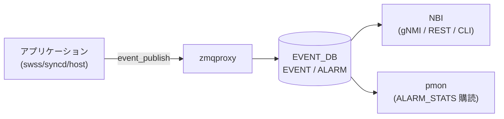

# イベント・アラームフレームワーク (EVENT / ALARM テーブル)

## 概要

SONiC の **Event and Alarm Framework** は、システム内の各アプリケーションが生成するイベントおよびアラームを集中管理する拡張監視フレームワークである[^1]。
`eventd` コンテナ内の **EventDB サービス**が zmqproxy 経由でイベントを受信し、EVENT_DB 内の 4 テーブル (EVENT / ALARM / EVENT_STATS / ALARM_STATS) に記録する。

**イベント**: 一度きりの通知（ログイン、認証失敗、設定変更など）。  
**アラーム**: 条件が継続する間 ALARM テーブルに残り、状態が解消されると CLEAR で除去される。

<!-- cdb-mermaid -->
### データフロー (自動生成)



!!! note "凡例"
    EVENT_DB は Redis の独立したインスタンス。CONFIG_DB とは別の DB 番号 (通常 6) に格納される。
<!-- /cdb-mermaid -->

## テーブル構造

### EVENT テーブル

```text
EVENT|<id>
```

全イベントの履歴を格納する。システム再起動をまたいで永続化される。  
デフォルト上限: **40,000 件** または **30 日分**（先に達した方で古いレコードを上書き）。

### ALARM テーブル

```text
ALARM|<id>
```

現在 active なアラームのみを格納する（CLEAR で除去）。  
ALARM テーブルは再起動時にクリアされる（永続化されない）。

### EVENT_STATS テーブル

```text
EVENT_STATS|state
```

イベント累計統計のシングルトンエントリ。

### ALARM_STATS テーブル

```text
ALARM_STATS|state
```

severity 別の active アラーム数を保持するシングルトンエントリ。  
再起動時にクリアされる。

## フィールド — EVENT テーブル

| フィールド | 型 | デフォルト | 説明 |
|-----------|-----|-----------|------|
| `id` | uint64 | 自動採番 | システムが付与する連番 ID |
| `type-id` | string | — | イベント名 (evprofile 定義) |
| `text` | string | — | 動的メッセージ |
| `time-created` | uint64 (epoch ns) | — | 発生タイムスタンプ |
| `action` | enum | `""` (one-shot) | アラーム: RAISE/CLEAR/ACKNOWLEDGE/UNACKNOWLEDGE |
| `resource` | string | `""` | イベント発生リソース名 |
| `severity` | string | evprofile 記載値 | CRITICAL/MAJOR/MINOR/WARNING/INFORMATIONAL |
| `revision` | uint64 | `0` | evprofile の revision 番号 |
| `acknowledged` | boolean | `false` | ack 状態（アラーム系イベントのみ） |

## フィールド — ALARM テーブル

| フィールド | 型 | デフォルト | 説明 |
|-----------|-----|-----------|------|
| `id` | uint64 | 自動採番 | 一意 ID |
| `revision` | uint64 | `0` | evprofile revision |
| `type-id` | string | — | アラーム名 |
| `text` | string | — | 動的メッセージ |
| `time-created` | uint64 (epoch ns) | — | 発生タイムスタンプ |
| `acknowledged` | boolean | `false` | ack 状態 |
| `acknowledge-time` | uint64 (epoch ns) | — | ack/unack 操作時刻 |
| `resource` | string | — | 発生リソース |
| `severity` | string | evprofile 記載値 | CRITICAL/MAJOR/MINOR/WARNING |

## フィールド — EVENT_STATS テーブル

| フィールド | 型 | デフォルト | 説明 |
|-----------|-----|-----------|------|
| `events` | uint64 | `0` | 累計イベント数 |
| `raised` | uint64 | `0` | 累計アラーム RAISE 数 |
| `cleared` | uint64 | `0` | 累計アラーム CLEAR 数 |
| `acked` | uint64 | `0` | 累計アラーム ACK 数 |

## フィールド — ALARM_STATS テーブル

| フィールド | 型 | デフォルト | 説明 |
|-----------|-----|-----------|------|
| `alarms` | uint64 | `0` | active アラーム総数 |
| `critical` | uint64 | `0` | CRITICAL の active 数 |
| `major` | uint64 | `0` | MAJOR の active 数 |
| `minor` | uint64 | `0` | MINOR の active 数 |
| `warning` | uint64 | `0` | WARNING の active 数 |
| `acknowledged` | uint64 | `0` | ack 済み active 数 |

## eventd マニフェスト (/etc/eventd.json)

EVENT テーブルのサイズ制限は `/etc/eventd.json` で設定する（CONFIG_DB ではない）。

| フィールド | デフォルト | 範囲 | 説明 |
|-----------|-----------|------|------|
| `no-of-records` | `40000` | 1..40000 | EVENT テーブルの最大レコード数 |
| `no-of-days` | `30` | 1..30 | EVENT テーブルのレコード最大保持日数 |

<!-- defaults -->
## フィールドデフォルト (コード由来)

| フィールド / 設定 | デフォルト値 | 由来 |
|---|---|---|
| `no-of-records` (eventd.json) | `40000` | HLD 仕様 (`event-alarm-framework.md:491`); 上限に達した場合古いレコードから上書き |
| `no-of-days` (eventd.json) | `30` | HLD 仕様 (`event-alarm-framework.md:492`); 30 日超のレコードを自動削除 |
| EVENT `acknowledged` | `false` | eventd EventConsumer: RAISE 時に `false` で初期化 (`event-alarm-framework.md:536`) |
| EVENT/ALARM `revision` | `0` | eventd: "If not given, the default revision '0' is assigned" (`event-alarm-framework.md:353`) |
| EVENT `action` (one-shot) | `""` (空文字) | one-shot イベントは action フィールドなし (`event-alarm-framework.md:514`) |
| ALARM_STATS カウンタ群 | `0` | eventd 起動時ゼロ初期化; 再起動時クリア |
| EVENT_STATS カウンタ群 | `0` | eventd 起動時ゼロ初期化 |
| heartbeat 間隔 | `2` 秒 | `HEARTBEAT_INTERVAL_SECS=2` (`sonic-eventd/src/eventd.cpp:43`) |
| MAX_CACHE_SIZE | 約 699,050 件 | `MB(100) / EVT_SIZE_AVG(150)` (`eventd.cpp:33`) |

> **Evidence**: `SONiC/doc/event-alarm-framework/event-alarm-framework.md` Rev 0.3;
> `sonic-buildimage/src/sonic-eventd/src/eventd.cpp:33,43`;
> `sonic-buildimage/src/sonic-yang-models/yang-models/sonic-events-common.yang`
<!-- /defaults -->

## Severity 定義

| Severity | 対応 syslog | 用途 |
|---------|------------|------|
| `CRITICAL` | log-alert | ハードウェア障害など即時対応が必要 |
| `MAJOR` | log-critical | サービス影響あり、緊急対応が必要 |
| `MINOR` | log-error | 放置するとサービス影響の可能性あり |
| `WARNING` | log-warning | エラー条件になりうる |
| `INFORMATIONAL` | log-notice | 情報のみ（アラームには使用不可） |

## 永続化ルール

| 再起動種別 | EVENT | ALARM | EVENT_STATS | ALARM_STATS |
|-----------|-------|-------|-------------|-------------|
| warm reboot | 保持 | クリア | 保持 | クリア |
| fast reboot | 保持 | クリア | 保持 | クリア |
| cold reboot | 保持 | クリア | 保持 | クリア |
| power reset | 定期 persist から復元 | クリア | 定期 persist から復元 | クリア |

> デフォルトで Redis の EVENT_DB を 75 イベントごと / 180 秒ごとにディスクに永続化。

## アラームのライフサイクル

```text
アプリが RAISE_ALARM → ALARM テーブルに追加, ALARM_STATS.severity++ 
アプリが CLEAR_ALARM → ALARM テーブルから削除, ALARM_STATS.severity--
ユーザが ACK_ALARM   → acknowledged=true, ALARM_STATS.severity--
ユーザが UNACK_ALARM → acknowledged=false, ALARM_STATS.severity++
```

`pmon` は `ALARM_STATS` を購読してシステム LED を制御する:
- CRITICAL/MAJOR active → 赤
- MINOR/WARNING active → 黄
- なし → 緑

## Event Profile (evprofile/default.json)

各イベント/アラームの静的属性は `/etc/evprofile/default.json` に定義する。

```json
{
    "events": [
        {
            "name": "TEMPERATURE_EXCEEDED",
            "revision": 0,
            "severity": "CRITICAL",
            "enable": "true",
            "message": "Temperature threshold is 75 degrees."
        }
    ]
}
```

`enable: false` のイベントは eventd が無視する。SIGINT を送ると eventd がファイルを再読み込みする。

## 購読者

- `eventd` (EventDB サービス) — zmqproxy 経由でイベントを受信し EVENT_DB に記録
- `pmon` — ALARM_STATS を購読してシステム LED 制御
- gNMI / REST クライアント — EVENT / ALARM テーブルをポーリングまたはサブスクライブ

## 確認コマンド

```bash
# EVENT テーブルの確認
sonic-db-cli EVENT_DB hgetall 'EVENT|1'

# ALARM_STATS の確認
sonic-db-cli EVENT_DB hgetall 'ALARM_STATS|state'

# show コマンド (KLISH CLI)
show event
show event summary
show alarm
show alarm summary
```

<!-- ref-triangle:start -->

## 関連リファレンス

- HLD: [Event and Alarm Framework](https://github.com/sonic-net/SONiC/blob/master/doc/event-alarm-framework/event-alarm-framework.md)
- YANG: `sonic-events-common` (sonic-buildimage)
- 関連 CONFIG_DB: [`SUPPRESS_ASIC_SDK_HEALTH_EVENT`](./suppress-asic-sdk-health-event.md)

<!-- ref-triangle:end -->

## 引用元

[^1]: HLD: Event and Alarm Framework. <https://github.com/sonic-net/SONiC/blob/master/doc/event-alarm-framework/event-alarm-framework.md>
