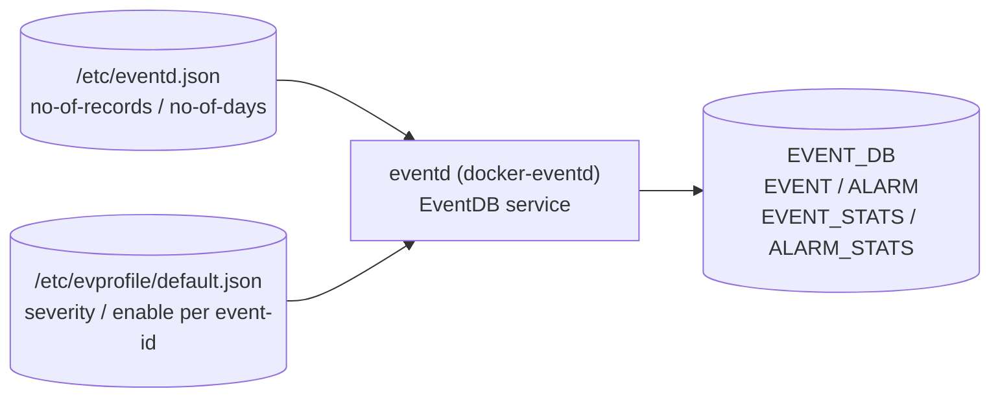

# イベント/アラーム拡張監視設定 (extended-monitor)

## 概要

SONiC の Event and Alarm Framework は `eventd` デーモンが中心となってイベント収集・配信を行う[^1]。基本トランスポート設定 (ZMQ エンドポイント等) は [`event-publisher.md`](event-publisher.md) を参照。本ページは**拡張監視設定**として:

1. **EVENT テーブル保持上限** (`/etc/eventd.json`) — イベント履歴の最大レコード数と保持日数
2. **イベントプロファイル** (`/etc/evprofile/default.json`) — イベント種別ごとの severity と有効/無効フラグ

を記述する。これらのパラメータは CONFIG_DB テーブルではなく、ファイルベース設定として管理される。

<!-- cdb-mermaid -->
### データフロー (自動生成)



!!! note "凡例"
    CONFIG_DB ではなく `/etc` 配下のファイルから読み込まれる設定。eventd が EVENT_DB (Redis DB index 19) の各テーブルを管理する。
<!-- /cdb-mermaid -->

---

## EVENT テーブル保持上限 (`/etc/eventd.json`)

```json
{
    "config": {
        "no-of-records": 40000,
        "no-of-days": 30
    }
}
```

| フィールド | デフォルト | 範囲 | 説明 |
|-----------|---------|------|------|
| `no-of-records` | `40000` | 1–40000 | `EVENT` テーブルが保持できる最大レコード数。上限に達すると古いレコードから順に削除する |
| `no-of-days` | `30` | 1–30 | イベントが `EVENT` テーブルに留まれる最大日数。日数超過エントリも同様に削除される |

どちらかの上限に達した時点でローテーション (wrap-around) が発動する。`SIGINT` を eventd プロセスに送ることで設定を再読み込みさせることができる。

!!! warning "実装状況"
    HLD (section 3.1.7) では上記設定ファイルが定義されているが、利用可能な `eventd.cpp` ソースコードではこのファイルの読み込みロジックが確認できなかった。実装が進行中または部分的である可能性がある。`verification: hld-only`。

---

## イベントプロファイル (`/etc/evprofile/default.json`)

eventd は起動時に `/etc/evprofile/default.json` を読み込み、`static_event_map` を構築する。開発者がイベント/アラームを新規追加する際には、このファイルに event-id を宣言する。

```json
{
    "__README__": "Supported severities: CRITICAL, MAJOR, MINOR, WARNING and INFORMATIONAL.",
    "events": [
        {
            "name": "SYSTEM_STATUS",
            "revision": 0,
            "severity": "INFORMATIONAL",
            "enable": "true",
            "message": "System Status Information"
        },
        {
            "name": "TEMPERATURE_EXCEEDED",
            "revision": 0,
            "severity": "CRITICAL",
            "enable": "true",
            "message": "Temperature threshold is 75 degrees."
        }
    ]
}
```

### プロファイルエントリのフィールド

| フィールド | 型 | デフォルト | 説明 |
|-----------|---|---------|------|
| `name` | string | 必須 | イベント識別子 (event-id)。`event_publish()` の tag と対応 |
| `revision` | uint64 | `0` | イベント定義のリビジョン番号。パラメータ変更時にインクリメントする |
| `severity` | enum | 必須 | `CRITICAL` / `MAJOR` / `MINOR` / `WARNING` / `INFORMATIONAL` の いずれか。`INFORMATIONAL` はアラームには不適用 |
| `enable` | string (`"true"`/`"false"`) | `"true"` | `"false"` の場合、eventd は該当イベントを受信しても破棄する (debug ログのみ) |
| `message` | string | 任意 | 静的メッセージ。動的メッセージと結合して EVENT テーブルの `text` フィールドに書き込まれる |

---

## EVENT_DB のテーブル構造

EVENT テーブルと ALARM テーブルは CONFIG_DB ではなく EVENT_DB (Redis DB index 19) に格納される[^2]。

### EVENT テーブルエントリ

```
EVENT|<id>
```

| フィールド | 型 | デフォルト | 説明 |
|-----------|---|---------|------|
| `id` | uint64 | 自動採番 | 単調増加するシーケンス ID (`time_t:32bit` + `5桁連番`) |
| `type-id` | string | — | イベント識別子 (`evprofile` の `name` と対応) |
| `text` | string | `""` | 静的 + 動的メッセージの結合 |
| `time-created` | uint64 (timeticks64) | 発行時刻 | イベント発生タイムスタンプ (nanoseconds) |
| `action` | enum | `""` | `RAISE` / `CLEAR` / `ACK_ALARM` / `UNACK_ALARM` / 空 (one-shot) |
| `resource` | string | `""` | イベント発生源 (インタフェース名・IP アドレス等) |
| `severity` | string | evprofile 由来 | イベント重大度 |
| `revision` | uint64 | `0` | evprofile の `revision` と一致 |
| `acknowledged` | boolean | `false` | ALARM テーブルのみ。ユーザー確認フラグ |

### ALARM_STATS テーブル

| フィールド | デフォルト | 説明 |
|-----------|---------|------|
| `critical` | `0` | RAISE 済みで未 CLEAR・未 ACK の CRITICAL アラーム数 |
| `major` | `0` | 同 MAJOR |
| `minor` | `0` | 同 MINOR |
| `warning` | `0` | 同 WARNING |
| `acknowledged` | `0` | ACK 済みアラーム数 (全 severity 合計) |

`pmon` は `ALARM_STATS` を購読してシステム LED を制御する:  
Critical/Major アラームあり → Red、Minor/Warning のみ → Amber、アラームなし → Green。

---

## 関連 YANG

イベントの型定義 (producer 側スキーマ) は以下の YANG で管理される。CONFIG_DB スキーマではなく、イベントペイロードの構造定義。

| YANG モジュール | 対象 |
|---------------|------|
| `sonic-events-common` | 共通 grouping (timestamp, usage/limit) および severity extension |
| `sonic-events-host` | disk-usage, memory-usage, cpu-usage, event-sshd, event-disk 等 |
| `sonic-events-swss` | swss コンテナ発行イベント |
| `sonic-events-syncd` | syncd 発行イベント |
| `sonic-events-bgp` | BGP イベント |
| `sonic-events-dhcp-relay` | DHCP relay イベント |

<!-- ordering -->
## 書込み順依存 (Phase B)

`eventd` は起動時に複数のサービスを順序付きで初期化し、その後イベントキャプチャのライフサイクルを厳格な状態遷移で管理する。誤った順序での操作はエラーまたはデータロスを招く。

### 起動時の初期化順序

| # | ステップ | 必須順序 | 根拠 |
|---|---------|---------|------|
| 1 | ZMQ コンテキスト生成 (`zmq_ctx_new`) | **最先行** | 以降の全サービスが zctx に依存する |
| 2 | `eventd_proxy::init()` — XSUB/XPUB/CAPTURE ソケットのバインド | proxy init 完了を待つ (`m_init_done` ポーリング) | publisher/subscriber が接続を試みる前に XSUB/XPUB エンドポイントが Listen 状態でなければならない (`eventd.cpp:680`) |
| 3 | `event_service::init_server` — 制御チャネル初期化 | proxy init 完了後 | 制御チャネルはプロキシのバックエンドを利用する |
| 4 | `stats_collector::start()` — COUNTERS_DB 接続 + collector/writer スレッド起動 | proxy init 完了後 | collector スレッドが subscriber を作成してすべてのイベントを受信し始める |
| 5 | `capture_service` 作成 + `INIT_CAPTURE` — SUB ソケット接続 | stats 起動後 | capture サービスは stats_instance を参照してカウンタをインクリメントする (`eventd.cpp:694`) |
| 6 | `START_CAPTURE` — キャプチャ開始 | `INIT_CAPTURE` 完了確認後 (`m_cap_run` ポーリング) | NEED_INIT → INIT_CAPTURE → START_CAPTURE の単方向遷移のみ許可; `(ctrl - m_ctrl) == 1` のアサーションで強制 (`eventd.cpp:557`) |

### キャプチャライフサイクルの順序制約

`capture_control_t` は `NEED_INIT(0) → INIT_CAPTURE(1) → START_CAPTURE(2) → STOP_CAPTURE(3)` の単調増加で管理される。**逆順・スキップは不可**。

| 操作 | 前提状態 | 後続制約 |
|------|---------|---------|
| `EVENT_CACHE_INIT` | キャプチャ不問 (既存を reset してから再作成) | `EVENT_CACHE_START` が必要 |
| `EVENT_CACHE_START` | `INIT_CAPTURE` 完了済み (`capture != NULL`) | heartbeat を pause (`heartbeat_ctrl(true)`) する |
| `EVENT_CACHE_STOP` | `START_CAPTURE` 済み | `STOP_CAPTURE` は `CACHE_DRAIN_IN_MILLISECS` 待機後に join → capture を reset; その後 heartbeat を再開 (`heartbeat_ctrl()`) |
| `EVENT_CACHE_READ` | `capture == NULL`（STOP 完了後のみ） | STOP 前に READ を呼ぶとエラー (`"Cache is not stopped yet."`) |

### ハートビートと caching の排他

`stats_collector::run_collector()` のハートビート発行ループは `m_pause_heartbeat` フラグで制御される。`EVENT_CACHE_START` 受信時に pause され、`EVENT_CACHE_STOP` 完了時に resume される。これにより**キャプチャ中はハートビートイベントがカウンタに混入しない** (`eventd.cpp:736, 757`)。

### `evprofile` 読み込みと event 処理の依存

`/etc/evprofile/default.json` はプロセス起動時に `static_event_map` として読み込まれる。この読み込みが完了する前に `event_publish()` が呼ばれると、イベントプロファイルが未登録のまま処理が走る可能性がある。ファイルが存在しない場合はイベントプロファイルなしで動作し、すべてのイベントが `enable=true` 扱いとなる（HLD section 3.1.2 による）。

<!-- /ordering -->

<!-- defaults -->
## フィールド暗黙デフォルト (Phase A — コード由来)

HLD および `eventd.cpp` の定数から導出する[^1][^3]。

### `/etc/eventd.json` — EVENT テーブル保持上限

| フィールド | コード由来デフォルト | 根拠 |
|-----------|-------------------|------|
| `no-of-records` | **40000** | HLD section 3.1.7; `"The size of Event Table is 40k records"` |
| `no-of-days` | **30** | HLD section 3.1.7; `"or 30 days worth of events"` |

### `/etc/evprofile/default.json` — イベントプロファイル

| フィールド | コード由来デフォルト | 根拠 |
|-----------|-------------------|------|
| `revision` | **`0`** | HLD section 3.1.2.3; `"If not given, the default revision '0' is assigned"` |
| `enable` | **`"true"`** | HLD section 3.1.2; イベントプロファイルのデフォルトサンプルでは `"enable": "true"` |
| `severity` | 開発者定義 (必須) | イベント追加時に開発者が設定。デフォルト値なし |

### EVENT_DB 内フィールド (eventd が自動設定)

| フィールド | コード由来デフォルト | 根拠 |
|-----------|-------------------|------|
| `revision` | **`0`** | evprofile で `revision` 未指定時の fallback |
| `acknowledged` | **`false`** | ALARM テーブルエントリ追加時の初期値 (HLD section 3.1.3) |
| `action` (one-shot event) | **`""`** (空文字列) | アラームでないイベントは `action` フィールドなし |

### フラッディング防止パラメータ (ハードコード)

| 定数 | 値 | 説明 |
|------|---|------|
| `MAX_CACHE_SIZE` | **699050** 件 | `MB(100) / EVT_SIZE_AVG = (100×1024×1024) / 150` — `eventd.cpp:31-33` |
| `EVT_SIZE_AVG` | **150** バイト | キャッシュサイズ計算用イベント平均サイズ — `eventd.cpp:31` |
| `READ_SET_SIZE` | **100** 件 | `EVENT_CACHE_READ` 1回の返却件数上限 — `eventd.cpp:36` |
| `HEARTBEAT_INTERVAL_SECS` | **2** 秒 | eventd ハートビート発行間隔 — `eventd.h:43` |
| `STATS_HEARTBEAT_MIN` | **300** ms | ハートビート最小分解能 — `eventd.h:24` |

### discrepancy メモ

- **`no-of-records`/`no-of-days` の実装**: HLD では `eventd.json` を読み込む設計だが、利用可能な `eventd.cpp` ソースに読み込みロジックが見当たらない。shallow clone の制約により EventDB サービス側の実装が欠落している可能性がある。HLD 値をデフォルトとして採用する。
- **ALARM テーブルのリブート挙動**: HLD では ALARM テーブルはリブートで初期化されると明記 (`"NOT persisted and its contents are cleared with a reload"`)。EVENT テーブルは永続化される。

<!-- /defaults -->

<!-- ordering -->
## 書込み順依存 (Phase B)

`eventd` は起動時に以下の順序で初期化を実行し、それぞれのステップが完了するまで次に進まない。設定ファイルやリソースの読込み順序と、EVENT_DB への書込み開始タイミングが隠れた順序依存を形成する。

### 検出された順序依存

| # | 依存関係 | 方向 | 緩和策 |
|---|----------|------|--------|
| 1 | `/etc/sonic/init_cfg.json` 読込み → ZMQ エンドポイント bind | 強制先行（設定先読み） | ファイル不在時はデフォルト値 (`tcp://127.0.0.1:5570〜5573`) にフォールバック。起動時 1 回のみ |
| 2 | ZMQ XPUB/XSUB proxy bind 完了 (`m_init_done = true`) → `event_service.init_server()` | **強制先行** | `eventd_proxy::init()` は `m_init_done` が true になるまでポーリング待ちし、失敗時は `run_eventd_service()` が `goto out` で終了 |
| 3 | `/etc/evprofile/default.json` 読込み (`static_event_map` 構築) → EVENT_DB への書込み開始 | 強制先行 | プロファイル未読込み状態でイベントを受信しても `enable` 判定できず処理不可 |
| 4 | `capture_service::INIT_CAPTURE` → `START_CAPTURE` → 任意の `EVENT_CACHE_INIT` 要求 | 状態遷移 (1 ステップずつ) | `set_control()` は `(ctrl - m_ctrl) == 1` を検証し、ステップ飛ばしは `goto out` でエラー |
| 5 | `EVENT_CACHE_STOP` (+ `read_cache()`) → `EVENT_CACHE_READ` | **強制先行** | `capture != NULL` の間は `EVENT_CACHE_READ` が `resp=-1` を返す。telemetry が `CACHE_STOP` を送らない限りキャッシュが読めない |
| 6 | `stats_collector::start()` → COUNTERS_DB への統計書込み | 強制先行 | writer スレッドが `COUNTERS_DB` に接続してから初めて `COUNTERS_EVENTS_TABLE` へ書込みが始まる。接続失敗時は `run_eventd_service()` が終了 |
| 7 | イベント受信 (heartbeat 以外) → `hb_cntr` リセット | 即時 | イベント受信があると heartbeat カウンタがリセットされ、ハートビート発行間隔が延長する。heartbeat と通常イベントの到着順は非決定的 |

### 主要な制約詳細

**ZMQ proxy bind 完了待ち (依存 #2)**: `eventd_proxy::run()` は XSUB (`tcp://127.0.0.1:5570`) → XPUB (`tcp://127.0.0.1:5571`) → capture PUB (`tcp://127.0.0.1:5573`) の順に `zmq_bind()` を呼び、全成功後に `m_init_result = 0; m_init_done = true` を設定する。`init()` は 10ms ポーリングで `m_init_done` 待ちする (`eventd.cpp:64-68`)。**いずれかの bind が失敗するとプロセス全体が終了する**ため、ポート競合があると eventd が起動できない。

**キャプチャサービスの 1 ステップ制約 (依存 #4)**: `set_control()` は `RET_ON_ERR((ctrl - m_ctrl) == 1, ...)` で 1 ステップ超の遷移を拒否する (`eventd.cpp:557`)。`NEED_INIT(0) → INIT_CAPTURE(1) → START_CAPTURE(2) → STOP_CAPTURE(3)` の順を厳守しなければならない。`INIT_CAPTURE` 失敗時は `skip_caching = true` となり、以降の `EVENT_CACHE_READ` 要求は全て `resp=-1` を返す (`eventd.cpp:695-701, 762-765`)。

**telemetry との順序 (依存 #5)**: telemetry (gnmi_server) は起動時に `EVENT_CACHE_INIT` → `EVENT_CACHE_START` を送り、準備完了後に `EVENT_CACHE_STOP` → 複数回の `EVENT_CACHE_READ` を送る。`capture != NULL` (キャプチャ停止前) に `EVENT_CACHE_READ` が届いても中身が返らないため、**telemetry が `EVENT_CACHE_STOP` を送るまでキャッシュデータは取得不可**。eventd は `CACHE_DRAIN_IN_MILLISECS` だけ待ってからキャプチャスレッドを join する (`eventd.cpp:598`)。

**evprofile 読込みと ZMQ subscribe の順序 (依存 #3)**: HLD section 3.1.2 に明記: `"On initialization, event consumer reads /etc/evprofile/default.json and builds an internal map of events, called static_event_map. It then subscribes to zmqproxy for events."` プロファイル読込みが ZMQ subscribe より先に完了しなければ、最初のイベント到着時に severity/enable の判定に使う `static_event_map` が未構築の状態になる可能性がある。

<!-- /ordering -->

<!-- cross-refs -->
## 暗黙参照 — `eventd` が読み書きする関連 DB・ファイル (Phase C)

`eventd` はファイルシステム上の設定ファイルと複数の Redis DB にまたがって依存を持つ。以下にその全体像を示す。

### ファイル参照

| ファイルパス | 読み/書き | タイミング | 内容 |
|------------|---------|-----------|------|
| `/etc/sonic/init_cfg.json` | 読み | 起動時 1 回 | ZMQ エンドポイント (`xsub_path`, `xpub_path`, `capture_path`) と `cache_max_cnt` を取得。不在時はハードコードデフォルト (`tcp://127.0.0.1:5570〜5573`) を使用 (`events_common.h:129–144`) |
| `/etc/evprofile/default.json` | 読み | 起動時 1 回 | イベントプロファイル (`name`, `revision`, `severity`, `enable`, `message`) を読み込み `static_event_map` を構築。不在時は空マップで動作 (HLD section 3.1.2) |
| `/etc/eventd.json` | 読み | 起動時 (HLD 設計) | EVENT テーブルの `no-of-records` / `no-of-days` 保持上限を取得。**実装確認不可** (eventd.cpp に読み込みロジック未検出) |

### Redis DB 参照

| DB | テーブル | 読み/書き | 根拠 |
|----|---------|---------|------|
| `COUNTERS_DB` | `COUNTERS_EVENTS` | **書き** | `stats_collector` の writer スレッドが `published` (発行済みイベント数) と `missed_to_cache` (キャッシュ溢れ数) を定期書き込み (`eventd.cpp:186–210`; `schema.h:266, 275, 278`; `eventd.h:23`) |
| `EVENT_DB` (index 19) | `EVENT` / `ALARM` | **書き** | event consumer が受信イベントを EVENT テーブルへ追記し、`action=RAISE` のイベントを ALARM テーブルへも追記 (HLD section 3.1.2; `schema.h:551–554`) |
| `EVENT_DB` (index 19) | `EVENT_STATS` / `ALARM_STATS` | **書き** | 各イベント受信時に severity 別カウンタ (`critical`, `major`, `minor`, `warning`, `acknowledged`) を更新 |
| `EVENT_DB` (index 19) | `ALARM_STATS` | **読み** (pmon) | `pmon` が ALARM_STATS を購読してシステム LED を制御: Critical/Major → Red、Minor/Warning → Amber、なし → Green (HLD section 3.1.3) |

### ZMQ エンドポイント参照

| エンドポイント | キー | デフォルト | 役割 |
|--------------|-----|---------|------|
| XSUB | `xsub_path` | `tcp://127.0.0.1:5570` | イベント producer (`event_publish()`) が接続して publish する入口 |
| XPUB | `xpub_path` | `tcp://127.0.0.1:5571` | subscriber (stats_collector, event consumer) が接続して受信する出口 |
| capture PUB | `capture_path` | `tcp://127.0.0.1:5573` | capture_service が subscribe してイベントをキャッシュする専用チャネル |

### 暗黙的な他コンポーネント依存

| 依存先 | 依存内容 | 備考 |
|--------|---------|------|
| telemetry (gnmi_server) | `EVENT_CACHE_INIT` → `EVENT_CACHE_START` → `EVENT_CACHE_STOP` → `EVENT_CACHE_READ` のシーケンスを eventd に送信 | telemetry が起動するまでキャッシュが drain されない (HLD section 3.1.8) |
| rsyslogd | eventd の `supervisord.conf` で `dependent_startup_wait_for=start:exited` が設定されており、start.sh (rsyslogd 起動後に exited) を待ってから起動 | `docker-eventd/supervisord.conf:47–57` |

<!-- /cross-refs -->

<!-- failure -->
## 失敗挙動 (Phase D)

> **調査根拠**: `sonic-buildimage/src/sonic-eventd/src/eventd.cpp`、`sonic-swss-common/common/events_common.h` の `RET_ON_ERR` マクロ定義および `run_eventd_service()` 関数全体。

`eventd` プロセス内の失敗は `RET_ON_ERR` マクロ (`events_common.h:47-52`) で一元処理される。条件が偽の場合、`SWSS_LOG_INFO` でエラーを syslog 出力し `goto out` でクリーンアップコードへジャンプする。致命的な失敗はプロセス終了に至る。

### 初期化フェーズの失敗パターン

| # | 失敗ケース | 発生箇所 | 挙動 | 復旧手段 |
|---|-----------|---------|------|---------|
| 1 | `zmq_ctx_new()` 失敗 | `run_eventd_service():672` | syslog 出力後プロセス終了 | supervisord が自動再起動 |
| 2 | `get_config_data(CACHE_MAX_CNT)` が 0 以下を返す | `run_eventd_service():675` | プロセス終了。`/etc/sonic/init_cfg.json` 内の `cache_max_cnt` が不正値の場合に発生 | 設定ファイルを修正して eventd 再起動 |
| 3 | `eventd_proxy::init()` 失敗 — ZMQ ポート bind 失敗 | `run_eventd_service():680`、`eventd_proxy::run():78-93` | proxy スレッドが `m_init_result=1; m_init_done=true` をセットし `init()` が失敗を返す → プロセス終了 | ポート競合（5570/5571/5573）を解消して再起動 |
| 4 | `event_service::init_server()` 失敗 | `run_eventd_service():682` | プロセス終了 | eventd 再起動 |
| 5 | `stats_collector::start()` — COUNTERS_DB 接続失敗 | `stats_collector::start():184` | `RET_ON_ERR` で start() が失敗を返し、呼び出し元がプロセス終了 | Redis サービス起動後に eventd 再起動 |

### キャプチャサービスの失敗パターン（non-fatal）

| # | 失敗ケース | 発生箇所 | 挙動 | 影響 |
|---|-----------|---------|------|------|
| 6 | `capture_service::INIT_CAPTURE` 失敗 | `run_eventd_service():696` | `SWSS_LOG_WARN` 出力 + `skip_caching = true` + `capture.reset()` | **プロセスは継続**。`EVENT_CACHE_READ` は以降すべて `resp=-1` を返す。イベント配信自体は継続する |
| 7 | `START_CAPTURE` 失敗 | `run_eventd_service():700` | プロセス終了（`RET_ON_ERR`） | eventd 再起動が必要 |
| 8 | `capture_service::do_capture()` 内 ZMQ ソケット失敗 | `capture_service::do_capture():414-423` | `goto out` でキャプチャスレッドのみ終了。`m_cap_run = false` になるため呼び出し元がエラーを検出可能 | キャッシュ収集が無効化 |
| 9 | `capture_service::set_control()` に 1 ステップ超の遷移要求 | `eventd.cpp:557` | `RET_ON_ERR` でキャプチャスレッド停止、`goto out` | telemetry の誤操作が原因。`m_cap_run` が false のままになりリカバリ不可。eventd 再起動が必要 |

### ランタイムフェーズの失敗パターン

| # | 失敗ケース | 発生箇所 | 挙動 |
|---|-----------|---------|------|
| 10 | `service.channel_read()` 失敗（制御チャネル読み込みエラー） | `run_eventd_service():710` | プロセス終了 |
| 11 | `service.channel_write()` 失敗（応答送信エラー） | `run_eventd_service():822` | プロセス終了 |
| 12 | `event_receive()` での例外 | `stats_collector::run_collector():266-271` | `SWSS_LOG_ERROR` 出力後 rc=-1 として継続。heartbeat カウンタ処理分岐に入り次ループへ |
| 13 | heartbeat `event_publish()` 失敗 | `stats_collector::run_collector():293` | `SWSS_LOG_ERROR("Failed to publish heartbeat rc=%d")` 出力後ループ継続。heartbeat 欠落するが eventd は継続 |
| 14 | キャッシュ内の不正フォーマットイベント | `capture_service::do_capture():522` | `SWSS_LOG_ERROR` 出力。当該イベントをスキップして次イベント処理へ |

### `evprofile` / `eventd.json` の読み込み失敗

| ファイル | 失敗時の挙動 |
|---------|-----------|
| `/etc/evprofile/default.json` 不在 | `static_event_map` が空のまま起動。全イベントが `enable=true` 扱いで通過する（HLD section 3.1.2） |
| `/etc/evprofile/default.json` JSON 不正 | パース失敗。`static_event_map` 未構築のまま起動。syslog にエラーログ |
| `/etc/eventd.json` 不在 / 読み込み失敗 | HLD 設計では `no-of-records`/`no-of-days` のデフォルト値（40000件/30日）が使われる想定。ただし現行 `eventd.cpp` に読み込みロジックが確認できないため実際の挙動は不明 |

> **証跡**: `run_eventd_service()` (L656-827)、`eventd_proxy::run()` (L72-123)、`stats_collector::start()` (L172-196)、`stats_collector::run_collector()` (L229-312)、`capture_service::do_capture()` (L383-530)、`capture_service::set_control()` (L545-620)、`events_common.h:RET_ON_ERR` (L47-52)。
<!-- /failure -->

<!-- constants -->
## ハードコード定数 (Phase E)

`eventd` および `events_common.h` / `eventd.cpp` / `eventd.h` 内に存在する、CONFIG_DB / YANG で管理されない固定値の一覧。`/etc/eventd.json` や `/etc/evprofile/default.json` で上書きできないプロセス内部定数を中心に示す。

### イベントキャッシュ・サイズ定数

| 定数 | 値 | 用途 | ソース |
|------|----|------|--------|
| `EVT_SIZE_AVG` | **150** バイト | キャッシュサイズ計算用イベント平均バイト数。`MAX_CACHE_SIZE` 算出の分母 | `eventd.cpp:31` |
| `MAX_CACHE_SIZE` | **699050** 件 | `MB(100) / EVT_SIZE_AVG = (100×1024×1024) / 150`。`/etc/sonic/init_cfg.json` の `cache_max_cnt` が空文字の場合の実効上限 | `eventd.cpp:33` |
| `READ_SET_SIZE` | **100** 件 | `EVENT_CACHE_READ` 1 回のレスポンスで返すイベント件数上限 | `eventd.cpp:36` |
| `MAX_PUBLISHERS_COUNT` | **1000** 件 | 同時パブリッシャーの最大数（runtime-ID キャッシュエントリ上限）。超過した古い runtime-ID は時刻順に削除 | `events_common.h:45` |

### ハートビート・タイミング定数

| 定数 | 値 | 用途 | ソース |
|------|----|------|--------|
| `HEARTBEAT_INTERVAL_SECS` | **2** 秒 | `stats_collector` 起動時に `set_heartbeat_interval(2)` で設定するデフォルト発行間隔 | `eventd.cpp:43` (旧 `eventd.h:43`) |
| `STATS_HEARTBEAT_MIN` | **300** ms | ハートビート間隔の内部量子化単位。設定値は `(val×1000 + 299) / 300` カウントに丸められる。結果として実効周期は指定値より最大 300ms 長くなる場合がある | `eventd.cpp:24` |

> **例**: `set_heartbeat_interval(2)` → `(2000 + 299) / 300 = 7` カウント → 実効周期 `7 × 300 ms = 2100 ms`

### キャプチャサービス制御定数

| 定数 | 値 | 用途 | ソース |
|------|----|------|--------|
| `CAPTURE_SERVICE_POLLING_DURATION` | **10** ms | `set_control()` 内でのポーリング待ち初期間隔 | `eventd.cpp:25` |
| `CAPTURE_SERVICE_POLLING_INCREMENT` | **10** ms | ポーリング間隔の増加量（バックオフ） | `eventd.cpp:26` |
| `CAPTURE_SERVICE_POLLING_MAX_DURATION` | **100** ms | ポーリング間隔の最大値 | `eventd.cpp:27` |
| `CAPTURE_SERVICE_POLLING_RETRIES` | **100** 回 | 最大ポーリング試行回数。100 回 × 最大 100 ms = 最大 10 秒待機 | `eventd.cpp:28` |
| `CACHE_DRAIN_IN_MILLISECS` | **1000** ms | `STOP_CAPTURE` 時に capture スレッドを join する前に待機するドレイン時間 | `events_common.h:470` |
| `CAPTURE_SOCK_TIMEOUT` | **800** ms | capture SUB ソケットの `ZMQ_RCVTIMEO`。タイムアウト時に `SIGTERM` 確認ループへ戻る | `eventd.cpp:41` |

### ZMQ ソケット定数

| 定数 | 値 | 用途 | ソース |
|------|----|------|--------|
| `LINGER_TIMEOUT` | **100** ms | ZMQ ソケットの `SO_LINGER` 相当タイムアウト。close 時に未送信メッセージを最大 100ms 待つ | `events_common.h:54` |

### Publisher ソース識別子

| 定数 | 値 | 用途 | ソース |
|------|----|------|--------|
| `EVENTD_PUBLISHER_SOURCE` | `"sonic-events-eventd"` | eventd が heartbeat を発行するときに使う publisher 識別子 (ZMQ メッセージの source フィールド) | `eventd.cpp:46` |
| `EVENTD_HEARTBEAT_TAG` | `"heartbeat"` | heartbeat イベントの event-id (tag)。`event_publish(pub_handle, "heartbeat")` で発行 | `eventd.cpp:47` |

### EVENT テーブル保持上限のデフォルト値 (HLD 設計値)

`/etc/eventd.json` が存在しない場合や読み込み失敗時に適用される想定値。現行 `eventd.cpp` に読み込みロジックが確認できないため HLD 設計値として記録する。

| 項目 | HLD 設計デフォルト | 出典 |
|------|-----------------|------|
| `no-of-records` | **40000** 件 | HLD section 3.1.7: `"The size of Event Table is 40k records"` |
| `no-of-days` | **30** 日 | HLD section 3.1.7: `"or 30 days worth of events"` |

> **注意**: 上記 2 値は `eventd.cpp` 内にマクロ定数として定義されておらず、HLD ドキュメントのみに出現する。実装が HLD から乖離している可能性がある（`verification: hld-only`）。
<!-- /constants -->

<!-- side-effects -->
## 副次 DB 書込 (Phase F)

EventDB service (`eventd` 内の event_consumer + alarm_consumer) が `/etc/evprofile/default.json` の内容をもとにイベントを処理した際の副次 DB 書込みを示す。

### DB 書込み一覧

| DB | テーブル | 書込有無 | 根拠 |
|----|---------|---------|------|
| `EVENT_DB` (index 19) | `EVENT` | **あり** | 受信イベント (`enable=true`) ごとにシーケンス ID を採番して書込み。`no-of-records`/`no-of-days` 上限超過で古いエントリをローテーション (HLD section 3.1.2) |
| `EVENT_DB` (index 19) | `ALARM` | **あり** | `action=RAISE_ALARM` でエントリ追加、`CLEAR_ALARM` で削除。`ACK_ALARM`/`UNACK_ALARM` で `acknowledged` フラグと `acknowledge_time` を更新 (HLD section 3.1.3) |
| `EVENT_DB` (index 19) | `EVENT_STATS` | **あり** | イベント累計統計カウンタ (HLD section 3.1.4) |
| `EVENT_DB` (index 19) | `ALARM_STATS` | **あり** | severity 別アクティブアラーム数 (`critical`/`major`/`minor`/`warning`/`acknowledged`)。RAISE/CLEAR/ACK/UNACK ごとに増減 (HLD section 3.1.3) |
| `COUNTERS_DB` | `COUNTERS_EVENTS` | **あり（定期）** | `stats_collector::run_writer()` が最大 10 ms 毎に発行済み・キャッシュ損失カウンタを書込み (`eventd.cpp:198-210`)。`event-publisher.md` の Phase F と共通の書込みパス |
| `CONFIG_DB` | — | なし | eventd はファイル直接読み。CONFIG_DB アクセスなし |
| `APPL_DB` | — | なし | 書込みパスなし |
| `STATE_DB` | — | なし | 書込みパスなし |
| `ASIC_DB` | — | なし | SAI 非経由 |

### ALARM_STATS → pmon LED 制御（副次購読）

`pmon` コンテナが `ALARM_STATS` テーブルを購読し、アクティブアラームの severity に応じてシステム LED 色を決定する[^1]:

| ALARM_STATS 状態 | LED 色 |
|-----------------|--------|
| `critical` または `major` > 0 | **Red** |
| `minor` または `warning` > 0 かつ critical/major = 0 | **Amber** |
| 全 severity = 0 | **Green** |

この LED 制御は `evprofile` の設定が間接的に影響する副次作用であり、`severity=CRITICAL` のイベントを `enable=true` で定義するかどうかがシステム LED の挙動に直結する。

### リブート時の EVENT_DB 書込み挙動

| リブート種別 | EVENT テーブル | ALARM / ALARM_STATS |
|------------|-------------|---------------------|
| Cold reboot | **ディスク永続化あり** (再起動後に復元) | 消去（アプリが再 RAISE 必要） |
| Warm reboot | **ディスク永続化あり** (ALARM/ALARM_STATS を除外) | 消去 |
| Fast reboot | **ディスク永続化あり** (EVENT + EVENT_STATS) | 消去 |
| Power reset | **ディスク永続化あり** (定期永続化 DB から復元) | 消去（永続化タイミング次第で一部損失の可能性あり） |

(根拠: HLD section 4.1.1〜4.4[^1])
<!-- /side-effects -->

<!-- pubsub -->
## 通信メカニズム (Phase G)

> 調査証跡: `meta/_intermediate/cdb-flow/extended-monitor-pubsub.md`

### 購読方式: Redis keyspace 通知なし — ファイル直接読み込み + ZMQ ブローカー

`/etc/eventd.json` および `/etc/evprofile/default.json` を **Redis keyspace 通知で購読するプロセスは存在しない**。`eventd` は起動時にこれらのファイルを `ifstream` で直接読み込む。`SubscriberStateTable` / `ConsumerStateTable` は使用しない。

代わりに `eventd` 自体が **ZeroMQ (ZMQ) ブローカー** として動作し、全コンテナ間のイベント転送に ZMQ を使用する（基本設定の詳細は [`event-publisher.md`](event-publisher.md) を参照）。

### 各コンポーネントの通信方式

| コンポーネント | 通信方式 | エンドポイント / 対象 | 役割 |
|---|---|---|---|
| `eventd` (設定読み込み) | `ifstream` ファイル直接 | `/etc/eventd.json`, `/etc/evprofile/default.json` | 起動時 1 回読み込み。変更反映は `systemctl restart eventd` が必要 |
| event producer (全コンテナ) | ZMQ XSUB `zmq_connect` | `:5570` (`xsub_path`) | `event_publish()` 経由でイベントを送信。eventd proxy が XSUB→XPUB 間で転送 |
| `stats_collector` (内部サブスクライバー) | ZMQ XPUB `events_init_subscriber` | `:5571` (`xpub_path`) | 全イベントを受信してハートビート検知 + COUNTERS_DB 書き込み (`eventd.cpp:244`) |
| telemetry (gnmi_server) | ZMQ XPUB subscribe + REQ/REP | `:5571` / `:5572` | `EVENT_CACHE_INIT` → `EVENT_CACHE_START` → `EVENT_CACHE_STOP` → `EVENT_CACHE_READ` でキャッシュ制御 |
| capture_service (内部) | ZMQ SUB `zmq_connect` | `:5573` (`capture_path`) | キャプチャ専用チャネルでイベントをバッファリング (HLD section 3.1.8) |
| `pmon` | `EVENT_DB.ALARM_STATS` 購読 | `EVENT_DB` (Redis index 19) | ALARM_STATS の severity 別カウンタ変化を監視してシステム LED を制御: Critical/Major → Red、Minor/Warning → Amber、なし → Green (HLD section 3.1.3) |

### 設定変更の反映経路

```
管理者: /etc/eventd.json または /etc/evprofile/default.json を手動編集
  ↓ (Redis への書き込みなし — CONFIG_DB 変更なし)
systemctl restart eventd
  ↓ run_eventd_service() が起動時に両ファイルを再読み込み (eventd.cpp:656-704)
  ↓ ZMQ ソケット再バインド (xsub:5570 / xpub:5571 / req_rep:5572 / capture:5573)
全 ZMQ クライアント (producer・subscriber) が lazy connect で自動再接続
```

`config reload` は `/etc/evprofile/default.json` を書き直さないため、イベントプロファイルの変更は手動編集 + `restart eventd` が唯一の反映手段である。

### APPL_DB / SAI 中継

なし。拡張監視設定 (`eventd.json` / `evprofile`) は `eventd` 内部で完結し、APPL_DB / STATE_DB / ASIC_DB への伝播も SAI 書き込みも発生しない。EVENT_DB と COUNTERS_DB への書き込みは `eventd` が直接行う（Phase F 参照）。

> **Evidence**: `eventd.cpp:172-225` (stats_collector::start); `eventd.cpp:656-704` (run_eventd_service 起動シーケンス); `eventd.cpp:244` (内部サブスクライバー); HLD section 3.1.2, 3.1.3, 3.1.8
<!-- /pubsub -->

<!-- platform -->
## プラットフォーム差異 (Phase H)

<!-- evidence: sonic-net/sonic-buildimage/src/sonic-eventd/src/eventd.cpp (全体),
     sonic-net/sonic-buildimage/src/sonic-eventd/src/eventd.h (全体),
     SONiC/doc/event-alarm-framework/event-alarm-framework.md -->

### SAI・プラットフォーム依存なし（全 ASIC 共通）

`eventd` は SAI API を呼び出さず、`getenv("platform")` 参照もなく、`#ifdef` によるプラットフォーム分岐も存在しない。ZMQ ブローカーとして Redis DB（EVENT_DB / COUNTERS_DB）への書き込みのみを行う純粋なユーザー空間デーモンであるため、**ASIC ベンダー・ハードウェア世代・スイッチチップの種類によって挙動は変わらない**[^4]。

| プラットフォーム要素 | eventd の依存 |
|---------------------|--------------|
| SAI / ASIC ドライバ | なし |
| `platform` 環境変数 | 参照しない |
| `switch_type` (voq/chassis) | 参照しない |
| CPU アーキテクチャ (x86/ARM) | 変わらない（ZMQ は CPU 非依存） |

### VM・仮想環境での注意事項

VM テストベッド（`sonic-vs`）でも `eventd` は同一バイナリで動作する。ただし ZMQ ソケットに接続するプロデューサー（`syncd`・`bgp`・`dhcp_relay` 等）の有無がイベント流量に影響する。VM では syncd が SAI イベントを生成しないため、`syncd_events_info.json` で定義されたイベントが発行されない。

| 環境 | 影響 |
|------|------|
| 物理スイッチ | syncd/orchagent が SAI イベントを発行 → EVENT_DB に記録 |
| sonic-vs（VM） | syncd が SAI イベントを発行しない → 該当イベント 0 件 |
| どちらの環境でも同じ | ZMQ ブローカー・evprofile ロード・COUNTERS_DB 書き込みの動作 |

### マルチ ASIC 構成

マルチ ASIC 環境では `eventd` インスタンスが per-switch-ASIC ではなく **グローバルに 1 インスタンス**のみ起動する（`docker-eventd` は ASIC 数に依存しない単一コンテナ）。すべての ASIC のイベントは同一の ZMQ ブローカー（`tcp://127.0.0.1:5570` 等）に集約される。

`COUNTERS_DB` インスタンスもシングル（`DBConnector("COUNTERS_DB", 0)`）であり、マルチ ASIC 用の namespace 分割はない（`eventd.cpp:178`）。

### `/etc/evprofile/default.json` の内容はプラットフォーム共通

`evprofile/default.json` は `sonic-eventd` パッケージに同梱され、全プラットフォーム共通のイベント定義が入っている[^5]。ASIC ベンダー固有のイベント型を追加する場合は別途カスタム evprofile を配置する（HLD section 3.1.5）。個別プラットフォームが `default.json` を上書きする公式な仕組みは現時点では未定義。

### キャッシュメモリ上限 (`CACHE_MAX_CNT`) のプラットフォーム影響

`MAX_CACHE_SIZE = MB(100) / EVT_SIZE_AVG (150 bytes) ≈ 699,050` イベントが上限のデフォルト値である（`eventd.cpp:31-33`）。`get_config_data(CACHE_MAX_CNT, MAX_CACHE_SIZE)` が `/etc/eventd.json` から上書き値を読む。RAM が少ない組み込みプラットフォームでは `eventd.json` で `cache_max_cnt` を下げる運用が推奨される（HLD section 3.1.7）。SAI・ASIC 種別とは無関係で、搭載 RAM 量のみに依存する。

[^4]: eventd SAI 非依存コード: `sonic-buildimage/src/sonic-eventd/src/eventd.cpp` — SAI インクルードなし、`getenv("platform")` 呼び出しなし. <https://github.com/sonic-net/sonic-buildimage/blob/master/src/sonic-eventd/src/eventd.cpp>
[^5]: evprofile デフォルト定義: `SONiC/doc/event-alarm-framework/event-alarm-framework.md` section 3.1.5. <https://github.com/sonic-net/SONiC/blob/master/doc/event-alarm-framework/event-alarm-framework.md>

<!-- /platform -->

## 引用元

[^1]: `SONiC/doc/event-alarm-framework/event-alarm-framework.md` — Event and Alarm Framework HLD. section 3.1.5 (Event Profile), 3.1.7 (Event Table and Alarm Table). <https://github.com/sonic-net/SONiC/blob/master/doc/event-alarm-framework/event-alarm-framework.md>

[^2]: `sonic-net/sonic-swss-common/common/schema.h` — `EVENT_DB = 19`, `EVENT_HISTORY_TABLE_NAME`, `EVENT_CURRENT_ALARM_TABLE_NAME`, `EVENT_STATS_TABLE_NAME`, `EVENT_ALARM_STATS_TABLE_NAME`. <https://github.com/sonic-net/sonic-swss-common/blob/master/common/schema.h>

[^3]: `sonic-net/sonic-buildimage/src/sonic-eventd/src/eventd.cpp` — `MAX_CACHE_SIZE`, `EVT_SIZE_AVG`, `READ_SET_SIZE`, `HEARTBEAT_INTERVAL_SECS` 定数定義. <https://github.com/sonic-net/sonic-buildimage/blob/master/src/sonic-eventd/src/eventd.cpp>

## 関連ページ
- [イベントパブリッシャー設定](event-publisher.md)
- [SUPPRESS_ASIC_SDK_HEALTH_EVENT テーブル](suppress-asic-sdk-health-event.md)
- [CONFIG_DB index](index.md)
