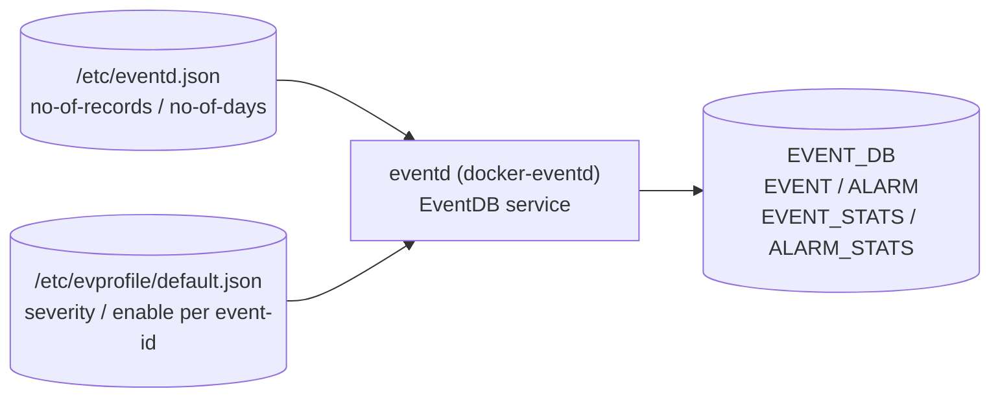

# イベント/アラーム拡張監視設定 (extended-monitor)

## 概要

SONiC の Event and Alarm Framework は `eventd` デーモンが中心となってイベント収集・配信を行う[^1]。基本トランスポート設定 (ZMQ エンドポイント等) は [`event-publisher.md`](event-publisher.md) を参照。本ページは**拡張監視設定**として:

1. **EVENT テーブル保持上限** (`/etc/eventd.json`) — イベント履歴の最大レコード数と保持日数
2. **イベントプロファイル** (`/etc/evprofile/default.json`) — イベント種別ごとの severity と有効/無効フラグ

を記述する。これらのパラメータは CONFIG_DB テーブルではなく、ファイルベース設定として管理される。

<!-- cdb-mermaid -->
### データフロー (自動生成)



!!! note "凡例"
    CONFIG_DB ではなく `/etc` 配下のファイルから読み込まれる設定。eventd が EVENT_DB (Redis DB index 19) の各テーブルを管理する。
<!-- /cdb-mermaid -->

---

## EVENT テーブル保持上限 (`/etc/eventd.json`)

```json
{
    "config": {
        "no-of-records": 40000,
        "no-of-days": 30
    }
}
```

| フィールド | デフォルト | 範囲 | 説明 |
|-----------|---------|------|------|
| `no-of-records` | `40000` | 1–40000 | `EVENT` テーブルが保持できる最大レコード数。上限に達すると古いレコードから順に削除する |
| `no-of-days` | `30` | 1–30 | イベントが `EVENT` テーブルに留まれる最大日数。日数超過エントリも同様に削除される |

どちらかの上限に達した時点でローテーション (wrap-around) が発動する。`SIGINT` を eventd プロセスに送ることで設定を再読み込みさせることができる。

!!! warning "実装状況"
    HLD (section 3.1.7) では上記設定ファイルが定義されているが、利用可能な `eventd.cpp` ソースコードではこのファイルの読み込みロジックが確認できなかった。実装が進行中または部分的である可能性がある。`verification: hld-only`。

---

## イベントプロファイル (`/etc/evprofile/default.json`)

eventd は起動時に `/etc/evprofile/default.json` を読み込み、`static_event_map` を構築する。開発者がイベント/アラームを新規追加する際には、このファイルに event-id を宣言する。

```json
{
    "__README__": "Supported severities: CRITICAL, MAJOR, MINOR, WARNING and INFORMATIONAL.",
    "events": [
        {
            "name": "SYSTEM_STATUS",
            "revision": 0,
            "severity": "INFORMATIONAL",
            "enable": "true",
            "message": "System Status Information"
        },
        {
            "name": "TEMPERATURE_EXCEEDED",
            "revision": 0,
            "severity": "CRITICAL",
            "enable": "true",
            "message": "Temperature threshold is 75 degrees."
        }
    ]
}
```

### プロファイルエントリのフィールド

| フィールド | 型 | デフォルト | 説明 |
|-----------|---|---------|------|
| `name` | string | 必須 | イベント識別子 (event-id)。`event_publish()` の tag と対応 |
| `revision` | uint64 | `0` | イベント定義のリビジョン番号。パラメータ変更時にインクリメントする |
| `severity` | enum | 必須 | `CRITICAL` / `MAJOR` / `MINOR` / `WARNING` / `INFORMATIONAL` の いずれか。`INFORMATIONAL` はアラームには不適用 |
| `enable` | string (`"true"`/`"false"`) | `"true"` | `"false"` の場合、eventd は該当イベントを受信しても破棄する (debug ログのみ) |
| `message` | string | 任意 | 静的メッセージ。動的メッセージと結合して EVENT テーブルの `text` フィールドに書き込まれる |

---

## EVENT_DB のテーブル構造

EVENT テーブルと ALARM テーブルは CONFIG_DB ではなく EVENT_DB (Redis DB index 19) に格納される[^2]。

### EVENT テーブルエントリ

```
EVENT|<id>
```

| フィールド | 型 | デフォルト | 説明 |
|-----------|---|---------|------|
| `id` | uint64 | 自動採番 | 単調増加するシーケンス ID (`time_t:32bit` + `5桁連番`) |
| `type-id` | string | — | イベント識別子 (`evprofile` の `name` と対応) |
| `text` | string | `""` | 静的 + 動的メッセージの結合 |
| `time-created` | uint64 (timeticks64) | 発行時刻 | イベント発生タイムスタンプ (nanoseconds) |
| `action` | enum | `""` | `RAISE` / `CLEAR` / `ACK_ALARM` / `UNACK_ALARM` / 空 (one-shot) |
| `resource` | string | `""` | イベント発生源 (インタフェース名・IP アドレス等) |
| `severity` | string | evprofile 由来 | イベント重大度 |
| `revision` | uint64 | `0` | evprofile の `revision` と一致 |
| `acknowledged` | boolean | `false` | ALARM テーブルのみ。ユーザー確認フラグ |

### ALARM_STATS テーブル

| フィールド | デフォルト | 説明 |
|-----------|---------|------|
| `critical` | `0` | RAISE 済みで未 CLEAR・未 ACK の CRITICAL アラーム数 |
| `major` | `0` | 同 MAJOR |
| `minor` | `0` | 同 MINOR |
| `warning` | `0` | 同 WARNING |
| `acknowledged` | `0` | ACK 済みアラーム数 (全 severity 合計) |

`pmon` は `ALARM_STATS` を購読してシステム LED を制御する:  
Critical/Major アラームあり → Red、Minor/Warning のみ → Amber、アラームなし → Green。

---

## 関連 YANG

イベントの型定義 (producer 側スキーマ) は以下の YANG で管理される。CONFIG_DB スキーマではなく、イベントペイロードの構造定義。

| YANG モジュール | 対象 |
|---------------|------|
| `sonic-events-common` | 共通 grouping (timestamp, usage/limit) および severity extension |
| `sonic-events-host` | disk-usage, memory-usage, cpu-usage, event-sshd, event-disk 等 |
| `sonic-events-swss` | swss コンテナ発行イベント |
| `sonic-events-syncd` | syncd 発行イベント |
| `sonic-events-bgp` | BGP イベント |
| `sonic-events-dhcp-relay` | DHCP relay イベント |

<!-- defaults -->
## フィールド暗黙デフォルト (Phase A — コード由来)

HLD および `eventd.cpp` の定数から導出する[^1][^3]。

### `/etc/eventd.json` — EVENT テーブル保持上限

| フィールド | コード由来デフォルト | 根拠 |
|-----------|-------------------|------|
| `no-of-records` | **40000** | HLD section 3.1.7; `"The size of Event Table is 40k records"` |
| `no-of-days` | **30** | HLD section 3.1.7; `"or 30 days worth of events"` |

### `/etc/evprofile/default.json` — イベントプロファイル

| フィールド | コード由来デフォルト | 根拠 |
|-----------|-------------------|------|
| `revision` | **`0`** | HLD section 3.1.2.3; `"If not given, the default revision '0' is assigned"` |
| `enable` | **`"true"`** | HLD section 3.1.2; イベントプロファイルのデフォルトサンプルでは `"enable": "true"` |
| `severity` | 開発者定義 (必須) | イベント追加時に開発者が設定。デフォルト値なし |

### EVENT_DB 内フィールド (eventd が自動設定)

| フィールド | コード由来デフォルト | 根拠 |
|-----------|-------------------|------|
| `revision` | **`0`** | evprofile で `revision` 未指定時の fallback |
| `acknowledged` | **`false`** | ALARM テーブルエントリ追加時の初期値 (HLD section 3.1.3) |
| `action` (one-shot event) | **`""`** (空文字列) | アラームでないイベントは `action` フィールドなし |

### フラッディング防止パラメータ (ハードコード)

| 定数 | 値 | 説明 |
|------|---|------|
| `MAX_CACHE_SIZE` | **699050** 件 | `MB(100) / EVT_SIZE_AVG = (100×1024×1024) / 150` — `eventd.cpp:31-33` |
| `EVT_SIZE_AVG` | **150** バイト | キャッシュサイズ計算用イベント平均サイズ — `eventd.cpp:31` |
| `READ_SET_SIZE` | **100** 件 | `EVENT_CACHE_READ` 1回の返却件数上限 — `eventd.cpp:36` |
| `HEARTBEAT_INTERVAL_SECS` | **2** 秒 | eventd ハートビート発行間隔 — `eventd.h:43` |
| `STATS_HEARTBEAT_MIN` | **300** ms | ハートビート最小分解能 — `eventd.h:24` |

### discrepancy メモ

- **`no-of-records`/`no-of-days` の実装**: HLD では `eventd.json` を読み込む設計だが、利用可能な `eventd.cpp` ソースに読み込みロジックが見当たらない。shallow clone の制約により EventDB サービス側の実装が欠落している可能性がある。HLD 値をデフォルトとして採用する。
- **ALARM テーブルのリブート挙動**: HLD では ALARM テーブルはリブートで初期化されると明記 (`"NOT persisted and its contents are cleared with a reload"`)。EVENT テーブルは永続化される。

<!-- /defaults -->

<!-- ordering -->
## 書込み順依存 (Phase B)

`eventd` は起動時に以下の順序で初期化を実行し、それぞれのステップが完了するまで次に進まない。設定ファイルやリソースの読込み順序と、EVENT_DB への書込み開始タイミングが隠れた順序依存を形成する。

### 検出された順序依存

| # | 依存関係 | 方向 | 緩和策 |
|---|----------|------|--------|
| 1 | `/etc/sonic/init_cfg.json` 読込み → ZMQ エンドポイント bind | 強制先行（設定先読み） | ファイル不在時はデフォルト値 (`tcp://127.0.0.1:5570〜5573`) にフォールバック。起動時 1 回のみ |
| 2 | ZMQ XPUB/XSUB proxy bind 完了 (`m_init_done = true`) → `event_service.init_server()` | **強制先行** | `eventd_proxy::init()` は `m_init_done` が true になるまでポーリング待ちし、失敗時は `run_eventd_service()` が `goto out` で終了 |
| 3 | `/etc/evprofile/default.json` 読込み (`static_event_map` 構築) → EVENT_DB への書込み開始 | 強制先行 | プロファイル未読込み状態でイベントを受信しても `enable` 判定できず処理不可 |
| 4 | `capture_service::INIT_CAPTURE` → `START_CAPTURE` → 任意の `EVENT_CACHE_INIT` 要求 | 状態遷移 (1 ステップずつ) | `set_control()` は `(ctrl - m_ctrl) == 1` を検証し、ステップ飛ばしは `goto out` でエラー |
| 5 | `EVENT_CACHE_STOP` (+ `read_cache()`) → `EVENT_CACHE_READ` | **強制先行** | `capture != NULL` の間は `EVENT_CACHE_READ` が `resp=-1` を返す。telemetry が `CACHE_STOP` を送らない限りキャッシュが読めない |
| 6 | `stats_collector::start()` → COUNTERS_DB への統計書込み | 強制先行 | writer スレッドが `COUNTERS_DB` に接続してから初めて `COUNTERS_EVENTS_TABLE` へ書込みが始まる。接続失敗時は `run_eventd_service()` が終了 |
| 7 | イベント受信 (heartbeat 以外) → `hb_cntr` リセット | 即時 | イベント受信があると heartbeat カウンタがリセットされ、ハートビート発行間隔が延長する。heartbeat と通常イベントの到着順は非決定的 |

### 主要な制約詳細

**ZMQ proxy bind 完了待ち (依存 #2)**: `eventd_proxy::run()` は XSUB (`tcp://127.0.0.1:5570`) → XPUB (`tcp://127.0.0.1:5571`) → capture PUB (`tcp://127.0.0.1:5573`) の順に `zmq_bind()` を呼び、全成功後に `m_init_result = 0; m_init_done = true` を設定する。`init()` は 10ms ポーリングで `m_init_done` 待ちする (`eventd.cpp:64-68`)。**いずれかの bind が失敗するとプロセス全体が終了する**ため、ポート競合があると eventd が起動できない。

**キャプチャサービスの 1 ステップ制約 (依存 #4)**: `set_control()` は `RET_ON_ERR((ctrl - m_ctrl) == 1, ...)` で 1 ステップ超の遷移を拒否する (`eventd.cpp:557`)。`NEED_INIT(0) → INIT_CAPTURE(1) → START_CAPTURE(2) → STOP_CAPTURE(3)` の順を厳守しなければならない。`INIT_CAPTURE` 失敗時は `skip_caching = true` となり、以降の `EVENT_CACHE_READ` 要求は全て `resp=-1` を返す (`eventd.cpp:695-701, 762-765`)。

**telemetry との順序 (依存 #5)**: telemetry (gnmi_server) は起動時に `EVENT_CACHE_INIT` → `EVENT_CACHE_START` を送り、準備完了後に `EVENT_CACHE_STOP` → 複数回の `EVENT_CACHE_READ` を送る。`capture != NULL` (キャプチャ停止前) に `EVENT_CACHE_READ` が届いても中身が返らないため、**telemetry が `EVENT_CACHE_STOP` を送るまでキャッシュデータは取得不可**。eventd は `CACHE_DRAIN_IN_MILLISECS` だけ待ってからキャプチャスレッドを join する (`eventd.cpp:598`)。

**evprofile 読込みと ZMQ subscribe の順序 (依存 #3)**: HLD section 3.1.2 に明記: `"On initialization, event consumer reads /etc/evprofile/default.json and builds an internal map of events, called static_event_map. It then subscribes to zmqproxy for events."` プロファイル読込みが ZMQ subscribe より先に完了しなければ、最初のイベント到着時に severity/enable の判定に使う `static_event_map` が未構築の状態になる可能性がある。

<!-- /ordering -->

## 引用元

[^1]: `SONiC/doc/event-alarm-framework/event-alarm-framework.md` — Event and Alarm Framework HLD. section 3.1.5 (Event Profile), 3.1.7 (Event Table and Alarm Table). <https://github.com/sonic-net/SONiC/blob/master/doc/event-alarm-framework/event-alarm-framework.md>

[^2]: `sonic-net/sonic-swss-common/common/schema.h` — `EVENT_DB = 19`, `EVENT_HISTORY_TABLE_NAME`, `EVENT_CURRENT_ALARM_TABLE_NAME`, `EVENT_STATS_TABLE_NAME`, `EVENT_ALARM_STATS_TABLE_NAME`. <https://github.com/sonic-net/sonic-swss-common/blob/master/common/schema.h>

[^3]: `sonic-net/sonic-buildimage/src/sonic-eventd/src/eventd.cpp` — `MAX_CACHE_SIZE`, `EVT_SIZE_AVG`, `READ_SET_SIZE`, `HEARTBEAT_INTERVAL_SECS` 定数定義. <https://github.com/sonic-net/sonic-buildimage/blob/master/src/sonic-eventd/src/eventd.cpp>

## 関連ページ
- [イベントパブリッシャー設定](event-publisher.md)
- [SUPPRESS_ASIC_SDK_HEALTH_EVENT テーブル](suppress-asic-sdk-health-event.md)
- [CONFIG_DB index](index.md)
