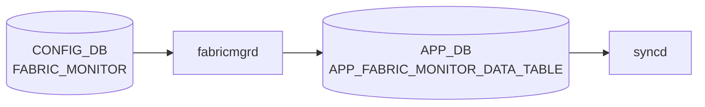

# FABRIC_MONITOR テーブル

## 概要

`FABRIC_MONITOR` テーブルは [VOQ](../../reference/glossary.md#term-voq) chassis のファブリックリンク監視 (`FABRIC_PORT` の自動 isolate/include) 用パラメータを [CONFIG_DB](../../reference/glossary.md#term-config_db) に保持する[^1]。単一エントリ `FABRIC_MONITOR_DATA` を持ち、CRC エラー閾値や検出/復旧ポーリング数を定義する。

<!-- cdb-mermaid -->
### データフロー (自動生成)



!!! note "凡例"
    CONFIG_DB から SAI までの典型経路を `docs/reference/config-db-orch-map.md` から機械生成したミニ図。詳細・例外は本ページ本文と対応表を参照。
<!-- /cdb-mermaid -->

## key 構造

```text
FABRIC_MONITOR|FABRIC_MONITOR_DATA
```

[YANG](../../reference/glossary.md#term-yang) では `container FABRIC_MONITOR_DATA` の直下にスカラー leaf が並ぶ単一インスタンス構造。

## フィールド

| フィールド | 型 | 範囲 | デフォルト | 説明 |
|-----------|----|------|-----------|------|
| `monErrThreshCrcCells` | uint32 | — | 1 | エラー検出閾値となる CRC エラーセル数 |
| `monErrThreshRxCells` | uint32 | — | 61035156 | 受信セル総数の閾値。`monErrThreshRxCells` 中 `monErrThreshCrcCells` を超えるエラーで isolate |
| `monPollThreshIsolation` | uint8 | 1..10 | 1 | 連続して閾値超過と判定された場合に isolate するポーリング回数 |
| `monPollThreshRecovery` | uint8 | 1..10 | 8 | 連続して閾値以下に戻った場合に include するポーリング回数 |
| `monCapacityThreshWarn` | uint8 | 5..100 | 10 | up 状態ファブリックリンクの割合 (%) 警告閾値 |
| `monState` | `mode-status` (enable/disable) | — | disable | 監視機能のオン/オフ |

<!-- defaults -->
## フィールドデフォルト (コード由来)

| フィールド | デフォルト値 | 由来 |
|---|---|---|
| `monErrThreshCrcCells` | `1` | YANG `default 1` (sonic-fabric-monitor.yang); orchagent `ERROR_RATE_CRC_CELLS_CFG=1` (fabricportsorch.cpp:46) と一致 |
| `monErrThreshRxCells` | `61035156` | YANG `default 61035156`; orchagent `ERROR_RATE_RX_CELLS_CFG=61035156` (fabricportsorch.cpp:47) と一致 |
| `monPollThreshIsolation` | `1` | YANG `default 1`; orchagent `ISOLATION_POLLS_CFG=1` (fabricportsorch.h:44) と一致 |
| `monPollThreshRecovery` | `8` | YANG `default 8`; orchagent `RECOVERY_POLLS_CFG=8` (fabricportsorch.h:45) と一致 |
| `monCapacityThreshWarn` | `10` | YANG `default 10`。ただし APPL_DB 未設定時の orchagent フォールバックは `100` (fabricportsorch.cpp:1052) — 後述 Exceptions 参照 |
| `monState` | `disable` | YANG `default disable`; 監視はデフォルト無効 |

> **Evidence**: `sonic-buildimage` `src/sonic-yang-models/yang-models/sonic-fabric-monitor.yang`; `sonic-swss` `orchagent/fabricportsorch.cpp:46-47,1052` / `orchagent/fabricportsorch.h:44-45`
<!-- /defaults -->

<!-- value-behavior -->
## 値依存挙動マトリクス

### `monState` (mode-status: enable/disable)

| 値 | 挙動 |
|----|------|
| `disable` (デフォルト) | 監視停止。不良ファブリックリンクが自動 isolate されない |
| `enable` | fabricmgr が [APPL_DB](../../reference/glossary.md#term-appl_db) に monState=enable を書き込み、fabric 監視を開始（fabricmgr.cpp:70-74） |

### `monPollThreshIsolation` (uint8: 1..10, デフォルト 1)

| 値 | 挙動 |
|----|------|
| `1` | 閾値超過を 1 回検出で即時 isolate（CRC スパイクで誤 isolate のリスク） |
| `2`..`10` | 値が大きいほど連続超過を待つ（安定性重視） |
| 範囲外 (0 or >10) | YANG range 違反で reject |

### `monPollThreshRecovery` (uint8: 1..10, デフォルト 8)

| 値 | 挙動 |
|----|------|
| `1` | 閾値以下に戻った次のポーリングで即時 unisolate（不安定リンクが頻繁に切り替わるリスク） |
| `2`..`10` | 値が大きいほど復帰判定を遅らせる（安定性重視） |
| 範囲外 | YANG range 違反で reject |

### `monCapacityThreshWarn` (uint8: 5..100, デフォルト 10)

| 値 | 挙動 |
|----|------|
| `5`..`100` | up 状態ファブリックリンクが全体の N% を下回ったとき警告ログ |
| 範囲外 | YANG range 違反で reject |

<!-- /value-behavior -->

## 制約

- `monPollThreshIsolation` / `monPollThreshRecovery` は 1..10
- `monCapacityThreshWarn` は 5..100 (%)
- `monState` は `enable` または `disable`

<!-- ordering -->
## 書込み順依存 (Phase B)

### 1. `fabricmgrd` の APPL_DB 書込み → `FabricPortsOrch` コンストラクタ実行

`FabricPortsOrch` コンストラクタ（`fabricportsorch.cpp:127`）は初期化時に `checkFabricPortMonState()` を呼び、`APPL_DB.APP_FABRIC_MONITOR_DATA_TABLE` の `monState` フィールドを参照する。`fabricmgrd` が APPL_DB に書き込む前に orchagent が起動した場合、`monState=enable` が CONFIG_DB に設定済みでも `setCfgVal=false` となりデバッグタイマーが起動しない（監視無効状態で初期化完了）。この場合は orchagent 再起動が必要になる。

### 2. `monState=enable` 設定後はデバッグタイマー起動に最大 30 秒の遅延

`monState=enable` を設定すると `fabricmgrd` は直ちに APPL_DB を更新するが、orchagent 内のデバッグタイマーは次の `FABRIC_POLL` タイマー発火時（デフォルト 30 秒間隔）の `checkFabricPortMonState()` 判定後に初めて `m_debugTimer->start()` が呼ばれる（`fabricportsorch.cpp:1582-1585`）。即時反映は orchagent 再起動のみ保証される。

### 3. 複数フィールドの同時変更は APPL_DB 側が逐次更新（中間状態あり）

`FabricMgr::doTask()` はフィールドを 1 件ずつ `writeConfigToAppDb()` に渡す（`fabricmgr.cpp:50-100`）。`updateFabricDebugCounters()` は毎ポーリングで APPL_DB を一括読み込みするため、複数フィールドを同時変更した場合にポーリングタイミングが重なると新旧混在値で監視計算が実行される可能性がある。

### 4. SAI によるファブリックポートリスト取得完了が監視処理の前提

`getFabricPortList()` が完了（`m_getFabricPortListDone=true`）するまで、`updateFabricDebugCounters()` / `updateFabricPortState()` はすべてスキップされる（`fabricportsorch.cpp:262,329,420`）。SAI がポートリストを返さない間は FABRIC_MONITOR の設定が有効でも監視処理は実行されない。

| # | 依存関係 | 方向 | 違反時の挙動 |
|---|----------|------|------------|
| 1 | `fabricmgrd` APPL_DB 書込み → `FabricPortsOrch` init | **推奨先行** | デバッグタイマー未起動（監視無効で初期化完了） |
| 2 | `monState=enable` 設定 → デバッグタイマー有効化 | **遅延あり（最大 30 秒）** | 次回 FABRIC_POLL まで監視開始されない |
| 3 | 複数フィールド同時更新 | **逐次書込み（中間状態あり）** | ポーリング次第で新旧混在値で監視計算 |
| 4 | `getFabricPortList()` 完了（SAI 応答） → 監視処理実行 | **強制先行** | SAI 応答遅延中はすべての監視処理スキップ |

<!-- /ordering -->

<!-- failure -->
## 失敗挙動 (Phase D)

### 失敗パス一覧

| # | トリガー | 発生箇所 | 結果 | retry |
|---|---------|---------|------|-------|
| 1 | SAI ファブリックポートリスト取得失敗（恒久エラー） | `getFabricPortList()` L193-197 | `runtime_error` 例外 → orchagent クラッシュ | supervisord 自動再起動 |
| 2 | SAI ファブリックポート数取得失敗（非恒久エラー） | `getFabricPortList()` L173-180 | `FABRIC_PORT_ERROR` を返し early return。`m_getFabricPortListDone=false` のまま監視未開始 | 次 `FABRIC_POLL`（30 秒）で自動 retry |
| 3 | STATE_DB `FABRIC_PORT_TABLE\|PORT<lane>` エントリ欠如 | `updateFabricDebugCounters()` L619-624 / `updateFabricCapacity()` L1093-1098 | 関数全体が early return。当該ポーリング周期の監視更新が全スキップ | 次ポーリングで再試行 |
| 4 | COUNTERS_DB ポート統計エントリ欠如 | `updateFabricDebugCounters()` L500-503 | `rxCells=0` / `crcErrors=0` のゼロ値で処理継続（エラー無しと判断、isolate 不発） | — |
| 5 | SAI `set_port_attribute` (isolate) が失敗 | `isolateFabricLink()` L996-999 | エラーログのみ。STATE_DB の `ISOLATED` フラグは更新済みのため STATE_DB とハードウェアの isolation 状態が乖離 | なし |
| 6 | `m_fabricLanePortMap` にレーン番号なし | `isolateFabricLink()` L990-993 | SAI 呼び出しをスキップ（silent skip）。実際の isolate 未実行 | なし |
| 7 | `monState=disable` / APPL_DB 未設定 | `doFabricPortTask()` L1396-1399 | `checkFabricPortMonState()=false` → early return。APPL_DB イベント処理が全スキップ | — |
| 8 | `alias` / `lanes` / `isolateStatus` フィールド欠如 | `doFabricPortTask()` L1479-1485 | エントリを erase して silent skip。ポート isolate 制御が実行されない | なし |
| 9 | Redis 接続障害 (fabricmgrd 側) | `writeConfigToAppDb()` L108-124 | 例外キャッチなし → fabricmgrd クラッシュ | supervisord 自動再起動 |

### orchagent クラッシュ経路

`getFabricPortList()` でファブリックポートリスト (`SAI_SWITCH_ATTR_FABRIC_PORT_LIST`) の取得に失敗すると、`handleSaiGetStatus()` が `task_success` 以外を返した場合に `throw runtime_error` が発生する（`fabricportsorch.cpp:193-197`）。同様に HW レーン属性 (`SAI_PORT_ATTR_HW_LANE_LIST`) の取得失敗でも `throw runtime_error` が発生する（`fabricportsorch.cpp:210-213`）。orchagent は supervisord により自動再起動される。

```
throw runtime_error("FabricPortsOrch get port list failure");
throw runtime_error("FabricPortsOrch get port lane failure");
```

### STATE_DB と SAI のアイソレート状態乖離

`isolateFabricLink()` は SAI の `set_port_attribute` 呼び出し失敗時にエラーログを出力するだけで、処理を継続する（`fabricportsorch.cpp:996-999`）。この時点で STATE_DB の `ISOLATED` フィールドはすでに更新済みのため、STATE_DB では isolated=1 でもハードウェア上はアイソレートされないという不整合が発生する。次のポーリングで再び `origIsolated != isolated` の差分が生まれないため、この乖離は自動解消されない。復旧には orchagent 再起動が必要。

### APPL_DB 未設定時のデフォルトフォールバック

APPL_DB の `FABRIC_MONITOR_DATA` エントリが存在しない場合、`updateFabricDebugCounters()` はコンパイル時定数にフォールバックする:

| 定数名 | フォールバック値 | evidence |
|--------|----------------|---------|
| `errorRateCrcCellsCfg` | `ERROR_RATE_CRC_CELLS_CFG = 1` | `fabricportsorch.cpp:46,438` |
| `errorRateRxCellsCfg` | `ERROR_RATE_RX_CELLS_CFG = 61035156` | `fabricportsorch.cpp:47,439` |
| `isolationPollsCfg` | `ISOLATION_POLLS_CFG = 1` | `fabricportsorch.cpp:44,436` |
| `recoveryPollsCfg` | `RECOVERY_POLLS_CFG = 8` | `fabricportsorch.cpp:45,437` |

`monCapacityThreshWarn` は `updateFabricCapacity()` 内で `threshold=100` にフォールバックする（`fabricportsorch.cpp:1052`）。YANG default の `10` とは異なる値のため `cdb-exceptions` ブロックに記載済みの乖離が生じる。

> 中間調査ファイル: `meta/_intermediate/cdb-flow/fabric-monitor-failure.md`
<!-- /failure -->

<!-- cross-refs -->
## 暗黙参照 — Phase C (cross-table refs)

> **調査根拠**: `fabricmgr.cpp`, `fabricportsorch.cpp` 全行精読 (2026-05-18)

`FABRIC_MONITOR` テーブルは YANG leafref を持たないが、`fabricmgrd` / `FabricPortsOrch` が実行時に以下のテーブル・リソースを暗黙参照する。

| 参照先 | DB | 参照方向 | YANG leafref | 実装上の必須度 | 証拠 |
|---|---|---|---|---|---|
| `FABRIC_MONITOR_TABLE\|FABRIC_MONITOR_DATA` (APPL_DB) | APPL_DB | 書き込み (fabricmgrd) / 読み取り (FabricPortsOrch) | なし | 実質必須 | `fabricmgr.cpp:112-116`, `fabricportsorch.cpp:139,444` |
| `FABRIC_PORT_TABLE\|<lane>` (APPL_DB) | APPL_DB | 読み取り (`isolateStatus`) | なし | 監視処理時必須 | `fabricportsorch.cpp:590-613` |
| `FABRIC_PORT_TABLE\|<lane>` (STATE_DB) | STATE_DB | 読み取り / 書き込み (poll カウンタ・isolate 状態) | なし | 監視処理時必須 | `fabricportsorch.cpp:619,756-959` |
| `FABRIC_CAPACITY_TABLE` (STATE_DB) | STATE_DB | 書き込み (capacity 警告判定結果) | なし | `monCapacityThreshWarn` 有効時 | `fabricportsorch.cpp:1054-1095` |
| `COUNTERS_TABLE\|<port_oid>` (COUNTER_DB) | COUNTER_DB | 読み取り (SAI ポート統計) | なし | 監視処理時必須 | `fabricportsorch.cpp:500-529` |
| SAI Switch (`SAI_SWITCH_ATTR_NUMBER_OF_FABRIC_PORTS` / `SAI_SWITCH_ATTR_FABRIC_PORT_LIST`) | SAI | 読み取り (ファブリックポートリスト) | なし | 起動時必須 | `fabricportsorch.cpp:171-228` |

### APPL_DB `FABRIC_MONITOR_TABLE` — 中継バッファ（双方向参照）

`fabricmgrd` は CONFIG_DB の `FABRIC_MONITOR` 変化を検知すると、フィールド単位で `FABRIC_MONITOR_TABLE|FABRIC_MONITOR_DATA` (APPL_DB) に書き込む（`fabricmgr.cpp:112-116`）。`FabricPortsOrch` はポーリング毎にこのエントリを `hgetall` で一括読み込み（`fabricportsorch.cpp:444`）、閾値・`monState` を取得する。CONFIG_DB に値があっても APPL_DB への書込みが完了するまで orchagent 側には反映されない。

### STATE_DB `FABRIC_PORT_TABLE` — 監視状態の永続化

`updateFabricDebugCounters()` は各ファブリックポートの `STATUS` / `POLL_WITH_ERRORS` / `POLL_WITH_NO_ERRORS` / `AUTO_ISOLATED` などを `m_stateTable` (STATE_DB `FABRIC_PORT_TABLE`) から読み取り、計算後に同テーブルへ書き戻す（`fabricportsorch.cpp:619-959`）。このエントリが存在しない場合は処理全体を early return する（`fabricportsorch.cpp:622-624`）。**FABRIC_PORT_TABLE エントリが STATE_DB に存在することが監視処理の前提条件**。

### COUNTER_DB `COUNTERS_TABLE` — SAI ポート統計

CRC エラー率の判定には SAI から収集された `SAI_PORT_STAT_IF_IN_ERRORS`（CRC エラー数）と `SAI_PORT_STAT_IF_IN_FABRIC_DATA_UNITS`（受信セル数）を `COUNTERS_TABLE` から取得する（`fabricportsorch.cpp:500`）。カウンタが存在しない場合はゼロ値として扱われ、エラーなしと判断される。

### SAI Fabric Port List — 処理全体の前提

`getFabricPortList()` が SAI から `SAI_SWITCH_ATTR_FABRIC_PORT_LIST` を取得し `m_getFabricPortListDone=true` をセットするまで、`updateFabricDebugCounters()` / `updateFabricPortState()` / `generateQueueStats()` はすべて冒頭で early return する（`fabricportsorch.cpp:262,329,420`）。FABRIC_MONITOR の設定が完了していても、SAI 初期化が遅延すると監視処理が開始されない。

<!-- /cross-refs -->

<!-- constants -->
## ハードコード定数 (Phase E)

`fabricportsorch.cpp` に存在する、CONFIG_DB / YANG で管理されないハードコード定数の一覧。`fabricmgr.cpp` には数値定数なし（値の転送のみ）。

### ポーリングタイマー定数

| 定数名 | 値 | 用途 | ソース |
|--------|----|------|--------|
| `FABRIC_POLLING_INTERVAL_DEFAULT` | `30` 秒 | `m_timer` (FABRIC_POLL) 周期。ポート状態・統計の定期ポーリング間隔 | fabricportsorch.cpp:21,87 |
| `FABRIC_DEBUG_POLLING_INTERVAL_DEFAULT` | `12` 秒 | `m_debugTimer` (FABRIC_DEBUG_POLL) 周期。監視有効時の CRC/FEC エラー集計間隔 | fabricportsorch.cpp:29,88 |
| `FABRIC_PORT_STAT_FLEX_COUNTER_POLLING_INTERVAL_MS` | `10000` ms | COUNTERS_DB ファブリックポート統計 FlexCounter 周期 | fabricportsorch.cpp:26,84 |
| `FABRIC_QUEUE_STAT_FLEX_COUNTER_POLLING_INTERVAL_MS` | `100000` ms | COUNTERS_DB ファブリックキュー統計 FlexCounter 周期 | fabricportsorch.cpp:28,86 |
| `SWITCH_DEBUG_COUNTER_POLLING_INTERVAL_MS` | `500` ms | VOQ switch 用 switch drop counter FlexCounter 周期 | fabricportsorch.cpp:33,106 |
| `FABRIC_SWITCH_DEBUG_COUNTER_POLLING_INTERVAL_MS` | `60000` ms | fabric switch 用 switch drop counter FlexCounter 周期 | fabricportsorch.cpp:34,106 |

> これらのタイマー定数は CONFIG_DB / YANG に管理フィールドが存在せず、変更にはソースコード修正と orchagent 再コンパイルが必要。

### エラー閾値フォールバック定数 (APPL_DB 未設定時)

| 定数名 | 値 | 対応 CONFIG_DB フィールド | ソース |
|--------|----|--------------------------|--------|
| `ISOLATION_POLLS_CFG` | `1` | `monPollThreshIsolation` | fabricportsorch.cpp:44,436 |
| `RECOVERY_POLLS_CFG` | `8` | `monPollThreshRecovery` | fabricportsorch.cpp:45,437 |
| `ERROR_RATE_CRC_CELLS_CFG` | `1` | `monErrThreshCrcCells` | fabricportsorch.cpp:46,438 |
| `ERROR_RATE_RX_CELLS_CFG` | `61035156` | `monErrThreshRxCells` | fabricportsorch.cpp:47,439 |

APPL_DB に `FABRIC_MONITOR_DATA` エントリが存在する場合は CONFIG_DB 由来の値が優先される。YANG `default` 値とこれらの定数は一致しているため、通常運用では差異は生じない（`monCapacityThreshWarn` の例外のみ `cdb-exceptions` 参照）。

### FEC エラー専用定数 (CONFIG_DB 非管理)

| 定数名 | 値 | 用途 | ソース |
|--------|----|------|--------|
| `FEC_ISOLATE_POLLS` | `2` | FEC uncorrectable エラー連続超過でファブリックリンクを isolate するポーリング数。`monPollThreshIsolation` と **独立**して動作 | fabricportsorch.cpp:42,434 |
| `FEC_UNISOLATE_POLLS` | `8` | FEC 回復連続ポーリング数。`monPollThreshRecovery` と **独立**して動作 | fabricportsorch.cpp:43,435 |

> `FEC_ISOLATE_POLLS` / `FEC_UNISOLATE_POLLS` は CONFIG_DB に対応フィールドが存在しない完全ハードコード値。CRC 経路の `monPollThreshIsolation` / `monPollThreshRecovery` とは別カウンタで動作するため、`monPollThresh*` を調整しても FEC 経路の isolate/unisolate 動作は変わらない。

### リンクアップ直後のスキップカウント

| 定数名 | 値 | 用途 | ソース |
|--------|----|------|--------|
| `MAX_SKIP_CRCERR_ON_LNKUP_POLLS` | `20` | リンクアップ直後に CRC エラーを無視するポーリング上限（ブート時誤 isolate 防止） | fabricportsorch.cpp:39,766 |
| `MAX_SKIP_FECERR_ON_LNKUP_POLLS` | `20` | リンクアップ直後に FEC エラーを無視するポーリング上限 | fabricportsorch.cpp:40,817 |

### Permanent Isolation 判定時間窓

| 定数名 | 値 | 用途 | ソース |
|--------|----|------|--------|
| `CHECK_TIME` | `120` 分 | `addErrorTime()` / `checkDownCnt()` が permanent isolation 判定に使う時間窓。120 分以内に 3 回以上 auto-isolate が発生すると permanent isolation 対象となる | fabricportsorch.cpp:38,1647,1697 |

### キャパシティ計算定数

| 定数名 | 値 | 用途 | ソース |
|--------|----|------|--------|
| `FABRIC_LINK_RATE` | `44316` | ファブリックリンク 1 本あたりの帯域レート定数（単位: Mbps 相当）。`updateFabricCapacity()` 内で総キャパシティおよびダウンキャパシティの計算に使用 | fabricportsorch.cpp:48,1133,1137 |

> **Evidence**: `sonic-swss` `orchagent/fabricportsorch.cpp:21-48,84-88,106,434-439,766,817,1133,1137,1350,1647,1697`; `cfgmgr/fabricmgr.cpp` — 定数定義なし
<!-- /constants -->

<!-- side-effects -->
## SET/DEL 副次 DB 書込み (Phase F)

`CONFIG_DB FABRIC_MONITOR|FABRIC_MONITOR_DATA` の SET が `fabricmgrd` / `FabricPortsOrch` を経由して引き起こす他 DB への副次書込みの一覧。

### fabricmgrd による APPL_DB 書込み (cfgmgr/fabricmgr.cpp)

| 操作 | 対象 DB / テーブル | キー | 書込フィールド | 条件 |
|------|-----------------|------|--------------|------|
| SET | APPL_DB / `APP_FABRIC_MONITOR_DATA_TABLE` (`FABRIC_MONITOR_DATA_TABLE`) | `FABRIC_MONITOR_DATA` | `monErrThreshCrcCells`, `monErrThreshRxCells`, `monPollThreshIsolation`, `monPollThreshRecovery`, `monState` | CONFIG_DB に各フィールドが含まれる場合のみ、フィールド単位で逐次書込 (`fabricmgr.cpp:50-100`) |
| SET | APPL_DB / `APP_FABRIC_MONITOR_PORT_TABLE` | `<port-key>` | `alias`, `lanes`, `isolateStatus` | `FABRIC_MONITOR` テーブル中のポートキーに対応するエントリ (`fabricmgr.cpp:119-121`) |

### FabricPortsOrch による STATE_DB 書込み (orchagent/fabricportsorch.cpp)

APPL_DB への書込み完了後、`FabricPortsOrch` がポーリング周期（12 秒間隔）で以下の副次書込みを実行する。これらは `FABRIC_MONITOR` の設定値変更に連動した間接的な副次効果である。

| 操作 | 対象 DB / テーブル | キー | 書込フィールド | トリガー条件 |
|------|-----------------|------|--------------|------------|
| SET/UPDATE | STATE_DB / `FABRIC_PORT_TABLE` | `PORT<lane>` | `AUTO_ISOLATED`, `ISOLATED`, `PRM_ISOLATED`, `POLL_WITH_ERRORS`, `POLL_WITH_NO_ERRORS`, `POLL_WITH_FEC_ERRORS`, `POLL_WITH_NOFEC_ERRORS`, `CONFIG_ISOLATED`, `RX_CELLS`, `CRC_ERRORS`, `CODE_ERRORS` | `monState=enable` かつ `getFabricPortList()` 完了時、各ポーリング周期で書込み (`fabricportsorch.cpp:884,939-959`) |
| SET/UPDATE | STATE_DB / `FABRIC_CAPACITY_TABLE` | `FABRIC_CAPACITY_DATA` | `fabric_capacity`, `missing_capacity`, `operating_links`, `number_of_links`, `warning_threshold`, `last_event`, `last_event_time` | `monState=enable` かつ `monCapacityThreshWarn` 有効時、`updateFabricCapacity()` がポーリング周期で書込み (`fabricportsorch.cpp:1225-1231`) |

### `monState=enable` 設定時のデバッグタイマー起動 (間接副作用)

`monState=disable` → `enable` に変更された場合、次の `FABRIC_POLL` タイマー発火時（最大 30 秒後）に `checkFabricPortMonState()` が `true` を返し `m_debugTimer->start()` が呼ばれる（`fabricportsorch.cpp:1582-1585`）。これにより 12 秒周期の STATE_DB 書込みループが開始される副次効果が生じる。

### ASIC_DB / COUNTERS_DB

| DB | 書込有無 | 根拠 |
|----|---------|------|
| ASIC_DB | SAI `set_port_attribute` (`SAI_PORT_ATTR_FABRIC_ISOLATE`) が呼ばれるが、ASIC_DB への直接書込みは `syncd` 経由のため `fabricportsorch` は直接書込まない (`fabricportsorch.cpp:1000-1006`) | — |
| COUNTERS_DB | `COUNTERS_TABLE` から**読み取り**のみ（`SAI_PORT_STAT_IF_IN_ERRORS` / `SAI_PORT_STAT_IF_IN_FABRIC_DATA_UNITS`）。書込みは FlexCounter 管理下の別経路 | `fabricportsorch.cpp:500-529` |

> **Evidence**: `sonic-swss` `cfgmgr/fabricmgr.cpp:50-124`; `orchagent/fabricportsorch.cpp:884-959,1225-1231,1582-1585`
<!-- /side-effects -->

<!-- platform -->
## プラットフォーム差異 (Phase H)

> 調査証跡: `meta/_intermediate/cdb-flow/fabric-monitor-platform.md`
> ソース: `sonic-swss/orchagent/main.cpp:995-1014`, `orchagent/orchdaemon.cpp:601-611,1297-1303`, `orchagent/fabricportsorch.cpp:33-34,104-111,1201-1214`

### switch_type による FabricPortsOrch 起動モード分岐

`main.cpp:995-1014` にて `gMySwitchType` の値により orchagent の起動クラスが分岐し、`FabricPortsOrch` の生成有無が決まる:

| `gMySwitchType` | 起動クラス | `FabricPortsOrch` | fabricPortStat | fabricQueueStat |
|---|---|---|---|---|
| `"voq"` | `OrchDaemon` | 起動 (`m_fabricEnabled=true`) | 有効 | **無効** |
| `"fabric"` | `FabricOrchDaemon` (専用デーモン) | 起動 | 有効 | 有効 |
| その他 (標準 ToR 等) | `OrchDaemon` | **起動しない** | N/A | N/A |

`FABRIC_MONITOR` テーブルは `gMySwitchType == "voq"` または `"fabric"` の場合にのみ `FabricPortsOrch` が起動して処理される。標準 [ToR](../../reference/glossary.md#term-tor) では `FabricPortsOrch` 自体が生成されないため、CONFIG_DB に値を書き込んでも何も処理されない。

### switch drop counter ポーリング間隔の差異

`FabricPortsOrch` コンストラクタ (`fabricportsorch.cpp:104-111`) は `gMySwitchType` により switch drop counter の FlexCounter ポーリング間隔を切り替える:

| `gMySwitchType` | 定数 | ポーリング間隔 |
|---|---|---|
| `"voq"` | `SWITCH_DEBUG_COUNTER_POLLING_INTERVAL_MS` | **500 ms** |
| `"fabric"` | `FABRIC_SWITCH_DEBUG_COUNTER_POLLING_INTERVAL_MS` | **60,000 ms (60 秒)** |

この switch drop counter は FABRIC_MONITOR の設定フィールドとは直接関係しないが、同じ `FabricPortsOrch` が管理する診断カウンタの収集頻度が switch_type で大きく異なる。

### キャパシティ閾値アラートの NOTICE ログ — voq のみ

`updateFabricCapacity()` (`fabricportsorch.cpp:1201,1214`) のキャパシティ低下/復帰イベント発生時、`SWSS_LOG_NOTICE` によるアラートログ出力は `gMySwitchType == "voq"` の場合のみ実行される。`"fabric"` switch では同じ `monCapacityThreshWarn` 閾値超過が起きても `SWSS_LOG_NOTICE` は出力されない。STATE_DB `FABRIC_CAPACITY_DATA` への書込み自体は両 switch_type で実行される。

```cpp
// fabricportsorch.cpp:1201-1207 — voq のみ NOTICE ログ出力
if (gMySwitchType == "voq")
{
    SWSS_LOG_NOTICE("Total links %d. Expected up links %d. Operational links %d. Fabric capacity %s than threshold.",
          total_links, expect_links, operating_links, cur_event.c_str());
}
```

### voq と fabric switch の機能差異サマリ

| 観点 | `voq` switch | `fabric` switch | 標準 ToR |
|---|---|---|---|
| `FabricPortsOrch` 起動 | 起動 | 起動 | **起動しない** |
| `FABRIC_MONITOR` 処理 | 有効 | 有効 | **無効 (テーブル無視)** |
| switch drop counter 収集間隔 | 500 ms | 60,000 ms | N/A |
| キャパシティ閾値 `SWSS_LOG_NOTICE` | **出力あり** | **出力なし** | N/A |
| fabricPortStat | 有効 | 有効 | N/A |
| fabricQueueStat | **無効** | 有効 | N/A |

<!-- /platform -->

<!-- pubsub -->
## 通信メカニズム (Phase G)

> **調査根拠**: `fabricmgrd.cpp:14-72`; `fabricmgr.cpp:14-21`; `orchdaemon.cpp:604-610,1297-1303`; `fabricportsorch.cpp:80-133,1396-1400` 全行精読 (2026-05-19)

### Producer/Consumer ペア

`FABRIC_MONITOR` テーブルは CONFIG_DB → APPL_DB → orchagent の **2段中継構成**をとる。

| 区間 | 方式 | テーブル |
|------|------|---------|
| CONFIG_DB → `fabricmgrd` | `ConsumerStateTable` (swsscommon `Orch` 基底) | `CFG_FABRIC_MONITOR_DATA_TABLE_NAME` / `CFG_FABRIC_MONITOR_PORT_TABLE_NAME` |
| `fabricmgrd` → APPL_DB | `ProducerStateTable` (`set()` 直接呼び出し) | `APP_FABRIC_MONITOR_DATA_TABLE_NAME` / `APP_FABRIC_MONITOR_PORT_TABLE_NAME` |
| APPL_DB → `FabricPortsOrch` | `SubscriberStateTable` (swsscommon `Orch` 基底, priority=30) | `APP_FABRIC_MONITOR_DATA_TABLE_NAME` / `APP_FABRIC_MONITOR_PORT_TABLE_NAME` |
| `FabricPortsOrch` → SAI | SAI API 直接呼び出し | SAI fabric port / switch attributes |
| `FabricPortsOrch` → STATE_DB | `Table::hset()` | `FABRIC_PORT_TABLE`、`FABRIC_CAPACITY_TABLE` |

### fabricmgrd — CONFIG_DB 購読

`fabricmgrd` は `FabricMgr` を `Orch(cfgDb, tableNames)` として初期化し、`CFG_FABRIC_MONITOR_DATA_TABLE_NAME`（`"FABRIC_MONITOR"`）と `CFG_FABRIC_MONITOR_PORT_TABLE_NAME`（`"FABRIC_PORT"`）の `ConsumerStateTable` を生成する（`fabricmgr.cpp:14-21`）。

メインループは `Select::select()` を 1000 ms タイムアウトで実行する（`fabricmgrd.cpp:46-65`）。CONFIG_DB への HSET により keyspace notification が発火すると `Consumer::drain()` → `FabricMgr::doTask(Consumer&)` が呼ばれ、変更フィールドを1件ずつ `writeConfigToAppDb()` 経由で APPL_DB へ転写する。`DEL_COMMAND` のハンドラは存在しないため、CONFIG_DB エントリ削除時は APPL_DB 側が更新されない（既存値が残留する）。

### FabricPortsOrch — APPL_DB 購読

`FabricPortsOrch` は `Orch(appl_db, tableNames)` として orchdaemon の select ループに登録される。APPL_DB の `APP_FABRIC_MONITOR_DATA_TABLE_NAME` / `APP_FABRIC_MONITOR_PORT_TABLE_NAME` を priority=30 の `SubscriberStateTable` で購読する（`orchdaemon.cpp:605-608`）。

ただし `FabricPortsOrch::doTask(Consumer&)` の処理は APPL_DB イベント主導より **タイマー主導**が中心:

| タイマー | 間隔 | 処理内容 |
|---------|------|---------|
| `FABRIC_POLL` (`m_timer`) | 30 秒 | `updateFabricPortState()`、SAI ポート状態取得 |
| `FABRIC_DEBUG_POLL` (`m_debugTimer`) | 12 秒 | `updateFabricDebugCounters()`、`updateFabricCapacity()` — `monState=enable` 時のみ |

APPL_DB イベント到着時に呼ばれる `doFabricPortTask()` は `checkFabricPortMonState()=true`（`monState=enable` かつ APPL_DB エントリ存在）でなければ early return する（`fabricportsorch.cpp:1396-1400`）。閾値・フラグの反映は次回 `FABRIC_DEBUG_POLL` タイマー発火を待つ。

### フルデータフロー

```
config fabric monitoring error-threshold <val>
  ↓ HSET CONFIG_DB: FABRIC_MONITOR|FABRIC_MONITOR_DATA  (永続化)
  ↓ keyspace notification → fabricmgrd ConsumerStateTable
fabricmgrd select() loop (1000 ms)
  ↓ FabricMgr::doTask() → writeConfigToAppDb()
  ↓ HSET APPL_DB: APP_FABRIC_MONITOR_DATA_TABLE|FABRIC_MONITOR_DATA  (中継)
  ↓ keyspace notification → FabricPortsOrch SubscriberStateTable
FabricPortsOrch orchdaemon select() loop
  ↓ doFabricPortTask() [monState=enable 時のみ有効]
  [FABRIC_DEBUG_POLL タイマー 12秒]
  ↓ updateFabricDebugCounters() — APPL_DB hgetall で閾値一括読込
  ↓ SAI set_port_attribute (isolate / unisolate)
  ↓ STATE_DB: FABRIC_PORT_TABLE|PORT<n>, FABRIC_CAPACITY_TABLE|FABRIC_CAPACITY_DATA
```

詳細根拠は `meta/_intermediate/cdb-flow/fabric-monitor-pubsub.md` を参照。
<!-- /pubsub -->

## 購読者

- ファブリックモニタ daemon（プラットフォーム / [orchagent](../../reference/glossary.md#term-orchagent) の FabricPortOrch 拡張）

## 関連 CONFIG_DB / YANG / CLI

- 関連 [CONFIG_DB](../../reference/glossary.md#term-config_db): `FABRIC_PORT`、`CHASSIS_MODULE`
- 関連 [YANG](../../reference/glossary.md#term-yang): `sonic-fabric-monitor`、`sonic-fabric-port`
- 関連 CLI: `config fabric`

<!-- ref-triangle:start -->

## 関連リファレンス

- [YANG](../../reference/glossary.md#term-yang): [`sonic-fabric-monitor`](../yang/sonic-fabric-monitor.md)
- CLI: `config fabric`

<!-- ref-triangle:end -->

## 引用元

[^1]: YANG 定義: `sonic-fabric-monitor.yang`. <https://github.com/sonic-net/sonic-buildimage/blob/9ea932ec2e18f35e58268ec2e4456b1d4afd65cd/src/sonic-yang-models/yang-models/sonic-fabric-monitor.yang>

## 関連ページ
- 関連 [CONFIG_DB](../../reference/glossary.md#term-config_db) ページ: `FABRIC_PORT`（本バッチで追加）

<!-- ops-hint -->
## 運用ヒント

### 典型値

- key: `FABRIC_MONITOR|FABRIC_MONITOR_DATA` (シングルトン)。
- `monState`: 運用開始時は `enable`。閾値はデフォルト (`monErrThreshCrcCells=1`, `monErrThreshRxCells=61035156`) で開始。

### よくある誤設定

- `monPollThreshIsolation` を 1 にすると一時的 CRC スパイクで isolate が頻発する。
- `monState=disable` のまま運用し、不良ファブリックリンクが検出されない。

### 確認コマンド

```bash
sonic-db-cli CONFIG_DB hgetall 'FABRIC_MONITOR|FABRIC_MONITOR_DATA'
show fabric counters
show fabric isolation
```
<!-- /ops-hint -->

<!-- cdb-exceptions -->
## 例外条件・特殊挙動

| consumer | 条件 | 挙動 |
|---|---|---|
| [orchagent](../../reference/glossary.md#term-orchagent) (fabricportsorch) | `FABRIC_MONITOR_DATA` エントリが [APPL_DB](../../reference/glossary.md#term-appl_db) に存在しない | `LOG_INFO: "default values not set"` を出力し、ハードコードされたコンパイル時定数 (`ERROR_RATE_CRC_CELLS_CFG` / `ERROR_RATE_RX_CELLS_CFG`) をデフォルトとして使用（fabricportsorch.cpp:139,447） |
| [orchagent](../../reference/glossary.md#term-orchagent) | `monErrThreshCrcCells` / `monErrThreshRxCells` フィールドが欠落 | 欠落フィールドのみデフォルト定数を維持、取得できたフィールドのみ更新（fabricportsorch.cpp:459-465） |
| orchagent | リンクアップ直後のエラーカウント | `skipCrcErrorsOnLinkupCount` が閾値未満の間はエラーカウントを無視。ブート時誤検知防止（fabricportsorch.cpp:548-561,770-772） |
| orchagent | `monCapacityThreshWarn` — APPL_DB 未設定時 | `updateFabricCapacity()` 内の `int threshold = 100` がフォールバック値として使われる (fabricportsorch.cpp:1052)。YANG default は `10` であり乖離あり。APPL_DB に値が存在すれば YANG 由来の値 (10) が優先される |

> **Evidence**: [sonic-swss](../../reference/glossary.md#term-sonic-swss) `orchagent/fabricportsorch.cpp:139,447-465,548-772,1052`
<!-- /cdb-exceptions -->


<!-- runtime-trace -->
## 実コンテナ動作トレース

### 段階 1 — Consumer 登録

`fabricmgrd` → `FabricPortsOrch` (APPL_DB 経由) が CONFIG_DB の `FABRIC_MONITOR` テーブルを購読する。

`FABRIC_MONITOR` は Chassis (VoQ) 構成の supervisorモジュールで使用。通常の ToR では意味なし。

### 段階 2 — CFG→APPL 翻訳

`APP_FABRIC_MONITOR_DATA_TABLE` に書き込み

### 段階 3 — APPL→SAI

fabric 固有 SAI (fabric link monitor threshold)

### 段階 4 — タイミングと副作用

**適用タイミング**: CONFIG_DB 変化を `fabricmgrd` が検知後 APPL_DB に書き込み。`FabricPortsOrch` が SAI attribute を更新。Chassis/VoQ 構成でのみ有効。

**副作用**: fabric link error threshold の変更は fabric isolate/recover の trigger 条件に影響。
<!-- /runtime-trace -->

<!-- entry-points -->
## 書き込み入り口 (Direction A)

対象テーブル: `FABRIC_MONITOR`

### CLI
- `config fabric monitoring error-threshold <val>`
- `config fabric monitoring poll-interval <secs>`
  - ソース: `sonic-utilities/config/main.py (fabric グループ)`

### minigraph / sonic-cfggen
- なし

### REST / gNMI (sonic-mgmt-common)
- なし (対応 OpenConfig/SONiC YANG transformer なし)

### db_migrator
- なし

### ビルド時デフォルト (init_cfg / j2 テンプレート)
- なし

### ハードコードデフォルト
- なし

### ランタイム注入 (デーモン自動書き込み)
- なし
<!-- /entry-points -->

<!-- glossary-links-injected: e1f3b8a6462d -->
