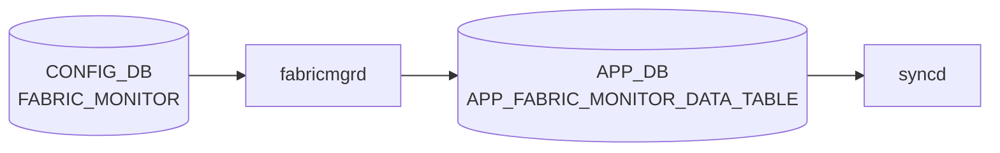

# FABRIC_MONITOR テーブル

## 概要

`FABRIC_MONITOR` テーブルは [VOQ](../../reference/glossary.md#term-voq) chassis のファブリックリンク監視 (`FABRIC_PORT` の自動 isolate/include) 用パラメータを [CONFIG_DB](../../reference/glossary.md#term-config_db) に保持する[^1]。単一エントリ `FABRIC_MONITOR_DATA` を持ち、CRC エラー閾値や検出/復旧ポーリング数を定義する。

<!-- cdb-mermaid -->
### データフロー (自動生成)



!!! note "凡例"
    CONFIG_DB から SAI までの典型経路を `docs/reference/config-db-orch-map.md` から機械生成したミニ図。詳細・例外は本ページ本文と対応表を参照。
<!-- /cdb-mermaid -->

## key 構造

```text
FABRIC_MONITOR|FABRIC_MONITOR_DATA
```

[YANG](../../reference/glossary.md#term-yang) では `container FABRIC_MONITOR_DATA` の直下にスカラー leaf が並ぶ単一インスタンス構造。

## フィールド

| フィールド | 型 | 範囲 | デフォルト | 説明 |
|-----------|----|------|-----------|------|
| `monErrThreshCrcCells` | uint32 | — | 1 | エラー検出閾値となる CRC エラーセル数 |
| `monErrThreshRxCells` | uint32 | — | 61035156 | 受信セル総数の閾値。`monErrThreshRxCells` 中 `monErrThreshCrcCells` を超えるエラーで isolate |
| `monPollThreshIsolation` | uint8 | 1..10 | 1 | 連続して閾値超過と判定された場合に isolate するポーリング回数 |
| `monPollThreshRecovery` | uint8 | 1..10 | 8 | 連続して閾値以下に戻った場合に include するポーリング回数 |
| `monCapacityThreshWarn` | uint8 | 5..100 | 10 | up 状態ファブリックリンクの割合 (%) 警告閾値 |
| `monState` | `mode-status` (enable/disable) | — | disable | 監視機能のオン/オフ |

<!-- defaults -->
## フィールドデフォルト (コード由来)

| フィールド | デフォルト値 | 由来 |
|---|---|---|
| `monErrThreshCrcCells` | `1` | YANG `default 1` (sonic-fabric-monitor.yang); orchagent `ERROR_RATE_CRC_CELLS_CFG=1` (fabricportsorch.cpp:46) と一致 |
| `monErrThreshRxCells` | `61035156` | YANG `default 61035156`; orchagent `ERROR_RATE_RX_CELLS_CFG=61035156` (fabricportsorch.cpp:47) と一致 |
| `monPollThreshIsolation` | `1` | YANG `default 1`; orchagent `ISOLATION_POLLS_CFG=1` (fabricportsorch.h:44) と一致 |
| `monPollThreshRecovery` | `8` | YANG `default 8`; orchagent `RECOVERY_POLLS_CFG=8` (fabricportsorch.h:45) と一致 |
| `monCapacityThreshWarn` | `10` | YANG `default 10`。ただし APPL_DB 未設定時の orchagent フォールバックは `100` (fabricportsorch.cpp:1052) — 後述 Exceptions 参照 |
| `monState` | `disable` | YANG `default disable`; 監視はデフォルト無効 |

> **Evidence**: `sonic-buildimage` `src/sonic-yang-models/yang-models/sonic-fabric-monitor.yang`; `sonic-swss` `orchagent/fabricportsorch.cpp:46-47,1052` / `orchagent/fabricportsorch.h:44-45`
<!-- /defaults -->

<!-- value-behavior -->
## 値依存挙動マトリクス

### `monState` (mode-status: enable/disable)

| 値 | 挙動 |
|----|------|
| `disable` (デフォルト) | 監視停止。不良ファブリックリンクが自動 isolate されない |
| `enable` | fabricmgr が [APPL_DB](../../reference/glossary.md#term-appl_db) に monState=enable を書き込み、fabric 監視を開始（fabricmgr.cpp:70-74） |

### `monPollThreshIsolation` (uint8: 1..10, デフォルト 1)

| 値 | 挙動 |
|----|------|
| `1` | 閾値超過を 1 回検出で即時 isolate（CRC スパイクで誤 isolate のリスク） |
| `2`..`10` | 値が大きいほど連続超過を待つ（安定性重視） |
| 範囲外 (0 or >10) | YANG range 違反で reject |

### `monPollThreshRecovery` (uint8: 1..10, デフォルト 8)

| 値 | 挙動 |
|----|------|
| `1` | 閾値以下に戻った次のポーリングで即時 unisolate（不安定リンクが頻繁に切り替わるリスク） |
| `2`..`10` | 値が大きいほど復帰判定を遅らせる（安定性重視） |
| 範囲外 | YANG range 違反で reject |

### `monCapacityThreshWarn` (uint8: 5..100, デフォルト 10)

| 値 | 挙動 |
|----|------|
| `5`..`100` | up 状態ファブリックリンクが全体の N% を下回ったとき警告ログ |
| 範囲外 | YANG range 違反で reject |

<!-- /value-behavior -->

## 制約

- `monPollThreshIsolation` / `monPollThreshRecovery` は 1..10
- `monCapacityThreshWarn` は 5..100 (%)
- `monState` は `enable` または `disable`

## 購読者

- ファブリックモニタ daemon（プラットフォーム / [orchagent](../../reference/glossary.md#term-orchagent) の FabricPortOrch 拡張）

## 関連 CONFIG_DB / YANG / CLI

- 関連 [CONFIG_DB](../../reference/glossary.md#term-config_db): `FABRIC_PORT`、`CHASSIS_MODULE`
- 関連 [YANG](../../reference/glossary.md#term-yang): `sonic-fabric-monitor`、`sonic-fabric-port`
- 関連 CLI: `config fabric`

<!-- ref-triangle:start -->

## 関連リファレンス

- [YANG](../../reference/glossary.md#term-yang): [`sonic-fabric-monitor`](../yang/sonic-fabric-monitor.md)
- CLI: `config fabric`

<!-- ref-triangle:end -->

## 引用元

[^1]: YANG 定義: `sonic-fabric-monitor.yang`. <https://github.com/sonic-net/sonic-buildimage/blob/9ea932ec2e18f35e58268ec2e4456b1d4afd65cd/src/sonic-yang-models/yang-models/sonic-fabric-monitor.yang>

## 関連ページ
- 関連 [CONFIG_DB](../../reference/glossary.md#term-config_db) ページ: `FABRIC_PORT`（本バッチで追加）

<!-- ops-hint -->
## 運用ヒント

### 典型値

- key: `FABRIC_MONITOR|FABRIC_MONITOR_DATA` (シングルトン)。
- `monState`: 運用開始時は `enable`。閾値はデフォルト (`monErrThreshCrcCells=1`, `monErrThreshRxCells=61035156`) で開始。

### よくある誤設定

- `monPollThreshIsolation` を 1 にすると一時的 CRC スパイクで isolate が頻発する。
- `monState=disable` のまま運用し、不良ファブリックリンクが検出されない。

### 確認コマンド

```bash
sonic-db-cli CONFIG_DB hgetall 'FABRIC_MONITOR|FABRIC_MONITOR_DATA'
show fabric counters
show fabric isolation
```
<!-- /ops-hint -->

<!-- cdb-exceptions -->
## 例外条件・特殊挙動

| consumer | 条件 | 挙動 |
|---|---|---|
| [orchagent](../../reference/glossary.md#term-orchagent) (fabricportsorch) | `FABRIC_MONITOR_DATA` エントリが [APPL_DB](../../reference/glossary.md#term-appl_db) に存在しない | `LOG_INFO: "default values not set"` を出力し、ハードコードされたコンパイル時定数 (`ERROR_RATE_CRC_CELLS_CFG` / `ERROR_RATE_RX_CELLS_CFG`) をデフォルトとして使用（fabricportsorch.cpp:139,447） |
| [orchagent](../../reference/glossary.md#term-orchagent) | `monErrThreshCrcCells` / `monErrThreshRxCells` フィールドが欠落 | 欠落フィールドのみデフォルト定数を維持、取得できたフィールドのみ更新（fabricportsorch.cpp:459-465） |
| orchagent | リンクアップ直後のエラーカウント | `skipCrcErrorsOnLinkupCount` が閾値未満の間はエラーカウントを無視。ブート時誤検知防止（fabricportsorch.cpp:548-561,770-772） |
| orchagent | `monCapacityThreshWarn` — APPL_DB 未設定時 | `updateFabricCapacity()` 内の `int threshold = 100` がフォールバック値として使われる (fabricportsorch.cpp:1052)。YANG default は `10` であり乖離あり。APPL_DB に値が存在すれば YANG 由来の値 (10) が優先される |

> **Evidence**: [sonic-swss](../../reference/glossary.md#term-sonic-swss) `orchagent/fabricportsorch.cpp:139,447-465,548-772,1052`
<!-- /cdb-exceptions -->


<!-- runtime-trace -->
## 実コンテナ動作トレース

### 段階 1 — Consumer 登録

`fabricmgrd` → `FabricPortsOrch` (APPL_DB 経由) が CONFIG_DB の `FABRIC_MONITOR` テーブルを購読する。

`FABRIC_MONITOR` は Chassis (VoQ) 構成の supervisorモジュールで使用。通常の ToR では意味なし。

### 段階 2 — CFG→APPL 翻訳

`APP_FABRIC_MONITOR_DATA_TABLE` に書き込み

### 段階 3 — APPL→SAI

fabric 固有 SAI (fabric link monitor threshold)

### 段階 4 — タイミングと副作用

**適用タイミング**: CONFIG_DB 変化を `fabricmgrd` が検知後 APPL_DB に書き込み。`FabricPortsOrch` が SAI attribute を更新。Chassis/VoQ 構成でのみ有効。

**副作用**: fabric link error threshold の変更は fabric isolate/recover の trigger 条件に影響。
<!-- /runtime-trace -->

<!-- entry-points -->
## 書き込み入り口 (Direction A)

対象テーブル: `FABRIC_MONITOR`

### CLI
- `config fabric monitoring error-threshold <val>`
- `config fabric monitoring poll-interval <secs>`
  - ソース: `sonic-utilities/config/main.py (fabric グループ)`

### minigraph / sonic-cfggen
- なし

### REST / gNMI (sonic-mgmt-common)
- なし (対応 OpenConfig/SONiC YANG transformer なし)

### db_migrator
- なし

### ビルド時デフォルト (init_cfg / j2 テンプレート)
- なし

### ハードコードデフォルト
- なし

### ランタイム注入 (デーモン自動書き込み)
- なし
<!-- /entry-points -->

<!-- glossary-links-injected: e1f3b8a6462d -->
