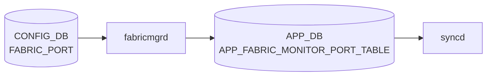

# FABRIC_PORT テーブル

## 概要

`FABRIC_PORT` テーブルは [VOQ](../../reference/glossary.md#term-voq) chassis におけるラインカード間ファブリックリンクの設定を [CONFIG_DB](../../reference/glossary.md#term-config_db) に保持する[^1]。`portsyncd` / `orchagent` がファブリックポートの isolate / unisolate 状態を [SAI](../../reference/glossary.md#term-sai) 側に反映する。

<!-- cdb-mermaid -->
### データフロー (自動生成)



!!! note "凡例"
    CONFIG_DB から SAI までの典型経路を `docs/reference/config-db-orch-map.md` から機械生成したミニ図。詳細・例外は本ページ本文と対応表を参照。
<!-- /cdb-mermaid -->

## key 構造

```text
FABRIC_PORT|<name>
```

| キー | 型 | 説明 |
|------|----|------|
| `name` | string (1..128) | ファブリックポート名 |

## フィールド

| フィールド | 型 | デフォルト | 説明 |
|-----------|----|-----------|------|
| `isolateStatus` | `boolean_type` | False | ポートのアイソレーション状態 |
| `alias` | string (1..128) | — | ファブリックポートのエイリアス |
| `lanes` | string (1..128) | — (mandatory) | レーン番号文字列 |
| `forceUnisolateStatus` | uint32 | 0 | 強制 unisolate のステータス値 |

## 制約

- `lanes` は mandatory
- `isolateStatus` の値は `sonic-types:boolean_type`（`True`/`False` 文字列）

## 購読者

- `orchagent` の FabricPortOrch / ファブリック関連ロジック
- `fabricmgrd` 系 daemon（プラットフォーム実装による）

## 関連 CONFIG_DB / YANG / CLI

- 関連 [CONFIG_DB](../../reference/glossary.md#term-config_db): `FABRIC_MONITOR`、`SYSTEM_PORT`、`CHASSIS_MODULE`
- 関連 [YANG](../../reference/glossary.md#term-yang): `sonic-fabric-port`、`sonic-fabric-monitor`
- 関連 CLI: `config fabric`、`show fabric`

<!-- ref-triangle:start -->

## 関連リファレンス

- [YANG](../../reference/glossary.md#term-yang): [`sonic-fabric-port`](../yang/sonic-fabric-port.md)
- CLI: `config fabric`

<!-- ref-triangle:end -->

## 引用元

[^1]: [YANG](../../reference/glossary.md#term-yang) 定義: `sonic-fabric-port.yang`. <https://github.com/sonic-net/sonic-buildimage/blob/9ea932ec2e18f35e58268ec2e4456b1d4afd65cd/src/sonic-yang-models/yang-models/sonic-fabric-port.yang>

## 関連ページ
- 関連 [CONFIG_DB](../../reference/glossary.md#term-config_db) ページ: `FABRIC_MONITOR`（本バッチで追加）

<!-- ops-hint -->
## 運用ヒント

### 典型値

- key 形式: `FABRIC_PORT|<Fabric>`。
- `admin_status`: `up`、`isolate_status`: `False`、`lanes`: プラットフォーム既定値。

### よくある誤設定

- isolate_status=True のままにすると [VOQ](../../reference/glossary.md#term-voq) chassis 内で fabric リンクが trunk から外れたまま戻らない。

### 確認コマンド

```bash
sonic-db-cli CONFIG_DB keys 'FABRIC_PORT|*'
show fabric counters port
```
<!-- /ops-hint -->

<!-- cdb-exceptions -->
## 例外条件・特殊挙動

| consumer | 条件 | 挙動 |
|---|---|---|
| orchagent | `SAI_SWITCH_ATTR_NUMBER_OF_FABRIC_PORTS` 取得失敗 | `FABRIC_PORT_ERROR (0)` を返し初期化失敗（fabricportsorch.cpp:179） |
| orchagent | `SAI_SWITCH_ATTR_FABRIC_PORT_LIST` 取得失敗 | `throw runtime_error("FabricPortsOrch get port list failure")` を送出、orchagent 異常終了（fabricportsorch.cpp:196） |
| orchagent | ポートのレーン番号取得失敗 | `throw runtime_error("FabricPortsOrch get port lane failure")` を送出（fabricportsorch.cpp:212） |
| orchagent | キュー数・キューリスト取得失敗 | `throw runtime_error(...)` を送出（fabricportsorch.cpp:280,296） |
| orchagent | remote fabric port ID / remote port index 取得失敗 | `throw runtime_error(...)` を送出（fabricportsorch.cpp:384,396） |
| orchagent | CRC エラー率比較時に `rxCells = 0` | 整数乗算比較でゼロ除算を回避し、エラーなしと判断（fabricportsorch.cpp:534-536） |

> **Evidence**: sonic-swss `orchagent/fabricportsorch.cpp:179-396,534-536`
<!-- /cdb-exceptions -->

<!-- glossary-links-injected: e6a80f23a9fa -->
