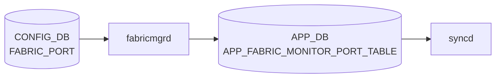

# FABRIC_PORT テーブル

## 概要

`FABRIC_PORT` テーブルは [VOQ](../../reference/glossary.md#term-voq) chassis におけるラインカード間ファブリックリンクの設定を [CONFIG_DB](../../reference/glossary.md#term-config_db) に保持する[^1]。`portsyncd` / `orchagent` がファブリックポートの isolate / unisolate 状態を [SAI](../../reference/glossary.md#term-sai) 側に反映する。

<!-- cdb-mermaid -->
### データフロー (自動生成)



!!! note "凡例"
    CONFIG_DB から SAI までの典型経路を `docs/reference/config-db-orch-map.md` から機械生成したミニ図。詳細・例外は本ページ本文と対応表を参照。
<!-- /cdb-mermaid -->

## key 構造

```text
FABRIC_PORT|<name>
```

| キー | 型 | 説明 |
|------|----|------|
| `name` | string (1..128) | ファブリックポート名 |

## フィールド

| フィールド | 型 | デフォルト | 説明 |
|-----------|----|-----------|------|
| `isolateStatus` | `boolean_type` | False | ポートのアイソレーション状態 |
| `alias` | string (1..128) | — | ファブリックポートのエイリアス |
| `lanes` | string (1..128) | — (mandatory) | レーン番号文字列 |
| `forceUnisolateStatus` | uint32 | 0 | 強制 unisolate のステータス値 |

<!-- value-behavior -->
## 値依存挙動マトリクス

### `isolateStatus` (boolean_type: True/False, デフォルト False)

| 値 | 挙動 |
|----|------|
| `False` (デフォルト) | ファブリックポートが通常接続状態。FABRIC_MONITOR が自動制御 |
| `True` | fabricmgr が [APPL_DB](../../reference/glossary.md#term-appl_db) に isolateStatus=True を書き込み、[syncd](../../reference/glossary.md#term-syncd) 経由で [SAI](../../reference/glossary.md#term-sai) がポートを fabric trunk から除外（fabricmgr.cpp:86-89） |

### `forceUnisolateStatus` (uint32, デフォルト 0)

| 値 | 挙動 |
|----|------|
| `0` (デフォルト) | 通常の FABRIC_MONITOR 制御に委ねる |
| 0 以外 | FABRIC_MONITOR による自動 isolate を上書きして強制 unisolate（緊急用途） |

### `lanes` (string, mandatory)

| 値 | 挙動 |
|----|------|
| プラットフォーム固有のレーン文字列 | [SAI](../../reference/glossary.md#term-sai) 側でポートを特定するために使用 |
| 未設定 | YANG mandatory 違反で reject |

> 明示的な enum 制約なし（isolateStatus は boolean_type = "True"/"False" 文字列）。isolateStatus=True のまま FABRIC_MONITOR を disable にすると自動復帰がかからない。

<!-- /value-behavior -->

<!-- defaults -->
## コード由来の暗黙デフォルト

### `isolateStatus` — 書き込み時 vs 実行時乖離

CONFIG_DB の `isolateStatus=False` を設定しても、`FabricPortsOrch` 内の `autoIsolated` フラグが 1 の場合は SAI 上の isolate 状態が維持される。実効 isolate 状態は `cfgIsolated OR autoIsolated OR permIsolated` の論理 OR で決まり、`CONFIG_DB` の値だけでは SAI 状態を保証できない（`fabricportsorch.cpp` `updateFabricDebugCounters`）。

`monState=disable` の場合、`isolateStatus` の変更は CONFIG_DB / APPL_DB には書かれるが、`FabricPortsOrch` の `doFabricPortTask` が early return するため SAI への反映がスキップされる（経路依存乖離）。monState を後から enable に変更しても pending 分は再適用されない。

### `isolateStatus` — silent drop + fallback

`doFabricPortTask` は個別フィールドのみの更新（partial update）を受け取ることがある。その際 `isolateStatus=""` の場合 APPL_DB から `hget` で再取得する。`alias` または `lanes` も欠如している場合は処理を silent skip する（`fabricportsorch.cpp:1480-1484`）。

### `isolateStatus` — 大文字小文字制約

FabricPortsOrch は `applResult == "True"` で比較する。YANG の `boolean_type` は `"True"`/`"False"` を期待する。`"true"` や `"TRUE"` は認識されず cfgIsolated=0 相当になる（ケース制約）。

### `alias` — 暗黙 fallback（name と同値）

`fabric_port_config.ini` に `alias` 列が存在しない場合、`sonic-config-engine/portconfig.py` の `get_fabric_port_config()` は `data.setdefault('alias', name)` でポート名（例: `Fabric0`）を alias のデフォルトとして設定する（`portconfig.py:167`）。CONFIG_DB に alias が存在しない場合の YANG optional 扱いと異なり、init_cfg 経由では常に name と同値が入る。

### `forceUnisolateStatus` — エッジトリガ（冪等ではない）

`forceUnisolateStatus` は単なるフラグではなくカウンタ。CLI `unisolate -f` は現在値 +1 を書き込む（`fabric.py:108-111`）。FabricPortsOrch は STATE_DB の `FORCE_UN_ISOLATE` と比較し、値が異なる場合のみ force unisolate を実行する（`fabricportsorch.cpp:1517-1542`）。同じ値を 2 回書いても 2 回目は効果なし。

### `forceUnisolateStatus` — 永続 isolate との関係（複合必須制約）

force unisolate 後、STATE_DB の `POLL_WITH_NO_ERRORS` が 8（`m_defaultPollWithNoErrors`）、`POLL_WITH_NOFEC_ERRORS` が 8（`m_defaultPollWithNoFecErrors`）にリセットされる。これらのデフォルト値はハードコードされており（`fabricportsorch.h:63,65`）、FABRIC_MONITOR の設定（`monPollThreshRecovery`）と無関係にリセットされる。

### `lanes` — SAI lane ID への直接変換

`doFabricPortTask` 内では `isolateFabricLink(to_uint<uint8_t>(lanes), ...)` のように lanes 文字列を uint8_t に変換して SAI lane ID として使用する（`fabricportsorch.cpp:1541`）。lanes が複数のレーン番号のカンマ区切り文字列の場合、uint8_t 変換が失敗し例外となる可能性がある（プラットフォーム実装依存）。

### ハードコード固定値（モニタリングタイマー・閾値）

CONFIG_DB から設定不可なハードコード値（FABRIC_MONITOR テーブルで上書き可能なものを除く）:

| 定数 | 値 | 説明 |
|-----|-----|------|
| `FABRIC_POLLING_INTERVAL_DEFAULT` | 30 秒 | ポート状態ポーリング間隔 |
| `FABRIC_DEBUG_POLLING_INTERVAL_DEFAULT` | 12 秒 | エラーカウンタ・レート計算間隔 |
| `MAX_SKIP_CRCERR_ON_LNKUP_POLLS` | 20 ポーリング | リンクアップ直後の CRC エラースキップ回数 |
| `MAX_SKIP_FECERR_ON_LNKUP_POLLS` | 20 ポーリング | リンクアップ直後の FEC エラースキップ回数 |
| `FABRIC_LINK_RATE` | 44316 | capacity 計算単位（プラットフォーム固定） |

> **Evidence**: `sonic-swss` `orchagent/fabricportsorch.cpp:21-48`、`orchagent/fabricportsorch.h:62-68`、`config-engine/portconfig.py:167`、`sonic-utilities/config/fabric.py:65,108-111`

<!-- /defaults -->

## 制約

- `lanes` は mandatory
- `isolateStatus` の値は `sonic-types:boolean_type`（`True`/`False` 文字列）

## 購読者

- `orchagent` の FabricPortOrch / ファブリック関連ロジック
- `fabricmgrd` 系 daemon（プラットフォーム実装による）

## 関連 CONFIG_DB / YANG / CLI

- 関連 [CONFIG_DB](../../reference/glossary.md#term-config_db): `FABRIC_MONITOR`、`SYSTEM_PORT`、`CHASSIS_MODULE`
- 関連 [YANG](../../reference/glossary.md#term-yang): `sonic-fabric-port`、`sonic-fabric-monitor`
- 関連 CLI: `config fabric`、`show fabric`

<!-- ordering -->
## 書込み順依存 (Phase B)

`FABRIC_PORT` テーブルの変更が SAI に反映されるまでには、CONFIG_DB → fabricmgrd → APPL_DB → FabricPortsOrch → SAI という多段パイプラインを通過し、各段に順序依存が存在する。

### 検出された順序依存

| # | 依存関係 | 方向 | 緩和策 |
|---|----------|------|--------|
| 1 | SAI `getFabricPortList()` 完了 → ポート状態更新・デバッグカウンタ収集 | **強制先行** | `m_getFabricPortListDone` フラグが false の間、`updateFabricPortState()` / `updateFabricDebugCounters()` は全てスキップ（`fabricportsorch.cpp:1568-1576`, `1594-1598`） |
| 2 | `APPL_DB APP_FABRIC_MONITOR_DATA` の `monState=enable` → `doFabricPortTask()` の実行 | **強制先行（機能 ON/OFF）** | `checkFabricPortMonState()` が false を返すと `doFabricPortTask()` が early return し、CONFIG_DB の `isolateStatus` 変更は SAI に反映されない（`fabricportsorch.cpp:1396-1399`） |
| 3 | `STATE_DB FABRIC_PORT_TABLE|PORT<lane>` エントリ存在 → `forceUnisolateStatus` 差分比較 | 条件付き先行 | STATE_DB エントリ不在の場合は `FORCE_UN_ISOLATE` を 0 扱いで比較するため、`forceUnisolateStatus=0` の config では force unisolate がスキップされる（`fabricportsorch.cpp:1499-1516`） |
| 4 | `alias` + `lanes` + `isolateStatus` の 3 フィールド揃い → isolate 処理実行 | **強制先行（データ完全性）** | いずれか 1 つでも空の場合は APPL_DB から `hget` で補完を試み、それでも欠落なら `m_toSync` から erase して silent drop（`fabricportsorch.cpp:1436-1484`） |
| 5 | CONFIG_DB 変更 → fabricmgrd が APPL_DB `APP_FABRIC_MONITOR_PORT_TABLE` に書き込み → `doFabricPortTask()` 実行 | 非同期パイプライン | fabricmgrd のポーリング間隔分の遅延が発生する。CONFIG_DB を変更しても即座に SAI 状態は変わらない |

### 主要な制約詳細

**SAI 初期化完了待ち (依存 #1)**: `getFabricPortList()` はコンストラクタで 1 回呼ばれるが、SAI `get_switch_attribute(SAI_SWITCH_ATTR_NUMBER_OF_FABRIC_PORTS)` が失敗した場合は `m_getFabricPortListDone = false` のままとなる。その後のポーリングタイマー (`FABRIC_POLL`) が発火するたびに再試行され、成功時点で `m_getFabricPortListDone = true` となりポート状態更新が開始される。それまでの間、STATE_DB への書き込みは一切行われない（evidence: `fabricportsorch.cpp:1562-1576`）。

**monState ゲート (依存 #2)**: `doFabricPortTask()` の冒頭で `checkFabricPortMonState()` を呼び、`APPL_DB FABRIC_MONITOR_DATA|FABRIC_MONITOR_DATA.monState == "enable"` でなければ即座に return する。このため、CONFIG_DB の `FABRIC_PORT` エントリがいくら更新されても、`FABRIC_MONITOR` の `monState` が `enable` になるまで SAI への isolate/unisolate 操作は実行されない。`monState` を後から `enable` に変更しても、pending 中だった CONFIG_DB 変更が自動再適用される保証はない（evidence: `fabricportsorch.cpp:1394-1399`）。

**3 フィールド完全性チェック (依存 #4)**: partial update（一部フィールドのみの UPDATE）を受け取った場合、欠落フィールドは `m_applTable->hget()` で APPL_DB から補完される。APPL_DB にもそのフィールドが存在しない場合は `SWSS_LOG_INFO("hget failed")` を出してから `m_toSync.erase(it)` で消去される。このため、`alias` / `lanes` / `isolateStatus` のうち 1 つでも APPL_DB 未登録の状態で CONFIG_DB を SET しても、**一切の SAI 操作が実行されず、かつエラーログも INFO レベルにとどまる**（evidence: `fabricportsorch.cpp:1436-1484`）。

<!-- /ordering -->

<!-- failure -->
## 失敗挙動 (Phase D)

<!-- evidence: meta/_intermediate/cdb-flow/fabric-port-failure.md -->
<!-- source: sonic-swss/orchagent/fabricportsorch.cpp -->

### 失敗パス一覧

| # | 失敗トリガー | 挙動 | 再試行 | SAI 影響 |
|---|------------|------|--------|---------|
| 1a | `SAI_SWITCH_ATTR_NUMBER_OF_FABRIC_PORTS` 取得失敗 | `FABRIC_PORT_ERROR (0)` を返す、`m_getFabricPortListDone=false` のまま | 30秒ポーリングで自動再試行 | STATE_DB 書き込みなし・全ポーリングスキップ |
| 1b | `SAI_SWITCH_ATTR_FABRIC_PORT_LIST` 取得失敗 | `throw runtime_error("FabricPortsOrch get port list failure")` → orchagent 異常終了 | なし（プロセス再起動） | なし |
| 1c | ポートレーン番号 (`SAI_PORT_ATTR_HW_LANE_LIST`) 取得失敗 | `throw runtime_error("FabricPortsOrch get port lane failure")` → orchagent 異常終了 | なし（プロセス再起動） | なし |
| 2 | `SAI_PORT_ATTR_FABRIC_ISOLATE` の `set_port_attribute` 失敗 | `SWSS_LOG_ERROR` のみ出力、エラー吸収 | なし | SAI isolate 状態変更されず、STATE_DB は更新済みのまま乖離 |
| 3 | `alias` / `lanes` / `isolateStatus` 欠如 (APPL_DB 補完も失敗) | `m_toSync.erase(it)` で silent drop | なし | SAI 変更なし |
| 4 | `SAI_PORT_ATTR_FABRIC_ATTACHED` 取得失敗 | `updateFabricPortState()` が中断 (残ポートもスキップ) | 次ポーリング周期 (30秒) | STATE_DB 更新なし（古い状態が残存） |
| 5 | 接続先スイッチ / ポートインデックス取得失敗 | `throw runtime_error(...)` → orchagent 異常終了 | なし（プロセス再起動） | なし |
| 6 | キュー数 / キューリスト取得失敗 | `throw runtime_error(...)` → orchagent 異常終了 | なし（プロセス再起動） | なし |

### 詳細

#### 1a. `SAI_SWITCH_ATTR_NUMBER_OF_FABRIC_PORTS` 取得失敗（SAI capability 欠如）

`getFabricPortList()` はコンストラクタ起動時と、`FABRIC_POLL` タイマー発火時に `m_getFabricPortListDone=false` の場合に呼ばれる（`fabricportsorch.cpp:1568-1570`）。

`sai_switch_api->get_switch_attribute(SAI_SWITCH_ATTR_NUMBER_OF_FABRIC_PORTS)` が失敗した場合、`handleSaiGetStatus()` を呼び出す。`task_success` 以外が返れば `FABRIC_PORT_ERROR (0)` を返して関数を終了し、`m_getFabricPortListDone` は `false` のまま維持される（`fabricportsorch.cpp:172-180`）。

この状態では `updateFabricPortState()` / `updateFabricDebugCounters()` が冒頭の `if (!m_getFabricPortListDone) return;` でスキップされ続けるため、STATE_DB へのファブリックポート状態書き込みと FlexCounter 登録が一切行われない。30 秒ポーリング (`FABRIC_POLL`) のたびに再試行されるが、SAI が capability を返せる状態になるまでこの状態が継続する。

#### 1b / 1c. `FABRIC_PORT_LIST` / レーン番号取得失敗（orchagent 異常終了）

ポート数取得後のリスト取得（`SAI_SWITCH_ATTR_FABRIC_PORT_LIST`）またはレーン番号取得（`SAI_PORT_ATTR_HW_LANE_LIST`）が失敗した場合は `throw runtime_error(...)` を送出し、orchagent プロセスが異常終了する（`fabricportsorch.cpp:196, 212`）。自動リトライ機能はなく、プロセスマネージャ（supervisord）による再起動に依存する。

#### 2. `isolateFabricLink()` — SAI isolation 失敗（STATE_DB / SAI 乖離）

`isolateFabricLink()` は `SAI_PORT_ATTR_FABRIC_ISOLATE` 属性を `set_port_attribute` で設定する。SAI が失敗した場合は `SWSS_LOG_ERROR("Failed to set admin status")` のみを出力して続行し、`task_need_retry` を返さない（`fabricportsorch.cpp:997-1000`）。

一方、呼び出し元の `doFabricPortTask()` は isolate / unisolate 処理の前後で STATE_DB の `ISOLATED` / `CONFIG_ISOLATED` 等を更新する（`fabricportsorch.cpp:1528-1536`）。SAI 呼び出しが失敗しても STATE_DB 更新は実行されるため、**STATE_DB では unisolate 状態を示しているにも関わらず、SAI 側ではポートが isolate されたままとなる乖離**が発生する。この乖離は次回ポーリング (`FABRIC_DEBUG_POLL`) で上書きされるまで解消されない。

!!! warning "SAI / STATE_DB 乖離"
    `SAI_PORT_ATTR_FABRIC_ISOLATE` の設定失敗はエラーログのみで吸収され、リトライも例外送出もない。STATE_DB は期待値に更新されたまま SAI 側の実際の isolate 状態と乖離する。トラフィック影響が生じても上位レイヤへの通知手段がないため、`show fabric counters port` での定期確認が必要。

#### 3. データ不完全による silent drop

`doFabricPortTask()` の SET 処理において、CONFIG_DB からのフィールドが不完全で APPL_DB からの `hget` 補完も失敗した場合、`m_toSync.erase(it)` でエントリを消去し次のエントリに移る（`fabricportsorch.cpp:1480-1484`）。このとき出力されるログは `SWSS_LOG_INFO` レベルのみであり、デフォルトのログ設定では表示されない。SAI への反映が行われなかったことを知る手段がない。

#### 4. `updateFabricPortState()` — ポート状態取得失敗

`SAI_PORT_ATTR_FABRIC_ATTACHED` の取得失敗時、`handleSaiGetStatus()` が `task_success` 以外を返す場合は `updateFabricPortState()` 全体から即座に `return` する（`fabricportsorch.cpp:360-364`）。これにより失敗したポート以降のポートも含めて STATE_DB 更新が行われず、古い状態（前回ポーリング時の値）が残存する。次の `FABRIC_POLL` タイマー（30 秒）で再試行される。

> **Evidence**: `sonic-swss` `orchagent/fabricportsorch.cpp:159-228,277-297,354-414,984-1003,1394-1547`

<!-- /failure -->

<!-- cross-refs -->
## 暗黙参照テーブル (Phase C)

`FABRIC_PORT` テーブルの処理において `FabricPortsOrch` が暗黙的に参照する他テーブル・外部情報源を示す。YANG 定義に leafref は存在しないが、実装レベルで以下の依存がある。

| 参照元 | 参照先テーブル / 情報源 | 参照フィールド | 意味 | 参照箇所 |
|--------|----------------------|--------------|------|---------|
| `doFabricPortTask()` ゲート | `APPL_DB FABRIC_MONITOR_TABLE` | `monState` | `"enable"` でなければ isolate/unisolate 操作を全スキップ | `fabricportsorch.cpp:135-157,1394-1399` |
| `updateFabricDebugCounters()` | `APPL_DB FABRIC_MONITOR_TABLE` | `monErrThreshCrcCells`, `monErrThreshRxCells`, `monPollThreshIsolation`, `monPollThreshRecovery` | 自動 isolate/unisolate の閾値。欠落時はハードコードデフォルト使用 | `fabricportsorch.cpp:444-483` |
| `doFabricPortTask()` force unisolate | `STATE_DB FABRIC_PORT_TABLE` | `FORCE_UN_ISOLATE` | `forceUnisolateStatus` との差分比較。エントリ不在時は 0 扱い | `fabricportsorch.cpp:1496-1542` |
| `updateFabricDebugCounters()` | `COUNTERS_DB COUNTERS_TABLE` | `SAI_PORT_STAT_IF_IN_ERRORS`, `SAI_PORT_STAT_IF_IN_FABRIC_DATA_UNITS`, `SAI_PORT_STAT_IF_IN_FEC_NOT_CORRECTABLE_FRAMES` | CRC / FEC エラー率計算。データ欠損時はエラーなし扱い | `fabricportsorch.cpp:500-520` |
| `getFabricPortList()` | SAI `SAI_SWITCH_ATTR_FABRIC_PORT_LIST` | — | m_fabricLanePortMap（lane→OID）を構築。失敗すると全ポーリング処理がスキップ | `fabricportsorch.cpp:159-228` |
| コンストラクタ | `gMySwitchType` (`DEVICE_METADATA.switch_type`) | `"voq"` / `"fabric"` | スイッチ種別に応じて switch drop counter 収集の有無を決定 | `fabricportsorch.cpp:104-110` |

### 解決タイミング

- `monState` は `doFabricPortTask()` 呼び出しのたびに毎回評価される（キャッシュなし）。`FABRIC_MONITOR.monState` を `disable` → `enable` に変更しても、その間に届いた `FABRIC_PORT` の CONFIG_DB 変更は `m_toSync` から erase 済みのため**自動再適用されない**。
- `FORCE_UN_ISOLATE` は STATE_DB エントリが存在しない場合、デフォルト 0 として比較される。`forceUnisolateStatus=0` の SET は差分なし（0==0）となり force unisolate が実行されない。
- SAI `getFabricPortList()` 失敗時は 30 秒ポーリングで再試行される。成功まで COUNTERS_DB への FlexCounter 登録と STATE_DB への状態書き込みは行われない。

> **Evidence**: `sonic-swss` `orchagent/fabricportsorch.cpp:80-228,420-520,1394-1542`、`cfgmgr/fabricmgr.cpp:14-124`、`sonic-swss-common/common/schema.h` (`APP_FABRIC_PORT_TABLE_NAME`, `COUNTERS_FABRIC_PORT_NAME_MAP`)、`orchdaemon.cpp:26-27` (`APP_FABRIC_MONITOR_PORT_TABLE_NAME`, `APP_FABRIC_MONITOR_DATA_TABLE_NAME`)
<!-- /cross-refs -->

<!-- ref-triangle:start -->

## 関連リファレンス

- [YANG](../../reference/glossary.md#term-yang): [`sonic-fabric-port`](../yang/sonic-fabric-port.md)
- CLI: `config fabric`

<!-- ref-triangle:end -->

## 引用元

[^1]: [YANG](../../reference/glossary.md#term-yang) 定義: `sonic-fabric-port.yang`. <https://github.com/sonic-net/sonic-buildimage/blob/9ea932ec2e18f35e58268ec2e4456b1d4afd65cd/src/sonic-yang-models/yang-models/sonic-fabric-port.yang>

## 関連ページ
- 関連 [CONFIG_DB](../../reference/glossary.md#term-config_db) ページ: `FABRIC_MONITOR`（本バッチで追加）

<!-- ops-hint -->
## 運用ヒント

### 典型値

- key 形式: `FABRIC_PORT|<Fabric>`。
- `admin_status`: `up`、`isolate_status`: `False`、`lanes`: プラットフォーム既定値。

### よくある誤設定

- isolate_status=True のままにすると [VOQ](../../reference/glossary.md#term-voq) chassis 内で fabric リンクが trunk から外れたまま戻らない。

### 確認コマンド

```bash
sonic-db-cli CONFIG_DB keys 'FABRIC_PORT|*'
show fabric counters port
```
<!-- /ops-hint -->

<!-- cdb-exceptions -->
## 例外条件・特殊挙動

| consumer | 条件 | 挙動 |
|---|---|---|
| [orchagent](../../reference/glossary.md#term-orchagent) | `SAI_SWITCH_ATTR_NUMBER_OF_FABRIC_PORTS` 取得失敗 | `FABRIC_PORT_ERROR (0)` を返し初期化失敗（fabricportsorch.cpp:179） |
| [orchagent](../../reference/glossary.md#term-orchagent) | `SAI_SWITCH_ATTR_FABRIC_PORT_LIST` 取得失敗 | `throw runtime_error("FabricPortsOrch get port list failure")` を送出、[orchagent](../../reference/glossary.md#term-orchagent) 異常終了（fabricportsorch.cpp:196） |
| orchagent | ポートのレーン番号取得失敗 | `throw runtime_error("FabricPortsOrch get port lane failure")` を送出（fabricportsorch.cpp:212） |
| orchagent | キュー数・キューリスト取得失敗 | `throw runtime_error(...)` を送出（fabricportsorch.cpp:280,296） |
| orchagent | remote fabric port ID / remote port index 取得失敗 | `throw runtime_error(...)` を送出（fabricportsorch.cpp:384,396） |
| orchagent | CRC エラー率比較時に `rxCells = 0` | 整数乗算比較でゼロ除算を回避し、エラーなしと判断（fabricportsorch.cpp:534-536） |

> **Evidence**: [sonic-swss](../../reference/glossary.md#term-sonic-swss) `orchagent/fabricportsorch.cpp:179-396,534-536`
<!-- /cdb-exceptions -->


<!-- runtime-trace -->
## 実コンテナ動作トレース

### 段階 1 — Consumer 登録

`fabricmgrd` → `FabricPortsOrch` (APPL_DB 経由) が CONFIG_DB の `FABRIC_PORT` テーブルを購読する。

`FABRIC_PORT` は Chassis の fabric ASIC ポートを管理。通常の ToR では使用しない。

### 段階 2 — CFG→APPL 翻訳

`APP_FABRIC_MONITOR_PORT_TABLE` に書き込み

### 段階 3 — APPL→SAI

fabric 固有 SAI (fabric port enable/isolate)

### 段階 4 — タイミングと副作用

**適用タイミング**: CONFIG_DB 変化を `fabricmgrd` が検知後 APPL_DB に書き込み。`FabricPortsOrch` が SAI fabric port attribute を更新。

**副作用**: `admin_status` 変更は fabric link の up/down に直結。isolate 設定は traffic の再ルーティングを引き起こす。
<!-- /runtime-trace -->

<!-- entry-points -->
## 書き込み入り口 (Direction A)

対象テーブル: `FABRIC_PORT`

### CLI
- `config fabric port status enable/disable <port>`
  - ソース: `sonic-utilities/config/main.py (fabric グループ)`

### minigraph / sonic-cfggen
- なし

### REST / gNMI (sonic-mgmt-common)
- なし (対応 OpenConfig/SONiC YANG transformer なし)

### db_migrator
- なし

### ビルド時デフォルト (init_cfg / j2 テンプレート)
- プラットフォーム `platform.json` から fabric ポート一覧が `sonic-cfggen` 経由で生成

### ハードコードデフォルト
- なし

### ランタイム注入 (デーモン自動書き込み)
- なし
<!-- /entry-points -->

<!-- glossary-links-injected: 5db0229b5faf -->
