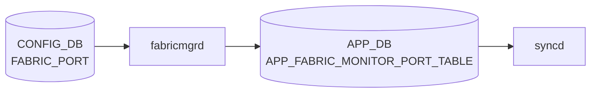

# FABRIC_PORT テーブル

## 概要

`FABRIC_PORT` テーブルは [VOQ](../../reference/glossary.md#term-voq) chassis におけるラインカード間ファブリックリンクの設定を [CONFIG_DB](../../reference/glossary.md#term-config_db) に保持する[^1]。`portsyncd` / `orchagent` がファブリックポートの isolate / unisolate 状態を [SAI](../../reference/glossary.md#term-sai) 側に反映する。

<!-- cdb-mermaid -->
### データフロー (自動生成)



!!! note "凡例"
    CONFIG_DB から SAI までの典型経路を `docs/reference/config-db-orch-map.md` から機械生成したミニ図。詳細・例外は本ページ本文と対応表を参照。
<!-- /cdb-mermaid -->

## key 構造

```text
FABRIC_PORT|<name>
```

| キー | 型 | 説明 |
|------|----|------|
| `name` | string (1..128) | ファブリックポート名 |

## フィールド

| フィールド | 型 | デフォルト | 説明 |
|-----------|----|-----------|------|
| `isolateStatus` | `boolean_type` | False | ポートのアイソレーション状態 |
| `alias` | string (1..128) | — | ファブリックポートのエイリアス |
| `lanes` | string (1..128) | — (mandatory) | レーン番号文字列 |
| `forceUnisolateStatus` | uint32 | 0 | 強制 unisolate のステータス値 |

<!-- value-behavior -->
## 値依存挙動マトリクス

### `isolateStatus` (boolean_type: True/False, デフォルト False)

| 値 | 挙動 |
|----|------|
| `False` (デフォルト) | ファブリックポートが通常接続状態。FABRIC_MONITOR が自動制御 |
| `True` | fabricmgr が [APPL_DB](../../reference/glossary.md#term-appl_db) に isolateStatus=True を書き込み、[syncd](../../reference/glossary.md#term-syncd) 経由で [SAI](../../reference/glossary.md#term-sai) がポートを fabric trunk から除外（fabricmgr.cpp:86-89） |

### `forceUnisolateStatus` (uint32, デフォルト 0)

| 値 | 挙動 |
|----|------|
| `0` (デフォルト) | 通常の FABRIC_MONITOR 制御に委ねる |
| 0 以外 | FABRIC_MONITOR による自動 isolate を上書きして強制 unisolate（緊急用途） |

### `lanes` (string, mandatory)

| 値 | 挙動 |
|----|------|
| プラットフォーム固有のレーン文字列 | [SAI](../../reference/glossary.md#term-sai) 側でポートを特定するために使用 |
| 未設定 | YANG mandatory 違反で reject |

> 明示的な enum 制約なし（isolateStatus は boolean_type = "True"/"False" 文字列）。isolateStatus=True のまま FABRIC_MONITOR を disable にすると自動復帰がかからない。

<!-- /value-behavior -->

<!-- defaults -->
## コード由来の暗黙デフォルト

### `isolateStatus` — 書き込み時 vs 実行時乖離

CONFIG_DB の `isolateStatus=False` を設定しても、`FabricPortsOrch` 内の `autoIsolated` フラグが 1 の場合は SAI 上の isolate 状態が維持される。実効 isolate 状態は `cfgIsolated OR autoIsolated OR permIsolated` の論理 OR で決まり、`CONFIG_DB` の値だけでは SAI 状態を保証できない（`fabricportsorch.cpp` `updateFabricDebugCounters`）。

`monState=disable` の場合、`isolateStatus` の変更は CONFIG_DB / [APPL_DB](../../reference/glossary.md#term-appl_db) には書かれるが、`FabricPortsOrch` の `doFabricPortTask` が early return するため SAI への反映がスキップされる（経路依存乖離）。monState を後から enable に変更しても pending 分は再適用されない。

### `isolateStatus` — silent drop + fallback

`doFabricPortTask` は個別フィールドのみの更新（partial update）を受け取ることがある。その際 `isolateStatus=""` の場合 [APPL_DB](../../reference/glossary.md#term-appl_db) から `hget` で再取得する。`alias` または `lanes` も欠如している場合は処理を silent skip する（`fabricportsorch.cpp:1480-1484`）。

### `isolateStatus` — 大文字小文字制約

FabricPortsOrch は `applResult == "True"` で比較する。YANG の `boolean_type` は `"True"`/`"False"` を期待する。`"true"` や `"TRUE"` は認識されず cfgIsolated=0 相当になる（ケース制約）。

### `alias` — 暗黙 fallback（name と同値）

`fabric_port_config.ini` に `alias` 列が存在しない場合、`sonic-config-engine/portconfig.py` の `get_fabric_port_config()` は `data.setdefault('alias', name)` でポート名（例: `Fabric0`）を alias のデフォルトとして設定する（`portconfig.py:167`）。CONFIG_DB に alias が存在しない場合の YANG optional 扱いと異なり、init_cfg 経由では常に name と同値が入る。

### `forceUnisolateStatus` — エッジトリガ（冪等ではない）

`forceUnisolateStatus` は単なるフラグではなくカウンタ。CLI `unisolate -f` は現在値 +1 を書き込む（`fabric.py:108-111`）。FabricPortsOrch は [STATE_DB](../../reference/glossary.md#term-state_db) の `FORCE_UN_ISOLATE` と比較し、値が異なる場合のみ force unisolate を実行する（`fabricportsorch.cpp:1517-1542`）。同じ値を 2 回書いても 2 回目は効果なし。

### `forceUnisolateStatus` — 永続 isolate との関係（複合必須制約）

force unisolate 後、[STATE_DB](../../reference/glossary.md#term-state_db) の `POLL_WITH_NO_ERRORS` が 8（`m_defaultPollWithNoErrors`）、`POLL_WITH_NOFEC_ERRORS` が 8（`m_defaultPollWithNoFecErrors`）にリセットされる。これらのデフォルト値はハードコードされており（`fabricportsorch.h:63,65`）、FABRIC_MONITOR の設定（`monPollThreshRecovery`）と無関係にリセットされる。

### `lanes` — SAI lane ID への直接変換

`doFabricPortTask` 内では `isolateFabricLink(to_uint<uint8_t>(lanes), ...)` のように lanes 文字列を uint8_t に変換して SAI lane ID として使用する（`fabricportsorch.cpp:1541`）。lanes が複数のレーン番号のカンマ区切り文字列の場合、uint8_t 変換が失敗し例外となる可能性がある（プラットフォーム実装依存）。

### ハードコード固定値（モニタリングタイマー・閾値）

CONFIG_DB から設定不可なハードコード値（FABRIC_MONITOR テーブルで上書き可能なものを除く）:

| 定数 | 値 | 説明 |
|-----|-----|------|
| `FABRIC_POLLING_INTERVAL_DEFAULT` | 30 秒 | ポート状態ポーリング間隔 |
| `FABRIC_DEBUG_POLLING_INTERVAL_DEFAULT` | 12 秒 | エラーカウンタ・レート計算間隔 |
| `MAX_SKIP_CRCERR_ON_LNKUP_POLLS` | 20 ポーリング | リンクアップ直後の CRC エラースキップ回数 |
| `MAX_SKIP_FECERR_ON_LNKUP_POLLS` | 20 ポーリング | リンクアップ直後の FEC エラースキップ回数 |
| `FABRIC_LINK_RATE` | 44316 | capacity 計算単位（プラットフォーム固定） |

> **Evidence**: `sonic-swss` `orchagent/fabricportsorch.cpp:21-48`、`orchagent/fabricportsorch.h:62-68`、`config-engine/portconfig.py:167`、`sonic-utilities/config/fabric.py:65,108-111`

<!-- /defaults -->

## 制約

- `lanes` は mandatory
- `isolateStatus` の値は `sonic-types:boolean_type`（`True`/`False` 文字列）

## 購読者

- `orchagent` の FabricPortOrch / ファブリック関連ロジック
- `fabricmgrd` 系 daemon（プラットフォーム実装による）

## 関連 CONFIG_DB / YANG / CLI

- 関連 [CONFIG_DB](../../reference/glossary.md#term-config_db): `FABRIC_MONITOR`、`SYSTEM_PORT`、`CHASSIS_MODULE`
- 関連 [YANG](../../reference/glossary.md#term-yang): `sonic-fabric-port`、`sonic-fabric-monitor`
- 関連 CLI: `config fabric`、`show fabric`

<!-- ordering -->
## 書込み順依存 (Phase B)

`FABRIC_PORT` テーブルの変更が SAI に反映されるまでには、CONFIG_DB → fabricmgrd → APPL_DB → FabricPortsOrch → SAI という多段パイプラインを通過し、各段に順序依存が存在する。

### 検出された順序依存

| # | 依存関係 | 方向 | 緩和策 |
|---|----------|------|--------|
| 1 | SAI `getFabricPortList()` 完了 → ポート状態更新・デバッグカウンタ収集 | **強制先行** | `m_getFabricPortListDone` フラグが false の間、`updateFabricPortState()` / `updateFabricDebugCounters()` は全てスキップ（`fabricportsorch.cpp:1568-1576`, `1594-1598`） |
| 2 | `APPL_DB APP_FABRIC_MONITOR_DATA` の `monState=enable` → `doFabricPortTask()` の実行 | **強制先行（機能 ON/OFF）** | `checkFabricPortMonState()` が false を返すと `doFabricPortTask()` が early return し、CONFIG_DB の `isolateStatus` 変更は SAI に反映されない（`fabricportsorch.cpp:1396-1399`） |
| 3 | `STATE_DB FABRIC_PORT_TABLE|PORT<lane>` エントリ存在 → `forceUnisolateStatus` 差分比較 | 条件付き先行 | [STATE_DB](../../reference/glossary.md#term-state_db) エントリ不在の場合は `FORCE_UN_ISOLATE` を 0 扱いで比較するため、`forceUnisolateStatus=0` の config では force unisolate がスキップされる（`fabricportsorch.cpp:1499-1516`） |
| 4 | `alias` + `lanes` + `isolateStatus` の 3 フィールド揃い → isolate 処理実行 | **強制先行（データ完全性）** | いずれか 1 つでも空の場合は APPL_DB から `hget` で補完を試み、それでも欠落なら `m_toSync` から erase して silent drop（`fabricportsorch.cpp:1436-1484`） |
| 5 | CONFIG_DB 変更 → fabricmgrd が APPL_DB `APP_FABRIC_MONITOR_PORT_TABLE` に書き込み → `doFabricPortTask()` 実行 | 非同期パイプライン | fabricmgrd のポーリング間隔分の遅延が発生する。CONFIG_DB を変更しても即座に SAI 状態は変わらない |

### 主要な制約詳細

**SAI 初期化完了待ち (依存 #1)**: `getFabricPortList()` はコンストラクタで 1 回呼ばれるが、SAI `get_switch_attribute(SAI_SWITCH_ATTR_NUMBER_OF_FABRIC_PORTS)` が失敗した場合は `m_getFabricPortListDone = false` のままとなる。その後のポーリングタイマー (`FABRIC_POLL`) が発火するたびに再試行され、成功時点で `m_getFabricPortListDone = true` となりポート状態更新が開始される。それまでの間、STATE_DB への書き込みは一切行われない（evidence: `fabricportsorch.cpp:1562-1576`）。

**monState ゲート (依存 #2)**: `doFabricPortTask()` の冒頭で `checkFabricPortMonState()` を呼び、`APPL_DB FABRIC_MONITOR_DATA|FABRIC_MONITOR_DATA.monState == "enable"` でなければ即座に return する。このため、CONFIG_DB の `FABRIC_PORT` エントリがいくら更新されても、`FABRIC_MONITOR` の `monState` が `enable` になるまで SAI への isolate/unisolate 操作は実行されない。`monState` を後から `enable` に変更しても、pending 中だった CONFIG_DB 変更が自動再適用される保証はない（evidence: `fabricportsorch.cpp:1394-1399`）。

**3 フィールド完全性チェック (依存 #4)**: partial update（一部フィールドのみの UPDATE）を受け取った場合、欠落フィールドは `m_applTable->hget()` で APPL_DB から補完される。APPL_DB にもそのフィールドが存在しない場合は `SWSS_LOG_INFO("hget failed")` を出してから `m_toSync.erase(it)` で消去される。このため、`alias` / `lanes` / `isolateStatus` のうち 1 つでも APPL_DB 未登録の状態で CONFIG_DB を SET しても、**一切の SAI 操作が実行されず、かつエラーログも INFO レベルにとどまる**（evidence: `fabricportsorch.cpp:1436-1484`）。

<!-- /ordering -->

<!-- failure -->
## 失敗挙動 (Phase D)

<!-- evidence: meta/_intermediate/cdb-flow/fabric-port-failure.md -->
<!-- source: sonic-swss/orchagent/fabricportsorch.cpp -->

### 失敗パス一覧

| # | 失敗トリガー | 挙動 | 再試行 | SAI 影響 |
|---|------------|------|--------|---------|
| 1a | `SAI_SWITCH_ATTR_NUMBER_OF_FABRIC_PORTS` 取得失敗 | `FABRIC_PORT_ERROR (0)` を返す、`m_getFabricPortListDone=false` のまま | 30秒ポーリングで自動再試行 | STATE_DB 書き込みなし・全ポーリングスキップ |
| 1b | `SAI_SWITCH_ATTR_FABRIC_PORT_LIST` 取得失敗 | `throw runtime_error("FabricPortsOrch get port list failure")` → orchagent 異常終了 | なし（プロセス再起動） | なし |
| 1c | ポートレーン番号 (`SAI_PORT_ATTR_HW_LANE_LIST`) 取得失敗 | `throw runtime_error("FabricPortsOrch get port lane failure")` → orchagent 異常終了 | なし（プロセス再起動） | なし |
| 2 | `SAI_PORT_ATTR_FABRIC_ISOLATE` の `set_port_attribute` 失敗 | `SWSS_LOG_ERROR` のみ出力、エラー吸収 | なし | SAI isolate 状態変更されず、STATE_DB は更新済みのまま乖離 |
| 3 | `alias` / `lanes` / `isolateStatus` 欠如 (APPL_DB 補完も失敗) | `m_toSync.erase(it)` で silent drop | なし | SAI 変更なし |
| 4 | `SAI_PORT_ATTR_FABRIC_ATTACHED` 取得失敗 | `updateFabricPortState()` が中断 (残ポートもスキップ) | 次ポーリング周期 (30秒) | STATE_DB 更新なし（古い状態が残存） |
| 5 | 接続先スイッチ / ポートインデックス取得失敗 | `throw runtime_error(...)` → orchagent 異常終了 | なし（プロセス再起動） | なし |
| 6 | キュー数 / キューリスト取得失敗 | `throw runtime_error(...)` → orchagent 異常終了 | なし（プロセス再起動） | なし |

### 詳細

#### 1a. `SAI_SWITCH_ATTR_NUMBER_OF_FABRIC_PORTS` 取得失敗（SAI capability 欠如）

`getFabricPortList()` はコンストラクタ起動時と、`FABRIC_POLL` タイマー発火時に `m_getFabricPortListDone=false` の場合に呼ばれる（`fabricportsorch.cpp:1568-1570`）。

`sai_switch_api->get_switch_attribute(SAI_SWITCH_ATTR_NUMBER_OF_FABRIC_PORTS)` が失敗した場合、`handleSaiGetStatus()` を呼び出す。`task_success` 以外が返れば `FABRIC_PORT_ERROR (0)` を返して関数を終了し、`m_getFabricPortListDone` は `false` のまま維持される（`fabricportsorch.cpp:172-180`）。

この状態では `updateFabricPortState()` / `updateFabricDebugCounters()` が冒頭の `if (!m_getFabricPortListDone) return;` でスキップされ続けるため、STATE_DB へのファブリックポート状態書き込みと [FlexCounter](../../reference/glossary.md#term-flexcounter) 登録が一切行われない。30 秒ポーリング (`FABRIC_POLL`) のたびに再試行されるが、SAI が capability を返せる状態になるまでこの状態が継続する。

#### 1b / 1c. `FABRIC_PORT_LIST` / レーン番号取得失敗（orchagent 異常終了）

ポート数取得後のリスト取得（`SAI_SWITCH_ATTR_FABRIC_PORT_LIST`）またはレーン番号取得（`SAI_PORT_ATTR_HW_LANE_LIST`）が失敗した場合は `throw runtime_error(...)` を送出し、orchagent プロセスが異常終了する（`fabricportsorch.cpp:196, 212`）。自動リトライ機能はなく、プロセスマネージャ（supervisord）による再起動に依存する。

#### 2. `isolateFabricLink()` — SAI isolation 失敗（STATE_DB / SAI 乖離）

`isolateFabricLink()` は `SAI_PORT_ATTR_FABRIC_ISOLATE` 属性を `set_port_attribute` で設定する。SAI が失敗した場合は `SWSS_LOG_ERROR("Failed to set admin status")` のみを出力して続行し、`task_need_retry` を返さない（`fabricportsorch.cpp:997-1000`）。

一方、呼び出し元の `doFabricPortTask()` は isolate / unisolate 処理の前後で STATE_DB の `ISOLATED` / `CONFIG_ISOLATED` 等を更新する（`fabricportsorch.cpp:1528-1536`）。SAI 呼び出しが失敗しても STATE_DB 更新は実行されるため、**STATE_DB では unisolate 状態を示しているにも関わらず、SAI 側ではポートが isolate されたままとなる乖離**が発生する。この乖離は次回ポーリング (`FABRIC_DEBUG_POLL`) で上書きされるまで解消されない。

!!! warning "SAI / STATE_DB 乖離"
    `SAI_PORT_ATTR_FABRIC_ISOLATE` の設定失敗はエラーログのみで吸収され、リトライも例外送出もない。STATE_DB は期待値に更新されたまま SAI 側の実際の isolate 状態と乖離する。トラフィック影響が生じても上位レイヤへの通知手段がないため、`show fabric counters port` での定期確認が必要。

#### 3. データ不完全による silent drop

`doFabricPortTask()` の SET 処理において、CONFIG_DB からのフィールドが不完全で APPL_DB からの `hget` 補完も失敗した場合、`m_toSync.erase(it)` でエントリを消去し次のエントリに移る（`fabricportsorch.cpp:1480-1484`）。このとき出力されるログは `SWSS_LOG_INFO` レベルのみであり、デフォルトのログ設定では表示されない。SAI への反映が行われなかったことを知る手段がない。

#### 4. `updateFabricPortState()` — ポート状態取得失敗

`SAI_PORT_ATTR_FABRIC_ATTACHED` の取得失敗時、`handleSaiGetStatus()` が `task_success` 以外を返す場合は `updateFabricPortState()` 全体から即座に `return` する（`fabricportsorch.cpp:360-364`）。これにより失敗したポート以降のポートも含めて STATE_DB 更新が行われず、古い状態（前回ポーリング時の値）が残存する。次の `FABRIC_POLL` タイマー（30 秒）で再試行される。

> **Evidence**: `sonic-swss` `orchagent/fabricportsorch.cpp:159-228,277-297,354-414,984-1003,1394-1547`

<!-- /failure -->

<!-- cross-refs -->
## 暗黙参照テーブル (Phase C)

`FABRIC_PORT` テーブルの処理において `FabricPortsOrch` が暗黙的に参照する他テーブル・外部情報源を示す。YANG 定義に leafref は存在しないが、実装レベルで以下の依存がある。

| 参照元 | 参照先テーブル / 情報源 | 参照フィールド | 意味 | 参照箇所 |
|--------|----------------------|--------------|------|---------|
| `doFabricPortTask()` ゲート | `APPL_DB FABRIC_MONITOR_TABLE` | `monState` | `"enable"` でなければ isolate/unisolate 操作を全スキップ | `fabricportsorch.cpp:135-157,1394-1399` |
| `updateFabricDebugCounters()` | `APPL_DB FABRIC_MONITOR_TABLE` | `monErrThreshCrcCells`, `monErrThreshRxCells`, `monPollThreshIsolation`, `monPollThreshRecovery` | 自動 isolate/unisolate の閾値。欠落時はハードコードデフォルト使用 | `fabricportsorch.cpp:444-483` |
| `doFabricPortTask()` force unisolate | `STATE_DB FABRIC_PORT_TABLE` | `FORCE_UN_ISOLATE` | `forceUnisolateStatus` との差分比較。エントリ不在時は 0 扱い | `fabricportsorch.cpp:1496-1542` |
| `updateFabricDebugCounters()` | `COUNTERS_DB COUNTERS_TABLE` | `SAI_PORT_STAT_IF_IN_ERRORS`, `SAI_PORT_STAT_IF_IN_FABRIC_DATA_UNITS`, `SAI_PORT_STAT_IF_IN_FEC_NOT_CORRECTABLE_FRAMES` | CRC / FEC エラー率計算。データ欠損時はエラーなし扱い | `fabricportsorch.cpp:500-520` |
| `getFabricPortList()` | SAI `SAI_SWITCH_ATTR_FABRIC_PORT_LIST` | — | m_fabricLanePortMap（lane→OID）を構築。失敗すると全ポーリング処理がスキップ | `fabricportsorch.cpp:159-228` |
| コンストラクタ | `gMySwitchType` (`DEVICE_METADATA.switch_type`) | `"voq"` / `"fabric"` | スイッチ種別に応じて switch drop counter 収集の有無を決定 | `fabricportsorch.cpp:104-110` |

### 解決タイミング

- `monState` は `doFabricPortTask()` 呼び出しのたびに毎回評価される（キャッシュなし）。`FABRIC_MONITOR.monState` を `disable` → `enable` に変更しても、その間に届いた `FABRIC_PORT` の CONFIG_DB 変更は `m_toSync` から erase 済みのため**自動再適用されない**。
- `FORCE_UN_ISOLATE` は STATE_DB エントリが存在しない場合、デフォルト 0 として比較される。`forceUnisolateStatus=0` の SET は差分なし（0==0）となり force unisolate が実行されない。
- SAI `getFabricPortList()` 失敗時は 30 秒ポーリングで再試行される。成功まで [COUNTERS_DB](../../reference/glossary.md#term-counters_db) への [FlexCounter](../../reference/glossary.md#term-flexcounter) 登録と STATE_DB への状態書き込みは行われない。

> **Evidence**: `sonic-swss` `orchagent/fabricportsorch.cpp:80-228,420-520,1394-1542`、`cfgmgr/fabricmgr.cpp:14-124`、`sonic-swss-common/common/schema.h` (`APP_FABRIC_PORT_TABLE_NAME`, `COUNTERS_FABRIC_PORT_NAME_MAP`)、`orchdaemon.cpp:26-27` (`APP_FABRIC_MONITOR_PORT_TABLE_NAME`, `APP_FABRIC_MONITOR_DATA_TABLE_NAME`)
<!-- /cross-refs -->

<!-- constants -->
## ハードコード定数 (Phase E)

<!-- evidence: sonic-swss/orchagent/fabricportsorch.cpp:21-48, fabricportsorch.h:14-16, sonic-swss-common/common/schema.h:40,255,405-406,548-549 -->

### テーブル名定数 (`schema.h` / `fabricportsorch.h`)

| マクロ名 | 値 | DB | ソース |
|---|---|---|---|
| `CFG_FABRIC_MONITOR_PORT_TABLE_NAME` | `"FABRIC_PORT"` | CONFIG_DB | `schema.h:406` |
| `APP_FABRIC_MONITOR_PORT_TABLE_NAME` | `"FABRIC_PORT_TABLE"` | APPL_DB | `schema.h:549` |
| `APP_FABRIC_PORT_TABLE_NAME` | `"FABRIC_PORT_TABLE"` | STATE_DB | `schema.h:40` |
| `APP_FABRIC_MONITOR_DATA_TABLE_NAME` | `"FABRIC_MONITOR_TABLE"` | APPL_DB | `schema.h:548` |
| `COUNTERS_FABRIC_PORT_NAME_MAP` | `"COUNTERS_FABRIC_PORT_NAME_MAP"` | [COUNTERS_DB](../../reference/glossary.md#term-counters_db) | `schema.h:255` |
| `STATE_FABRIC_CAPACITY_TABLE_NAME` | `"FABRIC_CAPACITY_TABLE"` | STATE_DB | `fabricportsorch.h:15` |
| `STATE_PORT_CAPACITY_TABLE_NAME` | `"PORT_CAPACITY_TABLE"` | STATE_DB | `fabricportsorch.h:16` |

### CONFIG_DB フィールドキー定数

`doFabricPortTask()` が CONFIG_DB / APPL_DB から読み取るフィールド名文字列:

| フィールド文字列 | 意味 | 参照箇所 |
|---|---|---|
| `"alias"` | ファブリックポートエイリアス名 | `fabricportsorch.cpp:1417,1440` |
| `"lanes"` | SAI lane ID 文字列 (mandatory) | `fabricportsorch.cpp:1421,1454` |
| `"isolateStatus"` | 隔離状態 (`"True"`/`"False"`) | `fabricportsorch.cpp:1425,1469,600` |
| `"forceUnisolateStatus"` | 強制 unisolate カウンタ (uint32) | `fabricportsorch.cpp:1495-1512` |

### STATE_DB フィールドキー定数

`FabricPortsOrch` が `STATE_DB FABRIC_PORT_TABLE|PORT<lane>` に書き込む際に使用する文字列:

| フィールド文字列 | 意味 | 参照箇所 |
|---|---|---|
| `"STATUS"` | ポートリンク状態 (`"up"`/`"down"`) | `fabricportsorch.cpp:402,628` |
| `"REMOTE_MOD"` | 接続先モジュール番号 | `fabricportsorch.cpp:405` |
| `"REMOTE_PORT"` | 接続先ポート番号 | `fabricportsorch.cpp:406` |
| `"ISOLATED"` | 実効 isolate 状態 | `fabricportsorch.cpp:694,944,1031` |
| `"CONFIG_ISOLATED"` | CONFIG_DB 由来 isolate フラグ | `fabricportsorch.cpp:943,1107,1533` |
| `"AUTO_ISOLATED"` | FABRIC_MONITOR 自動 isolate フラグ | `fabricportsorch.cpp:688,884,893` |
| `"FORCE_UN_ISOLATE"` | force unisolate カウンタ (STATE_DB) | `fabricportsorch.cpp:1511,1528` |

### 内部識別子定数 (`fabricportsorch.cpp:22-38`)

| マクロ名 | 値 | 用途 |
|---|---|---|
| `FABRIC_PORT_PREFIX` | `"PORT"` | STATE_DB キー生成 (`PORT<lane>`) |
| `APPL_FABRIC_PORT_PREFIX` | `"Fabric"` | [COUNTERS_DB](../../reference/glossary.md#term-counters_db) 名前マップのポート名プレフィックス |
| `FABRIC_MONITOR_DATA` | `"FABRIC_MONITOR_DATA"` | APPL_DB `monState` 取得時のキー |
| `FABRIC_PORT_ERROR` | `0` | `getFabricPortList()` 失敗時の戻り値 |
| `FABRIC_PORT_SUCCESS` | `1` | `getFabricPortList()` 成功時の戻り値 |

### FlexCounter グループ名定数 (`fabricportsorch.cpp:25-34`)

| マクロ名 | 値 | 用途 |
|---|---|---|
| `FABRIC_PORT_STAT_COUNTER_FLEX_COUNTER_GROUP` | `"FABRIC_PORT_STAT_COUNTER"` | ポートレベル [FlexCounter](../../reference/glossary.md#term-flexcounter) グループ名 |
| `FABRIC_QUEUE_STAT_COUNTER_FLEX_COUNTER_GROUP` | `"FABRIC_QUEUE_STAT_COUNTER"` | キューレベル FlexCounter グループ名 |
| `SWITCH_DEBUG_COUNTER_FLEX_COUNTER_GROUP` | `"SWITCH_DEBUG_COUNTER"` | スイッチドロップカウンタ FlexCounter グループ名 |
| `SWITCH_STANDARD_DROP_COUNTERS` | `"SWITCH_ID"` | COUNTERS_DB デバッグ名前マップのキー |

`FabricPortsOrch` はポーリング間隔・FlexCounter 周期・リンク監視閾値のほぼ全てをソース上の `#define` またはクラスメンバ初期化子に固定している。これらは CONFIG_DB・[DEVICE_METADATA](../../reference/glossary.md#term-device_metadata)・FABRIC_MONITOR のいずれからも変更できない。一部は FABRIC_MONITOR テーブルのフィールド（`monPollThreshIsolation` 等）で実行時に上書きされるが、上書き不可の定数が多数残る。

### ポーリング間隔（`fabricportsorch.cpp:21-48`）

| マクロ | 値 | 用途 |
|--------|----|------|
| `FABRIC_POLLING_INTERVAL_DEFAULT` | 30 秒 | ポート接続状態・リンク up/down のポーリング周期（`m_timer`） |
| `FABRIC_DEBUG_POLLING_INTERVAL_DEFAULT` | 12 秒 | CRC/FEC エラーカウンタ収集・レート計算周期（`m_debugTimer`） |
| `CHECK_TIME` | 120 分 | `dnLkQueues` リンクダウン履歴の保持ウィンドウ幅（`std::chrono::minutes(CHECK_TIME)`） |

これら 3 値はコンストラクタの `SelectableTimer` 初期化子（`fabricportsorch.cpp:87-88`）とポーリング内比較（`fabricportsorch.cpp:1350`）で直接使われ、外部からの変更手段が存在しない。

### FlexCounter 登録間隔（`fabricportsorch.cpp:24-37`）

| マクロ | 値 | 用途 |
|--------|----|------|
| `FABRIC_PORT_STAT_FLEX_COUNTER_POLLING_INTERVAL_MS` | 10,000 ms (10 秒) | ポートレベル SAI 統計カウンタ FlexCounter グループの収集間隔 |
| `FABRIC_QUEUE_STAT_FLEX_COUNTER_POLLING_INTERVAL_MS` | 100,000 ms (100 秒) | キューレベル SAI 統計カウンタ FlexCounter グループの収集間隔 |
| `SWITCH_DEBUG_COUNTER_POLLING_INTERVAL_MS` | 500 ms | 通常スイッチドロップカウンタ FlexCounter 間隔 |
| `FABRIC_SWITCH_DEBUG_COUNTER_POLLING_INTERVAL_MS` | 60,000 ms (60 秒) | fabric スイッチ専用ドロップカウンタ FlexCounter 間隔 |

FlexCounter グループ名（`FABRIC_PORT_STAT_COUNTER` / `FABRIC_QUEUE_STAT_COUNTER` / `SWITCH_DEBUG_COUNTER`）もハードコードされており、`FLEX_COUNTER_DB` のキー空間を固定する（`fabricportsorch.cpp:24-37`）。

### リンク監視閾値 — CONFIG_DB 上書き不可定数

| マクロ | 値 | 備考 |
|--------|----|------|
| `MAX_SKIP_CRCERR_ON_LNKUP_POLLS` | 20 | リンクアップ直後の CRC エラースキップポーリング回数 |
| `MAX_SKIP_FECERR_ON_LNKUP_POLLS` | 20 | リンクアップ直後の FEC エラースキップポーリング回数 |
| `FABRIC_LINK_RATE` | 44,316 | capacity 計算の単位値（capacity += FABRIC_LINK_RATE per non-isolated port） |

`MAX_SKIP_*` は `updateFabricDebugCounters()` 内で `maxSkipCrcCnt` / `maxSkipFecCnt` に代入されるが（`fabricportsorch.cpp:766,817`）、FABRIC_MONITOR テーブルのいかなるフィールドでも上書きできず、プラットフォーム差異にも対応しない。

### リンク監視閾値 — CONFIG_DB（FABRIC_MONITOR）で上書き可能なデフォルト

以下は `fabricportsorch.cpp:21-48` に `#define` で存在するが、`updateFabricDebugCounters()` 内で FABRIC_MONITOR フィールドが存在する場合はそちらで上書きされる（`fabricportsorch.cpp:444-483`）。FABRIC_MONITOR フィールドが欠落している場合のフォールバック値として機能する。

| マクロ | 値 | 対応 FABRIC_MONITOR フィールド |
|--------|----|-------------------------------|
| `ISOLATION_POLLS_CFG` | 1 | `monPollThreshIsolation`（CRC 系） |
| `RECOVERY_POLLS_CFG` | 8 | `monPollThreshRecovery`（CRC 系） |
| `ERROR_RATE_CRC_CELLS_CFG` | 1 | `monErrThreshCrcCells` |
| `ERROR_RATE_RX_CELLS_CFG` | 61,035,156 | `monErrThreshRxCells` |

!!! warning "FEC 経路の上書き不可定数"
    `FEC_ISOLATE_POLLS` (= 2) / `FEC_UNISOLATE_POLLS` (= 8) は `fabricportsorch.cpp:42-43` で独立変数 `fecIsolationPollsCfg` / `fecUnisolationPollsCfg` に代入される完全ハードコード値であり、CONFIG_DB の `FABRIC_MONITOR` フィールドからは上書きできない。CRC 経路の `monPollThreshIsolation` / `monPollThreshRecovery` とは別カウンタで動作するため、`monPollThresh*` を調整しても FEC 経路の isolate/unisolate 動作は変わらない。

### STATE_DB リセットデフォルト値（`fabricportsorch.h:62-68`）

`forceUnisolateStatus` を適用した際に STATE_DB に書き込まれる初期値。クラスメンバ初期化子で固定されており、FABRIC_MONITOR の `monPollThreshRecovery` とは連動しない。

| メンバ | 値 | STATE_DB フィールド |
|--------|----|---------------------|
| `m_defaultPollWithErrors` | 0 | `POLL_WITH_ERRORS` |
| `m_defaultPollWithNoErrors` | 8 | `POLL_WITH_NO_ERRORS` |
| `m_defaultPollWithFecErrors` | 0 | `POLL_WITH_FEC_ERRORS` |
| `m_defaultPollWithNoFecErrors` | 8 | `POLL_WITH_NOFEC_ERRORS` |
| `m_defaultConfigIsolated` | 0 | `CONFIG_ISOLATED` |
| `m_defaultIsolated` | 0 | `ISOLATED` |
| `m_defaultAutoIsolated` | 0 | `AUTO_ISOLATED` |

!!! note "FABRIC_MONITOR との乖離"
    `monPollThreshRecovery` は `updateFabricDebugCounters()` の自動 unisolate 判定に使われるが、`doFabricPortTask()` の force unisolate 時の STATE_DB リセット（`m_defaultPollWithNoErrors=8` / `m_defaultPollWithNoFecErrors=8`）はこの値と独立している。`monPollThreshRecovery` を FABRIC_MONITOR で変更しても、force unisolate 後のリセット値には影響しない（`fabricportsorch.cpp:1529-1532`）。

> **Evidence**: `sonic-swss` `orchagent/fabricportsorch.cpp:21-48,87-88,766,817,1350,1529-1532`、`orchagent/fabricportsorch.h:62-68`

<!-- /constants -->

<!-- side-effects -->
## 副次 DB 書込 (Phase F)

> 詳細証跡: `meta/_intermediate/cdb-flow/fabric-port-ordering.md`

`FABRIC_PORT` テーブルへの変更に起因して `FabricPortsOrch` が CONFIG_DB 以外の DB へ書き込む副次的書込みと SAI 呼び出しを示す。

### SET / force unisolate 時 — STATE_DB 書込み

`doFabricPortTask()` が `isolateStatus=False` かつ `forceUnisolateStatus` の差分を検出した場合、`STATE_DB FABRIC_PORT_TABLE|<PORT<lane>>` に以下を一括書き込む。

| STATE_DB テーブル / フィールド | 書込内容 | 条件 |
|------------------------------|---------|------|
| `FABRIC_PORT_TABLE|PORT<lane>.FORCE_UN_ISOLATE` | 新 `forceUnisolateStatus` 値 | `forceUnisolateStatus` が STATE_DB 値と異なる場合 |
| `FABRIC_PORT_TABLE|PORT<lane>.POLL_WITH_ERRORS` | `0`（ハードコード） | 同上 |
| `FABRIC_PORT_TABLE|PORT<lane>.POLL_WITH_NO_ERRORS` | `8`（ハードコード） | 同上 |
| `FABRIC_PORT_TABLE|PORT<lane>.POLL_WITH_FEC_ERRORS` | `0`（ハードコード） | 同上 |
| `FABRIC_PORT_TABLE|PORT<lane>.POLL_WITH_NOFEC_ERRORS` | `8`（ハードコード） | 同上 |
| `FABRIC_PORT_TABLE|PORT<lane>.CONFIG_ISOLATED` | `0`（ハードコード） | 同上 |
| `FABRIC_PORT_TABLE|PORT<lane>.ISOLATED` | `0`（ハードコード） | 同上 |
| `FABRIC_PORT_TABLE|PORT<lane>.AUTO_ISOLATED` | `0`（ハードコード） | 同上 |
| `FABRIC_PORT_TABLE|PORT<lane>.PRM_ISOLATED` | `0`（ハードコード） | 同上 |

書込み後、SAI `set_port_attribute(SAI_PORT_ATTR_FABRIC_ISOLATE, false)` を呼び出してファブリックポートの isolate 状態を解除する（`fabricportsorch.cpp:1537-1542`）。

### タイマーポーリング時 — STATE_DB 書込み

`FABRIC_POLL` タイマー（30 秒周期）が発火するたびに `updateFabricPortState()` が全ファブリックポートの接続状態を SAI から取得し、`STATE_DB FABRIC_PORT_TABLE|PORT<lane>` を更新する。

| STATE_DB フィールド | 書込内容 | 書込条件 |
|-------------------|---------|---------|
| `STATUS` | `"up"` / `"down"` | 常に上書き |
| `REMOTE_MOD` | リモートモジュール番号 | STATUS=up 時のみ |
| `REMOTE_PORT` | リモートポート番号 | STATUS=up 時のみ |
| `PORT_DOWN_COUNT` | リンクダウン累積回数 | > 0 の場合のみ |
| `PORT_DOWN_SEEN_LAST_TIME` | 最終リンクダウン時刻 | > 0 の場合のみ |

`FABRIC_CAPACITY_TABLE|FABRIC_CAPACITY_DATA` には `updateFabricCapacity()` が fabric 容量に関わる集計値を書き込む（`fabric_capacity`, `missing_capacity`, `operating_links`, `number_of_links`, `warning_threshold`, `last_event`, `last_event_time`）（`fabricportsorch.cpp:1225-1231`）。

### タイマーポーリング時 — STATE_DB デバッグカウンタ書込み

`FABRIC_DEBUG_POLL` タイマー（12 秒周期、`monState=enable` 時のみ動作）が発火すると `updateFabricDebugCounters()` が各ポートの CRC/FEC エラー率を計算し STATE_DB を更新する。

| STATE_DB フィールド | 書込内容 |
|-------------------|---------|
| `POLL_WITH_ERRORS` | 連続エラー検出ポーリング数 |
| `POLL_WITH_NO_ERRORS` | 連続エラーなしポーリング数 |
| `POLL_WITH_FEC_ERRORS` | 連続 FEC エラー検出ポーリング数 |
| `POLL_WITH_NOFEC_ERRORS` | 連続 FEC エラーなしポーリング数 |
| `CONFIG_ISOLATED` | CONFIG_DB `isolateStatus` 由来の isolate フラグ |
| `ISOLATED` | 実効 isolate 状態（cfgIsolated OR autoIsolated OR permIsolated） |
| `AUTO_ISOLATED` | FABRIC_MONITOR 自動 isolate フラグ |
| `PRM_ISOLATED` | 永続 isolate フラグ |
| `RX_CELLS` | 直近ポーリング期間の受信セル数 |
| `CRC_ERRORS` | 直近ポーリング期間の CRC エラー数 |
| `CODE_ERRORS` | 直近ポーリング期間のコードエラー数 |
| `OLD_RX_RATE_AVG` | 移動平均 RX レート（`updateFabricRate()` が書込み） |
| `OLD_RX_DATA` | 前回 RX データ量スナップショット |
| `OLD_TX_RATE_AVG` | 移動平均 TX レート |
| `OLD_TX_DATA` | 前回 TX データ量スナップショット |
| `LAST_TIME` | 最終レート計算タイムスタンプ |

### 初期化時 — COUNTERS_DB 書込み（FlexCounter 名前マップ）

`getFabricPortList()` 完了後、`generatePortStats()` / `generateQueueStats()` が以下を COUNTERS_DB に書き込む。これらは 1 回のみ書き込まれ、以降は更新されない。

| COUNTERS_DB テーブル / キー | 書込内容 | トリガー |
|--------------------------|---------|---------|
| `COUNTERS_FABRIC_PORT_NAME_MAP|""` | `Fabric<lane>` → SAI port OID マッピング | `generatePortStats()` |
| `COUNTERS_FABRIC_QUEUE_NAME_MAP|""` | `Fabric<lane>:0` → SAI queue OID マッピング | `generateQueueStats()`（`m_fabricQueueStatEnabled` が真の場合のみ） |
| `COUNTERS_TABLE|<port_oid>` | FlexCounter グループ `FABRIC_PORT_STAT_COUNTER` 登録 | `generatePortStats()`（`m_fabricPortStatEnabled` が真の場合） |
| `COUNTERS_TABLE|<queue_oid>` | FlexCounter グループ `FABRIC_QUEUE_STAT_COUNTER` 登録 | `generateQueueStats()` |
| `COUNTERS_DEBUG_NAME_SWITCH_STAT_MAP|""` | `SWITCH_STANDARD_DROP_COUNTERS` → SAI switch OID | `createSwitchDropCounters()`（`gMySwitchType == "voq"` または `"fabric"` 時） |

> **Evidence**: `sonic-swss` `orchagent/fabricportsorch.cpp:94-101,231-256,258-323,1225-1231,1374-1386,1528-1542,1620-1628`、`orchagent/fabricportsorch.h:14-15`

<!-- /side-effects -->

<!-- platform -->
## プラットフォーム差異 (Phase H)

> 調査証跡: `meta/_intermediate/cdb-flow/fabric-port-platform.md`
> ソース: `sonic-swss/orchagent/main.cpp:995-1014`、`orchagent/orchdaemon.cpp:601-611`、`orchagent/fabricportsorch.cpp:33-34,104-111`

### switch_type による FabricPortsOrch 起動モード分岐

`main.cpp:995-1014` にて `gMySwitchType` の値により orchagent の起動クラスが分岐し、`FabricPortsOrch` の生成有無が決まる。`FABRIC_PORT` テーブルを処理する `FabricPortsOrch` は `gMySwitchType == "voq"` または `"fabric"` の場合にのみ起動する:

| `gMySwitchType` | 起動クラス | `FabricPortsOrch` | fabricPortStat | fabricQueueStat |
|---|---|---|---|---|
| `"voq"` | `OrchDaemon` | 起動 (`m_fabricEnabled=true`) | 有効 | **無効** |
| `"fabric"` | `FabricOrchDaemon` (専用デーモン) | 起動 | 有効 | 有効 |
| その他 (標準 ToR 等) | `OrchDaemon` | **起動しない** | N/A | N/A |

標準 [ToR](../../reference/glossary.md#term-tor) では `FabricPortsOrch` 自体が生成されないため、CONFIG_DB に `FABRIC_PORT` エントリを書き込んでも何も処理されない。

### switch drop counter ポーリング間隔の差異

`FabricPortsOrch` コンストラクタ (`fabricportsorch.cpp:104-111`) は `gMySwitchType` により switch drop counter の FlexCounter ポーリング間隔を切り替える:

| `gMySwitchType` | 定数 | ポーリング間隔 |
|---|---|---|
| `"voq"` | `SWITCH_DEBUG_COUNTER_POLLING_INTERVAL_MS` | **500 ms** |
| `"fabric"` | `FABRIC_SWITCH_DEBUG_COUNTER_POLLING_INTERVAL_MS` | **60,000 ms (60 秒)** |

### fabricQueueStat の差異

`voq` switch では `FabricPortsOrch` のコンストラクタ内で `m_fabricQueueStatEnabled = false` が設定され、キューレベルの FlexCounter (`FABRIC_QUEUE_STAT_COUNTER`) が登録されない。`fabric` switch では有効となり `COUNTERS_FABRIC_QUEUE_NAME_MAP` が COUNTERS_DB に書き込まれる (`fabricportsorch.cpp:33-34`)。

この差異により、`show fabric counters queue` コマンドは `fabric` switch でのみ有効な出力を返す。

### `lanes` フィールドのプラットフォーム依存性

`doFabricPortTask()` は `lanes` 文字列を `to_uint<uint8_t>(lanes)` で SAI lane ID に変換する (`fabricportsorch.cpp:1541`)。プラットフォームによっては複数レーンをカンマ区切りで格納するが、その場合 uint8_t 変換が失敗し例外となる可能性がある。`lanes` の有効フォーマットはプラットフォームの `platform.json` と SAI 実装に依存する。

### キャパシティ閾値アラートの NOTICE ログ — voq のみ

`updateFabricCapacity()` (`fabricportsorch.cpp:1201-1214`) のキャパシティ低下/復帰イベントで `SWSS_LOG_NOTICE` が出力されるのは `gMySwitchType == "voq"` の場合のみ。`"fabric"` switch では STATE_DB への書き込みは行われるが `SWSS_LOG_NOTICE` は出力されない。

```cpp
// fabricportsorch.cpp:1201-1207 — voq のみ NOTICE ログ出力
if (gMySwitchType == "voq")
{
    SWSS_LOG_NOTICE("Total links %d. Expected up links %d. Operational links %d. Fabric capacity %s than threshold.",
          total_links, expect_links, operating_links, cur_event.c_str());
}
```

### voq と fabric switch の機能差異サマリ

| 観点 | `voq` switch | `fabric` switch | 標準 ToR |
|---|---|---|---|
| `FabricPortsOrch` 起動 | 起動 | 起動 | **起動しない** |
| `FABRIC_PORT` テーブル処理 | 有効 | 有効 | **無効 (テーブル無視)** |
| switch drop counter 収集間隔 | 500 ms | 60,000 ms | N/A |
| fabricQueueStat | **無効** | 有効 | N/A |
| キャパシティ閾値 `SWSS_LOG_NOTICE` | **出力あり** | **出力なし** | N/A |

> **Evidence**: `sonic-swss` `orchagent/main.cpp:995-1014`、`orchagent/orchdaemon.cpp:601-611`、`orchagent/fabricportsorch.cpp:33-34,87-100,104-111,1201-1214`

<!-- /platform -->

<!-- pubsub -->
## Redis 通知メカニズム (Phase G)

> **調査根拠**: `fabricmgrd.cpp:27-35`; `fabricmgr.cpp:14-21`; `orchdaemon.cpp:604-610,1297-1303`; `fabricportsorch.cpp:80-133,1394-1400` 全行精読 (2026-05-19)

### Producer/Consumer ペア

`FABRIC_PORT` テーブルは CONFIG_DB → fabricmgrd → APPL_DB → FabricPortsOrch の **2 段中継構成**をとる。

```
CONFIG_DB (DB=4)
  FABRIC_PORT|*      ──PSUBSCRIBE──▶  fabricmgrd (SubscriberStateTable)
      │
      │ ProducerStateTable.set (RPUSH + PUBLISH)
      ▼
APPL_DB (DB=0)
  FABRIC_PORT_TABLE|*  ──PSUBSCRIBE──▶  FabricPortsOrch (SubscriberStateTable)
```

### fabricmgrd — CONFIG_DB 購読 (SubscriberStateTable)

`fabricmgrd.cpp:27-35` にて `FabricMgr` を `Orch` 派生として構築する際、`Orch::Orch(DBConnector*, vector<string>)` 経由で各テーブルに対して `addConsumer()` → `Consumer(new SubscriberStateTable(...))` を生成する。

| 購読元 | DB | [Redis](../../reference/glossary.md#term-redis) DB 番号 | テーブル定数 | 実テーブル名 | PSUBSCRIBE パターン |
|--------|----|--------------|------------|------------|-------------------|
| CONFIG_DB | CONFIG_DB | 4 | `CFG_FABRIC_MONITOR_PORT_TABLE_NAME` | `FABRIC_PORT` | `__keyspace@4__:FABRIC_PORT\|*` |

`fabricmgrd` 主ループの select タイムアウトは `SELECT_TIMEOUT = 1000` ms (`fabricmgrd.cpp:16`)。イベント受信時は `FabricMgr::doTask(Consumer&)` が呼ばれ、CONFIG_DB の変更内容を APPL_DB へ転送する。

### fabricmgrd → APPL_DB 書き込み方式

| APPL_DB テーブル | テーブル定数 | 実テーブル名 | 書き込みクラス | チャネル PUBLISH |
|----------------|------------|------------|--------------|---------------|
| `m_appFabricPortTable` | `APP_FABRIC_MONITOR_PORT_TABLE_NAME` | `FABRIC_PORT_TABLE` | `ProducerStateTable`（RPUSH + PUBLISH） | `FABRIC_PORT_TABLE_CHANNEL@0` |

`APP_FABRIC_MONITOR_PORT_TABLE_NAME` ("FABRIC_PORT_TABLE") は `ProducerStateTable` 経由のため、RPUSH + PUBLISH による明示的チャネル通知が行われる (`fabricmgr.cpp:119`)。

### FabricPortsOrch — APPL_DB 購読 (SubscriberStateTable)

`orchdaemon.cpp:603-607` にて `FabricPortsOrch` を初期化する際、以下の 2 テーブルが `SubscriberStateTable` として登録される。orchagent 主ループの SELECT_TIMEOUT は `1000` ms (`orchdaemon.cpp:23`)。

| 購読元 | DB | [Redis](../../reference/glossary.md#term-redis) DB 番号 | テーブル定数 | 実テーブル名 | PSUBSCRIBE パターン | 優先度 |
|--------|----|--------------|------------|------------|-------------------|-------|
| APPL_DB | APPL_DB | 0 | `APP_FABRIC_MONITOR_PORT_TABLE_NAME` | `FABRIC_PORT_TABLE` | `__keyspace@0__:FABRIC_PORT_TABLE\|*` | 30 |
| APPL_DB | APPL_DB | 0 | `APP_FABRIC_MONITOR_DATA_TABLE_NAME` | `FABRIC_MONITOR_TABLE` | `__keyspace@0__:FABRIC_MONITOR_TABLE\|*` | 30 |

`FabricPortsOrch::doTask(Consumer&)` (`fabricportsorch.cpp:1549`) は `table_name` が `APP_FABRIC_MONITOR_PORT_TABLE_NAME` のとき `doFabricPortTask()` を呼び出す。ただし `doFabricPortTask()` 冒頭で `checkFabricPortMonState()` が `false` を返すと early return するため、`FABRIC_MONITOR.monState=enable` でない限り SAI への反映は行われない。

### 消費経路サマリ

| 経路 | 購読方式 | SELECT タイムアウト | 実テーブル名 | 処理関数 |
|------|---------|------------------|------------|---------|
| CONFIG_DB → fabricmgrd | `SubscriberStateTable` (PSUBSCRIBE) | 1000 ms | `FABRIC_PORT` | `FabricMgr::doTask()` |
| APPL_DB → FabricPortsOrch | `SubscriberStateTable` (PSUBSCRIBE) | 1000 ms | `FABRIC_PORT_TABLE` | `FabricPortsOrch::doFabricPortTask()` |

> **Evidence**: `sonic-swss` `cfgmgr/fabricmgrd.cpp:14-72`、`cfgmgr/fabricmgr.cpp:14-124`、`orchdaemon.cpp:603-610`、`orchagent/fabricportsorch.cpp:80-133,1394-1400,1549-1556`

<!-- /pubsub -->

<!-- ref-triangle:start -->

## 関連リファレンス

- [YANG](../../reference/glossary.md#term-yang): [`sonic-fabric-port`](../yang/sonic-fabric-port.md)
- CLI: `config fabric`

<!-- ref-triangle:end -->

## 引用元

[^1]: [YANG](../../reference/glossary.md#term-yang) 定義: `sonic-fabric-port.yang`. <https://github.com/sonic-net/sonic-buildimage/blob/9ea932ec2e18f35e58268ec2e4456b1d4afd65cd/src/sonic-yang-models/yang-models/sonic-fabric-port.yang>

## 関連ページ
- 関連 [CONFIG_DB](../../reference/glossary.md#term-config_db) ページ: `FABRIC_MONITOR`（本バッチで追加）

<!-- ops-hint -->
## 運用ヒント

### 典型値

- key 形式: `FABRIC_PORT|<Fabric>`。
- `isolateStatus`: `False`、`lanes`: プラットフォーム既定値、`alias`: ポート名と同値（`portconfig.py` デフォルト）。

### よくある誤設定

- `isolateStatus=True` のままにすると [VOQ](../../reference/glossary.md#term-voq) chassis 内で fabric リンクが trunk から外れたまま戻らない。

### 確認コマンド

```bash
sonic-db-cli CONFIG_DB keys 'FABRIC_PORT|*'
show fabric counters port
```
<!-- /ops-hint -->

<!-- cdb-exceptions -->
## 例外条件・特殊挙動

| consumer | 条件 | 挙動 |
|---|---|---|
| [orchagent](../../reference/glossary.md#term-orchagent) | `SAI_SWITCH_ATTR_NUMBER_OF_FABRIC_PORTS` 取得失敗 | `FABRIC_PORT_ERROR (0)` を返し初期化失敗（fabricportsorch.cpp:179） |
| [orchagent](../../reference/glossary.md#term-orchagent) | `SAI_SWITCH_ATTR_FABRIC_PORT_LIST` 取得失敗 | `throw runtime_error("FabricPortsOrch get port list failure")` を送出、[orchagent](../../reference/glossary.md#term-orchagent) 異常終了（fabricportsorch.cpp:196） |
| orchagent | ポートのレーン番号取得失敗 | `throw runtime_error("FabricPortsOrch get port lane failure")` を送出（fabricportsorch.cpp:212） |
| orchagent | キュー数・キューリスト取得失敗 | `throw runtime_error(...)` を送出（fabricportsorch.cpp:280,296） |
| orchagent | remote fabric port ID / remote port index 取得失敗 | `throw runtime_error(...)` を送出（fabricportsorch.cpp:384,396） |
| orchagent | CRC エラー率比較時に `rxCells = 0` | 整数乗算比較でゼロ除算を回避し、エラーなしと判断（fabricportsorch.cpp:534-536） |

> **Evidence**: [sonic-swss](../../reference/glossary.md#term-sonic-swss) `orchagent/fabricportsorch.cpp:179-396,534-536`
<!-- /cdb-exceptions -->

<!-- runtime-trace -->
## 実コンテナ動作トレース

### 段階 1 — Consumer 登録

`fabricmgrd` → `FabricPortsOrch` (APPL_DB 経由) が CONFIG_DB の `FABRIC_PORT` テーブルを購読する。

`FABRIC_PORT` は Chassis の fabric [ASIC](../../reference/glossary.md#term-asic) ポートを管理。通常の ToR では使用しない。

### 段階 2 — CFG→APPL 翻訳

`APP_FABRIC_MONITOR_PORT_TABLE` に書き込み

### 段階 3 — APPL→SAI

fabric 固有 SAI (fabric port enable/isolate)

### 段階 4 — タイミングと副作用

**適用タイミング**: CONFIG_DB 変化を `fabricmgrd` が検知後 APPL_DB に書き込み。`FabricPortsOrch` が SAI fabric port attribute を更新。

**副作用**: `admin_status` 変更は fabric link の up/down に直結。isolate 設定は traffic の再ルーティングを引き起こす。
<!-- /runtime-trace -->

<!-- entry-points -->
## 書き込み入り口 (Direction A)

対象テーブル: `FABRIC_PORT`

### CLI
- `config fabric port status enable/disable <port>`
  - ソース: `sonic-utilities/config/main.py (fabric グループ)`

### minigraph / sonic-cfggen
- なし

### REST / gNMI (sonic-mgmt-common)
- なし (対応 OpenConfig/[SONiC](../../reference/glossary.md#term-sonic) YANG transformer なし)

### db_migrator
- なし

### ビルド時デフォルト (init_cfg / j2 テンプレート)
- プラットフォーム `platform.json` から fabric ポート一覧が `sonic-cfggen` 経由で生成

### ハードコードデフォルト
- なし

### ランタイム注入 (デーモン自動書き込み)
- なし
<!-- /entry-points -->

<!-- glossary-links-injected: 7f69824d178b -->
