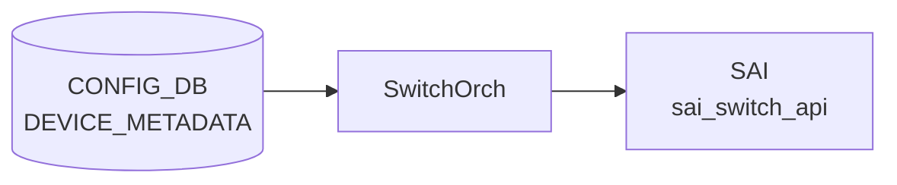

# FDB Aging Time (SWITCH_TABLE.fdb_aging_time)

## 概要

`SWITCH_TABLE:switch` の `fdb_aging_time` フィールドは、ハードウェア FDB ([Forwarding Database](../../reference/glossary.md#term-forwarding-database)) の動的エントリをエージングアウトするまでのタイムアウト時間を秒単位で指定する[^1]。`orchagent` の `SwitchOrch` がこのフィールドを読み取り、SAI 属性 `SAI_SWITCH_ATTR_FDB_AGING_TIME` としてスイッチ ASIC に設定する。

このフィールドは [CONFIG_DB](../../reference/glossary.md#term-config_db) には**存在しない**。orchagent コンテナ起動時に `switch.json.j2` テンプレートが展開された `switch.json` を `swssconfig` が APPL_DB `SWITCH_TABLE:switch` に書き込む経路が標準の注入パスである。

<!-- cdb-mermaid -->
### データフロー (自動生成)



!!! note "凡例"
    CONFIG_DB から SAI までの典型経路を `docs/reference/config-db-orch-map.md` から機械生成したミニ図。詳細・例外は本ページ本文と対応表を参照。
<!-- /cdb-mermaid -->

## key 構造

```text
SWITCH_TABLE:switch
```

シングルトン。`switch` が唯一のキー。

## フィールド

| フィールド | 型 | 既定値 | 説明 |
|-----------|----|--------|------|
| `fdb_aging_time` | uint32 (秒) | `600` | FDB 動的エントリのエージングタイムアウト。`0` は aging 無効 |

`switch.json.j2` により `switch_type != "dpu"` のノードには起動時に `600` 秒が自動注入される (`switch.json.j2:35-38`)。

## 購読者

- `orchagent`（`SwitchOrch::doAppSwitchTableTask()`）: APPL_DB `SWITCH_TABLE` を `Consumer` として購読し、`SAI_SWITCH_ATTR_FDB_AGING_TIME` を設定する。

## 関連 CONFIG_DB / CLI

- 関連 CLI: `show mac aging-time`（APPL_DB の `SWITCH_TABLE*` から `fdb_aging_time` を表示）
- 関連 [YANG](../../reference/glossary.md#term-yang): なし（`fdb_aging_time` フィールドの YANG 定義は存在しない）

<!-- ordering -->
## 書込み順序依存・タイミング依存 (Phase B)

<!-- evidence: meta/_intermediate/cdb-flow/fdb-aging-B.md -->

### SAI create_switch → fdb_aging_time SET（hard 先行必須）

`SwitchOrch::doAppSwitchTableTask()` は `sai_switch_api->set_switch_attribute(gSwitchId, &attr)` で SAI へ書き込む。有効な `gSwitchId` は orchagent 起動時の `create_switch` で確定するため、orchagent が起動してメインループを開始するまで `fdb_aging_time` は適用されない。

- **方向**: `create_switch` 完了 → `fdb_aging_time` SET
- **強度**: hard（gSwitchId なし = SAI 呼び出し不可）
- **緩和策**: orchagent が保証（ユーザー操作不要）
- **evidence**: `switchorch.cpp:22-27`（extern gSwitchId 宣言）

### swssconfig 実行タイミング — orchagent メインループ開始後

`swssconfig.sh` は `swssconfig switch.json` で APPL_DB に書き込む前後に `sleep 1` を挟む (`swssconfig.sh:96-101`)。`SwitchOrch` の Consumer 登録 → メインループ開始 → `swssconfig` 書込 の順序がこの sleep により担保される。orchagent 起動が著しく遅延した場合でも、エントリは Consumer キューに積まれ次のループで処理される。

- **方向**: orchagent メインループ開始 → swssconfig switch.json 書込
- **強度**: soft（sleep 1 による時間的分離）
- **証跡**: `docker-orchagent/swssconfig.sh:96-101`

### 不明フィールドが同一エントリに先行する場合 → break でスキップ

`doAppSwitchTableTask()` は `kfvFieldsValues` を順次処理し、`switch_attribute_map` にも `switch_tunnel_attribute_map` にも存在しない属性を検出すると `break` で残フィールドをスキップする (`switchorch.cpp:617-623`)。`fdb_aging_time` より**前**に不明フィールドが存在すると `fdb_aging_time` が適用されない。

- **方向**: 不明フィールド（fdb_aging_time より前）→ fdb_aging_time スキップ
- **強度**: medium
- **緩和策**: 有効なフィールドのみを同一エントリに記述するか、`fdb_aging_time` 単独で SET する
- **evidence**: `switchorch.cpp:617-623`

### warm-reboot 時の意図的な aging 一時無効化

warm-reboot パスで `checkRestartNoFreeze()` が false の場合、`orchdaemon.cpp:1065-1068` が `gSwitchOrch->setAgingFDB(0)` を呼び `fdb_aging_time` を 0（aging 無効）に設定する。これは warm-reboot 中に MAC エントリが aging で失われないための意図的な設計。warm-reboot 完了後、`swssconfig` の再実行で 600 秒が復元される。

- **方向**: warm-reboot 検出 → aging 0（無効）→ 再起動後 swssconfig → aging 600（復元）
- **強度**: hard（意図的設計）
- **evidence**: `orchdaemon.cpp:1065-1068`, `switchorch.cpp:1671-1688`

### SAI 失敗時の再試行

`set_switch_attribute` が失敗した場合 `handleSaiSetStatus` → `task_need_retry` → `retry = true` → `it++` で次ループ再試行 (`switchorch.cpp:723-728`)。

- **強度**: soft（一時的失敗は自動回復）
- **evidence**: `switchorch.cpp:723-728`

### 順序依存サマリ

| # | 依存関係 | 方向 | 強度 | 緩和策 |
|---|----------|------|------|--------|
| 1 | SAI create_switch → fdb_aging_time SAI set | 強制先行 | hard | orchagent が保証 |
| 2 | orchagent メインループ開始 → swssconfig 書込 | 時間的分離 | soft | sleep 1 により担保 |
| 3 | 不明フィールド先行 → fdb_aging_time スキップ | break 中断 | medium | 有効属性のみ書き込む |
| 4 | warm-reboot → aging 0 → 再起動後復元 | 意図的一時無効化 | hard | 自動復元 (swssconfig) |
| 5 | SAI 失敗 → 次ループ再試行 | 一時スキップ + 自動再試行 | soft | ASIC 正常稼働で解消 |

<!-- /ordering -->

<!-- failure -->
## 失敗挙動 (Phase D)

`SwitchOrch::doAppSwitchTableTask()` (`switchorch.cpp:595-748`) と `setAgingFDB()` (`switchorch.cpp:1671-1688`) の
コード精読から、以下の失敗パターンを確認した。

<!-- evidence: meta/_intermediate/cdb-flow/fdb-aging-D.md -->

### SET 時の失敗パターン

| # | 失敗ケース | 発生箇所 | 挙動 | retry | ログレベル |
|---|-----------|---------|------|-------|-----------|
| 1 | 不明属性が同一エントリに先行 | `switchorch.cpp:617-623` | `break` → 残フィールドスキップ → erase | なし | ERROR |
| 2 | 無効値（uint32_t 変換不可） | `switchorch.cpp:664-714` | `break` → erase | なし | ERROR |
| 3 | SAI `INSUFFICIENT_RESOURCES` / `TABLE_FULL` / `NO_MEMORY` | `switchorch.cpp:727` + `saihelper.cpp:658-662` | `retry = true` → `it++`（無制限再試行） | 無制限 | ERROR |
| 4 | SAI その他エラー（デフォルト） | `switchorch.cpp:727` + `saihelper.cpp:663-667` | `handleSaiFailure` → SAI dump リクエスト → erase | なし | ERROR |
| 5 | `setAgingFDB()` SAI 失敗（warm-reboot パス） | `switchorch.cpp:1677-1684` | 呼び元が戻り値を無視して継続 | なし | ERROR |
| 6 | DEL 操作受信 | `switchorch.cpp:743-749` | `Unsupported operation` warn → erase | なし | WARN |

### SAI エラーコード別分岐

`handleSaiSetStatus()` (`saihelper.cpp:623-668`) の分岐:

```cpp
// saihelper.cpp:639-667
switch (status)
{
    case SAI_STATUS_INSUFFICIENT_RESOURCES:
    case SAI_STATUS_TABLE_FULL:
    case SAI_STATUS_NO_MEMORY:
    case SAI_STATUS_NV_STORAGE_FULL:
        return task_need_retry;   // → retry = true → it++ (無制限再試行)
    default:
        handleSaiFailure(api, "set", status, false);  // SAI dump → task_failed
        break;
}
return task_failed;  // → retry = false → erase
```

`retry = true` のとき Consumer キューにエントリが**保持**され次のメインループで再処理される。
`retry = false` のときエントリは**破棄**され、次の `swssconfig` 再注入まで SAI への設定は行われない。

### warm-reboot パスの setAgingFDB() 失敗

```cpp
// switchorch.cpp:1677-1684
if (status != SAI_STATUS_SUCCESS)
{
    SWSS_LOG_ERROR("Failed to set switch %" PRIx64 " fdb_aging_time attribute: %d", gSwitchId, status);
    task_process_status handle_status = handleSaiSetStatus(SAI_API_SWITCH, status);
    if (handle_status != task_success)
    {
        return parseHandleSaiStatusFailure(handle_status);
    }
}
```

呼び出し元 `orchdaemon.cpp:1068` は `setAgingFDB(0)` の返り値を**検査しない**。そのため warm-reboot 中に
aging 無効化が SAI レベルで失敗しても orchagent は処理を継続する。この場合、warm-reboot 中に動的 MAC
エントリが aging により失われるリスクがある。

### STATE_DB・ERROR_TABLE への影響

- **STATE_DB**: `fdb_aging_time` に対する書き込みなし（SAI 設定のみ）
- **ERROR_TABLE**: 書き込みなし（`SWSS_LOG_ERROR` のみ）
- **APPL_DB エントリ**: `retry = false` の場合エントリ削除。`retry = true` の場合エントリ保持

> **証跡**: `switchorch.cpp:595-748`, `switchorch.cpp:1671-1688`, `saihelper.cpp:623-668, 745-762`。中間ファイル: `meta/_intermediate/cdb-flow/fdb-aging-D.md`
<!-- /failure -->

## 書き込み入り口 (Direction A)

### ビルド時デフォルト (build-time default)

`switch.json.j2` (`sonic-buildimage/dockers/docker-orchagent/switch.json.j2:35-38`) が orchagent コンテナ起動時に展開される。`switch_type != "dpu"` のノードに `fdb_aging_time: "600"` を生成する。

```jinja2
{# switch.json.j2:35-38 #}

    "fdb_aging_time": "600",
```

### CLI

現時点では `fdb_aging_time` を直接変更する公式 CLI コマンドは存在しない。`show mac aging-time` は APPL_DB の現在値を表示するのみ (`show/main.py:1244-1261`)。

### 手動設定

`sonic-db-cli APPL_DB HSET 'SWITCH_TABLE:switch' fdb_aging_time <秒>` で直接変更可能（再起動時に `switch.json` の値で上書きされる）。

## 引用元

[^1]: `SwitchOrch::doAppSwitchTableTask()`: `sonic-swss/orchagent/switchorch.cpp:595-748`. fdb_aging_time の SAI マッピング: `switchorch.cpp:49` (`switch_attribute_map`). warm-reboot での aging 無効化: `orchdaemon.cpp:1068`. デフォルト値: `sonic-buildimage/dockers/docker-orchagent/switch.json.j2:38`.
[^2]: `switchorch.cpp:664-666` の `case SAI_SWITCH_ATTR_FDB_AGING_TIME:` は `to_uint<uint32_t>(value)` でキャストするのみ。プラットフォーム識別関数 (`isMlnxPlatform()` 等) は `doAppSwitchTableTask()` 内には存在しない。プラットフォーム別の `querySwitchCapability()` チェックは ECMP/LAG hash offset (`switchorch.cpp:683-703`) にのみ適用される。

## 関連ページ
- [CONFIG_DB index](index.md)
- [FDB テーブル](fdb.md)
- [DEVICE_METADATA テーブル](device-metadata.md)

<!-- cross-refs -->
## 暗黙参照テーブル (Phase C)

`fdb_aging_time` フィールドはコードの直接 leafref 参照を持たないが、値の**注入元テンプレート**
`switch.json.j2` が CONFIG_DB `DEVICE_METADATA` を暗黙的に参照して注入条件を決定する。

<!-- evidence: meta/_intermediate/cdb-flow/fdb-aging-cross-refs.md -->

### switch.json.j2 → DEVICE_METADATA 参照一覧

| 参照元 (テンプレート) | 参照先テーブル | 参照先フィールド | 参照タイミング | 効果 |
|---|---|---|---|---|
| `switch.json.j2:35` | `DEVICE_METADATA` | `localhost.switch_type` | orchagent コンテナ起動時 | `"dpu"` のとき `fdb_aging_time` 注入をスキップ |
| `switch.json.j2:28-31` | `DEVICE_METADATA` | `localhost.namespace_id` | orchagent コンテナ起動時 | multi-asic 時の `ecmp_hash_seed` / `lag_hash_seed` オフセット計算（`fdb_aging_time` 自体には影響なし） |

### 注入スキップ条件

`DEVICE_METADATA|localhost` の `switch_type` が `"dpu"` に設定されている場合、`switch.json.j2` は
`fdb_aging_time` フィールドを生成しない。この場合 APPL_DB `SWITCH_TABLE:switch` に当フィールドが書き込まれず、
SAI `SAI_SWITCH_ATTR_FDB_AGING_TIME` は orchagent 初期化時のハードウェアデフォルト値のままになる。

### 直接 APPL_DB 参照なし

`SwitchOrch::doAppSwitchTableTask()` は `fdb_aging_time` 値を処理するにあたり、他の CONFIG_DB / APPL_DB
テーブルを参照しない（値をそのまま `uint32_t` にキャストして SAI に渡す）。
`orchdaemon.cpp` の warm-reboot パスが呼ぶ `setAgingFDB(0)` も APPL_DB を経由せず直接 SAI API を呼ぶため、
cross-refs としての依存テーブルはない（Phase B 順序依存として記載済み）。
<!-- /cross-refs -->

<!-- constants -->
## ハードコード定数 (Phase E)

<!-- evidence: meta/_intermediate/cdb-flow/fdb-aging-constants.md -->

`fdb_aging_time` の処理に関わるハードコード定数は CONFIG_DB / YANG で管理されない。以下にソースコード上の全定数を列挙する。

### switchorch.cpp の定数

| 定数 | 値 | 用途 | ソース |
|------|----|------|--------|
| `SWITCH_STAT_COUNTER_POLLING_INTERVAL_MS` | `60000` ms (60 秒) | スイッチ統計カウンタの FlexCounter polling 間隔。`fdb_aging_time` 直接依存ではないが、SwitchOrch が管理する唯一の polling 定数 | `switchorch.cpp:32` |
| SAI マッピングキー `"fdb_aging_time"` | 文字列リテラル | APPL_DB フィールド名 → `SAI_SWITCH_ATTR_FDB_AGING_TIME` の `switch_attribute_map` キー。文字列変更は後方互換性を破壊する | `switchorch.cpp:49` |
| warm-reboot 時 aging 無効化値 | `0` (uint32_t 即値) | `setAgingFDB(0)` で渡される即値。SAI 仕様で `0` = aging 無効を規定。YANG / CONFIG_DB 管理外 | `orchdaemon.cpp:1068` |

### switch.json.j2 のハードコード定数

| 定数 | 値 | 用途 | ソース |
|------|----|------|--------|
| `fdb_aging_time` デフォルト | `"600"` 秒 | `switch_type != "dpu"` ノード向けに orchagent コンテナ起動時に自動注入されるデフォルト値。YANG / CONFIG_DB の直接管理なし | `switch.json.j2:38` |

`switch_type == "dpu"` の場合このフィールドは注入されず、ASIC のハードウェアデフォルトが適用される。

### swssconfig.sh のハードコード定数

| 定数 | 値 | 用途 | ソース |
|------|----|------|--------|
| swssconfig 実行後 sleep | `1` 秒 | `swssconfig switch.json` 実行ごとに挿入される待機時間。orchagent Consumer キュー処理完了のための時間的バッファ | `swssconfig.sh:100` |

### SLEEP_MSECONDS

| 定数 | 値 | 用途 | ソース |
|------|----|------|--------|
| `SLEEP_MSECONDS` | `500` ms | orchagent メインループ内のリトライ待機時間。warm-reboot 経路での `setAgingFDB(0)` を含む SAI 呼び出しリトライのバックオフ間隔 | `orch.h:57` |

### 定数サマリ

| # | 定数 | 値 | 管理 | ソース |
|---|------|-----|------|--------|
| 1 | デフォルト aging time | `600` 秒 | ハードコード (j2 テンプレート) | `switch.json.j2:38` |
| 2 | warm-reboot 時 aging 無効値 | `0` | ハードコード (即値) | `orchdaemon.cpp:1068` |
| 3 | SAI マッピングキー | `"fdb_aging_time"` | ハードコード (静的 map) | `switchorch.cpp:49` |
| 4 | 統計 polling 間隔 | `60000` ms | ハードコード (`#define`) | `switchorch.cpp:32` |
| 5 | swssconfig sleep | `1` 秒 | ハードコード (shell スクリプト) | `swssconfig.sh:100` |
| 6 | リトライバックオフ | `500` ms | ハードコード (`#define`) | `orch.h:57` |

<!-- /constants -->

<!-- side-effects -->
## 副次 DB 書込 (Phase F)

<!-- evidence: meta/_intermediate/cdb-flow/fdb-aging-F.md -->

`APPL_DB SWITCH_TABLE:switch` の `fdb_aging_time` フィールドを `SwitchOrch::doAppSwitchTableTask()` が処理する際、および warm-reboot パスで呼ばれる `setAgingFDB()` の実行時に、**副次的な DB 書込は発生しない**。いずれの処理パスも SAI `set_switch_attribute(gSwitchId, &attr)` を呼ぶのみで、APPL_DB / STATE_DB / COUNTERS_DB への書込を一切行わない。

| 副次 DB | 書込有無 | 根拠 |
|---------|---------|------|
| APPL_DB | なし | `doAppSwitchTableTask()` L595-748 全体を `set(`/`hset`/`Producer`/`Notification` で検索してマッチ 0 件 |
| STATE_DB | なし | `fdb_aging_time` 処理パス (`switchorch.cpp:664-666`, `switchorch.cpp:1671-1688`) に `m_stateDb`/`m_switchTable` 書込なし。`set_switch_capability()` による `STATE_DB SWITCH_CAPABILITY_TABLE` 書込は PFC DLR / ASIC SDK health 等の能力フラグのためであり `fdb_aging_time` SET とは独立したパス |
| COUNTERS_DB | なし | `switchorch.cpp` 全体に COUNTERS_DB 書込は FlexCounter 統計グループ登録のみで `fdb_aging_time` 処理に連動しない |
| ASIC_DB | 間接のみ | orchagent は ASIC_DB に直接書き込まない。SAI 操作は syncd が ASIC_DB に記録するが orchagent 側に明示的書込なし |

### SwitchOrch が持つ STATE_DB 書込経路（fdb_aging_time 非連動）

`SwitchOrch` は `STATE_DB` への書込経路を 3 つ保持しているが、いずれも `fdb_aging_time` の SET 処理とは独立している。

| 経路 | 書込テーブル | トリガー | コード箇所 |
|------|------------|---------|-----------|
| `set_switch_capability()` | `STATE_DB SWITCH_CAPABILITY_TABLE:switch` | コンストラクタ起動時・能力照会時（PFC DLR / TPID / ASIC SDK health 等） | `switchorch.cpp:1864-1866` |
| `m_asicSensorsTable->set()` | `STATE_DB ASIC_TEMPERATURE_INFO_TABLE` | 温度 polling timer 発火時 | `switchorch.cpp:1860` |
| `m_asicSdkHealthEventTable->set()` | `STATE_DB STATE_ASIC_SDK_HEALTH_EVENT_TABLE` | ASIC SDK health event 通知受信時 | `switchorch.cpp:155-156` |

詳細スキャン手順と grep 結果は `meta/_intermediate/cdb-flow/fdb-aging-F.md` を参照。
<!-- /side-effects -->

<!-- pubsub -->
## 通信メカニズム (Phase G)

> 調査証跡: `sonic-swss/orchagent/switchorch.cpp`, `orchagent/orchdaemon.cpp`

### fdb_aging_time の通信経路概要

`fdb_aging_time` は **CONFIG_DB ではなく APPL_DB** に書き込まれる特殊なフィールドである。`switch.json.j2` テンプレートが orchestration コンテナ起動時に展開され、`swssconfig` が APPL_DB `SWITCH_TABLE:switch` に書き込む。その後 `SwitchOrch` が `ConsumerStateTable`（Orch 基底クラス）で変化を検知し SAI に設定する。

### 書き込み経路（APPL_DB への注入）

```
[orchagent コンテナ起動]
switch.json.j2 (Jinja2 展開)
  ↓ swssconfig switch.json (HSET)
APPL_DB: SWITCH_TABLE:switch  fdb_aging_time="600"
  ↓ keyspace notification (ConsumerStateTable)
SwitchOrch::doAppSwitchTableTask()
  ↓ SAI set_switch_attribute(gSwitchId, SAI_SWITCH_ATTR_FDB_AGING_TIME, 600)
```

CONFIG_DB を経由しないため、`SubscriberStateTable` / `ProducerStateTable` の 2 段構成は存在しない。

### 購読方式

| コンポーネント | 通信方式 | 対象 DB / テーブル | API |
|---|---|---|---|
| `SwitchOrch` | `ConsumerStateTable` (Orch 基底, priority=auto) | APPL_DB `SWITCH_TABLE` (`APP_SWITCH_TABLE_NAME`) | `Orch(connectors)` → `orchdaemon.cpp:197,210` |
| `swssconfig` | `ProducerStateTable`/直接 HSET | APPL_DB `SWITCH_TABLE:switch` | `swssconfig switch.json` |
| warm-reboot パス (`orchdaemon.cpp:1068`) | SAI 直接呼び出し | SAI `set_switch_attribute()` | `gSwitchOrch->setAgingFDB(0)` — APPL_DB を経由しない |

### keyspace 通知 / pub-sub の有無

APPL_DB `SWITCH_TABLE` への書き込みは `swss::Select` ループが検知する。`SwitchOrch` の Orch 基底クラスが `ConsumerStateTable` を生成し、Redis keyspace notification (`PSUBSCRIBE`) で変化を受け取る。`orchdaemon.cpp:1000ms` の `SELECT_TIMEOUT` でポーリングも行う。

CONFIG_DB → fabricmgrd のような中継デーモンは**存在しない**。`fdb_aging_time` は CONFIG_DB に永続化されず、再起動時は常に `switch.json.j2` からの再注入で復元される。

### warm-reboot パスの直接 SAI 呼び出し

warm-reboot 中の aging 無効化 (`setAgingFDB(0)`) は APPL_DB を**経由しない**。`orchdaemon.cpp:1068` が `gSwitchOrch->setAgingFDB(0)` を直接呼び、`switchorch.cpp:1671-1688` が `sai_switch_api->set_switch_attribute()` を呼ぶ。Consumer キューの処理を待たずに即時 SAI 設定が行われる。

| 通信経路 | Redis pub-sub | 経由する DB | SAI 呼び出しタイミング |
|---------|-------------|------------|----------------------|
| `swssconfig` → `SwitchOrch` | あり (keyspace) | APPL_DB | 次の orchagent ループ (最大 1 秒遅延) |
| warm-reboot `setAgingFDB(0)` | なし (直接) | なし | 即時 |

> **Evidence**: `sonic-swss/orchagent/orchdaemon.cpp:197-213`; `orchagent/switchorch.cpp:148-161,1671-1688`; `cfgmgr/swssconfig.sh:96-101`
<!-- /pubsub -->

<!-- platform -->
## プラットフォーム差 (Phase H)

<!-- evidence: meta/_intermediate/cdb-flow/fdb-aging-platform.md -->

`fdb_aging_time` のプラットフォーム差は SAI レイヤより上位の `switch.json.j2` テンプレート展開時にのみ発生する。`SwitchOrch::doAppSwitchTableTask()` 内に `isMlnxPlatform()` 等のプラットフォーム識別コードは存在せず[^2]、SAI への書込みはプラットフォーム非依存である（`switchorch.cpp:664-666`）。

### switch.json.j2 による注入可否の分岐

`switch.json.j2:35` の条件式が `switch_type` の値に基づいて `fdb_aging_time` フィールドの注入可否を決定する。

```jinja2
{# switch.json.j2:35-38 #}

    "fdb_aging_time": "600",
```

| `switch_type` 値 | `fdb_aging_time` 注入 | SAI 設定値 | 備考 |
|---|---|---|---|
| 未設定（通常スイッチ） | される (`"600"`) | 600 秒 | ToRRouter / LeafRouter / SpineRouter 等 |
| `"dpu"` | されない | ASIC ハードウェアデフォルト | SmartSwitch DPU スロット (DASH ターゲット) |
| `"chassis-packet"` | される (`"600"`) | 600 秒 | `dpu` でないため条件を通過 |
| その他の任意文字列 | される (`"600"`) | 600 秒 | `dpu` 以外は全て注入 |

`switch_type == "dpu"` のノードでは APPL_DB `SWITCH_TABLE:switch` に `fdb_aging_time` フィールド自体が存在しないため、`SwitchOrch` は当フィールドを処理しない。DPU ノードは DASH ターゲットとして扱われ、Ethernet スイッチング (FDB aging) を必要としない。

> **実証**: `sonic-buildimage/src/sonic-config-engine/tests/sample_output/t1-smartswitch-dpu.json` は DPU 向け生成 JSON であり、`SWITCH_TABLE` エントリが一切存在しない。

### SAI capability チェックの有無

`switchorch.cpp:683-703` では `SAI_SWITCH_ATTR_ECMP_DEFAULT_HASH_OFFSET` / `SAI_SWITCH_ATTR_LAG_DEFAULT_HASH_OFFSET` に対して `querySwitchCapability()` による ASIC 能力照会が実施されるが、`SAI_SWITCH_ATTR_FDB_AGING_TIME`（`switchorch.cpp:664-666`）にはこのチェックが存在しない。すべての ASIC ベンダーで capability チェックなしに `set_switch_attribute()` が呼ばれる。

### multi-asic 環境

各 namespace ごとに orchagent が独立起動し、それぞれ `switch.json.j2` 展開によって `fdb_aging_time: "600"` が注入される。`switch.json.j2:28-31` の `namespace_id` は `ecmp_hash_seed` / `lag_hash_seed` のオフセット計算にのみ使用され、`fdb_aging_time` の値には影響しない（全 namespace 共通 `600` 秒）。

> **証跡**: `sonic-buildimage/src/sonic-config-engine/tests/sample_output/t2-switch-masic1.json` — 全 namespace 共通 `"fdb_aging_time": "600"`。スキャン元: `meta/_intermediate/cdb-flow/fdb-aging-platform.md`
<!-- /platform -->

<!-- glossary-links-injected: fdb-aging -->
