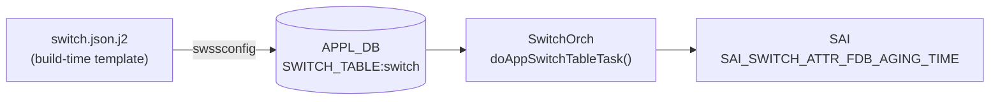

# FDB Aging Time (SWITCH_TABLE.fdb_aging_time)

## 概要

`SWITCH_TABLE:switch` の `fdb_aging_time` フィールドは、ハードウェア FDB ([Forwarding Database](../../reference/glossary.md#term-forwarding-database)) の動的エントリをエージングアウトするまでのタイムアウト時間を秒単位で指定する[^1]。`orchagent` の `SwitchOrch` がこのフィールドを読み取り、SAI 属性 `SAI_SWITCH_ATTR_FDB_AGING_TIME` としてスイッチ ASIC に設定する。

このフィールドは [CONFIG_DB](../../reference/glossary.md#term-config_db) には**存在しない**。orchagent コンテナ起動時に `switch.json.j2` テンプレートが展開された `switch.json` を `swssconfig` が APPL_DB `SWITCH_TABLE:switch` に書き込む経路が標準の注入パスである。

<!-- cdb-mermaid -->
### データフロー (自動生成)



!!! note "凡例"
    APPL_DB から SAI までの典型経路。CONFIG_DB を経由しないフィールドのため、APPL_DB が起点となる。
<!-- /cdb-mermaid -->

## key 構造

```text
SWITCH_TABLE:switch
```

シングルトン。`switch` が唯一のキー。

## フィールド

| フィールド | 型 | 既定値 | 説明 |
|-----------|----|--------|------|
| `fdb_aging_time` | uint32 (秒) | `600` | FDB 動的エントリのエージングタイムアウト。`0` は aging 無効 |

`switch.json.j2` により `switch_type != "dpu"` のノードには起動時に `600` 秒が自動注入される (`switch.json.j2:35-38`)。

## 購読者

- `orchagent`（`SwitchOrch::doAppSwitchTableTask()`）: APPL_DB `SWITCH_TABLE` を `Consumer` として購読し、`SAI_SWITCH_ATTR_FDB_AGING_TIME` を設定する。

## 関連 CONFIG_DB / CLI

- 関連 CLI: `show mac aging-time`（APPL_DB の `SWITCH_TABLE*` から `fdb_aging_time` を表示）
- 関連 [YANG](../../reference/glossary.md#term-yang): なし（`fdb_aging_time` フィールドの YANG 定義は存在しない）

<!-- ordering -->
## 書込み順序依存・タイミング依存 (Phase B)

<!-- evidence: meta/_intermediate/cdb-flow/fdb-aging-B.md -->

### SAI create_switch → fdb_aging_time SET（hard 先行必須）

`SwitchOrch::doAppSwitchTableTask()` は `sai_switch_api->set_switch_attribute(gSwitchId, &attr)` で SAI へ書き込む。有効な `gSwitchId` は orchagent 起動時の `create_switch` で確定するため、orchagent が起動してメインループを開始するまで `fdb_aging_time` は適用されない。

- **方向**: `create_switch` 完了 → `fdb_aging_time` SET
- **強度**: hard（gSwitchId なし = SAI 呼び出し不可）
- **緩和策**: orchagent が保証（ユーザー操作不要）
- **evidence**: `switchorch.cpp:22-27`（extern gSwitchId 宣言）

### swssconfig 実行タイミング — orchagent メインループ開始後

`swssconfig.sh` は `swssconfig switch.json` で APPL_DB に書き込む前後に `sleep 1` を挟む (`swssconfig.sh:96-101`)。`SwitchOrch` の Consumer 登録 → メインループ開始 → `swssconfig` 書込 の順序がこの sleep により担保される。orchagent 起動が著しく遅延した場合でも、エントリは Consumer キューに積まれ次のループで処理される。

- **方向**: orchagent メインループ開始 → swssconfig switch.json 書込
- **強度**: soft（sleep 1 による時間的分離）
- **証跡**: `docker-orchagent/swssconfig.sh:96-101`

### 不明フィールドが同一エントリに先行する場合 → break でスキップ

`doAppSwitchTableTask()` は `kfvFieldsValues` を順次処理し、`switch_attribute_map` にも `switch_tunnel_attribute_map` にも存在しない属性を検出すると `break` で残フィールドをスキップする (`switchorch.cpp:617-623`)。`fdb_aging_time` より**前**に不明フィールドが存在すると `fdb_aging_time` が適用されない。

- **方向**: 不明フィールド（fdb_aging_time より前）→ fdb_aging_time スキップ
- **強度**: medium
- **緩和策**: 有効なフィールドのみを同一エントリに記述するか、`fdb_aging_time` 単独で SET する
- **evidence**: `switchorch.cpp:617-623`

### warm-reboot 時の意図的な aging 一時無効化

warm-reboot パスで `checkRestartNoFreeze()` が false の場合、`orchdaemon.cpp:1065-1068` が `gSwitchOrch->setAgingFDB(0)` を呼び `fdb_aging_time` を 0（aging 無効）に設定する。これは warm-reboot 中に MAC エントリが aging で失われないための意図的な設計。warm-reboot 完了後、`swssconfig` の再実行で 600 秒が復元される。

- **方向**: warm-reboot 検出 → aging 0（無効）→ 再起動後 swssconfig → aging 600（復元）
- **強度**: hard（意図的設計）
- **evidence**: `orchdaemon.cpp:1065-1068`, `switchorch.cpp:1671-1688`

### SAI 失敗時の再試行

`set_switch_attribute` が失敗した場合 `handleSaiSetStatus` → `task_need_retry` → `retry = true` → `it++` で次ループ再試行 (`switchorch.cpp:723-728`)。

- **強度**: soft（一時的失敗は自動回復）
- **evidence**: `switchorch.cpp:723-728`

### 順序依存サマリ

| # | 依存関係 | 方向 | 強度 | 緩和策 |
|---|----------|------|------|--------|
| 1 | SAI create_switch → fdb_aging_time SAI set | 強制先行 | hard | orchagent が保証 |
| 2 | orchagent メインループ開始 → swssconfig 書込 | 時間的分離 | soft | sleep 1 により担保 |
| 3 | 不明フィールド先行 → fdb_aging_time スキップ | break 中断 | medium | 有効属性のみ書き込む |
| 4 | warm-reboot → aging 0 → 再起動後復元 | 意図的一時無効化 | hard | 自動復元 (swssconfig) |
| 5 | SAI 失敗 → 次ループ再試行 | 一時スキップ + 自動再試行 | soft | ASIC 正常稼働で解消 |

<!-- /ordering -->

## 書き込み入り口 (Direction A)

### ビルド時デフォルト (build-time default)

`switch.json.j2` (`sonic-buildimage/dockers/docker-orchagent/switch.json.j2:35-38`) が orchagent コンテナ起動時に展開される。`switch_type != "dpu"` のノードに `fdb_aging_time: "600"` を生成する。

```jinja2
{# switch.json.j2:35-38 #}

    "fdb_aging_time": "600",
```

### CLI

現時点では `fdb_aging_time` を直接変更する公式 CLI コマンドは存在しない。`show mac aging-time` は APPL_DB の現在値を表示するのみ (`show/main.py:1244-1261`)。

### 手動設定

`sonic-db-cli APPL_DB HSET 'SWITCH_TABLE:switch' fdb_aging_time <秒>` で直接変更可能（再起動時に `switch.json` の値で上書きされる）。

## 引用元

[^1]: `SwitchOrch::doAppSwitchTableTask()`: `sonic-swss/orchagent/switchorch.cpp:595-748`. fdb_aging_time の SAI マッピング: `switchorch.cpp:49` (`switch_attribute_map`). warm-reboot での aging 無効化: `orchdaemon.cpp:1068`. デフォルト値: `sonic-buildimage/dockers/docker-orchagent/switch.json.j2:38`.

## 関連ページ
- [CONFIG_DB index](index.md)
- [FDB テーブル](fdb.md)
- [DEVICE_METADATA テーブル](device-metadata.md)

<!-- cross-refs -->
## 暗黙参照テーブル (Phase C)

`fdb_aging_time` フィールドはコードの直接 leafref 参照を持たないが、値の**注入元テンプレート**
`switch.json.j2` が CONFIG_DB `DEVICE_METADATA` を暗黙的に参照して注入条件を決定する。

<!-- evidence: meta/_intermediate/cdb-flow/fdb-aging-cross-refs.md -->

### switch.json.j2 → DEVICE_METADATA 参照一覧

| 参照元 (テンプレート) | 参照先テーブル | 参照先フィールド | 参照タイミング | 効果 |
|---|---|---|---|---|
| `switch.json.j2:35` | `DEVICE_METADATA` | `localhost.switch_type` | orchagent コンテナ起動時 | `"dpu"` のとき `fdb_aging_time` 注入をスキップ |
| `switch.json.j2:28-31` | `DEVICE_METADATA` | `localhost.namespace_id` | orchagent コンテナ起動時 | multi-asic 時の `ecmp_hash_seed` / `lag_hash_seed` オフセット計算（`fdb_aging_time` 自体には影響なし） |

### 注入スキップ条件

`DEVICE_METADATA|localhost` の `switch_type` が `"dpu"` に設定されている場合、`switch.json.j2` は
`fdb_aging_time` フィールドを生成しない。この場合 APPL_DB `SWITCH_TABLE:switch` に当フィールドが書き込まれず、
SAI `SAI_SWITCH_ATTR_FDB_AGING_TIME` は orchagent 初期化時のハードウェアデフォルト値のままになる。

### 直接 APPL_DB 参照なし

`SwitchOrch::doAppSwitchTableTask()` は `fdb_aging_time` 値を処理するにあたり、他の CONFIG_DB / APPL_DB
テーブルを参照しない（値をそのまま `uint32_t` にキャストして SAI に渡す）。
`orchdaemon.cpp` の warm-reboot パスが呼ぶ `setAgingFDB(0)` も APPL_DB を経由せず直接 SAI API を呼ぶため、
cross-refs としての依存テーブルはない（Phase B 順序依存として記載済み）。
<!-- /cross-refs -->

<!-- glossary-links-injected: fdb-aging -->
