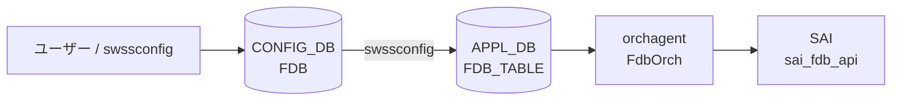

# FDB テーブル

## 概要

[CONFIG_DB](../../reference/glossary.md#term-config_db) の `FDB` テーブルは**静的 MAC アドレス エントリ**をプロビジョニングするテーブルである[^1]。キー形式 `FDB|<VlanName>|<MAC>` で VLAN とMACアドレスを指定し、送出ポートとエントリ種別を保持する。

動的に学習された MAC エントリは APPL_DB の `FDB_TABLE` に書かれる。CONFIG_DB の `FDB` は静的エントリ（ユーザー手動設定や PAC/802.1X による設定）専用である。

<!-- defaults -->
## コード由来デフォルト

### field: `type`

`fdborch.cpp:770` で `string type = "dynamic";` と初期化される。`type` フィールドが省略されると `"dynamic"` がデフォルト値として使用される。

```cpp
// sonic-swss/orchagent/fdborch.cpp:769-770
string port = "";
string type = "dynamic";
```

有効値: `"static"` / `"dynamic"` / `"dynamic_local"`（MCLAG ローカル扱い）。

### field: `port`

`fdborch.cpp:769` で `string port = "";` と初期化される。`port` フィールドが省略されると空文字のまま `addFdbEntry()` に渡され、ポート解決に失敗するため FDB エントリが登録されない。実装上は必須フィールド。

### SAI 型マッピング

| `type` 値 | SAI 型 |
|-----------|--------|
| `"static"` | `SAI_FDB_ENTRY_TYPE_STATIC` |
| `"dynamic"` | `SAI_FDB_ENTRY_TYPE_DYNAMIC` |
| `"dynamic_local"` | `SAI_FDB_ENTRY_TYPE_DYNAMIC`（MCLAG ローカル） |

<!-- /defaults -->

<!-- constants -->
## ハードコード定数

### FDB type 列挙値（文字列）

`fdborch.cpp:830` の assert が受け入れる有効文字列:

| 文字列値 | 意味 |
|---------|------|
| `"static"` | 静的エントリ。エージングしない。手動 / PAC プロビジョニング |
| `"dynamic"` | 動的エントリ。エージングによって削除される |
| `"dynamic_local"` | MCLAG ローカル扱い。SAI 上は DYNAMIC だがフラッシュ除外対象 |

有効値以外が渡ると `assert()` でプロセスクラッシュ (`fdborch.cpp:830`)。

### SAI FDB エントリ属性（`sai_fdb_entry_attr_t`）

`addFdbEntry()` 内で設定される SAI 属性一覧 (`fdborch.cpp:1424–1497`):

| SAI 属性 ID | 設定値 / 条件 | コード行 |
|------------|--------------|---------|
| `SAI_FDB_ENTRY_ATTR_TYPE` | `SAI_FDB_ENTRY_TYPE_STATIC` / `SAI_FDB_ENTRY_TYPE_DYNAMIC` | L1424–L1435 |
| `SAI_FDB_ENTRY_ATTR_BRIDGE_PORT_ID` | ポートの bridge port OID | L1449 |
| `SAI_FDB_ENTRY_ATTR_ALLOW_MAC_MOVE` | static エントリ時 `true` (MCLAG 連携) | L1444–L1445 |
| `SAI_FDB_ENTRY_ATTR_ENDPOINT_IP` | VxLAN リモート VTEP IP | L1467 / L1481 |
| `SAI_FDB_ENTRY_ATTR_PACKET_ACTION` | `SAI_PACKET_ACTION_DROP` (`discard="true"`) / `SAI_PACKET_ACTION_FORWARD` | L1496–L1497 |

### FDB フラッシュ属性（`sai_fdb_flush_attr_t`）

`flushFdbAll()` / `flushFdbByVlan()` で使用:

| SAI 属性 ID | 設定値 | コード行 |
|------------|--------|---------|
| `SAI_FDB_FLUSH_ATTR_ENTRY_TYPE` | `SAI_FDB_FLUSH_ENTRY_TYPE_DYNAMIC`（static はフラッシュしない） | L949, L1122, L1162 |
| `SAI_FDB_FLUSH_ATTR_BV_ID` | VLAN の BV OID | L1116, L1159 |
| `SAI_FDB_FLUSH_ATTR_BRIDGE_PORT_ID` | ポートの bridge port OID | L1109 |

### FDB Origin 列挙値（`FdbOrigin` enum）

`fdborch.h:8–14` 定義:

| 定数 | 値 | 意味 |
|------|----|------|
| `FDB_ORIGIN_INVALID` | `0` | 初期値・無効 |
| `FDB_ORIGIN_LEARN` | `1` | カーネル FDB 学習（自動） |
| `FDB_ORIGIN_PROVISIONED` | `2` | swssconfig / ユーザー設定 |
| `FDB_ORIGIN_VXLAN_ADVERTIZED` | `4` | BGP-EVPN VxLAN 広報 |
| `FDB_ORIGIN_MCLAG_ADVERTIZED` | `8` | MCLAG ピア広報 |

`removeFdbEntry()` のデフォルト引数は `FDB_ORIGIN_PROVISIONED` (`fdborch.h:101`)。

### `discard` フィールドのデフォルト

`fdborch.cpp:775`: `string discard = "false";` — フィールド省略時は `"false"`。

`discard="true"` の場合、SAI に `SAI_PACKET_ACTION_DROP` が設定される (`fdborch.cpp:1497`)。

<!-- /constants -->

## key 構造

```text
FDB|<VlanName>|<MAC>
```

- `<VlanName>`: `Vlan<id>` 形式 (例: `Vlan100`)
- `<MAC>`: MAC アドレス (例: `00:01:02:03:04:05`)

## フィールド一覧

| フィールド | 型 | 必須 | デフォルト | 説明 |
|-----------|----|------|-----------|------|
| `port` | string | 実質必須 | `""` (空) | 送出ポート名 (例: `Ethernet0`, `PortChannel1`) |
| `type` | `"static"` \| `"dynamic"` | - | `"dynamic"` | エントリ種別。静的プロビジョニングには `"static"` を使用 |

## 購読者

- **orchagent / FdbOrch**: APPL_DB の `FDB_TABLE` を購読して SAI FDB エントリを作成・削除する。CONFIG_DB `FDB` から APPL_DB `FDB_TABLE` への橋渡しは `swssconfig` が担う
- **PAC (sonic-pac) / paccfg**: 802.1X 認証後、CONFIG_DB `FDB` テーブルを読み出して静的 MAC エントリの有無を確認する (`pac_authmgrcfg.cpp:173`)

## データフロー



!!! note "動的学習エントリ"
    カーネルの FDB 学習イベントは `fdbsyncd` が netlink から受け取り APPL_DB の `FDB_TABLE` に直接書き込む。CONFIG_DB `FDB` を経由しない。

## 書き込み入り口

| 書き込み元 | コード箇所 | type 値 |
|-----------|----------|---------|
| `swssconfig` (手動投入) | `swssconfig -d -j fdb.json` | `"static"` が一般的 |
| PAC / 802.1X | `pac_authmgrcfg.cpp:64-76` | `"static"` |
| fdbsyncd (自動学習) | APPL_DB 直接 (CONFIG_DB を経由しない) | `"dynamic"` |

## 関連 CONFIG_DB / YANG / CLI

- 関連 [CONFIG_DB](../../reference/glossary.md#term-config_db): `VLAN`、`VLAN_MEMBER`
- 関連 CLI: `show mac` (FDB テーブル表示)、`sonic-clear fdb all` (動的エントリクリア)

## 例外条件・特殊挙動

- **`port` 省略時**: `addFdbEntry()` でポート解決が失敗し、エントリが追加されない。エラーログ出力。
- **`type` の assert チェック**: `fdborch.cpp:830` で `assert(type == "dynamic" || type == "dynamic_local" || type == "static")` — 無効な type 値はプロセスクラッシュを引き起こす。
- **CONFIG_DB FDB は直接 orchagent に購読されない**: `FdbOrch` は APPL_DB の `FDB_TABLE` を購読する。CONFIG_DB `FDB` は `swssconfig` を介して APPL_DB に転記される。

## 引用元

[^1]: `sonic-swss-common/common/schema.h:358` — `#define CFG_FDB_TABLE_NAME "FDB"`. <https://github.com/sonic-net/sonic-swss-common/blob/master/common/schema.h>
