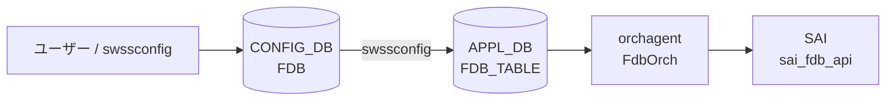

# FDB テーブル

## 概要

[CONFIG_DB](../../reference/glossary.md#term-config_db) の `FDB` テーブルは**静的 MAC アドレス エントリ**をプロビジョニングするテーブルである[^1]。キー形式 `FDB|<VlanName>|<MAC>` で VLAN とMACアドレスを指定し、送出ポートとエントリ種別を保持する。

動的に学習された MAC エントリは APPL_DB の `FDB_TABLE` に書かれる。CONFIG_DB の `FDB` は静的エントリ（ユーザー手動設定や PAC/802.1X による設定）専用である。

<!-- defaults -->
## コード由来デフォルト

### field: `type`

`fdborch.cpp:770` で `string type = "dynamic";` と初期化される。`type` フィールドが省略されると `"dynamic"` がデフォルト値として使用される。

```cpp
// sonic-swss/orchagent/fdborch.cpp:769-770
string port = "";
string type = "dynamic";
```

有効値: `"static"` / `"dynamic"` / `"dynamic_local"`（MCLAG ローカル扱い）。

### field: `port`

`fdborch.cpp:769` で `string port = "";` と初期化される。`port` フィールドが省略されると空文字のまま `addFdbEntry()` に渡され、ポート解決に失敗するため FDB エントリが登録されない。実装上は必須フィールド。

### SAI 型マッピング

| `type` 値 | SAI 型 |
|-----------|--------|
| `"static"` | `SAI_FDB_ENTRY_TYPE_STATIC` |
| `"dynamic"` | `SAI_FDB_ENTRY_TYPE_DYNAMIC` |
| `"dynamic_local"` | `SAI_FDB_ENTRY_TYPE_DYNAMIC`（MCLAG ローカル） |

<!-- /defaults -->

## key 構造

```text
FDB|<VlanName>|<MAC>
```

- `<VlanName>`: `Vlan<id>` 形式 (例: `Vlan100`)
- `<MAC>`: MAC アドレス (例: `00:01:02:03:04:05`)

## フィールド一覧

| フィールド | 型 | 必須 | デフォルト | 説明 |
|-----------|----|------|-----------|------|
| `port` | string | 実質必須 | `""` (空) | 送出ポート名 (例: `Ethernet0`, `PortChannel1`) |
| `type` | `"static"` \| `"dynamic"` | - | `"dynamic"` | エントリ種別。静的プロビジョニングには `"static"` を使用 |

## 購読者

- **orchagent / FdbOrch**: APPL_DB の `FDB_TABLE` を購読して SAI FDB エントリを作成・削除する。CONFIG_DB `FDB` から APPL_DB `FDB_TABLE` への橋渡しは `swssconfig` が担う
- **PAC (sonic-pac) / paccfg**: 802.1X 認証後、CONFIG_DB `FDB` テーブルを読み出して静的 MAC エントリの有無を確認する (`pac_authmgrcfg.cpp:173`)

## データフロー



!!! note "動的学習エントリ"
    カーネルの FDB 学習イベントは `fdbsyncd` が netlink から受け取り APPL_DB の `FDB_TABLE` に直接書き込む。CONFIG_DB `FDB` を経由しない。

## 書き込み入り口

| 書き込み元 | コード箇所 | type 値 |
|-----------|----------|---------|
| `swssconfig` (手動投入) | `swssconfig -d -j fdb.json` | `"static"` が一般的 |
| PAC / 802.1X | `pac_authmgrcfg.cpp:64-76` | `"static"` |
| fdbsyncd (自動学習) | APPL_DB 直接 (CONFIG_DB を経由しない) | `"dynamic"` |

## 関連 CONFIG_DB / YANG / CLI

- 関連 [CONFIG_DB](../../reference/glossary.md#term-config_db): `VLAN`、`VLAN_MEMBER`
- 関連 CLI: `show mac` (FDB テーブル表示)、`sonic-clear fdb all` (動的エントリクリア)

<!-- cross-refs -->
## 暗黙参照（テーブル間依存）

`FDB` テーブルのエントリを処理する際、`FdbOrch` は以下のテーブル・Orch に暗黙的に依存する。YANG の leafref 定義はなく、すべて実装レベルの依存である。

### PORT / PORTCHANNEL（`port` フィールド — 必須依存）

`addFdbEntry()` (`fdborch.cpp:1277–1320`) は `port` フィールドの値を `PortsOrch::getPort()` で解決してブリッジポート OID を取得する。PORT が未作成の場合はエントリを `saved_fdb_entries[port_name]` に保留する。保留エントリは VLAN_MEMBER への追加イベントをトリガとして再試行される。

### VLAN（key の `Vlan<id>` — 必須依存）

同じく `addFdbEntry()` でキーの `Vlan<id>` 部分を `PortsOrch::getPort()` で解決し、Bridge Vector ID (bv_id) を取得する。VLAN が未作成の場合もエントリは `saved_fdb_entries` に保留される。PORT と VLAN の両方が解決されて初めて SAI FDB エントリが作成される。

### VLAN_MEMBER（メンバー変化 — フラッシュ・再試行トリガ）

`FdbOrch` は `PortsOrch` の Observer として登録されており (`fdborch.cpp:39`、`SUBJECT_TYPE_VLAN_MEMBER_CHANGE` を購読)、`updateVlanMember()` (`fdborch.cpp:1240`) で以下を行う:

- **メンバー削除時**: `flushFDBEntries()` でそのポート・VLAN 組み合わせの動的 FDB エントリを SAI からフラッシュし (`SAI_FDB_FLUSH_ENTRY_TYPE_DYNAMIC`、静的エントリは保持)、`notifyObserversFDBFlush()` で `NeighOrch` への ARP flush 通知を連鎖させる。
- **メンバー追加時**: 保留中の `saved_fdb_entries` から対象 VLAN に一致するエントリを `addFdbEntry()` で再試行する。

### MCLAG (MlagOrch) — flush 抑制と remote エントリ管理

`FdbOrch` はポートダウン時の FDB flush に先立ち `gMlagOrch->isMlagInterface()` で MCLAG ポートかどうかを確認する (`fdborch.cpp:1209`)。MCLAG インタフェースの場合は flush をスキップする。また `FDB_ORIGIN_MCLAG_ADVERTIZED` 属性を持つ remote エントリは AGE イベントで削除されず SAI に再追加される (`fdborch.cpp:490–515`)。MCLAG remote → local への MAC move が発生すると `STATE_DB` の `MCLAG_REMOTE_FDB_TABLE` から該当エントリを削除する (`fdborch.cpp:126–129`)。

### NeighOrch — FDB flush 連鎖（上流通知）

`notifyObserversFDBFlush()` (`fdborch.cpp:1178`) は FDB エントリが flush された際に `SUBJECT_TYPE_FDB_FLUSH_CHANGE` を notify する。`NeighOrch` (`neighorch.cpp:195`) がこれを受け取り、当該ポート・VLAN の ARP/ND エントリを削除する。`FDB` テーブル自体には記載されないが、動的 FDB エントリが消えると ARP エントリも連鎖削除される副作用がある。

### VxlanTunnelOrch — EVPN remote MAC のトンネルポート解放

EVPN 経由で学習した `FDB_ORIGIN_VXLAN_TUNNEL` origin の FDB エントリが AGE または MOVE で消える際、`notifyTunnelOrch()` (`fdborch.cpp:1792`) を呼び `VxlanTunnelOrch::deleteTunnelPort()` でトンネルポートを解放する。

| 参照先 | 参照種別 | トリガ | コード箇所 |
|--------|---------|--------|-----------|
| `PORT` / `PORTCHANNEL` | OID 解決（必須） | 全 FDB エントリ処理 | `fdborch.cpp:1277–1320` |
| `VLAN` | OID 解決（必須） | 全 FDB エントリ処理 | `fdborch.cpp:1289–1295` |
| `VLAN_MEMBER` (削除) | イベント受信 → flush | メンバー削除 | `fdborch.cpp:1240–1249` |
| `VLAN_MEMBER` (追加) | イベント受信 → 再試行 | メンバー追加 | `fdborch.cpp:1254–1271` |
| `MlagOrch` | 条件分岐 | ポートダウン / AGE | `fdborch.cpp:1209, 490–515` |
| `NeighOrch` | 上流通知 | FDB flush 発生時 | `fdborch.cpp:1178–1201` |
| `VxlanTunnelOrch` | OID 解放 | EVPN MAC の aging/move | `fdborch.cpp:1792–1800` |

<!-- /cross-refs -->

## 例外条件・特殊挙動

- **`port` 省略時**: `addFdbEntry()` でポート解決が失敗し、エントリが追加されない。エラーログ出力。
- **`type` の assert チェック**: `fdborch.cpp:830` で `assert(type == "dynamic" || type == "dynamic_local" || type == "static")` — 無効な type 値はプロセスクラッシュを引き起こす。
- **CONFIG_DB FDB は直接 orchagent に購読されない**: `FdbOrch` は APPL_DB の `FDB_TABLE` を購読する。CONFIG_DB `FDB` は `swssconfig` を介して APPL_DB に転記される。

## 引用元

[^1]: `sonic-swss-common/common/schema.h:358` — `#define CFG_FDB_TABLE_NAME "FDB"`. <https://github.com/sonic-net/sonic-swss-common/blob/master/common/schema.h>
