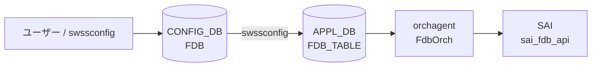

# FDB テーブル

## 概要

[CONFIG_DB](../../reference/glossary.md#term-config_db) の `FDB` テーブルは**静的 MAC アドレス エントリ**をプロビジョニングするテーブルである[^1]。キー形式 `FDB|<VlanName>|<MAC>` で VLAN とMACアドレスを指定し、送出ポートとエントリ種別を保持する。

動的に学習された MAC エントリは APPL_DB の `FDB_TABLE` に書かれる。CONFIG_DB の `FDB` は静的エントリ（ユーザー手動設定や PAC/802.1X による設定）専用である。

<!-- defaults -->
## コード由来デフォルト

### field: `type`

`fdborch.cpp:770` で `string type = "dynamic";` と初期化される。`type` フィールドが省略されると `"dynamic"` がデフォルト値として使用される。

```cpp
// sonic-swss/orchagent/fdborch.cpp:769-770
string port = "";
string type = "dynamic";
```

有効値: `"static"` / `"dynamic"` / `"dynamic_local"`（MCLAG ローカル扱い）。

### field: `port`

`fdborch.cpp:769` で `string port = "";` と初期化される。`port` フィールドが省略されると空文字のまま `addFdbEntry()` に渡され、ポート解決に失敗するため FDB エントリが登録されない。実装上は必須フィールド。

### SAI 型マッピング

| `type` 値 | SAI 型 |
|-----------|--------|
| `"static"` | `SAI_FDB_ENTRY_TYPE_STATIC` |
| `"dynamic"` | `SAI_FDB_ENTRY_TYPE_DYNAMIC` |
| `"dynamic_local"` | `SAI_FDB_ENTRY_TYPE_DYNAMIC`（MCLAG ローカル） |

<!-- /defaults -->

<!-- constants -->
## ハードコード定数

### FDB type 列挙値（文字列）

`fdborch.cpp:830` の assert が受け入れる有効文字列:

| 文字列値 | 意味 |
|---------|------|
| `"static"` | 静的エントリ。エージングしない。手動 / PAC プロビジョニング |
| `"dynamic"` | 動的エントリ。エージングによって削除される |
| `"dynamic_local"` | MCLAG ローカル扱い。SAI 上は DYNAMIC だがフラッシュ除外対象 |

有効値以外が渡ると `assert()` でプロセスクラッシュ (`fdborch.cpp:830`)。

### SAI FDB エントリ属性（`sai_fdb_entry_attr_t`）

`addFdbEntry()` 内で設定される SAI 属性一覧 (`fdborch.cpp:1424–1497`):

| SAI 属性 ID | 設定値 / 条件 | コード行 |
|------------|--------------|---------|
| `SAI_FDB_ENTRY_ATTR_TYPE` | `SAI_FDB_ENTRY_TYPE_STATIC` / `SAI_FDB_ENTRY_TYPE_DYNAMIC` | L1424–L1435 |
| `SAI_FDB_ENTRY_ATTR_BRIDGE_PORT_ID` | ポートの bridge port OID | L1449 |
| `SAI_FDB_ENTRY_ATTR_ALLOW_MAC_MOVE` | static エントリ時 `true` (MCLAG 連携) | L1444–L1445 |
| `SAI_FDB_ENTRY_ATTR_ENDPOINT_IP` | VxLAN リモート VTEP IP | L1467 / L1481 |
| `SAI_FDB_ENTRY_ATTR_PACKET_ACTION` | `SAI_PACKET_ACTION_DROP` (`discard="true"`) / `SAI_PACKET_ACTION_FORWARD` | L1496–L1497 |

### FDB フラッシュ属性（`sai_fdb_flush_attr_t`）

`flushFdbAll()` / `flushFdbByVlan()` で使用:

| SAI 属性 ID | 設定値 | コード行 |
|------------|--------|---------|
| `SAI_FDB_FLUSH_ATTR_ENTRY_TYPE` | `SAI_FDB_FLUSH_ENTRY_TYPE_DYNAMIC`（static はフラッシュしない） | L949, L1122, L1162 |
| `SAI_FDB_FLUSH_ATTR_BV_ID` | VLAN の BV OID | L1116, L1159 |
| `SAI_FDB_FLUSH_ATTR_BRIDGE_PORT_ID` | ポートの bridge port OID | L1109 |

### FDB Origin 列挙値（`FdbOrigin` enum）

`fdborch.h:8–14` 定義:

| 定数 | 値 | 意味 |
|------|----|------|
| `FDB_ORIGIN_INVALID` | `0` | 初期値・無効 |
| `FDB_ORIGIN_LEARN` | `1` | カーネル FDB 学習（自動） |
| `FDB_ORIGIN_PROVISIONED` | `2` | swssconfig / ユーザー設定 |
| `FDB_ORIGIN_VXLAN_ADVERTIZED` | `4` | BGP-EVPN VxLAN 広報 |
| `FDB_ORIGIN_MCLAG_ADVERTIZED` | `8` | MCLAG ピア広報 |

`removeFdbEntry()` のデフォルト引数は `FDB_ORIGIN_PROVISIONED` (`fdborch.h:101`)。

### `discard` フィールドのデフォルト

`fdborch.cpp:775`: `string discard = "false";` — フィールド省略時は `"false"`。

`discard="true"` の場合、SAI に `SAI_PACKET_ACTION_DROP` が設定される (`fdborch.cpp:1497`)。

<!-- /constants -->

## key 構造

```text
FDB|<VlanName>|<MAC>
```

- `<VlanName>`: `Vlan<id>` 形式 (例: `Vlan100`)
- `<MAC>`: MAC アドレス (例: `00:01:02:03:04:05`)

## フィールド一覧

| フィールド | 型 | 必須 | デフォルト | 説明 |
|-----------|----|------|-----------|------|
| `port` | string | 実質必須 | `""` (空) | 送出ポート名 (例: `Ethernet0`, `PortChannel1`) |
| `type` | `"static"` \| `"dynamic"` | - | `"dynamic"` | エントリ種別。静的プロビジョニングには `"static"` を使用 |

## 購読者

- **orchagent / FdbOrch**: APPL_DB の `FDB_TABLE` を購読して SAI FDB エントリを作成・削除する。CONFIG_DB `FDB` から APPL_DB `FDB_TABLE` への橋渡しは `swssconfig` が担う
- **PAC (sonic-pac) / paccfg**: 802.1X 認証後、CONFIG_DB `FDB` テーブルを読み出して静的 MAC エントリの有無を確認する (`pac_authmgrcfg.cpp:173`)

## データフロー



!!! note "動的学習エントリ"
    カーネルの FDB 学習イベントは `fdbsyncd` が netlink から受け取り APPL_DB の `FDB_TABLE` に直接書き込む。CONFIG_DB `FDB` を経由しない。

## 書き込み入り口

| 書き込み元 | コード箇所 | type 値 |
|-----------|----------|---------|
| `swssconfig` (手動投入) | `swssconfig -d -j fdb.json` | `"static"` が一般的 |
| PAC / 802.1X | `pac_authmgrcfg.cpp:64-76` | `"static"` |
| fdbsyncd (自動学習) | APPL_DB 直接 (CONFIG_DB を経由しない) | `"dynamic"` |

<!-- ordering -->
## 書込み順依存・タイミング依存 (Phase B)

`FdbOrch::doTask()` (`fdborch.cpp:707`) と `addFdbEntry()` (`fdborch.cpp:1277`) のコード精読から、以下の順序依存を確認した。

### 1. allPortsReady() ガード（hard block）

```cpp
// fdborch.cpp:711-714
if (!m_portsOrch->allPortsReady())
{
    return;
}
```

PortsOrch が全ポートを初期化完了するまで `doTask()` は即 return する。FDB エントリは **キューに残り**、ポート初期化完了後に一括処理される。`doTask(NotificationConsumer&)` も同等のガード (`fdborch.cpp:927`) を持つ。

→ `PORT` テーブルの初期化完了が FDB 処理より**hard 先行必須**。

### 2. VLAN 先行必須（VLAN OID 解決）

```cpp
// fdborch.cpp:739-760
if (!m_portsOrch->getPort(keys[0], vlan))
{
    SWSS_LOG_INFO("Failed to locate %s", keys[0].c_str());
    if (op == DEL_COMMAND) { ... erase ... }
    else { it++; }  // SET: 待機ループ
    continue;
}
```

キーの `<VlanName>` が PortsOrch の VLAN テーブルに未登録の場合、SET は `it++` で待機ループに入り毎サイクル再試行される。`addFdbEntry()` (`fdborch.cpp:1291-1294`) でも同様に VLAN OID を再確認し、取得失敗時は `return false`。

→ `VLAN|Vlan<id>` が VlanOrch に処理済み（SAI VLAN OID 確定）であることが FDB SET より**先行必須**（soft: 待機ループで自動調停）。

### 3. PORT（ブリッジポート OID）先行

```cpp
// fdborch.cpp:1298-1305
if (!m_portsOrch->getPort(port_name, port) || (port.m_bridge_port_id == SAI_NULL_OBJECT_ID))
{
    SWSS_LOG_INFO("Saving a fdb entry until port %s becomes active", port_name.c_str());
    saved_fdb_entries[port_name].push_back({entry.mac, vlan.m_vlan_info.vlan_id, fdbData});
    return true;
}
```

`port` フィールドに指定したポートが PortsOrch 未登録またはブリッジポート OID 未確定の場合、エントリを `saved_fdb_entries` に退避して待機する。ポートが後から有効化されると `SUBJECT_TYPE_PORT_OPER_STATE_CHANGE` イベント経由 (`fdborch.cpp:661`) で saved エントリが自動再投入される (`fdborch.cpp:1264-1268`)。

→ `port` フィールドのポートがブリッジポートとして確定済みであることが**推奨先行**（soft: 自動退避 + 再投入）。

### 4. VLAN_MEMBER 先行必須（メンバーシップ確認）

```cpp
// fdborch.cpp:1313-1318
if (!m_portsOrch->isVlanMember(vlan, port, end_point_ip))
{
    SWSS_LOG_INFO("Saving a fdb entry until port %s becomes vlan %s member", ...);
    saved_fdb_entries[port_name].push_back({entry.mac, vlan.m_vlan_info.vlan_id, fdbData});
    return true;
}
```

ポートが指定 VLAN のメンバーでない場合も同様に `saved_fdb_entries` に退避。`SUBJECT_TYPE_VLAN_MEMBER_CHANGE` イベント (`fdborch.cpp:655`) で VLAN メンバー追加後に自動再投入される。

→ `VLAN_MEMBER|Vlan<id>|<port>` が VlanOrch に処理済みであることが**推奨先行**（soft: 自動退避 + 再投入）。

### 5. 推奨投入順序

```
PORT / PORTCHANNEL  (hard: allPortsReady ガード)
  ↓
VLAN                (soft: VLAN OID 待機ループ)
  ↓
VLAN_MEMBER         (soft: saved_fdb_entries 退避 + VLAN_MEMBER_CHANGE 再投入)
  ↓
FDB                 (SAI create_fdb_entry)
```

ステップ 3/4 は違反時に自動調停されるが、初期起動時の一括投入ではステップ通りの順序が最も効率的である。

### 6. age out 動作順序

- **static エントリ**: `SAI_FDB_EVENT_AGED` 受信時、ポートが VLAN メンバーに残っていれば SAI FDB エントリを即再作成 (`fdborch.cpp:463-483`)。VLAN メンバーでない場合は `saved_fdb_entries` に退避し、VLAN_MEMBER 再追加後に復元される。
- **dynamic エントリ**: age event 受信後、内部キャッシュ (`m_entries`) と STATE_DB から削除。ハードウェアの MAC aging タイマーに従って削除される (`fdborch.cpp:534-543`)。
- **MCLAG remote エントリ**: age event を無視し、SAI に `SAI_FDB_ENTRY_TYPE_STATIC` として再追加される (`fdborch.cpp:490-517`)。aging 対象外。
- **PORT down 時 flush**: dynamic エントリのみが `flushFDBEntries()` でフラッシュされる。static エントリはポート down でも SAI から削除されない (`fdborch.cpp:1121-1127`)。

### 順序依存サマリ

| # | 依存関係 | 強度 | 緩和策 |
|---|----------|------|--------|
| 1 | allPortsReady() 完了 → FDB doTask 実行 | hard | なし（PortsOrch 起動待ち） |
| 2 | VLAN SAI OID 確定 → FDB SET | soft | 待機ループで自動再試行 |
| 3 | PORT ブリッジポート OID 確定 → FDB SET | soft | saved_fdb_entries + PORT_OPER_STATE 再投入 |
| 4 | VLAN_MEMBER 登録 → FDB SET | soft | saved_fdb_entries + VLAN_MEMBER_CHANGE 再投入 |
| 5 | static age out: VLAN_MEMBER 再追加で SAI 復元 | 自動 | VLAN_MEMBER_CHANGE イベント |
| 6 | PORT down: dynamic flush のみ、static は残存 | 挙動注意 | static は手動削除が必要 |

<!-- /ordering -->

## 関連 CONFIG_DB / YANG / CLI

- 関連 [CONFIG_DB](../../reference/glossary.md#term-config_db): `VLAN`、`VLAN_MEMBER`
- 関連 CLI: `show mac` (FDB テーブル表示)、`sonic-clear fdb all` (動的エントリクリア)

<!-- cross-refs -->
## 暗黙参照（テーブル間依存）

`FDB` テーブルのエントリを処理する際、`FdbOrch` は以下のテーブル・Orch に暗黙的に依存する。YANG の leafref 定義はなく、すべて実装レベルの依存である。

### PORT / PORTCHANNEL（`port` フィールド — 必須依存）

`addFdbEntry()` (`fdborch.cpp:1277–1320`) は `port` フィールドの値を `PortsOrch::getPort()` で解決してブリッジポート OID を取得する。PORT が未作成の場合はエントリを `saved_fdb_entries[port_name]` に保留する。保留エントリは VLAN_MEMBER への追加イベントをトリガとして再試行される。

### VLAN（key の `Vlan<id>` — 必須依存）

同じく `addFdbEntry()` でキーの `Vlan<id>` 部分を `PortsOrch::getPort()` で解決し、Bridge Vector ID (bv_id) を取得する。VLAN が未作成の場合もエントリは `saved_fdb_entries` に保留される。PORT と VLAN の両方が解決されて初めて SAI FDB エントリが作成される。

### VLAN_MEMBER（メンバー変化 — フラッシュ・再試行トリガ）

`FdbOrch` は `PortsOrch` の Observer として登録されており (`fdborch.cpp:39`、`SUBJECT_TYPE_VLAN_MEMBER_CHANGE` を購読)、`updateVlanMember()` (`fdborch.cpp:1240`) で以下を行う:

- **メンバー削除時**: `flushFDBEntries()` でそのポート・VLAN 組み合わせの動的 FDB エントリを SAI からフラッシュし (`SAI_FDB_FLUSH_ENTRY_TYPE_DYNAMIC`、静的エントリは保持)、`notifyObserversFDBFlush()` で `NeighOrch` への ARP flush 通知を連鎖させる。
- **メンバー追加時**: 保留中の `saved_fdb_entries` から対象 VLAN に一致するエントリを `addFdbEntry()` で再試行する。

### MCLAG (MlagOrch) — flush 抑制と remote エントリ管理

`FdbOrch` はポートダウン時の FDB flush に先立ち `gMlagOrch->isMlagInterface()` で MCLAG ポートかどうかを確認する (`fdborch.cpp:1209`)。MCLAG インタフェースの場合は flush をスキップする。また `FDB_ORIGIN_MCLAG_ADVERTIZED` 属性を持つ remote エントリは AGE イベントで削除されず SAI に再追加される (`fdborch.cpp:490–515`)。MCLAG remote → local への MAC move が発生すると `STATE_DB` の `MCLAG_REMOTE_FDB_TABLE` から該当エントリを削除する (`fdborch.cpp:126–129`)。

### NeighOrch — FDB flush 連鎖（上流通知）

`notifyObserversFDBFlush()` (`fdborch.cpp:1178`) は FDB エントリが flush された際に `SUBJECT_TYPE_FDB_FLUSH_CHANGE` を notify する。`NeighOrch` (`neighorch.cpp:195`) がこれを受け取り、当該ポート・VLAN の ARP/ND エントリを削除する。`FDB` テーブル自体には記載されないが、動的 FDB エントリが消えると ARP エントリも連鎖削除される副作用がある。

### VxlanTunnelOrch — EVPN remote MAC のトンネルポート解放

EVPN 経由で学習した `FDB_ORIGIN_VXLAN_TUNNEL` origin の FDB エントリが AGE または MOVE で消える際、`notifyTunnelOrch()` (`fdborch.cpp:1792`) を呼び `VxlanTunnelOrch::deleteTunnelPort()` でトンネルポートを解放する。

| 参照先 | 参照種別 | トリガ | コード箇所 |
|--------|---------|--------|-----------|
| `PORT` / `PORTCHANNEL` | OID 解決（必須） | 全 FDB エントリ処理 | `fdborch.cpp:1277–1320` |
| `VLAN` | OID 解決（必須） | 全 FDB エントリ処理 | `fdborch.cpp:1289–1295` |
| `VLAN_MEMBER` (削除) | イベント受信 → flush | メンバー削除 | `fdborch.cpp:1240–1249` |
| `VLAN_MEMBER` (追加) | イベント受信 → 再試行 | メンバー追加 | `fdborch.cpp:1254–1271` |
| `MlagOrch` | 条件分岐 | ポートダウン / AGE | `fdborch.cpp:1209, 490–515` |
| `NeighOrch` | 上流通知 | FDB flush 発生時 | `fdborch.cpp:1178–1201` |
| `VxlanTunnelOrch` | OID 解放 | EVPN MAC の aging/move | `fdborch.cpp:1792–1800` |

<!-- /cross-refs -->

## 例外条件・特殊挙動

- **`port` 省略時**: `addFdbEntry()` でポート解決が失敗し、エントリが追加されない。エラーログ出力。
- **`type` の assert チェック**: `fdborch.cpp:830` で `assert(type == "dynamic" || type == "dynamic_local" || type == "static")` — 無効な type 値はプロセスクラッシュを引き起こす。
- **CONFIG_DB FDB は直接 orchagent に購読されない**: `FdbOrch` は APPL_DB の `FDB_TABLE` を購読する。CONFIG_DB `FDB` は `swssconfig` を介して APPL_DB に転記される。

## 引用元

[^1]: `sonic-swss-common/common/schema.h:358` — `#define CFG_FDB_TABLE_NAME "FDB"`. <https://github.com/sonic-net/sonic-swss-common/blob/master/common/schema.h>
