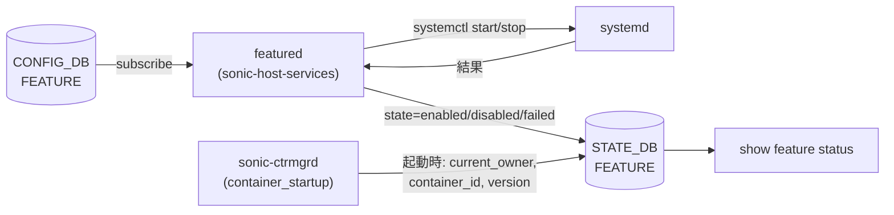

# FEATURE (STATE_DB)

## 概要

`STATE_DB` の `FEATURE` テーブルは、SONiC 機能 docker コンテナのランタイム状態を保持する読み取り専用テーブル[^1]。Config_DB の [`FEATURE`](feature.md) テーブルが設定を管理するのに対し、STATE_DB の `FEATURE` テーブルは実際の動作状態を反映する。

書き込み元は主に 2 つのデーモン:

- **`featured`** (`sonic-host-services`) — `systemctl start/stop` の結果を `state` フィールドに書き込む (`enabled` / `disabled` / `failed`)
- **`sonic-ctrmgrd`** (`sonic-buildimage`) — `container_startup.py` と `ctrmgrd.py` が起動時のコンテナ ID・バージョン・オーナー情報を書き込む。Kubernetes 管理機能でのみ使用される `container_stable_version` / `container_last_version` / `remote_state` も担当

!!! note "CONFIG_DB との関係"
    機能の **設定**（有効化・無効化・再起動ポリシー）は `CONFIG_DB` の [`FEATURE`](feature.md) テーブルで行う。本テーブルは `featured` と `sonic-ctrmgrd` が設定を処理した結果を反映する。

<!-- cdb-mermaid -->
### データフロー



<!-- /cdb-mermaid -->

## key 構造

```text
FEATURE|<name>
```

`<name>` は CONFIG_DB `FEATURE` テーブルと同じ feature 名（`bgp`、`teamd`、`snmp` 等）。

## フィールド一覧

| フィールド | 型 | 書込み主体 | デフォルト | 説明 |
|-----------|----|-----------|-----------|------|
| `state` | enum string | `featured` | なし（エントリなし） | コンテナの実動作状態。`enabled` / `disabled` / `failed` |
| `current_owner` | enum string | `container_startup.py` | `"none"` | 現在のコンテナ管理者。`local` / `kube` / `none` |
| `update_time` | string (datetime) | `container_startup.py` | `""` | 最終状態更新時刻。`"YYYY-MM-DD HH:MM:SS"` 形式 |
| `container_id` | string | `container_startup.py` | `""` | Docker コンテナ ID。local 管理時は feature 名、kube 管理時は 12 文字の Docker ID |
| `container_version` | string | `container_startup.py` | `"0.0.0"` | コンテナ イメージバージョン。`IMAGE_VERSION` 環境変数から取得 |
| `container_stable_version` | string | `ctrmgrd.py` | `""` | Kubernetes 管理のみ。`latest` タグ付け成功後の安定バージョン |
| `container_last_version` | string | `ctrmgrd.py` | `""` | Kubernetes 管理のみ。1 世代前の安定バージョン（ロールバック用） |
| `remote_state` | enum string | `container_startup.py` / `ctrmgrd.py` | `"none"` | Kubernetes リモート状態。`none` / `pending` / `running` / `ready` / `stopped` |
| `system_state` | string | 外部 health monitoring | `""` | コンテナのシステム状態。`"up"` / `"down"`。`container_startup.py` が読み込み専用で参照 |

## `state` フィールド詳細

### 書き込みトリガーと状態遷移

`featured` は以下のタイミングで `state` を STATE_DB に書き込む:

1. **`enable_feature()` 成功後** — `systemctl start` + `enable` 成功 → `"enabled"`
2. **`disable_feature()` 成功後** — `systemctl stop` + `disable` 成功 → `"disabled"`
3. **systemctl コマンド失敗時** — `subprocess.call()` が非ゼロ終了 → `"failed"`
4. **feature 削除時** — `FeatureHandler.handler()` で `feature_cfg` が空の場合 → STATE_DB エントリを `_del()` で削除

### 取り得る値

| 値 | 設定タイミング | 意味 |
|----|-------------|------|
| `"enabled"` | `systemctl start/enable` 成功後 | コンテナが正常起動・動作中 |
| `"disabled"` | `systemctl stop/disable` 成功後 | コンテナが正常停止中 |
| `"failed"` | `systemctl` コマンド失敗後 | コンテナ操作が失敗。手動介入が必要 |
| (エントリなし) | `featured` 起動前、または feature 削除後 | STATE_DB に存在しない。`sonic-db-cli` は空文字列を返す |

## `remote_state` フィールド詳細（Kubernetes 管理）

Kubernetes (`set_owner = kube`) 使用時の状態遷移:

| 値 | 意味 | 遷移タイミング |
|---|---|---|
| `"none"` | Kubernetes 管理外または初期状態 | ctrmgrd 未稼働時 / 初期化時 |
| `"pending"` | k8s からのコンテナ起動を待機中 | `container_startup.py` が kube コンテナ起動時に設定 |
| `"running"` | k8s コンテナが起動完了 | `container_startup.py` の `update_state()` で `REMOTE_STATE: "running"` を書き込む |
| `"ready"` | k8s コンテナが readiness probe 通過 | `ctrmgrd` が ctrmgrd→k8s 通信経由で設定 |
| `"stopped"` | k8s コンテナが停止 | ctrmgrd が停止を検出した際に設定 |

`remote_state == "running"` を `ctrmgrd.py` が検知すると、`latest` タグの付け直し処理 (`do_tag_latest()`) が起動する。

## `system_state` フィールド詳細

`container_startup.py` が container_up 処理の判断に使用する読み取り専用フィールド:

- `"up"`: コンテナの起動処理を続行
- `"down"`: コンテナを freeze 状態（無限 sleep）に移行
- `""` (空文字列): `container_startup.py` の `container_up()` が即座に return（処理スキップ）

このフィールドの書き込み元は `featured` / `ctrmgrd` のコードには見当たらない。外部の health monitoring ツール（system_health や monit）が書き込むと推定される。

<!-- value-behavior -->
## 値依存挙動マトリクス

### `state` (enum string)

| 値 | `featured` の動作 | `system_health` / `check_up_status` |
|---|---|---|
| `"enabled"` | systemctl start/enable 成功 → STATE_DB に書き込み | `check_up_status = true` の場合に監視対象 |
| `"disabled"` | systemctl stop/disable 成功 → STATE_DB に書き込み | 監視対象外 |
| `"failed"` | systemctl 失敗 → STATE_DB に書き込み | `check_up_status = true` の場合にアラート対象 |
| (エントリなし) | feature 未登録または featured 未起動 | 監視不可 |

### `current_owner` (enum string)

| 値 | コンテナ管理方式 | `container_id` の内容 |
|---|---|---|
| `"local"` | ローカル Docker イメージで管理 | feature 名 (例: `"bgp"`) |
| `"kube"` | Kubernetes クラスタが管理 | 12 文字の Docker コンテナ ID |
| `"none"` | 未起動または初期状態 | `""` |

<!-- /value-behavior -->

## 購読者 (consumer)

| プロセス | 参照フィールド | 用途 |
|---------|-------------|------|
| `show feature status` (`sonic-utilities`) | 全フィールド | ユーザー向け機能状態表示 |
| `container_checker` (`monit`) | `container_id` | 実行中コンテナの監視。`container_id` が非空 → 実行中と判定 |
| `ctrmgrd` | `remote_state`, `current_owner`, `container_id`, `container_version` | Kubernetes 連携の状態管理 |
| `container_startup.py` | `system_state`, `remote_state`, `container_version` | コンテナ起動判断 |

<!-- defaults -->
## フィールド暗黙デフォルト (Phase A — コード由来)

YANG schema が存在しないため、すべてのデフォルトはコードの変数初期化から由来する。

| フィールド | コード由来デフォルト | fallback 源 |
|-----------|-------------------|------------|
| `state` | なし (エントリ不在) | featured 起動前は STATE_DB に書き込まれない。`show feature status` は空文字列を表示 |
| `current_owner` | `"none"` | `container_startup.py:46` の `state_data` dict 初期化 / `ctrmgrd.py:93` の `dflt_st_feat` |
| `update_time` | `""` | `container_startup.py:47` / `ctrmgrd.py:94` |
| `container_id` | `""` | `container_startup.py:48` / `ctrmgrd.py:95` |
| `container_version` | `"0.0.0"` | `container_startup.py:50` の state_data dict 初期化。`ctrmgrd.py:96` は `""` |
| `container_stable_version` | `""` | `ctrmgrd.py:97` の `dflt_st_feat`。Kubernetes 管理のみ書き込まれる |
| `container_last_version` | `""` | `ctrmgrd.py:98` の `dflt_st_feat`。Kubernetes 管理のみ書き込まれる |
| `remote_state` | `"none"` | `container_startup.py:49` / `ctrmgrd.py:99` |
| `system_state` | `""` | `container_startup.py:51` / `ctrmgrd.py:100`。`""` の場合 `container_up()` は処理をスキップ |

### 発見した暗黙挙動・特殊ケース

1. **`container_version` の 2 種類の fallback**: `container_startup.py` は `"0.0.0"` を初期値として使用するが、`ctrmgrd.py` の `dflt_st_feat` では `""` を使用する。ctrmgrd が state_db から読み込む際には `ctrmgrd.py:96` の `""` が基準となる。

2. **`system_state == ""` 時の container_up スキップ**: `container_startup.py:223` の `if state_data[SYSTEM_STATE] == '': return` により、`system_state` が空の場合（ctrmgrd 未稼働時など）は `container_up()` が即座に return し、コンテナの main application 起動が許可される。これは Kubernetes 管理なしの通常動作では期待通りの挙動である。

3. **ローカル管理時は `container_stable_version` / `container_last_version` / `remote_state` が書き込まれない**: これらのフィールドは `ctrmgrd.py` の Kubernetes 連携処理のみが書き込む。`set_owner = local` の機能では `dflt_st_feat` の空文字列 / `"none"` のままである。

4. **`state` フィールドは `featured` のみが管理**: `container_startup.py` も `ctrmgrd.py` も `state` フィールドを STATE_DB に書き込まない。CONFIG_DB `FEATURE.state` の変化に応じた systemd 操作結果のみが反映される。

5. **feature 削除時は STATE_DB エントリごと削除**: CONFIG_DB から feature エントリが消えると `featured` の `handler()` が `_feature_state_table._del(feature_name)` を呼び出してエントリ全体を削除する（`featured:190`）。

> **Evidence**: `sonic-host-services/scripts/featured:132-134,190,344,510,513,544,547,585-590`; `sonic-buildimage/src/sonic-ctrmgrd/ctrmgr/container_startup.py:16-51,164-186,201-268`; `sonic-buildimage/src/sonic-ctrmgrd/ctrmgr/ctrmgrd.py:47-54,92-101,593-612`; `sonic-buildimage/src/sonic-ctrmgrd/ctrmgr/container.py:23-28,99-111`; `sonic-utilities/show/feature.py:44-53`

<!-- /defaults -->

<!-- cdb-exceptions -->
## 例外条件・特殊挙動

| consumer | 条件 | 挙動 |
|---|---|---|
| `featured` | `FEATURE_EXCLUSION_LIST` に含まれる feature (`telemetry`, `frr_bmp`) | `enable_feature()` / `disable_feature()` をスキップ。STATE_DB の `state` フィールドは変化しない (`featured:135,517-519`) |
| `featured` | `set_owner = kube` での SpineRouter + syncd/gbsyncd | CONFIG_DB の `auto_restart` を無視して `Restart=no` を強制。STATE_DB の `state` は通常通り書き込まれる |
| `container_startup.py` | `system_state == ""` (ctrmgrd 未稼働または Kubernetes 管理なし) | `container_up()` が即座に return。STATE_DB の書き込みなし (`container_startup.py:223-224`) |
| `container_startup.py` | kube コンテナで `set_owner == "local"` に変更されていた場合 | `do_freeze()` で無限 sleep。コンテナは main application を起動しない |
| `container_startup.py` | 同一 feature に旧バージョンが `drop_label` でブロックされている場合 | `do_freeze()` で無限 sleep |
| `ctrmgrd.py` | `do_tag_latest()` でタグ付け失敗 | リトライタイマー登録。`container_stable_version` / `container_last_version` は更新されない |

<!-- /cdb-exceptions -->

<!-- ops-hint -->
## 運用ヒント

### STATE_DB 確認コマンド

```bash
# FEATURE テーブルの key 一覧
sonic-db-cli STATE_DB keys 'FEATURE|*'

# 特定 feature の全フィールド確認
sonic-db-cli STATE_DB hgetall 'FEATURE|bgp'

# state フィールドのみ確認
sonic-db-cli STATE_DB hget 'FEATURE|bgp' state

# CLI からの確認 (CONFIG_DB + STATE_DB を結合して表示)
show feature status
show feature status bgp
```

### よくある確認ポイント

- `state` が `"failed"` の場合: `systemctl status <feature>` でエラー詳細を確認
- `state` がエントリなしの場合: `featured` デーモンが未起動か、feature が CONFIG_DB に未登録
- `current_owner` が `"none"` のまま: `sonic-ctrmgrd` (ctrmgrd.service) が動作しているか確認。ローカル管理のみの環境では ctrmgrd が不要な場合もある
- `remote_state` が `"pending"` で止まっている場合: Kubernetes クラスタ (`KUBERNETES_MASTER`) の接続状態を `show kube server` で確認

<!-- /ops-hint -->

## 関連リファレンス

- CONFIG_DB: [`FEATURE`](feature.md) — 機能の有効化・無効化設定
- CONFIG_DB: [`KUBERNETES_MASTER`](kubernetes-master.md) — Kubernetes クラスタ接続設定
- CLI: `show feature status`, `show feature config`

<!-- ref-triangle:start -->

## 関連リファレンス

- CONFIG_DB: [`FEATURE`](feature.md)
- CONFIG_DB: [`KUBERNETES_MASTER`](kubernetes-master.md)

<!-- ref-triangle:end -->

## 引用元

[^1]: `sonic-host-services/scripts/featured` (L132-134 定数, L190 _del, L344,510,513,544,547 state 遷移, L585-590 set_feature_state); `sonic-buildimage/src/sonic-ctrmgrd/ctrmgr/container_startup.py` (L16-51 定数・デフォルト, L164-186 update_state, L201-268 container_up); `sonic-buildimage/src/sonic-ctrmgrd/ctrmgr/ctrmgrd.py` (L47-54 定数, L92-101 dflt_st_feat, L593-612 do_tag_latest). <https://github.com/sonic-net/sonic-host-services/blob/master/scripts/featured>
