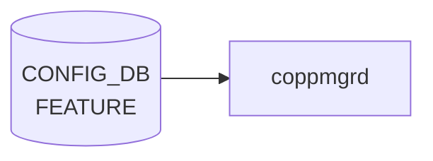

# FEATURE (STATE_DB)

## 概要

`STATE_DB` の `FEATURE` テーブルは、[SONiC](../../reference/glossary.md#term-sonic) 機能 docker コンテナのランタイム状態を保持する読み取り専用テーブル[^1]。Config_DB の [`FEATURE`](feature.md) テーブルが設定を管理するのに対し、[STATE_DB](../../reference/glossary.md#term-state_db) の `FEATURE` テーブルは実際の動作状態を反映する。

書き込み元は主に 2 つのデーモン:

- **`featured`** (`sonic-host-services`) — `systemctl start/stop` の結果を `state` フィールドに書き込む (`enabled` / `disabled` / `failed`)
- **`sonic-ctrmgrd`** (`sonic-buildimage`) — `container_startup.py` と `ctrmgrd.py` が起動時のコンテナ ID・バージョン・オーナー情報を書き込む。Kubernetes 管理機能でのみ使用される `container_stable_version` / `container_last_version` / `remote_state` も担当

!!! note "CONFIG_DB との関係"
    機能の **設定**（有効化・無効化・再起動ポリシー）は `CONFIG_DB` の [`FEATURE`](feature.md) テーブルで行う。本テーブルは `featured` と `sonic-ctrmgrd` が設定を処理した結果を反映する。

<!-- cdb-mermaid -->
### データフロー (自動生成)



!!! note "凡例"
    CONFIG_DB から SAI までの典型経路を `docs/reference/config-db-orch-map.md` から機械生成したミニ図。詳細・例外は本ページ本文と対応表を参照。
<!-- /cdb-mermaid -->

## key 構造

```text
FEATURE|<name>
```

`<name>` は [CONFIG_DB](../../reference/glossary.md#term-config_db) `FEATURE` テーブルと同じ feature 名（`bgp`、`teamd`、`snmp` 等）。

## フィールド一覧

| フィールド | 型 | 書込み主体 | デフォルト | 説明 |
|-----------|----|-----------|-----------|------|
| `state` | enum string | `featured` | なし（エントリなし） | コンテナの実動作状態。`enabled` / `disabled` / `failed` |
| `current_owner` | enum string | `container_startup.py` | `"none"` | 現在のコンテナ管理者。`local` / `kube` / `none` |
| `update_time` | string (datetime) | `container_startup.py` | `""` | 最終状態更新時刻。`"YYYY-MM-DD HH:MM:SS"` 形式 |
| `container_id` | string | `container_startup.py` | `""` | Docker コンテナ ID。local 管理時は feature 名、kube 管理時は 12 文字の Docker ID |
| `container_version` | string | `container_startup.py` | `"0.0.0"` | コンテナ イメージバージョン。`IMAGE_VERSION` 環境変数から取得 |
| `container_stable_version` | string | `ctrmgrd.py` | `""` | Kubernetes 管理のみ。`latest` タグ付け成功後の安定バージョン |
| `container_last_version` | string | `ctrmgrd.py` | `""` | Kubernetes 管理のみ。1 世代前の安定バージョン（ロールバック用） |
| `remote_state` | enum string | `container_startup.py` / `ctrmgrd.py` | `"none"` | Kubernetes リモート状態。`none` / `pending` / `running` / `ready` / `stopped` |
| `system_state` | string | 外部 health monitoring | `""` | コンテナのシステム状態。`"up"` / `"down"`。`container_startup.py` が読み込み専用で参照 |

## `state` フィールド詳細

### 書き込みトリガーと状態遷移

`featured` は以下のタイミングで `state` を [STATE_DB](../../reference/glossary.md#term-state_db) に書き込む:

1. **`enable_feature()` 成功後** — `systemctl start` + `enable` 成功 → `"enabled"`
2. **`disable_feature()` 成功後** — `systemctl stop` + `disable` 成功 → `"disabled"`
3. **systemctl コマンド失敗時** — `subprocess.call()` が非ゼロ終了 → `"failed"`
4. **feature 削除時** — `FeatureHandler.handler()` で `feature_cfg` が空の場合 → [STATE_DB](../../reference/glossary.md#term-state_db) エントリを `_del()` で削除

### 取り得る値

| 値 | 設定タイミング | 意味 |
|----|-------------|------|
| `"enabled"` | `systemctl start/enable` 成功後 | コンテナが正常起動・動作中 |
| `"disabled"` | `systemctl stop/disable` 成功後 | コンテナが正常停止中 |
| `"failed"` | `systemctl` コマンド失敗後 | コンテナ操作が失敗。手動介入が必要 |
| (エントリなし) | `featured` 起動前、または feature 削除後 | STATE_DB に存在しない。`sonic-db-cli` は空文字列を返す |

## `remote_state` フィールド詳細（Kubernetes 管理）

Kubernetes (`set_owner = kube`) 使用時の状態遷移:

| 値 | 意味 | 遷移タイミング |
|---|---|---|
| `"none"` | Kubernetes 管理外または初期状態 | ctrmgrd 未稼働時 / 初期化時 |
| `"pending"` | k8s からのコンテナ起動を待機中 | `container_startup.py` が kube コンテナ起動時に設定 |
| `"running"` | k8s コンテナが起動完了 | `container_startup.py` の `update_state()` で `REMOTE_STATE: "running"` を書き込む |
| `"ready"` | k8s コンテナが readiness probe 通過 | `ctrmgrd` が ctrmgrd→k8s 通信経由で設定 |
| `"stopped"` | k8s コンテナが停止 | ctrmgrd が停止を検出した際に設定 |

`remote_state == "running"` を `ctrmgrd.py` が検知すると、`latest` タグの付け直し処理 (`do_tag_latest()`) が起動する。

## `system_state` フィールド詳細

`container_startup.py` が container_up 処理の判断に使用する読み取り専用フィールド:

- `"up"`: コンテナの起動処理を続行
- `"down"`: コンテナを freeze 状態（無限 sleep）に移行
- `""` (空文字列): `container_startup.py` の `container_up()` が即座に return（処理スキップ）

このフィールドの書き込み元は `featured` / `ctrmgrd` のコードには見当たらない。外部の health monitoring ツール（system_health や monit）が書き込むと推定される。

<!-- value-behavior -->
## 値依存挙動マトリクス

### `state` (enum string)

| 値 | `featured` の動作 | `system_health` / `check_up_status` |
|---|---|---|
| `"enabled"` | systemctl start/enable 成功 → STATE_DB に書き込み | `check_up_status = true` の場合に監視対象 |
| `"disabled"` | systemctl stop/disable 成功 → STATE_DB に書き込み | 監視対象外 |
| `"failed"` | systemctl 失敗 → STATE_DB に書き込み | `check_up_status = true` の場合にアラート対象 |
| (エントリなし) | feature 未登録または featured 未起動 | 監視不可 |

### `current_owner` (enum string)

| 値 | コンテナ管理方式 | `container_id` の内容 |
|---|---|---|
| `"local"` | ローカル Docker イメージで管理 | feature 名 (例: `"bgp"`) |
| `"kube"` | Kubernetes クラスタが管理 | 12 文字の Docker コンテナ ID |
| `"none"` | 未起動または初期状態 | `""` |

<!-- /value-behavior -->

## 購読者 (consumer)

| プロセス | 参照フィールド | 用途 |
|---------|-------------|------|
| `show feature status` (`sonic-utilities`) | 全フィールド | ユーザー向け機能状態表示 |
| `container_checker` (`monit`) | `container_id` | 実行中コンテナの監視。`container_id` が非空 → 実行中と判定 |
| `ctrmgrd` | `remote_state`, `current_owner`, `container_id`, `container_version` | Kubernetes 連携の状態管理 |
| `container_startup.py` | `system_state`, `remote_state`, `container_version` | コンテナ起動判断 |

<!-- defaults -->
## フィールド暗黙デフォルト (Phase A — コード由来)

[YANG](../../reference/glossary.md#term-yang) schema が存在しないため、すべてのデフォルトはコードの変数初期化から由来する。

| フィールド | コード由来デフォルト | fallback 源 |
|-----------|-------------------|------------|
| `state` | なし (エントリ不在) | featured 起動前は STATE_DB に書き込まれない。`show feature status` は空文字列を表示 |
| `current_owner` | `"none"` | `container_startup.py:46` の `state_data` dict 初期化 / `ctrmgrd.py:93` の `dflt_st_feat` |
| `update_time` | `""` | `container_startup.py:47` / `ctrmgrd.py:94` |
| `container_id` | `""` | `container_startup.py:48` / `ctrmgrd.py:95` |
| `container_version` | `"0.0.0"` | `container_startup.py:50` の state_data dict 初期化。`ctrmgrd.py:96` は `""` |
| `container_stable_version` | `""` | `ctrmgrd.py:97` の `dflt_st_feat`。Kubernetes 管理のみ書き込まれる |
| `container_last_version` | `""` | `ctrmgrd.py:98` の `dflt_st_feat`。Kubernetes 管理のみ書き込まれる |
| `remote_state` | `"none"` | `container_startup.py:49` / `ctrmgrd.py:99` |
| `system_state` | `""` | `container_startup.py:51` / `ctrmgrd.py:100`。`""` の場合 `container_up()` は処理をスキップ |

### 発見した暗黙挙動・特殊ケース

1. **`container_version` の 2 種類の fallback**: `container_startup.py` は `"0.0.0"` を初期値として使用するが、`ctrmgrd.py` の `dflt_st_feat` では `""` を使用する。ctrmgrd が state_db から読み込む際には `ctrmgrd.py:96` の `""` が基準となる。

2. **`system_state == ""` 時の container_up スキップ**: `container_startup.py:223` の `if state_data[SYSTEM_STATE] == '': return` により、`system_state` が空の場合（ctrmgrd 未稼働時など）は `container_up()` が即座に return し、コンテナの main application 起動が許可される。これは Kubernetes 管理なしの通常動作では期待通りの挙動である。

3. **ローカル管理時は `container_stable_version` / `container_last_version` / `remote_state` が書き込まれない**: これらのフィールドは `ctrmgrd.py` の Kubernetes 連携処理のみが書き込む。`set_owner = local` の機能では `dflt_st_feat` の空文字列 / `"none"` のままである。

4. **`state` フィールドは `featured` のみが管理**: `container_startup.py` も `ctrmgrd.py` も `state` フィールドを STATE_DB に書き込まない。[CONFIG_DB](../../reference/glossary.md#term-config_db) `FEATURE.state` の変化に応じた systemd 操作結果のみが反映される。

5. **feature 削除時は STATE_DB エントリごと削除**: [CONFIG_DB](../../reference/glossary.md#term-config_db) から feature エントリが消えると `featured` の `handler()` が `_feature_state_table._del(feature_name)` を呼び出してエントリ全体を削除する（`featured:190`）。

> **Evidence**: `sonic-host-services/scripts/featured:132-134,190,344,510,513,544,547,585-590`; `sonic-buildimage/src/sonic-ctrmgrd/ctrmgr/container_startup.py:16-51,164-186,201-268`; `sonic-buildimage/src/sonic-ctrmgrd/ctrmgr/ctrmgrd.py:47-54,92-101,593-612`; `sonic-buildimage/src/sonic-ctrmgrd/ctrmgr/container.py:23-28,99-111`; `sonic-utilities/show/feature.py:44-53`

<!-- /defaults -->

<!-- ordering -->
## 書込み順依存 (Phase B)

`featured` は CONFIG_DB `FEATURE` テーブルを subscribe し、変化を検知した順に systemctl 操作を行い、その結果を STATE_DB `FEATURE` テーブルに書き込む。`sonic-ctrmgrd` (`container_startup.py`) は各コンテナ起動スクリプト内から独立して STATE_DB に書き込む。両者の書込み順は並行して発生し、以下の依存関係が存在する。

### 検出された順序依存

| # | 依存関係 | 方向 | 緩和策 |
|---|----------|------|--------|
| 1 | `featured` 起動 → CONFIG_DB 接続完了 → `FEATURE` subscribe → `state` 書込み | 強制先行（connect 完了後のみ） | 起動直後は STATE_DB に `state` フィールドが存在しない。`show feature status` は空文字列を表示 |
| 2 | `delayed=True` feature: APP_DB `PORT_TABLE` 初期化 (または `PORT_INIT_TIMEOUT_SEC=180s` 経過) → `enable_feature()` 実行 → `state=enabled` 書込み | **強制先行** | 遅延 feature は port init 完了か timeout まで systemctl start を発行しない。timeout 前は STATE_DB に `state` が書かれない (`featured:273-274,647-660`) |
| 3 | `RestartWaiter.waitAdvancedBootDone()` 完了 → feature 処理開始 | 強制先行（warm/fast boot 時） | advanced boot（warm/fast boot）中は `featured` が ready 待機するため、STATE_DB への書込みが遅延する (`featured:607-609`) |
| 4 | `enable_feature()` の各 feature インスタンス loop → 最後のインスタンス完了後 `set_feature_state(ENABLED)` | 強制先行（loop 内直列） | multi-asic 環境では全 namespace のインスタンスの systemctl start が順次完了するまで `state` は書き込まれない (`featured:513`) |
| 5 | `featured` が `state` を STATE_DB 書込 → `ctrmgrd` の `container_startup.py` が `current_owner` / `container_id` 等を独立に書込 | **非同期・独立** | 両者は同一エントリを別フィールドに書き込む。`state` と `current_owner` は書込み主体が異なるため中間状態（`state=enabled` だが `current_owner=""` など）が観測されうる |
| 6 | CONFIG_DB `FEATURE` エントリ削除 → `featured` の `handler()` が `_del()` を発行 → STATE_DB エントリ全体が消える | 強制先行（DELETE イベント後） | エントリ削除後に `ctrmgrd` が旧フィールドを書き込もうとすると、エントリが再生成される可能性がある（タイミング依存）(`featured:190`) |

### 主要な制約詳細

**delayed feature の初期化遅延 (依存 #2)**: `featured` は APP_DB `PORT_TABLE` を subscribe し、`port_listener()` が最初の PORT エントリ変化を受け取ると `enable_delayed_services()` を呼び出す。`PORT_INIT_TIMEOUT_SEC`（180 秒）が経過しても PORT イベントが来ない場合はタイムアウトで強制 enable される。この間、`delayed=True` な feature（例: `lldp`）の `state` フィールドは STATE_DB に存在しないか、初期値のままとなる（evidence: `featured:23-24,143,163-177,647-660`）。

**advanced boot 待機 (依存 #3)**: warm boot / fast boot 時は `RestartWaiter.isAdvancedBootInProgress()` が真を返し、`waitAdvancedBootDone()` が STATE_DB の ready 状態を待機する。この待機中は `FEATURE` テーブルの subscribe ループが開始されないため、STATE_DB への `state` 書込みが数秒〜数分遅延しうる（evidence: `featured:607-609`）。

**`state` と `current_owner` の独立書込み (依存 #5)**: `state` は `featured` のみが書き込み、`current_owner` / `container_id` / `container_version` / `remote_state` は `container_startup.py` が書き込む。両者は別プロセスであり [Redis](../../reference/glossary.md#term-redis) の atomic HSET でフィールドを個別更新するため、consumer は「`state=enabled` かつ `current_owner=none`」という中間状態を観測しうる。`show feature status` は STATE_DB を直接読むため、この中間状態がそのまま表示される（evidence: `featured:585-590`; `container_startup.py:164-186`）。

> **Evidence**: `sonic-host-services/scripts/featured:23-24,143,163-177,273-274,510-513,544-547,585-590,607-609,644-660,190`

<!-- /ordering -->

<!-- cross-refs -->
## 暗黙参照テーブル (Phase C)

STATE_DB `FEATURE` テーブルは `featured` と `sonic-ctrmgrd` が書き手であり、書き込み内容の決定に以下のテーブル・リソースを参照する。

| 参照先テーブル / リソース | 参照方向 | 条件 | 参照元 evidence |
|--------------------------|---------|------|----------------|
| `FEATURE\|<name>` (CONFIG_DB) | 購読トリガ + フィールド読込 | 常時。`featured` が SubscriberStateTable で購読し、SET/DEL イベントを受け取ると `state` フィールドを STATE_DB に書き込む | `featured:601,617-623,644-648`; `container_startup.py:57-62` |
| `DEVICE_METADATA\|localhost` (CONFIG_DB) | 読込のみ | 起動時 1 回。`type` フィールドから device_type（SpineRouter 等）を判定し、[syncd](../../reference/glossary.md#term-syncd)/gbsyncd の `auto_restart` 上書き可否を決定する | `featured:617`; `featured:374` |
| `PORT_TABLE\|PortInitDone` ([APPL_DB](../../reference/glossary.md#term-appl_db)) | 購読トリガ | `delayed=True` な feature のみ。`PortInitDone` SET イベントを受け取ると `enable_delayed_services()` が実行され、STATE_DB への `state=enabled` 書込みが初めて発生する | `featured:647-649`; `featured:182-184` |
| `FEATURE\|<name>` (STATE_DB — 自己参照) | 読込のみ | `container_startup.py` が `read_data()` で同じ STATE_DB エントリを読み込み、`current_owner` / `container_version` / `remote_state` の現在値を確認してから書き込む | `container_startup.py:64-68`; `container_startup.py:164-186` |
| `KUBE_LABELS\|SET` (STATE_DB) | 読込 + 書込 | `set_owner=kube` 時のみ。`container_startup.py` が `check_version_blocked()` でバージョンブロックを確認し、`drop_label()` でバージョンラベルを書き込む。`ctrmgrd.py` が kube API から取得したラベルを同テーブルに反映する | `container_startup.py:90-106`; `ctrmgrd.py:305-307` |
| `KUBERNETES_MASTER\|SERVER` (CONFIG_DB / STATE_DB) | 読込 (CONFIG_DB) + 書込 (STATE_DB) | Kubernetes 連携時のみ。`ctrmgrd.py` が CONFIG_DB の接続先情報を読み込み、接続状態を STATE_DB `KUBERNETES_MASTER` に書き込む。STATE_DB `FEATURE` の `remote_state` 書込みは k8s 連携成立後に行われる | `ctrmgrd.py:29,334-342` |
| `IMAGE_VERSION` 環境変数 | プロセス環境変数読込 | コンテナ起動時。`container_startup.py` が `container_version` フィールドの値として `os.environ.get('IMAGE_VERSION', '0.0.0')` を使用する | `container_startup.py:50,176` |
| `RestartWaiter` (STATE_DB 内部機構) | 状態読込 | warm/fast boot 時のみ。`featured` 起動時に `isAdvancedBootInProgress()` が STATE_DB の boot 完了フラグを確認し、`waitAdvancedBootDone()` が完了するまで全 FEATURE 処理を保留する | `featured:607-609` |

!!! note "STATE_DB FEATURE は「書き出し専用」レジスタではない"
    `container_startup.py` は STATE_DB `FEATURE` エントリを読み込んでから書き込む（read-modify-write）。
    `featured` の `handler()` が `_del()` でエントリを削除した直後に `container_startup.py` が書き込もうとすると、エントリが再生成される可能性がある（`featured:190`; `container_startup.py:113-115`）。

!!! note "namespace STATE_DB への伝搬"
    multi-asic 環境では `featured` が `set_feature_state()` 内でホスト DB への書込み後、`ns_feature_state_tbl` に登録した各 namespace の STATE_DB にも同じ `state` 値を書き込む（`featured:588-590`）。各 namespace DB は独立した Redis インスタンスであり、書込みは逐次ループで処理される。

<!-- /cross-refs -->

<!-- cdb-exceptions -->
## 例外条件・特殊挙動

| consumer | 条件 | 挙動 |
|---|---|---|
| `featured` | `FEATURE_EXCLUSION_LIST` に含まれる feature (`telemetry`, `frr_bmp`) | `enable_feature()` / `disable_feature()` をスキップ。STATE_DB の `state` フィールドは変化しない (`featured:135,517-519`) |
| `featured` | `set_owner = kube` での SpineRouter + [syncd](../../reference/glossary.md#term-syncd)/gbsyncd | CONFIG_DB の `auto_restart` を無視して `Restart=no` を強制。STATE_DB の `state` は通常通り書き込まれる |
| `container_startup.py` | `system_state == ""` (ctrmgrd 未稼働または Kubernetes 管理なし) | `container_up()` が即座に return。STATE_DB の書き込みなし (`container_startup.py:223-224`) |
| `container_startup.py` | kube コンテナで `set_owner == "local"` に変更されていた場合 | `do_freeze()` で無限 sleep。コンテナは main application を起動しない |
| `container_startup.py` | 同一 feature に旧バージョンが `drop_label` でブロックされている場合 | `do_freeze()` で無限 sleep |
| `ctrmgrd.py` | `do_tag_latest()` でタグ付け失敗 | リトライタイマー登録。`container_stable_version` / `container_last_version` は更新されない |

<!-- /cdb-exceptions -->

<!-- failure -->
## 失敗挙動マトリクス (Phase D)

ソース: `sonic-net/sonic-host-services/scripts/featured`; `sonic-net/sonic-buildimage/src/sonic-ctrmgrd/ctrmgr/container_startup.py`

### `featured` — SET 処理における失敗経路

| 失敗条件 | 検出箇所 | STATE_DB への影響 | ログ出力 | evidence |
|---|---|---|---|---|
| `feature_cfg` が空 (DEL イベント) | `handler()` L187 | `_feature_state_table._del(feature_name)` → STATE_DB エントリ全削除 | LOG_INFO "Deregistering feature..." | `featured:187-191` |
| `enable_feature()` 内で `systemctl start/enable` が例外 | `enable_feature()` L507-511 | `set_feature_state(FEATURE_STATE_FAILED)` → `state="failed"` を STATE_DB に書込 | LOG_ERR "Feature '{}.{}' failed to be enabled and started..." | `featured:507-511` |
| `disable_feature()` 内で `systemctl stop/disable` が例外 | `disable_feature()` L541-545 | `set_feature_state(FEATURE_STATE_FAILED)` → `state="failed"` を STATE_DB に書込 | LOG_ERR "Feature '{}.{}' failed to be stopped and disabled..." | `featured:541-545` |
| `update_systemd_config()` で `systemctl daemon-reload` が例外 | `update_systemd_config()` L403-406 | STATE_DB 変化なし。Unit ファイル更新が失敗した状態で処理継続 | LOG_ERR "Failed to reload systemd configuration files!" | `featured:405-406` |
| `feature.state` が想定外の値 (`enabled`/`disabled`/`always_*` 以外) | `update_feature_state()` L269-271 | STATE_DB 変化なし。`return False` で処理中断 | LOG_ERR "Unexpected state value '{}' for feature {}" | `featured:269-271` |
| `feature.name` が systemd に存在しないサービス | `enable_feature()` L419 | STATE_DB 変化なし → サービス unavailable として処理中断 | LOG_ERR "Feature '{}' service not available..." | `featured:419` |
| `FEATURE_EXCLUSION_LIST` に含まれる feature を enable/disable しようとした | `enable_feature()` L470, `disable_feature()` L518 | STATE_DB 変化なし (スキップ) | LOG_INFO "ExclusionList: skip enabling/disabling '{}'" | `featured:470,518` |
| `resync_feature_state()` で `update_systemd_config()` 中に `auto_restart` 同期失敗後の再同期中断 | `handler()` L283-285 | キャッシュが更新されずに前回の状態が残る。次の CONFIG_DB 変化時に再試行 | なし (上流の LOG_ERR のみ) | `featured:283-285` |

### `container_startup.py` — 失敗経路

| 失敗条件 | 検出箇所 | STATE_DB への影響 | ログ出力 | evidence |
|---|---|---|---|---|
| `system_state == ""` (ctrmgrd 未稼働) | `container_up()` L223-224 | STATE_DB 書き込みなし。`current_owner` / `container_id` 等は初期値のまま | なし (即 return) | `container_startup.py:223-224` |
| `set_owner == "local"` なのに kube コンテナで起動 | `container_up()` L233-235 | `do_freeze()` で無限 sleep。STATE_DB への書き込みなし | LOG_ERR "Blocking .... feat:{} docker_id:{} msg:bail out as set_owner is local" | `container_startup.py:233-235` |
| `is_active()` が False (`system_state != "up"`) | `container_up()` L237-239 | `do_freeze()` で無限 sleep。STATE_DB への書き込みなし | LOG_ERR "Blocking .... feat:{} msg:bail out as system state not active" | `container_startup.py:237-239` |
| `check_version_blocked()` でバージョンがブロック済み | `container_up()` L241-243 | `do_freeze()` で無限 sleep。STATE_DB への書き込みなし | LOG_ERR "Blocking .... msg:This version is marked disabled. Exiting ..." | `container_startup.py:241-243` |
| kube 管理中に別インスタンスが DB バージョンを上書き | `container_up()` L262-271 | `do_freeze()` で無限 sleep。STATE_DB への書き込みなし | LOG_ERR "Blocking .... msg:bail out as current deploy version=... is different than ..." | `container_startup.py:262-271` |

### `ctrmgrd.py` — 失敗経路

| 失敗条件 | 検出箇所 | STATE_DB への影響 | evidence |
|---|---|---|---|
| `do_tag_latest()` でイメージのタグ付け失敗 | `ctrmgrd.py` | `container_stable_version` / `container_last_version` は更新されない。リトライタイマー登録 | `ctrmgrd.py:593-612` |

### `state="failed"` の後処理

`state="failed"` が STATE_DB に書き込まれた後、`CONFIG_DB FEATURE.auto_restart` が `enabled` であれば systemd が自動的にコンテナの再起動を試みる。再起動成功時に `featured` が再び `state="enabled"` を書き込む。`auto_restart=disabled` の場合は `state="failed"` が残り続けるため、手動介入が必要となる。`featured` の `handler()` はサービス failed 検出前に `auto_restart` の systemd 反映を先行させる (`featured:200-209`) ことで、failed → auto_restart enabled の連続シーケンスが確実に機能するよう設計されている。

> **Evidence**: `sonic-host-services/scripts/featured:187-191,200-217,269-271,405-406,419,470,507-511,518,541-545`; `sonic-buildimage/src/sonic-ctrmgrd/ctrmgr/container_startup.py:155-162,201-275`; `sonic-buildimage/src/sonic-ctrmgrd/ctrmgr/ctrmgrd.py:593-612`
<!-- /failure -->

<!-- constants -->
## ハードコード定数 (Phase E)

`featured` / `container_startup.py` / `ctrmgrd.py` に埋め込まれた CONFIG_DB / [YANG](../../reference/glossary.md#term-yang) で管理されないハードコード定数の一覧。

### featured — タイムアウト・状態定数

| 定数 | 値 | 用途 | ソース |
|------|----|------|--------|
| `PORT_INIT_TIMEOUT_SEC` | `180` 秒 | `delayed=True` feature の強制 enable タイムアウト。[APPL_DB](../../reference/glossary.md#term-appl_db) `PORT_TABLE` の `PortInitDone` イベントが届かない場合、180 秒経過後に `enable_delayed_services()` を強制実行 | `featured:24` |
| `DEFAULT_SELECT_TIMEOUT` | `1000` ms | メインループの [Redis](../../reference/glossary.md#term-redis) select タイムアウト (1 秒) | `featured:23` |
| `FEATURE_STATE_ENABLED` | `"enabled"` | STATE_DB `state` フィールドへの書き込み値 (systemctl 成功時) | `featured:132` |
| `FEATURE_STATE_DISABLED` | `"disabled"` | STATE_DB `state` フィールドへの書き込み値 (停止成功時) | `featured:133` |
| `FEATURE_STATE_FAILED` | `"failed"` | STATE_DB `state` フィールドへの書き込み値 (systemctl 失敗時) | `featured:134` |
| `FEATURE_EXCLUSION_LIST` | `{"telemetry", "frr_bmp"}` | enable/disable をスキップする feature 集合。STATE_DB への `state` 書き込みも行われない | `featured:135` |
| `WAIT_FOR_STABLE_TIMEOUT` | `60` 秒 | `systemctl stop` 前に service が `activating` を離れるまでの最大待機時間。超過時は警告のみで stop を続行（ExecStop が実行されず Docker コンテナが孤立するリスク） | `featured:426` |
| `WAIT_FOR_STABLE_POLL_INTERVAL` | `1` 秒 | `wait_for_service_stable()` のポーリング間隔 | `featured:427` |

### container_startup.py — フィールド初期値

STATE_DB エントリが存在しない場合に `read_data()` が使用するデフォルト値:

| フィールド | 初期値 | ソース |
|-----------|--------|--------|
| `current_owner` | `"none"` | `container_startup.py:46` |
| `update_time` | `""` | `container_startup.py:47` |
| `container_id` | `""` | `container_startup.py:48` |
| `remote_state` | `"none"` | `container_startup.py:49` |
| `container_version` | `"0.0.0"` | `container_startup.py:50`（`os.environ.get('IMAGE_VERSION', '0.0.0')` の fallback） |
| `system_state` | `""` | `container_startup.py:51` |

!!! note "`container_version` の二元 fallback"
    `container_startup.py` は `"0.0.0"` を fallback として使用するが、`ctrmgrd.py` の `dflt_st_feat` では `""` (L96)。ctrmgrd が STATE_DB エントリを初期化する場合のみ `""` になる。同一フィールドに 2 種類の fallback が存在する。

### CONFIG_DB/YANG 外の暗黙ルール

- **`FEATURE_EXCLUSION_LIST` はコード専有**: `telemetry` / `frr_bmp` の除外は CONFIG_DB にも [YANG](../../reference/glossary.md#term-yang) にも設定パスがなく、ソースコード変更なしに追加・削除できない。
- **delayed feature の 180 秒タイムアウト**: PORT 初期化が 180 秒を超えた場合、タイムアウトで強制 enable されるため、コンテナが不完全な状態で起動しうる。

> 中間調査詳細: `meta/_intermediate/cdb-flow/feature-state-constants.md`
<!-- /constants -->

<!-- side-effects -->
## 副次 DB 書込 (Phase F)

> 詳細証跡: `meta/_intermediate/cdb-flow/feature-state-side-effects.md`

STATE_DB `FEATURE` テーブルを書き込む 3 デーモン (`featured` / `container_startup.py` / `ctrmgrd.py`) が FEATURE テーブル以外へ副次的に書き込む先を示す。

| 副次書込み先 | 書込み元 | 条件 | evidence |
|---|---|---|---|
| `CONFIG_DB FEATURE\|<name>` の `has_global_scope` / `has_per_asic_scope` | `featured` | `sync_feature_scope()` により、scope フィールドが実際に変化した場合のみ上書き。[Multi-ASIC](../../reference/glossary.md#term-multi-asic) では名前空間ごとの CONFIG_DB にも伝播 | `featured:290-355` |
| `CONFIG_DB FEATURE\|<name>` の `state` | `featured` | `resync_feature_state()` — feature の state が immutable (`always_enabled` / `always_disabled`) またはテンプレート文字列の場合のみ CONFIG_DB を書き戻す。通常の `enabled` / `disabled` 変更では書き戻さない | `featured:550-572` |
| `STATE_DB KUBE_LABELS\|SET` (`<feat>_local_version`) | `container_startup.py` | `owner == "local"` のコンテナ起動時に `drop_label()` が書き込む。Kubernetes が同バージョンの再デプロイを抑止するためのラベル | `container_startup.py:99-106,179-181` |
| `STATE_DB KUBE_LABELS\|SET` (`<feat>_enabled`) | `ctrmgrd.py` | CONFIG_DB `set_owner` の変化を検知した `handle_update()` が `"true"` / `"false"` を書き込む。`KubeLabelStats` がこのテーブルを監視して kube API Server へ同期する | `ctrmgrd.py:505-506,638-654` |

### DB 以外の副次作用

`featured` は DB への書き込み以外に、ファイルシステムへの副次作用も持つ:

- **systemd override ファイル生成**: `update_systemd_config()` が
  `/etc/systemd/system/<feature>.service.d/` に `Restart=always` または `Restart=no` を書き込み、
  その後 `systemctl daemon-reload` を実行する (`featured:357-406`)。
  CONFIG_DB `FEATURE.auto_restart` フィールドが変化した場合にトリガーされる。

### APPL_DB / ASIC_DB / COUNTERS_DB — 書込なし

| DB | 結果 | 根拠 |
|---|---|---|
| [APPL_DB](../../reference/glossary.md#term-appl_db) | 書込なし | `featured` は `APPL_DB PORT_TABLE` を Subscribe 専用で開く (`featured:603,647`)。書き込み呼び出しなし |
| [ASIC_DB](../../reference/glossary.md#term-asic_db) | 書込なし | `featured` / `container_startup.py` / `ctrmgrd.py` はすべて [SAI](../../reference/glossary.md#term-sai) 非経由。`ASIC_DB` 参照なし |
| [COUNTERS_DB](../../reference/glossary.md#term-counters_db) / [FLEX_COUNTER_DB](../../reference/glossary.md#term-flex_counter_db) | 書込なし | `featured` 全行の grep で `COUNTERS_DB` / `FLEX_COUNTER_DB` への参照・書き込み 0 件 |
<!-- /side-effects -->

<!-- pubsub -->
## 通信メカニズム (Phase G)

> 中間調査詳細: `meta/_intermediate/cdb-flow/feature-state-pubsub.md`

### 書き込み側 — swsscommon.Table による直接 set

`STATE_DB FEATURE` への書き込みは **[ProducerStateTable](../../reference/glossary.md#term-producerstatetable) ではなく** `swsscommon.Table.set()` を使用する。`featured` はオペレーション状態をデーモン直書きで STATE_DB に反映するため。

```python
# featured:620
feature_state_table = Table(self.state_db_conn, FEATURE_TBL)

# featured:585-590
def set_feature_state(self, feature, state):
    self._feature_state_table.set(feature.name, [('state', state)])
    # Multi-ASIC: 各名前空間の STATE_DB にも同一内容を書き込み
    for ns, tbl in self.ns_feature_state_tbl.items():
        tbl.set(feature.name, [('state', state)])
```

`swsscommon.Table.set()` は内部で [Redis](../../reference/glossary.md#term-redis) `HSET` + keyspace notification (`__keyspace@6__:FEATURE|<name>`) を発行する。

### 読み取り側 — SubscriberStateTable による subscribe ループ

`FeatureDaemon` は **CONFIG_DB** と **APPL_DB** の変更を `SubscriberStateTable` で受信し、STATE_DB へ書き込む。STATE_DB FEATURE テーブル自体は `featured` が書き手であり、外部プロセスからの subscribe によって書き込みがトリガーされるわけではない。

```python
# FeatureDaemon.register_callbacks() featured:638-648
self.subscribe(self.cfg_db_conn, FEATURE_TBL,           # CONFIG_DB FEATURE
               make_callback(self.feature_handler.handler), HOSTCFGD_MAX_PRI)

self.subscribe(self.appl_db_conn, PORT_TBL,             # APPL_DB PORT_TABLE
               make_callback(self.feature_handler.port_listener), HOSTCFGD_MAX_PRI-1)
```

| DB | DB ID | テーブル | keyspace チャネル | 用途 |
|----|-------|---------|----------------|------|
| CONFIG_DB | 4 | `FEATURE` | `__keyspace@4__:FEATURE\|<name>` | feature の `state` 変更通知受信 → `set_feature_state()` で STATE_DB を更新 |
| APPL_DB | 0 | `PORT_TABLE` | `__keyspace@0__:PORT_TABLE\|*` | delayed feature のポート Ready 検知 → `port_listener()` で delayed feature を有効化 |

### select ループ

```python
# FeatureDaemon.start() featured:655-678
DEFAULT_SELECT_TIMEOUT = 1000  # ms (featured:23)

while True:
    state, selectable_ = self.selector.select(DEFAULT_SELECT_TIMEOUT)
    if state == selector.TIMEOUT:
        if elapsed > PORT_INIT_TIMEOUT_SEC:  # 180 秒
            self.feature_handler.handle_port_table_timeout()
        continue
    # OBJECT 受信時: subscriber.pop() → callback 呼び出し
```

| select 戻り値 | 処理 |
|-------------|------|
| `TIMEOUT` (1000 ms) | PORT 初期化タイムアウト（180 秒）到達時のみ delayed feature を強制 enable |
| `OBJECT` | `subscriber.pop()` で `(key, op, fvs)` を取得し登録済み callback を呼び出す |
| `ERROR` | ログ出力のみで継続 |

### 通知連鎖の全体像

```
CONFIG_DB FEATURE|<name> state 変更
  → __keyspace@4__:FEATURE|<name> 通知
  → SubscriberStateTable (featured)
  → FeatureHandler.handler()
  → set_feature_state() → STATE_DB FEATURE|<name> state=<state>

APPL_DB PORT_TABLE|* 変更 (port ready)
  → __keyspace@0__:PORT_TABLE|* 通知
  → SubscriberStateTable (featured)
  → FeatureHandler.port_listener()
  → set_feature_state() → STATE_DB FEATURE|<name> state=enabled  (delayed feature のみ)
```

### STATE_DB FEATURE テーブルの consumer

| consumer | 読み取り方法 | 用途 |
|----------|------------|------|
| `show feature status` ([sonic-utilities](../../reference/glossary.md#term-sonic-utilities)) | `swsscommon.Table.get()` (on-demand) | feature の現在状態表示 |
| `ctrmgrd.py` | CONFIG_DB FEATURE を SubscriberStateTable で監視（STATE_DB は直接購読せず） | Kubernetes との feature 状態同期 |
| `container_startup.py` | 起動時に `Table.get()` で確認 | コンテナ起動前の状態チェック |
<!-- /pubsub -->

<!-- platform -->
## プラットフォーム差 (Phase H)

### `state` フィールド — FEATURE_EXCLUSION_LIST による例外

`featured` には `FEATURE_EXCLUSION_LIST = {"telemetry", "frr_bmp"}` という除外リストが存在する (`featured:135`)。このリストに含まれる feature は `enable_feature()` / `disable_feature()` をスキップするため、STATE_DB `FEATURE|<name>.state` が **変化しない**。これはプラットフォーム依存ではなく feature 名依存の特殊動作だが、実装上 `is_feature_in_exclusion_list()` が `handler()` の前段チェックとして機能するため、EXCLUSION に含まれる feature はすべてのプラットフォームで STATE_DB 書込みが抑制される。

| feature | STATE_DB `state` 書込み | 根拠 |
|---------|----------------------|------|
| `telemetry` | **スキップ** | `FEATURE_EXCLUSION_LIST` — `featured:135,466` |
| `frr_bmp` | **スキップ** | 同上 |
| その他すべて | 通常通り `enabled` / `disabled` / `failed` | `enable_feature()` / `disable_feature()` を経由 |

### SpineRouter — systemd auto_restart のみに影響、STATE_DB は変化なし

`device_type == 'SpineRouter'` かつ `feature_name in ['syncd', 'gbsyncd']` の場合、`update_systemd_config()` が `Restart=no` を強制書き込みする (`featured:376-379`)。しかし STATE_DB `FEATURE.state` は依然として `set_feature_state()` により `enabled` / `disabled` / `failed` に設定される。SpineRouter 固有のロジックは **systemd unit ファイルの Restart 設定のみ**に影響し、STATE_DB フィールドには直接の影響を与えない。

### Multi-ASIC — 各 namespace の STATE_DB に同一内容を書込み

multi-[ASIC](../../reference/glossary.md#term-asic) 構成 (`is_multi_npu == True`) では、`FeatureHandler.__init__()` が `device_info.get_namespaces()` で各 namespace を取得し、それぞれの STATE_DB に独立した `Table` オブジェクトを生成する (`featured:151-161`)。`set_feature_state()` は主 STATE_DB への書込みの直後に、各 namespace の `ns_feature_state_tbl` に対しても同一の `('state', state)` を書き込む (`featured:588-590`)。フィールド・値の内容は全 namespace で同一。

### Kubernetes 管理 — `ctrmgrd.py` / `container_startup.py` が追加フィールドを書込み

`set_owner = kube` を設定した feature では、`featured` が `state` を書き込んだ後に `container_startup.py` および `ctrmgrd.py` が追加フィールド (`current_owner` / `remote_state` / `container_stable_version` 等) を書き込む。これらの追加フィールドは Kubernetes クラスタ (`KUBERNETES_MASTER`) と接続できる環境でのみ使用される。ローカル管理 (`set_owner = local`) では `container_startup.py` / `ctrmgrd.py` がこれらのフィールドを書き込まない（デフォルト値のまま）。

| 構成 | `state` | `current_owner` | `remote_state` | `container_stable_version` |
|------|---------|----------------|----------------|--------------------------|
| `set_owner = local` | `featured` が書込み | `"local"` (container_startup.py) | `"none"` (初期値のみ) | `""` (書込なし) |
| `set_owner = kube` | `featured` が書込み | `"kube"` (container_startup.py) | `"pending"` → `"running"` → `"ready"` | `ctrmgrd.py` が書込み |

> **Evidence**: `sonic-host-services/scripts/featured:135` (`FEATURE_EXCLUSION_LIST`)、`featured:466` (`is_feature_in_exclusion_list`)、`featured:376-379` (SpineRouter `Restart=no`)、`featured:142,151-161` (multi-[ASIC](../../reference/glossary.md#term-asic) namespace 初期化)、`featured:585-590` (`set_feature_state` + namespace 書込み)。`sonic-buildimage/src/sonic-ctrmgrd/ctrmgr/container_startup.py:164-186` (`update_state`)、`ctrmgrd.py:593-612` (`do_tag_latest`)
<!-- /platform -->

<!-- ops-hint -->
## 運用ヒント

### STATE_DB 確認コマンド

```bash
# FEATURE テーブルの key 一覧
sonic-db-cli STATE_DB keys 'FEATURE|*'

# 特定 feature の全フィールド確認
sonic-db-cli STATE_DB hgetall 'FEATURE|bgp'

# state フィールドのみ確認
sonic-db-cli STATE_DB hget 'FEATURE|bgp' state

# CLI からの確認 (CONFIG_DB + STATE_DB を結合して表示)
show feature status
show feature status bgp
```

### よくある確認ポイント

- `state` が `"failed"` の場合: `systemctl status <feature>` でエラー詳細を確認
- `state` がエントリなしの場合: `featured` デーモンが未起動か、feature が CONFIG_DB に未登録
- `current_owner` が `"none"` のまま: `sonic-ctrmgrd` (ctrmgrd.service) が動作しているか確認。ローカル管理のみの環境では ctrmgrd が不要な場合もある
- `remote_state` が `"pending"` で止まっている場合: Kubernetes クラスタ (`KUBERNETES_MASTER`) の接続状態を `show kube server` で確認

<!-- /ops-hint -->

## 関連リファレンス

- CONFIG_DB: [`FEATURE`](feature.md) — 機能の有効化・無効化設定
- CONFIG_DB: [`KUBERNETES_MASTER`](kubernetes-master.md) — Kubernetes クラスタ接続設定
- CLI: `show feature status`, `show feature config`

<!-- ref-triangle:start -->

## 関連リファレンス

- CONFIG_DB: [`FEATURE`](feature.md)
- CONFIG_DB: [`KUBERNETES_MASTER`](kubernetes-master.md)

<!-- ref-triangle:end -->

## 引用元

[^1]: `sonic-host-services/scripts/featured` (L132-134 定数, L190 _del, L344,510,513,544,547 state 遷移, L585-590 set_feature_state); `sonic-buildimage/src/sonic-ctrmgrd/ctrmgr/container_startup.py` (L16-51 定数・デフォルト, L164-186 update_state, L201-268 container_up); `sonic-buildimage/src/sonic-ctrmgrd/ctrmgr/ctrmgrd.py` (L47-54 定数, L92-101 dflt_st_feat, L593-612 do_tag_latest). <https://github.com/sonic-net/sonic-host-services/blob/master/scripts/featured>

<!-- glossary-links-injected: 2944c7fe34f2 -->
