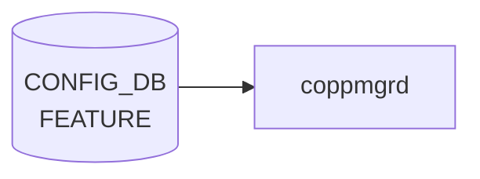

# FEATURE テーブル

## 概要

SONiC の機能 docker（bgp、teamd、snmp、sflow、telemetry 等）の有効化、自動再起動、起動遅延、scope（global / per-asic / per-dpu）、Kubernetes 管理切り替えを保持する[^1]。`hostcfgd` の `FeatureHandler` がこのテーブルを購読し、systemd サービスファイル (`sonic.target.wants/<feature>.service`) の enable/disable とテンプレ展開を行う。

<!-- cdb-mermaid -->
### データフロー (自動生成)



!!! note "凡例"
    CONFIG_DB から SAI までの典型経路を `docs/reference/config-db-orch-map.md` から機械生成したミニ図。詳細・例外は本ページ本文と対応表を参照。
<!-- /cdb-mermaid -->

## key 構造

```
FEATURE|<name>
```

`<name>` は 1..32 文字の feature 名（`bgp`、`teamd`、`telemetry` 等）。

## フィールド一覧

| フィールド | 型 | 必須 | デフォルト | 説明 |
|-----------|----|------|-----------|------|
| `name` (key) | string (1..32) | ✅ | - | feature 名 |
| `state` | string | - | `enabled` | 管理状態 (`enabled` / `disabled` / `always_enabled`) |
| `auto_restart` | string | - | `enabled` | 失敗時の自動再起動 |
| `delayed` | string | - | `false` | システム初期化完了まで起動遅延 |
| `has_global_scope` | string | - | `false` | true で 1 装置 1 インスタンス |
| `has_per_asic_scope` | string | - | `false` | true で ASIC ごとにインスタンス |
| `has_per_dpu_scope` | string | - | `false` | true で DPU ごとにインスタンス |
| `high_mem_alert` | string | - | `disabled` | メモリ高使用時のアラート |
| `set_owner` | string `kube`/`local` | - | `local` | Kubernetes 管理かローカル管理か |
| `check_up_status` | `boolean_type` | - | `false` | system-ready ツールで監視するか |
| `support_syslog_rate_limit` | `boolean_type` | - | `false` | サービス単位の syslog rate limit 対応 |

`state` / `auto_restart` / `delayed` / `has_*_scope` / `high_mem_alert` は YANG 上 `feature-state` または `feature-scope-status` という非制約な string 型で、運用上 `enabled`/`disabled` 等の文字列を入れる。厳密な enum 制約は実装側のチェックに依る。

## 購読者

- `hostcfgd` の `FeatureHandler`: systemd サービス制御、`SUPERVISORD` config 更新、Kubernetes container 切替え
- `system_health`: `check_up_status = true` の機能を監視

## 関連 CONFIG_DB / YANG / CLI

- 関連 CONFIG_DB: `KUBERNETES_MASTER`（`set_owner = kube` のとき）、`SYSLOG_CONFIG_FEATURE`（`support_syslog_rate_limit = true` のとき）
- 関連 CLI: `config feature state <name> <enabled|disabled>`、`config feature autorestart`
- 関連 YANG: `sonic-feature`

<!-- ref-triangle:start -->

## 関連リファレンス

- YANG: [`sonic-feature`](../yang/sonic-feature.md)
- CLI: `config feature`

<!-- ref-triangle:end -->

## 引用元

[^1]: YANG 定義: `sonic-feature.yang`. <https://github.com/sonic-net/sonic-buildimage/blob/9ea932ec2e18f35e58268ec2e4456b1d4afd65cd/src/sonic-yang-models/yang-models/sonic-feature.yang>
