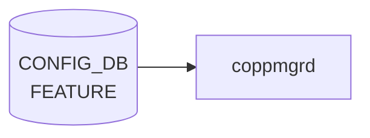

# FEATURE テーブル

## 概要

SONiC の機能 docker（bgp、[teamd](../../reference/glossary.md#term-teamd-teamsyncd-teammgrd)、snmp、sflow、telemetry 等）の有効化、自動再起動、起動遅延、scope（global / per-asic / per-dpu）、Kubernetes 管理切り替えを保持する[^1]。`hostcfgd` の `FeatureHandler` がこのテーブルを購読し、systemd サービスファイル (`sonic.target.wants/<feature>.service`) の enable/disable とテンプレ展開を行う。

<!-- cdb-mermaid -->
### データフロー (自動生成)



!!! note "凡例"
    CONFIG_DB から SAI までの典型経路を `docs/reference/config-db-orch-map.md` から機械生成したミニ図。詳細・例外は本ページ本文と対応表を参照。
<!-- /cdb-mermaid -->

## key 構造

```text
FEATURE|<name>
```

`<name>` は 1..32 文字の feature 名（`bgp`、`teamd`、`telemetry` 等）。

## フィールド一覧

| フィールド | 型 | 必須 | デフォルト | 説明 |
|-----------|----|------|-----------|------|
| `name` (key) | string (1..32) | ✅ | - | feature 名 |
| `state` | string | - | `enabled` | 管理状態 (`enabled` / `disabled` / `always_enabled`) |
| `auto_restart` | string | - | `enabled` | 失敗時の自動再起動 |
| `delayed` | string | - | `false` | システム初期化完了まで起動遅延 |
| `has_global_scope` | string | - | `false` | true で 1 装置 1 インスタンス |
| `has_per_asic_scope` | string | - | `false` | true で ASIC ごとにインスタンス |
| `has_per_dpu_scope` | string | - | `false` | true で [DPU](../../reference/glossary.md#term-dpu) ごとにインスタンス |
| `high_mem_alert` | string | - | `disabled` | メモリ高使用時のアラート |
| `set_owner` | string `kube`/`local` | - | `local` | Kubernetes 管理かローカル管理か |
| `check_up_status` | `boolean_type` | - | `false` | system-ready ツールで監視するか |
| `support_syslog_rate_limit` | `boolean_type` | - | `false` | サービス単位の syslog rate limit 対応 |

`state` / `auto_restart` / `delayed` / `has_*_scope` / `high_mem_alert` は [YANG](../../reference/glossary.md#term-yang) 上 `feature-state` または `feature-scope-status` という非制約な string 型で、運用上 `enabled`/`disabled` 等の文字列を入れる。厳密な enum 制約は実装側のチェックに依る。

<!-- value-behavior -->
## 値依存挙動マトリクス

### `state` (string: enabled/disabled/always_enabled/always_disabled)

| 値 | 挙動 |
|----|------|
| `enabled` | featured daemon が systemd unit を enable + start |
| `disabled` | systemd unit を disable + stop |
| `always_enabled` | featured が有効化を強制。ユーザーからの `disabled` への変更を無効化（featured:248-256） |
| `always_disabled` | featured が無効化を強制。ユーザーからの `enabled` への変更を無効化 |
| `None` / 未設定 | `always_enabled` と同等に扱う（featured:248） |

### `auto_restart` (string: enabled/disabled)

| 値 | 挙動 |
|----|------|
| `enabled` | docker が crash した場合に systemd が自動再起動 |
| `disabled` | crash 時に手動復旧が必要 |

### `delayed` (string: True/False)

| 値 | 挙動 |
|----|------|
| `False` (デフォルト) | システム起動直後に起動 |
| `True` | ポート初期化完了 / warm-fast boot 完了 / タイムアウトのいずれかを待ってから起動（featured:163-184） |

### `set_owner` (string: kube/local)

| 値 | 挙動 |
|----|------|
| `local` (デフォルト) | ローカル docker image でコンテナを管理 |
| `kube` | KUBERNETES_MASTER テーブルの接続先 k8s cluster がコンテナイメージを管理 |

### `check_up_status` (boolean_type)

| 値 | 挙動 |
|----|------|
| `false` (デフォルト) | system_health の監視対象外 |
| `true` | system_health が対象 feature の up 状態を監視 |

### `support_syslog_rate_limit` (boolean_type)

| 値 | 挙動 |
|----|------|
| `false` (デフォルト) | サービス単位の syslog rate limit なし |
| `true` | SYSLOG_CONFIG_FEATURE テーブルでサービス単位の rate limit を設定可能 |

<!-- /value-behavior -->

## 購読者

- `hostcfgd` の `FeatureHandler`: systemd サービス制御、`SUPERVISORD` config 更新、Kubernetes container 切替え
- `system_health`: `check_up_status = true` の機能を監視

## 関連 CONFIG_DB / YANG / CLI

- 関連 [CONFIG_DB](../../reference/glossary.md#term-config_db): `KUBERNETES_MASTER`（`set_owner = kube` のとき）、`SYSLOG_CONFIG_FEATURE`（`support_syslog_rate_limit = true` のとき）
- 関連 CLI: `config feature state <name> <enabled|disabled>`、`config feature autorestart`
- 関連 [YANG](../../reference/glossary.md#term-yang): `sonic-feature`

<!-- ref-triangle:start -->

## 関連リファレンス

- [YANG](../../reference/glossary.md#term-yang): [`sonic-feature`](../yang/sonic-feature.md)
- CLI: `config feature`

<!-- ref-triangle:end -->

## 引用元

[^1]: YANG 定義: `sonic-feature.yang`. <https://github.com/sonic-net/sonic-buildimage/blob/9ea932ec2e18f35e58268ec2e4456b1d4afd65cd/src/sonic-yang-models/yang-models/sonic-feature.yang>

<!-- ops-hint -->
## 運用ヒント

### 典型値

- key 形式: `FEATURE|<feature-name>` (例 `bgp`, `lldp`, `snmp`, `telemetry`)。
- `state`: `enabled` / `disabled` / `always_enabled`。
- `auto_restart`: `enabled`。
- `high_mem_alert`: `disabled`。

### よくある誤設定

- `state: disabled` で必須コンテナ（`swss` 等）を止めると [orchagent](../../reference/glossary.md#term-orchagent) ごと止まる。
- `auto_restart: disabled` で crash すると手動再起動が必要。

### 確認コマンド

```bash
sonic-db-cli CONFIG_DB keys 'FEATURE|*'
show feature status
```
<!-- /ops-hint -->

<!-- cdb-exceptions -->
## 例外条件・特殊挙動

| consumer | 条件 | 挙動 |
|---|---|---|
| FeatureRegistry | 新規登録時に [CONFIG_DB](../../reference/glossary.md#term-config_db) に既存エントリが存在する | デフォルト値より既存 DB 値を優先。非設定可能項目 (`delayed` 等) のみ新値で上書き。ユーザ設定の `state`/`auto_restart` は保持（feature.py:72-78） |
| FeatureRegistry | `state` フィールドが欠落 | デフォルト `disabled` を使用（feature.py:13,35） |
| FeatureRegistry | `auto_restart` / `high_mem_alert` / `set_owner` が欠落 | デフォルト値 (`enabled`, `disabled`, `local`) を使用（feature.py:14-16） |
| containercfgd | syslog 設定値が変化しない | `"Syslog rate limit configuration does not change, ignore it"` を出力してスキップ（rsyslogd 再起動なし）（containercfgd.py:146-148） |
| containercfgd | syslog 更新中に例外発生 | `log_error(...)` を出力して継続。デーモンは停止しない（containercfgd.py:124-125） |
| dhcprelayd | `FEATURE.dhcp_server.state` フィールド欠落 | `dict.get("dhcp_server", {}).get("state", "disabled")` でデフォルト `disabled` として扱う（dhcprelayd.py:206-207） |

> **Evidence**: [sonic-utilities](../../reference/glossary.md#term-sonic-utilities) `sonic_package_manager/service_creator/feature.py:13-78`; [sonic-buildimage](../../reference/glossary.md#term-sonic-buildimage) `src/sonic-containercfgd/containercfgd/containercfgd.py:124-148`; `src/sonic-dhcp-utilities/dhcp_utilities/dhcprelayd/dhcprelayd.py:206-207`
<!-- /cdb-exceptions -->


<!-- runtime-trace -->
## 実コンテナ動作トレース

### 段階 1 — Consumer 登録

`hostcfgd` の `FeatureHandler` + `containercfgd` + `coppmgrd` + `dhcprelayd` が CONFIG_DB の `FEATURE` テーブルを購読する。

`FEATURE` の key はフィーチャー名 (例: `bgp`, `swss`, `lldp`)。`always_enabled` フィーチャーは disable 不可。

### 段階 2 — CFG→APPL 翻訳

なし (APPL_DB 中継なし)

### 段階 3 — APPL→SAI

なし (SAI 非経由 — Docker コンテナの起動/停止制御)

### 段階 4 — タイミングと副作用

**適用タイミング**: CONFIG_DB の `FEATURE` エントリ変化を `hostcfgd` が検知後、`systemctl start/stop <feature>` を呼び出す。コンテナ起動/停止は非同期で時間がかかる。

**副作用**: `state: disabled` でコンテナ停止 → そのコンテナが管理するすべての機能が停止。`auto_restart: disabled` でクラッシュ時に自動復旧しない。`set_owner: kube` に変更で Kubernetes 管理に移行。
<!-- /runtime-trace -->

<!-- entry-points -->
## 書き込み入り口 (Direction A)

対象テーブル: `FEATURE`

### CLI
- `config feature state <feature> enabled/disabled`
- `config feature autorestart <feature> enabled/disabled`
  - ソース: `sonic-utilities/config/feature.py`

### minigraph / sonic-cfggen
- なし

### REST / gNMI (sonic-mgmt-common)
- なし (対応 OpenConfig/SONiC YANG transformer なし)

### db_migrator
- なし

### ビルド時デフォルト (init_cfg / j2 テンプレート)
- `init_cfg.json.j2` の `FEATURE` セクションでプラットフォーム対応フィーチャーがデフォルト値付きで注入

### ハードコードデフォルト
- なし

### ランタイム注入 (デーモン自動書き込み)
- `featured` デーモンが systemd サービス状態を監視し FEATURE テーブルと同期
<!-- /entry-points -->

<!-- platform -->
## プラットフォーム差 (Phase H)

### 概要

`FEATURE` テーブルの `featured` デーモンは、プラットフォーム構成に応じて 4 軸で挙動が変化する。

### 1. multi-asic (is_multi_npu == True)

`FeatureHandler` は起動時に `device_info.is_multi_npu()` を確認し、multi-asic 環境では namespace ごとに `ConfigDBConnector` と STATE_DB `Table` を初期化する（`featured:142,151-162`）。

**CONFIG_DB / STATE_DB 同期の差異**:

| 操作 | single-asic | multi-asic |
|------|-------------|-----------|
| `resync_feature_state()` (`featured:570-573`) | host CONFIG_DB のみ | host + 全 namespace CONFIG_DB |
| `sync_feature_delay_state()` (`featured:583-584`) | host CONFIG_DB のみ | host + 全 namespace CONFIG_DB |
| `set_feature_state()` (`featured:588-591`) | host STATE_DB のみ | host + 全 namespace STATE_DB |
| `sync_feature_scope()` (`featured:312-355`) | `is_multi_npu == False` で全処理スキップ | `has_per_asic_scope` / `has_global_scope` を DB に反映、不要インスタンスを stop/disable/mask |

### 2. feature インスタンス名の生成

`get_multiasic_feature_instances()` (`featured:408-415`) が systemd ユニット名を決定する:

| 構成 | インスタンス名 | 条件 |
|------|--------------|------|
| single-asic または `has_global_scope = True` | `<feature>` | `not is_multi_npu` または `has_global_scope` |
| multi-asic + `has_per_asic_scope = True` | `<feature>@0`, `<feature>@1`, ... | `is_multi_npu == True` かつ `has_per_asic_scope` |
| SmartSwitch + `has_per_dpu_scope = True` | `<feature>@dpu0`, `<feature>@dpu1`, ... | `num_dpus > 0` |
| multi-asic + global_scope = False + per_asic = False | インスタンスなし | ホストインスタンスが省略される |

single-asic では `is_multi_npu == False` のため、`has_global_scope` の値に関わらず常にホストインスタンス `[feature.name]` が生成される。

### 3. SmartSwitch / DPU (`has_per_dpu_scope`)

`num_dpus = device_info.get_num_dpus()` (`featured:148`) で DPU 数を取得。SmartSwitch 構成 (`num_dpus > 0`) では `has_per_dpu_scope = True` の feature が DPU ごとのインスタンスを生成する。

- `has_per_dpu_scope` は `sonic_package_manager` の非設定可能フィールド管理外 (`feature.py:228-237`) であり、manifest ではなく CONFIG_DB 値をそのまま参照する。
- 標準 `init_cfg.json.j2` には `has_per_dpu_scope = True` の feature エントリは存在しない。SmartSwitch 固有 feature はプラットフォーム固有パッケージが別途登録する。

### 4. SpineRouter — `syncd` / `gbsyncd` の auto_restart 強制

`update_systemd_config()` (`featured:373-380`) は `DEVICE_METADATA.localhost.type == 'SpineRouter'` かつ feature が `syncd` / `gbsyncd` の場合、`auto_restart` CONFIG_DB 設定を無視して systemd `Restart=no` を強制する:

```python
if device_type == 'SpineRouter' and is_dependent_service:
    restart_field_str = "no"   # CONFIG_DB 値を無視
else:
    restart_field_str = "always" if "enabled" in feature_config.auto_restart else "no"
```

**背景**: SpineRouter (VOQ chassis) では `syncd` が `swss` 依存として連動起動/停止するため、クリティカルプロセスクラッシュ時に二重停止が発生する。また VOQ chassis では早期 `syncd` 再起動がトラフィック断を引き起こす。このため SpineRouter では `config feature autorestart syncd enabled` を実行しても systemd `Restart=always` には変わらない。

### 5. init_cfg.json.j2 ビルド時プラットフォーム条件

ビルド時 Jinja2 テンプレートが `DEVICE_METADATA` / `DEVICE_RUNTIME_METADATA` の値に応じてデフォルト `state` を決定する:

| feature | 条件 | state |
|---------|------|-------|
| `bgp` | supervisor モジュール または `ETHERNET_PORTS_PRESENT == False` | `disabled` |
| `teamd` | `ETHERNET_PORTS_PRESENT == False` | `disabled` |
| `mux` | `subtype == 'DualToR'` | `enabled` |
| `mux` | 上記以外 | `always_disabled` |
| `macsec` | `type in ['SpineRouter', 'UpperSpineRouter', 'LowerRegionalHub']` かつ `MACSEC_SUPPORTED` | `enabled` |
| `macsec` | 上記以外 | `disabled` |
| `dhcp_relay` | type が ToR/EPMS/MgmtToR 系 | `disabled` |
| `gbsyncd` | `sonic_asic_platform == "vs"` のみ追加 | `enabled` |
| `pmon` | `delayed`: type が `SpineRouter` → `False`、それ以外 → `True` | (delayed のみ) |

`lldp` の `has_global_scope` / `has_per_asic_scope` のみランタイム Jinja2 テンプレートで chassis モジュールタイプに応じて動的決定される（`init_cfg.json.j2:109-110`）。

> **Evidence**: `sonic-host-services/scripts/featured:142,148,151-162,312-355,373-380,408-415,570-591`; `sonic-buildimage/files/build_templates/init_cfg.json.j2:67-130`; 詳細分析 `meta/_intermediate/cdb-flow/feature-platform.md`
<!-- /platform -->

<!-- glossary-links-injected: 92d0997ed33c -->
