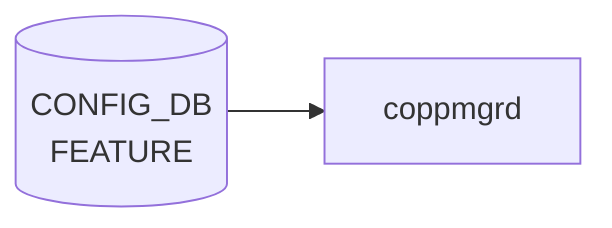

# FEATURE テーブル

## 概要

[SONiC](../../reference/glossary.md#term-sonic) の機能 docker（bgp、[teamd](../../reference/glossary.md#term-teamd-teamsyncd-teammgrd)、snmp、sflow、telemetry 等）の有効化、自動再起動、起動遅延、scope（global / per-asic / per-dpu）、Kubernetes 管理切り替えを保持する[^1]。`hostcfgd` の `FeatureHandler` がこのテーブルを購読し、systemd サービスファイル (`sonic.target.wants/<feature>.service`) の enable/disable とテンプレ展開を行う。

<!-- cdb-mermaid -->
### データフロー (自動生成)



!!! note "凡例"
    CONFIG_DB から SAI までの典型経路を `docs/reference/config-db-orch-map.md` から機械生成したミニ図。詳細・例外は本ページ本文と対応表を参照。
<!-- /cdb-mermaid -->

## key 構造

```text
FEATURE|<name>
```

`<name>` は 1..32 文字の feature 名（`bgp`、`teamd`、`telemetry` 等）。

## フィールド一覧

| フィールド | 型 | 必須 | デフォルト | 説明 |
|-----------|----|------|-----------|------|
| `name` (key) | string (1..32) | ✅ | - | feature 名 |
| `state` | string | - | `enabled` | 管理状態 (`enabled` / `disabled` / `always_enabled`) |
| `auto_restart` | string | - | `enabled` | 失敗時の自動再起動 |
| `delayed` | string | - | `false` | システム初期化完了まで起動遅延 |
| `has_global_scope` | string | - | `false` | true で 1 装置 1 インスタンス |
| `has_per_asic_scope` | string | - | `false` | true で [ASIC](../../reference/glossary.md#term-asic) ごとにインスタンス |
| `has_per_dpu_scope` | string | - | `false` | true で [DPU](../../reference/glossary.md#term-dpu) ごとにインスタンス |
| `high_mem_alert` | string | - | `disabled` | メモリ高使用時のアラート |
| `set_owner` | string `kube`/`local` | - | `local` | Kubernetes 管理かローカル管理か |
| `check_up_status` | `boolean_type` | - | `false` | system-ready ツールで監視するか |
| `support_syslog_rate_limit` | `boolean_type` | - | `false` | サービス単位の syslog rate limit 対応 |

`state` / `auto_restart` / `delayed` / `has_*_scope` / `high_mem_alert` は [YANG](../../reference/glossary.md#term-yang) 上 `feature-state` または `feature-scope-status` という非制約な string 型で、運用上 `enabled`/`disabled` 等の文字列を入れる。厳密な enum 制約は実装側のチェックに依る。

<!-- value-behavior -->
## 値依存挙動マトリクス

### `state` (string: enabled/disabled/always_enabled/always_disabled)

| 値 | 挙動 |
|----|------|
| `enabled` | featured daemon が systemd unit を enable + start |
| `disabled` | systemd unit を disable + stop |
| `always_enabled` | featured が有効化を強制。ユーザーからの `disabled` への変更を無効化（featured:248-256） |
| `always_disabled` | featured が無効化を強制。ユーザーからの `enabled` への変更を無効化 |
| `None` / 未設定 | `always_enabled` と同等に扱う（featured:248） |

### `auto_restart` (string: enabled/disabled)

| 値 | 挙動 |
|----|------|
| `enabled` | docker が crash した場合に systemd が自動再起動 |
| `disabled` | crash 時に手動復旧が必要 |

### `delayed` (string: True/False)

| 値 | 挙動 |
|----|------|
| `False` (デフォルト) | システム起動直後に起動 |
| `True` | ポート初期化完了 / warm-fast boot 完了 / タイムアウトのいずれかを待ってから起動（featured:163-184） |

### `set_owner` (string: kube/local)

| 値 | 挙動 |
|----|------|
| `local` (デフォルト) | ローカル docker image でコンテナを管理 |
| `kube` | KUBERNETES_MASTER テーブルの接続先 k8s cluster がコンテナイメージを管理 |

### `check_up_status` (boolean_type)

| 値 | 挙動 |
|----|------|
| `false` (デフォルト) | system_health の監視対象外 |
| `true` | system_health が対象 feature の up 状態を監視 |

### `support_syslog_rate_limit` (boolean_type)

| 値 | 挙動 |
|----|------|
| `false` (デフォルト) | サービス単位の syslog rate limit なし |
| `true` | SYSLOG_CONFIG_FEATURE テーブルでサービス単位の rate limit を設定可能 |

<!-- /value-behavior -->

## 購読者

- `hostcfgd` の `FeatureHandler`: systemd サービス制御、`SUPERVISORD` config 更新、Kubernetes container 切替え
- `system_health`: `check_up_status = true` の機能を監視

## 関連 CONFIG_DB / YANG / CLI

- 関連 [CONFIG_DB](../../reference/glossary.md#term-config_db): `KUBERNETES_MASTER`（`set_owner = kube` のとき）、`SYSLOG_CONFIG_FEATURE`（`support_syslog_rate_limit = true` のとき）
- 関連 CLI: `config feature state <name> <enabled|disabled>`、`config feature autorestart`
- 関連 [YANG](../../reference/glossary.md#term-yang): `sonic-feature`

<!-- ref-triangle:start -->

## 関連リファレンス

- [YANG](../../reference/glossary.md#term-yang): [`sonic-feature`](../yang/sonic-feature.md)
- CLI: `config feature`

<!-- ref-triangle:end -->

## 引用元

[^1]: YANG 定義: `sonic-feature.yang`. <https://github.com/sonic-net/sonic-buildimage/blob/9ea932ec2e18f35e58268ec2e4456b1d4afd65cd/src/sonic-yang-models/yang-models/sonic-feature.yang>

<!-- ops-hint -->
## 運用ヒント

### 典型値

- key 形式: `FEATURE|<feature-name>` (例 `bgp`, `lldp`, `snmp`, `telemetry`)。
- `state`: `enabled` / `disabled` / `always_enabled`。
- `auto_restart`: `enabled`。
- `high_mem_alert`: `disabled`。

### よくある誤設定

- `state: disabled` で必須コンテナ（`swss` 等）を止めると [orchagent](../../reference/glossary.md#term-orchagent) ごと止まる。
- `auto_restart: disabled` で crash すると手動再起動が必要。

### 確認コマンド

```bash
sonic-db-cli CONFIG_DB keys 'FEATURE|*'
show feature status
```
<!-- /ops-hint -->

<!-- cdb-exceptions -->
## 例外条件・特殊挙動

| consumer | 条件 | 挙動 |
|---|---|---|
| FeatureRegistry | 新規登録時に [CONFIG_DB](../../reference/glossary.md#term-config_db) に既存エントリが存在する | デフォルト値より既存 DB 値を優先。非設定可能項目 (`delayed` 等) のみ新値で上書き。ユーザ設定の `state`/`auto_restart` は保持（feature.py:72-78） |
| FeatureRegistry | `state` フィールドが欠落 | デフォルト `disabled` を使用（feature.py:13,35） |
| FeatureRegistry | `auto_restart` / `high_mem_alert` / `set_owner` が欠落 | デフォルト値 (`enabled`, `disabled`, `local`) を使用（feature.py:14-16） |
| containercfgd | syslog 設定値が変化しない | `"Syslog rate limit configuration does not change, ignore it"` を出力してスキップ（rsyslogd 再起動なし）（containercfgd.py:146-148） |
| containercfgd | syslog 更新中に例外発生 | `log_error(...)` を出力して継続。デーモンは停止しない（containercfgd.py:124-125） |
| dhcprelayd | `FEATURE.dhcp_server.state` フィールド欠落 | `dict.get("dhcp_server", {}).get("state", "disabled")` でデフォルト `disabled` として扱う（dhcprelayd.py:206-207） |

> **Evidence**: [sonic-utilities](../../reference/glossary.md#term-sonic-utilities) `sonic_package_manager/service_creator/feature.py:13-78`; [sonic-buildimage](../../reference/glossary.md#term-sonic-buildimage) `src/sonic-containercfgd/containercfgd/containercfgd.py:124-148`; `src/sonic-dhcp-utilities/dhcp_utilities/dhcprelayd/dhcprelayd.py:206-207`
<!-- /cdb-exceptions -->


<!-- runtime-trace -->
## 実コンテナ動作トレース

### 段階 1 — Consumer 登録

`hostcfgd` の `FeatureHandler` + `containercfgd` + `coppmgrd` + `dhcprelayd` が [CONFIG_DB](../../reference/glossary.md#term-config_db) の `FEATURE` テーブルを購読する。

`FEATURE` の key はフィーチャー名 (例: `bgp`, `swss`, `lldp`)。`always_enabled` フィーチャーは disable 不可。

### 段階 2 — CFG→APPL 翻訳

なし ([APPL_DB](../../reference/glossary.md#term-appl_db) 中継なし)

### 段階 3 — APPL→SAI

なし ([SAI](../../reference/glossary.md#term-sai) 非経由 — Docker コンテナの起動/停止制御)

### 段階 4 — タイミングと副作用

**適用タイミング**: CONFIG_DB の `FEATURE` エントリ変化を `hostcfgd` が検知後、`systemctl start/stop <feature>` を呼び出す。コンテナ起動/停止は非同期で時間がかかる。

**副作用**: `state: disabled` でコンテナ停止 → そのコンテナが管理するすべての機能が停止。`auto_restart: disabled` でクラッシュ時に自動復旧しない。`set_owner: kube` に変更で Kubernetes 管理に移行。
<!-- /runtime-trace -->

<!-- entry-points -->
## 書き込み入り口 (Direction A)

対象テーブル: `FEATURE`

### CLI
- `config feature state <feature> enabled/disabled`
- `config feature autorestart <feature> enabled/disabled`
  - ソース: `sonic-utilities/config/feature.py`

### minigraph / sonic-cfggen
- なし

### REST / gNMI (sonic-mgmt-common)
- なし (対応 OpenConfig/[SONiC](../../reference/glossary.md#term-sonic) YANG transformer なし)

### db_migrator
- なし

### ビルド時デフォルト (init_cfg / j2 テンプレート)
- `init_cfg.json.j2` の `FEATURE` セクションでプラットフォーム対応フィーチャーがデフォルト値付きで注入

### ハードコードデフォルト
- なし

### ランタイム注入 (デーモン自動書き込み)
- `featured` デーモンが systemd サービス状態を監視し FEATURE テーブルと同期
<!-- /entry-points -->

<!-- ordering -->
## 書き込み順依存 (Phase B)

FEATURE テーブルへの書き込みは複数経路が重なるため、フィールドごとに「最終書き込み者」が異なる。誤った順序での操作はユーザ設定の消失やサービス誤動作を引き起こす。

### systemd unit 起動順序

```
[システム起動]
  ↓
docker.service / rc-local.service
  ↓
database.service          (Requires=docker.service, After=docker.service rc-local.service)
  ↓
config-setup.service      (Requires=database.service config-topology.service)
  ↓
featured.service          (Requires=config-setup.service, After=config-setup.service)
  ↓ featured が CONFIG_DB FEATURE テーブルを読んで render_all_feature_states() 実行
  ↓ [delayed=False フィーチャー] → 即時 systemctl enable / start
  ↓ [delayed=True  フィーチャー] → PortInitDone 受信 or 180 秒タイムアウト後に起動
  ↓
各 feature service (bgp/teamd/snmp 等)
```

- `featured.service` は `sonic.target` と `BindsTo` 関係にある（`featured.service:BindsTo=sonic.target`）。
- `featured` デーモン起動後、`render_all_feature_states()` が全フィーチャーの state を評価し `enabled` なものを `systemctl enable / start` する。
- `delayed=True` フィーチャーは `APPL_DB PORT_TABLE:PortInitDone` の受信を待ってから起動する（`featured:182-184`）。PortInitDone が来ない場合は `PORT_INIT_TIMEOUT_SEC=180` 秒後に強制起動する（`featured:659-661`）。

### featured が管理する feature service の systemd 依存関係

各 feature の `.service` ファイルはビルド時のテンプレート (`files/build_templates/*.service.j2`) から生成される。主要サービスの依存関係:

| feature service | Requires | After |
|----------------|----------|-------|
| `bgp.service` | `config-setup.service` | `config-setup.service swss.service syncd.service` |
| `snmp.service` | `config-setup.service` | `config-setup.service swss.service syncd.service interfaces-config.service` |
| `telemetry.service` | `database.service` | `database.service swss.service syncd.service` |
| `mgmt-framework.service` | `database.service` | `database.service swss.service syncd.service` |
| `gnmi.service` | `database.service` | `database.service swss.service syncd.service` |
| `sflow.service` | - | `swss.service syncd.service hostcfgd.service interfaces-config.service` |
| `nat.service` | `config-setup.service` | `config-setup.service swss.service syncd.service` |
| `dhcp_relay.service` | `config-setup.service` | `config-setup.service swss.service syncd.service teamd.service` |

すべての feature service は `BindsTo=sonic.target After=sonic.target` を持ち、`sonic.target` 停止時に連動停止する。

### multi-asic / SmartSwitch 環境での instance 起動順序

`featured` は `has_global_scope` / `has_per_asic_scope` / `has_per_dpu_scope` フィールドを参照してインスタンス名を決定する（`featured:408-424`）:

```
has_global_scope=True   → <feature>.service                   (host インスタンス)
has_per_asic_scope=True → <feature>@0.service, @1.service, ... (ASIC ごと)
has_per_dpu_scope=True  → <feature>@dpu0.service, @dpu1.service, ... (DPU ごと)
```

インスタンス `.service` ファイルは `systemd-sonic-generator` がブート時に `/run/systemd/generator/` 配下に動的生成する。[SmartSwitch](../../reference/glossary.md#term-smartswitch) [NPU](../../reference/glossary.md#term-npu) 環境では `database@dpu<N>.service` に `Requires=systemd-networkd-wait-online@bridge-midplane.service` が追加される（`systemd-sonic-generator.cpp:985-996`）。

### 書き込み優先順序

```
① init_cfg.json.j2      — ビルド時に全フィールドを初期注入 (set_entry)
② db_migrator.py        — 起動時マイグレーション (set_entry / mod_entry)
③ FeatureRegistry       — パッケージ登録時 (set_entry、既存 DB 値優先ロジック付き)
④ CLI                   — state / auto_restart / set_owner を部分更新 (mod_entry)
⑤ featured デーモン     — state / delayed / has_*_scope を条件付き上書き (mod_entry)
```

### フィールド別「最終権限」

| フィールド | CLI 変更可 | featured 上書き可 | 最終権限者 |
|-----------|----------|-----------------|-----------|
| `state` | ✅ (always_* 除く) | ✅ (always_* or template のみ) | CLI > featured (条件付) |
| `auto_restart` | ✅ | ❌ | CLI |
| `delayed` | ❌ | ✅ (DB と不一致時) | FeatureRegistry / featured |
| `has_global_scope` | ❌ | ✅ (条件付) | FeatureRegistry / featured |
| `has_per_asic_scope` | ❌ | ✅ (条件付) | FeatureRegistry / featured |
| `has_per_dpu_scope` | ❌ | ❌ | init_cfg |
| `high_mem_alert` | ❌ | ❌ | init_cfg |
| `set_owner` | ✅ | ❌ | CLI |
| `check_up_status` | ❌ | ❌ | FeatureRegistry (register 時) |
| `support_syslog_rate_limit` | ❌ | ❌ | FeatureRegistry (register 時) |

### 重要な順序依存ルール

1. **FeatureRegistry は既存 DB 値を優先する** (`feature.py:71-80`):
   `new_cfg = defaults ← current_cfg ← non_cfg_entries` の順で合成。`state` / `auto_restart` はユーザ設定が保持されるが、`delayed` / `has_*_scope` / `check_up_status` / `support_syslog_rate_limit` はパッケージ再インストール時に manifest 値で強制上書き。

2. **featured は `auto_restart` を `state` より先に更新する** (`featured:200-217`):
   `update_systemd_config()` → `update_feature_state()` の順で実行。逆順では、サービスが failed 状態になった後 auto_restart が更新されず再起動されないリスクがある。

3. **`delayed=True` のフィーチャーは PortInitDone または 180 秒タイムアウト待ち** (`featured:273-275`):
   先に FEATURE テーブルへ `state=enabled` を書き込んでも、条件成立まで systemd 起動は実行されない。

4. **`set_owner=kube` への変更は KUBERNETES_MASTER 設定が前提**:
   `KUBERNETES_MASTER` テーブルに k8s cluster 接続設定を書き込んでから `set_owner` を変更すること。逆順では featured が k8s 接続試行に失敗する。

5. **`always_enabled` / `always_disabled` は CLI で変更不可** (`config/feature.py:24-25`):
   これらの値は init_cfg.json.j2 または FeatureRegistry.register() が設定する。ユーザ変更が必要な場合は DB 直接操作またはビルド設定変更が必要。

> **Evidence**: `sonic-host-services/data/debian/sonic-host-services-data.featured.service`; `sonic-buildimage/files/build_templates/*.service.j2`; `sonic-buildimage/src/systemd-sonic-generator/systemd-sonic-generator.cpp:985-996`; `sonic-host-services/scripts/featured:182-184,200-217,255-275,408-424,659-661`; `sonic-utilities/sonic_package_manager/service_creator/feature.py:71-80`; `sonic-utilities/config/feature.py:24-25`; 詳細分析 `meta/_intermediate/cdb-flow/feature-ordering.md`
<!-- /ordering -->

<!-- failure -->
## 失敗挙動 (Phase D)

### STATE_DB への障害記録

`FeatureHandler.set_feature_state()` (`featured:585-590`) が `STATE_DB` の `FEATURE|<name>` テーブルに `state` フィールドを書き込む:

| 状態値 | 発生ケース |
|--------|-----------|
| `"enabled"` | `enable_feature()` 正常完了 |
| `"disabled"` | `disable_feature()` 正常完了 |
| `"failed"` | `systemctl start/stop/mask` のいずれかが非ゼロ終了（`featured:508-510, 542-544`） |

確認コマンド: `sonic-db-cli STATE_DB hgetall 'FEATURE|<feature_name>'`

### enable / disable 失敗 → "failed" + CONFIG_DB resync

`enable_feature()` / `disable_feature()` 内で `run_cmd(..., raise_exception=True)` が例外を投げると `set_feature_state(feature, "failed")` が [STATE_DB](../../reference/glossary.md#term-state_db) に書き込まれ、`handler()` は `update_feature_state()` の `False` 返却を受けて `resync_feature_state()` を呼び出す（`featured:212-217`）。`resync_feature_state()` は CONFIG_DB の `state` フィールドを変更前の cached 値に書き戻す（`always_enabled`/`always_disabled` またはテンプレート値の場合のみ書き戻し実施、それ以外はユーザ設定を保持）。

> **注意**: `systemctl enable` のみ `raise_exception=False` で失敗を無視する（`/run` 配下の生成サービスファイルへの enable 制限への対処）。

### disable 中の activating 待ち（最大 60 秒）

`disable_feature()` は `wait_for_service_stable()` (`featured:429-449`) を先行して呼び出し、サービスが `activating` 状態を抜けるまで最大 60 秒ポーリングする。タイムアウト後は警告ログを出力して stop を実行する（ExecStop 未実行でコンテナが孤立するリスクを回避するための措置）。

### stop → disable → mask の途中失敗 → 中途状態

disable 処理は `stop → disable → mask` の順で逐次実行され、最初の失敗で `return False` する。後続コマンドは実行されず、コンテナが稼働中のまま残るリスクがある（`featured:533-545`）。

### `has_timer` / 不正 state render → `ValueError` → デーモン終了リスク

`Feature.__init__()` は以下の場合に `ValueError` を raise する（`featured:75-78, 112-113`）:

- CONFIG_DB の `FEATURE|<name>` に `has_timer` フィールドが存在する（廃止フィールド）
- `state` フィールドの Jinja2 render 結果が `enabled`/`disabled`/`always_enabled`/`always_disabled` 以外

`handler()` は try/except なしで `Feature()` を呼ぶため、例外がイベントループに伝播してデーモン全体がクラッシュする可能性がある。[STATE_DB](../../reference/glossary.md#term-state_db) への書き込みはなし。

復旧手順: 不正フィールドを DB から削除後、`systemctl restart featured`。

### FEATURE_EXCLUSION_LIST によるサイレントスキップ

`telemetry` / `frr_bmp` は `enable_feature()` / `disable_feature()` の冒頭で即 return する（`featured:469-471, 517-519`）。CONFIG_DB の state 変更が systemd に適用されない。[STATE_DB](../../reference/glossary.md#term-state_db) は更新される（"enabled"/"disabled" が記録されるが systemd 操作はゼロ）。

### multi-asic scope 失敗 → DB 乖離

`sync_feature_scope()` 内で `has_per_asic_scope` / `has_global_scope` が False に変化した際の stop/disable/mask が失敗すると、`set_feature_state("failed")` 後に即 `return`（`featured:342-345`）。後続の `_conditional_update_scope()` による CONFIG_DB 更新がスキップされ、scope フィールドが古い値のまま残る（DB とシステム実態の乖離）。

> **Evidence**: `sonic-host-services/scripts/featured:75-78,112-113,186-217,429-449,468-548,585-590`; 詳細分析 `meta/_intermediate/cdb-flow/feature-failure.md`
<!-- /failure -->

<!-- defaults -->
## コード由来の暗黙デフォルト

### フィールド別デフォルト・fallback

| フィールド | YANG/ドキュメント上のデフォルト | コード実装の実デフォルト | 乖離 |
|-----------|-------------------------------|------------------------|------|
| `state` | `enabled` | sonic_package_manager 登録時: `'disabled'`（`feature.py:13`）| あり — インストール直後は disabled |
| `auto_restart` | `enabled` | `Feature.__init__` 欠落時: `'disabled'`（`featured:82`）| **あり** — 欠落時 disabled (YANG と逆) |
| `delayed` | `false` | manifest から強制取得（ユーザー設定不可、`feature.py:234`）| - |
| `has_global_scope` | `false` | manifest default `True`、欠落時 `'True'`（`featured:84`）| あり |
| `has_per_asic_scope` | `false` | manifest default `False`、欠落時 `'False'`（`featured:85`）| - |
| `has_per_dpu_scope` | `false` | 欠落時 `'False'`（`featured:86`）、manifest 非管理 | - |
| `high_mem_alert` | `disabled` | `'disabled'`（`feature.py:15`、`init_cfg.json.j2:124`）| - |
| `set_owner` | `local` | `'local'`（`feature.py:16`）| - |
| `check_up_status` | `false` | manifest default `False`（`manifest.py:205`）| - |
| `support_syslog_rate_limit` | `false` | init_cfg では全 feature `"true"` にハードコード（`init_cfg.json.j2:113`）| あり |

### 発見した暗黙挙動・特殊ケース

1. **`auto_restart` 欠落時の YANG 乖離**: `Feature.__init__` は `feature_cfg.get('auto_restart', 'disabled')` を使用（`featured:82`）。YANG/init_cfg デフォルト `enabled` と逆。CONFIG_DB に `auto_restart` フィールドが存在しない場合 `Restart=no` が設定される。

2. **SpineRouter での `auto_restart` ハードコード上書き**: `syncd` / `gbsyncd` かつ `DEVICE_METADATA.localhost.type == 'SpineRouter'` のとき CONFIG_DB 値を無視して `Restart=no` を強制（`featured:375-380`）。ユーザーが `auto_restart: enabled` を設定しても無効。

3. **`FEATURE_EXCLUSION_LIST` による silent skip**: `telemetry` / `frr_bmp` は `enable_feature` / `disable_feature` をスキップ（`featured:135`）。CONFIG_DB の state 変更が systemd に適用されない。

4. **`has_timer` は obsolete dead field**: 存在すると `ValueError` を raise し feature 適用を完全拒否（`featured:75-77`）。古い DB を持つ環境では注意。

5. **`state` の Jinja2 テンプレートと resync**: `bgp`/`teamd`/`mux` の init_cfg 値は Jinja2 テンプレート文字列。`featured` 起動時に `render_all_feature_states()` がレンダリングして CONFIG_DB を上書き（`featured:687,219-240`）。

6. **`delayed` / `check_up_status` / `support_syslog_rate_limit` / `has_global_scope` / `has_per_asic_scope` はユーザー設定不可**: sonic_package_manager の `get_non_configurable_feature_entries` が manifest 値で常に上書き（`feature.py:228-237`）。

7. **`has_per_dpu_scope` は `get_non_configurable_feature_entries` 対象外**: 他のスコープフィールドと異なり manifest 管理外（`feature.py:228-237`）。CONFIG_DB 値がそのまま使用される。

> **Evidence**: `sonic-host-services/scripts/featured:75-86,135,375-380,466,551-596`; `sonic-utilities/sonic_package_manager/service_creator/feature.py:12-17,228-237`; `sonic-buildimage/files/build_templates/init_cfg.json.j2:113,117-124`; `sonic-utilities/sonic_package_manager/manifest.py:202-217`
<!-- /defaults -->

<!-- constants -->
## ハードコード定数

`featured` スクリプト (`sonic-host-services/scripts/featured`) および `sonic_package_manager` (`sonic-utilities`) に埋め込まれた定数。

### タイミング・優先度定数（モジュールレベル）

| 定数名 | 値 | 定義場所 | 用途 |
|--------|-----|---------|------|
| `PORT_INIT_TIMEOUT_SEC` | `180` 秒 | `featured:24` | `delayed=True` フィーチャーの強制起動タイムアウト。PortInitDone を 180 秒待っても受信しない場合、`handle_port_table_timeout()` がすべての delayed フィーチャーを強制 enable する |
| `WAIT_FOR_STABLE_TIMEOUT` | `60` 秒 | `featured:426` | `disable_feature()` が `systemctl stop` 前に `activating` 状態抜けを待つ最大時間。タイムアウト後は警告ログを出力して stop を続行する |
| `WAIT_FOR_STABLE_POLL_INTERVAL` | `1` 秒 | `featured:427` | `wait_for_service_stable()` 内の `systemctl is-active` ポーリング間隔 |
| `DEFAULT_SELECT_TIMEOUT` | `1000` ms | `featured:23` | メインイベントループの `selector.select()` タイムアウト。1 秒ごとに PORT_INIT タイムアウト判定を実施 |
| `HOSTCFGD_MAX_PRI` | `10` | `featured:22` | FEATURE テーブル subscriber の select 優先度（PORT テーブルは `10-1=9`） |

### state / auto_restart 有効値 enum（`Feature.__init__` ハードコード）

`Feature.__init__` の `_get_feature_table_key_render_value()` 呼び出しで `expected_values` としてハードコードされている。これ以外の値が CONFIG_DB に入ると `ValueError` → `handler()` を通じてデーモン全体がクラッシュする。

| フィールド | 有効値セット | 定義場所 |
|-----------|-----------|---------|
| `state` | `['enabled', 'disabled', 'always_enabled', 'always_disabled']` | `featured:81` |
| `delayed` | `['True', 'False']` | `featured:83` |
| `has_global_scope` | `['True', 'False']`、欠落時デフォルト `'True'` | `featured:84` |
| `has_per_asic_scope` | `['True', 'False']`、欠落時デフォルト `'False'` | `featured:85` |
| `auto_restart` | 制約なし（`str`）。`"enabled"` を含む場合 systemd `Restart=always`、それ以外 `Restart=no` | `featured:82,380` |

### クラスレベル定数（`FeatureHandler`）

| 定数名 | 値 | 定義場所 | 用途 |
|--------|-----|---------|------|
| `FEATURE_STATE_ENABLED` | `"enabled"` | `featured:132` | STATE_DB に書き込む「起動成功」状態文字列 |
| `FEATURE_STATE_DISABLED` | `"disabled"` | `featured:133` | STATE_DB に書き込む「停止成功」状態文字列 |
| `FEATURE_STATE_FAILED` | `"failed"` | `featured:134` | STATE_DB に書き込む「失敗」状態文字列。`systemctl start/stop/mask` 非ゼロ終了時に記録 |
| `FEATURE_EXCLUSION_LIST` | `{"telemetry", "frr_bmp"}` | `featured:135` | systemd 操作をスキップするフィーチャー名セット。CONFIG_DB の state 変化を検知しても enable/disable を実行しない |
| `SYSTEMD_SYSTEM_DIR` | `'/etc/systemd/system/'` | `featured:128` | サービスファイルを配置するルートディレクトリ |
| `SYSTEMD_SERVICE_CONF_DIR` | `'/etc/systemd/system/{}.service.d/'` | `featured:129` | `auto_restart.conf` を配置するサービス別 drop-in ディレクトリ |

### `sonic_package_manager` デフォルト定数

| 定数名 | 値 | 定義場所 | 用途 |
|--------|-----|---------|------|
| `DEFAULT_FEATURE_CONFIG['state']` | `'disabled'` | `feature.py:13` | パッケージ新規インストール時のデフォルト state（YANG デフォルト `enabled` と乖離） |
| `DEFAULT_FEATURE_CONFIG['auto_restart']` | `'enabled'` | `feature.py:14` | 新規インストール時のデフォルト auto_restart |
| `DEFAULT_FEATURE_CONFIG['high_mem_alert']` | `'disabled'` | `feature.py:15` | 新規インストール時のデフォルト high_mem_alert |
| `DEFAULT_FEATURE_CONFIG['set_owner']` | `'local'` | `feature.py:16` | 新規インストール時のデフォルト set_owner |

> **Evidence**: `sonic-host-services/scripts/featured:22-24,81-86,128-135,380,426-427,630,644-648,654-661`; `sonic-utilities/sonic_package_manager/service_creator/feature.py:12-17`; 詳細分析 `meta/_intermediate/cdb-flow/feature-constants.md`
<!-- /constants -->

<!-- cross-refs -->
## 暗黙参照マップ

| 参照方向 | このテーブル | 相手テーブル / ページ | 条件 |
|---------|------------|---------------------|------|
| FEATURE → | `set_owner = "kube"` | [`KUBERNETES_MASTER`](./kubernetes-master.md) | k8s 管理切替え時。featured が k8s API 呼び出し前に KUBERNETES_MASTER の接続情報を参照 |
| FEATURE → | `support_syslog_rate_limit = "true"` | [`SYSLOG_CONFIG_FEATURE`](./syslog-config-feature.md) | containercfgd が SYSLOG_CONFIG_FEATURE の rate-limit 値を読んでコンテナ内 rsyslog を再設定 |
| FEATURE → | `state` / `has_*_scope` (ビルド時) | [`DEVICE_METADATA`](./device-metadata.md) | init_cfg.json.j2 が `localhost.type` / `subtype` を条件に state を決定 |
| → FEATURE | `SYSLOG_CONFIG_FEATURE.<service>` | [`SYSLOG_CONFIG_FEATURE`](./syslog-config-feature.md) | key が FEATURE_LIST.name を leafref — 未登録 feature は設定不可 |
| → FEATURE | `AUTO_TECHSUPPORT_FEATURE.<feature_name>` | [`AUTO_TECHSUPPORT_FEATURE`](./auto-techsupport-feature.md) | key が FEATURE.name に対応（YANG leafref 未実装、運用上の依存） |
| CLI | `config/show feature` | [`show feature`](../cli/show-feature.md) | FEATURE テーブルの読み書き CLI |
| YANG | `FEATURE_LIST` | [`sonic-feature`](../yang/sonic-feature.md) | 全フィールドのスキーマ定義 |

<!-- /cross-refs -->

<!-- side-effects -->
## 副次 DB 書込 (Phase F)

`featured` デーモンは CONFIG_DB の `FEATURE` テーブルを購読して systemd サービスを制御するが、その過程で **STATE_DB・CONFIG_DB・ファイルシステム**の 3 箇所に副次的な書込を行う。

### STATE_DB — FEATURE 状態反映

```
STATE_DB  FEATURE|<feature_name>  state  <enabled|disabled|failed>
```

`FeatureHandler.set_feature_state(feature, state)` (`featured:585-590`) が次のタイミングで呼ばれる:

| タイミング | 書込値 | コード箇所 |
|-----------|--------|-----------|
| `enable_feature()` 正常完了 | `"enabled"` | `featured:513` |
| `disable_feature()` 正常完了 | `"disabled"` | `featured:547` |
| `enable_feature()` / `disable_feature()` でコマンド失敗 | `"failed"` | `featured:510, 544` |
| `sync_feature_scope()` で stop/disable/mask 失敗 | `"failed"` | `featured:344` |

multi-asic 環境では各 namespace の STATE_DB にも同値を書き込む (`featured:588-590`)。

確認コマンド:
```bash
sonic-db-cli STATE_DB hgetall 'FEATURE|bgp'
```

### CONFIG_DB — フィールド書き戻し (resync 系)

`featured` は起動時および state 変化時に CONFIG_DB へも副次書込を行う。

| メソッド | 書込フィールド | 条件 |
|---------|--------------|------|
| `resync_feature_state` (`featured:550-572`) | `state` | rendered 値が `always_enabled`/`always_disabled`、または現 DB 値が Jinja2 テンプレート |
| `sync_feature_delay_state` (`featured:574-583`) | `delayed` | manifest 値と現 DB 値が不一致 |
| `_conditional_update_scope` (`featured:289-355`) | `has_per_asic_scope`, `has_global_scope` | rendered 値と現 DB 値が不一致の場合のみ `mod_entry` |

いずれも multi-asic では各 namespace の CONFIG_DB にも書き込む。

### ファイルシステム — systemd unit override ファイル

`auto_restart` フィールド変化または起動時に `/etc/systemd/system/<feature>.service.d/auto_restart.conf` を生成し `Restart=always|no` を書込後、`systemctl daemon-reload` を実行する (`featured:382-403`)。

multi-asic では `<feature>@<asic_id>.service.d/auto_restart.conf` も生成。

**SpineRouter 特例**: `DEVICE_METADATA.localhost.type == 'SpineRouter'` のとき `syncd` / `gbsyncd` は CONFIG_DB の `auto_restart` 値を無視して `Restart=no` を強制書込する (`featured:374-378`)。

### Kubernetes 切替 (set_owner = kube) — featured スコープ外

`set_owner = "kube"` フィールドは `sonic-feature.yang` で定義されているが、**`featured` スクリプト内に kube 制御コードは存在しない**。Kubernetes 管理切替は別のコンポーネント（`hostcfgd` KubeHandler 等）が担う。`featured` の副次書込対象は STATE_DB と CONFIG_DB (resync) およびファイルシステムのみ。

> **Evidence**: `sonic-host-services/scripts/featured:289-355,357-406,508-513,540-547,550-583,585-590`; 詳細分析 `meta/_intermediate/cdb-flow/feature-side-effects.md`
<!-- /side-effects -->

<!-- pubsub -->
## 通信メカニズム (Phase G)

### Redis 購読方式

`FEATURE` テーブルへの変更通知は **`SubscriberStateTable` (keyspace PSUBSCRIBE)** で配信される。`ConsumerStateTable`（channel ベース PUBLISH/SUBSCRIBE）は使用しない。

| 購読者 | 購読 API | PSUBSCRIBE パターン | 用途 |
|--------|---------|---------------------|------|
| `featured` (`FeatureDaemon`) | `swsscommon.SubscriberStateTable` | `__keyspace@<dbId>__:FEATURE\|*` | 全フィーチャーの state/scope/auto_restart 制御 |
| `dhcprelayd` (`DhcpServerFeatureStateChecker`) | `swsscommon.SubscriberStateTable` | `__keyspace@<dbId>__:FEATURE\|*` | `dhcp_server` エントリの `state` 変化のみ検出 |
| `route_check.py` | `get_table` (HGETALL) | 購読なし | 起動時スナップショット (`bgp` の state 確認) |

`containercfgd` は `FEATURE` テーブルを直接購読せず、`SYSLOG_CONFIG_FEATURE` テーブルのみを `ConfigDBConnector.listen()` で購読する。

### featured イベントループ

```
CONFIG_DB HSET "FEATURE|bgp" state enabled
  ↓ keyspace PUBLISH "__keyspace@<dbId>__:FEATURE|bgp"  "hset"
featured SubscriberStateTable.pops()
  ↓ HGETALL "FEATURE|bgp"  ← 通知後に別途フィールド取得
feature_handler.handler(key="bgp", op=SET, data={state:enabled,...})
  ↓ enable_feature(bgp)  →  systemctl start bgp.service
  ↓ STATE_DB HSET "FEATURE|bgp" state enabled
```

- keyspace 通知のペイロードは操作名 (`hset`/`del` 等) のみ。フィールド値は HGETALL で取得する。
- `featured` は `FEATURE_TBL` (pri=10) と `PORT_TBL` (pri=9) を同一 `swsscommon.Select` で多重化する。
- ポーリング間隔: `DEFAULT_SELECT_TIMEOUT = 1000 ms`。TIMEOUT 時に `delayed` フィーチャーの PORT_INIT タイムアウト判定を実施。
- 起動時は `render_all_feature_states()` が `get_table()` で全エントリをスナップショット処理してから Subscribe ループを開始する。

> **Evidence**: `sonic-host-services/scripts/featured:22-23,600-678`; `sonic-swss-common/common/subscriberstatetable.cpp:17-165`; `sonic-buildimage/src/sonic-dhcp-utilities/dhcp_utilities/common/dhcp_db_monitor.py:388-411`; 詳細分析 `meta/_intermediate/cdb-flow/feature-pubsub.md`
<!-- /pubsub -->
<!-- platform -->
## プラットフォーム差 (Phase H)

### 概要

`FEATURE` テーブルの `featured` デーモンは、プラットフォーム構成に応じて 4 軸で挙動が変化する。

### 1. multi-asic (is_multi_npu == True)

`FeatureHandler` は起動時に `device_info.is_multi_npu()` を確認し、multi-asic 環境では namespace ごとに `ConfigDBConnector` と STATE_DB `Table` を初期化する（`featured:142,151-162`）。

**CONFIG_DB / STATE_DB 同期の差異**:

| 操作 | single-asic | multi-asic |
|------|-------------|-----------|
| `resync_feature_state()` (`featured:570-573`) | host CONFIG_DB のみ | host + 全 namespace CONFIG_DB |
| `sync_feature_delay_state()` (`featured:583-584`) | host CONFIG_DB のみ | host + 全 namespace CONFIG_DB |
| `set_feature_state()` (`featured:588-591`) | host STATE_DB のみ | host + 全 namespace STATE_DB |
| `sync_feature_scope()` (`featured:312-355`) | `is_multi_npu == False` で全処理スキップ | `has_per_asic_scope` / `has_global_scope` を DB に反映、不要インスタンスを stop/disable/mask |

### 2. feature インスタンス名の生成

`get_multiasic_feature_instances()` (`featured:408-415`) が systemd ユニット名を決定する:

| 構成 | インスタンス名 | 条件 |
|------|--------------|------|
| single-asic または `has_global_scope = True` | `<feature>` | `not is_multi_npu` または `has_global_scope` |
| multi-asic + `has_per_asic_scope = True` | `<feature>@0`, `<feature>@1`, ... | `is_multi_npu == True` かつ `has_per_asic_scope` |
| [SmartSwitch](../../reference/glossary.md#term-smartswitch) + `has_per_dpu_scope = True` | `<feature>@dpu0`, `<feature>@dpu1`, ... | `num_dpus > 0` |
| multi-asic + global_scope = False + per_asic = False | インスタンスなし | ホストインスタンスが省略される |

single-asic では `is_multi_npu == False` のため、`has_global_scope` の値に関わらず常にホストインスタンス `[feature.name]` が生成される。

### 3. SmartSwitch / DPU (`has_per_dpu_scope`)

`num_dpus = device_info.get_num_dpus()` (`featured:148`) で [DPU](../../reference/glossary.md#term-dpu) 数を取得。[SmartSwitch](../../reference/glossary.md#term-smartswitch) 構成 (`num_dpus > 0`) では `has_per_dpu_scope = True` の feature が [DPU](../../reference/glossary.md#term-dpu) ごとのインスタンスを生成する。

- `has_per_dpu_scope` は `sonic_package_manager` の非設定可能フィールド管理外 (`feature.py:228-237`) であり、manifest ではなく CONFIG_DB 値をそのまま参照する。
- 標準 `init_cfg.json.j2` には `has_per_dpu_scope = True` の feature エントリは存在しない。SmartSwitch 固有 feature はプラットフォーム固有パッケージが別途登録する。

### 4. SpineRouter — `syncd` / `gbsyncd` の auto_restart 強制

`update_systemd_config()` (`featured:373-380`) は `DEVICE_METADATA.localhost.type == 'SpineRouter'` かつ feature が `syncd` / `gbsyncd` の場合、`auto_restart` CONFIG_DB 設定を無視して systemd `Restart=no` を強制する:

```python
if device_type == 'SpineRouter' and is_dependent_service:
    restart_field_str = "no"   # CONFIG_DB 値を無視
else:
    restart_field_str = "always" if "enabled" in feature_config.auto_restart else "no"
```

**背景**: SpineRouter ([VOQ](../../reference/glossary.md#term-voq) chassis) では `syncd` が `swss` 依存として連動起動/停止するため、クリティカルプロセスクラッシュ時に二重停止が発生する。また [VOQ](../../reference/glossary.md#term-voq) chassis では早期 `syncd` 再起動がトラフィック断を引き起こす。このため SpineRouter では `config feature autorestart syncd enabled` を実行しても systemd `Restart=always` には変わらない。

### 5. init_cfg.json.j2 ビルド時プラットフォーム条件

ビルド時 Jinja2 テンプレートが `DEVICE_METADATA` / `DEVICE_RUNTIME_METADATA` の値に応じてデフォルト `state` を決定する:

| feature | 条件 | state |
|---------|------|-------|
| `bgp` | supervisor モジュール または `ETHERNET_PORTS_PRESENT == False` | `disabled` |
| `teamd` | `ETHERNET_PORTS_PRESENT == False` | `disabled` |
| `mux` | `subtype == 'DualToR'` | `enabled` |
| `mux` | 上記以外 | `always_disabled` |
| `macsec` | `type in ['SpineRouter', 'UpperSpineRouter', 'LowerRegionalHub']` かつ `MACSEC_SUPPORTED` | `enabled` |
| `macsec` | 上記以外 | `disabled` |
| `dhcp_relay` | type が ToR/EPMS/MgmtToR 系 | `disabled` |
| `gbsyncd` | `sonic_asic_platform == "vs"` のみ追加 | `enabled` |
| `pmon` | `delayed`: type が `SpineRouter` → `False`、それ以外 → `True` | (delayed のみ) |

`lldp` の `has_global_scope` / `has_per_asic_scope` のみランタイム Jinja2 テンプレートで chassis モジュールタイプに応じて動的決定される（`init_cfg.json.j2:109-110`）。

> **Evidence**: `sonic-host-services/scripts/featured:142,148,151-162,312-355,373-380,408-415,570-591`; `sonic-buildimage/files/build_templates/init_cfg.json.j2:67-130`; 詳細分析 `meta/_intermediate/cdb-flow/feature-platform.md`
<!-- /platform -->

<!-- glossary-links-injected: febd8643d454 -->
