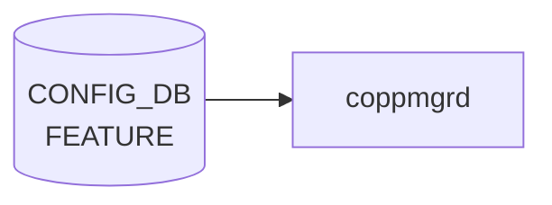

# FEATURE テーブル

## 概要

SONiC の機能 docker（bgp、[teamd](../../reference/glossary.md#term-teamd-teamsyncd-teammgrd)、snmp、sflow、telemetry 等）の有効化、自動再起動、起動遅延、scope（global / per-asic / per-dpu）、Kubernetes 管理切り替えを保持する[^1]。`hostcfgd` の `FeatureHandler` がこのテーブルを購読し、systemd サービスファイル (`sonic.target.wants/<feature>.service`) の enable/disable とテンプレ展開を行う。

<!-- cdb-mermaid -->
### データフロー (自動生成)



!!! note "凡例"
    CONFIG_DB から SAI までの典型経路を `docs/reference/config-db-orch-map.md` から機械生成したミニ図。詳細・例外は本ページ本文と対応表を参照。
<!-- /cdb-mermaid -->

## key 構造

```text
FEATURE|<name>
```

`<name>` は 1..32 文字の feature 名（`bgp`、`teamd`、`telemetry` 等）。

## フィールド一覧

| フィールド | 型 | 必須 | デフォルト | 説明 |
|-----------|----|------|-----------|------|
| `name` (key) | string (1..32) | ✅ | - | feature 名 |
| `state` | string | - | `enabled` | 管理状態 (`enabled` / `disabled` / `always_enabled`) |
| `auto_restart` | string | - | `enabled` | 失敗時の自動再起動 |
| `delayed` | string | - | `false` | システム初期化完了まで起動遅延 |
| `has_global_scope` | string | - | `false` | true で 1 装置 1 インスタンス |
| `has_per_asic_scope` | string | - | `false` | true で ASIC ごとにインスタンス |
| `has_per_dpu_scope` | string | - | `false` | true で [DPU](../../reference/glossary.md#term-dpu) ごとにインスタンス |
| `high_mem_alert` | string | - | `disabled` | メモリ高使用時のアラート |
| `set_owner` | string `kube`/`local` | - | `local` | Kubernetes 管理かローカル管理か |
| `check_up_status` | `boolean_type` | - | `false` | system-ready ツールで監視するか |
| `support_syslog_rate_limit` | `boolean_type` | - | `false` | サービス単位の syslog rate limit 対応 |

`state` / `auto_restart` / `delayed` / `has_*_scope` / `high_mem_alert` は [YANG](../../reference/glossary.md#term-yang) 上 `feature-state` または `feature-scope-status` という非制約な string 型で、運用上 `enabled`/`disabled` 等の文字列を入れる。厳密な enum 制約は実装側のチェックに依る。

<!-- value-behavior -->
## 値依存挙動マトリクス

### `state` (string: enabled/disabled/always_enabled/always_disabled)

| 値 | 挙動 |
|----|------|
| `enabled` | featured daemon が systemd unit を enable + start |
| `disabled` | systemd unit を disable + stop |
| `always_enabled` | featured が有効化を強制。ユーザーからの `disabled` への変更を無効化（featured:248-256） |
| `always_disabled` | featured が無効化を強制。ユーザーからの `enabled` への変更を無効化 |
| `None` / 未設定 | `always_enabled` と同等に扱う（featured:248） |

### `auto_restart` (string: enabled/disabled)

| 値 | 挙動 |
|----|------|
| `enabled` | docker が crash した場合に systemd が自動再起動 |
| `disabled` | crash 時に手動復旧が必要 |

### `delayed` (string: True/False)

| 値 | 挙動 |
|----|------|
| `False` (デフォルト) | システム起動直後に起動 |
| `True` | ポート初期化完了 / warm-fast boot 完了 / タイムアウトのいずれかを待ってから起動（featured:163-184） |

### `set_owner` (string: kube/local)

| 値 | 挙動 |
|----|------|
| `local` (デフォルト) | ローカル docker image でコンテナを管理 |
| `kube` | KUBERNETES_MASTER テーブルの接続先 k8s cluster がコンテナイメージを管理 |

### `check_up_status` (boolean_type)

| 値 | 挙動 |
|----|------|
| `false` (デフォルト) | system_health の監視対象外 |
| `true` | system_health が対象 feature の up 状態を監視 |

### `support_syslog_rate_limit` (boolean_type)

| 値 | 挙動 |
|----|------|
| `false` (デフォルト) | サービス単位の syslog rate limit なし |
| `true` | SYSLOG_CONFIG_FEATURE テーブルでサービス単位の rate limit を設定可能 |

<!-- /value-behavior -->

## 購読者

- `hostcfgd` の `FeatureHandler`: systemd サービス制御、`SUPERVISORD` config 更新、Kubernetes container 切替え
- `system_health`: `check_up_status = true` の機能を監視

## 関連 CONFIG_DB / YANG / CLI

- 関連 [CONFIG_DB](../../reference/glossary.md#term-config_db): `KUBERNETES_MASTER`（`set_owner = kube` のとき）、`SYSLOG_CONFIG_FEATURE`（`support_syslog_rate_limit = true` のとき）
- 関連 CLI: `config feature state <name> <enabled|disabled>`、`config feature autorestart`
- 関連 [YANG](../../reference/glossary.md#term-yang): `sonic-feature`

<!-- ref-triangle:start -->

## 関連リファレンス

- [YANG](../../reference/glossary.md#term-yang): [`sonic-feature`](../yang/sonic-feature.md)
- CLI: `config feature`

<!-- ref-triangle:end -->

## 引用元

[^1]: YANG 定義: `sonic-feature.yang`. <https://github.com/sonic-net/sonic-buildimage/blob/9ea932ec2e18f35e58268ec2e4456b1d4afd65cd/src/sonic-yang-models/yang-models/sonic-feature.yang>

<!-- ops-hint -->
## 運用ヒント

### 典型値

- key 形式: `FEATURE|<feature-name>` (例 `bgp`, `lldp`, `snmp`, `telemetry`)。
- `state`: `enabled` / `disabled` / `always_enabled`。
- `auto_restart`: `enabled`。
- `high_mem_alert`: `disabled`。

### よくある誤設定

- `state: disabled` で必須コンテナ（`swss` 等）を止めると [orchagent](../../reference/glossary.md#term-orchagent) ごと止まる。
- `auto_restart: disabled` で crash すると手動再起動が必要。

### 確認コマンド

```bash
sonic-db-cli CONFIG_DB keys 'FEATURE|*'
show feature status
```
<!-- /ops-hint -->

<!-- cdb-exceptions -->
## 例外条件・特殊挙動

| consumer | 条件 | 挙動 |
|---|---|---|
| FeatureRegistry | 新規登録時に [CONFIG_DB](../../reference/glossary.md#term-config_db) に既存エントリが存在する | デフォルト値より既存 DB 値を優先。非設定可能項目 (`delayed` 等) のみ新値で上書き。ユーザ設定の `state`/`auto_restart` は保持（feature.py:72-78） |
| FeatureRegistry | `state` フィールドが欠落 | デフォルト `disabled` を使用（feature.py:13,35） |
| FeatureRegistry | `auto_restart` / `high_mem_alert` / `set_owner` が欠落 | デフォルト値 (`enabled`, `disabled`, `local`) を使用（feature.py:14-16） |
| containercfgd | syslog 設定値が変化しない | `"Syslog rate limit configuration does not change, ignore it"` を出力してスキップ（rsyslogd 再起動なし）（containercfgd.py:146-148） |
| containercfgd | syslog 更新中に例外発生 | `log_error(...)` を出力して継続。デーモンは停止しない（containercfgd.py:124-125） |
| dhcprelayd | `FEATURE.dhcp_server.state` フィールド欠落 | `dict.get("dhcp_server", {}).get("state", "disabled")` でデフォルト `disabled` として扱う（dhcprelayd.py:206-207） |

> **Evidence**: [sonic-utilities](../../reference/glossary.md#term-sonic-utilities) `sonic_package_manager/service_creator/feature.py:13-78`; [sonic-buildimage](../../reference/glossary.md#term-sonic-buildimage) `src/sonic-containercfgd/containercfgd/containercfgd.py:124-148`; `src/sonic-dhcp-utilities/dhcp_utilities/dhcprelayd/dhcprelayd.py:206-207`
<!-- /cdb-exceptions -->


<!-- runtime-trace -->
## 実コンテナ動作トレース

### 段階 1 — Consumer 登録

`hostcfgd` の `FeatureHandler` + `containercfgd` + `coppmgrd` + `dhcprelayd` が CONFIG_DB の `FEATURE` テーブルを購読する。

`FEATURE` の key はフィーチャー名 (例: `bgp`, `swss`, `lldp`)。`always_enabled` フィーチャーは disable 不可。

### 段階 2 — CFG→APPL 翻訳

なし (APPL_DB 中継なし)

### 段階 3 — APPL→SAI

なし (SAI 非経由 — Docker コンテナの起動/停止制御)

### 段階 4 — タイミングと副作用

**適用タイミング**: CONFIG_DB の `FEATURE` エントリ変化を `hostcfgd` が検知後、`systemctl start/stop <feature>` を呼び出す。コンテナ起動/停止は非同期で時間がかかる。

**副作用**: `state: disabled` でコンテナ停止 → そのコンテナが管理するすべての機能が停止。`auto_restart: disabled` でクラッシュ時に自動復旧しない。`set_owner: kube` に変更で Kubernetes 管理に移行。
<!-- /runtime-trace -->

<!-- entry-points -->
## 書き込み入り口 (Direction A)

対象テーブル: `FEATURE`

### CLI
- `config feature state <feature> enabled/disabled`
- `config feature autorestart <feature> enabled/disabled`
  - ソース: `sonic-utilities/config/feature.py`

### minigraph / sonic-cfggen
- なし

### REST / gNMI (sonic-mgmt-common)
- なし (対応 OpenConfig/SONiC YANG transformer なし)

### db_migrator
- なし

### ビルド時デフォルト (init_cfg / j2 テンプレート)
- `init_cfg.json.j2` の `FEATURE` セクションでプラットフォーム対応フィーチャーがデフォルト値付きで注入

### ハードコードデフォルト
- なし

### ランタイム注入 (デーモン自動書き込み)
- `featured` デーモンが systemd サービス状態を監視し FEATURE テーブルと同期
<!-- /entry-points -->

<!-- ordering -->
## 書き込み順依存 (Phase B)

FEATURE テーブルへの書き込みは複数経路が重なるため、フィールドごとに「最終書き込み者」が異なる。誤った順序での操作はユーザ設定の消失やサービス誤動作を引き起こす。

### 書き込み優先順序

```
① init_cfg.json.j2      — ビルド時に全フィールドを初期注入 (set_entry)
② db_migrator.py        — 起動時マイグレーション (set_entry / mod_entry)
③ FeatureRegistry       — パッケージ登録時 (set_entry、既存 DB 値優先ロジック付き)
④ CLI                   — state / auto_restart / set_owner を部分更新 (mod_entry)
⑤ featured デーモン     — state / delayed / has_*_scope を条件付き上書き (mod_entry)
```

### フィールド別「最終権限」

| フィールド | CLI 変更可 | featured 上書き可 | 最終権限者 |
|-----------|----------|-----------------|-----------|
| `state` | ✅ (always_* 除く) | ✅ (always_* or template のみ) | CLI > featured (条件付) |
| `auto_restart` | ✅ | ❌ | CLI |
| `delayed` | ❌ | ✅ (DB と不一致時) | FeatureRegistry / featured |
| `has_global_scope` | ❌ | ✅ (条件付) | FeatureRegistry / featured |
| `has_per_asic_scope` | ❌ | ✅ (条件付) | FeatureRegistry / featured |
| `has_per_dpu_scope` | ❌ | ❌ | init_cfg |
| `high_mem_alert` | ❌ | ❌ | init_cfg |
| `set_owner` | ✅ | ❌ | CLI |
| `check_up_status` | ❌ | ❌ | FeatureRegistry (register 時) |
| `support_syslog_rate_limit` | ❌ | ❌ | FeatureRegistry (register 時) |

### 重要な順序依存ルール

1. **FeatureRegistry は既存 DB 値を優先する** (`feature.py:71-80`):
   `new_cfg = defaults ← current_cfg ← non_cfg_entries` の順で合成。`state` / `auto_restart` はユーザ設定が保持されるが、`delayed` / `has_*_scope` / `check_up_status` / `support_syslog_rate_limit` はパッケージ再インストール時に manifest 値で強制上書き。

2. **featured は `auto_restart` を `state` より先に更新する** (`featured:200-217`):
   `update_systemd_config()` → `update_feature_state()` の順で実行。逆順では、サービスが failed 状態になった後 auto_restart が更新されず再起動されないリスクがある。

3. **`delayed=True` のフィーチャーは PortInitDone または 180 秒タイムアウト待ち** (`featured:273-275`):
   先に FEATURE テーブルへ `state=enabled` を書き込んでも、条件成立まで systemd 起動は実行されない。

4. **`set_owner=kube` への変更は KUBERNETES_MASTER 設定が前提**:
   `KUBERNETES_MASTER` テーブルに k8s cluster 接続設定を書き込んでから `set_owner` を変更すること。逆順では featured が k8s 接続試行に失敗する。

5. **`always_enabled` / `always_disabled` は CLI で変更不可** (`config/feature.py:24-25`):
   これらの値は init_cfg.json.j2 または FeatureRegistry.register() が設定する。ユーザ変更が必要な場合は DB 直接操作またはビルド設定変更が必要。

> **Evidence**: `sonic-utilities/sonic_package_manager/service_creator/feature.py:71-80`; `sonic-host-services/scripts/featured:200-217,255-275`; `sonic-utilities/config/feature.py:24-25`; 詳細分析 `meta/_intermediate/cdb-flow/feature-ordering.md`
<!-- /ordering -->

<!-- defaults -->
## コード由来の暗黙デフォルト

### フィールド別デフォルト・fallback

| フィールド | YANG/ドキュメント上のデフォルト | コード実装の実デフォルト | 乖離 |
|-----------|-------------------------------|------------------------|------|
| `state` | `enabled` | sonic_package_manager 登録時: `'disabled'`（`feature.py:13`）| あり — インストール直後は disabled |
| `auto_restart` | `enabled` | `Feature.__init__` 欠落時: `'disabled'`（`featured:82`）| **あり** — 欠落時 disabled (YANG と逆) |
| `delayed` | `false` | manifest から強制取得（ユーザー設定不可、`feature.py:234`）| - |
| `has_global_scope` | `false` | manifest default `True`、欠落時 `'True'`（`featured:84`）| あり |
| `has_per_asic_scope` | `false` | manifest default `False`、欠落時 `'False'`（`featured:85`）| - |
| `has_per_dpu_scope` | `false` | 欠落時 `'False'`（`featured:86`）、manifest 非管理 | - |
| `high_mem_alert` | `disabled` | `'disabled'`（`feature.py:15`、`init_cfg.json.j2:124`）| - |
| `set_owner` | `local` | `'local'`（`feature.py:16`）| - |
| `check_up_status` | `false` | manifest default `False`（`manifest.py:205`）| - |
| `support_syslog_rate_limit` | `false` | init_cfg では全 feature `"true"` にハードコード（`init_cfg.json.j2:113`）| あり |

### 発見した暗黙挙動・特殊ケース

1. **`auto_restart` 欠落時の YANG 乖離**: `Feature.__init__` は `feature_cfg.get('auto_restart', 'disabled')` を使用（`featured:82`）。YANG/init_cfg デフォルト `enabled` と逆。CONFIG_DB に `auto_restart` フィールドが存在しない場合 `Restart=no` が設定される。

2. **SpineRouter での `auto_restart` ハードコード上書き**: `syncd` / `gbsyncd` かつ `DEVICE_METADATA.localhost.type == 'SpineRouter'` のとき CONFIG_DB 値を無視して `Restart=no` を強制（`featured:375-380`）。ユーザーが `auto_restart: enabled` を設定しても無効。

3. **`FEATURE_EXCLUSION_LIST` による silent skip**: `telemetry` / `frr_bmp` は `enable_feature` / `disable_feature` をスキップ（`featured:135`）。CONFIG_DB の state 変更が systemd に適用されない。

4. **`has_timer` は obsolete dead field**: 存在すると `ValueError` を raise し feature 適用を完全拒否（`featured:75-77`）。古い DB を持つ環境では注意。

5. **`state` の Jinja2 テンプレートと resync**: `bgp`/`teamd`/`mux` の init_cfg 値は Jinja2 テンプレート文字列。`featured` 起動時に `render_all_feature_states()` がレンダリングして CONFIG_DB を上書き（`featured:687,219-240`）。

6. **`delayed` / `check_up_status` / `support_syslog_rate_limit` / `has_global_scope` / `has_per_asic_scope` はユーザー設定不可**: sonic_package_manager の `get_non_configurable_feature_entries` が manifest 値で常に上書き（`feature.py:228-237`）。

7. **`has_per_dpu_scope` は `get_non_configurable_feature_entries` 対象外**: 他のスコープフィールドと異なり manifest 管理外（`feature.py:228-237`）。CONFIG_DB 値がそのまま使用される。

> **Evidence**: `sonic-host-services/scripts/featured:75-86,135,375-380,466,551-596`; `sonic-utilities/sonic_package_manager/service_creator/feature.py:12-17,228-237`; `sonic-buildimage/files/build_templates/init_cfg.json.j2:113,117-124`; `sonic-utilities/sonic_package_manager/manifest.py:202-217`
<!-- /defaults -->

<!-- cross-refs -->
## 暗黙参照マップ

| 参照方向 | このテーブル | 相手テーブル / ページ | 条件 |
|---------|------------|---------------------|------|
| FEATURE → | `set_owner = "kube"` | [`KUBERNETES_MASTER`](./kubernetes-master.md) | k8s 管理切替え時。featured が k8s API 呼び出し前に KUBERNETES_MASTER の接続情報を参照 |
| FEATURE → | `support_syslog_rate_limit = "true"` | [`SYSLOG_CONFIG_FEATURE`](./syslog-config-feature.md) | containercfgd が SYSLOG_CONFIG_FEATURE の rate-limit 値を読んでコンテナ内 rsyslog を再設定 |
| FEATURE → | `state` / `has_*_scope` (ビルド時) | [`DEVICE_METADATA`](./device-metadata.md) | init_cfg.json.j2 が `localhost.type` / `subtype` を条件に state を決定 |
| → FEATURE | `SYSLOG_CONFIG_FEATURE.<service>` | [`SYSLOG_CONFIG_FEATURE`](./syslog-config-feature.md) | key が FEATURE_LIST.name を leafref — 未登録 feature は設定不可 |
| → FEATURE | `AUTO_TECHSUPPORT_FEATURE.<feature_name>` | [`AUTO_TECHSUPPORT_FEATURE`](./auto-techsupport-feature.md) | key が FEATURE.name に対応（YANG leafref 未実装、運用上の依存） |
| CLI | `config/show feature` | [`show feature`](../cli/show-feature.md) | FEATURE テーブルの読み書き CLI |
| YANG | `FEATURE_LIST` | [`sonic-feature`](../yang/sonic-feature.md) | 全フィールドのスキーマ定義 |

<!-- /cross-refs -->

<!-- glossary-links-injected: 92d0997ed33c -->
