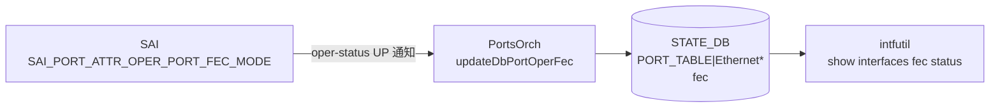

# FEC ステート（STATE_DB PORT_TABLE FEC フィールド）

## 概要

`STATE_DB` の `PORT_TABLE` に `PortsOrch` が書き込む FEC 関連フィールド。Config フィールドではなく、**SAI から取得した oper 値**を反映する読み取り専用の状態情報。

| フィールド | DB | テーブル | 説明 |
|-----------|-----|---------|------|
| `fec` | STATE_DB | `PORT_TABLE\|<port>` | 現在の動作 FEC モード（SAI `SAI_PORT_ATTR_OPER_PORT_FEC_MODE` 由来） |
| `supported_fecs` | STATE_DB | `PORT_TABLE\|<port>` | プラットフォームがサポートする FEC モード一覧（SAI `SAI_PORT_ATTR_SUPPORTED_FEC_MODE` 由来） |

!!! note "CONFIG_DB との関係"
    FEC の **設定** は `CONFIG_DB` の `PORT` テーブル (`fec` フィールド) で行う。このページで説明するフィールドはその設定が ASIC に適用された結果として STATE_DB に書き戻される oper 状態値。

<!-- cdb-mermaid -->
### データフロー



<!-- /cdb-mermaid -->

## key 構造

```text
PORT_TABLE|<name>
```

`<name>` は `Ethernet<N>` 形式の物理ポート名。CONFIG_DB `PORT` テーブルのキーと同一。

## フィールド一覧

| フィールド | 型 | 書込み主体 | デフォルト | 説明 |
|-----------|----|-----------|-----------|------|
| `fec` | string | `PortsOrch` | `"N/A"` | oper FEC モード。ポートが UP かつ SAI が対応する場合のみ `rs`/`fc`/`none` のいずれかが入る |
| `supported_fecs` | string (CSV) | `PortsOrch` | フィールド不在 | サポート FEC モードのカンマ区切りリスト。SAI が未対応のプラットフォームではフィールド自体が存在しない |

## `fec` フィールド詳細

### 書き込みトリガー

`updateDbPortOperFec(port, fec_str)` (portsorch.cpp:9864) は以下の 2 箇所から呼ばれる:

1. **ポート oper-status が UP に変化したとき** — PortsOrch がポートアップ通知を受信 (portsorch.cpp:9682)
2. **`refreshPortStatus()` 実行時** — orchagent 起動時の同期処理 (portsorch.cpp:9920)

### 値決定ロジック

```
if (oper_fec_sup && getPortOperFec(port, fec_mode)):
    fecToStr(fec_str, fec_mode)  ← portFecRevMap で変換
    変換失敗: fec_str = "N/A"
else:
    fec_str = "N/A"
updateDbPortOperFec(port, fec_str)
```

`portFecRevMap` (porthlpr.cpp:85–90):

| SAI 値 | STATE_DB 文字列 |
|--------|----------------|
| `SAI_PORT_FEC_MODE_NONE` | `"none"` |
| `SAI_PORT_FEC_MODE_RS` | `"rs"` |
| `SAI_PORT_FEC_MODE_FC` | `"fc"` |
| それ以外 | `"N/A"` (変換失敗) |

### 取り得る値

| 値 | 意味 |
|----|------|
| `"none"` | FEC 無効で動作中 |
| `"rs"` | Reed-Solomon FEC で動作中 |
| `"fc"` | FireCode FEC で動作中 |
| `"N/A"` | SAI 未対応 / ポート DOWN / PHY ポート以外 / 変換失敗 |

## `supported_fecs` フィールド詳細

### 書き込みトリガー

`initPortSupportedFecModes(alias, port_id)` (portsorch.cpp:3265) は `isFecModeSupported()` が初めて呼ばれた時点で 1 回だけ実行される（lazy init、以後はキャッシュ参照）。

### 値決定ロジック

```
SAI_PORT_ATTR_SUPPORTED_FEC_MODE を取得:
  成功 + 空集合: "N/A" を書き込み
  成功 + 非空:
    各 SAI fec_mode → fecToStr で文字列化
    fec_override_sup=true なら末尾に "auto" を追加
    カンマ区切りで書き込み
  失敗 (NOT_SUPPORTED / NOT_IMPLEMENTED):
    フィールド書き込み自体をスキップ
  失敗 (その他):
    SWSS_LOG_ERROR + スキップ
```

`fec_override_sup` は `SAI_PORT_ATTR_AUTO_NEG_FEC_MODE_OVERRIDE` の `set_implemented && create_implemented` 両方が true のときのみ true になる (portsorch.cpp:996–998)。

### 取り得る値の例

| 値 | 意味 |
|----|------|
| `"none,rs,fc,auto"` | 全モード対応、override 対応あり |
| `"none,rs,fc"` | 全モード対応、override 非対応 |
| `"N/A"` | SAI はサポート FEC クエリに応答したが、対応モードが空集合 |
| (フィールド不在) | SAI が `SAI_PORT_ATTR_SUPPORTED_FEC_MODE` を未実装 |

## 購読者 (consumer)

| プロセス | 参照フィールド | 用途 |
|---------|--------------|------|
| `intfutil` (`show interfaces fec status`) | `STATE_DB PORT_TABLE\|<port>` → `fec` | FEC Oper 列の表示。`oper_status != "up"` の場合は `"N/A"` を上書き表示 |
| `intfutil` (`show interfaces status`) | `APPL_DB PORT_TABLE:<port>` → `fec` | FEC Admin 列（CONFIG_DB 設定値; STATE_DB ではない） |

<!-- ordering -->
## 書込み順依存 (Phase B)

STATE_DB `PORT_TABLE` の `fec` / `supported_fecs` フィールドは `PortsOrch` が書き手となるが、書き込み発生のタイミングと前提条件がフィールドごとに異なる。consumer が読むタイミングによっては中間状態（未書込み・stale 値）を観測しうる。

<!-- evidence: meta/_intermediate/cdb-flow/fec-state-ordering.md -->

### 検出された順序依存

| # | 依存関係 | 方向 | 根拠 |
|---|----------|------|------|
| 1 | SAI ポート作成 (`initializePorts`) → `supported_fecs` 書込み | **強制先行** | `initPortSupportedFecModes` は有効な SAI port_id なしでは実行不可 (portsorch.cpp:6461, 3265) |
| 2 | `postPortInit()` 完了 → `supported_fecs` STATE_DB 書込み | **ポート登録時 1 回限り** | cold boot では `addPort()` の後 `postPortInit()` を呼ぶ (portsorch.cpp:4078, 6461) |
| 3 | ポート oper-status UP 通知 → `fec` 書込み | **イベント駆動・UP 時のみ** | DOWN 遷移では書き込まれない。最後の UP 時の値が残留 (portsorch.cpp:9682–9694) |
| 4 | `oper_fec_sup` フラグ確定 (PortsOrch コンストラクタ) → `fec` 書込み可否決定 | **初期化先行・1 回限り** | false 確定後は `fec` が常に `"N/A"` になることが全呼び出し経路で保証される (portsorch.cpp:1001–1010) |
| 5 | `fec_override_sup` フラグ確定 (PortsOrch コンストラクタ) → `supported_fecs` の `"auto"` 追加可否 | **初期化先行・1 回限り** | true でなければ `"auto"` は絶対に末尾追加されない (portsorch.cpp:990–998, 3310–3313) |
| 6 | warm boot: `onWarmBootEnd()` → `refreshPortStatus()` → `fec` 再同期 | **warm boot 限定・起動後 1 回** | `m_isWarmRestoreStage=false` 直後に全 PHY ポートの FEC を SAI から再取得して上書き (portsorch.cpp:6431) |

### 主要な制約詳細

**`fec` — UP 時のみ書込み (依存 #3)**: `updateDbPortOperFec()` は `status == SAI_PORT_OPER_STATUS_UP` ブロック内でのみ呼ばれる (portsorch.cpp:9668–9694, 9910–9929)。DOWN 遷移では書き込みが発生しないため、`fec` フィールドにはポートが DOWN であっても最後に UP だった時の値が残留する。`intfutil` は表示時に `oper_status != "up"` を確認して `"N/A"` に変換するが、STATE_DB の値自体は変化しない。

**`supported_fecs` — lazy init かつ 1 回限り (依存 #1, #2)**: cold boot では `postPortInit()` 内で `initPortSupportedFecModes()` を呼ぶため、`PortInitDone` 受信後にポートが存在する時点で値が確定する。ただし `m_portSupportedFecModes` に一度格納されると orchagent 再起動まで SAI を再問い合わせしない。トランシーバ換装後も `supported_fecs` が更新されないため、stale な値を consumer が読む可能性がある。

**`oper_fec_sup` / `fec_override_sup` の静的確定 (依存 #4, #5)**: 両フラグは PortsOrch コンストラクタ (portsorch.cpp:987–1010) で SAI capability クエリを 1 回だけ実行して確定する。これ以降は変更されない。この静的評価により、プラットフォームが FEC oper 取得を未実装 (`get_implemented=false`) であれば `fec` は起動から終了まで常に `"N/A"` となる。

**warm boot での再同期 (依存 #6)**: warm boot 完了時に `onWarmBootEnd()` → `refreshPortStatus()` を呼び、全 PHY ポートの FEC を SAI から再取得して STATE_DB に上書きする。cold boot では `refreshPortStatus()` が呼ばれないため、ポート UP イベントが到達するまで `fec` フィールドが書き込まれない（フィールド不在の中間状態になりうる）。

<!-- /ordering -->

<!-- cross-refs -->
## 暗黙参照テーブル (Phase C)

`STATE_DB PORT_TABLE` の `fec` / `supported_fecs` フィールドに関する書き手・読み手それぞれの
暗黙的なテーブル参照をまとめる。

<!-- evidence: meta/_intermediate/cdb-flow/fec-state-cross-refs.md -->

| 依存方向 | 参照元 | 参照先テーブル | 参照先フィールド | 依存内容 | 証跡 |
|---------|--------|--------------|----------------|---------|------|
| 書き手依存 (fec) | `PortsOrch::updateDbPortOperFec` | `STATE_DB PORT_TABLE\|<port>` | `fec` | SAI port_state_change UP 通知受信後に STATE_DB へ書き込む。書き込み前に `oper_fec_sup` フラグ（PortsOrch コンストラクタで確定）を参照し、false なら無条件 `"N/A"` | `portsorch.cpp:9864-9872` |
| 書き手依存 (supported_fecs) | `PortsOrch::initPortSupportedFecModes` | `STATE_DB PORT_TABLE\|<port>` | `supported_fecs` | `postPortInit()` 時に SAI から取得した FEC モード一覧を書き込む。`fec_override_sup` フラグが true の場合のみ末尾に `"auto"` を追加 | `portsorch.cpp:3265-3327` |
| 読み手 (FEC Oper) | `intfutil generate_fec_status()` | `STATE_DB PORT_TABLE\|<port>` | `fec`, `oper_status` | `show interfaces fec status` の FEC Oper 列を生成。`oper_status != "up"` のとき `fec` を `"N/A"` に変換して表示（STATE_DB の値は変更しない） | `intfutil:911-914` |
| 読み手 (FEC Admin) | `intfutil generate_fec_status()` | `APPL_DB PORT_TABLE:<port>` | `fec` | `show interfaces fec status` の FEC Admin 列は **STATE_DB ではなく APPL_DB** から読む。CONFIG_DB `PORT.fec` が portmgrd 経由で APPL_DB に書き込まれた値 | `intfutil:910` |
| 間接参照 (FEC 設定検証) | `PortsOrch::isFecModeSupported` | `m_portSupportedFecModes` (in-memory) | — | CONFIG_DB `PORT.fec` 変更時の妥当性確認に使用。`initPortSupportedFecModes()` の lazy init 結果をキャッシュ参照するため STATE_DB を再読しない | `portsorch.cpp:3205-3222` |
| 間接参照 (トランシーバ) | `PortsOrch` (SubscriberStateTable) | `STATE_DB TRANSCEIVER_INFO_TABLE` | — | トランシーバ存在確認に購読。ただし `supported_fecs` の lazy init はトランシーバ変化では再トリガーされない（`postPortInit()` 時 1 回限り） | `portsorch.cpp:984` |

### FEC Admin と FEC Oper の参照先の違い

`show interfaces fec status` は同一コマンドでも参照 DB が異なる:

| 列 | 参照 DB | テーブル | フィールド |
|----|--------|---------|-----------|
| FEC Oper | STATE_DB | `PORT_TABLE\|<port>` | `fec` |
| FEC Admin | APPL_DB | `PORT_TABLE:<port>` | `fec` |

FEC Admin 列は CONFIG_DB `PORT.<port>.fec` が portmgrd によって APPL_DB に反映された値を読む。
STATE_DB の `fec` (oper) と APPL_DB の `fec` (admin) は別フィールドであり、
ポートが DOWN 中は Oper 側に stale 値が残留する（`intfutil` は表示時に `"N/A"` に変換する）。

<!-- /cross-refs -->

<!-- value-behavior -->
## 値依存挙動マトリクス

### oper_fec_sup フラグ

`oper_fec_sup` (portsorch.cpp:1001–1010) は orchagent 初期化時に 1 回だけ評価される:

| 条件 | `oper_fec_sup` | `fec` フィールドの結果 |
|------|---------------|----------------------|
| `SAI_PORT_ATTR_OPER_PORT_FEC_MODE` の `get_implemented=true` | `true` | SAI 値から設定 |
| `get_implemented=false` / クエリ失敗 | `false` | 常に `"N/A"` |
| `switch_type = "dpu"` | `false` (クエリ自体をスキップ) | 常に `"N/A"` |

### ポート状態と `fec` フィールドの関係

| ポート状態 | `fec` フィールド挙動 |
|-----------|-------------------|
| UP → DOWN | **フィールド更新なし** — 最後に UP だった時の値が残留 |
| DOWN 継続 | 値が stale のまま |
| DOWN 時の `intfutil` 表示 | `"N/A"` に変換して表示（STATE_DB の値は変わらない） |
| UP 復帰 | 再度 SAI から取得して上書き |

<!-- /value-behavior -->

<!-- defaults -->
## フィールド暗黙デフォルト (Phase A — コード由来)

YANG default 外の fallback。`PortsOrch::updateDbPortOperFec` と `initPortSupportedFecModes` の実装から導出。

| フィールド | コード由来デフォルト | fallback 源 |
|-----------|-------------------|------------|
| `fec` | `"N/A"` | opsorch.cpp:9688, 9694 — SAI 未対応 / getPortOperFec 失敗 / fecToStr 失敗の全 path で `"N/A"` を書き込む |
| `supported_fecs` | (フィールド不在) | portsorch.cpp:3279–3284 — SAI が NOT_SUPPORTED/NOT_IMPLEMENTED を返した場合 `m_portStateTable.set()` を呼ばない |
| `supported_fecs` (空集合時) | `"N/A"` | portsorch.cpp:3292 — `supported_fec_modes.empty()` のとき `"N/A"` を push |

### 検出した挙動乖離・注意点

1. **`"auto"` は oper fec に出現しない**: `portFecRevMap` には `SAI_PORT_FEC_MODE_NONE` → `"none"` の逆引きしかなく、`"auto"` は逆引き不可。CONFIG_DB に `fec=auto` を設定してもポートが UP になると `fec` フィールドには実際の oper モード (`"none"` / `"rs"` / `"fc"`) が書き込まれる。`"auto"` という文字列が STATE_DB に現れることはない。

2. **DOWN 時は stale 値**: ポートが DOWN に遷移しても `fec` フィールドはクリアされない。最後に UP だった時の FEC 値が残留する。`intfutil` は表示時に `oper_status != "up"` を確認して `"N/A"` に変換するが、STATE_DB を直接参照するツールは stale 値を読む可能性がある。

3. **`supported_fecs` の lazy init = 再取得なし**: `m_portSupportedFecModes` に一度格納されると orchagent 再起動まで SAI を再問い合わせしない。トランシーバ換装後も値が更新されない（real-time 更新が保証されない）。

4. **フィールド不在 ≠ FEC 非サポート**: `supported_fecs` がない場合は「SAI がサポート FEC クエリに対応していない」だけで、実際には FEC が動作していることがある。NOT_IMPLEMENTED 時はバリデーションをスキップして設定を通す挙動 (portsorch.cpp:3249–3251)。

5. **dpu 環境**: `gMySwitchType == "dpu"` のとき `oper_fec_sup` / `fec_override_sup` のクエリが丸ごとスキップされる。`fec` は常に `"N/A"`、`supported_fecs` の `"auto"` 追加も行われない。

<!-- /defaults -->

<!-- cdb-exceptions -->
## 例外条件・特殊挙動

<!-- evidence: meta/_intermediate/cdb-flow/fec-state-defaults.md -->

- `getPortOperFec()` (portsorch.cpp:9994) は `port.m_type != Port::PHY` のとき即 `return false` → LAG / VLAN ポートでは `fec` は常に `"N/A"`
- `fecToStr` の失敗は SWSS_LOG_ERROR + `"N/A"` フォールバック。未知の SAI fec mode が返った場合は `"N/A"` と表示されるだけでエラー停止しない
- `supported_fecs` の `"auto"` 追加は `fecModeList.empty()` でなく かつ `fec_override_sup=true` の両方が必要 (portsorch.cpp:3310–3313)。空集合 (`"N/A"`) の場合は `"auto"` が追加されない

<!-- /cdb-exceptions -->

## 関連リファレンス

- CONFIG_DB: [`PORT` テーブル](port.md) — FEC の設定フィールド (`fec`)
- アーキテクチャ: [`Port Auto FEC 設計`](../../architecture/sonic-port-auto-fec-design.md) — `fec=auto` モードと `SAI_PORT_ATTR_AUTO_NEG_FEC_MODE_OVERRIDE` の詳細
- CLI: `show interfaces fec status` — oper / admin FEC をまとめて表示
