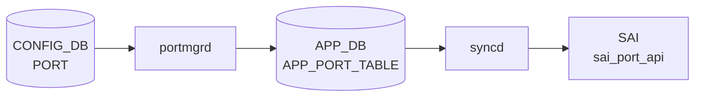

# FEC ステート（STATE_DB PORT_TABLE FEC フィールド）

## 概要

`STATE_DB` の `PORT_TABLE` に `PortsOrch` が書き込む FEC 関連フィールド。Config フィールドではなく、**[SAI](../../reference/glossary.md#term-sai) から取得した oper 値**を反映する読み取り専用の状態情報。

| フィールド | DB | テーブル | 説明 |
|-----------|-----|---------|------|
| `fec` | [STATE_DB](../../reference/glossary.md#term-state_db) | `PORT_TABLE\|<port>` | 現在の動作 FEC モード（[SAI](../../reference/glossary.md#term-sai) `SAI_PORT_ATTR_OPER_PORT_FEC_MODE` 由来） |
| `supported_fecs` | [STATE_DB](../../reference/glossary.md#term-state_db) | `PORT_TABLE\|<port>` | プラットフォームがサポートする FEC モード一覧（[SAI](../../reference/glossary.md#term-sai) `SAI_PORT_ATTR_SUPPORTED_FEC_MODE` 由来） |

!!! note "CONFIG_DB との関係"
    FEC の **設定** は `CONFIG_DB` の `PORT` テーブル (`fec` フィールド) で行う。このページで説明するフィールドはその設定が ASIC に適用された結果として STATE_DB に書き戻される oper 状態値。

<!-- cdb-mermaid -->
### データフロー (自動生成)



!!! note "凡例"
    CONFIG_DB から SAI までの典型経路を `docs/reference/config-db-orch-map.md` から機械生成したミニ図。詳細・例外は本ページ本文と対応表を参照。
<!-- /cdb-mermaid -->

## key 構造

```text
PORT_TABLE|<name>
```

`<name>` は `Ethernet<N>` 形式の物理ポート名。[CONFIG_DB](../../reference/glossary.md#term-config_db) `PORT` テーブルのキーと同一。

## フィールド一覧

| フィールド | 型 | 書込み主体 | デフォルト | 説明 |
|-----------|----|-----------|-----------|------|
| `fec` | string | `PortsOrch` | `"N/A"` | oper FEC モード。ポートが UP かつ SAI が対応する場合のみ `rs`/`fc`/`none` のいずれかが入る |
| `supported_fecs` | string (CSV) | `PortsOrch` | フィールド不在 | サポート FEC モードのカンマ区切りリスト。SAI が未対応のプラットフォームではフィールド自体が存在しない |

## `fec` フィールド詳細

### 書き込みトリガー

`updateDbPortOperFec(port, fec_str)` (portsorch.cpp:9864) は以下の 2 箇所から呼ばれる:

1. **ポート oper-status が UP に変化したとき** — [PortsOrch](../../reference/glossary.md#term-portsorch) がポートアップ通知を受信 (portsorch.cpp:9682)
2. **`refreshPortStatus()` 実行時** — [orchagent](../../reference/glossary.md#term-orchagent) 起動時の同期処理 (portsorch.cpp:9920)

### 値決定ロジック

```
if (oper_fec_sup && getPortOperFec(port, fec_mode)):
    fecToStr(fec_str, fec_mode)  ← portFecRevMap で変換
    変換失敗: fec_str = "N/A"
else:
    fec_str = "N/A"
updateDbPortOperFec(port, fec_str)
```

`portFecRevMap` (porthlpr.cpp:85–90):

| SAI 値 | [STATE_DB](../../reference/glossary.md#term-state_db) 文字列 |
|--------|----------------|
| `SAI_PORT_FEC_MODE_NONE` | `"none"` |
| `SAI_PORT_FEC_MODE_RS` | `"rs"` |
| `SAI_PORT_FEC_MODE_FC` | `"fc"` |
| それ以外 | `"N/A"` (変換失敗) |

### 取り得る値

| 値 | 意味 |
|----|------|
| `"none"` | FEC 無効で動作中 |
| `"rs"` | Reed-Solomon FEC で動作中 |
| `"fc"` | FireCode FEC で動作中 |
| `"N/A"` | SAI 未対応 / ポート DOWN / PHY ポート以外 / 変換失敗 |

## `supported_fecs` フィールド詳細

### 書き込みトリガー

`initPortSupportedFecModes(alias, port_id)` (portsorch.cpp:3265) は `isFecModeSupported()` が初めて呼ばれた時点で 1 回だけ実行される（lazy init、以後はキャッシュ参照）。

### 値決定ロジック

```
SAI_PORT_ATTR_SUPPORTED_FEC_MODE を取得:
  成功 + 空集合: "N/A" を書き込み
  成功 + 非空:
    各 SAI fec_mode → fecToStr で文字列化
    fec_override_sup=true なら末尾に "auto" を追加
    カンマ区切りで書き込み
  失敗 (NOT_SUPPORTED / NOT_IMPLEMENTED):
    フィールド書き込み自体をスキップ
  失敗 (その他):
    SWSS_LOG_ERROR + スキップ
```

`fec_override_sup` は `SAI_PORT_ATTR_AUTO_NEG_FEC_MODE_OVERRIDE` の `set_implemented && create_implemented` 両方が true のときのみ true になる (portsorch.cpp:996–998)。

### 取り得る値の例

| 値 | 意味 |
|----|------|
| `"none,rs,fc,auto"` | 全モード対応、override 対応あり |
| `"none,rs,fc"` | 全モード対応、override 非対応 |
| `"N/A"` | SAI はサポート FEC クエリに応答したが、対応モードが空集合 |
| (フィールド不在) | SAI が `SAI_PORT_ATTR_SUPPORTED_FEC_MODE` を未実装 |

## 購読者 (consumer)

| プロセス | 参照フィールド | 用途 |
|---------|--------------|------|
| `intfutil` (`show interfaces fec status`) | `STATE_DB PORT_TABLE\|<port>` → `fec` | FEC Oper 列の表示。`oper_status != "up"` の場合は `"N/A"` を上書き表示 |
| `intfutil` (`show interfaces status`) | `APPL_DB PORT_TABLE:<port>` → `fec` | FEC Admin 列（[CONFIG_DB](../../reference/glossary.md#term-config_db) 設定値; STATE_DB ではない） |

<!-- ordering -->
## 書込み順依存 (Phase B)

STATE_DB `PORT_TABLE` の `fec` / `supported_fecs` フィールドは `PortsOrch` が書き手となるが、書き込み発生のタイミングと前提条件がフィールドごとに異なる。consumer が読むタイミングによっては中間状態（未書込み・stale 値）を観測しうる。

<!-- evidence: meta/_intermediate/cdb-flow/fec-state-ordering.md -->

### 検出された順序依存

| # | 依存関係 | 方向 | 根拠 |
|---|----------|------|------|
| 1 | SAI ポート作成 (`initializePorts`) → `supported_fecs` 書込み | **強制先行** | `initPortSupportedFecModes` は有効な SAI port_id なしでは実行不可 (portsorch.cpp:6461, 3265) |
| 2 | `postPortInit()` 完了 → `supported_fecs` STATE_DB 書込み | **ポート登録時 1 回限り** | cold boot では `addPort()` の後 `postPortInit()` を呼ぶ (portsorch.cpp:4078, 6461) |
| 3 | ポート oper-status UP 通知 → `fec` 書込み | **イベント駆動・UP 時のみ** | DOWN 遷移では書き込まれない。最後の UP 時の値が残留 (portsorch.cpp:9682–9694) |
| 4 | `oper_fec_sup` フラグ確定 ([PortsOrch](../../reference/glossary.md#term-portsorch) コンストラクタ) → `fec` 書込み可否決定 | **初期化先行・1 回限り** | false 確定後は `fec` が常に `"N/A"` になることが全呼び出し経路で保証される (portsorch.cpp:1001–1010) |
| 5 | `fec_override_sup` フラグ確定 ([PortsOrch](../../reference/glossary.md#term-portsorch) コンストラクタ) → `supported_fecs` の `"auto"` 追加可否 | **初期化先行・1 回限り** | true でなければ `"auto"` は絶対に末尾追加されない (portsorch.cpp:990–998, 3310–3313) |
| 6 | warm boot: `onWarmBootEnd()` → `refreshPortStatus()` → `fec` 再同期 | **warm boot 限定・起動後 1 回** | `m_isWarmRestoreStage=false` 直後に全 PHY ポートの FEC を SAI から再取得して上書き (portsorch.cpp:6431) |

### 主要な制約詳細

**`fec` — UP 時のみ書込み (依存 #3)**: `updateDbPortOperFec()` は `status == SAI_PORT_OPER_STATUS_UP` ブロック内でのみ呼ばれる (portsorch.cpp:9668–9694, 9910–9929)。DOWN 遷移では書き込みが発生しないため、`fec` フィールドにはポートが DOWN であっても最後に UP だった時の値が残留する。`intfutil` は表示時に `oper_status != "up"` を確認して `"N/A"` に変換するが、STATE_DB の値自体は変化しない。

**`supported_fecs` — lazy init かつ 1 回限り (依存 #1, #2)**: cold boot では `postPortInit()` 内で `initPortSupportedFecModes()` を呼ぶため、`PortInitDone` 受信後にポートが存在する時点で値が確定する。ただし `m_portSupportedFecModes` に一度格納されると [orchagent](../../reference/glossary.md#term-orchagent) 再起動まで SAI を再問い合わせしない。トランシーバ換装後も `supported_fecs` が更新されないため、stale な値を consumer が読む可能性がある。

**`oper_fec_sup` / `fec_override_sup` の静的確定 (依存 #4, #5)**: 両フラグは PortsOrch コンストラクタ (portsorch.cpp:987–1010) で SAI capability クエリを 1 回だけ実行して確定する。これ以降は変更されない。この静的評価により、プラットフォームが FEC oper 取得を未実装 (`get_implemented=false`) であれば `fec` は起動から終了まで常に `"N/A"` となる。

**warm boot での再同期 (依存 #6)**: warm boot 完了時に `onWarmBootEnd()` → `refreshPortStatus()` を呼び、全 PHY ポートの FEC を SAI から再取得して STATE_DB に上書きする。cold boot では `refreshPortStatus()` が呼ばれないため、ポート UP イベントが到達するまで `fec` フィールドが書き込まれない（フィールド不在の中間状態になりうる）。

<!-- /ordering -->

<!-- cross-refs -->
## 暗黙参照テーブル (Phase C)

`STATE_DB PORT_TABLE` の `fec` / `supported_fecs` フィールドに関する書き手・読み手それぞれの
暗黙的なテーブル参照をまとめる。

<!-- evidence: meta/_intermediate/cdb-flow/fec-state-cross-refs.md -->

| 依存方向 | 参照元 | 参照先テーブル | 参照先フィールド | 依存内容 | 証跡 |
|---------|--------|--------------|----------------|---------|------|
| 書き手依存 (fec) | `PortsOrch::updateDbPortOperFec` | `STATE_DB PORT_TABLE\|<port>` | `fec` | SAI port_state_change UP 通知受信後に STATE_DB へ書き込む。書き込み前に `oper_fec_sup` フラグ（PortsOrch コンストラクタで確定）を参照し、false なら無条件 `"N/A"` | `portsorch.cpp:9864-9872` |
| 書き手依存 (supported_fecs) | `PortsOrch::initPortSupportedFecModes` | `STATE_DB PORT_TABLE\|<port>` | `supported_fecs` | `postPortInit()` 時に SAI から取得した FEC モード一覧を書き込む。`fec_override_sup` フラグが true の場合のみ末尾に `"auto"` を追加 | `portsorch.cpp:3265-3327` |
| 読み手 (FEC Oper) | `intfutil generate_fec_status()` | `STATE_DB PORT_TABLE\|<port>` | `fec`, `oper_status` | `show interfaces fec status` の FEC Oper 列を生成。`oper_status != "up"` のとき `fec` を `"N/A"` に変換して表示（STATE_DB の値は変更しない） | `intfutil:911-914` |
| 読み手 (FEC Admin) | `intfutil generate_fec_status()` | `APPL_DB PORT_TABLE:<port>` | `fec` | `show interfaces fec status` の FEC Admin 列は **STATE_DB ではなく [APPL_DB](../../reference/glossary.md#term-appl_db)** から読む。[CONFIG_DB](../../reference/glossary.md#term-config_db) `PORT.fec` が [portmgrd](../../reference/glossary.md#term-portmgrd) 経由で [APPL_DB](../../reference/glossary.md#term-appl_db) に書き込まれた値 | `intfutil:910` |
| 間接参照 (FEC 設定検証) | `PortsOrch::isFecModeSupported` | `m_portSupportedFecModes` (in-memory) | — | CONFIG_DB `PORT.fec` 変更時の妥当性確認に使用。`initPortSupportedFecModes()` の lazy init 結果をキャッシュ参照するため STATE_DB を再読しない | `portsorch.cpp:3205-3222` |
| 間接参照 (トランシーバ) | `PortsOrch` (SubscriberStateTable) | `STATE_DB TRANSCEIVER_INFO_TABLE` | — | トランシーバ存在確認に購読。ただし `supported_fecs` の lazy init はトランシーバ変化では再トリガーされない（`postPortInit()` 時 1 回限り） | `portsorch.cpp:984` |

### FEC Admin と FEC Oper の参照先の違い

`show interfaces fec status` は同一コマンドでも参照 DB が異なる:

| 列 | 参照 DB | テーブル | フィールド |
|----|--------|---------|-----------|
| FEC Oper | STATE_DB | `PORT_TABLE\|<port>` | `fec` |
| FEC Admin | [APPL_DB](../../reference/glossary.md#term-appl_db) | `PORT_TABLE:<port>` | `fec` |

FEC Admin 列は CONFIG_DB `PORT.<port>.fec` が [portmgrd](../../reference/glossary.md#term-portmgrd) によって APPL_DB に反映された値を読む。
STATE_DB の `fec` (oper) と APPL_DB の `fec` (admin) は別フィールドであり、
ポートが DOWN 中は Oper 側に stale 値が残留する（`intfutil` は表示時に `"N/A"` に変換する）。

<!-- /cross-refs -->

<!-- value-behavior -->
## 値依存挙動マトリクス

### oper_fec_sup フラグ

`oper_fec_sup` (portsorch.cpp:1001–1010) は [orchagent](../../reference/glossary.md#term-orchagent) 初期化時に 1 回だけ評価される:

| 条件 | `oper_fec_sup` | `fec` フィールドの結果 |
|------|---------------|----------------------|
| `SAI_PORT_ATTR_OPER_PORT_FEC_MODE` の `get_implemented=true` | `true` | SAI 値から設定 |
| `get_implemented=false` / クエリ失敗 | `false` | 常に `"N/A"` |
| `switch_type = "dpu"` | `false` (クエリ自体をスキップ) | 常に `"N/A"` |

### ポート状態と `fec` フィールドの関係

| ポート状態 | `fec` フィールド挙動 |
|-----------|-------------------|
| UP → DOWN | **フィールド更新なし** — 最後に UP だった時の値が残留 |
| DOWN 継続 | 値が stale のまま |
| DOWN 時の `intfutil` 表示 | `"N/A"` に変換して表示（STATE_DB の値は変わらない） |
| UP 復帰 | 再度 SAI から取得して上書き |

<!-- /value-behavior -->

<!-- defaults -->
## フィールド暗黙デフォルト (Phase A — コード由来)

[YANG](../../reference/glossary.md#term-yang) default 外の fallback。`PortsOrch::updateDbPortOperFec` と `initPortSupportedFecModes` の実装から導出。

| フィールド | コード由来デフォルト | fallback 源 |
|-----------|-------------------|------------|
| `fec` | `"N/A"` | opsorch.cpp:9688, 9694 — SAI 未対応 / getPortOperFec 失敗 / fecToStr 失敗の全 path で `"N/A"` を書き込む |
| `supported_fecs` | (フィールド不在) | portsorch.cpp:3279–3284 — SAI が NOT_SUPPORTED/NOT_IMPLEMENTED を返した場合 `m_portStateTable.set()` を呼ばない |
| `supported_fecs` (空集合時) | `"N/A"` | portsorch.cpp:3292 — `supported_fec_modes.empty()` のとき `"N/A"` を push |

### 検出した挙動乖離・注意点

1. **`"auto"` は oper fec に出現しない**: `portFecRevMap` には `SAI_PORT_FEC_MODE_NONE` → `"none"` の逆引きしかなく、`"auto"` は逆引き不可。CONFIG_DB に `fec=auto` を設定してもポートが UP になると `fec` フィールドには実際の oper モード (`"none"` / `"rs"` / `"fc"`) が書き込まれる。`"auto"` という文字列が STATE_DB に現れることはない。

2. **DOWN 時は stale 値**: ポートが DOWN に遷移しても `fec` フィールドはクリアされない。最後に UP だった時の FEC 値が残留する。`intfutil` は表示時に `oper_status != "up"` を確認して `"N/A"` に変換するが、STATE_DB を直接参照するツールは stale 値を読む可能性がある。

3. **`supported_fecs` の lazy init = 再取得なし**: `m_portSupportedFecModes` に一度格納されると orchagent 再起動まで SAI を再問い合わせしない。トランシーバ換装後も値が更新されない（real-time 更新が保証されない）。

4. **フィールド不在 ≠ FEC 非サポート**: `supported_fecs` がない場合は「SAI がサポート FEC クエリに対応していない」だけで、実際には FEC が動作していることがある。NOT_IMPLEMENTED 時はバリデーションをスキップして設定を通す挙動 (portsorch.cpp:3249–3251)。

5. **dpu 環境**: `gMySwitchType == "dpu"` のとき `oper_fec_sup` / `fec_override_sup` のクエリが丸ごとスキップされる。`fec` は常に `"N/A"`、`supported_fecs` の `"auto"` 追加も行われない。

<!-- /defaults -->

<!-- cdb-exceptions -->
## 例外条件・特殊挙動

<!-- evidence: meta/_intermediate/cdb-flow/fec-state-defaults.md -->

- `getPortOperFec()` (portsorch.cpp:9994) は `port.m_type != Port::PHY` のとき即 `return false` → [LAG](../../reference/glossary.md#term-lag) / [VLAN](../../reference/glossary.md#term-vlan) ポートでは `fec` は常に `"N/A"`
- `fecToStr` の失敗は SWSS_LOG_ERROR + `"N/A"` フォールバック。未知の SAI fec mode が返った場合は `"N/A"` と表示されるだけでエラー停止しない
- `supported_fecs` の `"auto"` 追加は `fecModeList.empty()` でなく かつ `fec_override_sup=true` の両方が必要 (portsorch.cpp:3310–3313)。空集合 (`"N/A"`) の場合は `"auto"` が追加されない

<!-- /cdb-exceptions -->

<!-- failure -->
## 失敗挙動 (Phase D)

`PortsOrch` による FEC モード適用 (`doPortTask` → `setPortFec`) と FEC oper 値取得 (`getPortOperFec`) の失敗経路を整理する。STATE_DB `PORT_TABLE` の `fec` / `supported_fecs` フィールドへの書込みは `swss::Table::set()` (void 返却) を使うため、**[Redis](../../reference/glossary.md#term-redis) 書込み自体の失敗はアプリ層では検出不可**。[Redis](../../reference/glossary.md#term-redis) 例外は orchagent プロセス abort → systemd 再起動という経路で回収される。

<!-- evidence: meta/_intermediate/cdb-flow/fec-state-failure.md -->

### FEC モード SET 時の失敗パターン (`doPortTask`)

| # | 失敗ケース | 発生箇所 | 挙動 | retry | STATE_DB への影響 |
|---|-----------|---------|------|-------|-----------------|
| 1 | `fec_override_sup=false` かつ `fec=auto`（auto FEC 非対応プラットフォーム） | portsorch.cpp:5317-5321 | SWSS_LOG_ERROR → `erase(it)`（恒久スキップ） | なし | 書込なし |
| 2 | `isFecModeSupported()` が false（プラットフォーム未サポート FEC モード） | portsorch.cpp:5323-5331 | SWSS_LOG_ERROR → `erase(it)`（恒久スキップ） | なし | 書込なし |
| 3 | `setPortAdminStatus(false)` 失敗（FEC 適用前の port DOWN に失敗） | portsorch.cpp:5342-5350 | SWSS_LOG_ERROR → `it++`（無制限 retry） | 無制限 | 書込なし |
| 4 | SAI `set_port_attribute(SAI_PORT_ATTR_FEC_MODE)` 失敗 | portsorch.cpp:2394-2401 | SWSS_LOG_ERROR → `handleSaiSetStatus` 判定 → 上位呼出元へ false 返却 | 条件次第 | 書込なし |
| 5 | SAI `set_port_attribute(AUTO_NEG_FEC_MODE_OVERRIDE)` 失敗 | portsorch.cpp:2405-2408 | SWSS_LOG_ERROR → `handleSaiSetStatus` 判定 → false 返却 | 条件次第 | 書込なし |
| 6 | `setPortFec()` が false を返した（SAI 失敗の上位検出） | portsorch.cpp:5356-5363 | SWSS_LOG_ERROR → `it++`（無制限 retry） | 無制限 | 書込なし |

!!! warning "恒久スキップ（#1, #2）での APPL_DB 消費"
    `erase(it)` パターンでは APPL_DB のタスクエントリが消費される。orchagent は再試行しないため、CONFIG_DB 側に FEC 設定が残っていても STATE_DB への適用は永久に行われない。systemd 再起動 + CONFIG_DB 再投入が回復手段となる。

### `getPortOperFec` — SAI クエリ失敗

| 失敗条件 | 発生箇所 | 結果 | STATE_DB の `fec` |
|---------|---------|------|-----------------|
| `port.m_type != Port::PHY`（[LAG](../../reference/glossary.md#term-lag) / [VLAN](../../reference/glossary.md#term-vlan) ポート等） | portsorch.cpp:9998-10000 | `return false` → `fec_str = "N/A"` | `"N/A"` 書込み |
| SAI `get_port_attribute(OPER_PORT_FEC_MODE)` 失敗 | portsorch.cpp:10007-10010 | SWSS_LOG_NOTICE → `return false` → `fec_str = "N/A"` | `"N/A"` 書込み |
| `fecToStr()` 変換失敗（未知 SAI fec_mode） | portsorch.cpp:9684-9688 | SWSS_LOG_ERROR → `fec_str = "N/A"` | `"N/A"` 書込み |

いずれの失敗経路でも `updateDbPortOperFec(port, "N/A")` が呼ばれ STATE_DB に `"N/A"` が書き込まれる。エラー停止はしない。

### `isFecModeSupported` の特殊ケース（空集合 vs 非対応の逆転）

| SAI クエリ結果 | `obj.supported` | `obj.data` | `isFecModeSupported()` 戻り値 | 設定への影響 |
|--------------|----------------|-----------|------------------------------|-----------|
| `NOT_SUPPORTED` / `NOT_IMPLEMENTED` | `false` | 空 | **`true`（バリデーションスキップ）** | FEC 設定を通す |
| 成功、対応モード空集合 | `true` | 空 | **`false`（全モード拒否）** | #2 失敗で erase |
| 成功、対応モードあり、指定モード含まず | `true` | 非空 | `false` | #2 失敗で erase |
| 成功、対応モードあり、指定モード含む | `true` | 非空 | `true` | 正常適用 |

証跡: portsorch.cpp:3205-3222（`isFecModeSupported`）、3244-3251（`getPortSupportedFecModes` NOT_IMPLEMENTED 分岐）。

### 失敗後の `m_fec_cfg` フラグと再試行

FEC SET 成功時のみ `p.m_fec_cfg = true` をセットして `m_portList` を更新する (portsorch.cpp:5366-5369)。失敗時は `m_fec_cfg=false` のまま。次サイクルで `m_fec_cfg` または `m_fec_mode != pCfg.fec.value` の変化検出条件が再評価され、retry ループが動く（`it++` パターンのみ。`erase(it)` パターンは再試行されない）。

<!-- /failure -->

<!-- constants -->
## ハードコード定数 (Phase E)

`PortsOrch` と `PortHelper` が FEC フィールドの書込み・検証に使うハードコード文字列定数・マップを整理する。

<!-- evidence: meta/_intermediate/cdb-flow/fec-state-constants.md -->

### FEC モード文字列定数 (portschema.h:38–41)

| マクロ | 値 | 用途 |
|-------|----|------|
| `PORT_FEC_NONE` | `"none"` | CONFIG_DB 設定値 / STATE_DB `supported_fecs` リスト要素 |
| `PORT_FEC_RS` | `"rs"` | 同上 |
| `PORT_FEC_FC` | `"fc"` | 同上 |
| `PORT_FEC_AUTO` | `"auto"` | CONFIG_DB 設定値 / `supported_fecs` 末尾追加値（oper fec には出現しない） |

### SAI ↔ 文字列変換マップ (porthlpr.cpp:77–98)

**`portFecMap`**（文字列 → SAI fec mode、CONFIG_DB 設定時の変換に使用）:

| キー | 値 |
|------|----|
| `"none"` | `SAI_PORT_FEC_MODE_NONE` |
| `"rs"` | `SAI_PORT_FEC_MODE_RS` |
| `"fc"` | `SAI_PORT_FEC_MODE_FC` |
| `"auto"` | `SAI_PORT_FEC_MODE_NONE`（auto は NONE にマップ） |

**`portFecRevMap`**（SAI fec mode → 文字列、STATE_DB `fec` フィールド書込みに使用）:

| キー | 値 |
|------|----|
| `SAI_PORT_FEC_MODE_NONE` | `"none"` |
| `SAI_PORT_FEC_MODE_RS` | `"rs"` |
| `SAI_PORT_FEC_MODE_FC` | `"fc"` |
| （それ以外） | マップ不在 → `fecToStr()` が `false` を返し `"N/A"` フォールバック |

`portFecRevMap` に `"auto"` エントリが**存在しない**ため、STATE_DB `fec` フィールドに `"auto"` という値が現れることはない。`fec=auto` で設定されたポートが UP しても、SAI は実際の FEC モード（`NONE`/`RS`/`FC`）を返すのでそれが書き込まれる。

**`portFecOverrideMap`**（FEC モード → `SAI_PORT_ATTR_AUTO_NEG_FEC_MODE_OVERRIDE` が必要か、porthlpr.cpp:92–98）:

| FEC モード | override 必要 |
|-----------|--------------|
| `"none"` | `true` |
| `"rs"` | `true` |
| `"fc"` | `true` |
| `"auto"` | `false`（SAI の auto-neg に委ねるため override 不要） |

### フォールバック文字列

| 値 | 定義箇所 | 用途 |
|----|---------|------|
| `"N/A"` | portsorch.cpp 各所（リテラル） | `fec` フィールドのフォールバック。[YANG](../../reference/glossary.md#term-yang) 定義外の値だが orchagent が書き込む |
| `"N/A"` | portsorch.cpp:3292（`supported_fec_modes.empty()` 時） | `supported_fecs` 空集合時のフォールバック |

`"N/A"` は [YANG](../../reference/glossary.md#term-yang) スキーマに含まれない orchagent 独自のセンチネル値。YANG が想定する有効値セット（`none`/`rs`/`fc`/`auto`）とは別系統の値として扱う必要がある。

### 拡張性の制約

`portFecMap` / `portFecRevMap` はコンパイル時に固定されたスタティック `unordered_map`。新しい SAI FEC モード（例: `SAI_PORT_FEC_MODE_RS_KP4` 等）が追加されても、これらのマップを手動更新しない限り変換に失敗して `"N/A"` となる。orchagent の再コンパイルが必要であり、設定ファイルや YANG の変更だけでは対応不可。

<!-- /constants -->

<!-- side-effects -->
## 副次 DB 書込 (Phase F)

STATE_DB `PORT_TABLE` の `fec` / `supported_fecs` フィールドへの書込みは `PortsOrch` が行う主作用だが、同一トリガーで他 DB・他フィールドへの副次的な書込みが発生する。consumer がこれらの副次書込みを前提に状態を読む場合、書込み順序と原子性の欠如を考慮する必要がある。

<!-- evidence: meta/_intermediate/cdb-flow/fec-state-side-effects.md -->

### トリガー A: ポート UP 通知（`fec` フィールドと同時に発生する副次書込）

ポート oper-status UP 通知受信 → `status == SAI_PORT_OPER_STATUS_UP` ブロック内で以下が順次実行される:

| # | 副次書込 | DB | テーブル | フィールド | 証跡 |
|---|---------|-----|---------|-----------|------|
| 1 | `updateDbPortOperStatus()` | APPL_DB | `PORT_TABLE:<port>` | `oper_status` = `"up"` | `portsorch.cpp:9667, 9787, 3928-3930` |
| 2 | `updateDbPortOperSpeed()` | STATE_DB | `PORT_TABLE\|<port>` | `speed` = oper speed (Mbps) / `"N/A"` | `portsorch.cpp:9671-9678, 9850-9857` |
| 3 | **`updateDbPortOperFec()`** | STATE_DB | `PORT_TABLE\|<port>` | **`fec`**（本ページの主作用） | `portsorch.cpp:9690, 9694, 9864-9870` |

3 回の書込みは [Redis](../../reference/glossary.md#term-redis) `set` コマンドとして独立して発行される。APPL_DB と STATE_DB は別接続のため、`oper_status` が APPL_DB に書かれた時点で `fec` がまだ STATE_DB に届いていない中間状態が生じうる。

### トリガー B: `postPortInit()` 呼出し（`supported_fecs` と同時に発生する副次書込）

`postPortInit()` (portsorch.cpp:6445) 内で以下が順次実行される:

| # | 副次書込 | DB | テーブル | フィールド | 証跡 |
|---|---------|-----|---------|-----------|------|
| 1 | `initPortSupportedSpeeds()` | STATE_DB | `PORT_TABLE\|<port>` | `supported_speeds` = サポート速度 CSV | `portsorch.cpp:6460, 3159-3172` |
| 2 | **`initPortSupportedFecModes()`** | STATE_DB | `PORT_TABLE\|<port>` | **`supported_fecs`**（本ページの主作用） | `portsorch.cpp:6461, 3265-3320` |

`supported_speeds` が先に書かれた後、`supported_fecs` が書かれる。両フィールドとも lazy init で 1 回限り。

### トリガー C: `addPort()` でのポート登録（`supported_fecs` より先に発生）

`addPort()` (portsorch.cpp:4118) は `m_counterNameMapUpdater->setCounterNameMap()` を呼び [COUNTERS_DB](../../reference/glossary.md#term-counters_db) を更新する。この時点では `initPortSupportedFecModes()` はまだ呼ばれていない（`postPortInit()` が後で呼ばれる）。

| 副次書込 | DB | テーブル / キー | 書込内容 | 証跡 |
|---------|-----|--------------|---------|------|
| `setCounterNameMap()` | [COUNTERS_DB](../../reference/glossary.md#term-counters_db) | `COUNTERS_PORT_NAME_MAP` | `<port_alias>` → SAI port OID 文字列 | `portsorch.cpp:4114-4118` |

!!! note "FEC 設定変更では COUNTERS_PORT_NAME_MAP は更新されない"
    `COUNTERS_PORT_NAME_MAP` は `addPort()` 時の 1 回限りの書込みで確定する。ポート削除時は `delCounterNameMap()` (portsorch.cpp:4312) で削除される。FEC モード変更 (`doPortTask` → `setPortFec`) では `COUNTERS_PORT_NAME_MAP` は再書込みされない。

<!-- /side-effects -->

<!-- pubsub -->
## 通信メカニズム (Phase G)

`STATE_DB PORT_TABLE` の `fec` / `supported_fecs` フィールドは `PortsOrch` を唯一の書き手とする**読み取り専用のステータスレジスタ**であり、`ProducerStateTable` / `NotificationProducer` を介した PUBLISH 通知は発行されない。consumer 側 (`intfutil` / `generic_config_updater`) は keyspace 通知を購読せず、必要時にのみオンデマンドで読み出す。

<!-- evidence: meta/_intermediate/cdb-flow/fec-state-pubsub.md -->

### 書込み API: 素の `swss::Table`

`PortsOrch` は STATE_DB PORT_TABLE を `swss::Table` メンバとして保有する (`portsorch.h:320`):

```cpp
// portsorch.h:320
Table m_portStateTable;   // = Table(stateDb, STATE_PORT_TABLE_NAME)
```

初期化は `portsorch.cpp:725` で `stateDb` を直結する。`ProducerStateTable` のような `_KEY_SET` + `PUBLISH <TABLE>_CHANNEL` 系の通知は一切発行しない。書込みは純粋な `HSET` のみ。

主な書込ポイント:

- `updateDbPortOperFec()` (portsorch.cpp:9864–9871): `m_portStateTable.set(alias, [("fec", fec_str)])` — ポート UP 時
- `initPortSupportedFecModes()` (portsorch.cpp:3316–3320): `m_portStateTable.set(alias, [("supported_fecs", ...)])` — postPortInit 時 1 回

### Producer/Consumer ペア

| 区間 | 方式 | チャンネル / API | タイミング |
|------|------|----------------|---------|
| `PortsOrch` → STATE_DB `PORT_TABLE\|<port>.fec` | `swss::Table::set()` (HSET) | なし（PUBLISH 非発行） | ポート UP イベント / warm boot `refreshPortStatus()` |
| `PortsOrch` → STATE_DB `PORT_TABLE\|<port>.supported_fecs` | `swss::Table::set()` (HSET) | なし（PUBLISH 非発行） | `postPortInit()` 時 1 回（lazy init） |
| `intfutil` ← STATE_DB `PORT_TABLE\|<port>.fec` | `db.get()` (HGET, on-demand) | — | `show interfaces fec status` 実行毎 1 回 |
| `generic_config_updater` ← STATE_DB `PORT_TABLE\|<port>.supported_fecs` | `read_statedb_entry()` (HGET) | — | CONFIG_DB PATCH 適用前バリデーション時 |

### `generic_config_updater` による `supported_fecs` 参照

`generic_config_updater/field_operation_validators.py:216` は CONFIG_DB `PORT.fec` を変更する PATCH の事前検証で `supported_fecs` を参照する:

```python
supported_fecs_str = read_statedb_entry(scope, "PORT_TABLE", port, "supported_fecs")
if supported_fecs_str:
    if supported_fecs_str != 'N/A':
        supported_fecs_list = [e.strip() for e in supported_fecs_str.split(',')]
    else:
        supported_fecs_list = []
else:
    supported_fecs_list = DEFAULT_SUPPORTED_FECS_LIST
if value.strip() not in supported_fecs_list:
    return False
```

`supported_fecs` フィールドが不在（SAI 未実装プラットフォーム）の場合は `DEFAULT_SUPPORTED_FECS_LIST` にフォールバックし、バリデーションは通る。

### STATE_PORT_TABLE を購読するプロセスと FEC フィールドの非参照

以下のプロセスは `STATE_PORT_TABLE`（`SubscriberStateTable` または `Table`）を購読・参照するが、`fec` / `supported_fecs` フィールドを参照するコードは存在しない:

| プロセス | 参照する STATE_PORT_TABLE フィールド | FEC 参照 |
|---------|--------------------------------|---------|
| `intfmgr` (SubscriberStateTable) | `netdev_oper_status` | なし |
| `portmgrd` (Table 読み取り) | ポート存在確認 | なし |
| `nbrmgr` | `netdev_oper_status` | なし |
| `teammgrd` | ポート存在確認 | なし |
| `buffermgrdyn` | ポート speed / oper_status 系 | なし |

<!-- /pubsub -->

<!-- platform -->
## プラットフォーム / SAI Capability 差異 (Phase H)

STATE_DB `PORT_TABLE` の `fec` / `supported_fecs` フィールドの書込み有無・値は、
プラットフォームごとの SAI Capability 実装状況によって大きく異なる。
`PortsOrch` はコンストラクタで 2 つの SAI capability クエリを実行し、その結果をフラグとして保持する。

<!-- evidence: meta/_intermediate/cdb-flow/fec-state-platform.md -->

### `oper_fec_sup` / `fec_override_sup` フラグの確定

`PortsOrch` コンストラクタ (portsorch.cpp:987–1010) は `gMySwitchType != "dpu"` のときのみ以下を実行する。

| フラグ | 対応 SAI 属性 | 確定条件 | 影響するフィールド |
|--------|-------------|---------|-----------------|
| `oper_fec_sup` | `SAI_PORT_ATTR_OPER_PORT_FEC_MODE` | `get_implemented=true` のとき `true` | `fec` フィールドへの SAI oper 値書込み |
| `fec_override_sup` | `SAI_PORT_ATTR_AUTO_NEG_FEC_MODE_OVERRIDE` | `set_implemented && create_implemented` 両方 `true` のとき `true` | `supported_fecs` への `"auto"` 末尾追加 / `fec=auto` 設定可否 |

両フラグはコンストラクタ内で 1 回のみ評価され、orchagent 再起動まで変化しない。

### DPU プラットフォームの特別扱い

`gMySwitchType == "dpu"` のとき上記 SAI capability クエリブロック全体がスキップされるため、両フラグはデフォルト値 `false` のままとなる。

| 条件 | `oper_fec_sup` | `fec_override_sup` | `fec` フィールド | `"auto"` 出現 |
|------|---------------|-------------------|----------------|-------------|
| `gMySwitchType == "dpu"` | `false`（スキップ） | `false`（スキップ） | 常に `"N/A"` | なし |
| `gMySwitchType != "dpu"` | SAI クエリ次第 | SAI クエリ次第 | SAI 値 or `"N/A"` | `fec_override_sup=true` 時のみ |

### プラットフォーム別挙動一覧

| プラットフォーム | `oper_fec_sup` | `fec_override_sup` | `fec` 書込み | `supported_fecs` | `"auto"` 含む |
|----------------|---------------|-------------------|------------|-----------------|-------------|
| Broadcom (Trident4 / Tomahawk4 以降) | `true` | `true` | SAI oper 値 (`none`/`rs`/`fc`) | SAI 対応モード CSV | ◎ |
| Broadcom 旧世代 (Trident2 等) | `false`（get 未実装） | プラットフォーム次第 | `"N/A"` 固定 | フィールド不在 (NOT_IMPLEMENTED 多) | ✗ |
| Mellanox/NVIDIA Spectrum | `true` | `true` | SAI oper 値 | SAI 対応モード CSV | ◎ |
| [DPU](../../reference/glossary.md#term-dpu) | `false`（クエリスキップ） | `false`（クエリスキップ） | `"N/A"` 固定 | SAI 次第（多くは不在） | ✗ |
| VS (仮想スイッチ) | `false`（SAI stub が unimplemented） | `false` | `"N/A"` 固定 | フィールド不在 | ✗ |

### `fec=auto` 設定とプラットフォーム制約

`fec_override_sup=false` のプラットフォームで CONFIG_DB に `fec=auto` を設定すると、
`doPortTask` (portsorch.cpp:5317–5321) が `SWSS_LOG_ERROR("Auto FEC mode is not supported")` を出力し
タスクエントリを永久スキップ (`erase(it)`) する。STATE_DB には何も書き込まれず、systemd 再起動 + CONFIG_DB 再投入が必要となる。

### Mellanox (NVIDIA Spectrum) 固有コードと FEC フィールドの無関係性

`isMlnxPlatform()` 関数 (portsorch.cpp:689) が使われる分岐は FEC フィールド書込みとは無関係:

| `isMlnxPlatform()` 使用箇所 | 用途 |
|---------------------------|------|
| portsorch.cpp:858 | Trim 統計プラグイン (`nvdaPortTrimSha`) の追加判定 |
| portsorch.cpp:6362, 6379 | [LAG](../../reference/glossary.md#term-lag) distribution/collection 順序制御 |

STATE_DB `fec` / `supported_fecs` への書込みはプラットフォーム文字列検査ではなく
SAI capability クエリ結果（`oper_fec_sup` / `fec_override_sup`）のみで制御される。

<!-- /platform -->

## 関連リファレンス

- CONFIG_DB: [`PORT` テーブル](port.md) — FEC の設定フィールド (`fec`)
- アーキテクチャ: [`Port Auto FEC 設計`](../../architecture/sonic-port-auto-fec-design.md) — `fec=auto` モードと `SAI_PORT_ATTR_AUTO_NEG_FEC_MODE_OVERRIDE` の詳細
- CLI: `show interfaces fec status` — oper / admin FEC をまとめて表示

<!-- glossary-links-injected: 6cf1efdb47f1 -->
