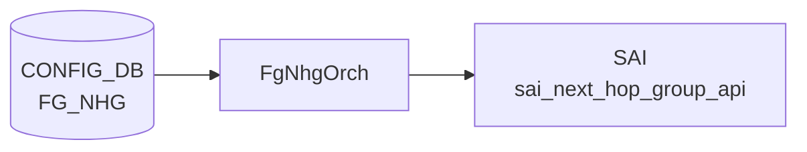

# FG_NHG テーブル

## 概要

Fine-Grained [ECMP](../../reference/glossary.md#term-ecmp) (FG ECMP) の next-hop group 定義。プレフィックスやネクストホップ単位で、固定サイズのハッシュバケットを使ったフロー安定化 ECMP を提供する[^1]。`orchagent` の `FgNhgOrch` が [CONFIG_DB](../../reference/glossary.md#term-config_db) を購読する。

<!-- cdb-mermaid -->
### データフロー (自動生成)



!!! note "凡例"
    CONFIG_DB から SAI までの典型経路を `docs/reference/config-db-orch-map.md` から機械生成したミニ図。詳細・例外は本ページ本文と対応表を参照。
<!-- /cdb-mermaid -->

## 関連 3 テーブル

```
FG_NHG|<name>                    # グループ定義
FG_NHG_PREFIX|<ip_prefix>        # prefix → group
FG_NHG_MEMBER|<next_hop_ip>      # next-hop → group + bank
```

## FG_NHG

| フィールド | 型 | 必須 | 説明 |
|-----------|----|------|------|
| `bucket_size` | uint16 | yes | バケット総数。1..N の最小公倍数を推奨 |
| `match_mode` | enum `route-based`/`nexthop-based`/`prefix-based` | yes | FG 適用判定方式 |
| `max_next_hops` | uint16 (1..128) | `prefix-based` 時 | dynamic-nhg モードでルート更新が運ぶ最大 nexthop 数 |

## FG_NHG_PREFIX

| フィールド | 型 | 必須 | 説明 |
|-----------|----|------|------|
| `ip_prefix` (key) | sonic-ip-prefix | - | FG 動作対象の prefix |
| `FG_NHG` | leafref `FG_NHG.name` | yes | 紐付けるグループ |

## FG_NHG_MEMBER

| フィールド | 型 | 必須 | 説明 |
|-----------|----|------|------|
| `next_hop_ip` (key) | inet:ip-address | - | メンバ next-hop |
| `FG_NHG` | leafref `FG_NHG.name` | yes | 所属グループ |
| `bank` | uint16 | yes | bank index (再分配単位) |
| `link` | union leafref `PORT`/`PORTCHANNEL` | no | 紐付けリンク。op state 連動でメンバ追加/削除 |

## match_mode の意味

- `nexthop-based`: nexthop IP のみで FG 判定
- `route-based`: prefix と nexthop IP の両方で FG 判定
- `prefix-based`: prefix のみで FG 判定。nexthop は route 更新から派生し `FG_NHG_MEMBER` 不要 (dynamic NHG)

## 購読者

- `orchagent` の `FgNhgOrch`: [SAI](../../reference/glossary.md#term-sai) で固定サイズの NEXT_HOP_GROUP を生成し、メンバ追加/削除でハッシュバケット位置を維持

## 関連 CONFIG_DB / YANG / CLI

- 関連 CONFIG_DB: `PORT`、`PORTCHANNEL`
- 関連 [YANG](../../reference/glossary.md#term-yang): `sonic-fine-grained-ecmp`

<!-- ref-triangle:start -->

## 関連リファレンス

- YANG: [`sonic-fine-grained-ecmp`](../yang/sonic-fine-grained-ecmp.md)

<!-- ref-triangle:end -->

## 引用元

[^1]: YANG 定義: `sonic-fine-grained-ecmp.yang`. <https://github.com/sonic-net/sonic-buildimage/blob/9ea932ec2e18f35e58268ec2e4456b1d4afd65cd/src/sonic-yang-models/yang-models/sonic-fine-grained-ecmp.yang>

<!-- ops-hint -->
## 運用ヒント

### 典型値

- key 形式: `FG_NHG|<name>`、`FG_NHG_PREFIX|<prefix>`、`FG_NHG_MEMBER|<nh_ip>`。
- `bucket_size`: 64 や 128 等、メンバ数の最小公倍数を考慮した値。
- `match_mode`: `nexthop-based` が一般的、dynamic 用途では `prefix-based`。

### よくある誤設定

- `bucket_size` がメンバ数で割り切れず、トラフィック分散が偏る。
- `match_mode=prefix-based` で `FG_NHG_MEMBER` を投入し、本来不要な定義が衝突する。
- `link` を未設定にして port-down 時にメンバ自動除去が効かない。

### 確認コマンド

```bash
sonic-db-cli CONFIG_DB keys 'FG_NHG*'
sonic-db-cli APPL_DB keys 'FG_ROUTE_TABLE:*'
show fgnhg active-hops
```
<!-- /ops-hint -->

<!-- glossary-links-injected: 3786ca270902 -->
