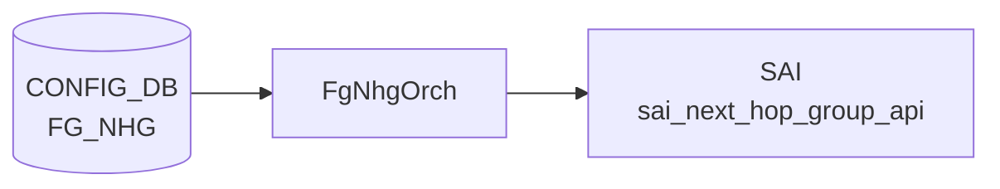

# FG_NHG テーブル

## 概要

Fine-Grained [ECMP](../../reference/glossary.md#term-ecmp) (FG [ECMP](../../reference/glossary.md#term-ecmp)) の next-hop group 定義。プレフィックスやネクストホップ単位で、固定サイズのハッシュバケットを使ったフロー安定化 [ECMP](../../reference/glossary.md#term-ecmp) を提供する[^1]。`orchagent` の `FgNhgOrch` が [CONFIG_DB](../../reference/glossary.md#term-config_db) を購読する。

<!-- cdb-mermaid -->
### データフロー (自動生成)



!!! note "凡例"
    CONFIG_DB から SAI までの典型経路を `docs/reference/config-db-orch-map.md` から機械生成したミニ図。詳細・例外は本ページ本文と対応表を参照。
<!-- /cdb-mermaid -->

## 関連 3 テーブル

```text
FG_NHG|<name>                    # グループ定義
FG_NHG_PREFIX|<ip_prefix>        # prefix → group
FG_NHG_MEMBER|<next_hop_ip>      # next-hop → group + bank
```

## FG_NHG

| フィールド | 型 | 必須 | 説明 |
|-----------|----|------|------|
| `bucket_size` | uint16 | yes | バケット総数。1..N の最小公倍数を推奨 |
| `match_mode` | enum `route-based`/`nexthop-based`/`prefix-based` | yes | FG 適用判定方式 |
| `max_next_hops` | uint16 (1..128) | `prefix-based` 時 | dynamic-nhg モードでルート更新が運ぶ最大 nexthop 数 |

## FG_NHG_PREFIX

| フィールド | 型 | 必須 | 説明 |
|-----------|----|------|------|
| `ip_prefix` (key) | sonic-ip-prefix | - | FG 動作対象の prefix |
| `FG_NHG` | leafref `FG_NHG.name` | yes | 紐付けるグループ |

## FG_NHG_MEMBER

| フィールド | 型 | 必須 | 説明 |
|-----------|----|------|------|
| `next_hop_ip` (key) | inet:ip-address | - | メンバ next-hop |
| `FG_NHG` | leafref `FG_NHG.name` | yes | 所属グループ |
| `bank` | uint16 | yes | bank index (再分配単位) |
| `link` | union leafref `PORT`/`PORTCHANNEL` | no | 紐付けリンク。op state 連動でメンバ追加/削除 |

## match_mode の意味

- `nexthop-based`: nexthop IP のみで FG 判定
- `route-based`: prefix と nexthop IP の両方で FG 判定
- `prefix-based`: prefix のみで FG 判定。nexthop は route 更新から派生し `FG_NHG_MEMBER` 不要 (dynamic NHG)

## 購読者

- `orchagent` の `FgNhgOrch`: [SAI](../../reference/glossary.md#term-sai) で固定サイズの NEXT_HOP_GROUP を生成し、メンバ追加/削除でハッシュバケット位置を維持

## 関連 CONFIG_DB / YANG / CLI

- 関連 [CONFIG_DB](../../reference/glossary.md#term-config_db): `PORT`、`PORTCHANNEL`
- 関連 [YANG](../../reference/glossary.md#term-yang): `sonic-fine-grained-ecmp`

<!-- ref-triangle:start -->

## 関連リファレンス

- [YANG](../../reference/glossary.md#term-yang): [`sonic-fine-grained-ecmp`](../yang/sonic-fine-grained-ecmp.md)

<!-- ref-triangle:end -->

## 引用元

[^1]: [YANG](../../reference/glossary.md#term-yang) 定義: `sonic-fine-grained-ecmp.yang`. <https://github.com/sonic-net/sonic-buildimage/blob/9ea932ec2e18f35e58268ec2e4456b1d4afd65cd/src/sonic-yang-models/yang-models/sonic-fine-grained-ecmp.yang>

<!-- ops-hint -->
## 運用ヒント

### 典型値

- key 形式: `FG_NHG|<name>`、`FG_NHG_PREFIX|<prefix>`、`FG_NHG_MEMBER|<nh_ip>`。
- `bucket_size`: 64 や 128 等、メンバ数の最小公倍数を考慮した値。
- `match_mode`: `nexthop-based` が一般的、dynamic 用途では `prefix-based`。

### よくある誤設定

- `bucket_size` がメンバ数で割り切れず、トラフィック分散が偏る。
- `match_mode=prefix-based` で `FG_NHG_MEMBER` を投入し、本来不要な定義が衝突する。
- `link` を未設定にして port-down 時にメンバ自動除去が効かない。

### 確認コマンド

```bash
sonic-db-cli CONFIG_DB keys 'FG_NHG*'
sonic-db-cli APPL_DB keys 'FG_ROUTE_TABLE:*'
show fgnhg active-hops
```
<!-- /ops-hint -->

<!-- value-behavior -->
## 値依存挙動マトリクス

### `match_mode`

| 値 | 挙動 |
|----|------|
| `nexthop-based` | nexthop IP のみで FG 判定。FG_NHG_PREFIX 投入は SWSS_LOG_NOTICE で no-op |
| `route-based` | prefix + nexthop IP 両方で FG 判定。不正値時のフォールバック先 |
| `prefix-based` | prefix のみで FG 判定。`FG_NHG_MEMBER` は不要（dynamic NHG）。シングルバンク強制。`max_next_hops` 必須 |
| その他 | `SWSS_LOG_WARN` → `route-based` にフォールバック（エントリは処理継続） |

### `bucket_size`

| 値 | 挙動 |
|----|------|
| `0` | `SWSS_LOG_ERROR` → `return true`（エントリ破棄・再試行なし） |
| 正値 | バケット数として使用。メンバ数の LCM 推奨 |

### `max_next_hops`

| 値 | 挙動 |
|----|------|
| `0` かつ `match_mode=prefix-based` | `SWSS_LOG_ERROR`（処理は継続するが [SAI](../../reference/glossary.md#term-sai) 動作不定） |
| `0` かつ他モード | 無視 |
| 超過した NH | `SWSS_LOG_WARN` → 超過分無視 |

<!-- /value-behavior -->

<!-- constants -->
## ハードコード定数 (Phase E)

> **調査根拠**: `sonic-swss/orchagent/fgnhgorch.cpp` L12-13, L265-271, L1154-1165, L1680-1726, L1342, L1369 精読 (2026-05-16)

### モジュール定数

| 定数名 | 値 | 説明 |
|--------|-----|------|
| `LINK_DOWN` | `0` | `link` フィールド設定メンバの初期 oper-state（DOWN 扱い）。`link` 未設定時は `LINK_UP` 固定 |
| `LINK_UP` | `1` | `link` フィールド未設定時のデフォルト oper-state。リンク状態追跡なしで常に UP 扱い |

### SAI next-hop group 属性

| [SAI](../../reference/glossary.md#term-sai) 属性 | 固定値 | 説明 |
|----------|--------|------|
| `SAI_NEXT_HOP_GROUP_ATTR_TYPE` | `SAI_NEXT_HOP_GROUP_TYPE_FINE_GRAIN_ECMP` | NHG 作成時に固定設定。通常 ECMP とは別コードパス |
| `SAI_NEXT_HOP_GROUP_ATTR_CONFIGURED_SIZE` | `bucket_size` | [CONFIG_DB](../../reference/glossary.md#term-config_db) の `bucket_size` をそのまま渡す |
| `SAI_NEXT_HOP_GROUP_ATTR_REAL_SIZE` | ハードウェア返却値 | VS プラットフォーム以外で SAI get により実バケット数を確認。VS では `configured_bucket_size` を `real_bucket_size` として使用（TODO コメントあり） |

### SAI next-hop group メンバ属性

| SAI 属性 | 値 | 説明 |
|----------|-----|------|
| `SAI_NEXT_HOP_GROUP_MEMBER_ATTR_NEXT_HOP_GROUP_ID` | NHG OID | メンバが属する NHG を指定 |
| `SAI_NEXT_HOP_GROUP_MEMBER_ATTR_NEXT_HOP_ID` | NH OID | 実際のネクストホップ OID |
| `SAI_NEXT_HOP_GROUP_MEMBER_ATTR_INDEX` | `bucket_idx` (0〜real_bucket_size-1) | Fine-Grained ECMP のバケットインデックス |

### hash バケット配置アルゴリズム定数

| 計算式 | 説明 |
|--------|------|
| `buckets_per_nexthop = real_bucket_size / num_members` | バンク内の各 NH あたりの基本バケット数（整数除算） |
| `extra_buckets = real_bucket_size - (buckets_per_nexthop * num_members)` | 端数バケット数。先頭 `extra_buckets` 個の NH が 1 バケット多く持つ |

### prefix-based モード固定値

| 定数 | 値 | 説明 |
|------|----|------|
| `bank_member_changes.resize(1, ...)` | `1` | `match_mode==PREFIX_BASED` 時にバンク数を強制的に 1 に設定 |
| 初期 `bank` 値 (prefix-based) | `0` | `FGNextHopInfo fg_nh_info = {0, "", LINK_DOWN}` で初期化（bank=0, link="", oper=LINK_DOWN） |

```cpp
// fgnhgorch.cpp L12-13
#define LINK_DOWN    0
#define LINK_UP      1

// L265-271  NHG 作成時の固定 SAI 属性
nhg_attr.id = SAI_NEXT_HOP_GROUP_ATTR_TYPE;
nhg_attr.value.s32 = SAI_NEXT_HOP_GROUP_TYPE_FINE_GRAIN_ECMP;
nhg_attr.id = SAI_NEXT_HOP_GROUP_ATTR_CONFIGURED_SIZE;
nhg_attr.value.s32 = fgNhgEntry->configured_bucket_size;

// L1342  prefix-based は単一バンク強制
bank_member_changes.resize(1, BankMemberChanges());

// L1369  prefix-based メンバ初期化
FGNextHopInfo fg_nh_info = {0, "", LINK_DOWN};  // bank=0, link="", oper=LINK_DOWN
```

!!! note "VS プラットフォームの特例"
    VS（Virtual Switch）では `SAI_NEXT_HOP_GROUP_ATTR_REAL_SIZE` の get を省略し、`configured_bucket_size` をそのまま `real_bucket_size` として使用する（L286-288 の TODO コメント）。実ハードウェアでは SAI が割り当て可能な実際のバケット数を返す。

詳細な調査ログ: `meta/_intermediate/cdb-flow/fg-nhg-constants.md`

<!-- /constants -->

<!-- defaults -->
## コード由来のデフォルト・暗黙挙動 (Phase A)

> **調査根拠**: `sonic-swss/orchagent/fgnhgorch.cpp` `doTaskFgNhg()` L1673–1744 / `doTaskFgNhgMember()` L1969–2030 精読 + `sonic-fine-grained-ecmp.yang` 照合 (2026-05-15)

### `FG_NHG` テーブル

| フィールド | YANG default | fgnhgorch 実装の実効デフォルト | 備考 |
|-----------|-------------|--------------------------------|------|
| `bucket_size` | なし | **なし**（0 で `SWSS_LOG_ERROR` → `return true` で破棄、再試行なし） | 実質必須。`bucket_size==0` はエラーで Consumer キューにも残らない |
| `match_mode` | なし | **`route-based`**（ローカル変数 `FGMatchMode::ROUTE_BASED` 初期値） | 不正値も `SWSS_LOG_WARN` の後 `route-based` にフォールバック |
| `max_next_hops` | なし | **`0`**（uint32_t 初期化値） | `match_mode==prefix-based` のときのみ参照。`0` で `SWSS_LOG_ERROR` だが処理は継続し SAI 動作が不定に |

```cpp
// fgnhgorch.cpp L1680–1681
FGMatchMode match_mode = FGMatchMode::ROUTE_BASED;
uint32_t max_next_hops = 0;
...
// L1685
uint32_t bucket_size = 0;
...
// L1703–1707  不正な match_mode はここで握り潰される
else if (fvValue(i) != "route-based") {
    SWSS_LOG_WARN("Received unsupported match_mode %s, defaulted to route-based",
                  fvValue(i).c_str());
}
...
// L1722–1726  bucket_size 未指定は破棄
if (bucket_size == 0) {
    SWSS_LOG_ERROR("Received bucket_size which is 0 for key %s", kfvKey(t).c_str());
    return true;   // 再試行なし
}
```

!!! warning "`match_mode` のタイポは silent fallback"
    `match_mode` に `"nexthop-based"` / `"prefix-based"` / `"route-based"` 以外を書くと `SWSS_LOG_WARN` の後 `route-based` で登録される。typo はエラーにならず、意図しない FG 判定方式で動き続ける。

### `FG_NHG_MEMBER` テーブル

| フィールド | YANG default | fgnhgorch 実装の実効デフォルト | 備考 |
|-----------|-------------|--------------------------------|------|
| `FG_NHG` | なし | **なし**（空で `SWSS_LOG_ERROR` → `return true` で破棄） | leafref 必須。空文字でエントリ破棄 |
| `bank` | なし | **`0`**（uint32_t 初期化値） | 未指定の全メンバが bank 0 に集約されバンク再分配メカニズムが事実上無効化 |
| `link` | なし | **`""` 空文字列** → port-down 連動なし。`link_oper_state` は初期値 `LINK_UP` のまま固定 | `link` を設定しないとリンクダウン時のメンバ自動除去が効かない |

```cpp
// fgnhgorch.cpp L1976
bool link_oper = LINK_UP;
...
// L1980–1982
string fg_nhg_name = "";
uint32_t bank = 0;
string link = "";
...
// L2025–2030  link 空時は oper-state 追跡なし
FGNextHopInfo fg_nh_info = {};
fg_nh_info.bank = bank;
if (!link.empty()) {
    /* PORT/PORTCHANNEL の oper-state 連動を登録 */
}
```

!!! warning "`bank` 未指定は単一バンク化"
    `bank` フィールドを省略すると全メンバが bank 0 に入る。Fine-Grained ECMP の核となる「バンク単位の bucket 再分配」が機能せず、通常 ECMP に近い挙動となる。

### YANG vs 実装

`sonic-fine-grained-ecmp.yang` には `bucket_size` / `match_mode` / `max_next_hops` / `bank` のいずれにも `default` ステートメントが存在しない。デフォルト値は **全て fgnhgorch のローカル変数初期値** に依存しており、CONFIG_DB の他テーブルのように mgmt-framework / db_migrator から fill されることはない。

詳細な調査ログ: `meta/_intermediate/cdb-flow/fg-nhg-defaults.md`

<!-- /defaults -->

<!-- cdb-exceptions -->
## 例外条件・特殊挙動

<!-- evidence: sonic-swss/orchagent/fgnhgorch.cpp -->

| 条件 | 挙動 |
|------|------|
| `match_mode` が不正値 | `SWSS_LOG_WARN` → `route-based` にフォールバック（エントリは処理継続） |
| `match_mode==prefix-based` かつ `max_next_hops==0` | `SWSS_LOG_ERROR` を出力するが処理は継続（SAI 動作が不定になるリスクあり） |
| `bucket_size==0` | `SWSS_LOG_ERROR` → `return true`（エントリ破棄・再試行なし） |
| `FG_NHG` エントリ重複 SET | `SWSS_LOG_WARN("FG_NHG %s already exists, ignoring")` → 更新されない |
| `FG_NHG_PREFIX` DEL で prefix 未存在 | `SWSS_LOG_INFO("FG_NHG prefix doesn't exists, ignore")` → 正常終了 |
| `FG_NHG_MEMBER` を prefix-based グループに投入 | `SWSS_LOG_ERROR` → `return true`（破棄） |
| 親 `FG_NHG` 未受信時に `FG_NHG_MEMBER` 投入 | `return false`（Consumer キューに残り再試行） |
| `max_next_hops` 超過 NH | `SWSS_LOG_WARN("Next-hop %s exceeds max_next_hops %d for prefix %s, skipping")` → 超過分無視 |
| FG nh と非 FG nh が同一ルートに混在 | `SWSS_LOG_WARN` → ルート全体を通常 ECMP にデグレード |

<!-- /cdb-exceptions -->

<!-- ordering -->
## 書込み順依存・NEXTHOP 解決順序 (Phase B)

> **調査根拠**: `sonic-swss/orchagent/fgnhgorch.cpp` `calculateBankHashBucketStartIndices()` L146–213, `createFineGrainedNextHopGroup()` L257–314, `setActiveBankHashBucketChanges()` L568–820, `sprayBankNhgMembers()` L1113–1198, `doTaskFgNhg()` L1673–1744, `doTaskFgNhgMember()` L1969–2030 精読 (2026-05-16)

### 3 テーブルの投入順序

```
FG_NHG|<name>          ← 最初に投入（必須）
  ↓
FG_NHG_PREFIX|<prefix> ← FG_NHG 処理完了後（逆順は破棄・再試行なし）
FG_NHG_MEMBER|<nh_ip>  ← FG_NHG 処理完了後（逆順は自動 retry あり）
```

- `FG_NHG_PREFIX` は親 FG_NHG が未存在の場合 `SWSS_LOG_ERROR` + `return true`（破棄・再試行なし）。**FG_NHG より後に投入しないと消える**。
- `FG_NHG_MEMBER` は親 FG_NHG が未存在の場合 `return false`（Consumer キューに残り自動 retry）。FG_NHG の処理完了後に自動投入される。

### NEXTHOP 解決順序

- FG_NHG グループは SAI 上で先に作成される（NH 解決を待たない）。
- 各 NH が NeighOrch に解決されるたびに `validNextHopInNextHopGroup()` が呼ばれ、対応バンクのバケットに割り当てられる（遅延追加・自動調停）。
- NH 未解決の間はバケットに割り当てられないため、active NH 数が少ないほど残 NH へのトラフィック集中が発生する。

### SAI Fine-Grained NHG メンバー作成順序

1. SAI NHG 作成 (`SAI_NEXT_HOP_GROUP_ATTR_TYPE = FINE_GRAINED` + `CONFIGURED_SIZE`)
2. バンク割り当て計算 (`calculateBankHashBucketStartIndices`: バンク 0 から昇順、NH 比例配分)
3. バケット範囲を昇順スキャンし、ラウンドロビンで NH を割り当て (`bucket_idx % nhs_to_add.size()`)
4. 各バケットに SAI `create_next_hop_group_member`:
   - `SAI_NEXT_HOP_GROUP_MEMBER_ATTR_NEXT_HOP_GROUP_ID`
   - `SAI_NEXT_HOP_GROUP_MEMBER_ATTR_NEXT_HOP_ID`
   - `SAI_NEXT_HOP_GROUP_MEMBER_ATTR_INDEX` (= bucket index)

### NH 追加・削除時のバケット再配分

- 再配分はバンク単位で独立（他バンクに波及しない）。
- **単純ラウンドロビンは採用しない**。各 NH のバケット数を均等化するアルゴリズムを使用（`setActiveBankHashBucketChanges()`）:
  - 目標バケット数 = `num_buckets_in_bank / active_nhs`、余剰は先頭 NH から 1 ずつ加算
  - NH 削除: 削除 NH のバケットを残存 NH に均等移譲
  - NH 追加: 既存 NH からバケットを奪取して新規 NH に均等分配

### warm-reboot 復元

- [orchagent](../../reference/glossary.md#term-orchagent) 再起動時、`m_recoveryMap` (WARM_RESTART DB) に保存済みのバケット→NH マッピングを優先復元。ラウンドロビン再割り当ては行わない。
- 復元時に NH が別バンクにある場合（バンク全断代替）は `inactive_to_active_map` に記録しフォールバックを設定。

### DEL 推奨順序

```
FG_NHG_MEMBER|<nh_ip>  ← 先に削除
FG_NHG_PREFIX|<prefix> ← 次に削除
FG_NHG|<name>          ← 最後に削除
```

逆順での DEL はリソースリークまたは内部マップ不整合が生じる可能性がある（逆順でも SAI はクリーンアップされるが CONFIG_DB の整合性のため推奨順守）。

| # | 依存関係 | 方向 | 緩和策 |
|---|----------|------|--------|
| 1 | FG_NHG SET → FG_NHG_MEMBER SET | 強制先行（自動 retry あり） | Consumer キュー残留で自動再試行 |
| 2 | FG_NHG SET → FG_NHG_PREFIX SET | 強制先行（再試行なし） | PREFIX を先に書くと破棄される |
| 3 | NeighOrch NH 解決 → SAI バケット割り当て | 遅延追加で自動調停 | validNextHopInNextHopGroup で随時追加 |
| 4 | バンク番号昇順（0 始まり連番推奨） | 欠番は空バンクとして確保 | 欠番回避のため bank 値は 0 始まり連番推奨 |
| 5 | SAI NHG member 属性: GROUP_ID → NH_ID → INDEX | create 時固定順 | FgNhgOrch が構築（アプリ側不要） |
| 6 | NH 追加/削除時のバケット均等化 | バンク単位独立、自動 | 均等化アルゴリズム（ラウンドロビン非採用） |
| 7 | warm-reboot 復元（recoveryMap 優先） | 復元マップが通常割り当てより優先 | [orchagent](../../reference/glossary.md#term-orchagent) 起動前に recoveryMap ロード完了 |
| 8 | prefix-based グループへの FG_NHG_MEMBER 投入禁止 | 破棄（再試行なし） | match_mode 確認後に MEMBER 投入 |
| 9 | DEL 順序: MEMBER → PREFIX → FG_NHG | 推奨（逆順は SAI クリーンアップ後に DB 残留） | 逆順は推奨しない |

詳細な調査ログ: `meta/_intermediate/cdb-flow/fg-nhg-ordering.md`
<!-- /ordering -->

<!-- failure -->
## 失敗挙動マトリクス (Phase D)

ソース: `sonic-net/sonic-swss/orchagent/fgnhgorch.cpp`

### NEXTHOP 未解決 → retry（return false）

| 失敗条件 | 検出箇所 | 結果 | ログ出力 |
|---|---|---|---|
| `FG_NHG_MEMBER` 投入時に nexthop が neighOrch に未登録（[ARP](../../reference/glossary.md#term-arp)/[NDP](../../reference/glossary.md#term-ndp) 未解決） | `doTaskFgNhgMember()` L2071 | Consumer キューに残り retry | `SWSS_LOG_INFO "Nexthop %s is not resolved yet"` |
| `FG_NHG_PREFIX` 投入時に親 `FG_NHG` エントリが未受信 | `doTaskFgNhgPrefix()` L1821 | `return false` → retry | `SWSS_LOG_INFO "FG_NHG entry not received yet, continue"` |
| `FG_NHG_MEMBER` 投入時に親 `FG_NHG` エントリが未受信 | `doTaskFgNhgMember()` L2004 | `return false` → retry | `SWSS_LOG_INFO "FG_NHG entry not received yet, continue"` |
| prefix 移行中（APP_DB delete 後に routeorch 削除完了待ち） | `doTaskFgNhgPrefix()` L1883 | `return false` → retry | `SWSS_LOG_INFO "Route(%s) ADD exists in routeorch..."` |
| 全 bank 空で bucket 割り当て不能 | `createFgNhg()` L1067 | `return false` → retry 期待 | `SWSS_LOG_INFO "Found no next-hops to add, skipping"` |

### SAI fg_nhg 操作失敗

| 失敗条件 | 検出箇所 | 結果 | ログ出力 |
|---|---|---|---|
| `createFineGrainedNextHopGroup` 失敗（SAI NHG 生成エラー） | `createFgNhg()` L275 | `return false`（エントリ破棄） | `SWSS_LOG_ERROR "Failed to create next hop group %s"` |
| `SAI_NEXT_HOP_GROUP_ATTR_REAL_SIZE` クエリ失敗 | `createFgNhg()` L294 | NHG ロールバック後 `return false` | `SWSS_LOG_ERROR "Failed to query next hop group %s SAI_NEXT_HOP_GROUP_ATTR_REAL_SIZE"` |
| SAI next hop group member 作成失敗（`create_next_hop_group_member`） | `setNewNhgMembers()` L1174 | NHG 全体をロールバック後 `return false` | `SWSS_LOG_ERROR "Failed to create next hop group %s member %s: %d"` |
| `validNextHopInNextHopGroup` 失敗（nexthop の SAI 登録失敗） | `doTaskFgNhgMember()` L2078 | メンバー情報ロールバック後 `return false` | `SWSS_LOG_INFO "Failing validNextHopInNextHopGroup for %s"` |
| Fine Grained NHG 削除失敗 | `removeFineGrainedNextHopGroup()` L343 | `return false` | `SWSS_LOG_ERROR "Failed to remove nhgid %"` |

### 不正 bucket_size・設定値

| 失敗条件 | 検出箇所 | 結果 | ログ出力 |
|---|---|---|---|
| `bucket_size == 0`（未指定または明示的 0） | `doTaskFgNhg()` L1722 | `SWSS_LOG_ERROR` → `return true`（破棄、再試行なし） | `SWSS_LOG_ERROR "Received bucket_size which is 0 for key %s"` |
| `match_mode==prefix-based` かつ `max_next_hops==0` | `doTaskFgNhg()` L1719 | `SWSS_LOG_ERROR`（処理継続・SAI 動作不定） | `SWSS_LOG_ERROR "Received match_mode==prefix_based with max_next_hops 0..."` |
| `FG_NHG_MEMBER` を `prefix-based` グループに投入 | `doTaskFgNhgMember()` L2011 | `SWSS_LOG_ERROR` → `return true`（破棄） | `SWSS_LOG_ERROR "Received FG_NHG member for prefix-based match_mode..."` |
| `FG_NHG` / `FG_NHG_MEMBER` で `fg_nhg_name` が空文字 | L1816 / L2000 | `SWSS_LOG_ERROR` → `return true`（破棄） | `SWSS_LOG_ERROR "Received FG_NHG with empty name for key %s"` |

!!! warning "bucket_size=0 は再試行なしで破棄"
    `bucket_size` が 0 の場合、`return true` でエントリが Consumer キューから外れる。設定エラーは syslog の `SWSS_LOG_ERROR` 以外に通知されないため見落としに注意。

!!! note "nexthop 未解決は自動 retry"
    neighOrch での nexthop 未解決は `return false` によりキューに残り、ARP/NDP 解決後に自動で再処理される。ユーザー操作不要。

<!-- /failure -->

<!-- runtime-trace -->
## 実コンテナ動作トレース

### 段階 1 — Consumer 登録

`FgNhgOrch` ([orchagent](../../reference/glossary.md#term-orchagent) 直接 CFG 購読) が CONFIG_DB の `FG_NHG` テーブルを購読する。

`FG_NHG` / `FG_NHG_PREFIX` / `FG_NHG_MEMBER` の 3 テーブルがセット。通常の ECMP とは別のコードパスを使用。

### 段階 2 — CFG→APPL 翻訳

なし (orchagent が直接 CONFIG_DB を購読)

### 段階 3 — APPL→SAI

`sai_next_hop_group_api` — Fine Grained ECMP next hop group を作成/更新

### 段階 4 — タイミングと副作用

**適用タイミング**: orchagent が CONFIG_DB 変化を検知後即座に SAI next hop group を作成/更新。`FG_NHG_PREFIX` で対象プレフィクスを、`FG_NHG_MEMBER` でメンバーを指定。

**副作用**: Fine Grained ECMP の hash 制御に影響。traffic の分散方法が変化。メンバー変更は既存フローのリハッシュを引き起こす可能性。
<!-- /runtime-trace -->

<!-- entry-points -->
## 書き込み入り口 (Direction A)

対象テーブル: `FG_NHG`

### CLI
- `config fg-nhg add/del <nhg-name> --bucket-size <n> --match-mode <mode>`
  - ソース: `sonic-utilities/config/plugins/sonic-fine-grained-ecmp_yang.py`

### minigraph / sonic-cfggen
- なし

### REST / gNMI (sonic-mgmt-common)
- なし (対応 OpenConfig/[SONiC](../../reference/glossary.md#term-sonic) YANG transformer なし)

### db_migrator
- なし

### ビルド時デフォルト (init_cfg / j2 テンプレート)
- なし

### ハードコードデフォルト
- なし

### ランタイム注入 (デーモン自動書き込み)
- なし
<!-- /entry-points -->

<!-- cross-refs -->
## 暗黙参照 — Phase C (cross-table refs)

> **調査根拠**: `sonic-swss/orchagent/fgnhgorch.cpp` 全行精読 (2026-05-16)
> 詳細証跡: `meta/_intermediate/cdb-flow/fg-nhg-cross-refs.md`

`FG_NHG` / `FG_NHG_PREFIX` / `FG_NHG_MEMBER` テーブルは YANG leafref を最小限しか持たないが、`FgNhgOrch` の実行時に以下のテーブル・Orch を暗黙参照する。

| 参照先 | DB | 参照方向 | YANG leafref | 実装上の必須度 | 証拠 |
|---|---|---|---|---|---|
| `ROUTE_TABLE\|<vrf>\|<prefix>` ([APPL_DB](../../reference/glossary.md#term-appl_db)) | [APPL_DB](../../reference/glossary.md#term-appl_db) | 読み書き (FG 適用判定・経路切替) | なし | 実質必須 | fgnhgorch.cpp:1851, 1865, 1877 |
| `NEIGH_TABLE` / NeighOrch | [APPL_DB](../../reference/glossary.md#term-appl_db) | 読み取り (nexthop 解決・refcount) | なし | 実質必須 | fgnhgorch.cpp:1415, 1459, 1479, 1547 |
| `PORT` / `PORTCHANNEL` ([PortsOrch](../../reference/glossary.md#term-portsorch)) | CONFIG_DB | 読み取り (link oper-state 監視) | `FG_NHG_MEMBER.link` leafref のみ | link 設定時必須 | fgnhgorch.cpp:46-92, 1374-1393 |
| `STATE_FG_ROUTE_TABLE` ([STATE_DB](../../reference/glossary.md#term-state_db)) | [STATE_DB](../../reference/glossary.md#term-state_db) | 書き込み (warm-restart 復旧用) | なし | warm-restart 時必須 | fgnhgorch.cpp:31 |
| `VRF` (VRFOrch) | CONFIG_DB / APPL_DB | 読み取り ([VRF](../../reference/glossary.md#term-vrf) refcount 管理) | なし | [VRF](../../reference/glossary.md#term-vrf) 利用時必須 | fgnhgorch.cpp:1326 |

### ROUTE_TABLE (APPL_DB) — FG 経路切替の核心

`FgNhgOrch` は `m_routeTable`（`ProducerStateTable` → `APPL_DB:ROUTE_TABLE`）に直接書き込む。`FG_NHG_PREFIX` SET/DEL 時に既存の通常 ECMP 経路を一度削除し (`m_routeTable->del()`)、その後 FG 経路として再投入する (`m_routeTable->set()`) という「del → wait for RouteOrch 削除完了 → set」という 2 ステップ移行シーケンスを踏む（fgnhgorch.cpp:1863–1879）。**APPL_DB [ROUTE_TABLE](../../reference/glossary.md#term-route_table) への書き込み権限が無いと FG_NHG_PREFIX の SET/DEL が永久に `return false` でリトライし続ける。**

さらに `RouteOrch::addRoute()` から `m_fgNhgOrch->isRouteFineGrained()` / `setFgNhg()` が呼ばれ、APPL_DB 受信ルートが FG 対象か否かを判定する（routeorch.cpp:2028–2040）。FG 対象ルートは RouteOrch ではなく FgNhgOrch が SAI 操作を担当する。

### NeighOrch — nexthop 解決の前提

`FgNhgOrch` は `m_neighOrch->hasNextHop()` / `getNextHopId()` / `increaseNextHopRefCount()` / `decreaseNextHopRefCount()` を多用する。nexthop が NeighOrch に未登録の場合、`SWSS_LOG_NOTICE("Failed to get next hop ... in neighorch")` を出力してそのネクストホップをスキップする（fgnhgorch.cpp:1415–1419）。**NeighOrch にネクストホップが解決されるまで FG ECMP グループのメンバーとして使われない。**

### PORT / PORTCHANNEL (PortsOrch) — link oper-state 連動

`FgNhgOrch::update()` は `SUBJECT_TYPE_PORT_OPER_STATE_CHANGE` を購読し (fgnhgorch.cpp:46)、ポートの UP/DOWN 変化を `m_syncdFGRouteTables` に反映する。`FG_NHG_MEMBER.link` に物理ポートを指定した場合、そのリンクがダウンするとバンク再分配が自動トリガーされる (fgnhgorch.cpp:60–92)。YANG leafref は `PORT` / `PORTCHANNEL` 両方を union leafref で参照しているが、`fgnhgorch.cpp:1377` では `Port::PHY` 型のみ link 追跡対象となる（PORTCHANNEL は別フロー）。

### STATE_FG_ROUTE_TABLE (STATE_DB) — warm-restart 復旧

コンストラクタで `m_stateWarmRestartRouteTable(stateDb, STATE_FG_ROUTE_TABLE_NAME)` を初期化する (fgnhgorch.cpp:31)。warm-restart 時にこの [STATE_DB](../../reference/glossary.md#term-state_db) テーブルから FG ルートの状態を復旧するためのテーブルであり、通常運用時は読み取り専用。

### SAI 参照

`sai_next_hop_group_api` (NEXT_HOP_GROUP / NEXT_HOP_GROUP_MEMBER の CRUD) と `sai_route_api` (SAI_ROUTE_ENTRY_ATTR_NEXT_HOP_ID の更新) を直接使用する (fgnhgorch.cpp:18–19, 238, 363)。

<!-- /cross-refs -->

<!-- pubsub -->
## 通信メカニズム (Phase G)

### Producer/Consumer ペア

`FgNhgOrch` は CONFIG_DB の `FG_NHG` / `FG_NHG_PREFIX` / `FG_NHG_MEMBER` の 3 テーブルを優先度 15 で直接購読する (orchdaemon.cpp L301-309)。APPL_DB 経由ではなく CONFIG_DB を **直接** Subscribe する点が多くの Orch と異なる。

| 区間 | 方式 | チャンネル/パターン |
|------|------|-------------------|
| CLI → CONFIG_DB[FG_NHG\|*] | [Redis](../../reference/glossary.md#term-redis) `HSET` (sonic-fine-grained-ecmp_yang.py) | — |
| CONFIG_DB[FG_NHG\|*] → FgNhgOrch | `ConsumerStateTable` (keyspace 通知) | `__keyspace@config_db__:FG_NHG\|*` |
| CONFIG_DB[FG_NHG_PREFIX\|*] → FgNhgOrch | `ConsumerStateTable` (keyspace 通知) | `__keyspace@config_db__:FG_NHG_PREFIX\|*` |
| CONFIG_DB[FG_NHG_MEMBER\|*] → FgNhgOrch | `ConsumerStateTable` (keyspace 通知) | `__keyspace@config_db__:FG_NHG_MEMBER\|*` |
| FgNhgOrch → NeighOrch | 直接メソッド呼び出し | — |
| FgNhgOrch → [PortsOrch](../../reference/glossary.md#term-portsorch) | Observer `attach()/update()` | `SUBJECT_TYPE_PORT_OPER_STATE_CHANGE` |
| FgNhgOrch → APPL_DB[[ROUTE_TABLE](../../reference/glossary.md#term-route_table)] | `ProducerStateTable::set()/del()` | APPL_DB channel |
| FgNhgOrch → SAI | SAI API 直接呼び出し | `sai_next_hop_group_api` / `sai_route_api` |

### CONFIG_DB Consumer 登録

```cpp
// orchdaemon.cpp L301-309
const int fgnhgorch_pri = 15;
vector<table_name_with_pri_t> fgnhg_tables = {
    { CFG_FG_NHG,        fgnhgorch_pri },
    { CFG_FG_NHG_PREFIX, fgnhgorch_pri },
    { CFG_FG_NHG_MEMBER, fgnhgorch_pri }
};
gFgNhgOrch = new FgNhgOrch(m_configDb, m_applDb, m_stateDb, fgnhg_tables, gNeighOrch, gIntfsOrch, vrf_orch);
```

`Orch` 基底クラスの `addConsumer()` が各テーブルへの `ConsumerStateTable` を生成する。`orchdaemon` の `select()` ループがイベントを検出すると `FgNhgOrch::doTask(Consumer& consumer)` を呼び出し、テーブル名で 3 つのハンドラに分岐する (fgnhgorch.cpp L2126-2160)。

### SAI fg_nhg_api 呼び出しフロー

```
CONFIG_DB[FG_NHG|<name>] SET
  → doTaskFgNhg() → createFgNhg()
      sai_next_hop_group_api->create_fine_grained_next_hop_group()
      sai_next_hop_group_api->query_attr(SAI_NEXT_HOP_GROUP_ATTR_REAL_SIZE)
      → setNewNhgMembers()
          sai_next_hop_group_api->create_next_hop_group_member()

CONFIG_DB[FG_NHG_PREFIX|<prefix>] SET
  → doTaskFgNhgPrefix()
      m_routeTable->del(prefix)         ← APPL_DB[ROUTE_TABLE] 一旦削除
      (RouteOrch DEL 完了待ち → return false → retry)
      m_routeTable->set(prefix, ...)    ← FG ルートとして再投入
      sai_route_api->set_route_entry_attribute(SAI_ROUTE_ENTRY_ATTR_NEXT_HOP_ID)

CONFIG_DB[FG_NHG_MEMBER|<nh_ip>] SET
  → doTaskFgNhgMember()
      m_neighOrch->hasNextHop(nhk)?
        No  → return false (retry — ARP/NDP 解決待ち)
        Yes → m_neighOrch->increaseNextHopRefCount()
              validNextHopInNextHopGroup(nhk)
              sai_next_hop_group_api->create_next_hop_group_member()
              バケット再割り当て
```

### NeighOrch 直接呼び出し

`FgNhgOrch` は NeighOrch を Observer ではなく直接メソッド呼び出しで利用する:

| メソッド | 行 | 役割 |
|---------|-----|------|
| `m_neighOrch->hasNextHop(nhk)` | L1415, L2071 | nexthop 解決確認 |
| `m_neighOrch->getNextHopId(nhk)` | L1459 | SAI next_hop OID 取得 |
| `m_neighOrch->increaseNextHopRefCount(nhk)` | L1479 | refcount 増加 |
| `m_neighOrch->decreaseNextHopRefCount(nhk)` | L1547 | refcount 減少 |
| `m_neighOrch->getNeighborEntry(ip, nhk, mac)` | L70, L82 | IP → NextHopKey 解決 |

nexthop が NeighOrch に未登録の場合は `return false` でエントリをキューに残し、[ARP](../../reference/glossary.md#term-arp)/[NDP](../../reference/glossary.md#term-ndp) 解決後に自動リトライされる。

### PortsOrch Observer パターン

コンストラクタで `gPortsOrch->attach(this)` を呼び出し (fgnhgorch.cpp L36)、`SUBJECT_TYPE_PORT_OPER_STATE_CHANGE` を購読する。`FG_NHG_MEMBER.link` に PORT を指定した場合、リンク UP/DOWN 変化がバンク再分配を自動トリガーする (fgnhgorch.cpp L46-92)。

### retry メカニズム

`doTask()` の `entry_handled = false` → `consumer.m_toSync.erase()` をスキップ → 次回 `select()` ループで再処理。主な retry 条件:

- nexthop 未解決 (`m_neighOrch->hasNextHop()` false)
- 親 FG_NHG エントリ未受信
- prefix 移行中 (RouteOrch DEL 完了待ち)
- 全 bank 空でバケット割り当て不能

`return true` のエラーパス（`bucket_size==0`、`fg_nhg_name` 空文字など）は再試行なしで破棄される。

> **Evidence**: `sonic-swss/orchagent/orchdaemon.cpp:301-310` (FgNhgOrch 生成・テーブル登録)、`sonic-swss/orchagent/fgnhgorch.cpp:36` (gPortsOrch->attach)、`fgnhgorch.cpp:40-92` (update/Observer)、`fgnhgorch.cpp:1415,1459,1479,1547` (NeighOrch 呼び出し)、`fgnhgorch.cpp:2126-2160` (doTask ディスパッチ); 詳細分析 `meta/_intermediate/cdb-flow/fg-nhg-pubsub.md`
<!-- /pubsub -->

<!-- side-effects -->
## 副次 DB 書込 (Phase F)

`FgNhgOrch` は CONFIG_DB の `FG_NHG` / `FG_NHG_PREFIX` / `FG_NHG_MEMBER` を受けて、[ASIC_DB](../../reference/glossary.md#term-asic_db)（SAI 経由）・STATE_DB・APPL_DB の 3 か所に書き込む。

### ASIC_DB 書込み（SAI 経由）

orchagent は直接 [ASIC_DB](../../reference/glossary.md#term-asic_db) には書き込まず、SAI API 呼び出しを通じて [syncd](../../reference/glossary.md#term-syncd) が [ASIC_DB](../../reference/glossary.md#term-asic_db) へ反映する。

| タイミング | SAI API | SAI オブジェクト型 | 主な属性 |
|---|---|---|---|
| `FG_NHG` SET → `createFineGrainedNextHopGroup()` 成功 | `sai_next_hop_group_api->create_next_hop_group_member`（RouteOrch 経由） | `SAI_OBJECT_TYPE_NEXT_HOP_GROUP` | `SAI_NEXT_HOP_GROUP_ATTR_TYPE=SAI_NEXT_HOP_GROUP_TYPE_FINE_GRAIN_ECMP`、`SAI_NEXT_HOP_GROUP_ATTR_CONFIGURED_SIZE=bucket_size` |
| バケット割り当て (`setNewNhgMembers()`) | `sai_next_hop_group_api->create_next_hop_group_member` | `SAI_OBJECT_TYPE_NEXT_HOP_GROUP_MEMBER` | `ATTR_NEXT_HOP_GROUP_ID`、`ATTR_NEXT_HOP_ID`、`ATTR_INDEX`（バケット位置） |
| バケット再割り当て (`writeHashBucketChange()`) | `sai_next_hop_group_api->set_next_hop_group_member_attribute` | `SAI_OBJECT_TYPE_NEXT_HOP_GROUP_MEMBER` | `SAI_NEXT_HOP_GROUP_MEMBER_ATTR_NEXT_HOP_ID`（バケット先変更） |
| メンバ削除 (`removeFineGrainedNextHopGroup()`) | `sai_next_hop_group_api->remove_next_hop_group_member` | `SAI_OBJECT_TYPE_NEXT_HOP_GROUP_MEMBER` | — |
| NHG 削除 | RouteOrch `removeFineGrainedNextHopGroup()` | `SAI_OBJECT_TYPE_NEXT_HOP_GROUP` | — |
| FG ルートの next-hop 切替 (`modifyRoutesNextHopId()`) | `sai_route_api->set_route_entry_attribute` | `SAI_OBJECT_TYPE_ROUTE_ENTRY` | `SAI_ROUTE_ENTRY_ATTR_NEXT_HOP_ID` |

[CRM](../../reference/glossary.md#term-crm) カウンタ連動: NHG メンバ作成時に `gCrmOrch->incCrmResUsedCounter(CRM_NEXTHOP_GROUP_MEMBER)` (fgnhgorch.cpp:1194)、削除時に `decCrmResUsedCounter` (fgnhgorch.cpp:338)。

確認コマンド:

```bash
sonic-db-cli ASIC_DB keys 'ASIC_STATE:SAI_OBJECT_TYPE_NEXT_HOP_GROUP:*'
sonic-db-cli ASIC_DB keys 'ASIC_STATE:SAI_OBJECT_TYPE_NEXT_HOP_GROUP_MEMBER:*'
```

### STATE_DB 書込み

| タイミング | テーブル | キー | フィールド | 値 |
|---|---|---|---|---|
| バケット割り当て/変更（`setStateDbRouteEntry()`） | `FG_ROUTE_TABLE` | `<ip_prefix>` | `<bucket_index>` (文字列) | `<nexthop_ip>` (文字列) |
| FG ルート削除（`m_stateWarmRestartRouteTable.del()`） | `FG_ROUTE_TABLE` | `<ip_prefix>` | — | エントリ全削除 |
| warm-restart 復旧完了後（`m_stateWarmRestartRouteTable.del()`） | `FG_ROUTE_TABLE` | `<ip_prefix>` | — | エントリ削除 |

`FG_ROUTE_TABLE` は warm-restart 用の復旧スナップショットとして機能する。各バケットインデックスをフィールドとし、割り当てられた next-hop IP を値として保持する（fgnhgorch.cpp:218–226）。

確認コマンド:

```bash
sonic-db-cli STATE_DB keys 'FG_ROUTE_TABLE:*'
sonic-db-cli STATE_DB hgetall 'FG_ROUTE_TABLE|<ip_prefix>'
```

### APPL_DB 書込み

`FgNhgOrch` は `m_routeTable`（`ProducerStateTable` → `APPL_DB:ROUTE_TABLE`）に直接書き込む。これは `FG_NHG_PREFIX` の SET/DEL 時に既存の通常 ECMP 経路を FG 経路へ移行するために行われる。

| タイミング | テーブル | キー | 操作 |
|---|---|---|---|
| `FG_NHG_PREFIX` SET → FG 移行開始 (`doTaskFgNhgPrefix()`) | `ROUTE_TABLE` | `<ip_prefix>` | DEL（既存通常ルート削除） |
| RouteOrch 削除完了待ち後に FG 経路として再投入 | `ROUTE_TABLE` | `<ip_prefix>` | SET（FG 経路として再登録） |
| `FG_NHG_PREFIX` DEL → 非 FG 移行 | `ROUTE_TABLE` | `<ip_prefix>` | DEL/SET（通常 ECMP に戻す） |

証跡: fgnhgorch.cpp:1865 `m_routeTable->del()`、1877 `m_routeTable->set()`、1931 `m_routeTable->del()`、1951 `m_routeTable->set()`。

> **注意**: APPL_DB:[ROUTE_TABLE](../../reference/glossary.md#term-route_table) への書込権限がない状態では `FG_NHG_PREFIX` の SET/DEL が永久に `return false` でリトライし続ける（cross-refs セクション参照）。

確認コマンド:

```bash
sonic-db-cli APPL_DB hgetall 'ROUTE_TABLE|<ip_prefix>'
```

> **証跡**: `setStateDbRouteEntry()` L218–226、`writeHashBucketChange()` L231–253、`setNewNhgMembers()` L1169–1195、`removeFineGrainedNextHopGroup()` L316–342、`modifyRoutesNextHopId()` L356–376、`doTaskFgNhgPrefix()` L1863–1879 / L1929–1951、詳細調査ログ: `meta/_intermediate/cdb-flow/fg-nhg-side-effects.md`
<!-- /side-effects -->

<!-- platform -->
## プラットフォーム差異 (Phase H)

> **調査根拠**: `sonic-swss/orchagent/fgnhgorch.cpp` `createFineGrainedNextHopGroup()` L257–315 / `isRouteFineGrained()` L1201–1251 精読 (2026-05-16)
> 詳細証跡: `meta/_intermediate/cdb-flow/fg-nhg-platform.md`

### VS (virtual_switch) プラットフォーム — `real_bucket_size` 省略

`createFineGrainedNextHopGroup()` 内で環境変数 `platform` を `getenv("platform")` で取得し、値が `"vs"` (= `VS_PLATFORM_SUBSTRING`) の場合に SAI の `SAI_NEXT_HOP_GROUP_ATTR_REAL_SIZE` クエリをスキップする。

```cpp
// fgnhgorch.cpp L261, L284–308
string platform = getenv("platform") ? getenv("platform") : "";
...
if (platform == VS_PLATFORM_SUBSTRING)  // "vs"
{
   /* TODO: need implementation for SAI_NEXT_HOP_GROUP_ATTR_REAL_SIZE */
    fgNhgEntry->real_bucket_size = fgNhgEntry->configured_bucket_size;
}
else
{
    nhg_attr.id = SAI_NEXT_HOP_GROUP_ATTR_REAL_SIZE;
    ...
    status = sai_next_hop_group_api->get_next_hop_group_attribute(next_hop_group_id, 1, &nhg_attr);
    if (status != SAI_STATUS_SUCCESS) { ... return false; }
    fgNhgEntry->real_bucket_size = nhg_attr.value.u32;
}
```

| プラットフォーム | `real_bucket_size` 決定方法 | SAI クエリ失敗時 |
|---|---|---|
| VS (`platform=vs`) | `configured_bucket_size`（CONFIG_DB の `bucket_size` 値）をそのまま使用 | クエリなし（スキップ） |
| 実 [ASIC](../../reference/glossary.md#term-asic) (Broadcom / Mellanox 等) | SAI `SAI_NEXT_HOP_GROUP_ATTR_REAL_SIZE` クエリ結果を使用 | NHG ロールバック後 `return false`（作成失敗） |

!!! note "VS 環境での注意"
    VS プラットフォームでは `SAI_NEXT_HOP_GROUP_ATTR_REAL_SIZE` の実装が未完了 (TODO コメント)。`real_bucket_size = configured_bucket_size` として扱うため、**実 ASIC では ASIC 内部アライメントにより `real_bucket_size` が `configured_bucket_size` より大きくなる場合がある**（ハードウェアのバケット数が設定値の倍数に丸められる等）。VS でテストした `bucket_size` 設定が実機で同一動作とは限らない。

### SAI Fine-Grained ECMP 対応 — ASIC ベンダー差

FG ECMP は SAI の `SAI_NEXT_HOP_GROUP_TYPE_FINE_GRAIN_ECMP` 型 NHG を使用する。すべての [ASIC](../../reference/glossary.md#term-asic) が本機能をサポートするわけではなく、`sai_next_hop_group_api->create_next_hop_group()` が `SAI_STATUS_NOT_SUPPORTED` 等を返した場合、`RouteOrch::createFineGrainedNextHopGroup()` が `false` を返し FG NHG 作成が失敗する。

```cpp
// routeorch.cpp L1431–1442
sai_status_t status = sai_next_hop_group_api->create_next_hop_group(&next_hop_group_id, ...);
if (status != SAI_STATUS_SUCCESS)
{
    SWSS_LOG_ERROR("Failed to create next hop group rv:%d", status);
    ...
    return parseHandleSaiStatusFailure(handle_status);
}
```

この場合 syslog に `"Failed to create next hop group"` が出力されるが、**FG_NHG テーブルの設定自体はエラーにならず、CONFIG_DB に残り続ける**。[ASIC](../../reference/glossary.md#term-asic) が FG ECMP をサポートしない環境では FG NHG は実質的に機能しない。

### VRF 対応 — デフォルト VRF のみ

`isRouteFineGrained()` および `syncdContainsFgNhg()` で `vrf_id != gVirtualRouterId`（= デフォルト [VRF](../../reference/glossary.md#term-vrf) でない）の場合は即座に `false` を返す。

```cpp
// fgnhgorch.cpp L1205–1209
if (!isFineGrainedConfigured || (vrf_id != gVirtualRouterId))
{
    SWSS_LOG_DEBUG("Route %s:%s vrf ... NOT fine grained ECMP", ...);
    return false;
}
```

**非デフォルト VRF に所属するルートは FG ECMP の対象外**となり、通常の ECMP にフォールバックする。設計上の制約であり、CONFIG_DB に FG_NHG_PREFIX を投入しても非デフォルト VRF では無視される。

### VOQ / Chassis 構成

FgNhgOrch のコードには [VOQ](../../reference/glossary.md#term-voq) (Virtual Output Queue) chassis 固有の分岐は存在しない。ただし [VOQ](../../reference/glossary.md#term-voq) chassis 構成では以下の制約が生じる可能性がある:

- FG ECMP は `gVirtualRouterId`（デフォルト VRF）に紐付く設計のため、[VOQ](../../reference/glossary.md#term-voq) chassis で VRF が複数スライスに分散する構成では FG ECMP が適用されないルートが発生する
- `FG_NHG_MEMBER.link` に指定するポートが同一ラインカード上に存在しない場合、`PortsOrch` による oper-state 追跡が正常に動作しない可能性がある（`fgnhgorch.cpp:1377` では `Port::PHY` 型のみ追跡対象）

コード上に明示的な VOQ 分岐がないため、これらは動作保証外の構成である。

<!-- /platform -->

<!-- glossary-links-injected: 7f1484b83d31 -->
