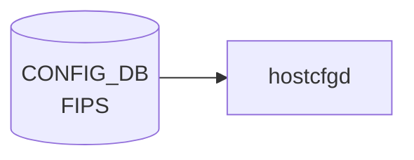

# FIPS テーブル

## 概要

FIPS 140-3 準拠の暗号モジュールを使うかどうかを管理するテーブル[^1]。
OpenSSL の FIPS provider 切り替えや、SSH / TLS の暗号スイート絞り込みに使う。

<!-- cdb-mermaid -->
### データフロー (自動生成)



!!! note "凡例"
    CONFIG_DB から SAI までの典型経路を `docs/reference/config-db-orch-map.md` から機械生成したミニ図。詳細・例外は本ページ本文と対応表を参照。
<!-- /cdb-mermaid -->

## key 構造

```text
FIPS|global
```

シングルトン。

## フィールド

| フィールド | 型 | 既定 | 説明 |
|-----------|----|------|------|
| `enable`  | boolean | `false` | FIPS 検証済み暗号モジュールを有効化 |
| `enforce` | boolean | `false` | 非準拠操作を拒否（true で `enable` のみより厳格） |

`enable` のみで FIPS-validated module をロードし、`enforce` でさらに非 FIPS アルゴリズム使用をエラー化する 2 段階モデル。

## 購読者

- `hostcfgd` (`fips` ハンドラ)：OpenSSL FIPS provider をシステムワイドに有効化、関連 systemd unit を再起動

## 関連 CONFIG_DB / YANG / CLI

- 関連 CLI: `config fips enable` / `config fips enforce`
- 関連 [YANG](../../reference/glossary.md#term-yang): `sonic-fips`

<!-- ref-triangle:start -->

## 関連リファレンス

- [YANG](../../reference/glossary.md#term-yang): [`sonic-fips`](../yang/sonic-fips.md)

<!-- ref-triangle:end -->

## 引用元

[^1]: [YANG](../../reference/glossary.md#term-yang) 定義: `sonic-fips.yang`. <https://github.com/sonic-net/sonic-buildimage/blob/9ea932ec2e18f35e58268ec2e4456b1d4afd65cd/src/sonic-yang-models/yang-models/sonic-fips.yang>

## 関連ページ
- [CONFIG_DB index](index.md)

<!-- ops-hint -->
## 運用ヒント

### 典型値

- key 形式: `FIPS|global`。
- `enable`: `false`（既定）。FIPS 認証イメージのみで `true` を許容。

### よくある誤設定

- 通常イメージで `enable=true` にすると一部 crypto モジュールが起動しない。

### 確認コマンド

```bash
sonic-db-cli CONFIG_DB hgetall 'FIPS|global'
show fips status
```
<!-- /ops-hint -->

<!-- value-behavior -->
## 値依存挙動マトリクス

このテーブルに enum フィールドはない。boolean 値の組み合わせで動作が決まる。

### `enable` × `enforce` の組み合わせ

| `enable` | `enforce` | 挙動 |
|----------|-----------|------|
| `false` | `false` | 通常 OpenSSL モジュールを使用（デフォルト） |
| `true` | `false` | FIPS-validated module をロード。次回 reboot 後に有効化 |
| `true` | `true` | FIPS module ロード＋非 FIPS アルゴリズム使用をエラー化（最強制モード） |
| `false` | `true` | `enable` なしで `enforce` のみ有効化は意味がない（実装で想定されていない組み合わせ） |

<!-- /value-behavior -->

<!-- cdb-exceptions -->
## 例外条件・特殊挙動

<!-- evidence: sonic-utilities/sonic_installer/main.py -->

| 条件 | 挙動 |
|------|------|
| `enable` 変更は即時反映されない | bootloader（grub）パラメータ変更のため次回再起動後に有効化。現行カーネルへの影響なし |
| 非 FIPS 認証イメージで `enable=true` | 一部 OpenSSL crypto モジュールが不在のため SSH / TLS が起動しない可能性がある |
| `enable` に `true`/`false` 以外の文字列 | YANG バリデーション（mgmt-framework 経由時）で reject。CLI 直書きは受け付けるが動作は不定 |

<!-- /cdb-exceptions -->

<!-- entry-points -->
## 書き込み入り口 (Direction A)

対象テーブル: `FIPS`

### CLI
- `config fips enable/disable`
- `config fips enforce`
  - ソース: `sonic-utilities/config/main.py (fips グループ)`

### minigraph / sonic-cfggen
- なし

### REST / gNMI (sonic-mgmt-common)
- なし (対応 OpenConfig/SONiC YANG transformer なし)

### db_migrator
- なし

### ビルド時デフォルト (init_cfg / j2 テンプレート)
- なし

### ハードコードデフォルト
- なし

### ランタイム注入 (デーモン自動書き込み)
- `hostcfgd` の FIPS ハンドラが kernel モジュール設定と同期
<!-- /entry-points -->

<!-- glossary-links-injected: b5626ca1f0f9 -->
