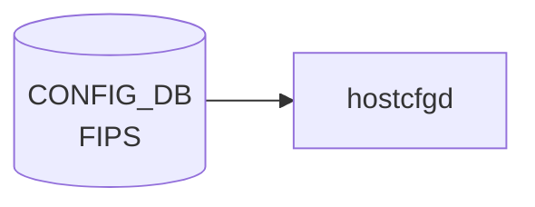

# FIPS テーブル

## 概要

FIPS 140-3 準拠の暗号モジュールを使うかどうかを管理するテーブル[^1]。
OpenSSL の FIPS provider 切り替えや、SSH / TLS の暗号スイート絞り込みに使う。

<!-- cdb-mermaid -->
### データフロー (自動生成)



!!! note "凡例"
    CONFIG_DB から SAI までの典型経路を `docs/reference/config-db-orch-map.md` から機械生成したミニ図。詳細・例外は本ページ本文と対応表を参照。
<!-- /cdb-mermaid -->

## key 構造

```text
FIPS|global
```

シングルトン。

## フィールド

| フィールド | 型 | 既定 | 説明 |
|-----------|----|------|------|
| `enable`  | boolean | `false` | FIPS 検証済み暗号モジュールを有効化 |
| `enforce` | boolean | `false` | 非準拠操作を拒否（true で `enable` のみより厳格） |

`enable` のみで FIPS-validated module をロードし、`enforce` でさらに非 FIPS アルゴリズム使用をエラー化する 2 段階モデル。

## 購読者

- `hostcfgd` (`fips` ハンドラ)：OpenSSL FIPS provider をシステムワイドに有効化、関連 systemd unit を再起動

## 関連 CONFIG_DB / YANG / CLI

- 関連 CLI: `config fips enable` / `config fips enforce`
- 関連 [YANG](../../reference/glossary.md#term-yang): `sonic-fips`

<!-- ref-triangle:start -->

## 関連リファレンス

- [YANG](../../reference/glossary.md#term-yang): [`sonic-fips`](../yang/sonic-fips.md)

<!-- ref-triangle:end -->

## 引用元

[^1]: [YANG](../../reference/glossary.md#term-yang) 定義: `sonic-fips.yang`. <https://github.com/sonic-net/sonic-buildimage/blob/9ea932ec2e18f35e58268ec2e4456b1d4afd65cd/src/sonic-yang-models/yang-models/sonic-fips.yang>

## 関連ページ
- [CONFIG_DB index](index.md)

<!-- ops-hint -->
## 運用ヒント

### 典型値

- key 形式: `FIPS|global`。
- `enable`: `false`（既定）。FIPS 認証イメージのみで `true` を許容。

### よくある誤設定

- 通常イメージで `enable=true` にすると一部 crypto モジュールが起動しない。

### 確認コマンド

```bash
sonic-db-cli CONFIG_DB hgetall 'FIPS|global'
show fips status
```
<!-- /ops-hint -->

<!-- value-behavior -->
## 値依存挙動マトリクス

このテーブルに enum フィールドはない。boolean 値の組み合わせで動作が決まる。

### `enable` × `enforce` の組み合わせ

| `enable` | `enforce` | 挙動 |
|----------|-----------|------|
| `false` | `false` | 通常 OpenSSL モジュールを使用（デフォルト） |
| `true` | `false` | FIPS-validated module をロード。次回 reboot 後に有効化 |
| `true` | `true` | FIPS module ロード＋非 FIPS アルゴリズム使用をエラー化（最強制モード） |
| `false` | `true` | `enable` なしで `enforce` のみ有効化は意味がない（実装で想定されていない組み合わせ） |

<!-- /value-behavior -->

<!-- cdb-exceptions -->
## 例外条件・特殊挙動

<!-- evidence: sonic-utilities/sonic_installer/main.py -->

| 条件 | 挙動 |
|------|------|
| `enable` 変更は即時反映されない | bootloader（grub）パラメータ変更のため次回再起動後に有効化。現行カーネルへの影響なし |
| 非 FIPS 認証イメージで `enable=true` | 一部 OpenSSL crypto モジュールが不在のため SSH / TLS が起動しない可能性がある |
| `enable` に `true`/`false` 以外の文字列 | YANG バリデーション（mgmt-framework 経由時）で reject。CLI 直書きは受け付けるが動作は不定 |

<!-- /cdb-exceptions -->


<!-- runtime-trace -->
## 実コンテナ動作トレース

### 段階 1 — Consumer 登録

`hostcfgd` の `FIPSHandler` が CONFIG_DB の `FIPS` テーブルを購読する。

`FIPS` の key は `global` (単一エントリ)。`enable` フラグのみ。

### 段階 2 — CFG→APPL 翻訳

なし (APPL_DB 中継なし)

### 段階 3 — APPL→SAI

なし (SAI 非経由 — OpenSSL FIPS モードの有効化/無効化)

### 段階 4 — タイミングと副作用

**適用タイミング**: CONFIG_DB 変化を検知後、OpenSSL FIPS 設定を更新。FIPS モードの有効化はシステム再起動後に完全に反映される場合がある。

**副作用**: FIPS 有効化は FIPS 非準拠の暗号アルゴリズムを使用するすべてのアプリケーションに影響。SSH / TLS の設定も変更される可能性がある。
<!-- /runtime-trace -->

<!-- entry-points -->
## 書き込み入り口 (Direction A)

対象テーブル: `FIPS`

### CLI
- `config fips enable/disable`
- `config fips enforce`
  - ソース: `sonic-utilities/config/main.py (fips グループ)`

### minigraph / sonic-cfggen
- なし

### REST / gNMI (sonic-mgmt-common)
- なし (対応 OpenConfig/SONiC YANG transformer なし)

### db_migrator
- なし

### ビルド時デフォルト (init_cfg / j2 テンプレート)
- なし

### ハードコードデフォルト
- なし

### ランタイム注入 (デーモン自動書き込み)
- `hostcfgd` の FIPS ハンドラが kernel モジュール設定と同期
<!-- /entry-points -->

<!-- ordering -->
## 書込み順依存 (Phase B)

`hostcfgd` の `FipsCfg` クラスは、CONFIG_DB の `FIPS|global` エントリを **シングルトン** として購読する。`load()` は `FIPS` テーブルを一括取得してから `update()` を実行するため、フィールドが中途半端に書かれた中間状態は観測されにくい。ただし以下の順序依存が存在する。

### 検出された順序依存

| # | 依存関係 | 方向 | 緩和策 |
|---|----------|------|--------|
| 1 | hostcfgd 起動時の `load()` フェーズ内処理順序 | `load_independent_config()` → `fipscfg.load()` の順で実行される（hostcfgd:2271） | FIPS 設定は起動シーケンス後半に適用されるため、SSH など先行 unit が FIPS なしで一瞬起動する場合がある |
| 2 | `enforce=true` 設定 → 次回起動時 bootloader パラメータ反映 | **遅延必須**（現セッションには影響しない） | `update_enforce_config()` は次回 boot image の grub パラメータのみ変更。現行 kernel は影響を受けない（hostcfgd:1838-1846） |
| 3 | `enable` SET → `/etc/fips/fips_enable` 書込み → サービス再起動 | 順次実行（同一コールチェーン内） | `cur_enforced=true`（現行 kernel が FIPS enforce 済み）のとき `restart()` はスキップされる（hostcfgd:1813-1816） |
| 4 | `FIPS_STATS\|state.config_datetime` 書込み → サービス再起動判定 | STATE_DB 参照で二重再起動を防止 | `restart()` が既に再起動済みかを `config_datetime` vs ファイル mtime で比較し、不要な再起動を skip（hostcfgd:1821-1824） |
| 5 | `/etc/sonic/fips.json` の `restart_services` リスト → 再起動対象決定 | `read_config()` が先行して読み込む（hostcfgd:1765-1769） | ファイルが存在しない場合は `DEFAULT_FIPS_RESTART_SERVICES = ['ssh', 'telemetry.service', 'restapi']` が使われる |

### 主要な制約詳細

**enforce 変更の遅延反映 (依存 #2)**: `enforce=true` を CONFIG_DB に書いても、現行カーネルの FIPS enforce 状態は変わらない。`update_enforce_config()` は `loader.set_fips(image, self.enforce)` でネクストブート用 grub エントリを書き換えるだけであり、`reboot` が必要となる（evidence: `hostcfgd:1838-1846`）。

**二重再起動防止 (依存 #4)**: `FIPS_STATS|state.config_datetime` は `update()` 内の `state_db_conn.hset()` で書かれる（hostcfgd:1792）。`restart()` はこのタイムスタンプと `/etc/fips/fips_enable` の mtime を比較し、timestamp が mtime より新しければ「既に再起動済み」と判断してサービス再起動をスキップする。デーモン再起動などで `state_db_conn` が失われると timestamp が消えるため、次の CONFIG_DB 変更時に再起動が走る（evidence: `hostcfgd:1818-1824`）。

<!-- /ordering -->

<!-- defaults -->
## フィールド暗黙デフォルト (Phase A — コード由来)

`sonic-fips.yang` には `enable` / `enforce` の `default` 文がないため、実効デフォルトは hostcfgd `FipsCfg` クラスのコード由来 fallback で決まる。

| フィールド | YANG default | コード由来 fallback | 実効デフォルト (未設定時) | 注記 |
|-----------|--------------|---------------------|----------------------------|------|
| `enable`  | なし | `False` (`FipsCfg.__init__:1760`) / `is_true(get('enable', 'false'))` (`load:1782`) | `False` → `/etc/fips/fips_enable = 0` | |
| `enforce` | なし | `False` (`FipsCfg.__init__:1761`) / `is_true(get('enforce', 'false'))` (`load:1781`) | `False` → bootloader 未設定 (`sonic_fips=1` 付与なし) | |

### 補足

- **派生則**: `load()` は `self.enable = self.enforce or is_true(common_config.get('enable', 'false'))` (hostcfgd:1782) で `enable` を計算する。`enforce=true` のときは `enable_db=false` でも `self.enable=True` に強制引き上げされる。
- **早期 return**: `FIPS|global` エントリが CONFIG_DB に存在しない場合 (`common_config` が空)、`load()` は L1777-1779 で skip ログを出して return し、`/etc/fips/fips_enable` を書き換えない。実効デフォルトは「現状維持」（前回起動時の状態）。
- **付随定数**: `DEFAULT_FIPS_RESTART_SERVICES = ['ssh', 'telemetry.service', 'restapi']` (hostcfgd:103)。FIPS 切替時に再起動される systemd unit のデフォルトリスト（CONFIG_DB フィールドではなく hostcfgd 内部定数 / `/etc/sonic/fips.json` で上書き可能）。

<!-- /defaults -->

<!-- glossary-links-injected: b5626ca1f0f9 -->
