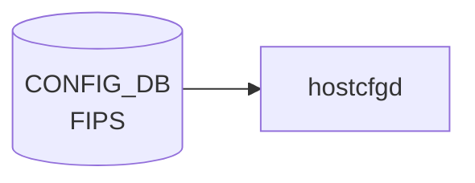

# FIPS テーブル

## 概要

FIPS 140-3 準拠の暗号モジュールを使うかどうかを管理するテーブル[^1]。
OpenSSL の FIPS provider 切り替えや、SSH / TLS の暗号スイート絞り込みに使う。

<!-- cdb-mermaid -->
### データフロー (自動生成)



!!! note "凡例"
    CONFIG_DB から SAI までの典型経路を `docs/reference/config-db-orch-map.md` から機械生成したミニ図。詳細・例外は本ページ本文と対応表を参照。
<!-- /cdb-mermaid -->

## key 構造

```text
FIPS|global
```

シングルトン。

## フィールド

| フィールド | 型 | 既定 | 説明 |
|-----------|----|------|------|
| `enable`  | boolean | `false` | FIPS 検証済み暗号モジュールを有効化 |
| `enforce` | boolean | `false` | 非準拠操作を拒否（true で `enable` のみより厳格） |

`enable` のみで FIPS-validated module をロードし、`enforce` でさらに非 FIPS アルゴリズム使用をエラー化する 2 段階モデル。

## 購読者

- `hostcfgd` (`fips` ハンドラ)：OpenSSL FIPS provider をシステムワイドに有効化、関連 systemd unit を再起動

## 関連 CONFIG_DB / YANG / CLI

- 関連 CLI: `config fips enable` / `config fips enforce`
- 関連 [YANG](../../reference/glossary.md#term-yang): `sonic-fips`

<!-- ref-triangle:start -->

## 関連リファレンス

- [YANG](../../reference/glossary.md#term-yang): [`sonic-fips`](../yang/sonic-fips.md)

<!-- ref-triangle:end -->

## 引用元

[^1]: [YANG](../../reference/glossary.md#term-yang) 定義: `sonic-fips.yang`. <https://github.com/sonic-net/sonic-buildimage/blob/9ea932ec2e18f35e58268ec2e4456b1d4afd65cd/src/sonic-yang-models/yang-models/sonic-fips.yang>

## 関連ページ
- [CONFIG_DB index](index.md)

<!-- ops-hint -->
## 運用ヒント

### 典型値

- key 形式: `FIPS|global`。
- `enable`: `false`（既定）。FIPS 認証イメージのみで `true` を許容。

### よくある誤設定

- 通常イメージで `enable=true` にすると一部 crypto モジュールが起動しない。

### 確認コマンド

```bash
sonic-db-cli CONFIG_DB hgetall 'FIPS|global'
show fips status
```
<!-- /ops-hint -->

<!-- value-behavior -->
## 値依存挙動マトリクス

このテーブルに enum フィールドはない。boolean 値の組み合わせで動作が決まる。

### `enable` × `enforce` の組み合わせ

| `enable` | `enforce` | 挙動 |
|----------|-----------|------|
| `false` | `false` | 通常 OpenSSL モジュールを使用（デフォルト） |
| `true` | `false` | FIPS-validated module をロード。次回 reboot 後に有効化 |
| `true` | `true` | FIPS module ロード＋非 FIPS アルゴリズム使用をエラー化（最強制モード） |
| `false` | `true` | `enable` なしで `enforce` のみ有効化は意味がない（実装で想定されていない組み合わせ） |

<!-- /value-behavior -->

<!-- cdb-exceptions -->
## 例外条件・特殊挙動

<!-- evidence: sonic-utilities/sonic_installer/main.py -->

| 条件 | 挙動 |
|------|------|
| `enable` 変更は即時反映されない | bootloader（grub）パラメータ変更のため次回再起動後に有効化。現行カーネルへの影響なし |
| 非 FIPS 認証イメージで `enable=true` | 一部 OpenSSL crypto モジュールが不在のため SSH / TLS が起動しない可能性がある |
| `enable` に `true`/`false` 以外の文字列 | YANG バリデーション（mgmt-framework 経由時）で reject。CLI 直書きは受け付けるが動作は不定 |

<!-- /cdb-exceptions -->


<!-- runtime-trace -->
## 実コンテナ動作トレース

### 段階 1 — Consumer 登録

`hostcfgd` の `FIPSHandler` が CONFIG_DB の `FIPS` テーブルを購読する。

`FIPS` の key は `global` (単一エントリ)。`enable` フラグのみ。

### 段階 2 — CFG→APPL 翻訳

なし (APPL_DB 中継なし)

### 段階 3 — APPL→SAI

なし (SAI 非経由 — OpenSSL FIPS モードの有効化/無効化)

### 段階 4 — タイミングと副作用

**適用タイミング**: CONFIG_DB 変化を検知後、OpenSSL FIPS 設定を更新。FIPS モードの有効化はシステム再起動後に完全に反映される場合がある。

**副作用**: FIPS 有効化は FIPS 非準拠の暗号アルゴリズムを使用するすべてのアプリケーションに影響。SSH / TLS の設定も変更される可能性がある。
<!-- /runtime-trace -->

<!-- entry-points -->
## 書き込み入り口 (Direction A)

対象テーブル: `FIPS`

### CLI
- `config fips enable/disable`
- `config fips enforce`
  - ソース: `sonic-utilities/config/main.py (fips グループ)`

### minigraph / sonic-cfggen
- なし

### REST / gNMI (sonic-mgmt-common)
- なし (対応 OpenConfig/SONiC YANG transformer なし)

### db_migrator
- なし

### ビルド時デフォルト (init_cfg / j2 テンプレート)
- なし

### ハードコードデフォルト
- なし

### ランタイム注入 (デーモン自動書き込み)
- `hostcfgd` の FIPS ハンドラが kernel モジュール設定と同期
<!-- /entry-points -->

<!-- ordering -->
## 書込み順依存 (Phase B)

`hostcfgd` の `FipsCfg` クラスは、CONFIG_DB の `FIPS|global` エントリを **シングルトン** として購読する。`load()` は `FIPS` テーブルを一括取得してから `update()` を実行するため、フィールドが中途半端に書かれた中間状態は観測されにくい。ただし以下の順序依存が存在する。

### 検出された順序依存

| # | 依存関係 | 方向 | 緩和策 |
|---|----------|------|--------|
| 1 | hostcfgd 起動時の `load()` フェーズ内処理順序 | `load_independent_config()` → `fipscfg.load()` の順で実行される（hostcfgd:2271） | FIPS 設定は起動シーケンス後半に適用されるため、SSH など先行 unit が FIPS なしで一瞬起動する場合がある |
| 2 | `enforce=true` 設定 → 次回起動時 bootloader パラメータ反映 | **遅延必須**（現セッションには影響しない） | `update_enforce_config()` は次回 boot image の grub パラメータのみ変更。現行 kernel は影響を受けない（hostcfgd:1838-1846） |
| 3 | `enable` SET → `/etc/fips/fips_enable` 書込み → サービス再起動 | 順次実行（同一コールチェーン内） | `cur_enforced=true`（現行 kernel が FIPS enforce 済み）のとき `restart()` はスキップされる（hostcfgd:1813-1816） |
| 4 | `FIPS_STATS\|state.config_datetime` 書込み → サービス再起動判定 | STATE_DB 参照で二重再起動を防止 | `restart()` が既に再起動済みかを `config_datetime` vs ファイル mtime で比較し、不要な再起動を skip（hostcfgd:1821-1824） |
| 5 | `/etc/sonic/fips.json` の `restart_services` リスト → 再起動対象決定 | `read_config()` が先行して読み込む（hostcfgd:1765-1769） | ファイルが存在しない場合は `DEFAULT_FIPS_RESTART_SERVICES = ['ssh', 'telemetry.service', 'restapi']` が使われる |

### 主要な制約詳細

**enforce 変更の遅延反映 (依存 #2)**: `enforce=true` を CONFIG_DB に書いても、現行カーネルの FIPS enforce 状態は変わらない。`update_enforce_config()` は `loader.set_fips(image, self.enforce)` でネクストブート用 grub エントリを書き換えるだけであり、`reboot` が必要となる（evidence: `hostcfgd:1838-1846`）。

**二重再起動防止 (依存 #4)**: `FIPS_STATS|state.config_datetime` は `update()` 内の `state_db_conn.hset()` で書かれる（hostcfgd:1792）。`restart()` はこのタイムスタンプと `/etc/fips/fips_enable` の mtime を比較し、timestamp が mtime より新しければ「既に再起動済み」と判断してサービス再起動をスキップする。デーモン再起動などで `state_db_conn` が失われると timestamp が消えるため、次の CONFIG_DB 変更時に再起動が走る（evidence: `hostcfgd:1818-1824`）。

<!-- /ordering -->

<!-- cross-refs -->
## 暗黙参照 — `FipsCfg` が読み出す外部リソースと STATE_DB (Phase C)

`hostcfgd` の `FipsCfg` クラスは **他の CONFIG_DB テーブルを一切参照しない**（`__init__` 引数は `state_db_conn` のみ — hostcfgd:1759）。FIPS ハンドラは `FIPS` テーブル単体を購読・処理するが、以下の外部リソース（STATE_DB / ファイルシステム / bootloader）への暗黙依存を持つ。

### STATE_DB 書き込み / 読み取り

| キー | 方向 | 用途 | evidence |
|------|------|------|----------|
| `FIPS_STATS\|state` → `config_datetime` | 書込み (`hset`) | FIPS 設定変更のタイムスタンプを記録し、二重再起動防止の基準にする | hostcfgd:1792 |
| `FIPS_STATS\|state` → `config_datetime` | 読取り (`hget`) | `restart()` が `/etc/fips/fips_enable` の mtime と比較し、既に再起動済みかを判断 | hostcfgd:1821 |

### ファイルシステム暗黙参照

| ファイルパス | 定数名 | 参照方向 | 用途 | evidence |
|------------|--------|----------|------|----------|
| `/proc/cmdline` | `PROC_CMDLINE` | 読取り | `sonic_fips=1` または `fips=1` の有無で現行 kernel の FIPS enforce 状態 (`cur_enforced`) を判定 | hostcfgd:1108,1771-1773 |
| `/etc/sonic/fips.json` | `FIPS_CONFIG_FILE` | 読取り | `restart_services` リストを上書きするオプション設定ファイル。存在しない場合は `DEFAULT_FIPS_RESTART_SERVICES` を使用 | hostcfgd:1101,1765-1769 |
| `/etc/fips/fips_enable` | `OPENSSL_FIPS_CONFIG_FILE` | 読取り + 書込み | OpenSSL FIPS モード有効化フラグ（`0` / `1`）。値が期待値と異なるときのみ上書き | hostcfgd:1102,1796-1809 |

### bootloader 暗黙参照 (`sonic_installer.bootloader`)

`update_enforce_config()` が `sonic_installer.bootloader` を経由して次回起動用 grub エントリを操作する。CONFIG_DB への参照はなく、bootloader API を直接呼ぶ。

| 操作 | API | 用途 | evidence |
|------|-----|------|----------|
| 次回起動イメージ取得 | `loader.get_next_image()` | 操作対象の boot image を特定 | hostcfgd:1840 |
| FIPS enforce 状態確認 | `loader.get_fips(image)` | 既に同じ enforce 値が設定済みならスキップ | hostcfgd:1841-1843 |
| FIPS enforce 書込み | `loader.set_fips(image, self.enforce)` | grub に `sonic_fips=1` / `fips=1` パラメータを付与・除去 | hostcfgd:1846 |

### 範囲外（同プロセス内の他テーブルとの分離）

- `AAA` / `TACPLUS` / `SSH_SERVER` など同 `hostcfgd` プロセス内の他ハンドラが管理するテーブルは、`FipsCfg` から直接読み出されない。
- ただし FIPS 設定変更時に再起動する `ssh` / `telemetry.service` / `restapi` は SSH_SERVER や AAA テーブルの設定を引き継ぐため、**間接的に影響を受ける**（再起動によって最新 CONFIG_DB 設定を再ロードする）。

詳細スキャン手順と grep 結果は `meta/_intermediate/cdb-flow/fips-cross-refs.md` を参照。
<!-- /cross-refs -->

<!-- defaults -->
## フィールド暗黙デフォルト (Phase A — コード由来)

`sonic-fips.yang` には `enable` / `enforce` の `default` 文がないため、実効デフォルトは hostcfgd `FipsCfg` クラスのコード由来 fallback で決まる。

| フィールド | YANG default | コード由来 fallback | 実効デフォルト (未設定時) | 注記 |
|-----------|--------------|---------------------|----------------------------|------|
| `enable`  | なし | `False` (`FipsCfg.__init__:1760`) / `is_true(get('enable', 'false'))` (`load:1782`) | `False` → `/etc/fips/fips_enable = 0` | |
| `enforce` | なし | `False` (`FipsCfg.__init__:1761`) / `is_true(get('enforce', 'false'))` (`load:1781`) | `False` → bootloader 未設定 (`sonic_fips=1` 付与なし) | |

### 補足

- **派生則**: `load()` は `self.enable = self.enforce or is_true(common_config.get('enable', 'false'))` (hostcfgd:1782) で `enable` を計算する。`enforce=true` のときは `enable_db=false` でも `self.enable=True` に強制引き上げされる。
- **早期 return**: `FIPS|global` エントリが CONFIG_DB に存在しない場合 (`common_config` が空)、`load()` は L1777-1779 で skip ログを出して return し、`/etc/fips/fips_enable` を書き換えない。実効デフォルトは「現状維持」（前回起動時の状態）。
- **付随定数**: `DEFAULT_FIPS_RESTART_SERVICES = ['ssh', 'telemetry.service', 'restapi']` (hostcfgd:103)。FIPS 切替時に再起動される systemd unit のデフォルトリスト（CONFIG_DB フィールドではなく hostcfgd 内部定数 / `/etc/sonic/fips.json` で上書き可能）。

<!-- /defaults -->

<!-- failure -->
## 失敗挙動マトリクス (Phase D)

ソース: `sonic-host-services/scripts/hostcfgd`（`FipsCfg` クラス、L1753–1846）

### hostcfgd 起動時 — `load()` フェーズ

| 失敗条件 | 検出箇所 | 結果 |
|---|---|---|
| `FIPS\|global` エントリが CONFIG_DB に存在しない (`common_config` が空) | `hostcfgd:1777-1779` — `not common_config` 判定 | `syslog LOG_INFO` で skip ログを出して即 return。`/etc/fips/fips_enable` は変更されない（前回起動時の状態維持） |
| `/proc/cmdline` 読み取り失敗 | `hostcfgd:1770-1773` — `open(PROC_CMDLINE)` | Python 例外が FipsCfg `__init__` から伝播し、hostcfgd 起動自体が失敗する |
| `/etc/sonic/fips.json` が存在するが JSON 形式不正 | `hostcfgd:1766-1769` — `json.load(f)` | `json.JSONDecodeError` が `read_config()` から伝播し、`load()` / `update()` が失敗。`DEFAULT_FIPS_RESTART_SERVICES` にフォールバックしない |

### `update_noneenforce_config()` — `/etc/fips/fips_enable` 書き込み

| 失敗条件 | 検出箇所 | 結果 |
|---|---|---|
| `/etc/fips/` ディレクトリ作成失敗 (`PermissionError` など) | `hostcfgd:1807` — `os.makedirs(...)` | 例外が `update()` へ伝播。STATE_DB への `config_datetime` 書込みが行われず、次の変更イベントでも再実行される |
| `/etc/fips/fips_enable` 書き込み失敗 | `hostcfgd:1808-1809` — `open(..., 'w')` | 同上。ファイルが変更されないため、OpenSSL FIPS モードが切り替わらない |

### `restart()` — サービス再起動

| 失敗条件 | 検出箇所 | 結果 |
|---|---|---|
| `cur_enforced=True`（現行 kernel が FIPS enforce 済み）| `hostcfgd:1813-1815` | サービス再起動をスキップ。`LOG_INFO` ログのみ出力 |
| `FIPS_STATS\|state.config_datetime` が既に mtime より新しい | `hostcfgd:1821-1823` | サービス再起動をスキップ（二重再起動防止）。`LOG_INFO` ログのみ出力 |
| `systemctl -t service --state=running -o json` 出力が空または JSON 解析失敗 | `hostcfgd:1828-1829` — `not output` / `json.loads` | 対象サービスリストが空のため再起動ゼロ件で終了。エラーログは出ない（サイレントスキップ） |
| 個別サービス (`ssh`, `telemetry.service`, `restapi`) の `systemctl restart` 失敗 | `hostcfgd:1835` — `run_cmd(...)` | 例外をキャッチしないため propagate する。後続サービスの再起動が実施されない可能性がある |

### `update_enforce_config()` — bootloader grub 書き込み

| 失敗条件 | 検出箇所 | 結果 |
|---|---|---|
| `bootloader.get_bootloader()` が bootloader を特定できない | `hostcfgd:1838` | 例外が `update()` へ伝播。`enforce` の変更は次回 boot に反映されない |
| `loader.get_next_image()` 失敗 | `hostcfgd:1840` | 同上 |
| `loader.set_fips(image, self.enforce)` 失敗（grub 書込みエラーなど）| `hostcfgd:1846` | 例外が `update()` へ伝播。grub エントリは変更されず、`enforce` 設定は次回 boot に反映されない |
| 既に同一 enforce 値が設定済み | `hostcfgd:1841-1843` | `loader.set_fips` をスキップ。`LOG_INFO` ログのみ出力（正常系） |

!!! warning "サービス再起動の部分失敗はサイレント"
    `restart()` では `systemctl restart` 失敗時の例外ハンドリングがないため、例えば `ssh` の再起動に失敗してもログが不足し、後続の `telemetry.service` / `restapi` が再起動されないまま処理が終わる可能性がある。`show fips status` と `sudo systemctl is-active ssh telemetry.service restapi` で手動確認を推奨。

!!! note "enforce 失敗時の影響範囲"
    `update_enforce_config()` が失敗した場合、`update_noneenforce_config()` は既に実行済みのため `/etc/fips/fips_enable` は更新される。OpenSSL FIPS enable は切り替わるが、bootloader の FIPS enforce (`sonic_fips=1`) は次回 boot に反映されない非一貫状態になる。

<!-- evidence:
  hostcfgd:1753-1846 — FipsCfg クラス全体
  hostcfgd:1777-1779 — common_config 空 skip ロジック
  hostcfgd:1766-1769 — fips.json 読み取り
  hostcfgd:1795-1809 — update_noneenforce_config: fips_enable ファイル書込み
  hostcfgd:1811-1835 — restart(): cur_enforced skip / 二重再起動防止 / systemctl restart
  hostcfgd:1837-1846 — update_enforce_config(): bootloader get/set
-->
<!-- /failure -->

<!-- constants -->
## ハードコード定数 (Phase E)

`hostcfgd` の `FipsCfg` クラスが使用するハードコード定数の一覧。これらは CONFIG_DB / YANG で変更できず、ソースコード上に直接埋め込まれている。

<!-- evidence: sonic-host-services/scripts/hostcfgd L100-108 -->

### ファイルパス定数

| 定数 | 値 | 用途 | ソース |
|------|----|------|--------|
| `FIPS_CONFIG_FILE` | `/etc/sonic/fips.json` | 再起動対象サービスリスト (`restart_services`) を上書きするオプション設定ファイルのパス。存在しない場合は `DEFAULT_FIPS_RESTART_SERVICES` を使用 | hostcfgd L101 |
| `OPENSSL_FIPS_CONFIG_FILE` | `/etc/fips/fips_enable` | OpenSSL FIPS モード有効化フラグを保持するファイルのパス。値 `"0"` / `"1"` で制御。ディレクトリが存在しない場合は `os.makedirs` で自動作成 | hostcfgd L102 |
| `PROC_CMDLINE` | `/proc/cmdline` | 現行 kernel の FIPS enforce 状態を確認するための読み取り専用ファイル。`sonic_fips=1` または `fips=1` の有無で `cur_enforced` を判定 | hostcfgd L108 |

### サービス再起動デフォルトリスト

| 定数 | 値 | 用途 | ソース |
|------|----|------|--------|
| `DEFAULT_FIPS_RESTART_SERVICES` | `['ssh', 'telemetry.service', 'restapi']` | FIPS 設定変更時に再起動する systemd unit のデフォルトリスト。`/etc/sonic/fips.json` が存在する場合はその `restart_services` キーの値で上書きされる | hostcfgd L103 |

### OpenSSL FIPS ファイル値リテラル

| リテラル | 値 | 用途 | ソース |
|----------|----|------|--------|
| FIPS 無効値 | `"0"` | `/etc/fips/fips_enable` に書き込む FIPS 無効化値 | hostcfgd L1801 |
| FIPS 有効値 | `"1"` | `/etc/fips/fips_enable` に書き込む FIPS 有効化値 | hostcfgd L1803 |

### kernel コマンドライン検出文字列

| リテラル | 用途 | ソース |
|----------|------|--------|
| `'sonic_fips=1'` | SONiC 独自の FIPS enforce カーネルパラメータ。`/proc/cmdline` 中に存在する場合 `cur_enforced=True` と判定 | hostcfgd L1773 |
| `'fips=1'` | 汎用 Linux FIPS カーネルパラメータ（RHEL 系互換）。上記と OR で判定 | hostcfgd L1773 |

### STATE_DB キー / フィールドリテラル

| リテラル | 用途 | ソース |
|----------|------|--------|
| `'FIPS_STATS\|state'` | STATE_DB への設定変更タイムスタンプ記録先キー | hostcfgd L1792, L1821 |
| `'config_datetime'` | タイムスタンプフィールド名。`datetime.utcnow().isoformat()` を書き込む。`restart()` がこの値と `/etc/fips/fips_enable` の mtime を比較して二重再起動を防止 | hostcfgd L1792, L1821 |

### 注記

- `RESTART_SERVICES_KEY` は `hostcfgd:1769` で参照されているが、同ファイル内に定義が見当たらない（`conf.get(RESTART_SERVICES_KEY, [])` の形で使われている）。実行時に `NameError` を引き起こす潜在的バグと思われる。`DEFAULT_FIPS_RESTART_SERVICES` がフォールバックとなっているため、`/etc/sonic/fips.json` が存在しない通常環境では影響しない。
- STATE_DB キー `FIPS_STATS|state` は YANG に定義がなく、`hostcfgd` が直接 `state_db_conn.hset()` / `hget()` で操作する。他コンポーネントからの読み取りは `show fips status` 相当のコマンドが行う。

<!-- /constants -->

<!-- side-effects -->
## 副作用 (Phase F)

`FIPS` テーブルへの書込みは、`hostcfgd` の `FipsCfg` クラスを経由して以下の副作用を引き起こす。すべての副作用は `update()` → `update_enforce_config()` / `update_noneenforce_config()` の呼出し連鎖で実行される（`hostcfgd:1788-1793`）。

### 副作用一覧

| # | 副作用 | トリガー条件 | 実装箇所 |
|---|--------|------------|---------|
| 1 | `/etc/fips/fips_enable` への `"0"` / `"1"` 書込み | `enable` フィールドが変更されて現在値と異なる場合 | `update_noneenforce_config()` hostcfgd:1795-1809 |
| 2 | `systemctl restart ssh telemetry.service restapi` の実行 | FIPS enforce 中でなく (`cur_enforced=False`)、かつ前回再起動後に設定変更がある場合 | `restart()` hostcfgd:1811-1835 |
| 3 | 次回起動イメージのブートローダー FIPS enforce 設定変更 | `enforce` フィールドが変更されて現在の bootloader 設定と異なる場合 | `update_enforce_config()` hostcfgd:1837-1846 |
| 4 | `STATE_DB FIPS_STATS\|state` の `config_datetime` 更新 | 常に（`update()` が呼ばれるたび） | `update()` hostcfgd:1792 |

### 副作用詳細

**副作用 1 — OpenSSL FIPS ファイル書込み**: `FipsCfg.enable` が `True` のとき `/etc/fips/fips_enable` に `"1"` を書き込み、`False` のとき `"0"` を書き込む。ディレクトリ `/etc/fips/` が存在しない場合は `os.makedirs` で自動作成する。このファイルの変更は OpenSSL の FIPS provider ロードに影響し、**再起動なしに**現行プロセスへ伝播するわけではない。次回サービス起動時に OpenSSL が当該ファイルを参照する。

**副作用 2 — サービス再起動**: `restart()` が以下の条件を満たす場合にのみサービスを再起動する:
- カーネルコマンドライン上で FIPS enforce 中（`cur_enforced=True`）の場合は**スキップ**される
- `FIPS_STATS|state` の `config_datetime` が `/etc/fips/fips_enable` の mtime より新しい場合も**スキップ**される（二重再起動防止）
- 再起動対象は `DEFAULT_FIPS_RESTART_SERVICES = ['ssh', 'telemetry.service', 'restapi']` または `/etc/sonic/fips.json` の `restart_services` キーで上書き可能
- `systemctl -t service --state=running` で現在 running 状態のサービスに限り再起動する

**副作用 3 — ブートローダー設定**: `update_enforce_config()` は `bootloader.get_bootloader().get_next_image()` で次回起動候補イメージを取得し、`set_fips(image, enforce)` でその FIPS enforce 設定を書き換える。**再起動後**に `sonic_fips=1` カーネルパラメータが有効化 / 無効化される。

**副作用 4 — STATE_DB タイムスタンプ更新**: `hostcfgd:1792` で `state_db_conn.hset('FIPS_STATS|state', 'config_datetime', datetime.utcnow().isoformat())` が実行される。このフィールドは `restart()` での二重再起動防止チェックにも使われる。

### 注記

- 副作用 1 と 3 は独立して実行されるが、副作用 1 の後に副作用 3 が失敗すると「OpenSSL FIPS は有効だがブートローダーには反映されない」非一貫状態になる（`<!-- failure -->` セクション参照）。
- `restart()` は `run_cmd` 失敗時に例外ハンドリングをしないため、`ssh` 再起動失敗時も後続の `telemetry.service` / `restapi` が実行されない可能性がある（サイレント部分失敗）。

<!-- evidence:
  hostcfgd:1785-1846 — FipsCfg.update / update_noneenforce_config / restart / update_enforce_config
  hostcfgd:1788-1793 — update() 呼出しシーケンス
  hostcfgd:1795-1809 — /etc/fips/fips_enable 書込みロジック
  hostcfgd:1811-1835 — restart(): cur_enforced skip / 二重再起動防止 / systemctl restart
  hostcfgd:1837-1846 — update_enforce_config(): bootloader get/set
  hostcfgd:1792 — STATE_DB config_datetime 更新
  hostcfgd:103 — DEFAULT_FIPS_RESTART_SERVICES
-->
<!-- /side-effects -->

<!-- glossary-links-injected: b5626ca1f0f9 -->
