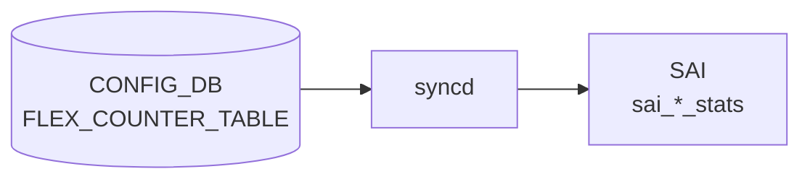

# FLEX_COUNTER_TABLE テーブル

## 概要

[orchagent](../../reference/glossary.md#term-orchagent) / [syncd](../../reference/glossary.md#term-syncd) に対し、各種ハードウェアカウンタのポーリング有効化と周期、bulk API のチャンクサイズを指定するテーブル[^1]。`syncd` の `FlexCounter` モジュールがこのテーブルを購読し、[SAI](../../reference/glossary.md#term-sai) bulk counter API の周期呼び出しスケジュールを切り替える。fast-reboot 時の `FLEX_COUNTER_DELAY_STATUS = true` で system-ready まで停止可能。

<!-- cdb-mermaid -->
### データフロー (自動生成)



!!! note "凡例"
    CONFIG_DB から SAI までの典型経路を `docs/reference/config-db-orch-map.md` から機械生成したミニ図。詳細・例外は本ページ本文と対応表を参照。
<!-- /cdb-mermaid -->

## key 構造

```text
FLEX_COUNTER_TABLE|<group>
```

`<group>` は固定の counter グループ名。23 グループ前後が [YANG](../../reference/glossary.md#term-yang) で定義される（下表）。

## 共通フィールド

各グループ共通でとりうる leaf:

| フィールド | 型 | 説明 |
|-----------|----|------|
| `FLEX_COUNTER_STATUS` | enum `enable`/`disable` | ポーリング有効化 |
| `FLEX_COUNTER_DELAY_STATUS` | `boolean_type` | system-ready まで起動遅延 |
| `POLL_INTERVAL` | uint32 (100..2^32-1) [ms] | ポーリング間隔 |
| `BULK_CHUNK_SIZE` | uint32 (1..2^32-1) | 1 回の bulk API で扱うエントリ数 |
| `BULK_CHUNK_SIZE_PER_PREFIX` | string | プレフィクス別 bulk チャンクサイズ |

各グループは上記のうち一部のみ持つ（例: `PFCWD` は `FLEX_COUNTER_STATUS` と `FLEX_COUNTER_DELAY_STATUS` のみ）。

## 主なグループ

| グループ | 対象 |
|----------|------|
| `BUFFER_POOL_WATERMARK` | バッファプール watermark |
| `DEBUG_COUNTER` | drop reason 等のデバッグカウンタ |
| `ENI` | [DASH](../../reference/glossary.md#term-dash) [ENI](../../reference/glossary.md#term-eni) カウンタ |
| `DASH_METER` / `HA_SET` | [DASH](../../reference/glossary.md#term-dash) 関連 |
| `PFCWD` | [PFC](../../reference/glossary.md#term-pfc) watchdog |
| `PG_DROP` / `PG_WATERMARK` | priority group ドロップ / watermark |
| `PORT` / `PORT_RATES` / `PORT_BUFFER_DROP` / `PORT_PHY_ATTR` | ポート系 |
| `QUEUE` / `QUEUE_WATERMARK` | キュー系 |
| `RIF` / `RIF_RATES` | router-interface 系 |
| `ACL` | [ACL](../../reference/glossary.md#term-acl) ヒットカウンタ |
| `FLOW_CNT_TRAP` | host-IF trap flow |
| `FLOW_CNT_ROUTE` | route flow（`FLOW_COUNTER_ROUTE_PATTERN` と連携） |
| `TUNNEL` | tunnel 系 |
| `WRED_ECN_QUEUE` / `WRED_ECN_PORT` | [WRED](../../reference/glossary.md#term-wred)/ECN マーキング |
| `SRV6` | [SRv6](../../reference/glossary.md#term-srv6) |
| `SWITCH` | スイッチレベルグローバル |

## 関連サブテーブル

- `FLOW_COUNTER_ROUTE_PATTERN` (key: `ip_prefix`): default [VRF](../../reference/glossary.md#term-vrf) のルートフロー対象パターン
    - `max_match_count` (uint32, 1..50): バインドする最大ルート数
- `FLOW_COUNTER_ROUTE_PATTERN` の [VRF](../../reference/glossary.md#term-vrf) 版 list (key: `vrf_name`, `ip_prefix`): [VRF](../../reference/glossary.md#term-vrf) / [VNET](../../reference/glossary.md#term-vnet) 名スコープ

## 購読者

- `syncd` の `FlexCounter`: [SAI](../../reference/glossary.md#term-sai) bulk counter API スケジュール
- `FlexCounterOrch` ([orchagent](../../reference/glossary.md#term-orchagent) 内)
- `pfcwd`、`watermarkmgr` 等のカウンタ依存モジュール

## 関連 CONFIG_DB / YANG / CLI

- 関連 [CONFIG_DB](../../reference/glossary.md#term-config_db): `FLOW_COUNTER_ROUTE_PATTERN`、`COUNTERS_DB`（実カウンタ値の読み出し先）
- 関連 CLI: `counterpoll <group> enable/disable`、`counterpoll <group> interval <ms>`
- 関連 [YANG](../../reference/glossary.md#term-yang): `sonic-flex_counter`

<!-- ref-triangle:start -->

## 関連リファレンス

- [YANG](../../reference/glossary.md#term-yang): [`sonic-flex_counter`](../yang/sonic-flex_counter.md)
- CLI: `counterpoll`

<!-- ref-triangle:end -->

## 引用元

[^1]: YANG 定義: `sonic-flex_counter.yang`. <https://github.com/sonic-net/sonic-buildimage/blob/9ea932ec2e18f35e58268ec2e4456b1d4afd65cd/src/sonic-yang-models/yang-models/sonic-flex_counter.yang>

<!-- topics-back-ref -->
## 関連 Topics

- [Topics: Telemetry / SNMP / Observability](../../topics/09-telemetry-snmp/index.md)

<!-- /topics-back-ref -->

<!-- ops-hint -->
## 運用ヒント

### 典型値

- key 形式: `FLEX_COUNTER_TABLE|<group>` (PORT / QUEUE / PG_WATERMARK / [RIF](../../reference/glossary.md#term-rif) 等)`。
- `FLEX_COUNTER_STATUS`: `enable`、`POLL_INTERVAL`: 1000〜10000ms。

### よくある誤設定

- POLL_INTERVAL を極端に短く（100ms 等）するとカウンタ集計で CPU が貼り付く。

### 確認コマンド

```bash
sonic-db-cli CONFIG_DB keys 'FLEX_COUNTER_TABLE|*'
counterpoll show
```
<!-- /ops-hint -->

<!-- value-behavior -->
## 値依存挙動マトリクス

### `FLEX_COUNTER_STATUS`

| 値 | グループ | 挙動 |
|----|---------|------|
| `enable` | `PORT` | `m_port_counter_enabled = true` → ポート統計 COUNTER_ID_LIST を投入 |
| `enable` | `PORT_BUFFER_DROP` | `m_port_buffer_drop_counter_enabled = true` |
| `enable` | `QUEUE` | `m_queue_enabled = true` → キュー COUNTER_ID_LIST を投入 |
| `enable` | `QUEUE_WATERMARK` | `m_queue_watermark_enabled = true` |
| `enable` | `PG_DROP` | `m_pg_enabled = true` |
| `enable` | `PG_WATERMARK` | `m_pg_watermark_enabled = true` |
| `enable` | `WRED_ECN_PORT` | `m_wred_port_counter_enabled = true` |
| `enable` | `WRED_ECN_QUEUE` | `m_wred_queue_counter_enabled = true` |
| `enable` | `RIF` | `gIntfsOrch` に COUNTER_ID_LIST を渡す |
| `enable` | `BUFFER_POOL_WATERMARK` | `gBufferOrch` に通知 |
| `enable` | `TUNNEL` | `vxlan_tunnel_orch` に通知 |
| `enable` | `FLOW_CNT_ROUTE` | `m_route_flow_counter_enabled = true` |
| `disable` | 全グループ | 対応カウンタを停止。`FLOW_CNT_ROUTE` は `m_route_flow_counter_enabled = false` |
| 未設定 | 全グループ | デフォルト `disable`（"counters are disabled for polling by default"） |

<!-- /value-behavior -->

<!-- cdb-exceptions -->
## 例外条件・特殊挙動

<!-- evidence: sonic-swss/orchagent/flexcounterorch.cpp -->

| 条件 | 挙動 |
|------|------|
| `BUFFER_QUEUE` / `BUFFER_PG` key 形式不正 | `SWSS_LOG_ERROR("Invalid BUFFER_QUEUE key: [%s]")` → エントリスキップ |
| queue / PG インデックスが非整数 | `std::invalid_argument` をキャッチし `SWSS_LOG_ERROR` → そのポートのカウンタ設定は適用されない |
| `FLEX_COUNTER_STATUS` 未設定 | デフォルト `disable`。エントリがなければカウンタ収集は行われない |
| `create_only_config_db_buffers` フラグ読み取りエラー | `SWSS_LOG_ERROR` → バッファカウンタ関連設定がデフォルト動作になる可能性 |
| `POLL_INTERVAL` の極端な短縮 | コード上バリデーションなし。100ms 等ではカウンタ集計で orchagent / syncd CPU が貼り付くリスク |

<!-- /cdb-exceptions -->


<!-- runtime-trace -->
## 実コンテナ動作トレース

### 段階 1 — Consumer 登録

`FlexCounterOrch` (orchagent 直接 CFG 購読) が CONFIG_DB の `FLEX_COUNTER_TABLE` テーブルを購読する。

`FLEX_COUNTER_TABLE` の key はグループ名 (例: `PORT`, `QUEUE`, `TUNNEL`)。各グループの polling interval と状態を管理。

### 段階 2 — CFG→APPL 翻訳

なし (orchagent が直接 CONFIG_DB を購読)

### 段階 3 — APPL→SAI

`sai_counter_api` — SAI flexible counter グループの polling interval / enable を設定

### 段階 4 — タイミングと副作用

**適用タイミング**: orchagent が CONFIG_DB 変化を検知後即座に SAI counter group を更新。`POLL_INTERVAL` 変更は次回 polling から有効。

**副作用**: counter polling の有効/無効化は `COUNTERS_DB` の更新頻度に影響。`FLEX_COUNTER_STATUS` を `enable` にすると対応する SAI カウンタが増分し始める。
<!-- /runtime-trace -->

<!-- entry-points -->
## 書き込み入り口 (Direction A)

対象テーブル: `FLEX_COUNTER_TABLE`

### CLI
- `config flex-counter enable/disable <group>`
- `config flex-counter interval <group> <msec>`
  - ソース: `sonic-utilities/config/main.py (flex-counter グループ)`

### minigraph / sonic-cfggen
- あり: `sonic-cfggen -m <minigraph.xml>` 実行時に本テーブルが生成・上書きされる

### REST / gNMI (sonic-mgmt-common)
- なし (対応 OpenConfig/SONiC YANG transformer なし)

### db_migrator
- なし

### ビルド時デフォルト (init_cfg / j2 テンプレート)
- `init_cfg.json.j2` に `FLEX_COUNTER_TABLE` デフォルト (各グループの `FLEX_COUNTER_STATUS: enable`) が定義。minigraph 生成時は mgmt 系グループが `disable` に変更

### ハードコードデフォルト
- なし

### ランタイム注入 (デーモン自動書き込み)
- なし
<!-- /entry-points -->

<!-- defaults -->
## 暗黙デフォルト・コード由来挙動 (Phase A)

<!-- evidence: sonic-swss/orchagent/flexcounterorch.cpp, sonic-swss/orchagent/flexcounterorch.h,
     sonic-buildimage/files/build_templates/init_cfg.json.j2,
     sonic-buildimage/src/sonic-config-engine/minigraph.py,
     sonic-buildimage/dockers/docker-orchagent/enable_counters.py,
     sonic-utilities/counterpoll/main.py,
     sonic-utilities/scripts/db_migrator.py,
     sonic-buildimage/src/sonic-yang-models/yang-models/sonic-flex_counter.yang -->

### `FLEX_COUNTER_STATUS` の暗黙デフォルト

YANG に `default` 宣言なし。orchagent コメント「counters are disabled for polling by default」(flexcounterorch.cpp:227)。未設定時のデフォルトは **`disable`**（カウンタ収集ゼロ）。

**init_cfg.json.j2 で `enable` が書き込まれるグループ**（ビルド時デフォルト）:

| グループ | init_cfg STATUS | init_cfg POLL_INTERVAL |
|---------|----------------|----------------------|
| `ACL` | `enable` | `10000` ms（唯一明示） |
| `PORT` | `enable` | なし（syncd 側 fallback） |
| `PORT_PHY_ATTR` | `enable` | なし |
| `RIF` | `enable` | なし |
| `QUEUE` | `enable` | なし |
| `PFCWD` | `enable` | なし |
| `PG_WATERMARK` | `enable` | なし |
| `PG_DROP` | `enable` | なし |
| `QUEUE_WATERMARK` | `enable` | なし |
| `BUFFER_POOL_WATERMARK` | `enable` | なし |
| `PORT_BUFFER_DROP` | `enable` | なし |

**minigraph 経由 (`BmcMgmtToRRouter` / `MgmtToRRouter` / `MgmtTsToR`) で `disable` に上書き**:
`BUFFER_POOL_WATERMARK`, `PFCWD`, `PG_DROP`, `PG_WATERMARK`, `PORT_BUFFER_DROP`, `QUEUE`, `QUEUE_WATERMARK`

**DPU (`switch_type == dpu`) でのみ** enable_counters.py が起動後に注入（エントリが空の場合のみ）:
`ENI`, `DASH_METER`

#### 特殊挙動・罠

| 種類 | 内容 |
|------|------|
| dead consumer (プラットフォーム依存) | `FLOW_CNT_ROUTE` は `getRouteFlowCounterSupported()` が false（SAI 未対応 ASIC）の場合、`enable` を書いても SAI 設定ゼロ・エラー通知なし |
| 経路依存連動 | `PORT_PHY_ATTR` を enable にすると `PORT_PHY_SERDES_ATTR` も **自動で連動** enable/disable される。CONFIG_DB に `PORT_PHY_SERDES_ATTR` キーを直接書く必要はなく、書いても orchagent は `PORT_PHY_ATTR` の値で上書く |
| 書込み順依存 | `allPortsReady()` が false の間は `doTask` が早期 return → `enable` エントリが m_toSync に蓄積され、全ポート ready 後に一括適用 |
| warm-reboot 遅延 | warm-reboot 時のみ: delay timer 60 秒間は全 SET が無視される (`m_delayTimerExpired = false`)。通常起動では即時適用 |
| FLOW_CNT_TRAP 前提条件 | `gCoppOrch` が null の場合 `generateHostIfTrapCounterIdList()` が呼ばれず、enable を書いても silent drop |
| 大文字小文字制約 | `enable`/`disable` のみ有効。その他の値は `SWSS_LOG_NOTICE("Unsupported field")` でスキップ |

### `FLEX_COUNTER_DELAY_STATUS` の暗黙デフォルト

YANG に `default` なし。未設定時は遅延なし（即時ポーリング開始）。

| 種類 | 内容 |
|------|------|
| 暗黙 reset (fast-reboot) | db_migrator `migrate_config_db_flex_counter_delay_status`: fast-reboot 前に全エントリの値を `true` に強制上書き |
| 暗黙削除 (version migration) | db_migrator `migrate_flex_counter_delay_status_removal`: cross-branch upgrade 時にフィールドを完全削除する migration が走る。フィールドの有無がバージョンに依存 |
| dead field (通常起動) | 通常起動では `m_delayTimerExpired = true`（コンストラクタで即セット）。`FLEX_COUNTER_DELAY_STATUS` は orchagent から参照されない（syncd 側での参照のみ）。通常は書き込み不要 |

### `POLL_INTERVAL` の暗黙デフォルト

YANG に `default` なし。counterpoll CLI の表示上のソフトデフォルト（orchagent / syncd にはハードコードなし）:

| グループ | CLI ソフトデフォルト | CLI 入力可能範囲 |
|---------|-------------------|----------------|
| `PORT` / `RIF` / `WRED_ECN_PORT` | 1000 ms | 100..30000 |
| `QUEUE` / `PG_DROP` / `ACL` / `TUNNEL` / `FLOW_CNT_TRAP` / `FLOW_CNT_ROUTE` / `WRED_ECN_QUEUE` / `SRV6` / `ENI` / `HA_SET` | 10000 ms | 1000..30000 |
| `BUFFER_POOL_WATERMARK` / `QUEUE_WATERMARK` / `PG_WATERMARK` / `SWITCH` | 60000 ms | 1000..60000 |
| `PORT_BUFFER_DROP` | 60000 ms | **30000..300000** (CPU 負荷大のため下限 30s) |
| `PORT_PHY_ATTR` | 10000 ms | 100..30000 |

**YANG vs CLI 乖離**: YANG の `poll_interval` typedef は `range 100..4294967295` で統一。CLI は group ごとに異なる上限を `IntRange` で強制しており、YANG バリデーションだけでは CLI の下限・上限が守られない。

### `BULK_CHUNK_SIZE` / `BULK_CHUNK_SIZE_PER_PREFIX` の暗黙デフォルト

| 種類 | 内容 |
|------|------|
| 未設定時 fallback | 未設定時、orchagent は syncd へ `"NULL"` 文字列を送信 → syncd 側で chunk size 無限（上限なし）として扱われる |
| silent substitution | 片フィールドのみ設定した場合、もう片方は `"NULL"` で自動補完される（flexcounterorch.cpp:405）。ユーザーへの通知なし |
| 暗黙リセット | 両フィールドを同時に省略した UPDATE を送ると `m_groupsWithBulkChunkSize` から erase → `"NULL","NULL"` を送信してリセット |
| YANG 定義グループのみ | `BULK_CHUNK_SIZE` を YANG で定義するのは `PORT`, `PORT_BUFFER_DROP`, `QUEUE`, `QUEUE_WATERMARK`, `PG_DROP`, `PG_WATERMARK` のみ。他グループ (`DEBUG_COUNTER`, `PFCWD`, `RIF` 等) は YANG にも orchagent にも定義なし（書いても Unsupported field として無視） |

<!-- /defaults -->

<!-- side-effects -->
## 副次 DB 書込 (Phase F)

<!-- evidence: sonic-swss/orchagent/flexcounterorch.cpp, sonic-swss/orchagent/saihelper.cpp,
     sonic-swss/orchagent/flex_counter/flex_counter_manager.cpp, sonic-swss/orchagent/portsorch.cpp -->

`FLEX_COUNTER_TABLE` への書込は `FlexCounterOrch` を通じて 2 つの副次 DB に波及する。

### FLEX_COUNTER_DB への書込

`setFlexCounterGroupOperation()` → `operateFlexCounterGroupDatabase()` が `FLEX_COUNTER_GROUP_TABLE` に書込む（`gTraditionalFlexCounter=true` モード）。`gTraditionalFlexCounter=false` 時は SAI Redis 属性 `SAI_REDIS_SWITCH_ATTR_FLEX_COUNTER_GROUP` 経由で syncd に通知する。

| テーブル | キーパターン | フィールド | トリガ |
|---------|------------|---------|-------|
| `FLEX_COUNTER_GROUP_TABLE` | `<group>` (例: `PORT`) | `FLEX_COUNTER_STATUS`, `POLL_INTERVAL`, `BULK_CHUNK_SIZE`, `BULK_CHUNK_SIZE_PER_PREFIX` | CONFIG_DB の当該フィールド変化時 (`saihelper.cpp:884`) |
| `FLEX_COUNTER_TABLE` | `<group>:<oid>` (例: `PORT:0x1000000000023`) | `PORT_COUNTER_ID_LIST`, `QUEUE_COUNTER_ID_LIST`, `STATS_MODE` 等 | `FLEX_COUNTER_STATUS=enable` 受信後 `generateXxxMap()` 内で `startFlexCounterPolling()` が書込 (`saihelper.cpp:1047`) |
| `FLEX_COUNTER_TABLE` | `<group>:<oid>` | (全削除) | disable 時 / オブジェクト削除時 `stopFlexCounterPolling()` (`saihelper.cpp:1075`) |

Gearbox 有効時は `PORT` / `MACSEC*` グループに対して `GB_FLEX_COUNTER_DB` 側にも同様の書込が発生する (`flexcounterorch.cpp:386`)。

`PORT_PHY_ATTR` グループの enable/disable は `PORT_PHY_SERDES_ATTR` グループへも自動で連動書込される (`flexcounterorch.cpp:392`)。

### COUNTERS_DB への書込

`FLEX_COUNTER_STATUS=enable` 受信後に呼ばれる `generatePortCounterMap()` 等が `PortsOrch` 内の各 `CounterNameMapUpdater` / `Table` オブジェクトを通じてポート・キュー・PG の名前→OID マッピングを書込む。

| テーブル | キーパターン | 内容 | トリガグループ |
|---------|------------|------|--------------|
| `COUNTERS_PORT_NAME_MAP` | `""` (hash: port_name → OID) | 物理ポート名→SAI OID | `PORT` enable (`portsorch.cpp:9102`) |
| `COUNTERS_QUEUE_NAME_MAP` | `""` (hash: `Ethernet0:0` → OID) | キュー名→SAI OID | `QUEUE` / `QUEUE_WATERMARK` enable (`portsorch.cpp:778`) |
| `COUNTERS_PG_NAME_MAP` | `""` (hash: `Ethernet0:0` → OID) | PG 名→SAI OID | `PG_DROP` / `PG_WATERMARK` enable (`portsorch.cpp:785`) |
| `COUNTERS_QUEUE_PORT_MAP` | `""` (hash: queue_OID → port_OID) | キュー→ポート逆引き | キュー追加時 |
| `COUNTERS_QUEUE_INDEX_MAP` | `""` (hash: queue_OID → index) | キュー→インデックス | キュー追加時 |
| `COUNTERS_QUEUE_TYPE_MAP` | `""` (hash: queue_OID → ucast/mcast) | キューのタイプ | キュー追加時 |
| `COUNTERS_PG_PORT_MAP` | `""` (hash: pg_OID → port_OID) | PG→ポート逆引き | PG 追加時 |
| `COUNTERS_PG_INDEX_MAP` | `""` (hash: pg_OID → index) | PG→インデックス | PG 追加時 |
| `COUNTERS_LAG_NAME_MAP` | `""` (hash: lag_name → OID) | LAG 名→OID | LAG ポート追加時 |

これらのマッピングテーブルが存在することで、syncd が SAI bulk counter API で取得したカウンタ値を `COUNTERS_DB` の `COUNTERS:<oid>` キーに書込み、`counterpoll show` / テレメトリ系サービスから名前ベースで参照できる。

<!-- /side-effects -->

<!-- glossary-links-injected: 6ca28e02d7fb -->
