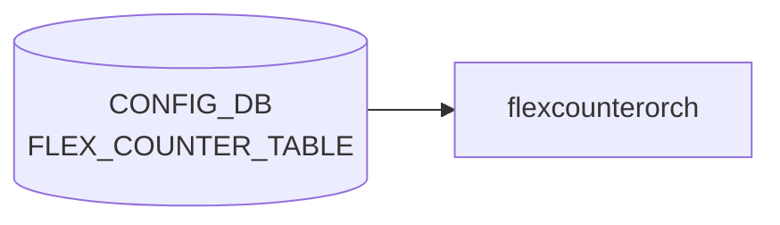

# FLEX_COUNTER_TABLE テーブル

## 概要

[orchagent](../../reference/glossary.md#term-orchagent) / [syncd](../../reference/glossary.md#term-syncd) に対し、各種ハードウェアカウンタのポーリング有効化と周期、bulk API のチャンクサイズを指定するテーブル[^1]。`syncd` の `FlexCounter` モジュールがこのテーブルを購読し、[SAI](../../reference/glossary.md#term-sai) bulk counter API の周期呼び出しスケジュールを切り替える。fast-reboot 時の `FLEX_COUNTER_DELAY_STATUS = true` で system-ready まで停止可能。

<!-- cdb-mermaid -->
### データフロー (自動生成)



!!! note "凡例"
    CONFIG_DB から SAI までの典型経路を `docs/reference/config-db-orch-map.md` から機械生成したミニ図。詳細・例外は本ページ本文と対応表を参照。
<!-- /cdb-mermaid -->

## key 構造

```
FLEX_COUNTER_TABLE|<group>
```

`<group>` は固定の counter グループ名。23 グループ前後が [YANG](../../reference/glossary.md#term-yang) で定義される（下表）。

## 共通フィールド

各グループ共通でとりうる leaf:

| フィールド | 型 | 説明 |
|-----------|----|------|
| `FLEX_COUNTER_STATUS` | enum `enable`/`disable` | ポーリング有効化 |
| `FLEX_COUNTER_DELAY_STATUS` | `boolean_type` | system-ready まで起動遅延 |
| `POLL_INTERVAL` | uint32 (100..2^32-1) [ms] | ポーリング間隔 |
| `BULK_CHUNK_SIZE` | uint32 (1..2^32-1) | 1 回の bulk API で扱うエントリ数 |
| `BULK_CHUNK_SIZE_PER_PREFIX` | string | プレフィクス別 bulk チャンクサイズ |

各グループは上記のうち一部のみ持つ（例: `PFCWD` は `FLEX_COUNTER_STATUS` と `FLEX_COUNTER_DELAY_STATUS` のみ）。

## 主なグループ

| グループ | 対象 |
|----------|------|
| `BUFFER_POOL_WATERMARK` | バッファプール watermark |
| `DEBUG_COUNTER` | drop reason 等のデバッグカウンタ |
| `ENI` | [DASH](../../reference/glossary.md#term-dash) [ENI](../../reference/glossary.md#term-eni) カウンタ |
| `DASH_METER` / `HA_SET` | [DASH](../../reference/glossary.md#term-dash) 関連 |
| `PFCWD` | [PFC](../../reference/glossary.md#term-pfc) watchdog |
| `PG_DROP` / `PG_WATERMARK` | priority group ドロップ / watermark |
| `PORT` / `PORT_RATES` / `PORT_BUFFER_DROP` / `PORT_PHY_ATTR` | ポート系 |
| `QUEUE` / `QUEUE_WATERMARK` | キュー系 |
| `RIF` / `RIF_RATES` | router-interface 系 |
| `ACL` | [ACL](../../reference/glossary.md#term-acl) ヒットカウンタ |
| `FLOW_CNT_TRAP` | host-IF trap flow |
| `FLOW_CNT_ROUTE` | route flow（`FLOW_COUNTER_ROUTE_PATTERN` と連携） |
| `TUNNEL` | tunnel 系 |
| `WRED_ECN_QUEUE` / `WRED_ECN_PORT` | [WRED](../../reference/glossary.md#term-wred)/ECN マーキング |
| `SRV6` | [SRv6](../../reference/glossary.md#term-srv6) |
| `SWITCH` | スイッチレベルグローバル |

## 関連サブテーブル

- `FLOW_COUNTER_ROUTE_PATTERN` (key: `ip_prefix`): default [VRF](../../reference/glossary.md#term-vrf) のルートフロー対象パターン
    - `max_match_count` (uint32, 1..50): バインドする最大ルート数
- `FLOW_COUNTER_ROUTE_PATTERN` の [VRF](../../reference/glossary.md#term-vrf) 版 list (key: `vrf_name`, `ip_prefix`): [VRF](../../reference/glossary.md#term-vrf) / [VNET](../../reference/glossary.md#term-vnet) 名スコープ

## 購読者

- `syncd` の `FlexCounter`: [SAI](../../reference/glossary.md#term-sai) bulk counter API スケジュール
- `FlexCounterOrch` ([orchagent](../../reference/glossary.md#term-orchagent) 内)
- `pfcwd`、`watermarkmgr` 等のカウンタ依存モジュール

## 関連 CONFIG_DB / YANG / CLI

- 関連 [CONFIG_DB](../../reference/glossary.md#term-config_db): `FLOW_COUNTER_ROUTE_PATTERN`、`COUNTERS_DB`（実カウンタ値の読み出し先）
- 関連 CLI: `counterpoll <group> enable/disable`、`counterpoll <group> interval <ms>`
- 関連 [YANG](../../reference/glossary.md#term-yang): `sonic-flex_counter`

<!-- ref-triangle:start -->

## 関連リファレンス

- [YANG](../../reference/glossary.md#term-yang): [`sonic-flex_counter`](../yang/sonic-flex_counter.md)
- CLI: `counterpoll`

<!-- ref-triangle:end -->

## 引用元

[^1]: YANG 定義: `sonic-flex_counter.yang`. <https://github.com/sonic-net/sonic-buildimage/blob/9ea932ec2e18f35e58268ec2e4456b1d4afd65cd/src/sonic-yang-models/yang-models/sonic-flex_counter.yang>

<!-- topics-back-ref -->
## 関連 Topics

- [Topics: Telemetry / SNMP / Observability](../../topics/09-telemetry-snmp/index.md)

<!-- /topics-back-ref -->

<!-- ops-hint -->
## 運用ヒント

### 典型値

- key 形式: `FLEX_COUNTER_TABLE|<group>` (PORT / QUEUE / PG_WATERMARK / [RIF](../../reference/glossary.md#term-rif) 等)`。
- `FLEX_COUNTER_STATUS`: `enable`、`POLL_INTERVAL`: 1000〜10000ms。

### よくある誤設定

- POLL_INTERVAL を極端に短く（100ms 等）するとカウンタ集計で CPU が貼り付く。

### 確認コマンド

```bash
sonic-db-cli CONFIG_DB keys 'FLEX_COUNTER_TABLE|*'
counterpoll show
```
<!-- /ops-hint -->

<!-- glossary-links-injected: 6ca28e02d7fb -->
