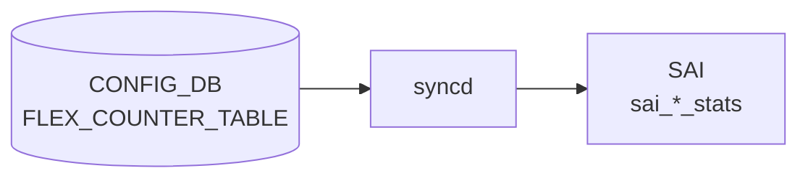

# FLEX_COUNTER_TABLE テーブル

## 概要

[orchagent](../../reference/glossary.md#term-orchagent) / [syncd](../../reference/glossary.md#term-syncd) に対し、各種ハードウェアカウンタのポーリング有効化と周期、bulk API のチャンクサイズを指定するテーブル[^1]。`syncd` の `FlexCounter` モジュールがこのテーブルを購読し、[SAI](../../reference/glossary.md#term-sai) bulk counter API の周期呼び出しスケジュールを切り替える。fast-reboot 時の `FLEX_COUNTER_DELAY_STATUS = true` で system-ready まで停止可能。

<!-- cdb-mermaid -->
### データフロー (自動生成)



!!! note "凡例"
    CONFIG_DB から SAI までの典型経路を `docs/reference/config-db-orch-map.md` から機械生成したミニ図。詳細・例外は本ページ本文と対応表を参照。
<!-- /cdb-mermaid -->

## key 構造

```text
FLEX_COUNTER_TABLE|<group>
```

`<group>` は固定の counter グループ名。23 グループ前後が [YANG](../../reference/glossary.md#term-yang) で定義される（下表）。

## 共通フィールド

各グループ共通でとりうる leaf:

| フィールド | 型 | 説明 |
|-----------|----|------|
| `FLEX_COUNTER_STATUS` | enum `enable`/`disable` | ポーリング有効化 |
| `FLEX_COUNTER_DELAY_STATUS` | `boolean_type` | system-ready まで起動遅延 |
| `POLL_INTERVAL` | uint32 (100..2^32-1) [ms] | ポーリング間隔 |
| `BULK_CHUNK_SIZE` | uint32 (1..2^32-1) | 1 回の bulk API で扱うエントリ数 |
| `BULK_CHUNK_SIZE_PER_PREFIX` | string | プレフィクス別 bulk チャンクサイズ |

各グループは上記のうち一部のみ持つ（例: `PFCWD` は `FLEX_COUNTER_STATUS` と `FLEX_COUNTER_DELAY_STATUS` のみ）。

## 主なグループ

| グループ | 対象 |
|----------|------|
| `BUFFER_POOL_WATERMARK` | バッファプール watermark |
| `DEBUG_COUNTER` | drop reason 等のデバッグカウンタ |
| `ENI` | [DASH](../../reference/glossary.md#term-dash) [ENI](../../reference/glossary.md#term-eni) カウンタ |
| `DASH_METER` / `HA_SET` | [DASH](../../reference/glossary.md#term-dash) 関連 |
| `PFCWD` | [PFC](../../reference/glossary.md#term-pfc) watchdog |
| `PG_DROP` / `PG_WATERMARK` | priority group ドロップ / watermark |
| `PORT` / `PORT_RATES` / `PORT_BUFFER_DROP` / `PORT_PHY_ATTR` | ポート系 |
| `QUEUE` / `QUEUE_WATERMARK` | キュー系 |
| `RIF` / `RIF_RATES` | router-interface 系 |
| `ACL` | [ACL](../../reference/glossary.md#term-acl) ヒットカウンタ |
| `FLOW_CNT_TRAP` | host-IF trap flow |
| `FLOW_CNT_ROUTE` | route flow（`FLOW_COUNTER_ROUTE_PATTERN` と連携） |
| `TUNNEL` | tunnel 系 |
| `WRED_ECN_QUEUE` / `WRED_ECN_PORT` | [WRED](../../reference/glossary.md#term-wred)/ECN マーキング |
| `SRV6` | [SRv6](../../reference/glossary.md#term-srv6) |
| `SWITCH` | スイッチレベルグローバル |

## 関連サブテーブル

- `FLOW_COUNTER_ROUTE_PATTERN` (key: `ip_prefix`): default [VRF](../../reference/glossary.md#term-vrf) のルートフロー対象パターン
    - `max_match_count` (uint32, 1..50): バインドする最大ルート数
- `FLOW_COUNTER_ROUTE_PATTERN` の [VRF](../../reference/glossary.md#term-vrf) 版 list (key: `vrf_name`, `ip_prefix`): [VRF](../../reference/glossary.md#term-vrf) / [VNET](../../reference/glossary.md#term-vnet) 名スコープ

## 購読者

- `syncd` の `FlexCounter`: [SAI](../../reference/glossary.md#term-sai) bulk counter API スケジュール
- `FlexCounterOrch` ([orchagent](../../reference/glossary.md#term-orchagent) 内)
- `pfcwd`、`watermarkmgr` 等のカウンタ依存モジュール

## 関連 CONFIG_DB / YANG / CLI

- 関連 [CONFIG_DB](../../reference/glossary.md#term-config_db): `FLOW_COUNTER_ROUTE_PATTERN`、`COUNTERS_DB`（実カウンタ値の読み出し先）
- 関連 CLI: `counterpoll <group> enable/disable`、`counterpoll <group> interval <ms>`
- 関連 [YANG](../../reference/glossary.md#term-yang): `sonic-flex_counter`

<!-- ref-triangle:start -->

## 関連リファレンス

- [YANG](../../reference/glossary.md#term-yang): [`sonic-flex_counter`](../yang/sonic-flex_counter.md)
- CLI: `counterpoll`

<!-- ref-triangle:end -->

## 引用元

[^1]: YANG 定義: `sonic-flex_counter.yang`. <https://github.com/sonic-net/sonic-buildimage/blob/9ea932ec2e18f35e58268ec2e4456b1d4afd65cd/src/sonic-yang-models/yang-models/sonic-flex_counter.yang>

<!-- topics-back-ref -->
## 関連 Topics

- [Topics: Telemetry / SNMP / Observability](../../topics/09-telemetry-snmp/index.md)

<!-- /topics-back-ref -->

<!-- ops-hint -->
## 運用ヒント

### 典型値

- key 形式: `FLEX_COUNTER_TABLE|<group>` (PORT / QUEUE / PG_WATERMARK / [RIF](../../reference/glossary.md#term-rif) 等)`。
- `FLEX_COUNTER_STATUS`: `enable`、`POLL_INTERVAL`: 1000〜10000ms。

### よくある誤設定

- POLL_INTERVAL を極端に短く（100ms 等）するとカウンタ集計で CPU が貼り付く。

### 確認コマンド

```bash
sonic-db-cli CONFIG_DB keys 'FLEX_COUNTER_TABLE|*'
counterpoll show
```
<!-- /ops-hint -->

<!-- value-behavior -->
## 値依存挙動マトリクス

### `FLEX_COUNTER_STATUS`

| 値 | グループ | 挙動 |
|----|---------|------|
| `enable` | `PORT` | `m_port_counter_enabled = true` → ポート統計 COUNTER_ID_LIST を投入 |
| `enable` | `PORT_BUFFER_DROP` | `m_port_buffer_drop_counter_enabled = true` |
| `enable` | `QUEUE` | `m_queue_enabled = true` → キュー COUNTER_ID_LIST を投入 |
| `enable` | `QUEUE_WATERMARK` | `m_queue_watermark_enabled = true` |
| `enable` | `PG_DROP` | `m_pg_enabled = true` |
| `enable` | `PG_WATERMARK` | `m_pg_watermark_enabled = true` |
| `enable` | `WRED_ECN_PORT` | `m_wred_port_counter_enabled = true` |
| `enable` | `WRED_ECN_QUEUE` | `m_wred_queue_counter_enabled = true` |
| `enable` | `RIF` | `gIntfsOrch` に COUNTER_ID_LIST を渡す |
| `enable` | `BUFFER_POOL_WATERMARK` | `gBufferOrch` に通知 |
| `enable` | `TUNNEL` | `vxlan_tunnel_orch` に通知 |
| `enable` | `FLOW_CNT_ROUTE` | `m_route_flow_counter_enabled = true` |
| `disable` | 全グループ | 対応カウンタを停止。`FLOW_CNT_ROUTE` は `m_route_flow_counter_enabled = false` |
| 未設定 | 全グループ | デフォルト `disable`（"counters are disabled for polling by default"） |

<!-- /value-behavior -->

<!-- cdb-exceptions -->
## 例外条件・特殊挙動

<!-- evidence: sonic-swss/orchagent/flexcounterorch.cpp -->

| 条件 | 挙動 |
|------|------|
| `BUFFER_QUEUE` / `BUFFER_PG` key 形式不正 | `SWSS_LOG_ERROR("Invalid BUFFER_QUEUE key: [%s]")` → エントリスキップ |
| queue / PG インデックスが非整数 | `std::invalid_argument` をキャッチし `SWSS_LOG_ERROR` → そのポートのカウンタ設定は適用されない |
| `FLEX_COUNTER_STATUS` 未設定 | デフォルト `disable`。エントリがなければカウンタ収集は行われない |
| `create_only_config_db_buffers` フラグ読み取りエラー | `SWSS_LOG_ERROR` → バッファカウンタ関連設定がデフォルト動作になる可能性 |
| `POLL_INTERVAL` の極端な短縮 | コード上バリデーションなし。100ms 等ではカウンタ集計で orchagent / syncd CPU が貼り付くリスク |

<!-- /cdb-exceptions -->


<!-- runtime-trace -->
## 実コンテナ動作トレース

### 段階 1 — Consumer 登録

`FlexCounterOrch` (orchagent 直接 CFG 購読) が CONFIG_DB の `FLEX_COUNTER_TABLE` テーブルを購読する。

`FLEX_COUNTER_TABLE` の key はグループ名 (例: `PORT`, `QUEUE`, `TUNNEL`)。各グループの polling interval と状態を管理。

### 段階 2 — CFG→APPL 翻訳

なし (orchagent が直接 CONFIG_DB を購読)

### 段階 3 — APPL→SAI

`sai_counter_api` — SAI flexible counter グループの polling interval / enable を設定

### 段階 4 — タイミングと副作用

**適用タイミング**: orchagent が CONFIG_DB 変化を検知後即座に SAI counter group を更新。`POLL_INTERVAL` 変更は次回 polling から有効。

**副作用**: counter polling の有効/無効化は `COUNTERS_DB` の更新頻度に影響。`FLEX_COUNTER_STATUS` を `enable` にすると対応する SAI カウンタが増分し始める。
<!-- /runtime-trace -->

<!-- entry-points -->
## 書き込み入り口 (Direction A)

対象テーブル: `FLEX_COUNTER_TABLE`

### CLI
- `config flex-counter enable/disable <group>`
- `config flex-counter interval <group> <msec>`
  - ソース: `sonic-utilities/config/main.py (flex-counter グループ)`

### minigraph / sonic-cfggen
- あり: `sonic-cfggen -m <minigraph.xml>` 実行時に本テーブルが生成・上書きされる

### REST / gNMI (sonic-mgmt-common)
- なし (対応 OpenConfig/SONiC YANG transformer なし)

### db_migrator
- なし

### ビルド時デフォルト (init_cfg / j2 テンプレート)
- `init_cfg.json.j2` に `FLEX_COUNTER_TABLE` デフォルト (各グループの `FLEX_COUNTER_STATUS: enable`) が定義。minigraph 生成時は mgmt 系グループが `disable` に変更

### ハードコードデフォルト
- なし

### ランタイム注入 (デーモン自動書き込み)
- なし
<!-- /entry-points -->

<!-- platform -->
## プラットフォーム差分

<!-- evidence: sonic-swss/orchagent/flexcounterorch.cpp -->

### SAI counter capability — FLOW_CNT_ROUTE

`FLOW_CNT_ROUTE` グループは SAI が route flow counter capability を持つ場合のみ有効になる。

```cpp
// flexcounterorch.cpp:324
if (gFlowCounterRouteOrch && gFlowCounterRouteOrch->getRouteFlowCounterSupported() && key == FLOW_CNT_ROUTE_KEY)
```

SAI が route flow counter を未サポートの ASIC では、`FLEX_COUNTER_STATUS = enable` を書いても SAI 設定は行われず、エラー通知もない（silent no-op）。`COUNTERS_DB` に該当エントリが現れないことで初めて気づく。

### Gearbox 搭載 ASIC — PORT / MACSEC の二重登録

```cpp
// flexcounterorch.cpp:204-209, 382-388
if (gPortsOrch && gPortsOrch->isGearboxEnabled())
{
    if (key == PORT_KEY || key.rfind("MACSEC", 0) == 0)
    {
        setFlexCounterGroupPollInterval(flexCounterGroupMap[key], value, true);
        setFlexCounterGroupOperation(flexCounterGroupMap[key], value, true);
    }
}
```

Gearbox（外部 PHY チップ）を搭載するプラットフォームでは、`PORT` および `MACSEC*` グループに対して SAI 側の FlexCounter グループに加えて **PHY 側 FlexCounter グループにも同一の POLL_INTERVAL と STATUS** が設定される。Gearbox なし環境では無効。

### PORT_PHY_ATTR / PORT_PHY_SERDES_ATTR — 連動と ASIC 依存

`PORT_PHY_ATTR` を enable/disable にすると `PORT_PHY_SERDES_ATTR` も自動で連動する（同一 counterpoll knob を共有）。SERDES 属性をサポートする ASIC でのみ実際のカウンタ値が返る。SERDES 未対応 ASIC では空リストが登録されるがエラーにはならない。CONFIG_DB に `FLEX_COUNTER_TABLE|PORT_PHY_SERDES_ATTR` を直接書く必要はなく、書いても `PORT_PHY_ATTR` の設定で上書きされる。

### WRED_ECN カウンタ — ASIC WRED サポート依存

`WRED_ECN_PORT` / `WRED_ECN_QUEUE` は SAI が `SAI_QUEUE_STAT_WRED_*` 属性を実装しているプラットフォームでのみ意味を持つ。未実装 ASIC では enable してもカウンタは増分しない。

### VOQ chassis — QUEUE カウンタ全量収集

```cpp
// flexcounterorch.cpp:544-551
if ((!isCreateOnlyConfigDbBuffers()) || (gMySwitchType == "voq"))
{
    queuesStateVector.insert(make_pair(createAllAvailableBuffersStr, ...));
    return queuesStateVector;
}
```

通常構成 (`create_only_config_db_buffers = true`) では BUFFER_QUEUE 設定のあるポート/キューのみカウンタを収集するが、**VOQ chassis** (`switch_type == voq`) では BUFFER_QUEUE 設定に関わらず全フロントパネルポートおよびシステムポートの全エグレス・VOQ キューが収集対象となる。PG カウンタ (`PG_DROP`, `PG_WATERMARK`) にはこの VOQ 特例はなく、BUFFER_PG 設定分のみが対象（非対称な動作に注意）。

### DPU — ENI / DASH_METER / HA_SET

`ENI`, `DASH_METER`, `HA_SET` グループは `switch_type == dpu` の環境でのみ `enable_counters.py` がデフォルト `enable` を注入する。非 DPU 環境ではエントリ自体が存在しない。

### プラットフォーム別グループ対応サマリ

| グループ | 標準 TOR | Gearbox 搭載 | VOQ chassis | DPU |
|---------|---------|------------|------------|-----|
| `PORT` | ○ | ○ (PHY 側にも二重登録) | ○ | △ |
| `MACSEC_*` | △ (MACsec 有効時) | ○ (PHY 側にも二重登録) | △ | — |
| `PORT_PHY_ATTR` | △ (SERDES 対応 ASIC のみ有効) | ○ | △ | — |
| `PORT_PHY_SERDES_ATTR` | 自動連動 (PORT_PHY_ATTR 依存) | 自動連動 | 自動連動 | — |
| `FLOW_CNT_ROUTE` | △ (SAI capability 要確認) | △ | △ | △ |
| `ENI` / `DASH_METER` / `HA_SET` | — | — | — | ○ |
| `QUEUE` (全量収集) | BUFFER_QUEUE 分のみ | BUFFER_QUEUE 分のみ | 全量 (VOQ 特例) | — |
| `WRED_ECN_*` | △ (WRED 対応 ASIC のみ) | △ | △ | — |

凡例: ○=常に有効、△=条件付き、—=非対応/未定義

<!-- /platform -->

<!-- glossary-links-injected: 6ca28e02d7fb -->
