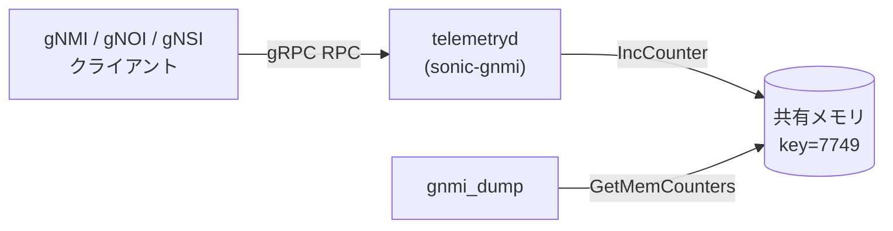

# gNMI 内部リクエストカウンタ

## 概要

`telemetryd` ([sonic-gnmi](https://github.com/sonic-net/sonic-gnmi)) が gRPC リクエストの種別・成否を共有メモリ上のカウンタとして記録する仕組み[^1]。CONFIG_DB テーブルではなく SysV 共有メモリ（キー `7749`）に格納される。デバッグツール `gnmi_dump` で読み出し可能。

本ページは、このカウンタ群の種別・初期値・リセット挙動をコードから導出したリファレンスである。

<!-- cdb-mermaid -->
### データフロー (概略)



!!! note "凡例"
    カウンタは CONFIG_DB ではなく SysV 共有メモリに格納される。`gnmi_dump` が読み出す。
<!-- /cdb-mermaid -->

## 共有メモリ仕様

| パラメータ | 値 | 出典 |
|-----------|-----|------|
| SysV IPC キー | `7749` | `shareMem.go` |
| 領域サイズ | `1024` バイト（最大 128 × uint64） | `shareMem.go` |
| メモリモード | `0x380`（O_RDWR \| IPC_CREAT） | `shareMem.go` |
| カウンタ型 | `uint64`、アトミック加算 | `context.go:IncCounter` |
| 現在の使用スロット数 | 32（`COUNTER_SIZE = 32`） | `context.go` |

## カウンタ種別一覧

| index | 定数名 | `gnmi_dump` 表示名 | 発生タイミング |
|-------|-------|-------------------|--------------|
| 0 | `GNMI_GET` | `GNMI get` | `Get()` RPC 受信時（成否に関わらず） |
| 1 | `GNMI_GET_FAIL` | `GNMI get fail` | `Get()` 各エラー経路（6 箇所）+ Operational Get エラー（3 箇所） |
| 2 | `GNMI_SET` | `GNMI set` | `Set()` RPC 受信時（成否に関わらず） |
| 3 | `GNMI_SET_FAIL` | `GNMI set fail` | `Set()` 各エラー経路（7 箇所） |
| 4 | `GNMI_SET_BYPASS` | `GNMI set bypass` | bypass 高速パス適用成功時（下記参照） |
| 5 | `GNOI_REBOOT` | `GNOI reboot` | **未使用**（dead counter）※ |
| 6 | `GNOI_FACTORY_RESET` | `GNOI Factory Reset` | `FactoryReset()` 開始時 |
| 7 | `GNOI_OS_INSTALL` | `GNOI OS Install` | `InstallOS()` 開始時 |
| 8 | `GNOI_HEALTHZ_ACK` | `GNOI Healthz Ack` | `HealthzAcknowledgeAlarm()` 開始時 |
| 9 | `GNOI_HEALTHZ_CHECK` | `GNOI Healthz Check` | `HealthzGet()` 開始時 |
| 10 | `GNOI_HEALTHZ_COLLECT` | `GNOI Healthz Collect` | `HealthzArtifact()` 開始時 |
| 11 | `GNSI_CREDZ_SET` | `GNSI Credz Set` | `CanaryPush` / `CanaryRollback` / `CredentialInstall` 開始時 |
| 12 | `GNSI_CREDZ_CHECKPOINT` | `GNSI Credz Checkpoint` | `CanaryActivate` / `CanaryRevert` / `SaveCheckpoint` 開始時 |
| 13 | `DBUS` | `DBUS` | `systemctlAction()` 開始時 |
| 14 | `DBUS_FAIL` | `DBUS fail` | `systemctlAction()` 各エラー経路 |
| 15 | `DBUS_APPLY_PATCH_DB` | `DBUS apply patch db` | `ApplyPatchDb()` 開始時 |
| 16 | `DBUS_APPLY_PATCH_YANG` | `DBUS apply patch yang` | `ApplyPatchYang()` 開始時 |
| 17 | `DBUS_CREATE_CHECKPOINT` | `DBUS create checkpoint` | `CreateCheckPoint()` 開始時 |
| 18 | `DBUS_DELETE_CHECKPOINT` | `DBUS delete checkpoint` | `DeleteCheckPoint()` 開始時 |
| 19 | `DBUS_CONFIG_SAVE` | `DBUS config save` | `ConfigSave()` 開始時 |
| 20 | `DBUS_CONFIG_RELOAD` | `DBUS config reload` | `ConfigReload()` 開始時 |
| 21 | `DBUS_STOP_SERVICE` | `DBUS stop service` | `StopService()` 開始時 |
| 22 | `DBUS_RESTART_SERVICE` | `DBUS restart service` | `RestartService()` 開始時 |
| 23 | `DBUS_FILE_STAT` | `DBUS file stat` | `GetFileStat()` 開始時 |
| 24 | `DBUS_FILE_DOWNLOAD` | `DBUS file download` | `DownloadFile()` 開始時 |
| 25 | `DBUS_FILE_REMOVE` | `DBUS file remove` | `RemoveFile()` 開始時 |
| 26 | `DBUS_IMAGE_DOWNLOAD` | `DBUS image download` | `DownloadImage()` 開始時 |
| 27 | `DBUS_IMAGE_INSTALL` | `DBUS image install` | `InstallImage()` 開始時 |
| 28 | `DBUS_IMAGE_LIST` | `DBUS image list` | `GetDockerImages()` 開始時 |
| 29 | `DBUS_IMAGE_ACTIVATE` | `DBUS image activate` | `ActivateImage()` 開始時 |
| 30 | `DBUS_DOCKER_LOAD` | `DBUS docker load` | `LoadDocker()` 開始時 |
| 31 | `DBUS_CONFIG_REPLACE` | `DBUS config replace` | `ConfigReplace()` 開始時 |

※ `GNOI_REBOOT` は `gnoi_system.go` に Reboot 実装が存在するが、`IncCounter(GNOI_REBOOT)` は呼ばれない（コードギャップ）。`gnmi_dump` 出力で常に `0`。

## GNMI_SET_BYPASS 発生条件

`bypass.go` による高速パス（GCU バリデーション省略）が適用される 3 条件が **すべて** 満たされた場合に `GNMI_SET_BYPASS` が増分される。

| 条件 | 詳細 |
|------|------|
| gRPC メタデータヘッダ | `x-sonic-ss-bypass-validation: true` が存在 |
| HwSku プレフィクス | `DEVICE_METADATA\|localhost.hwsku` が `Cisco-8102` / `Cisco-8101` / `Cisco-8223` のいずれかで始まる |
| 操作対象テーブル | `VNET` / `VNET_ROUTE_TUNNEL` / `VLAN_SUB_INTERFACE` / `ACL_RULE` / `BGP_PEER_RANGE` のみ |

## GNMI_GET / GNMI_SET の計数方式

- `GNMI_GET`: RPC 受信時に **無条件で** 1 増分し、その後の成否で `GNMI_GET_FAIL` を追加増分する。成功リクエストのカウント = `GNMI_GET - GNMI_GET_FAIL`
- `GNMI_SET`: 同様。成功 = `GNMI_SET - GNMI_SET_FAIL - GNMI_SET_BYPASS`

<!-- defaults -->
## 暗黙デフォルト・コード由来挙動 (Phase A)

<!-- evidence: sonic-gnmi/common_utils/context.go, sonic-gnmi/common_utils/shareMem.go,
     sonic-gnmi/gnmi_server/server.go, sonic-gnmi/sonic_service_client/dbus_client.go,
     sonic-gnmi/pkg/bypass/bypass.go -->

### 起動時の初期値

| 種類 | 内容 |
|------|------|
| 初期値 | `NewServer()` 内で `InitCounters()` が呼ばれ、全 32 カウンタを `uint64(0)` にリセットして共有メモリに同期書き込み（`server.go:528`）。**サーバー再起動のたびに全カウンタが 0 にリセットされる** |
| 永続化 | なし。SysV 共有メモリはカーネルが保持するが、OS 再起動・`ipcrm` で消去される。`telemetryd` 再起動でも `InitCounters` によりリセット |
| warm-reboot | `telemetryd` が再起動するため `InitCounters` が走り全カウンタ 0 クリア。warm-reboot 前の統計値は消失する |

### カウンタ更新の原子性と副作用

| 種類 | 内容 |
|------|------|
| 原子性 | `IncCounter` は `atomic.AddUint64` でカウンタ変数を増分（goroutine 安全）。その後 `SetMemCounters` で全カウンタを共有メモリに書き直す。`SetMemCounters` 自体はノーロック（メモリ書き込みの粒度は uint64 単位のみ保証） |
| gnmi_dump との競合 | `gnmi_dump` が `GetMemCounters` を読んでいる間に `SetMemCounters` が走ると、部分的に更新中のスナップショットを読む可能性がある。精度は「概算」扱いが適切 |
| DBUS カウンタの二重計上 | `GNSI_CREDZ_SET` は `CanaryPush`・`CanaryRollback`・`CredentialInstall` の 3 API が各々増分するため、1 gNSI セッションで複数回計上されうる（`dbus_client.go:464,475,487`） |

### GNOI_REBOOT dead counter

| 種類 | 内容 |
|------|------|
| 定義 | `CounterType` の iota index 5 として定義（`context.go:45`） |
| 実装ギャップ | `gnoi_system.go` の `Reboot()` RPC 実装内に `IncCounter(GNOI_REBOOT)` が存在しない |
| 影響 | `gnmi_dump` 出力で `GNOI reboot---0` が常に表示されるが、実際に Reboot RPC を受けても 0 のまま。デバッグ用途では GNOI Reboot の頻度は追えない |

### uint64 オーバーフロー

| 種類 | 内容 |
|------|------|
| 上限値 | `uint64` 最大値 = 18,446,744,073,709,551,615 |
| ラップアラウンド | 上限超過後は 0 にラップアラウンド（Go の整数オーバーフロー挙動）。コード上のガード処理はなし |
| 実運用影響 | 1 秒 100 万 RPC を継続しても約 58 万年で溢れる計算のため実害はほぼない |

### 共有メモリサイズと拡張余地

| 種類 | 内容 |
|------|------|
| 現在使用 | 32 カウンタ × 8 バイト = 256 バイト（領域全体の 25%） |
| 空き | 1024 − 256 = 768 バイト（96 カウンタ分の空き） |
| 注意点 | `COUNTER_SIZE` 変更時は `memSize` も追従させる必要がある（現状はハードコード）。`gnmi_dump` と `telemetryd` を同時再ビルドしないと配列インデックスがずれる |

<!-- /defaults -->

<!-- ops-hint -->
## 運用ヒント

### 読み出しコマンド

```bash
# telemetryd コンテナ内で実行
gnmi_dump
```

出力例:
```
Dump GNMI counters
GNMI get---42
GNMI get fail---3
GNMI set---10
GNMI set fail---0
GNMI set bypass---0
GNOI reboot---0
...
DBUS---5
DBUS fail---0
...
```

### よくある誤解

- `GNOI reboot` が 0 のままでも Reboot RPC は受け付けている（dead counter のため）
- `GNMI_GET` が増えていても実際の応答成功率は `1 - (GNMI_GET_FAIL / GNMI_GET)` で計算する必要がある
- カウンタは `telemetryd` 再起動でリセットされるため、長期トレンドの追跡には外部の監視ツールへのエクスポートが必要

<!-- /ops-hint -->

## 引用元

[^1]: `common_utils/context.go`, `common_utils/shareMem.go`, `gnmi_dump/gnmi_dump.go` — sonic-net/sonic-gnmi (master). <https://github.com/sonic-net/sonic-gnmi/blob/master/common_utils/context.go>
