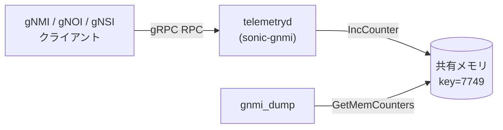

# gNMI 内部リクエストカウンタ

## 概要

`telemetryd` ([sonic-gnmi](https://github.com/sonic-net/sonic-gnmi)) が gRPC リクエストの種別・成否を共有メモリ上のカウンタとして記録する仕組み[^1]。[CONFIG_DB](../../reference/glossary.md#term-config_db) テーブルではなく SysV 共有メモリ（キー `7749`）に格納される。デバッグツール `gnmi_dump` で読み出し可能。

本ページは、このカウンタ群の種別・初期値・リセット挙動をコードから導出したリファレンスである。

<!-- cdb-mermaid -->
### データフロー (概略)



!!! note "凡例"
    カウンタは CONFIG_DB ではなく SysV 共有メモリに格納される。`gnmi_dump` が読み出す。
<!-- /cdb-mermaid -->

## 共有メモリ仕様

| パラメータ | 値 | 出典 |
|-----------|-----|------|
| SysV IPC キー | `7749` | `shareMem.go` |
| 領域サイズ | `1024` バイト（最大 128 × uint64） | `shareMem.go` |
| メモリモード | `0x380`（O_RDWR \| IPC_CREAT） | `shareMem.go` |
| カウンタ型 | `uint64`、アトミック加算 | `context.go:IncCounter` |
| 現在の使用スロット数 | 32（`COUNTER_SIZE = 32`） | `context.go` |

## カウンタ種別一覧

| index | 定数名 | `gnmi_dump` 表示名 | 発生タイミング |
|-------|-------|-------------------|--------------|
| 0 | `GNMI_GET` | `GNMI get` | `Get()` RPC 受信時（成否に関わらず） |
| 1 | `GNMI_GET_FAIL` | `GNMI get fail` | `Get()` 各エラー経路（6 箇所）+ Operational Get エラー（3 箇所） |
| 2 | `GNMI_SET` | `GNMI set` | `Set()` RPC 受信時（成否に関わらず） |
| 3 | `GNMI_SET_FAIL` | `GNMI set fail` | `Set()` 各エラー経路（7 箇所） |
| 4 | `GNMI_SET_BYPASS` | `GNMI set bypass` | bypass 高速パス適用成功時（下記参照） |
| 5 | `GNOI_REBOOT` | `GNOI reboot` | **未使用**（dead counter）※ |
| 6 | `GNOI_FACTORY_RESET` | `GNOI Factory Reset` | `FactoryReset()` 開始時 |
| 7 | `GNOI_OS_INSTALL` | `GNOI OS Install` | `InstallOS()` 開始時 |
| 8 | `GNOI_HEALTHZ_ACK` | `GNOI Healthz Ack` | `HealthzAcknowledgeAlarm()` 開始時 |
| 9 | `GNOI_HEALTHZ_CHECK` | `GNOI Healthz Check` | `HealthzGet()` 開始時 |
| 10 | `GNOI_HEALTHZ_COLLECT` | `GNOI Healthz Collect` | `HealthzArtifact()` 開始時 |
| 11 | `GNSI_CREDZ_SET` | `GNSI Credz Set` | `CanaryPush` / `CanaryRollback` / `CredentialInstall` 開始時 |
| 12 | `GNSI_CREDZ_CHECKPOINT` | `GNSI Credz Checkpoint` | `CanaryActivate` / `CanaryRevert` / `SaveCheckpoint` 開始時 |
| 13 | `DBUS` | `DBUS` | `systemctlAction()` 開始時 |
| 14 | `DBUS_FAIL` | `DBUS fail` | `systemctlAction()` 各エラー経路 |
| 15 | `DBUS_APPLY_PATCH_DB` | `DBUS apply patch db` | `ApplyPatchDb()` 開始時 |
| 16 | `DBUS_APPLY_PATCH_YANG` | `DBUS apply patch yang` | `ApplyPatchYang()` 開始時 |
| 17 | `DBUS_CREATE_CHECKPOINT` | `DBUS create checkpoint` | `CreateCheckPoint()` 開始時 |
| 18 | `DBUS_DELETE_CHECKPOINT` | `DBUS delete checkpoint` | `DeleteCheckPoint()` 開始時 |
| 19 | `DBUS_CONFIG_SAVE` | `DBUS config save` | `ConfigSave()` 開始時 |
| 20 | `DBUS_CONFIG_RELOAD` | `DBUS config reload` | `ConfigReload()` 開始時 |
| 21 | `DBUS_STOP_SERVICE` | `DBUS stop service` | `StopService()` 開始時 |
| 22 | `DBUS_RESTART_SERVICE` | `DBUS restart service` | `RestartService()` 開始時 |
| 23 | `DBUS_FILE_STAT` | `DBUS file stat` | `GetFileStat()` 開始時 |
| 24 | `DBUS_FILE_DOWNLOAD` | `DBUS file download` | `DownloadFile()` 開始時 |
| 25 | `DBUS_FILE_REMOVE` | `DBUS file remove` | `RemoveFile()` 開始時 |
| 26 | `DBUS_IMAGE_DOWNLOAD` | `DBUS image download` | `DownloadImage()` 開始時 |
| 27 | `DBUS_IMAGE_INSTALL` | `DBUS image install` | `InstallImage()` 開始時 |
| 28 | `DBUS_IMAGE_LIST` | `DBUS image list` | `GetDockerImages()` 開始時 |
| 29 | `DBUS_IMAGE_ACTIVATE` | `DBUS image activate` | `ActivateImage()` 開始時 |
| 30 | `DBUS_DOCKER_LOAD` | `DBUS docker load` | `LoadDocker()` 開始時 |
| 31 | `DBUS_CONFIG_REPLACE` | `DBUS config replace` | `ConfigReplace()` 開始時 |

※ `GNOI_REBOOT` は `gnoi_system.go` に Reboot 実装が存在するが、`IncCounter(GNOI_REBOOT)` は呼ばれない（コードギャップ）。`gnmi_dump` 出力で常に `0`。

## GNMI_SET_BYPASS 発生条件

`bypass.go` による高速パス（[GCU](../../reference/glossary.md#term-gcu) バリデーション省略）が適用される 3 条件が **すべて** 満たされた場合に `GNMI_SET_BYPASS` が増分される。

| 条件 | 詳細 |
|------|------|
| gRPC メタデータヘッダ | `x-sonic-ss-bypass-validation: true` が存在 |
| [HwSku](../../reference/glossary.md#term-hwsku) プレフィクス | `DEVICE_METADATA\|localhost.hwsku` が `Cisco-8102` / `Cisco-8101` / `Cisco-8223` のいずれかで始まる |
| 操作対象テーブル | `VNET` / `VNET_ROUTE_TUNNEL` / `VLAN_SUB_INTERFACE` / `ACL_RULE` / `BGP_PEER_RANGE` のみ |

## GNMI_GET / GNMI_SET の計数方式

- `GNMI_GET`: RPC 受信時に **無条件で** 1 増分し、その後の成否で `GNMI_GET_FAIL` を追加増分する。成功リクエストのカウント = `GNMI_GET - GNMI_GET_FAIL`
- `GNMI_SET`: 同様。成功 = `GNMI_SET - GNMI_SET_FAIL - GNMI_SET_BYPASS`

<!-- defaults -->
## 暗黙デフォルト・コード由来挙動

<!-- evidence: sonic-gnmi/common_utils/context.go, sonic-gnmi/common_utils/shareMem.go,
     sonic-gnmi/gnmi_server/server.go, sonic-gnmi/sonic_service_client/dbus_client.go,
     sonic-gnmi/pkg/bypass/bypass.go -->

### 起動時の初期値

| 種類 | 内容 |
|------|------|
| 初期値 | `NewServer()` 内で `InitCounters()` が呼ばれ、全 32 カウンタを `uint64(0)` にリセットして共有メモリに同期書き込み（`server.go:528`）。**サーバ再起動のたびに全カウンタが 0 にリセットされる** |
| 永続化 | なし。SysV 共有メモリはカーネルが保持するが、OS 再起動・`ipcrm` で消去される。`telemetryd` 再起動でも `InitCounters` によりリセット |
| warm-reboot | `telemetryd` が再起動するため `InitCounters` が走り全カウンタ 0 クリア。warm-reboot 前の統計値は消失する |

### カウンタ更新の原子性と副作用

| 種類 | 内容 |
|------|------|
| 原子性 | `IncCounter` は `atomic.AddUint64` でカウンタ変数を増分（goroutine 安全）。その後 `SetMemCounters` で全カウンタを共有メモリに書き直す。`SetMemCounters` 自体はノーロック（メモリ書き込みの粒度は uint64 単位のみ保証） |
| gnmi_dump との競合 | `gnmi_dump` が `GetMemCounters` を読んでいる間に `SetMemCounters` が走ると、部分的に更新中のスナップショットを読む可能性がある。精度は「概算」扱いが適切 |
| DBUS カウンタの二重計上 | `GNSI_CREDZ_SET` は `CanaryPush`・`CanaryRollback`・`CredentialInstall` の 3 API が各々増分するため、1 gNSI セッションで複数回計上されうる（`dbus_client.go:464,475,487`） |

### GNOI_REBOOT dead counter

| 種類 | 内容 |
|------|------|
| 定義 | `CounterType` の iota index 5 として定義（`context.go:45`） |
| 実装ギャップ | `gnoi_system.go` の `Reboot()` RPC 実装内に `IncCounter(GNOI_REBOOT)` が存在しない |
| 影響 | `gnmi_dump` 出力で `GNOI reboot---0` が常に表示されるが、実際に Reboot RPC を受けても 0 のまま。デバッグ用途では GNOI Reboot の頻度は追えない |

### uint64 オーバーフロー

| 種類 | 内容 |
|------|------|
| 上限値 | `uint64` 最大値 = 18,446,744,073,709,551,615 |
| ラップアラウンド | 上限超過後は 0 にラップアラウンド（Go の整数オーバーフロー挙動）。コード上のガード処理はなし |
| 実運用影響 | 1 秒 100 万 RPC を継続しても約 58 万年で溢れる計算のため実害はほぼない |

### 共有メモリサイズと拡張余地

| 種類 | 内容 |
|------|------|
| 現在使用 | 32 カウンタ × 8 バイト = 256 バイト（領域全体の 25%） |
| 空き | 1024 − 256 = 768 バイト（96 カウンタ分の空き） |
| 注意点 | `COUNTER_SIZE` 変更時は `memSize` も追従させる必要がある（現状はハードコード）。`gnmi_dump` と `telemetryd` を同時再ビルドしないと配列インデックスがずれる |

<!-- /defaults -->

<!-- ordering -->
## 書込み順依存

> 根拠: `sonic-buildimage/dockers/docker-sonic-telemetry/supervisord.conf`, `sonic-gnmi/gnmi_server/server.go`, `sonic-gnmi/common_utils/context.go`, `sonic-gnmi/common_utils/shareMem.go`, `sonic-gnmi/gnmi_dump/gnmi_dump.go`

### 起動シーケンス（supervisord）

```
rsyslogd 起動 (priority=1)
  └─► start.sh 実行 (priority=2, rsyslogd:running 待機)
        └─► telemetry 起動 (priority=3, start:exited 待機)
              └─► NewServer() 呼び出し
                    └─► InitCounters() → 全32カウンタ を uint64(0) で共有メモリへ書込み
                          └─► gRPC サーバー起動 (Serve())
                                └─► IncCounter() がリクエストごとに共有メモリを更新
dialout 起動 (priority=4, telemetry:running 待機)
```

### 順序依存ルール

| # | 依存関係 | 方向 | 影響 |
|---|----------|------|------|
| 1 | `start.sh` 完了 → `telemetry` プロセス起動 | **強制先行**（supervisord `dependent_startup_wait_for`） | `start.sh` が終了するまで `telemetryd` は起動しない |
| 2 | `NewServer()` 内 `InitCounters()` → gRPC `Serve()` | **強制先行**（同一関数内の逐次呼び出し、`server.go:528`） | 共有メモリが初期化される前に gRPC リクエストが来ることはない |
| 3 | `telemetry:running` → `dialout` 起動 | **強制先行**（supervisord `dependent_startup_wait_for`） | dialout は telemetry が起動していないと開始しない |
| 4 | `gnmi_dump` 実行 → 有効カウンタ値の読み取り | **条件付き**（SysV shm が存在しないと `shmget` がエラーを返す） | `telemetryd` 起動前に `gnmi_dump` を実行すると「`Fail to read counters`」エラーになる |

### 重要な制約

- **再起動ごとに全カウンタがリセット**: `telemetryd` が再起動するたびに `NewServer()` → `InitCounters()` が走り、共有メモリの全32カウンタが 0 にリセットされる。これは warm-reboot でも同様（telemetry コンテナが再起動するため）。
- **gnmi_dump は telemetry と独立して実行可能**: `gnmi_dump` は SysV 共有メモリ（key=7749）に直接アクセスするため、gRPC セッションや [CONFIG_DB](../../reference/glossary.md#term-config_db) への接続は不要。ただし共有メモリが存在しない場合（telemetryd 未起動）はエラーとなる。
- **dialout と counters の関係**: `dialout` プロセスは telemetry が起動してから開始するが、dialout の処理自体は `IncCounter` を呼ばない。カウンタは gRPC RPC 受信と DBus 操作のみで増分される。

<!-- /ordering -->

<!-- cross-refs -->
## 暗黙参照 — telemetryd が読み出す関連テーブル

<!-- evidence:
source: sonic-gnmi/pkg/bypass/bypass.go#L148-L168 (master)
excerpt: |
  hwsku, err := rclient.HGet(context.Background(), "DEVICE_METADATA|localhost", "hwsku").Result()
  ...
  for _, prefix := range AllowedSKUPrefixes {
      if strings.HasPrefix(hwsku, prefix) { return true }
  }
source: sonic-gnmi/gnmi_server/connection_manager.go#L32-L61 (master)
excerpt: |
  res, _ := rclient.HGetAll(context.Background(), "TELEMETRY_CONNECTIONS").Result()
source: sonic-gnmi/pkg/interceptors/dpuproxy/resolver.go#L66-L102 (master)
excerpt: |
  configKey := fmt.Sprintf("%s%s", DPUConfigTablePrefix, dpuIndex)  // "DPU|dpu<N>"
  configFields, err := r.configClient.HGetAll(ctx, configKey)
  gnmiPort, ok := configFields["gnmi_port"]
-->

<!-- evidence-rendered:start -->
??? note "📋 検証エビデンス: sonic-gnmi/pkg/interceptors/dpuproxy/resolver.go#L66-L102 (master)"

    **出典**:

    `sonic-gnmi/pkg/interceptors/dpuproxy/resolver.go#L66-L102 (master)`

    **抜粋**:

    ```text
    hwsku, err := rclient.HGet(context.Background(), "DEVICE_METADATA|localhost", "hwsku").Result()
    ...
    for _, prefix := range AllowedSKUPrefixes {
        if strings.HasPrefix(hwsku, prefix) { return true }
    }
    res, _ := rclient.HGetAll(context.Background(), "TELEMETRY_CONNECTIONS").Result()
    configKey := fmt.Sprintf("%s%s", DPUConfigTablePrefix, dpuIndex)  // "DPU|dpu<N>"
    configFields, err := r.configClient.HGetAll(ctx, configKey)
    gnmiPort, ok := configFields["gnmi_port"]
    ```

<!-- evidence-rendered:end -->

`telemetryd` (sonic-gnmi) は gRPC カウンタの増分ロジックに連動して、複数のテーブルを暗黙的に参照する。

### CONFIG_DB — `DEVICE_METADATA|localhost`

| 参照フィールド | 参照箇所 | 参照タイミング | 用途 |
|--------------|---------|--------------|------|
| `hwsku` | `bypass.checkSKU()` (`bypass.go:156`) | `Set()` RPC で bypass 条件判定時（毎リクエスト） | [HwSku](../../reference/glossary.md#term-hwsku) が `Cisco-8102` / `Cisco-8101` / `Cisco-8223` の前方一致であれば `GNMI_SET_BYPASS` を増分する高速パスへ進む |

> `checkSKU()` はキャッシュなしで毎回 [CONFIG_DB](../../reference/glossary.md#term-config_db) (DB 4) に [Redis](../../reference/glossary.md#term-redis) `HGet` を発行する。bypass 高速パスを使わない環境では呼ばれない。

### STATE_DB — `TELEMETRY_CONNECTIONS`

| 操作 | 参照箇所 | タイミング |
|------|---------|----------|
| `HGetAll` → 全削除 | `connection_manager.go:52-60` | `telemetryd` 起動時（古い接続エントリをクリア） |
| `HSet` | `storeKeyRedis()` | gRPC 接続確立時（接続情報を [STATE_DB](../../reference/glossary.md#term-state_db) に記録） |
| `HDel` | `deleteKeyRedis()` | gRPC 接続切断時（接続情報を [STATE_DB](../../reference/glossary.md#term-state_db) から削除） |

> `TELEMETRY_CONNECTIONS` は CONFIG_DB ではなく [STATE_DB](../../reference/glossary.md#term-state_db) (DB 6) に格納される。カウンタの増分とは独立しているが、同一プロセスが管理する接続状態追跡テーブルである。

### CONFIG_DB — `DPU|dpu<N>` / STATE_DB — `CHASSIS_MIDPLANE_TABLE|DPU<N>` （SmartSwitch 環境のみ）

| テーブル/DB | 参照フィールド | 参照箇所 | 用途 |
|------------|--------------|---------|------|
| `DPU\|dpu<N>` (CONFIG_DB) | `gnmi_port` | `dpuproxy/resolver.go:98` | [DPU](../../reference/glossary.md#term-dpu) への転送先 gRPC ポート決定（未設定時デフォルト `8080`） |
| `CHASSIS_MIDPLANE_TABLE\|DPU<N>` (STATE_DB) | `ip_address`, `access` | `dpuproxy/resolver.go:69` | [DPU](../../reference/glossary.md#term-dpu) の IP アドレスと到達性確認 |

> [SmartSwitch](../../reference/glossary.md#term-smartswitch) 構成 (`pkg/interceptors/dpuproxy/`) でのみ使用。通常の [SONiC](../../reference/glossary.md#term-sonic) ではこの参照は発生しない。

### CONFIG_DB — `GNMI` テーブル（間接参照）

`GNMI` テーブルは `telemetryd` 自身がランタイムに直接読むのではなく、`hostcfgd` の `GnmiCfg` ハンドラが変化を検知して telemetry コンテナを再起動するという**間接パターン**をとる。ただし `GNMI|gnmi.save_on_set = true` 設定時には `Set()` RPC 処理後に `ConfigSave()` (`server.go:1057`) が呼ばれ `DBUS_CONFIG_SAVE` カウンタが増分されるため、`GNMI` テーブルの設定がカウンタ増分挙動に間接的に影響する。

| CONFIG_DB キー | 参照フィールド | カウンタへの影響 |
|---------------|--------------|---------------|
| `GNMI\|gnmi` | `save_on_set` | `true` の場合、各 `Set()` RPC で `DBUS_CONFIG_SAVE` カウンタが増分される |

### 範囲外（隣接テーブルとの区別）

- **`COUNTERS_DB`** — sonic-gnmi の `sonic_data_client` が [gNMI](../../reference/glossary.md#term-gnmi) Get/Subscribe のデータソースとして参照するが、共有メモリカウンタの増分ロジックとは無関係。
- **`APPL_DB`** — [gNMI](../../reference/glossary.md#term-gnmi) Set の書き込み先になりうるが、カウンタ自体はテーブルを問わず `GNMI_SET` または `GNMI_SET_FAIL` が増分されるだけで、[APPL_DB](../../reference/glossary.md#term-appl_db) を参照してカウンタを変えるパスは存在しない。

<!-- /cross-refs -->

<!-- failure -->
## 失敗挙動

<!-- source: sonic-gnmi/common_utils/shareMem.go ref:master -->
<!-- source: sonic-gnmi/common_utils/context.go ref:master -->
<!-- source: sonic-gnmi/gnmi_dump/gnmi_dump.go ref:master -->
<!-- source: sonic-gnmi/gnmi_server/server.go ref:master -->

このページが扱う「カウンタ」はデータベーステーブルではなく SysV 共有メモリ（key=`7749`）に格納される。失敗モードの中心は `SetMemCounters` / `GetMemCounters` の syscall 失敗と、エラー戻り値の黙認にある。

### SetMemCounters — エラー戻り値の無視

`SetMemCounters` (`shareMem.go:21-36`) は `SYS_SHMGET` または `SYS_SHMAT` が失敗した場合に `error` を返す。しかし呼び出し元 `InitCounters` と `IncCounter`（いずれも `context.go`）はこの戻り値を**チェックしない**。

```go
// context.go:173-178 — InitCounters
func InitCounters() {
    for i := 0; i < int(COUNTER_SIZE); i++ {
        globalCounters[i] = 0
    }
    SetMemCounters(&globalCounters)  // 戻り値を無視
}

// context.go:180-183 — IncCounter
func IncCounter(cnt CounterType) {
    atomic.AddUint64(&globalCounters[cnt], 1)
    SetMemCounters(&globalCounters)  // 戻り値を無視
}
```

### 失敗パターン別挙動

| # | 失敗シナリオ | in-memory カウンタ | 共有メモリ | gnmi_dump 出力 | ログ出力 |
|---|------------|-------------------|-----------|---------------|---------|
| 1 | `telemetryd` 起動時 `shmget` 失敗（`ENOMEM` 等） | 0 にリセット済み | 未初期化のまま | `Error: Fail to read counters, ...` | なし（エラー無視） |
| 2 | `IncCounter` 呼び出し時 `SYS_SHMGET` 失敗 | `atomic.Add` で正常増加 | SHM に反映されない（古い値のまま） | 古い値を表示 | なし（エラー無視） |
| 3 | `telemetryd` 未起動で `gnmi_dump` 実行 | 対象外 | 未存在 | `Error: Fail to read counters, syscall error, err: ...` → exit 0 | なし |
| 4 | `COUNTER_SIZE` 不一致（telemetryd と gnmi_dump のビルド不一致） | インデックスずれ（配列内なら panic なし） | 誤位置に書込み | 誤ったカウンタを出力 | panic の場合 Go ランタイムログ |

### NewServer での初期化失敗

`NewServer` (`server.go:528`) は `common_utils.InitCounters()` を呼ぶが、SHM 初期化が失敗しても `NewServer` はエラーを返さずサーバ起動を継続する。gRPC サービスは動作するがカウンタは共有メモリに書き込まれない。

### gnmi_dump の終了コード

`gnmi_dump` (`gnmi_dump.go:20-24`) は `GetMemCounters` 失敗時に `fmt.Printf("Error: Fail to read counters, ...")` を標準出力に出力して `return` する。**exit コードは 0** のままであり、シェルスクリプトによる失敗検知には明示的な出力文字列チェックが必要。

### STATE_DB / CONFIG_DB への影響

カウンタはすべて SysV 共有メモリに格納される。失敗時も STATE_DB / CONFIG_DB / [APPL_DB](../../reference/glossary.md#term-appl_db) への書込は発生しない。エラーログも `SWSS_LOG_ERROR` ではなく Go の `fmt.Errorf` のみで、syslog には記録されない。
<!-- /failure -->

<!-- constants -->
## ハードコード定数

<!-- evidence:
source: sonic-net/sonic-gnmi/common_utils/shareMem.go (master)
excerpt: |
  memKey  = 7749
  memSize = 1024
  memMode = 0x380
reasoning: SysV IPC キー・領域サイズ・flags はすべて定数宣言。CONFIG_DB / YANG 管理なし。
-->

<!-- evidence-rendered:start -->
??? note "📋 検証エビデンス: sonic-net/sonic-gnmi/common_utils/shareMem.go (master)"

    **出典**:

    `sonic-net/sonic-gnmi/common_utils/shareMem.go (master)`

    **抜粋**:

    ```text
    memKey  = 7749
    memSize = 1024
    memMode = 0x380
    ```

    **判断根拠**: SysV IPC キー・領域サイズ・flags はすべて定数宣言。CONFIG_DB / YANG 管理なし。

<!-- evidence-rendered:end -->

<!-- evidence:
source: sonic-net/sonic-gnmi/common_utils/context.go (master)
excerpt: |
  COUNTER_SIZE CounterType = iota  // value = 32, sentinel
reasoning: iota 番兵として COUNTER_SIZE = 32 が確定。配列サイズと SetMemCounters ループ上限に使用。
-->

<!-- evidence-rendered:start -->
??? note "📋 検証エビデンス: sonic-net/sonic-gnmi/common_utils/context.go (master)"

    **出典**:

    `sonic-net/sonic-gnmi/common_utils/context.go (master)`

    **抜粋**:

    ```text
    COUNTER_SIZE CounterType = iota  // value = 32, sentinel
    ```

    **判断根拠**: iota 番兵として COUNTER_SIZE = 32 が確定。配列サイズと SetMemCounters ループ上限に使用。

<!-- evidence-rendered:end -->

`sonic-gnmi` の共有メモリカウンタ実装に存在する、CONFIG_DB / [YANG](../../reference/glossary.md#term-yang) で管理されないハードコード定数の一覧。出典は `sonic-gnmi/common_utils/shareMem.go` と `sonic-gnmi/common_utils/context.go`。

### SysV 共有メモリ定数 (`shareMem.go`)

| 定数名 | 値 | 用途 | 出典 |
|--------|-----|------|------|
| `memKey` | `7749` | `shmget` に渡す SysV IPC キー。固定値であり設定変更不可 | `shareMem.go:15` |
| `memSize` | `1024` バイト | 共有メモリ領域サイズ。`uint64 × 128` スロット分を確保（実使用は 32 スロット = 256 バイト） | `shareMem.go:16` |
| `memMode` | `0x380` | `shmget` フラグ（`O_RDWR \| IPC_CREAT`） | `shareMem.go:17` |

### カウンタ配列定数 (`context.go`)

| 定数名 | 値 | 用途 | 出典 |
|--------|-----|------|------|
| `COUNTER_SIZE` | `32`（iota 番兵） | `globalCounters [COUNTER_SIZE]uint64` 配列サイズ。`InitCounters` / `SetMemCounters` のループ上限 | `context.go:55` |

> **注意**: `COUNTER_SIZE` を変更する場合は `telemetryd` と `gnmi_dump` を**同時に**再ビルド・再デプロイしないと配列インデックスがずれ、カウンタの対応関係が壊れる。

### `gnmi_dump` 出力フォーマット定数 (`gnmi_dump.go`)

| 用途 | 値 | 出典 |
|------|----|------|
| ヘッダ行 | `"Dump GNMI counters\n"` | `gnmi_dump.go:17` |
| カウンタ出力書式 | `"%s---%d\n"` | `gnmi_dump.go:22` |
| エラーメッセージ | `"Error: Fail to read counters, syscall error, err: %v\n"` | `gnmi_dump.go:20` |

> `gnmi_dump` の終了コードは失敗時も `0`。自動化スクリプトで異常検知するには出力文字列の `"Error:"` プレフィクスを確認する必要がある。

<!-- /constants -->

<!-- side-effects -->
## 副次 DB 書込

<!-- source: sonic-gnmi/gnmi_server/connection_manager.go ref:master -->
<!-- source: sonic-gnmi/gnmi_server/client_subscribe.go ref:master -->

[gNMI](../../reference/glossary.md#term-gnmi) カウンタ本体は SysV 共有メモリに格納されるため、カウンタ増分ロジック自体が CONFIG_DB / STATE_DB を書き変えることはない。ただし `telemetryd` は gRPC **Subscribe** セッション管理の一環として **STATE_DB の `TELEMETRY_CONNECTIONS`** テーブルを副次的に読み書きする。

### STATE_DB — `TELEMETRY_CONNECTIONS`

| 操作 | [Redis](../../reference/glossary.md#term-redis) コマンド | タイミング | 書込元 | 根拠 |
|------|--------------|-----------|--------|------|
| 起動時クリア | `HGetAll` → 全フィールド `HDel` | `setConnectionManager()` → `PrepareRedis()` 実行時（最初の Subscribe RPC 受信で 1 回のみ） | `connection_manager.go:52-60` | 旧セッション残置エントリを起動直後に掃除する |
| 接続確立 | `HSet(table, key, "active")` | Subscribe セッション受け入れ時 (`connectionManager.Add()`) | `connection_manager.go:116`, `client_subscribe.go:179` | セッション追跡用エントリ登録 |
| 接続切断 | `HDel(table, key)` | Subscribe セッション終了時 (`connectionManager.Remove()`、defer で保証) | `connection_manager.go:127`, `client_subscribe.go:183` | セッション終了に合わせてエントリ削除 |

キー形式は `<client-ip:port>|<target-name>|...|<RFC3339-timestamp>` となり、`createKey()` がクエリ文字列の `target:` / `element:` フィールドを正規表現で抽出して構成する（`connection_manager.go:94-109`）。

> **注意**: `rclient == nil`（`PrepareRedis` 失敗時）の場合、`storeKeyRedis` / `deleteKeyRedis` はログ出力のみでリターンする。副次書込の失敗は Subscribe セッション自体には影響しない。

### 副次書込のないテーブル（スコープ外）

| テーブル / DB | 理由 |
|-------------|------|
| CONFIG_DB（全テーブル） | カウンタはメモリのみ。Set RPC の書込先は配下の DB だがカウンタロジック経路での副次書込はなし |
| [COUNTERS_DB](../../reference/glossary.md#term-counters_db) | telemetryd はデータの**読み取り元**として使用するが、`IncCounter` 経路での書込なし |
| [FLEX_COUNTER_DB](../../reference/glossary.md#term-flex_counter_db) | telemetryd は書込まない（[orchagent](../../reference/glossary.md#term-orchagent) 管轄） |
| [APPL_DB](../../reference/glossary.md#term-appl_db) | 書込なし |

> **Get / Set RPC は `TELEMETRY_CONNECTIONS` を更新しない**。`ConnectionManager` は Subscribe セッション専用。

<!-- /side-effects -->

<!-- pubsub -->
## 通信メカニズム

<!-- source: sonic-gnmi/common_utils/shareMem.go ref:master -->
<!-- source: sonic-gnmi/common_utils/context.go ref:master -->
<!-- source: sonic-gnmi/gnmi_dump/gnmi_dump.go ref:master -->

gNMI 内部カウンタは SysV 共有メモリ（key=`7749`）に格納されるため、**[Redis](../../reference/glossary.md#term-redis) pub/sub 機構は一切存在しない**。`SubscriberStateTable` / `ConsumerStateTable` / `NotificationConsumer` / Redis keyspace 通知のいずれも使用しない。

### 購読方式一覧

| テーブル / 対象 | 方向 | API / 方式 | 購読者 |
|---------------|------|-----------|--------|
| SysV 共有メモリ (key=7749) | telemetryd → 読み取り専用 | `shmget` + `shmat` 直接アクセス | `gnmi_dump` のみ |
| SysV 共有メモリ (key=7749) | telemetryd → 書き込み | `atomic.AddUint64` + `SetMemCounters` | `telemetryd` 内部（RPC 受信ごと） |

### (1) gnmi_dump — SysV SHM 直接読み取り（購読なし）

`gnmi_dump` (`gnmi_dump.go:17-24`) は `common_utils.GetMemCounters()` を呼び出し、
`syscall.SYS_SHMGET` → `SYS_SHMAT` で SysV 共有メモリにアタッチしてカウンタ配列を読み取る。
Redis 接続は一切行わない。`telemetryd` が動作中かどうかに関わらず直接 SHM にアクセスするが、
`telemetryd` 未起動時は SHM 自体が存在しないため `shmget` がエラーを返す。

```
gnmi_dump 実行
  ↓ GetMemCounters() → syscall.SYS_SHMGET(key=7749)
  ↓ SYS_SHMAT でメモリアタッチ
  ↓ globalCounters[0..31] を読み取り
  ↓ "GNMI get---42\n" 形式でテキスト出力 (gnmi_dump.go:22)
```

Redis pub/sub・swsscommon は介在しない。

### (2) telemetryd 内部 — RPC ごとの SHM 書き込み（通知なし）

`IncCounter` (`context.go:180-183`) は `atomic.AddUint64` でインメモリカウンタを増分した後、
`SetMemCounters` で全 32 カウンタを SHM に同期書き込みする。
変更通知は Redis に送られない。`gnmi_dump` が次に読み取るまで外部には非表示。

```
gRPC RPC 受信
  ↓ IncCounter(GNMI_GET)
  ↓ atomic.AddUint64(&globalCounters[0], 1)
  ↓ SetMemCounters(&globalCounters)  // SYS_SHMGET + SYS_SHMAT + memcpy
  ↓ 通知なし — Redis PUBLISH は発生しない
```

### (3) keyspace 通知（カウンタとは無関係）

`sonic-gnmi` リポジトリ内で Redis keyspace 通知を使用するコードは以下の 3 箇所に限定され、
いずれも gNMI カウンタとは無関係である。

| ファイル | 対象テーブル | 用途 |
|--------|-----------|------|
| `dialout/dialout_client/dialout_client.go:686` | `TELEMETRY_CLIENT\|*` | dial-out 設定変更の追従（カウンタ非関与） |
| `gnmi_server/db_journal.go:67-69` | `__keyspace@<dbNum>__:*` | gNMI Set の CONFIG_DB ジャーナル記録（カウンタ非関与） |
| `sonic_data_client/mixed_db_client.go:2093` | `__keyspace@<dbNum>__:<path>` | gNMI Subscribe ON_CHANGE 変更検知（カウンタ非関与） |

> **外部監視の注意点**: カウンタを Prometheus 等に収集する場合、Redis から直接取得するパスは存在しない。`gnmi_dump` を定期実行してテキスト出力をパースするか、gNMI Subscribe RPC で `COUNTERS_DB` を購読する方式（カウンタ自体とは別経路）を使う必要がある。

<!-- /pubsub -->

<!-- platform -->
## プラットフォーム差異

gNMI 内部カウンタは SysV 共有メモリ（key=`7749`）に格納されるため、[SAI](../../reference/glossary.md#term-sai) capability の有無に依存するプラットフォーム差はない。ただし **`GNMI_SET_BYPASS` カウンタ**は特定の Cisco [HwSku](../../reference/glossary.md#term-hwsku) 専用であり、[SmartSwitch](../../reference/glossary.md#term-smartswitch)/[DPU](../../reference/glossary.md#term-dpu) 環境ではカウント集計の分離に注意が必要である。

### GNMI_SET_BYPASS — Cisco 専用バイパス経路

`pkg/bypass/bypass.go:33-36` の `AllowedSKUPrefixes` にハードコードされた HwSku のみで `GNMI_SET_BYPASS` が増分される:

```go
var AllowedSKUPrefixes = []string{
    "Cisco-8102",
    "Cisco-8101",
    "Cisco-8223",
}
```

`ShouldBypass()` (`bypass.go:83-98`) は以下の 3 条件が**すべて**真の場合のみバイパス経路に進み、`GNMI_SET_BYPASS` を増分する:

| 条件 | チェック内容 |
|------|------------|
| gRPC メタデータ | `x-sonic-ss-bypass-validation: true` が存在 |
| HwSku 前方一致 | `DEVICE_METADATA\|localhost.hwsku` が `AllowedSKUPrefixes` に前方一致 |
| 操作テーブル | `VNET` / `VNET_ROUTE_TUNNEL` / `VLAN_SUB_INTERFACE` / `ACL_RULE` / `BGP_PEER_RANGE` |

Broadcom / Mellanox / Marvell / Barefoot 系 HwSku ではバイパス条件を満たさないため `GNMI_SET_BYPASS` は **常に 0**。

### SmartSwitch / DPU 環境

`pkg/interceptors/setup.go` に DPU プロキシインターセプターが登録されており、gRPC メタデータ `x-sonic-target-type: dpu` があれば [NPU](../../reference/glossary.md#term-npu) 側の `telemetryd` が RPC を DPU 側 gNMI サーバに転送する。

| 観点 | 挙動 |
|------|------|
| [NPU](../../reference/glossary.md#term-npu) 側 gnmi_dump | [NPU](../../reference/glossary.md#term-npu) telemetryd が受け取った RPC のみ計上。DPU に転送された RPC も `GNMI_GET` / `GNMI_SET` が NPU 側で増分されてから転送される |
| DPU 側カウンタ | DPU 上の独立した telemetryd が持つ SHM（key=`7749`）に格納される。NPU 側 `gnmi_dump` では **集計されない** |
| `dpuproxy` パッケージ内 | `IncCounter` 呼び出しは 0 件 (`pkg/interceptors/dpuproxy/` 全体) |

[SmartSwitch](../../reference/glossary.md#term-smartswitch) 構成では NPU + 各 DPU それぞれで `gnmi_dump` を実行しないと全体の RPC 集計が得られない。

### VS / テストシミュレーター

[VS](../../reference/glossary.md#term-vs) (libsaivs) 環境では `DEVICE_METADATA|localhost.hwsku` が非 Cisco 値（例: `Force10-S6000`）となるため `checkSKU()` は常に `false` を返し、`GNMI_SET_BYPASS` は発生しない。SysV 共有メモリ自体は Linux カーネルが提供するため [VS](../../reference/glossary.md#term-vs) 上でも正常動作する。

### プラットフォーム別カウンタ挙動まとめ

| プラットフォーム | `GNMI_SET_BYPASS` | DPU カウンタ分離 | 共有メモリ |
|----------------|-------------------|----------------|-----------|
| Cisco-8102 / 8101 / 8223 | **発生あり**（バイパス条件充足時） | N/A | 正常 |
| Broadcom / Mellanox 等 | 常に 0 | N/A | 正常 |
| SmartSwitch (NPU 側) | HwSku 依存 | DPU 側は別 SHM | 正常 |
| [VS](../../reference/glossary.md#term-vs) / シミュレーター | 常に 0 | N/A | 正常 |

<!-- /platform -->

<!-- ops-hint -->
## 運用ヒント

### 読み出しコマンド

```bash
# telemetryd コンテナ内で実行
gnmi_dump
```

出力例:
```
Dump GNMI counters
GNMI get---42
GNMI get fail---3
GNMI set---10
GNMI set fail---0
GNMI set bypass---0
GNOI reboot---0
...
DBUS---5
DBUS fail---0
...
```

### よくある誤解

- `GNOI reboot` が 0 のままでも Reboot RPC は受け付けている（dead counter のため）
- `GNMI_GET` が増えていても実際の応答成功率は `1 - (GNMI_GET_FAIL / GNMI_GET)` で計算する必要がある
- カウンタは `telemetryd` 再起動でリセットされるため、長期トレンドの追跡には外部の監視ツールへのエクスポートが必要

<!-- /ops-hint -->

## 引用元

[^1]: `common_utils/context.go`, `common_utils/shareMem.go`, `gnmi_dump/gnmi_dump.go` — sonic-net/sonic-gnmi (master). <https://github.com/sonic-net/sonic-gnmi/blob/master/common_utils/context.go>

<!-- glossary-links-injected: ca6bc30b1f0e -->
