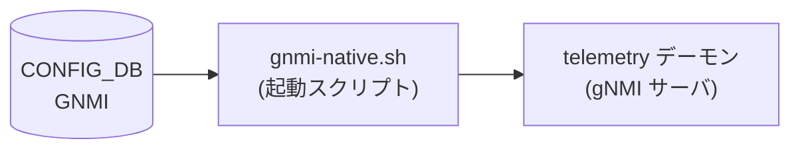

# GNMI テーブル (dial-in サーバ)

## 概要

gNMI dial-in サーバ (`telemetry` デーモン、Docker コンテナ `docker-sonic-gnmi`) のポート・TLS・認証・ログ設定を [CONFIG_DB](../../reference/glossary.md#term-config_db) に保持するテーブル。

起動スクリプト `gnmi-native.sh` が `sonic-cfggen` で `GNMI|gnmi` および `GNMI|certs` を読み出し、CLI フラグとして `telemetry` バイナリ (Go) に渡す。YANG モデル `sonic-gnmi.yang` はスキーマバリデーションを担う。

以前は `TELEMETRY` テーブルに格納されていたが、db_migrator の `migrate_gnmi()` によって `GNMI` テーブルへ移行済み。

<!-- cdb-mermaid -->
### データフロー (自動生成)



!!! note "凡例"
    CONFIG_DB から SAI までの典型経路を `docs/reference/config-db-orch-map.md` から機械生成したミニ図。詳細・例外は本ページ本文と対応表を参照。
<!-- /cdb-mermaid -->

## key 構造

```text
GNMI|gnmi       # サーバ動作設定
GNMI|certs      # TLS 証明書パス
```

## フィールド

### `GNMI|gnmi` サブテーブル

| フィールド | 型 | デフォルト | 説明 |
|-----------|----|-----------|------|
| `port` | uint16 (inet:port-number) | `8080` ※1 | gNMI サーバが listen するポート番号 |
| `client_auth` | boolean | `false` | `true` のとき TLS クライアント証明書を必須化。`false` のとき `--allow_no_client_auth` を付与 |
| `log_level` | uint8 (0–100) | `2` | プロセスログレベル (`-v` フラグ) |
| `threshold` | uint32 | `100` | 同時クライアント接続数上限 |
| `idle_conn_duration` | uint32 | `5` | アイドル接続をクローズするまでの秒数。`0` は無限待ち |
| `save_on_set` | boolean | `false` | Set RPC 成功時に startup config を自動保存 |
| `enable_crl` | boolean | `false` | 証明書失効リスト (CRL) チェックを有効化 |
| `crl_expire_duration` | uint32 | `86400` | CRL キャッシュの有効期間 (秒) |
| `user_auth` | string (`password`/`jwt`/`cert`/`none`) | `cert` ※2 | ユーザ認証方式 |

### `GNMI|certs` サブテーブル

| フィールド | 型 | デフォルト | 説明 |
|-----------|----|-----------|------|
| `ca_crt` | string (パス `.cer`) | — | CA 証明書のローカルパス。クライアント証明書検証に使用 |
| `server_crt` | string (パス `.cer`) | — | TLS サーバ証明書のローカルパス |
| `server_key` | string (パス `.key`) | — | TLS サーバ秘密鍵のローカルパス |

> ※1: `GNMI` テーブルが CONFIG_DB に存在しない場合のシェルスクリプトデフォルト。テーブルが存在する場合は `port` フィールドが必須 (0 以下は起動エラー)。  
> ※2: `user_auth` が CONFIG_DB に存在しない (`null`) 場合、スクリプトが `cert` を補う。

## 制約

- YANG パターン制約: `ca_crt`/`server_crt` は `(/[a-zA-Z0-9_-]+)*/([a-zA-Z0-9_-]+).cer`、`server_key` は同形式で `.key`
- `port` が 0 以下かつ `unix_socket` も未指定の場合、telemetry バイナリが起動エラーで終了
- `user_auth=cert` 時に `ca_crt` が未設定の場合、スクリプトが `cert` 認証モードを自動無効化し `--client_auth` フラグを省く
- `enable_crl=true` は `user_auth=cert` との組み合わせのみで有効 (`gnmi-native.sh` L137)

## 購読者

- `gnmi-native.sh` (起動スクリプト): CONFIG_DB を読み取り、`telemetry` バイナリへ CLI フラグとして渡す。Hot reload なし — 設定変更はコンテナ再起動が必要
- `telemetry` バイナリ (Go): gNMI サーバ本体。起動時にフラグを解析し、証明書変更は `fsnotify` で動的リロード

## 関連 CONFIG_DB / YANG / CLI

- 関連 [CONFIG_DB](../../reference/glossary.md#term-config_db): [`GNMI_CLIENT_CERT`](gnmi-client-cert.md), [`DEVICE_METADATA`](device-metadata.md)
- 関連 CLI: `config gnmi`
- 関連 [YANG](../../reference/glossary.md#term-yang): `sonic-gnmi`

<!-- cdb-exceptions -->
## 例外条件・特殊挙動

| 条件 | 挙動 |
|------|------|
| `GNMI` テーブルが CONFIG_DB に存在しない | `gnmi-native.sh` がデフォルト `PORT=8080`、`threshold=100`、`idle_conn_duration=5` を使用してサーバを起動 |
| `server_crt`/`server_key` が未設定かつ `CERTS`/`X509` エントリが空 | `--noTLS` フラグで起動。本番環境では非推奨 |
| `log_level` が数字以外または 0 未満 | スクリプトが `-v=2` をデフォルト使用。telemetry.go 内では 0 未満の場合 2 に強制 |
| `threshold` が負値 | telemetry.go が起動エラー (`threshold must be >= 0`) |
| `idle_conn_duration` が負値 | telemetry.go が起動エラー (`idle_conn_duration must be >= 0`) |
| `user_auth=cert` かつ `ca_crt` 未設定 | 認証モード `cert` を自動無効化 (silent fallback)。ログに警告を出力 |
| SmartSwitch (`DEVICE_METADATA.subtype=SmartSwitch`) | `gnmi-native.sh` が `-zmq_port=8100` を自動追加 |
| 管理 VRF 有効 (`MGMT_VRF_CONFIG.vrf_global.mgmtVrfEnabled=true`) | `gnmi-native.sh` が `--vrf mgmt` を自動追加 |
| `TELEMETRY` テーブルが残存している場合 | `db_migrator.migrate_gnmi()` が `GNMI` テーブルへ自動移行。両方存在する場合 `GNMI` テーブルが優先 |

<!-- evidence: sonic-net/sonic-buildimage:dockers/docker-sonic-gnmi/gnmi-native.sh:64-147; sonic-net/sonic-gnmi:telemetry/telemetry.go:171-250 -->
<!-- /cdb-exceptions -->

<!-- defaults -->
## 暗黙デフォルト・コード由来挙動 (Phase A)

> 調査対象: `sonic-net/sonic-gnmi/telemetry/telemetry.go`, `sonic-net/sonic-buildimage/dockers/docker-sonic-gnmi/gnmi-native.sh`
> 調査日: 2026-05-14

### `GNMI|gnmi` フィールド

| フィールド | YANG default | シェル fallback | Go フラグ default | 備考 |
|-----------|-------------|----------------|-------------------|------|
| `port` | 未宣言 | `8080`（`GNMI` テーブル欠如時）| `-1`（必須。0 以下は起動エラー）| 実運用値は `50051` または `50052` が標準例 (テスト JSON より) |
| `log_level` | 未宣言 | `2`（非数字時にも fallback）| `2` | 0 未満の場合も Go 実装が `2` に強制 (`telemetry.go:248`) |
| `client_auth` | 未宣言 | `false` → `--allow_no_client_auth` 付与 | `false` | `true` の場合のみ TLS クライアント証明書を強制 |
| `threshold` | 未宣言 | `100`（`null` または `GNMI` 欠如時）| `100` | 負値は Go 起動エラー |
| `idle_conn_duration` | 未宣言 | `5`（秒）（`null` または `GNMI` 欠如時）| `5` | `0` = 無限。負値は Go 起動エラー |
| `save_on_set` | 未宣言 | — (フラグなし = 無効) | `false` | CONFIG_DB から直接読まれず。YANG フィールドは存在するが `gnmi-native.sh` は参照しない ※ |
| `enable_crl` | 未宣言 | `false`（`"true"` 以外は無効）| `false` | `user_auth=cert` 時のみ評価 |
| `crl_expire_duration` | 未宣言 | `null` → Go フラグデフォルト | `86400` (秒 = 24 時間) | フィールド欠如時 Go 実装デフォルトが適用 |
| `user_auth` | 未宣言 | `cert`（`null` 時補完）| AuthTypes 全 false | `none` 設定時は `--client_auth` フラグを省略 |

### `GNMI|certs` フィールド

| フィールド | YANG default | 実装上の fallback | 備考 |
|-----------|-------------|-----------------|------|
| `ca_crt` | 未宣言 | 未設定 → CA 検証なし。`user_auth=cert` モードは自動無効化 | `gnmi-native.sh:41-43` |
| `server_crt` | 未宣言 | 未設定 → `--insecure` フラグで起動（テスト用途限定）| `gnmi-native.sh:35-37` |
| `server_key` | 未宣言 | 同上 | `gnmi-native.sh:35-37` |

### ハードコード固定値

| 定数 | 値 | 適用箇所 |
|------|----|---------|
| `unix_socket` デフォルト | `/var/run/gnmi/gnmi.sock` | TLS なしローカル接続用 Unix ソケット (telemetry.go:175) |
| `jwt_refresh_int` | `900` 秒 | JWT リフレッシュ可能期間 (telemetry.go:183) |
| `jwt_valid_int` | `3600` 秒 | JWT トークン有効期間 (telemetry.go:184) |
| `max_recv_msg_size` | `4 * 1024 * 1024` (4 MiB) | gRPC 受信メッセージ最大サイズ (telemetry.go:209) |
| `max_send_msg_size` | `4 * 1024 * 1024` (4 MiB) | gRPC 送信メッセージ最大サイズ (telemetry.go:210) |
| TLS 最小バージョン | `TLS 1.2` | `tls.VersionTLS12` (telemetry.go:482) |
| keepalive MinTime | `20` 秒 | DPU Proxy 等の keepalive ping 許容間隔 (telemetry.go:547) |

### `save_on_set` の注記

YANG モデル (`sonic-gnmi.yang`) は `save_on_set` フィールドを `boolean` として定義するが、`gnmi-native.sh` 起動スクリプトはこのフィールドを読み取らない。`with-save-on-set` Go フラグは CONFIG_DB から自動設定されず、カスタム起動スクリプトや手動フラグ指定が必要。YANG とシェルスクリプトの間に **dead field** 状態が生じている。

### `user_auth` と translib-write の相関

`telemetry.go:217-229` では、`ENABLE_TRANSLIB_WRITE` が `true` の場合に `client_auth` フラグ未指定時のデフォルトを `password=true, jwt=true` に切り替える。CONFIG_DB の `user_auth` フィールドはシェルスクリプト経由で `--client_auth` フラグに変換されるため、実際の Go 内部デフォルトは `gnmi_translib_write` の状態に依存する。

<!-- evidence: sonic-net/sonic-gnmi:telemetry/telemetry.go:171-328; sonic-net/sonic-buildimage:dockers/docker-sonic-gnmi/gnmi-native.sh:64-150; sonic-net/sonic-buildimage:src/sonic-yang-models/yang-models/sonic-gnmi.yang -->
<!-- /defaults -->

<!-- ordering -->
## 書込み順依存 (Phase B)

> 根拠: `sonic-buildimage/dockers/docker-sonic-gnmi/supervisord.conf`, `sonic-buildimage/dockers/docker-sonic-gnmi/gnmi-native.sh`, `sonic-buildimage/dockers/docker-sonic-gnmi/start.sh`, `sonic-gnmi/telemetry/telemetry.go`

### 起動シーケンス（supervisord）

```
rsyslogd 起動 (priority=1)
  └─► start.sh 実行 (priority=2, rsyslogd:running 待機)
        CONFIG_DB は start.sh 完了前に利用可能（Redis は独立して起動）
        └─► gnmi-native.sh 実行 (priority=3, start:exited 待機)
              └─► sonic-cfggen -d で GNMI|gnmi / GNMI|certs を一括読み取り
                    → CLI フラグを構築して telemetry バイナリを exec
                          └─► dialout.sh 起動 (priority=4, gnmi-native:running 待機)
```

### 順序依存ルール

| # | 依存関係 | 方向 | 影響 |
|---|----------|------|------|
| 1 | `start.sh` 完了 → `gnmi-native.sh` 起動 | **強制先行**（supervisord `dependent_startup_wait_for=start:exited`） | `gnmi-native.sh` は `start.sh` が終了するまで起動しない |
| 2 | CONFIG_DB への `GNMI\|gnmi` / `GNMI\|certs` 書込み → `gnmi-native.sh` 実行 | **強制先行**（スクリプト起動時に `sonic-cfggen` で一括読み取り） | 起動後の設定変更はコンテナ再起動まで反映されない（hot reload なし） |
| 3 | `gnmi-native.sh:running` → `dialout.sh` 起動 | **強制先行**（supervisord `dependent_startup_wait_for=gnmi-native:running`） | gNMI サーバが起動していないと dial-out テレメトリも開始しない |
| 4 | `DEVICE_METADATA\|localhost.subtype` 読み取り → ZMQ ポート設定 | **起動時スナップショット**（`sonic-db-cli` で inline 読み取り） | SmartSwitch 判定は起動時に確定。再起動なしに変更不可 |
| 5 | `MGMT_VRF_CONFIG\|vrf_global.mgmtVrfEnabled` 読み取り → VRF 設定 | **起動時スナップショット**（同上） | 管理 VRF 有効化後のコンテナ再起動が必要 |

### 重要な制約

- **設定変更は再起動が必要**: `gnmi-native.sh` は起動時に CONFIG_DB を 1 回読み取るだけで、以降の変更を監視しない。`GNMI|gnmi` / `GNMI|certs` フィールドを変更した場合は `docker restart gnmi` が必要。
- **TLS 証明書は動的リロード可**: `telemetry` バイナリ（Go）は `fsnotify` で証明書ファイルパスを監視し、証明書ファイルの変更を動的に検知してリロードする。ただし証明書パス（`server_crt`, `server_key`）の変更自体はコンテナ再起動が必要。
- **`TELEMETRY` → `GNMI` 移行の順序**: `db_migrator.migrate_gnmi()` が旧 `TELEMETRY` テーブルを `GNMI` テーブルへ自動移行する。移行前に `gnmi-native.sh` が起動した場合は `TELEMETRY` テーブルを参照し、移行後は `GNMI` テーブルが優先される。
- **CONFIG_DB 存在前の起動**: `GNMI` テーブルが CONFIG_DB に存在しない場合、`gnmi-native.sh` はシェルスクリプト内のデフォルト値（port=8080, threshold=100 等）を使用して起動を継続する。

<!-- /ordering -->

<!-- cross-refs -->
## 暗黙参照テーブル (Phase C)

`GNMI|gnmi` / `GNMI|certs` の設定読み取りは直接参照であるが、`gnmi-native.sh` 起動スクリプトおよび `telemetry` バイナリは以下のテーブルも**暗黙的に参照**する。参照タイミング（起動時スナップショット vs. runtime 都度読み取り）が異なる点に注意。

| 参照先テーブル / キー | 参照方向 | 条件 | 参照元 evidence |
|---------------------|---------|------|----------------|
| `GNMI\|gnmi` / `GNMI\|certs` (CONFIG_DB) | 設定読み取り（起動時 sonic-cfggen） | 常時。存在しない場合はシェルデフォルト値を使用 | `telemetry_vars.j2:2-3`; `gnmi-native.sh:19-23` |
| `DEVICE_METADATA\|localhost.x509` (CONFIG_DB) | TLS 証明書パスの旧フォールバック（起動時 sonic-cfggen） | `GNMI\|certs` が未設定の場合のみ有効。旧 `TELEMETRY` テーブル時代の設定経路 | `telemetry_vars.j2:4`; `gnmi-native.sh:21,46-58` |
| `DEVICE_METADATA\|localhost.subtype` (CONFIG_DB) | SmartSwitch 判定（起動時 sonic-db-cli） | `subtype=SmartSwitch` の場合のみ `-zmq_port=8100` フラグを付与。起動時スナップショット | `gnmi-native.sh:89-92` |
| `MGMT_VRF_CONFIG\|vrf_global.mgmtVrfEnabled` (CONFIG_DB) | 管理 VRF フラグ付与（起動時 sonic-db-cli） | `mgmtVrfEnabled=true` の場合のみ `--vrf mgmt` を付与。起動時スナップショット | `gnmi-native.sh:95-98` |
| `GNMI_CLIENT_CERT\|<CommonName>` (CONFIG_DB) | クライアント証明書 CN → ロールマッピング（runtime 都度読み取り） | `user_auth=cert` 時のみ。各 gNMI RPC で `configDbConnector.Get_entry()` を呼び出す | `gnmi_server/clientCertAuth.go:254-277` |
| `MID_PLANE_BRIDGE\|GLOBAL`, `DPUS\|<dpuId>`, `DHCP_SERVER_IPV4_PORT\|<key>` (CONFIG_DB) | SmartSwitch DPU ZMQ アドレス解決（runtime） | SmartSwitch ZMQ 構成 (`-zmq_port` 指定) 時のみ。`getDpuAddress()` が ZMQ クライアント接続確立時に参照 | `sonic_data_client/mixed_db_client.go:118-151` |
| `DEVICE_METADATA\|localhost.hwsku` (CONFIG_DB) | bypass validation SKU 判定（runtime 都度読み取り） | SmartSwitch 向け gNMI Set RPC 時。`AllowedSKUPrefixes` と照合し CVL validation を bypass するかどうか決定 | `pkg/bypass/bypass.go:148-168` |

!!! note "起動時スナップショット vs. runtime 参照"
    `GNMI|gnmi` / `GNMI|certs` / `DEVICE_METADATA.x509` / `DEVICE_METADATA.subtype` / `MGMT_VRF_CONFIG.mgmtVrfEnabled` は**コンテナ起動時に 1 回だけ読み取られる**（hot reload なし）。
    一方 `GNMI_CLIENT_CERT` および `DEVICE_METADATA.hwsku` は**各 gNMI RPC リクエスト毎に runtime で都度読み取られる**ため、コンテナ再起動なしに即時反映される。

!!! note "`DEVICE_METADATA.x509` はレガシー参照"
    `DEVICE_METADATA|localhost.x509` は旧 `TELEMETRY` テーブル時代の TLS 証明書設定経路。現行では `GNMI|certs` が推奨される。`GNMI|certs` が CONFIG_DB に存在する場合はそちらが優先され、`x509` は参照されない。

<!-- evidence: sonic-net/sonic-buildimage:dockers/docker-sonic-gnmi/telemetry_vars.j2:1-5 (ref: 9ea932ec2e18f35e58268ec2e4456b1d4afd65cd); sonic-net/sonic-buildimage:dockers/docker-sonic-gnmi/gnmi-native.sh:19-98 (ref: 9ea932ec2e18f35e58268ec2e4456b1d4afd65cd); sonic-net/sonic-gnmi:gnmi_server/clientCertAuth.go:254-277 (ref: eb635b7679b260c3fd0786a6d0734fc8e82c9a22); sonic-net/sonic-gnmi:sonic_data_client/mixed_db_client.go:118-151 (ref: eb635b7679b260c3fd0786a6d0734fc8e82c9a22); sonic-net/sonic-gnmi:pkg/bypass/bypass.go:148-168 (ref: eb635b7679b260c3fd0786a6d0734fc8e82c9a22) -->
<!-- /cross-refs -->

<!-- value-behavior -->
## 値依存挙動マトリクス

### `user_auth` (string enum)

| 値 | 効果 | evidence |
|---|---|---|
| `cert` (default) | `--client_auth cert --config_table_name GNMI_CLIENT_CERT` を付与。CA 証明書が必要。CRL が有効化可能 | `gnmi-native.sh:134-146` |
| `password` | `--client_auth password` を付与。PAM 認証を使用 | `gnmi-native.sh:132` |
| `jwt` | `--client_auth jwt` を付与。JWT トークン認証 | `gnmi-native.sh:132` |
| `none` | `--client_auth` フラグを省略。認証なし (オープンアクセス) | `gnmi-native.sh:131` |

### `client_auth` (boolean)

| 値 | 効果 | evidence |
|---|---|---|
| `false` (default) | `--allow_no_client_auth` フラグを付与。クライアント証明書は任意 | `gnmi-native.sh:77-78` |
| `true` | `--allow_no_client_auth` を省略。TLS クライアント証明書が必須 | `gnmi-native.sh:77` |

### `enable_crl` (boolean)

| 値 | 効果 | evidence |
|---|---|---|
| `false` (default) | CRL チェックなし | `gnmi-native.sh:137-139` |
| `true` | `--enable_crl` フラグを付与。`/mtls/crl` ディレクトリの CRL ファイルを参照 | `gnmi-native.sh:138-139; telemetry.go:203` |

### `save_on_set` (boolean)

| 値 | 効果 | evidence |
|---|---|---|
| `false` (default) | Set RPC 完了後に startup config を保存しない | `telemetry.go:583-585` |
| `true` | `gnmi.SaveOnSetEnabled` を `s.SaveStartupConfig` に設定。Set RPC 成功時に startup config を自動書き込み | `telemetry.go:583-585` |

> **注意**: `save_on_set` は `gnmi-native.sh` から自動読み取りされない。Go フラグ `--with-save-on-set` で手動指定が必要。
<!-- /value-behavior -->

<!-- constants -->
## ハードコード定数 (Phase E)

> 調査証跡: `meta/_intermediate/cdb-flow/gnmi-dialin-constants.md`

### gnmi-native.sh — シェルスクリプト定数

`docker-sonic-gnmi` コンテナ内の起動スクリプトに直接埋め込まれており、CONFIG_DB / YANG では管理されない。

| 定数 | 値 | 用途 | ソース |
|------|----|------|--------|
| `EXIT_TELEMETRY_VARS_FILE_NOT_FOUND` | `1` | `telemetry_vars.j2` テンプレートが存在しない場合の exit code | `gnmi-native.sh:3` |
| `INCORRECT_TELEMETRY_VALUE` | `2` | `port` / `threshold` / `idle_conn_duration` に不正値が設定された場合の exit code | `gnmi-native.sh:4` |
| `TELEMETRY_VARS_FILE` | `/usr/share/sonic/templates/telemetry_vars.j2` | CONFIG_DB 読み取り用 Jinja2 テンプレートパス | `gnmi-native.sh:5` |
| `CVL_SCHEMA_PATH` | `/usr/sbin/schema` | CVL (Config Validation Library) スキーマパス。環境変数として `export` | `gnmi-native.sh:30` |
| telemetry バイナリパス | `/usr/sbin/telemetry` | `exec` で起動する Go バイナリのフルパス | `gnmi-native.sh:150` |
| SmartSwitch ZMQ ポート | `8100` | `DEVICE_METADATA.subtype=SmartSwitch` 時に `-zmq_port=8100` として付与 | `gnmi-native.sh:91` |
| デフォルトポート (GNMI テーブル欠如時) | `8080` | `GNMI` テーブルが CONFIG_DB に存在しない場合のフォールバックポート | `gnmi-native.sh:65` |
| `GRPC_GO_LOG_VERBOSITY_LEVEL` | `99` | gRPC Go ライブラリの詳細ログレベル。全ログを出力する最大値 | `gnmi-native.sh:26` |
| `GRPC_GO_LOG_SEVERITY_LEVEL` | `info` | gRPC Go ライブラリのログ重要度フィルタ | `gnmi-native.sh:27` |

### telemetry.go — Go フラグデフォルト値（CONFIG_DB 非管理）

`setupFlags()` で定義されるが、`gnmi-native.sh` から明示的に設定されない（CONFIG_DB から読み取られない）定数。コンテナ再ビルドなしには変更不可。

| フラグ名 | デフォルト値 | 用途 | ソース |
|---------|------------|------|--------|
| `unix_socket` | `/var/run/gnmi/gnmi.sock` | TLS なしローカル接続用 Unix ソケットパス | `telemetry.go:175` |
| `jwt_refresh_int` | `900` 秒 | JWT トークンをリフレッシュ可能になるまでの期限前秒数 | `telemetry.go:183` |
| `jwt_valid_int` | `3600` 秒 | JWT トークンの有効期間 | `telemetry.go:184` |
| `max_recv_msg_size` | `4194304` (4 MiB) | gRPC 受信メッセージ最大サイズ | `telemetry.go:209` |
| `max_send_msg_size` | `4194304` (4 MiB) | gRPC 送信メッセージ最大サイズ | `telemetry.go:210` |
| `img_dir` | `/tmp/host_tmp` | gNOI SetPackage 等で画像転送先として使用するディレクトリ | `telemetry.go:195` |
| `ca_cert_lnk` | `/keys/ca_cert.lnk` | CA 証明書のシンボリックリンクパス（`ca_crt` 指定時は自動上書き） | `telemetry.go:199,303-305` |
| `server_cert_lnk` | `/keys/server_cert.lnk` | サーバ証明書のシンボリックリンクパス（`server_crt` 指定時は自動上書き） | `telemetry.go:200,306-308` |
| `server_key_lnk` | `/keys/server_key.lnk` | サーバ秘密鍵のシンボリックリンクパス（`server_key` 指定時は自動上書き） | `telemetry.go:201,309-311` |
| `cert_crl_dir` | `/mtls/crl` | CRL ファイルのディレクトリパス。`enable_crl=true` 時のみ参照 | `telemetry.go:203` |
| `grpc_meta` | `/keys/grpc-version.json` | gRPC 証明書メタデータ JSON ファイルパス (Certz) | `telemetry.go:204,312-314` |
| `authz_meta` | `/keys/authz-version.json` | 認可ポリシーメタデータ JSON ファイルパス | `telemetry.go:205` |
| `authorization_policy_file` | `/keys/authorization_policy.json` | 認可ポリシー JSON のフルパス | `telemetry.go:207` |

### telemetry.go — TLS / gRPC ランタイム定数

ソースコードにリテラルとして埋め込まれており、CONFIG_DB / YANG で変更不可。

| 定数 | 値 | 用途 | ソース |
|------|----|------|--------|
| TLS 最小バージョン | `tls.VersionTLS12` (TLS 1.2) | `tls.Config.MinVersion` として設定。TLS 1.0/1.1 を排除 | `telemetry.go:482` |
| TLS 優先曲線 | P521, P384, P256 | `tls.Config.CurvePreferences` — 最強曲線を優先 | `telemetry.go:484` |
| TLS セッションチケット無効化 | `true` | `tls.Config.SessionTicketsDisabled` — Forward Secrecy 確保 | `telemetry.go:483` |
| TLS 優先暗号スイート | ECDHE-ECDSA/RSA + AES-256-GCM / ChaCha20 / AES-128-GCM | `tls.Config.CipherSuites` (6 スイート固定) | `telemetry.go:486-493` |
| keepalive MinTime | `20` 秒 | `keepalive.EnforcementPolicy.MinTime` — クライアントの ping 間隔下限 | `telemetry.go:547` |
| keepalive PermitWithoutStream | `true` | アクティブストリームがない場合も keepalive ping を許可 | `telemetry.go:548` |

> **補足**: `/keys/` 以下のシンボリックリンクパスは Docker コンテナ内部の証明書管理機構 (Certz) が使用する。`GNMI|certs` で `server_crt`/`server_key`/`ca_crt` を指定した場合、`setupFlags()` が自動的にリンクパスを `filepath.Dir(certFile)/` 配下に書き換えるため、`/keys/` のデフォルトは実質オーバーライドされる (telemetry.go:303-314)。

<!-- evidence: sonic-net/sonic-buildimage:dockers/docker-sonic-gnmi/gnmi-native.sh:3-5,26-30,65,91,150 (ref: 9ea932ec2e18f35e58268ec2e4456b1d4afd65cd); sonic-net/sonic-gnmi:telemetry/telemetry.go:175,183-184,195,199-207,209-210,303-314,482-493,547-548 (ref: eb635b7679b260c3fd0786a6d0734fc8e82c9a22) -->
<!-- /constants -->

<!-- failure -->
## 失敗挙動マトリクス (Phase D)

ソース: `sonic-net/sonic-buildimage:dockers/docker-sonic-gnmi/gnmi-native.sh` (ref: 9ea932ec2e18f35e58268ec2e4456b1d4afd65cd); `sonic-net/sonic-gnmi:telemetry/telemetry.go` (ref: eb635b7679b260c3fd0786a6d0734fc8e82c9a22); `sonic-net/sonic-gnmi:gnmi_server/clientCertAuth.go` (ref: eb635b7679b260c3fd0786a6d0734fc8e82c9a22)

### gnmi-native.sh レベル（コンテナ起動時）

| 失敗条件 | 検出箇所 | 結果 | exit code |
|---|---|---|---|
| `TELEMETRY_VARS_FILE` テンプレートが存在しない | `gnmi-native.sh:12-15` | `echo` + スクリプト終了 | 1 (`EXIT_TELEMETRY_VARS_FILE_NOT_FOUND`) |
| `port` フィールドが正整数でない (`GNMI` エントリ存在時) | `gnmi-native.sh:68-71` | stderr 出力 + スクリプト終了 | 2 (`INCORRECT_TELEMETRY_VALUE`) |
| `threshold` が正整数でない かつ `GNMI` エントリが存在する | `gnmi-native.sh:107-110` | stderr 出力 + スクリプト終了 | 2 |
| `idle_conn_duration` が正整数でない かつ `GNMI` エントリが存在する | `gnmi-native.sh:120-123` | stderr 出力 + スクリプト終了 | 2 |

### telemetry.go レベル（Go フラグパース・起動時）

| 失敗条件 | 検出箇所 | 結果 |
|---|---|---|
| `port <= 0` かつ `unix_socket` も空 | `telemetry.go:232-234` | `fmt.Errorf` → `main()` が `log.Errorf` してプロセス終了 |
| `threshold < 0` | `telemetry.go:237-239` | `fmt.Errorf` → プロセス終了 |
| `idle_conn_duration < 0` | `telemetry.go:241-243` | `fmt.Errorf` → プロセス終了 |
| `log_level < 0` | `telemetry.go:246-250` | ログ出力のみ。デフォルト値 `2` に置換して継続（唯一の silent fallback） |
| TLS モードで `server_crt` が空 | `telemetry.go:253-256` | `fmt.Errorf` → プロセス終了 |
| TLS モードで `server_key` が空 | `telemetry.go:256-258` | `fmt.Errorf` → プロセス終了 |
| `user_auth=cert` かつ `ca_crt` が空（setupFlags 段階） | `telemetry.go:318-321` | `cert` モードを自動無効化 + `log.V(2)` 警告のみ。処理継続 |

### サーバ起動ループレベル（TLS 証明書ロード）

| 失敗条件 | 検出箇所 | 結果 |
|---|---|---|
| TLS キーペアのロード失敗 (`tls.LoadX509KeyPair`) | `telemetry.go:459-476` | `log.Errorf` + SHA512 チェックサムをログ出力 → `serverControlSignal` 待機ループ。fsnotify が `ServerStart` を通知すると再試行。`ServerStop` 受信でプロセス終了 |
| CA 証明書ファイルの読み取り失敗 (`ioutil.ReadFile`) | `telemetry.go:505-509` | `log.Errorf` → 同様に `serverControlSignal` 待機ループ |
| CA 証明書の `AppendCertsFromPEM` 失敗 | `telemetry.go:511-514` | `log.Errorf` → 同様に `serverControlSignal` 待機ループ |
| `ca_crt` 未設定で `user_auth=cert`（起動ループ内） | `telemetry.go:529-532` | `cert` モードを自動無効化 + `log.Warning` のみ。起動継続 |
| fsnotify ウォッチャー作成失敗 | `telemetry.go:453-455` | `log.Errorf` のみ。証明書監視なしで起動継続（nil watcher は無視） |
| インターセプタチェーン作成失敗 | `telemetry.go:570-573` | `log.Errorf` → goroutine が return。プロセスは `wg.Wait()` 後に終了 |
| gNMI サーバ作成失敗 (`gnmi.NewServer`) | `telemetry.go:578-581` | `log.Errorf` → goroutine が return してプロセス終了 |

### クライアント接続時レベル（`user_auth=cert` 時のみ）

| 失敗条件 | 検出箇所 | gRPC エラーコード | メッセージ |
|---|---|---|---|
| peer 情報が context から取得できない | `clientCertAuth.go:118-120` | `Unauthenticated` | "no peer found" |
| TLS AuthInfo 取得失敗 | `clientCertAuth.go:121-123` | `Unauthenticated` | "unexpected peer transport credentials" |
| クライアント証明書の検証チェーンが空 | `clientCertAuth.go:125-127` | `Unauthenticated` | "could not verify peer certificate" |
| 証明書 CN が空 | `clientCertAuth.go:133-135` | `Unauthenticated` | "invalid username in certificate common name." |
| `config_table_name` が空文字列 | `clientCertAuth.go:255-257` | `Unauthenticated` | "Service config table name should not be empty" |
| CRL ダウンロード失敗（全 URL 試行後） | `clientCertAuth.go:230-236` | `Unauthenticated` | "Can't download CRL and verify cert" |
| 証明書が CRL で失効 | `clientCertAuth.go:244-248` | `Unauthenticated` | "Peer certificate revoked" |
| `GNMI_CLIENT_CERT\|<CN>` エントリ不在または role フィールド欠如 | `clientCertAuth.go:274,279-281` | `Unauthenticated` | "Invalid cert cname:'%s', not a trusted cert common name." |

### 補足

- **TLS キーペアロード失敗はプロセス終了しない**: fsnotify の `ServerStart` シグナル待機ループに入り、証明書ファイルが書き込まれると自動的に再試行する。これは TLS ローテーション対応のための設計。
- **`user_auth=cert` + `ca_crt` 欠如の silent fallback**: 起動フラグパース段階とサーバ起動ループ段階の両方で cert モードが静かに無効化される。運用者が気づかないまま認証なし状態になるリスクがある。
- **`gnmi-native.sh` exit code 2**: supervisord が検出してコンテナを再起動させる。不正値を CONFIG_DB に書き込んだ場合、supervisord の `autorestart=true` 設定によりコンテナが再起動ループに陥る可能性がある。
<!-- evidence: sonic-net/sonic-buildimage:dockers/docker-sonic-gnmi/gnmi-native.sh:12-15,68-71,107-123 (ref: 9ea932ec2e18f35e58268ec2e4456b1d4afd65cd); sonic-net/sonic-gnmi:telemetry/telemetry.go:232-260,318-321,453-583 (ref: eb635b7679b260c3fd0786a6d0734fc8e82c9a22); sonic-net/sonic-gnmi:gnmi_server/clientCertAuth.go:118-281 (ref: eb635b7679b260c3fd0786a6d0734fc8e82c9a22) -->
<!-- /failure -->

<!-- side-effects -->
## 副次 DB 書込 (Phase F)

> 調査証跡: `meta/_intermediate/cdb-flow/gnmi-dialin-side-effects.md`

`GNMI|gnmi` テーブルを直接起点とする DB 書込ではないが、`telemetry` デーモン（dial-in gNMI サーバ）は Subscribe RPC のセッション状態を STATE_DB に記録する副次的な書込を行う。

### STATE_DB — TELEMETRY_CONNECTIONS

| 操作タイミング | Redis 操作 | キー形式 | 値 |
|---|---|---|---|
| `client_subscribe.go` 初期化 (`PrepareRedis()`) | `HGetAll` + 既存エントリ全 `HDel` | `TELEMETRY_CONNECTIONS` Hash | — |
| Subscribe RPC 開始 (`Add()`) | `HSet(table, key, "active")` | `<peer_ip:port>\|<target_1>\|...\|<RFC3339_timestamp>` | `"active"` (固定) |
| Subscribe RPC 終了 (`Remove()`) | `HDel(table, key)` | 同上 | — |

- **threshold 連動**: `GNMI|gnmi.threshold`（デフォルト `100`）に達した場合は新規 Subscribe を拒否し HSet を行わない (`connection_manager.go:65`)。`threshold=0` は無制限。
- **フォールトトレラント**: STATE_DB が利用不可能な場合 (`rclient == nil`) は警告ログのみで `telemetry` サーバは継続動作する (`connection_manager.go:111-115`)。

### カウンタ統計 — SysV IPC 共有メモリ

`NewServer()` が `InitCounters()` を呼び出し、32 種類の gNMI/gNOI/gNSI 操作カウンタを SysV IPC 共有メモリ（`memKey=7749`）に管理する。**Redis COUNTERS_DB への書込は一切行わない**。`gnmi_dump` ツールが共有メモリから読み取る。

### その他の DB 書込

| DB | 書込 | 根拠 |
|---|---|---|
| APPL_DB | なし | `gnmi_server/server.go` に ProducerStateTable / NotificationProducer 書込なし |
| COUNTERS_DB | なし | カウンタは SysV 共有メモリのみ。`redis-cli` から不可視 |
| ASIC_DB | なし | SAI 非経由 |
| FLEX_COUNTER_DB | なし | 参照なし |

<!-- evidence: sonic-net/sonic-gnmi:gnmi_server/connection_manager.go:32-61,65,94-116,127 (ref: eb635b7679b260c3fd0786a6d0734fc8e82c9a22); sonic-net/sonic-gnmi:gnmi_server/client_subscribe.go:84 (ref: eb635b7679b260c3fd0786a6d0734fc8e82c9a22); sonic-net/sonic-gnmi:gnmi_server/server.go:528 (ref: eb635b7679b260c3fd0786a6d0734fc8e82c9a22); sonic-net/sonic-gnmi:common_utils/context.go (ref: eb635b7679b260c3fd0786a6d0734fc8e82c9a22); sonic-net/sonic-gnmi:common_utils/shareMem.go (ref: eb635b7679b260c3fd0786a6d0734fc8e82c9a22) -->
<!-- /side-effects -->

<!-- pubsub -->
## 通信メカニズム (Phase G)

### GNMI|gnmi / GNMI|certs テーブルの読み取り方式

`GNMI|gnmi` および `GNMI|certs` テーブルに対する Redis Subscribe は**存在しない**。`gnmi-native.sh` 起動スクリプトが `sonic-cfggen -d` コマンドで CONFIG_DB を**起動時に 1 回だけ読み取り**、得られた値を Go バイナリの CLI フラグへ変換して `exec` する。以降の CONFIG_DB 変更は**コンテナ再起動までテレメトリデーモンに反映されない**（hot reload なし）。`swsscommon.SubscriberStateTable` / `ConsumerStateTable` は一切使用しない。

| 消費者 | API 種別 | 対象テーブル | タイミング |
|--------|---------|------------|-----------|
| `gnmi-native.sh` | `sonic-cfggen -d -t telemetry_vars.j2` (一括スナップショット) | `GNMI\|gnmi`・`GNMI\|certs`・`DEVICE_METADATA\|localhost.x509` | コンテナ起動時 1 回のみ |
| `gnmi-native.sh` | `sonic-db-cli CONFIG_DB hget` (inline 読み取り) | `DEVICE_METADATA\|localhost.subtype`・`MGMT_VRF_CONFIG\|vrf_global.mgmtVrfEnabled` | コンテナ起動時 1 回のみ |
| `clientCertAuth.go` — `PopulateAuthStructByCommonName()` | `ConfigDBConnector.Connect(false)` + `Get_entry()` (接続ごとポイントインタイム読み取り) | `GNMI_CLIENT_CERT\|<CN>` | gNMI クライアント接続ごと |
| `bypass.go` — `IsAllowedSKU()` | `ConfigDBConnector.Get_entry()` (RPC ごとポイントインタイム読み取り) | `DEVICE_METADATA\|localhost.hwsku` | SmartSwitch gNMI Set RPC ごと |
| `connection_manager.go` | `HSet` / `HDel` (書込み専用、subscribe なし) | `TELEMETRY_CONNECTIONS` (STATE_DB) | Subscribe RPC 開始 / 終了時 |

### 証明書ファイルの fsnotify 監視

TLS 証明書ファイル（`server_crt` / `server_key` / `ca_crt` が指し示すパス）は、Redis 経由ではなく `fsnotify.Watcher` でファイルシステムレベルで監視する。証明書ファイルが更新されると `serverControlSignal` チャネルに `ServerRestart` が送信され、gRPC サーバを再起動して新しい TLS 設定を反映する。CONFIG_DB の証明書パスフィールド自体はコンテナ再起動なしには更新されない (`telemetry.go:434-448`)。

### TELEMETRY_CLIENT テーブル — Redis keyspace 購読 (dial-out モード)

`dialout_client.go` の `DialOutRun()` は CONFIG_DB の `TELEMETRY_CLIENT` テーブルを **Redis `PSUBSCRIBE`** でリアルタイム監視する。`GNMI|gnmi` / `GNMI|certs` テーブルは対象外。

```
PSUBSCRIBE "__keyspace@<configdb_id>__:TELEMETRY_CLIENT|*"
  ↓ hset / hdel 通知を受信
processTelemetryClientConfig(ctx, redisDb, key, op)
  ↓ HGetAll で最新値を取得
  ↓ Global → clientCfg 更新 → 全 destGroup クライアント再起動
     DestinationGroup_* → gRPC 接続先を再構成
     Subscription_* → push サブスクリプション再構成
```

`DialOutRun()` は起動時に `TELEMETRY_CLIENT|*` の全既存キーを `KEYS` コマンドで一括取得してから PSUBSCRIBE ループに入る (`dialout_client.go:706-715`)。初回スナップショット + 差分通知の 2 段構成。

### gNMI Subscribe RPC — DB データの keyspace 購読

`telemetry` は外部 gNMI クライアントからの **Subscribe RPC** を受けると、要求されたパス (例: `STATE_DB/PORT_TABLE/Ethernet0`) に対応する Redis DB へ `PSubscribe __keyspace@<N>__:<table>|<key>*` を張る。この購読は `GNMI|gnmi` テーブル自体ではなく、gNMI クライアントが監視したい任意の SONiC DB テーブルを対象とする (`sonic_data_client/db_client.go:1419-1447`)。

| Subscribe モード | 実装 | キャッシュ更新トリガー |
|----------------|------|-------------------|
| `ON_CHANGE` | `dbTableKeySubscribe()` が `PSubscribe` を張り、keyspace 通知で差分をキュー送信 | Redis keyspace event |
| `SAMPLE` | `streamSampleSubscription()` がポーリング間隔で `subscribeTableData2TypedValue()` を呼ぶ | タイマ (`time.Ticker`) |
| `POLL` | `PollRun()` がクライアントの Poll メッセージ受信時に全パスを読み取り | クライアント要求 |
| `ONCE` | `OnceRun()` が全パスを 1 回読み取って完了通知を送信 | 即時 1 回 |

!!! note "GNMI|gnmi テーブルへの Subscribe は存在しない"
    `GNMI|gnmi` / `GNMI|certs` テーブルを watch して設定変更を動的反映する仕組みは `sonic-gnmi` リポジトリ内に存在しない。変更の反映はコンテナ再起動のみ。

<!-- evidence:
  gnmi-native.sh:19-22 — sonic-cfggen -d -t telemetry_vars.j2 による 1 回読み取り
  gnmi-native.sh:89-98 — sonic-db-cli による subtype / mgmtVrfEnabled inline 読み取り
  telemetry.go:434-448 — fsnotify ウォッチャー作成 (証明書ファイル動的リロード)
  gnmi_server/clientCertAuth.go:259-261 — ConfigDBConnector.Connect(false).Get_entry() (接続ごとポイントインタイム)
  pkg/bypass/bypass.go:148-168 — IsAllowedSKU ConfigDBConnector.Get_entry() (RPC ごと)
  gnmi_server/connection_manager.go:32-61 — PrepareRedis / HSet / HDel (STATE_DB 書込み専用)
  dialout/dialout_client/dialout_client.go:646-745 — DialOutRun: TELEMETRY_CLIENT PSUBSCRIBE + 初回スナップショット
  dialout/dialout_client/dialout_client.go:686 — pattern "__keyspace@<N>__:TELEMETRY_CLIENT|*"
  sonic_data_client/db_client.go:1419-1447 — dbTableKeySubscribe: gNMI Subscribe RPC 用 PSubscribe
  sonic_data_client/db_client.go:224-317 — StreamRun: ON_CHANGE / SAMPLE 分岐
-->
<!-- /pubsub -->

<!-- ref-triangle:start -->

## 関連リファレンス

- [YANG](../../reference/glossary.md#term-yang): [`sonic-gnmi`](../yang/sonic-gnmi.md)
- CONFIG_DB: [`GNMI_CLIENT_CERT`](gnmi-client-cert.md)
- 関連ページ: [gNMI 利用ガイド](../../management/gnmi-usage.md)

<!-- ref-triangle:end -->
