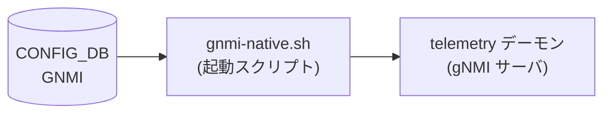

# GNMI テーブル (dial-in サーバ)

## 概要

gNMI dial-in サーバ (`telemetry` デーモン、Docker コンテナ `docker-sonic-gnmi`) のポート・TLS・認証・ログ設定を [CONFIG_DB](../../reference/glossary.md#term-config_db) に保持するテーブル。

起動スクリプト `gnmi-native.sh` が `sonic-cfggen` で `GNMI|gnmi` および `GNMI|certs` を読み出し、CLI フラグとして `telemetry` バイナリ (Go) に渡す。YANG モデル `sonic-gnmi.yang` はスキーマバリデーションを担う。

以前は `TELEMETRY` テーブルに格納されていたが、db_migrator の `migrate_gnmi()` によって `GNMI` テーブルへ移行済み。

<!-- cdb-mermaid -->
### データフロー (自動生成)



!!! note "凡例"
    CONFIG_DB から SAI までの典型経路を `docs/reference/config-db-orch-map.md` から機械生成したミニ図。詳細・例外は本ページ本文と対応表を参照。
<!-- /cdb-mermaid -->

## key 構造

```text
GNMI|gnmi       # サーバ動作設定
GNMI|certs      # TLS 証明書パス
```

## フィールド

### `GNMI|gnmi` サブテーブル

| フィールド | 型 | デフォルト | 説明 |
|-----------|----|-----------|------|
| `port` | uint16 (inet:port-number) | `8080` ※1 | gNMI サーバが listen するポート番号 |
| `client_auth` | boolean | `false` | `true` のとき TLS クライアント証明書を必須化。`false` のとき `--allow_no_client_auth` を付与 |
| `log_level` | uint8 (0–100) | `2` | プロセスログレベル (`-v` フラグ) |
| `threshold` | uint32 | `100` | 同時クライアント接続数上限 |
| `idle_conn_duration` | uint32 | `5` | アイドル接続をクローズするまでの秒数。`0` は無限待ち |
| `save_on_set` | boolean | `false` | Set RPC 成功時に startup config を自動保存 |
| `enable_crl` | boolean | `false` | 証明書失効リスト (CRL) チェックを有効化 |
| `crl_expire_duration` | uint32 | `86400` | CRL キャッシュの有効期間 (秒) |
| `user_auth` | string (`password`/`jwt`/`cert`/`none`) | `cert` ※2 | ユーザ認証方式 |

### `GNMI|certs` サブテーブル

| フィールド | 型 | デフォルト | 説明 |
|-----------|----|-----------|------|
| `ca_crt` | string (パス `.cer`) | — | CA 証明書のローカルパス。クライアント証明書検証に使用 |
| `server_crt` | string (パス `.cer`) | — | TLS サーバ証明書のローカルパス |
| `server_key` | string (パス `.key`) | — | TLS サーバ秘密鍵のローカルパス |

> ※1: `GNMI` テーブルが CONFIG_DB に存在しない場合のシェルスクリプトデフォルト。テーブルが存在する場合は `port` フィールドが必須 (0 以下は起動エラー)。  
> ※2: `user_auth` が CONFIG_DB に存在しない (`null`) 場合、スクリプトが `cert` を補う。

## 制約

- YANG パターン制約: `ca_crt`/`server_crt` は `(/[a-zA-Z0-9_-]+)*/([a-zA-Z0-9_-]+).cer`、`server_key` は同形式で `.key`
- `port` が 0 以下かつ `unix_socket` も未指定の場合、telemetry バイナリが起動エラーで終了
- `user_auth=cert` 時に `ca_crt` が未設定の場合、スクリプトが `cert` 認証モードを自動無効化し `--client_auth` フラグを省く
- `enable_crl=true` は `user_auth=cert` との組み合わせのみで有効 (`gnmi-native.sh` L137)

## 購読者

- `gnmi-native.sh` (起動スクリプト): CONFIG_DB を読み取り、`telemetry` バイナリへ CLI フラグとして渡す。Hot reload なし — 設定変更はコンテナ再起動が必要
- `telemetry` バイナリ (Go): gNMI サーバ本体。起動時にフラグを解析し、証明書変更は `fsnotify` で動的リロード

## 関連 CONFIG_DB / YANG / CLI

- 関連 [CONFIG_DB](../../reference/glossary.md#term-config_db): [`GNMI_CLIENT_CERT`](gnmi-client-cert.md), [`DEVICE_METADATA`](device-metadata.md)
- 関連 CLI: `config gnmi`
- 関連 [YANG](../../reference/glossary.md#term-yang): `sonic-gnmi`

<!-- cdb-exceptions -->
## 例外条件・特殊挙動

| 条件 | 挙動 |
|------|------|
| `GNMI` テーブルが CONFIG_DB に存在しない | `gnmi-native.sh` がデフォルト `PORT=8080`、`threshold=100`、`idle_conn_duration=5` を使用してサーバを起動 |
| `server_crt`/`server_key` が未設定かつ `CERTS`/`X509` エントリが空 | `--noTLS` フラグで起動。本番環境では非推奨 |
| `log_level` が数字以外または 0 未満 | スクリプトが `-v=2` をデフォルト使用。telemetry.go 内では 0 未満の場合 2 に強制 |
| `threshold` が負値 | telemetry.go が起動エラー (`threshold must be >= 0`) |
| `idle_conn_duration` が負値 | telemetry.go が起動エラー (`idle_conn_duration must be >= 0`) |
| `user_auth=cert` かつ `ca_crt` 未設定 | 認証モード `cert` を自動無効化 (silent fallback)。ログに警告を出力 |
| SmartSwitch (`DEVICE_METADATA.subtype=SmartSwitch`) | `gnmi-native.sh` が `-zmq_port=8100` を自動追加 |
| 管理 VRF 有効 (`MGMT_VRF_CONFIG.vrf_global.mgmtVrfEnabled=true`) | `gnmi-native.sh` が `--vrf mgmt` を自動追加 |
| `TELEMETRY` テーブルが残存している場合 | `db_migrator.migrate_gnmi()` が `GNMI` テーブルへ自動移行。両方存在する場合 `GNMI` テーブルが優先 |

<!-- evidence: sonic-net/sonic-buildimage:dockers/docker-sonic-gnmi/gnmi-native.sh:64-147; sonic-net/sonic-gnmi:telemetry/telemetry.go:171-250 -->
<!-- /cdb-exceptions -->

<!-- defaults -->
## 暗黙デフォルト・コード由来挙動 (Phase A)

> 調査対象: `sonic-net/sonic-gnmi/telemetry/telemetry.go`, `sonic-net/sonic-buildimage/dockers/docker-sonic-gnmi/gnmi-native.sh`
> 調査日: 2026-05-14

### `GNMI|gnmi` フィールド

| フィールド | YANG default | シェル fallback | Go フラグ default | 備考 |
|-----------|-------------|----------------|-------------------|------|
| `port` | 未宣言 | `8080`（`GNMI` テーブル欠如時）| `-1`（必須。0 以下は起動エラー）| 実運用値は `50051` または `50052` が標準例 (テスト JSON より) |
| `log_level` | 未宣言 | `2`（非数字時にも fallback）| `2` | 0 未満の場合も Go 実装が `2` に強制 (`telemetry.go:248`) |
| `client_auth` | 未宣言 | `false` → `--allow_no_client_auth` 付与 | `false` | `true` の場合のみ TLS クライアント証明書を強制 |
| `threshold` | 未宣言 | `100`（`null` または `GNMI` 欠如時）| `100` | 負値は Go 起動エラー |
| `idle_conn_duration` | 未宣言 | `5`（秒）（`null` または `GNMI` 欠如時）| `5` | `0` = 無限。負値は Go 起動エラー |
| `save_on_set` | 未宣言 | — (フラグなし = 無効) | `false` | CONFIG_DB から直接読まれず。YANG フィールドは存在するが `gnmi-native.sh` は参照しない ※ |
| `enable_crl` | 未宣言 | `false`（`"true"` 以外は無効）| `false` | `user_auth=cert` 時のみ評価 |
| `crl_expire_duration` | 未宣言 | `null` → Go フラグデフォルト | `86400` (秒 = 24 時間) | フィールド欠如時 Go 実装デフォルトが適用 |
| `user_auth` | 未宣言 | `cert`（`null` 時補完）| AuthTypes 全 false | `none` 設定時は `--client_auth` フラグを省略 |

### `GNMI|certs` フィールド

| フィールド | YANG default | 実装上の fallback | 備考 |
|-----------|-------------|-----------------|------|
| `ca_crt` | 未宣言 | 未設定 → CA 検証なし。`user_auth=cert` モードは自動無効化 | `gnmi-native.sh:41-43` |
| `server_crt` | 未宣言 | 未設定 → `--insecure` フラグで起動（テスト用途限定）| `gnmi-native.sh:35-37` |
| `server_key` | 未宣言 | 同上 | `gnmi-native.sh:35-37` |

### ハードコード固定値

| 定数 | 値 | 適用箇所 |
|------|----|---------|
| `unix_socket` デフォルト | `/var/run/gnmi/gnmi.sock` | TLS なしローカル接続用 Unix ソケット (telemetry.go:175) |
| `jwt_refresh_int` | `900` 秒 | JWT リフレッシュ可能期間 (telemetry.go:183) |
| `jwt_valid_int` | `3600` 秒 | JWT トークン有効期間 (telemetry.go:184) |
| `max_recv_msg_size` | `4 * 1024 * 1024` (4 MiB) | gRPC 受信メッセージ最大サイズ (telemetry.go:209) |
| `max_send_msg_size` | `4 * 1024 * 1024` (4 MiB) | gRPC 送信メッセージ最大サイズ (telemetry.go:210) |
| TLS 最小バージョン | `TLS 1.2` | `tls.VersionTLS12` (telemetry.go:482) |
| keepalive MinTime | `20` 秒 | DPU Proxy 等の keepalive ping 許容間隔 (telemetry.go:547) |

### `save_on_set` の注記

YANG モデル (`sonic-gnmi.yang`) は `save_on_set` フィールドを `boolean` として定義するが、`gnmi-native.sh` 起動スクリプトはこのフィールドを読み取らない。`with-save-on-set` Go フラグは CONFIG_DB から自動設定されず、カスタム起動スクリプトや手動フラグ指定が必要。YANG とシェルスクリプトの間に **dead field** 状態が生じている。

### `user_auth` と translib-write の相関

`telemetry.go:217-229` では、`ENABLE_TRANSLIB_WRITE` が `true` の場合に `client_auth` フラグ未指定時のデフォルトを `password=true, jwt=true` に切り替える。CONFIG_DB の `user_auth` フィールドはシェルスクリプト経由で `--client_auth` フラグに変換されるため、実際の Go 内部デフォルトは `gnmi_translib_write` の状態に依存する。

<!-- evidence: sonic-net/sonic-gnmi:telemetry/telemetry.go:171-328; sonic-net/sonic-buildimage:dockers/docker-sonic-gnmi/gnmi-native.sh:64-150; sonic-net/sonic-buildimage:src/sonic-yang-models/yang-models/sonic-gnmi.yang -->
<!-- /defaults -->

<!-- value-behavior -->
## 値依存挙動マトリクス

### `user_auth` (string enum)

| 値 | 効果 | evidence |
|---|---|---|
| `cert` (default) | `--client_auth cert --config_table_name GNMI_CLIENT_CERT` を付与。CA 証明書が必要。CRL が有効化可能 | `gnmi-native.sh:134-146` |
| `password` | `--client_auth password` を付与。PAM 認証を使用 | `gnmi-native.sh:132` |
| `jwt` | `--client_auth jwt` を付与。JWT トークン認証 | `gnmi-native.sh:132` |
| `none` | `--client_auth` フラグを省略。認証なし (オープンアクセス) | `gnmi-native.sh:131` |

### `client_auth` (boolean)

| 値 | 効果 | evidence |
|---|---|---|
| `false` (default) | `--allow_no_client_auth` フラグを付与。クライアント証明書は任意 | `gnmi-native.sh:77-78` |
| `true` | `--allow_no_client_auth` を省略。TLS クライアント証明書が必須 | `gnmi-native.sh:77` |

### `enable_crl` (boolean)

| 値 | 効果 | evidence |
|---|---|---|
| `false` (default) | CRL チェックなし | `gnmi-native.sh:137-139` |
| `true` | `--enable_crl` フラグを付与。`/mtls/crl` ディレクトリの CRL ファイルを参照 | `gnmi-native.sh:138-139; telemetry.go:203` |

### `save_on_set` (boolean)

| 値 | 効果 | evidence |
|---|---|---|
| `false` (default) | Set RPC 完了後に startup config を保存しない | `telemetry.go:583-585` |
| `true` | `gnmi.SaveOnSetEnabled` を `s.SaveStartupConfig` に設定。Set RPC 成功時に startup config を自動書き込み | `telemetry.go:583-585` |

> **注意**: `save_on_set` は `gnmi-native.sh` から自動読み取りされない。Go フラグ `--with-save-on-set` で手動指定が必要。
<!-- /value-behavior -->

<!-- ref-triangle:start -->

## 関連リファレンス

- [YANG](../../reference/glossary.md#term-yang): [`sonic-gnmi`](../yang/sonic-gnmi.md)
- CONFIG_DB: [`GNMI_CLIENT_CERT`](gnmi-client-cert.md)
- 関連ページ: [gNMI 利用ガイド](../../management/gnmi-usage.md)

<!-- ref-triangle:end -->
