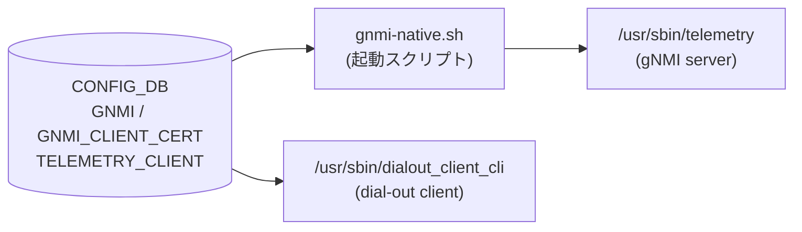

# GNMI / TELEMETRY_CLIENT テーブル

## 概要

SONiC の gNMI サブシステムは **dial-in サーバ** (クライアントからの Subscribe/Get/Set を受け付ける) と **dial-out クライアント** (テレメトリデータを外部コレクターへ push する) の 2 コンポーネントから構成される。いずれも `docker-sonic-gnmi` コンテナ内で動作し、それぞれの設定を [CONFIG_DB](../../reference/glossary.md#term-config_db) から読み出す。

<!-- cdb-mermaid -->
### データフロー (自動生成)



!!! note "凡例"
    CONFIG_DB から SAI までの典型経路を `docs/reference/config-db-orch-map.md` から機械生成したミニ図。詳細・例外は本ページ本文と対応表を参照。
<!-- /cdb-mermaid -->

---

## テーブル: GNMI|certs — TLS 証明書パス

### key 構造

```text
GNMI|certs
```

### フィールド

| フィールド | 型 | デフォルト | 説明 |
|-----------|----|-----------|------|
| `ca_crt` | string (`.cer` パス) | なし (省略可) | CA 証明書のローカルパス。クライアント証明書検証に使用 |
| `server_crt` | string (`.cer` パス) | なし (必須) | サーバ TLS 証明書のパス |
| `server_key` | string (`.key` パス) | なし (必須) | サーバ TLS 秘密鍵のパス |

`server_crt` / `server_key` が未設定かつ `noTLS=false` の場合、`telemetry` プロセスは起動時にエラー終了する[^1]。`ca_crt` は省略可能だが、省略すると `client_auth=cert` モードが無効化される[^2]。

<!-- defaults -->
**コード由来デフォルト**:

- `ca_crt`: デフォルトなし。未設定時、起動スクリプトは `--ca_crt` オプションを渡さない。`telemetry` flag デフォルト: `""` (`telemetry.go:198`)
- `server_crt`: デフォルトなし。未設定時に TLS モードでは起動失敗 (`telemetry.go:253-257`)
- `server_key`: デフォルトなし。未設定時に TLS モードでは起動失敗 (`telemetry.go:255-257`)

**証明書シンボリックリンクのデフォルトパス** (コード由来):

| パラメータ | flag デフォルト |
|-----------|---------------|
| `ca_cert_lnk` | `/keys/ca_cert.lnk` |
| `server_cert_lnk` | `/keys/server_cert.lnk` |
| `server_key_lnk` | `/keys/server_key.lnk` |
<!-- /defaults -->

---

## テーブル: GNMI|gnmi — gNMI サーバ設定

### key 構造

```text
GNMI|gnmi
```

### フィールド

| フィールド | 型 | デフォルト | 説明 |
|-----------|----|-----------|------|
| `port` | uint16 (inet:port-number) | `8080` (GNMI エントリ未設定時) | gNMI サーバ TCP listen ポート |
| `log_level` | uint8 (0–100) | `2` | glog ログレベル (`-v` 値) |
| `client_auth` | boolean | `false` | クライアント証明書を要求するか否か |
| `user_auth` | string (`password`/`jwt`/`cert`/`none`) | `"cert"` (gnmi docker) | 認証モード |
| `threshold` | uint32 | `100` | 同時接続最大数 |
| `idle_conn_duration` | uint32 (秒) | `5` | アイドル接続クローズまでの秒数 (`0` = 無限) |
| `save_on_set` | boolean | `false` | Set RPC 実行時に startup-config を自動保存するか否か |
| `enable_crl` | boolean | `false` | 証明書失効リスト (CRL) チェックを有効化 |
| `crl_expire_duration` | uint32 (秒) | `86400` (24 時間) | CRL キャッシュの有効期間 |

<!-- defaults -->
**コード由来デフォルト詳細** (各フィールドの決定経路):

### `port`
```bash
# gnmi-native.sh:64-72
if [ -z "$GNMI" ]; then
    PORT=8080
else
    PORT=$(extract_field "$GNMI" '.port')
    if ! [[ $PORT =~ ^[0-9]+$ ]]; then
        exit $INCORRECT_TELEMETRY_VALUE
    fi
fi
```
GNMI エントリが存在しない場合のみ `8080`。エントリが存在するが `port` キーが欠けている場合は起動エラー (exit 2)。

### `log_level`
```bash
# gnmi-native.sh:81-86
if [[ $LOG_LEVEL =~ ^[0-9]+$ ]]; then
    TELEMETRY_ARGS+=" -v=$LOG_LEVEL"
else
    TELEMETRY_ARGS+=" -v=2"  # デフォルト
fi
```
flag デフォルト (`telemetry.go:176`): `fs.Int("v", 2, ...)`. 負値の場合もコード側で `2` に補正 (`telemetry.go:247-250`).

### `client_auth`
```bash
# gnmi-native.sh:76-79
if [ -z $CLIENT_AUTH ] || [ $CLIENT_AUTH == "false" ]; then
    TELEMETRY_ARGS+=" --allow_no_client_auth"
fi
```
未設定または `"false"` → `--allow_no_client_auth` 付与 (証明書なしでも接続可)。

### `user_auth`
```bash
# gnmi-native.sh:126-147
if [ $USER_AUTH == "null" ]; then
    USER_AUTH="cert"  # デフォルト
fi
```
未設定 (`null`) の場合 `"cert"` にフォールバック。`cert` モード選択時は `--config_table_name GNMI_CLIENT_CERT` も自動付与。

### `threshold`
flag デフォルト (`telemetry.go:187`): `fs.Int("threshold", 100, ...)`.
スクリプト側も `null` / GNMI エントリ未設定時に `--threshold 100` を付与。

### `idle_conn_duration`
flag デフォルト (`telemetry.go:190`): `fs.Int("idle_conn_duration", 5, ...)`.
スクリプト側も `null` / GNMI エントリ未設定時に `--idle_conn_duration 5` を付与。

### `save_on_set`
```bash
# telemetry.sh:110-113
readonly SAVE_ON_SET=$(echo $GNMI | jq -r '.save_on_set // empty')
if [ ! -z "$SAVE_ON_SET" ]; then
    TELEMETRY_ARGS+=" --with-save-on-set=$SAVE_ON_SET"
fi
```
未設定時 (`empty`) はフラグ非付与 → flag デフォルト `false` (`telemetry.go:189`).

### `enable_crl`
`user_auth == "cert"` ブロック内でのみ評価。`"true"` でない場合 `--enable_crl` フラグは付与されない。
flag デフォルト (`telemetry.go:193`): `false`.

### `crl_expire_duration`
未設定時はフラグ非付与 → flag デフォルト `86400` 秒 (`telemetry.go:194`).
<!-- /defaults -->

---

## テーブル: GNMI_CLIENT_CERT — クライアント証明書認可マッピング

### key 構造

```text
GNMI_CLIENT_CERT|<cert_cname>
```

`<cert_cname>` はクライアント証明書の CommonName (CN)。

### フィールド

| フィールド | 型 | 説明 |
|-----------|----|------|
| `role` | list\<string\> | このクライアントに付与するロール (`readwrite` / `readonly` / `noaccess`) |

`user_auth=cert` 時、`clientCertAuth.go` の `PopulateAuthStructByCommonName()` が証明書 CN をキーにこのテーブルを参照してロールを決定する[^3]。

<!-- defaults -->
**コード由来デフォルト**: エントリが存在しない場合、認証は通過するが `role` が空 → `ReadOnlyMode` として扱われる (アクセス制限は実装依存)。
<!-- /defaults -->

---

## テーブル: TELEMETRY_CLIENT — Dial-out テレメトリクライアント設定

Dial-out (push 型) テレメトリの設定。CONFIG_DB キースペース通知 (`__keyspace@*__:TELEMETRY_CLIENT*`) を監視してリアルタイムに設定変更を反映する。

### key 構造

```text
TELEMETRY_CLIENT|Global
TELEMETRY_CLIENT|DestinationGroup_<name>
TELEMETRY_CLIENT|Subscription_<name>
```

### TELEMETRY_CLIENT|Global

| フィールド | 型 | デフォルト | 説明 |
|-----------|----|-----------|------|
| `src_ip` | IP address | `""` (空文字列) | 送信元 IP アドレス |
| `retry_interval` | uint32 (秒) | `30` | 接続再試行間隔 |
| `encoding` | string | `JSON_IETF` (固定) | エンコーディング (現在変更不可) |
| `unidirectional` | boolean | `true` (固定) | サーバ応答なし一方向モード (現在変更不可) |

<!-- defaults -->
**コード由来デフォルト**:
```go
// dialout_client.go:19-25
clientCfg = dc.ClientConfig{
    SrcIp:          "",
    RetryInterval:  30 * time.Second,
    Encoding:       gpb.Encoding_JSON_IETF,
    Unidirectional: true,
}
```
`encoding` と `unidirectional` は DB から読んでも強制上書きされる (`dialout_client.go:501-505`)。
<!-- /defaults -->

### TELEMETRY_CLIENT|DestinationGroup_\<name\>

| フィールド | 型 | 説明 |
|-----------|----|------|
| `dst_addr` | string (`IP:PORT,...`) | 送信先アドレス一覧 (カンマ区切り) |

### TELEMETRY_CLIENT|Subscription_\<name\>

| フィールド | 型 | デフォルト | 説明 |
|-----------|----|-----------|------|
| `dst_group` | string | なし (必須) | 参照する DestinationGroup 名 |
| `report_type` | string (`periodic`/`stream`/`once`) | `stream` | レポート種別 |
| `report_interval` | uint32 (ミリ秒) | `5000` | 定期レポート間隔 (`periodic` モード時) |
| `path_target` | string | なし (省略可) | gNMI パスターゲット DB 名 |
| `paths` | string (カンマ区切り) | なし (省略可) | サブスクライブするパスリスト |

<!-- defaults -->
**コード由来デフォルト**:
```go
// dialout_client.go:581-582
cs := clientSubscription{
    interval: 5000, // default to 5000 milliseconds
    name:     name,
}
```
`dst_group` が空の場合、クライアントは起動しない (silent no-op, `dialout_client.go:622-625`)。
<!-- /defaults -->

---

## VRF / SmartSwitch 自動連携

gnmi-native.sh は [CONFIG_DB](../../reference/glossary.md#term-config_db) から直接 VRF / SmartSwitch 情報を取得し、起動引数に自動付与する。GNMI テーブルに設定フィールドは存在しない。

| 条件 | 付与されるフラグ |
|------|----------------|
| `DEVICE_METADATA\|localhost.subtype == "SmartSwitch"` | `--zmq_port 8100` |
| `MGMT_VRF_CONFIG\|vrf_global.mgmtVrfEnabled == "true"` | `--vrf mgmt` |

---

## 制約

- `port` は YANG 型 `inet:port-number` (1–65535)
- `log_level` は YANG 型 `uint8` (0–100)
- `user_auth` は YANG pattern `password|jwt|cert|none` に限定
- `ca_crt` / `server_crt` の YANG pattern: `(/[a-zA-Z0-9_-]+)*/([a-zA-Z0-9_-]+).cer`
- `server_key` の YANG pattern: `(/[a-zA-Z0-9_-]+)*/([a-zA-Z0-9_-]+).key`

---

## 購読者

- `gnmi-native.sh` → `/usr/sbin/telemetry` (`docker-sonic-gnmi`): gNMI server (dial-in)
- `dialout_client_cli` (`docker-sonic-gnmi`): dial-out クライアント、`TELEMETRY_CLIENT` をキースペース通知で監視

---

## 関連 CONFIG_DB / YANG / CLI

- 関連 [CONFIG_DB](../../reference/glossary.md#term-config_db): [`DEVICE_METADATA`](device-metadata.md), [`MGMT_VRF_CONFIG`](mgmt-vrf-config.md)
- 関連 [YANG](../../reference/glossary.md#term-yang): `sonic-gnmi`
- 関連 CLI: `config gnmi`

---

<!-- ordering -->
## 書込み順依存 (Phase B)

gNMI サブシステムの CONFIG_DB 参照は **起動時スナップショット** (dial-in サーバ) と **keyspace notification 購読** (dial-out クライアント) の 2 モデルに分かれる。それぞれに書込み順依存がある。

### 検出された順序依存

| # | 依存関係 | 方向 | 緩和策 |
|---|----------|------|--------|
| 1 | `GNMI\|certs` (`server_crt`, `server_key`) → `GNMI\|gnmi` → コンテナ起動 | **強制先行** (TLS モード) | 起動時のみ。両エントリ揃えてからコンテナ起動すること |
| 2 | `DEVICE_METADATA\|localhost` / `MGMT_VRF_CONFIG\|vrf_global` → gnmi コンテナ起動 | 強制先行 | 通常は初期プロビジョニング時に設定済み |
| 3 | `TELEMETRY_CLIENT\|DestinationGroup_<n>` → `TELEMETRY_CLIENT\|Subscription_<n>` | **先行推奨** (silent no-op 回避) | ランタイム。逆順でも DB エラーにならないが送信が開始されない。DestGroup 追加後は自動回復 |
| 4 | `TELEMETRY_CLIENT\|Global` → `DestinationGroup_*` → `Subscription_*` | 推奨 (接続フラップ回避) | ランタイム。Global 後追い更新時は全接続が一時切断→再接続 |

### 主要な制約詳細

**TLS 証明書先行必須 (依存 #1)**: `gnmi-native.sh` は起動時に 1 回だけ `sonic-cfggen -d -t telemetry_vars.j2` で CONFIG_DB をスナップショット読み取りし、`telemetry` プロセスを `exec` で起動する。その後は CONFIG_DB を監視しないため、設定変更の反映にはコンテナ再起動が必要。TLS モード (`noTLS=false` かつ `--insecure` 未使用) では、`GNMI|certs` に `server_crt` / `server_key` が存在しない状態でコンテナを起動すると `telemetry.go:252-258` でエラー終了する。`GNMI|certs` を書いてから `GNMI|gnmi` を書き、コンテナを起動すること（evidence: `gnmi-native.sh:32-61`, `telemetry.go:252-258`）。

**DestinationGroup → Subscription の順序 (依存 #3)**: `processTelemetryClientConfig()` は Subscription エントリ処理時に `cs.destGroupName == ""` チェックを行い、`dst_group` 未設定の場合は silent no-op で返る。`dst_group` が設定されていても参照先 `DestinationGroup_<n>` が `destGrpNameMap` に未登録の場合は `DestGrp2ClientSubMap[cs.destGroupName]` が空のままとなり、接続インスタンスが生成されない。後から `DestinationGroup_<n>` が keyspace 通知で到着すると `setupDestGroupClients()` が呼ばれ自動回復するが、その間テレメトリ送信は発生しない（evidence: `dialout_client.go:622-625`, `dialout_client.go:514-543`）。

**Global 後追い更新による全接続フラップ (依存 #4)**: `processTelemetryClientConfig()` の `Global` 処理では `clientCfg` を更新した後、全 DestinationGroup に対して `closeDestGroupClient(grpName)` → `setupDestGroupClients(ctx, grpName)` を実行する。`Global` エントリを DestGroup / Subscription より後に書くと、既存接続が全て一時切断・再接続される（evidence: `dialout_client.go:507-513`）。

詳細根拠は `meta/_intermediate/cdb-flow/gnmi-server-ordering.md` を参照。
<!-- /ordering -->

<!-- cross-refs -->
## 暗黙参照テーブル (Phase C)

gNMI サブシステムは CONFIG_DB テーブルのうち GNMI / GNMI_CLIENT_CERT / TELEMETRY_CLIENT 以外のテーブルも起動時またはランタイムに参照する。以下に列挙する。

| 参照先テーブル / フィールド | 参照元コンポーネント | 参照タイミング | 参照条件 | evidence |
|--------------------------|-------------------|--------------|---------|---------|
| `DEVICE_METADATA\|x509` (`server_crt`, `server_key`, `ca_crt`) | `telemetry_vars.j2` → `gnmi-native.sh` | コンテナ起動時 1 回 | `GNMI\|certs` が未設定の場合のレガシーフォールバック。`DEVICE_METADATA\|x509` も未設定の場合は `--noTLS` フラグ付与 | `telemetry_vars.j2:4`, `gnmi-native.sh:46-60` |
| `DEVICE_METADATA\|localhost.subtype` | `gnmi-native.sh` | コンテナ起動時 1 回 | 常時評価。値が `"SmartSwitch"` の場合 `-zmq_port=8100` を付与 | `gnmi-native.sh:89-92` |
| `MGMT_VRF_CONFIG\|vrf_global.mgmtVrfEnabled` | `gnmi-native.sh` | コンテナ起動時 1 回 | 常時評価。値が `"true"` の場合 `--vrf mgmt` を付与してサーバを mgmt VRF にバインド | `gnmi-native.sh:95-98` |
| `GNMI_CLIENT_CERT\|<cert_cname>` (`role`) | `gnmi_server/clientCertAuth.go:PopulateAuthStructByCommonName()` | 接続認証ごと (ランタイム) | `user_auth == "cert"` 時のみ。クライアント証明書 CN をキーに ConfigDB をリアルタイムルックアップ | `clientCertAuth.go:254-283` |

### 参照詳細

**`DEVICE_METADATA|x509` レガシーフォールバック (参照 #1)**:
`telemetry_vars.j2` は `sonic-cfggen -d` で CONFIG_DB をスナップショット取得し、`GNMI` (= `GNMI|certs`) が存在しない場合に `DEVICE_METADATA["x509"]` の `server_crt` / `server_key` / `ca_crt` を TLS 証明書ソースとして使用する。これは `docker-sonic-telemetry` 時代のレガシー経路であり、`GNMI|certs` を使用する新設構成では `DEVICE_METADATA|x509` は参照されない (evidence: `telemetry_vars.j2:2-5`, `gnmi-native.sh:32-61`)。

**`DEVICE_METADATA|localhost.subtype` (参照 #2) / `MGMT_VRF_CONFIG|vrf_global.mgmtVrfEnabled` (参照 #3)**:
これら 2 つのフィールドは GNMI テーブルに対応するフィールドを持たず、スクリプトが `sonic-db-cli CONFIG_DB hget` で直接取得する。どちらもコンテナ起動時 1 回の読み取りであり、設定変更の反映にはコンテナ再起動が必要。詳細は [VRF / SmartSwitch 自動連携](#vrf--smartswitch-自動連携) を参照。

**`GNMI_CLIENT_CERT|<cert_cname>` (参照 #4)**:
`PopulateAuthStructByCommonName()` (`clientCertAuth.go:254`) は毎接続の認証インターセプター内から呼ばれ、`swsscommon.ConfigDBConnector.Get_entry(serviceConfigTableName, certCommonName)` で `GNMI_CLIENT_CERT|<cert_cname>` エントリを読み取る。`GNMI_CLIENT_CERT` は GNMI テーブルと同一ページに収録されているが、参照方向（認証ランタイム → ConfigDB）を明示するため暗黙参照として列挙する。エントリが存在しない場合は `Unauthenticated` エラーが返る (evidence: `clientCertAuth.go:273-283`)。

!!! note "書き手は存在しない"
    gNMI サーバは CONFIG_DB の**消費者専用**であり、これらのテーブルへの書き込みは行わない。副次 DB 書込 (Phase F) は該当なし。

詳細根拠は `meta/_intermediate/cdb-flow/gnmi-server-cross-refs.md` を参照。
<!-- /cross-refs -->

<!-- failure -->
## 失敗挙動マトリクス (Phase D)

ソース: `sonic-net/sonic-buildimage/dockers/docker-sonic-gnmi/gnmi-native.sh`, `sonic-net/sonic-gnmi/telemetry/telemetry.go`

### 起動時失敗経路 (gnmi-native.sh)

| 失敗条件 | 検出箇所 | 結果 | ログ出力 | evidence |
|---|---|---|---|---|
| `TELEMETRY_VARS_FILE` (`telemetry_vars.j2`) が存在しない | `gnmi-native.sh:12-15` | `exit 1` (EXIT_TELEMETRY_VARS_FILE_NOT_FOUND) — コンテナ起動失敗 | stderr: "Telemetry vars template file not found" | `gnmi-native.sh:12-15` |
| `GNMI\|gnmi.port` が空または非数値 (`^[0-9]+$` 不一致) | `gnmi-native.sh:68-71` | `exit 2` (INCORRECT_TELEMETRY_VALUE) — コンテナ起動失敗 | stderr: "Incorrect port value ${PORT}, expecting positive integers" | `gnmi-native.sh:68-71` |
| `GNMI\|gnmi.threshold` が空または非数値かつ GNMI エントリ存在 | `gnmi-native.sh:107-110` | `exit 2` — コンテナ起動失敗 | stderr: "Incorrect threshold value, expecting positive integers" | `gnmi-native.sh:107-110` |
| `GNMI\|gnmi.idle_conn_duration` が空または非数値かつ GNMI エントリ存在 | `gnmi-native.sh:120-123` | `exit 2` — コンテナ起動失敗 | stderr: "Incorrect idle_conn_duration value, expecting positive integers" | `gnmi-native.sh:120-123` |
| `GNMI\|certs` の `server_crt` または `server_key` が空 (TLS モード) | `gnmi-native.sh:35-39` | `--insecure` フラグを付与して起動 (TLS 無効化フォールバック) | なし | `gnmi-native.sh:35-39` |
| `GNMI\|certs` も `DEVICE_METADATA\|x509` も未設定 | `gnmi-native.sh:60-61` | `--noTLS` フラグを付与して起動 | なし | `gnmi-native.sh:60-61` |

### telemetry プロセス起動時失敗経路

| 失敗条件 | 検出箇所 | 結果 | ログ出力 | evidence |
|---|---|---|---|---|
| `--server_crt` / `--server_key` 指定ファイルが存在しない | `telemetry.go:252-258` | `log.Fatal` — プロセス終了 | "Failed to get TLS credentials" | `telemetry.go:252-258` |
| `--ca_crt` 指定ファイルが存在しない (TLS モード) | `telemetry.go:318-320` | `log.Fatal` — プロセス終了 | CA 読み込みエラーメッセージ | `telemetry.go:318-320` |

### dial-out クライアント失敗経路

| 失敗条件 | 検出箇所 | 結果 | ログ出力 | evidence |
|---|---|---|---|---|
| `TELEMETRY_CLIENT\|Subscription_*` の `dst_group` が空 | `dialout_client.go:622-625` | silent no-op — クライアントインスタンス未生成 | なし | `dialout_client.go:622-625` |
| `dst_group` 参照先の `DestinationGroup_*` が未登録 | `dialout_client.go:514-543` | クライアントインスタンス未生成。後で DestGroup 追加時に自動回復 | なし | `dialout_client.go:514-543` |
| 接続先コレクターへの dial-out 接続失敗 | `dialout_client.go` retry ループ | バックオフ再試行 — 接続確立まで継続 | gRPC エラーログ | `dialout_client.go` |

<!-- /failure -->

<!-- constants -->
## ハードコード定数 (Phase E)

`GNMI` / `GNMI_CLIENT_CERT` / `TELEMETRY_CLIENT` テーブルおよび関連デーモン内に存在する、CONFIG_DB / YANG で管理されないハードコード定数の一覧。出典は `sonic-net/sonic-gnmi/telemetry/telemetry.go` と `dockers/docker-sonic-gnmi/gnmi-native.sh`。

### Unix ソケット・JWT 認証インターバル

| 定数 | 値 | 用途 | ソース |
|------|----|------|--------|
| `unix_socket` デフォルト | `/var/run/gnmi/gnmi.sock` | ローカル TLS なし接続パス。CONFIG_DB 対応フィールドなし | `telemetry.go:175` |
| `jwt_refresh_int` | `900` 秒 (15 分) | JWT トークンをリフレッシュ可能になる期限前秒数。CONFIG_DB 対応フィールドなし | `telemetry.go:183` |
| `jwt_valid_int` | `3600` 秒 (1 時間) | JWT トークン有効期間。CONFIG_DB 対応フィールドなし | `telemetry.go:184` |

### 証明書・CRL・gNOI 固定パス

| 定数 | 値 | 用途 | ソース |
|------|----|------|--------|
| `ca_cert_lnk` | `/keys/ca_cert.lnk` | CA 証明書シンボリックリンク生成先 (`GNMI\|certs.ca_crt` 設定時は同ディレクトリに変更) | `telemetry.go:199` |
| `server_cert_lnk` | `/keys/server_cert.lnk` | サーバ証明書シンボリックリンク生成先 | `telemetry.go:200` |
| `server_key_lnk` | `/keys/server_key.lnk` | サーバ秘密鍵シンボリックリンク生成先 | `telemetry.go:201` |
| `img_dir` | `/tmp/host_tmp` | gNOI ファイル転送先一時ディレクトリ (tmpfs 上; コンテナ再起動で消去) | `telemetry.go:195` |
| `cert_crl_dir` | `/mtls/crl` | CRL ファイル格納ディレクトリ | `telemetry.go:203` |
| `grpc_meta` | `/keys/grpc-version.json` | gRPC 証明書メタデータ JSON | `telemetry.go:204` |
| `authz_meta` | `/keys/authz-version.json` | authz ポリシーメタデータ JSON | `telemetry.go:205` |
| `authorization_policy_file` | `/keys/authorization_policy.json` | authz ポリシー JSON (`authz_policy_enabled=true` 時参照) | `telemetry.go:207` |

### gRPC メッセージサイズ上限

| 定数 | 値 | 用途 | ソース |
|------|----|------|--------|
| `max_recv_msg_size` | `4 MiB` (4,194,304 B) | サーバ受信最大メッセージサイズ。CONFIG_DB 対応フィールドなし | `telemetry.go:209` |
| `max_send_msg_size` | `4 MiB` (4,194,304 B) | サーバ送信最大メッセージサイズ。CONFIG_DB 対応フィールドなし | `telemetry.go:210` |

> **運用注意**: ポート数の多いスイッチで Subscribe レスポンスが 4 MiB を超える場合、gRPC レベルのエラーが発生する。CONFIG_DB では変更不可。

### gnmi-native.sh 固定環境変数・終了コード

| 定数 | 値 | 用途 | ソース |
|------|----|------|--------|
| `EXIT_TELEMETRY_VARS_FILE_NOT_FOUND` | `1` | テンプレートファイル (`telemetry_vars.j2`) 未存在時の終了コード | `gnmi-native.sh:3` |
| `INCORRECT_TELEMETRY_VALUE` | `2` | `port` / `threshold` / `idle_conn_duration` 値不正時の終了コード | `gnmi-native.sh:4` |
| `TELEMETRY_VARS_FILE` | `/usr/share/sonic/templates/telemetry_vars.j2` | CONFIG_DB → CLI フラグ変換テンプレートパス | `gnmi-native.sh:5` |
| `GRPC_GO_LOG_VERBOSITY_LEVEL` | `99` | gRPC Go ライブラリ内部ログ冗長レベル (最大値 = 全量出力) | `gnmi-native.sh:26` |
| `GRPC_GO_LOG_SEVERITY_LEVEL` | `info` | gRPC Go ライブラリ内部ログ severity フィルタ | `gnmi-native.sh:27` |
| `CVL_SCHEMA_PATH` | `/usr/sbin/schema` | CVL スキーマディレクトリパス | `gnmi-native.sh:30` |
| SmartSwitch ZMQ ポート | `8100` | `subtype == "SmartSwitch"` 時に付与する `-zmq_port` 値。`GNMI` テーブルに対応フィールドなし | `gnmi-native.sh:91` |

> **注意**: `GRPC_GO_LOG_VERBOSITY_LEVEL=99` は gRPC ライブラリ内部ログを全量出力する。`GNMI|gnmi.log_level` が制御するのは `telemetry` の glog レベルのみであり、gRPC ライブラリログとは独立している。

### ビルドタグ定数

| 定数 | デフォルト値 | ビルドタグ | ソース |
|------|------------|----------|--------|
| `ENABLE_NATIVE_WRITE` | `false` | ビルドタグ `gnmi_native_write` 未指定時 | `constants_native.go:5` |
| `ENABLE_TRANSLIB_WRITE` | `false` | ビルドタグ `gnmi_translib_write` 未指定時 | `constants_translib.go:5` |

管理フレームワーク統合ビルド (`gnmi_translib_write` タグ付き) では `ENABLE_TRANSLIB_WRITE = true` となり、デフォルト `user_auth` が `password+jwt` に変わる (`telemetry.go:217-222`)。コミュニティ版標準SONiC ビルドでは常に `false`。

### dial-out クライアント固定デフォルト

| 定数 | 値 | 用途 | ソース |
|------|----|------|--------|
| `RetryInterval` | `30` 秒 | 接続再試行間隔初期値 | `dialout_client_cli.go:21,31` |
| `Encoding` | `JSON_IETF` (固定) | エンコーディング。DB から変更不可 (`dialout_client.go:502` で強制上書き) | `dialout_client_cli.go:22` |
| `Unidirectional` | `true` (固定) | サーバ応答なし一方向モード。DB から変更不可 (`dialout_client.go:505` で強制上書き) | `dialout_client_cli.go:23,32` |

詳細な定数一覧 (JWT 変数宣言箇所、ビルドタグ _write バリアント等) は `meta/_intermediate/cdb-flow/gnmi-server-constants.md` を参照。
<!-- /constants -->

<!-- pubsub -->
## 通信メカニズム (Phase G)

gNMI サブシステムは **3 種類の異なる購読モデル**を使い分けている。

### Redis 購読方式一覧

| テーブル | 方向 | API / 方式 | 購読者 | タイミング |
|---------|------|-----------|--------|----------|
| `GNMI\|certs` / `GNMI\|gnmi` | CONFIG_DB → デーモン (読み取り) | `sonic-cfggen` 一括スナップショット | `gnmi-native.sh` | コンテナ起動時 1 回のみ |
| `DEVICE_METADATA\|localhost` / `MGMT_VRF_CONFIG\|vrf_global` | CONFIG_DB → デーモン (読み取り) | `sonic-db-cli hget` 直接呼び出し | `gnmi-native.sh` | コンテナ起動時 1 回のみ |
| `GNMI_CLIENT_CERT\|<cert_cname>` | CONFIG_DB → デーモン (読み取り) | swsscommon `ConfigDBConnector.Get_entry()` one-shot | `telemetry` 認証インターセプター | 接続認証ごと (ランタイム) |
| `TELEMETRY_CLIENT\|*` | CONFIG_DB → デーモン (読み取り) | `go-redis PSUBSCRIBE` keyspace 通知 | `dialout_client_cli` | 起動時スキャン + ランタイム追従 |
| `STATE_DB:TELEMETRY_CONNECTIONS` | デーモン → STATE_DB (書き込み) | `go-redis HSet/HDel` 直接書き込み | `telemetry` (connection_manager) | Subscribe RPC 接続/切断ごと |

### (1) GNMI|certs / GNMI|gnmi — 起動時スナップショット (購読なし)

`gnmi-native.sh` は起動時に `sonic-cfggen -d -t telemetry_vars.j2` で CONFIG_DB を**一度だけ**スナップショット読み取りする。読み取り後に `exec /usr/sbin/telemetry ${TELEMETRY_ARGS}` でプロセスを置き換える (`gnmi-native.sh:19,150`)。`telemetry` プロセス起動後は CONFIG_DB の変更を一切監視しない。`GNMI|certs` / `GNMI|gnmi` フィールドの変更を反映させるにはコンテナ再起動 (`docker restart docker-sonic-gnmi`) が必要。`swsscommon.SubscriberStateTable` / `ConsumerStateTable` は**使用しない**。

### (2) GNMI_CLIENT_CERT — 認証ごとの one-shot ルックアップ (購読なし)

`telemetry` gRPC 認証インターセプターが毎接続 `PopulateAuthStructByCommonName()` を呼び出す。内部で `swsscommon.NewConfigDBConnector()` を生成し `Connect(false)` → `Get_entry(serviceConfigTableName, certCommonName)` で `GNMI_CLIENT_CERT|<cert_cname>` を読む。取得後にコネクタを即破棄 (`DeleteConfigDBConnector_Native`)。Redis Subscribe / PSubscribe は**使用しない**。`GNMI_CLIENT_CERT` エントリの変更は次回接続認証から即時有効になる（コンテナ再起動不要）（evidence: `clientCertAuth.go:259-284`）。

### (3) TELEMETRY_CLIENT — go-redis PSUBSCRIBE keyspace 通知

`dialout_client_cli` の `watchConfig()` (`dialout_client.go:648-746`) が CONFIG_DB に対して以下のパターンで Redis keyspace 通知を購読する。

```
PSUBSCRIBE "__keyspace@<dbId>__:TELEMETRY_CLIENT|*"
```

swsscommon の `SubscriberStateTable` / `ConsumerStateTable` は**使用しない**。`go-redis` v9 を直接使用。

起動時に `KEYS "TELEMETRY_CLIENT|*"` で既存エントリをスキャンして初期適用する。ランタイムは `ReceiveTimeout(ctx, 1000ms)` ポーリングで通知を受信し、payload が `hset` → SET ハンドラ、`del`/`hdel` → DEL ハンドラへ振り分ける。CONFIG_DB は永続前提のため TTL は設定されない（evidence: `dialout_client.go:682-746`）。

```
keyspace 通知フロー:
  config telemetry destination-group <name> ...
    ↓ HSET "TELEMETRY_CLIENT|DestinationGroup_<name>" ...
  Redis PUBLISH "__keyspace@<dbId>__:TELEMETRY_CLIENT|DestinationGroup_<name>"  "hset"
    ↓ dialout_client watchConfig() ReceiveTimeout
  processTelemetryClientConfig(ctx, redisDb, "DestinationGroup_<name>", "hset")
    ↓ setupDestGroupClients() — 送信先コレクターへ接続
```

### (4) STATE_DB:TELEMETRY_CONNECTIONS — デーモン側の副次書込

`gnmi_server/connection_manager.go` は Subscribe RPC 接続確立時に STATE_DB ハッシュ `TELEMETRY_CONNECTIONS` へ接続キーを書き込み、切断時に削除する。

```go
// connection_manager.go:16,116,127
const table = "TELEMETRY_CONNECTIONS"
rclient.HSet(ctx, table, key, "active")  // 接続時
rclient.HDel(ctx, table, key)             // 切断時
```

- 接続先: STATE_DB (`GetDbTcpAddr("STATE_DB", ns)` で TCP 接続。`connection_manager.go:34,39`)
- swsscommon 非経由。`go-redis` 直接使用
- TTL なし。サーバ起動時に全エントリを一括削除 (`HGETALL` → `HDel` ループ) して初期化する (`connection_manager.go:52-59`)
- `TELEMETRY_CONNECTIONS` は monitoring ツール（外部監視）向け。CONFIG_DB の `GNMI` / `TELEMETRY_CLIENT` テーブルを変更しても `TELEMETRY_CONNECTIONS` は影響を受けない

詳細根拠は `meta/_intermediate/cdb-flow/gnmi-server-pubsub.md` を参照。
<!-- /pubsub -->

<!-- cdb-exceptions -->
## 例外条件・特殊挙動

| 条件 | 挙動 |
|------|------|
| GNMI エントリ未設定かつ `port` 未指定 | `port=8080` でサーバ起動 |
| GNMI エントリ存在するが `port` キー欠落 | 起動スクリプトが exit 2 で異常終了 |
| `server_crt` / `server_key` 未設定 (TLS モード) | `telemetry` プロセスがエラー終了 |
| `ca_crt` 未設定かつ `user_auth=cert` | `cert` モードが自動無効化 (`allow_no_client_auth` 付与) |
| `user_auth` 未設定 (`null`) | gnmi docker では `"cert"` にフォールバック |
| `log_level` が負値 | コード側で `2` に補正 |
| `idle_conn_duration=0` | 無限待機 (接続を閉じない) |
| `encoding` を DB で変更 | 読み取られるが `JSON_IETF` に強制上書き |
| `unidirectional` を DB で変更 | 読み取られるが `true` に強制上書き |
| `Subscription_*` で `dst_group` 未設定 | クライアント起動せず silent no-op |
<!-- /cdb-exceptions -->

[^1]: `sonic-gnmi/telemetry/telemetry.go:252-258` (sha: eb635b76)
[^2]: `sonic-gnmi/telemetry/telemetry.go:318-320` (sha: eb635b76)
[^3]: `sonic-gnmi/gnmi_server/clientCertAuth.go:254-263` (sha: eb635b76)
