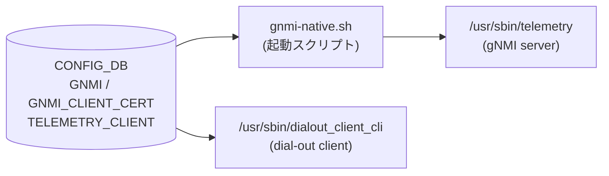

# GNMI / TELEMETRY_CLIENT テーブル

## 概要

SONiC の gNMI サブシステムは **dial-in サーバ** (クライアントからの Subscribe/Get/Set を受け付ける) と **dial-out クライアント** (テレメトリデータを外部コレクターへ push する) の 2 コンポーネントから構成される。いずれも `docker-sonic-gnmi` コンテナ内で動作し、それぞれの設定を [CONFIG_DB](../../reference/glossary.md#term-config_db) から読み出す。

<!-- cdb-mermaid -->
### データフロー (自動生成)



!!! note "凡例"
    CONFIG_DB から SAI までの典型経路を `docs/reference/config-db-orch-map.md` から機械生成したミニ図。詳細・例外は本ページ本文と対応表を参照。
<!-- /cdb-mermaid -->

---

## テーブル: GNMI|certs — TLS 証明書パス

### key 構造

```text
GNMI|certs
```

### フィールド

| フィールド | 型 | デフォルト | 説明 |
|-----------|----|-----------|------|
| `ca_crt` | string (`.cer` パス) | なし (省略可) | CA 証明書のローカルパス。クライアント証明書検証に使用 |
| `server_crt` | string (`.cer` パス) | なし (必須) | サーバ TLS 証明書のパス |
| `server_key` | string (`.key` パス) | なし (必須) | サーバ TLS 秘密鍵のパス |

`server_crt` / `server_key` が未設定かつ `noTLS=false` の場合、`telemetry` プロセスは起動時にエラー終了する[^1]。`ca_crt` は省略可能だが、省略すると `client_auth=cert` モードが無効化される[^2]。

<!-- defaults -->
**コード由来デフォルト**:

- `ca_crt`: デフォルトなし。未設定時、起動スクリプトは `--ca_crt` オプションを渡さない。`telemetry` flag デフォルト: `""` (`telemetry.go:198`)
- `server_crt`: デフォルトなし。未設定時に TLS モードでは起動失敗 (`telemetry.go:253-257`)
- `server_key`: デフォルトなし。未設定時に TLS モードでは起動失敗 (`telemetry.go:255-257`)

**証明書シンボリックリンクのデフォルトパス** (コード由来):

| パラメータ | flag デフォルト |
|-----------|---------------|
| `ca_cert_lnk` | `/keys/ca_cert.lnk` |
| `server_cert_lnk` | `/keys/server_cert.lnk` |
| `server_key_lnk` | `/keys/server_key.lnk` |
<!-- /defaults -->

---

## テーブル: GNMI|gnmi — gNMI サーバ設定

### key 構造

```text
GNMI|gnmi
```

### フィールド

| フィールド | 型 | デフォルト | 説明 |
|-----------|----|-----------|------|
| `port` | uint16 (inet:port-number) | `8080` (GNMI エントリ未設定時) | gNMI サーバ TCP listen ポート |
| `log_level` | uint8 (0–100) | `2` | glog ログレベル (`-v` 値) |
| `client_auth` | boolean | `false` | クライアント証明書を要求するか否か |
| `user_auth` | string (`password`/`jwt`/`cert`/`none`) | `"cert"` (gnmi docker) | 認証モード |
| `threshold` | uint32 | `100` | 同時接続最大数 |
| `idle_conn_duration` | uint32 (秒) | `5` | アイドル接続クローズまでの秒数 (`0` = 無限) |
| `save_on_set` | boolean | `false` | Set RPC 実行時に startup-config を自動保存するか否か |
| `enable_crl` | boolean | `false` | 証明書失効リスト (CRL) チェックを有効化 |
| `crl_expire_duration` | uint32 (秒) | `86400` (24 時間) | CRL キャッシュの有効期間 |

<!-- defaults -->
**コード由来デフォルト詳細** (各フィールドの決定経路):

### `port`
```bash
# gnmi-native.sh:64-72
if [ -z "$GNMI" ]; then
    PORT=8080
else
    PORT=$(extract_field "$GNMI" '.port')
    if ! [[ $PORT =~ ^[0-9]+$ ]]; then
        exit $INCORRECT_TELEMETRY_VALUE
    fi
fi
```
GNMI エントリが存在しない場合のみ `8080`。エントリが存在するが `port` キーが欠けている場合は起動エラー (exit 2)。

### `log_level`
```bash
# gnmi-native.sh:81-86
if [[ $LOG_LEVEL =~ ^[0-9]+$ ]]; then
    TELEMETRY_ARGS+=" -v=$LOG_LEVEL"
else
    TELEMETRY_ARGS+=" -v=2"  # デフォルト
fi
```
flag デフォルト (`telemetry.go:176`): `fs.Int("v", 2, ...)`. 負値の場合もコード側で `2` に補正 (`telemetry.go:247-250`).

### `client_auth`
```bash
# gnmi-native.sh:76-79
if [ -z $CLIENT_AUTH ] || [ $CLIENT_AUTH == "false" ]; then
    TELEMETRY_ARGS+=" --allow_no_client_auth"
fi
```
未設定または `"false"` → `--allow_no_client_auth` 付与 (証明書なしでも接続可)。

### `user_auth`
```bash
# gnmi-native.sh:126-147
if [ $USER_AUTH == "null" ]; then
    USER_AUTH="cert"  # デフォルト
fi
```
未設定 (`null`) の場合 `"cert"` にフォールバック。`cert` モード選択時は `--config_table_name GNMI_CLIENT_CERT` も自動付与。

### `threshold`
flag デフォルト (`telemetry.go:187`): `fs.Int("threshold", 100, ...)`.
スクリプト側も `null` / GNMI エントリ未設定時に `--threshold 100` を付与。

### `idle_conn_duration`
flag デフォルト (`telemetry.go:190`): `fs.Int("idle_conn_duration", 5, ...)`.
スクリプト側も `null` / GNMI エントリ未設定時に `--idle_conn_duration 5` を付与。

### `save_on_set`
```bash
# telemetry.sh:110-113
readonly SAVE_ON_SET=$(echo $GNMI | jq -r '.save_on_set // empty')
if [ ! -z "$SAVE_ON_SET" ]; then
    TELEMETRY_ARGS+=" --with-save-on-set=$SAVE_ON_SET"
fi
```
未設定時 (`empty`) はフラグ非付与 → flag デフォルト `false` (`telemetry.go:189`).

### `enable_crl`
`user_auth == "cert"` ブロック内でのみ評価。`"true"` でない場合 `--enable_crl` フラグは付与されない。
flag デフォルト (`telemetry.go:193`): `false`.

### `crl_expire_duration`
未設定時はフラグ非付与 → flag デフォルト `86400` 秒 (`telemetry.go:194`).
<!-- /defaults -->

---

## テーブル: GNMI_CLIENT_CERT — クライアント証明書認可マッピング

### key 構造

```text
GNMI_CLIENT_CERT|<cert_cname>
```

`<cert_cname>` はクライアント証明書の CommonName (CN)。

### フィールド

| フィールド | 型 | 説明 |
|-----------|----|------|
| `role` | list\<string\> | このクライアントに付与するロール (`readwrite` / `readonly` / `noaccess`) |

`user_auth=cert` 時、`clientCertAuth.go` の `PopulateAuthStructByCommonName()` が証明書 CN をキーにこのテーブルを参照してロールを決定する[^3]。

<!-- defaults -->
**コード由来デフォルト**: エントリが存在しない場合、認証は通過するが `role` が空 → `ReadOnlyMode` として扱われる (アクセス制限は実装依存)。
<!-- /defaults -->

---

## テーブル: TELEMETRY_CLIENT — Dial-out テレメトリクライアント設定

Dial-out (push 型) テレメトリの設定。CONFIG_DB キースペース通知 (`__keyspace@*__:TELEMETRY_CLIENT*`) を監視してリアルタイムに設定変更を反映する。

### key 構造

```text
TELEMETRY_CLIENT|Global
TELEMETRY_CLIENT|DestinationGroup_<name>
TELEMETRY_CLIENT|Subscription_<name>
```

### TELEMETRY_CLIENT|Global

| フィールド | 型 | デフォルト | 説明 |
|-----------|----|-----------|------|
| `src_ip` | IP address | `""` (空文字列) | 送信元 IP アドレス |
| `retry_interval` | uint32 (秒) | `30` | 接続再試行間隔 |
| `encoding` | string | `JSON_IETF` (固定) | エンコーディング (現在変更不可) |
| `unidirectional` | boolean | `true` (固定) | サーバ応答なし一方向モード (現在変更不可) |

<!-- defaults -->
**コード由来デフォルト**:
```go
// dialout_client.go:19-25
clientCfg = dc.ClientConfig{
    SrcIp:          "",
    RetryInterval:  30 * time.Second,
    Encoding:       gpb.Encoding_JSON_IETF,
    Unidirectional: true,
}
```
`encoding` と `unidirectional` は DB から読んでも強制上書きされる (`dialout_client.go:501-505`)。
<!-- /defaults -->

### TELEMETRY_CLIENT|DestinationGroup_\<name\>

| フィールド | 型 | 説明 |
|-----------|----|------|
| `dst_addr` | string (`IP:PORT,...`) | 送信先アドレス一覧 (カンマ区切り) |

### TELEMETRY_CLIENT|Subscription_\<name\>

| フィールド | 型 | デフォルト | 説明 |
|-----------|----|-----------|------|
| `dst_group` | string | なし (必須) | 参照する DestinationGroup 名 |
| `report_type` | string (`periodic`/`stream`/`once`) | `stream` | レポート種別 |
| `report_interval` | uint32 (ミリ秒) | `5000` | 定期レポート間隔 (`periodic` モード時) |
| `path_target` | string | なし (省略可) | gNMI パスターゲット DB 名 |
| `paths` | string (カンマ区切り) | なし (省略可) | サブスクライブするパスリスト |

<!-- defaults -->
**コード由来デフォルト**:
```go
// dialout_client.go:581-582
cs := clientSubscription{
    interval: 5000, // default to 5000 milliseconds
    name:     name,
}
```
`dst_group` が空の場合、クライアントは起動しない (silent no-op, `dialout_client.go:622-625`)。
<!-- /defaults -->

---

## VRF / SmartSwitch 自動連携

gnmi-native.sh は [CONFIG_DB](../../reference/glossary.md#term-config_db) から直接 VRF / SmartSwitch 情報を取得し、起動引数に自動付与する。GNMI テーブルに設定フィールドは存在しない。

| 条件 | 付与されるフラグ |
|------|----------------|
| `DEVICE_METADATA\|localhost.subtype == "SmartSwitch"` | `--zmq_port 8100` |
| `MGMT_VRF_CONFIG\|vrf_global.mgmtVrfEnabled == "true"` | `--vrf mgmt` |

---

## 制約

- `port` は YANG 型 `inet:port-number` (1–65535)
- `log_level` は YANG 型 `uint8` (0–100)
- `user_auth` は YANG pattern `password|jwt|cert|none` に限定
- `ca_crt` / `server_crt` の YANG pattern: `(/[a-zA-Z0-9_-]+)*/([a-zA-Z0-9_-]+).cer`
- `server_key` の YANG pattern: `(/[a-zA-Z0-9_-]+)*/([a-zA-Z0-9_-]+).key`

---

## 購読者

- `gnmi-native.sh` → `/usr/sbin/telemetry` (`docker-sonic-gnmi`): gNMI server (dial-in)
- `dialout_client_cli` (`docker-sonic-gnmi`): dial-out クライアント、`TELEMETRY_CLIENT` をキースペース通知で監視

---

## 関連 CONFIG_DB / YANG / CLI

- 関連 [CONFIG_DB](../../reference/glossary.md#term-config_db): [`DEVICE_METADATA`](device-metadata.md), [`MGMT_VRF_CONFIG`](mgmt-vrf-config.md)
- 関連 [YANG](../../reference/glossary.md#term-yang): `sonic-gnmi`
- 関連 CLI: `config gnmi`

---

<!-- ordering -->
## 書込み順依存 (Phase B)

gNMI サブシステムの CONFIG_DB 参照は **起動時スナップショット** (dial-in サーバ) と **keyspace notification 購読** (dial-out クライアント) の 2 モデルに分かれる。それぞれに書込み順依存がある。

### 検出された順序依存

| # | 依存関係 | 方向 | 緩和策 |
|---|----------|------|--------|
| 1 | `GNMI\|certs` (`server_crt`, `server_key`) → `GNMI\|gnmi` → コンテナ起動 | **強制先行** (TLS モード) | 起動時のみ。両エントリ揃えてからコンテナ起動すること |
| 2 | `DEVICE_METADATA\|localhost` / `MGMT_VRF_CONFIG\|vrf_global` → gnmi コンテナ起動 | 強制先行 | 通常は初期プロビジョニング時に設定済み |
| 3 | `TELEMETRY_CLIENT\|DestinationGroup_<n>` → `TELEMETRY_CLIENT\|Subscription_<n>` | **先行推奨** (silent no-op 回避) | ランタイム。逆順でも DB エラーにならないが送信が開始されない。DestGroup 追加後は自動回復 |
| 4 | `TELEMETRY_CLIENT\|Global` → `DestinationGroup_*` → `Subscription_*` | 推奨 (接続フラップ回避) | ランタイム。Global 後追い更新時は全接続が一時切断→再接続 |

### 主要な制約詳細

**TLS 証明書先行必須 (依存 #1)**: `gnmi-native.sh` は起動時に 1 回だけ `sonic-cfggen -d -t telemetry_vars.j2` で CONFIG_DB をスナップショット読み取りし、`telemetry` プロセスを `exec` で起動する。その後は CONFIG_DB を監視しないため、設定変更の反映にはコンテナ再起動が必要。TLS モード (`noTLS=false` かつ `--insecure` 未使用) では、`GNMI|certs` に `server_crt` / `server_key` が存在しない状態でコンテナを起動すると `telemetry.go:252-258` でエラー終了する。`GNMI|certs` を書いてから `GNMI|gnmi` を書き、コンテナを起動すること（evidence: `gnmi-native.sh:32-61`, `telemetry.go:252-258`）。

**DestinationGroup → Subscription の順序 (依存 #3)**: `processTelemetryClientConfig()` は Subscription エントリ処理時に `cs.destGroupName == ""` チェックを行い、`dst_group` 未設定の場合は silent no-op で返る。`dst_group` が設定されていても参照先 `DestinationGroup_<n>` が `destGrpNameMap` に未登録の場合は `DestGrp2ClientSubMap[cs.destGroupName]` が空のままとなり、接続インスタンスが生成されない。後から `DestinationGroup_<n>` が keyspace 通知で到着すると `setupDestGroupClients()` が呼ばれ自動回復するが、その間テレメトリ送信は発生しない（evidence: `dialout_client.go:622-625`, `dialout_client.go:514-543`）。

**Global 後追い更新による全接続フラップ (依存 #4)**: `processTelemetryClientConfig()` の `Global` 処理では `clientCfg` を更新した後、全 DestinationGroup に対して `closeDestGroupClient(grpName)` → `setupDestGroupClients(ctx, grpName)` を実行する。`Global` エントリを DestGroup / Subscription より後に書くと、既存接続が全て一時切断・再接続される（evidence: `dialout_client.go:507-513`）。

詳細根拠は `meta/_intermediate/cdb-flow/gnmi-server-ordering.md` を参照。
<!-- /ordering -->

<!-- cdb-exceptions -->
## 例外条件・特殊挙動

| 条件 | 挙動 |
|------|------|
| GNMI エントリ未設定かつ `port` 未指定 | `port=8080` でサーバ起動 |
| GNMI エントリ存在するが `port` キー欠落 | 起動スクリプトが exit 2 で異常終了 |
| `server_crt` / `server_key` 未設定 (TLS モード) | `telemetry` プロセスがエラー終了 |
| `ca_crt` 未設定かつ `user_auth=cert` | `cert` モードが自動無効化 (`allow_no_client_auth` 付与) |
| `user_auth` 未設定 (`null`) | gnmi docker では `"cert"` にフォールバック |
| `log_level` が負値 | コード側で `2` に補正 |
| `idle_conn_duration=0` | 無限待機 (接続を閉じない) |
| `encoding` を DB で変更 | 読み取られるが `JSON_IETF` に強制上書き |
| `unidirectional` を DB で変更 | 読み取られるが `true` に強制上書き |
| `Subscription_*` で `dst_group` 未設定 | クライアント起動せず silent no-op |
<!-- /cdb-exceptions -->

[^1]: `sonic-gnmi/telemetry/telemetry.go:252-258` (sha: eb635b76)
[^2]: `sonic-gnmi/telemetry/telemetry.go:318-320` (sha: eb635b76)
[^3]: `sonic-gnmi/gnmi_server/clientCertAuth.go:254-263` (sha: eb635b76)
