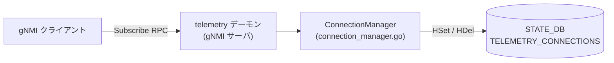

# TELEMETRY_CONNECTIONS テーブル (STATE_DB)

## 概要

`TELEMETRY_CONNECTIONS` は [STATE_DB](../../reference/glossary.md#term-state_db) 上の Redis Hash テーブル。`telemetry` デーモン (gNMI サーバ) が Subscribe RPC のアクティブな接続を管理・可視化するために使用する[^1]。

このテーブルは **CONFIG_DB からは一切参照されない** 書き込み専用のランタイム状態テーブルである。gNMI サーバが起動するたびに既存エントリは全削除され、接続の開始・終了に合わせてエントリが追加・削除される。

<!-- cdb-mermaid -->
### データフロー (自動生成)



!!! note "凡例"
    CONFIG_DB から SAI までの典型経路を `docs/reference/config-db-orch-map.md` から機械生成したミニ図。詳細・例外は本ページ本文と対応表を参照。
<!-- /cdb-mermaid -->

## key 構造

```text
TELEMETRY_CONNECTIONS   (Redis Hash — シングルキー)
```

Redis Hash 内の **フィールド名** が接続識別子 (connection key)、**値** が接続状態文字列。

### connection key のフォーマット

```text
<peer_ip:port>|<target_1>|[target_2|...]|<RFC3339_timestamp>
```

例:

```text
10.0.0.1:54321|STATE_DB|NEIGH_STATE_TABLE|2026-05-15T09:00:00Z
```

生成ロジック (`connection_manager.go:94-108`): クライアントアドレスと Subscribe リクエストの `target` / `element` フィールドを正規表現で抽出し、`|` 区切りで結合後、UTC タイムスタンプを末尾に付加する。

## フィールド

| フィールド (Redis Hash field) | 型 | 値 | 説明 |
|-------------------------------|----|----|------|
| `<connection_key>` | string | `"active"` (固定) | アクティブな Subscribe RPC 接続の存在を示す |

値は **常に文字列 `"active"`** で固定されており、接続の状態遷移は反映されない。接続の存在自体をキーの有無で表現する設計。

## ライフサイクル

| タイミング | 操作 | ソース |
|-----------|------|--------|
| `telemetry` デーモン起動 (`PrepareRedis()`) | 既存全エントリを `HDel` で削除 | `connection_manager.go:52-60` |
| Subscribe RPC 開始 (`Add()`) | `HSet(TELEMETRY_CONNECTIONS, key, "active")` | `connection_manager.go:76, 116` |
| Subscribe RPC 終了 (`Remove()`) | `HDel(TELEMETRY_CONNECTIONS, key)` | `connection_manager.go:127` |

## 制約

- `connection_key` の最大長は実装上制限されていない (正規表現マッチ + `|` + RFC3339 タイムスタンプ)
- Redis クライアント (`rclient`) が nil の場合、`HSet` / `HDel` は silent no-op となる — gNMI サーバはエラーなく継続動作する
- `threshold` (CONFIG_DB `GNMI|gnmi.threshold`) を超えた接続は `Add()` で拒否され STATE_DB への書き込みも発生しない

## 購読者

- `telemetry` バイナリ (`sonic-gnmi`): Subscribe RPC ごとに接続を登録・削除
- `show gnmi` 等の管理 CLI: `TELEMETRY_CONNECTIONS` を参照してアクティブ接続数を表示 (実装は `sonic-utilities` 側)

## 関連 CONFIG_DB / YANG / CLI

- 関連 [CONFIG_DB](../../reference/glossary.md#term-config_db): [`GNMI`](gnmi.md) (`threshold` フィールドが接続上限に影響)
- 関連 CLI: `show gnmi`
- 関連 YANG: なし (STATE_DB テーブルは YANG 未定義)

<!-- cdb-exceptions -->
## 例外条件・特殊挙動

| 条件 | 挙動 |
|------|------|
| `telemetry` デーモン起動時 | `PrepareRedis()` が `HGetAll` → 全 `HDel` で前回接続の残留エントリを削除 |
| STATE_DB 接続失敗 (`rclient == nil`) | `storeKeyRedis()` / `deleteKeyRedis()` が silent no-op。gNMI サーバ動作には影響なし |
| `threshold = 0` (CONFIG_DB) | 接続上限なし。`cm.threshold != 0` チェックで無制限が実現される |
| 同一 peer から重複 Subscribe | 旧クライアントを `Close()` して削除後、新クライアントを登録 (`server.go:872-876`) |
| `EnableStreamMultiplexing = true` | StreamID が client key に含まれ、同一 peer から複数ストリームが共存可能 (STATE_DB の connection_key に変化なし) |
<!-- /cdb-exceptions -->

<!-- ordering -->
## 書込み順依存 (Phase B)

`TELEMETRY_CONNECTIONS` は `telemetry` デーモン (`sonic-gnmi`) が直接 STATE_DB に HSet / HDel する単純な構造であり、orchagent 経由の間接書き込みは一切行われない。しかし以下の順序依存が存在する。

### 検出された順序依存

| # | 依存関係 | 方向 | 緩和策 |
|---|----------|------|--------|
| 1 | `PrepareRedis()` (全エントリ削除) → `HSet` (新接続登録) | 強制先行（削除優先） | デーモン起動直後は旧エントリが残存しない。consumer は起動完了まで読み取りを待機すべき |
| 2 | 閾値チェック (`threshold` 判定) → メモリ内 `cm.connections` 更新 → `storeKeyRedis()` (STATE_DB 書込み) | 強制順序 | STATE_DB への書込みはメモリ更新の後。外部 consumer がエントリを観測した時点では接続はすでにメモリに確定している |
| 3 | `setConnectionManager()` 再初期化 (閾値変更時) → `PrepareRedis()` | 強制先行（閾値変更時に全クリア） | 閾値が変更されると新しい `ConnectionManager` インスタンスが生成され、既存の接続情報がメモリ・STATE_DB 両方でリセットされる |
| 4 | `Remove()` でのメモリ削除 → `deleteKeyRedis()` (STATE_DB 削除) | 強制順序 | 接続切断時はメモリが先にクリアされ、その後 STATE_DB から削除される。瞬間的に STATE_DB にエントリが残存しうる |

### 主要な制約詳細

**起動時の全削除 → 新規登録の順序 (依存 #1)**: `ConnectionManager.PrepareRedis()` は `HGetAll` で既存エントリを全取得し、`HDel` で全削除した後に処理を返す。`Subscribe` RPC の受け付けは `PrepareRedis()` 完了後に始まるため、consumer から見た STATE_DB は「空 → 新接続追加」の順に変化する。`PrepareRedis()` が STATE_DB 接続エラーで早期 return した場合は前回の残留エントリが削除されずに残り、consumer が古い接続情報を読む可能性がある（evidence: `connection_manager.go:32-61`）。

**閾値変更による意図しないリセット (依存 #3)**: `Subscribe` RPC ハンドラが `setConnectionManager(s.config.Threshold)` を呼ぶたびに、既存 `connectionManager` の閾値と新 `Threshold` を比較する。値が異なる場合、新しい `ConnectionManager` インスタンスを生成して `PrepareRedis()` を呼ぶため、**進行中の接続メタデータが全クリアされる**。CONFIG_DB の `GNMI|gnmi.threshold` を動的に変更した場合、次の Subscribe RPC 到着時に STATE_DB がリセットされる（evidence: `client_subscribe.go:73-85`）。

**切断 vs STATE_DB 削除のタイムラグ (依存 #4)**: `Remove(key)` はメモリ上の `cm.connections` から先にエントリを削除し (`delete(cm.connections, key)`)、その後 `deleteKeyRedis(key)` で STATE_DB から削除する。両操作の間に STATE_DB をポーリングする consumer はメモリ上では存在しない接続を STATE_DB で観測しうる。削除は通常ミリ秒以内で完了するが、STATE_DB が高負荷の場合は遅延しうる（evidence: `connection_manager.go:80-92`）。

<!-- evidence:
  connection_manager.go:32-61 — PrepareRedis(): 全削除 → Redis 接続初期化の順序
  connection_manager.go:63-78 — Add(): 閾値チェック → メモリ追加 → storeKeyRedis の順序
  connection_manager.go:80-92 — Remove(): メモリ削除 → deleteKeyRedis の順序
  client_subscribe.go:73-85 — setConnectionManager(): 閾値変更時の再初期化ロジック
-->
<!-- /ordering -->

<!-- cross-refs -->
## 暗黙参照テーブル (Phase C)

`TELEMETRY_CONNECTIONS` は `telemetry` デーモン (`sonic-gnmi`) が **唯一の書き手** であり、外部 Orch やパイプラインを経由しない。以下はこのテーブルのエントリ生成・制御に間接的に影響する入力リソースと暗黙参照先の一覧である。

| 参照先テーブル / リソース | 参照方向 | 条件 | 参照元 evidence |
|--------------------------|---------|------|----------------|
| `database_config.json` (`/var/run/redis/sonic-db/database_config.json`) | STATE_DB アドレス・DB 番号の解決 | `PrepareRedis()` 呼び出し時に常時参照。このファイルが欠損または STATE_DB エントリが未定義の場合 `rclient` は nil となり以降の HSet / HDel はすべて silent no-op | `sonic_db_config/db_config.go:14` — `SONIC_DB_CONFIG_FILE` 定数; `connection_manager.go:33-43` — `GetDbTcpAddr("STATE_DB", ns)` / `GetDbId("STATE_DB", ns)` |
| `GNMI\|gnmi` (CONFIG_DB) — `threshold` フィールド | 接続上限の間接制御 (エントリ数の上限) | `telemetry.go` フラグ `--threshold` (デフォルト 100) またはシステム起動時に CONFIG_DB から読み込んだ値が `Server.config.Threshold` にセットされ、`Subscribe()` RPC ごとに `setConnectionManager(s.config.Threshold)` へ渡される。閾値到達後は `Add()` が `false` を返し STATE_DB への書き込みが発生しない | `server.go:866` — `c.setConnectionManager(s.config.Threshold)`; `connection_manager.go:65` — `len(cm.connections) >= cm.threshold && cm.threshold != 0` チェック; `telemetry.go:187` — `fs.Int("threshold", 100, ...)` |
| `Server.clients` (in-memory, `server.go`) | STATE_DB エントリの概念的ミラー | `Subscribe()` RPC ハンドラが `s.clients[clientKey] = c` でメモリ登録した後に `ConnectionManager.Add()` → `storeKeyRedis()` で STATE_DB に反映。同一 peer が重複して Subscribe した場合は `oc.Close()` + `delete(s.clients, clientKey)` でメモリから削除後、`Remove()` → `deleteKeyRedis()` で STATE_DB からも削除される（Phase B 依存 #1 と連動） | `server.go:872-877` — 重複クライアント削除フロー; `client_subscribe.go:73-85` — `setConnectionManager()` 再初期化ロジック |

### consumer（読み取り側）

`TELEMETRY_CONNECTIONS` テーブルは書き込み専用のランタイム状態であり、標準的な orchagent / translib パイプラインからは参照されない。既知の読み取りパスは以下のみ:

| 読み取り元 | 参照方法 | 目的 |
|-----------|---------|------|
| `show gnmi` (sonic-utilities 側の実装) | `HGetAll(TELEMETRY_CONNECTIONS)` | アクティブな Subscribe RPC 接続一覧の表示 |
| `gnmi_server/server_test.go` (テストコード) | `HGetAll(TELEMETRY_CONNECTIONS)` | 接続登録・削除の単体テスト検証 |

!!! note "CONFIG_DB への書き戻しは発生しない"
    `TELEMETRY_CONNECTIONS` の値は CONFIG_DB に一切書き戻されない。このテーブルはオペレーション状態の可視化専用であり、設定変更のトリガにはならない。

<!-- evidence:
  connection_manager.go:10,33-43 — sdcfg.GetDbTcpAddr("STATE_DB", ns) / GetDbId("STATE_DB", ns) で database_config.json を間接参照して rclient を初期化
  connection_manager.go:63-78 — Add(): threshold チェック → cm.connections 更新 → storeKeyRedis()
  server.go:866 — Subscribe() が setConnectionManager(s.config.Threshold) を呼び閾値を渡す
  server.go:872-877 — 重複クライアント Close → delete(s.clients) → 既存エントリ削除フロー
  telemetry.go:187 — threshold フラグのデフォルト 100
  server_test.go:5176,5182 — HGetAll("TELEMETRY_CONNECTIONS") による読み取り確認
-->
<!-- /cross-refs -->

<!-- failure -->
## 失敗挙動 (Phase D)

`TELEMETRY_CONNECTIONS` テーブルへの書き込み・削除は `storeKeyRedis()` / `deleteKeyRedis()` で行われる。これらの関数は **best-effort** 設計であり、Redis 操作が失敗してもデーモン本体の動作を止めない。

### 失敗パターン一覧

| 失敗ケース | 発生箇所 | 挙動 | retry | STATE_DB への影響 |
|---|---|---|---|---|
| `GetDbTcpAddr()` または `GetDbId()` エラー (`database_config.json` 不正 / STATE_DB 未定義) | `PrepareRedis()` L34-42 | `log.Errorf` を出力して早期 return。`rclient` は nil のまま | なし | 以降の HSet / HDel すべて silent no-op |
| `redis.NewClient()` 後の STATE_DB 接続失敗 | `storeKeyRedis()` / `deleteKeyRedis()` — `rclient != nil` だが Redis 疎通なし | `HSet` / `HDel` が `err != nil` を返す → `log.V(1).Infof` のみ | なし | エントリ未登録 / 未削除のまま残留 |
| `rclient == nil`（PrepareRedis 失敗後に Add / Remove が呼ばれた場合） | `storeKeyRedis()` L112-114 / `deleteKeyRedis()` L122-124 | `log.V(1).Infof` を出力して return。エラーコードは返さない | なし | HSet / HDel 実行されず。メモリ上の `cm.connections` はすでに更新済みのため、STATE_DB とメモリ状態が乖離する |
| `HSet` エラー（Redis 高負荷 / ネットワーク切断等） | `storeKeyRedis()` L116-118 | `log.V(1).Infof` のみ。gNMI RPC 自体は成功する | なし | TELEMETRY_CONNECTIONS にエントリが追加されない。`show gnmi` での接続数が実際より少なく見える |
| `HDel` が `ret == 0`（対象 key が存在しない） | `deleteKeyRedis()` L127-130 | `log.V(1).Infof` のみ | なし | 冪等。二重削除は無害 |
| 閾値超過 (`len(cm.connections) >= cm.threshold && cm.threshold != 0`) | `Add()` L65-69 | `cm.mu.RUnlock()` して `("", false)` を返す。`storeKeyRedis()` は呼ばれない | なし | STATE_DB への書き込みなし。Subscribe RPC はサーバ側で拒否される |
| `PrepareRedis()` の `HGetAll` が nil を返す（TELEMETRY_CONNECTIONS が存在しない場合） | `PrepareRedis()` L52-56 | `res == nil` → early return。前回エントリの削除をスキップ | なし | 残留エントリなし（テーブルが空の場合は無害） |
| デーモン異常終了による STATE_DB 残留エントリ | プロセスクラッシュ時 | `PrepareRedis()` が呼ばれないため古いエントリが残存 | デーモン再起動後に `PrepareRedis()` が全削除 | 再起動まで古い接続情報が `show gnmi` に表示される |

### 重要な設計上の特性

**エラーはデーモン動作に影響しない**: `storeKeyRedis()` / `deleteKeyRedis()` の失敗は gNMI RPC の成否に一切影響しない。Subscribe が正常に受け付けられたとしても STATE_DB への記録が失敗する可能性がある。これは意図された設計であり、STATE_DB は可視化目的であって制御パスには含まれない。

**STATE_DB とメモリの乖離**: `Add()` はメモリ (`cm.connections`) への追加を **`storeKeyRedis()` より先に実行**し (`connection_manager.go:73-76`)、`Remove()` もメモリからの削除を `deleteKeyRedis()` より先に実行する (`connection_manager.go:87-90`)。Redis 操作が失敗した場合、メモリ状態は正しいが STATE_DB は古い状態になる。`ConnectionManager` にはこの乖離を検出・修復する仕組みはない。

**障害後の自動回復**: `setConnectionManager()` が再呼び出しされると（閾値変更時）、`PrepareRedis()` が STATE_DB の全エントリを削除した上でメモリも新しい `ConnectionManager` で初期化されるため、乖離状態は次回 Subscribe RPC 到着時に解消される (`client_subscribe.go:73-85`)。ただし進行中の接続メタデータも失われる。

<!-- evidence:
  connection_manager.go:32-61 — PrepareRedis(): GetDbTcpAddr/GetDbId エラーで rclient = nil のまま early return
  connection_manager.go:63-78 — Add(): threshold 超過で early return → storeKeyRedis 未呼び出し
  connection_manager.go:80-92 — Remove(): deleteKeyRedis は ret==0 でも no-op
  connection_manager.go:111-118 — storeKeyRedis: rclient == nil ガード + HSet エラーのみ log
  connection_manager.go:121-131 — deleteKeyRedis: rclient == nil ガード + ret==0 で log のみ
  client_subscribe.go:73-85 — setConnectionManager(): 閾値変更時の全リセット
-->
<!-- /failure -->

<!-- constants -->
## ハードコード定数 (Phase E)

`ConnectionManager` および `telemetry` デーモンは、テーブル名・接続値・閾値デフォルト・キー生成正規表現をソース内でハードコードしており、CONFIG_DB からは変更できない。

### テーブル名・フィールド値（`connection_manager.go:16,116`）

| 定数 / リテラル | 値 | 用途 |
|----------------|----|------|
| `table` 定数 | `"TELEMETRY_CONNECTIONS"` | STATE_DB の Redis Hash テーブル名。変更手段なし（`connection_manager.go:16`） |
| `HSet` 第 3 引数 | `"active"` | 全接続エントリの固定値。接続状態をキーの有無で表現するため値は常に同一（`connection_manager.go:116`） |

### 接続上限デフォルト（`telemetry.go:187`）

| フラグ / 変数 | デフォルト値 | 意味 |
|--------------|------------|------|
| `--threshold` フラグ | `100` | 同時アクティブ Subscribe RPC 接続数の上限。起動オプションまたは CONFIG_DB `GNMI\|gnmi.threshold` で上書き可能（`telemetry.go:187`） |
| threshold = `0` | 上限なし | `cm.threshold != 0` 条件で特別扱い。`0` のみ「上限なし」を意味する（`connection_manager.go:65`） |

!!! note "上書き可能な例外"
    `threshold` は `telemetry.go` の `--threshold` フラグで起動時に変更可能であり、厳密な意味でのハードコード定数ではない。ただし運用中の動的変更は CONFIG_DB `GNMI|gnmi.threshold` 経由で行われ、次の Subscribe RPC 到着時に `setConnectionManager()` が再初期化を実行する。

### connection key 生成ロジック（`connection_manager.go:94-108`）

`createKey()` はハードコードされた正規表現と `|` 区切り・UTC RFC3339 タイムスタンプで構成される。外部からカスタマイズする方法は存在しない。

| コード内定数 | 値 | 役割 |
|-------------|----|------|
| `regexStr` | `"(?:target\|element):\"([a-zA-Z0-9-_*]*)\""` | gNMI query 文字列から `target` / `element` の値を抽出する正規表現（`connection_manager.go:95`） |
| 区切り文字 | `"\|"` | `addr.String()` とクエリ要素間、およびタイムスタンプ前の区切り（`connection_manager.go:99,105,107`） |
| タイムスタンプ形式 | `time.RFC3339` (例: `"2006-01-02T15:04:05Z07:00"`) | key 末尾に付加される接続開始時刻の形式（`connection_manager.go:107`） |

`connection_manager.go:95` の正規表現は英数字・ハイフン・アンダースコア・ワイルドカード (`*`) のみを許可する。これより長い文字列やスラッシュを含む gNMI path は target / element 抽出がスキップされ、key は `addr.String()|<timestamp>` となる。

### Redis クライアント初期化パラメータ（`connection_manager.go:44-50`）

| フィールド | 固定値 | 変更可否 |
|-----------|--------|---------|
| `Network` | `"tcp"` | 固定（Unix ソケット非対応） |
| `Password` | `""` (空文字) | 固定（認証なし） |
| `DialTimeout` | `0` (デフォルトタイムアウト) | 固定 |

> **Evidence**: `sonic-net/sonic-gnmi` `gnmi_server/connection_manager.go:16,44-50,65,94-108,116`、`telemetry/telemetry.go:187`

<!-- /constants -->

<!-- defaults -->
## コード由来の暗黙デフォルト (Phase A)

> 調査対象: `sonic-net/sonic-gnmi/gnmi_server/connection_manager.go`, `client_subscribe.go`, `telemetry/telemetry.go`  
> 調査日: 2026-05-15

### `TELEMETRY_CONNECTIONS` — Hash value

| 種別 | 値 | ソース |
|------|----|--------|
| 接続登録時の固定値 | `"active"` | `connection_manager.go:116` — `HSet(..., key, "active")` |
| 起動時初期状態 | 全エントリ削除 | `connection_manager.go:52-60` — `PrepareRedis()` の `HGetAll` → 全 `HDel` |

**乖離なし**: 値は常にハードコード `"active"` 固定。CONFIG_DB / YANG デフォルトとの乖離は存在しない。

---

### threshold = 0 の特別意味 (STATE_DB エントリ数に影響)

| threshold 値 | 意味 | ソース |
|-------------|------|--------|
| `100` (デフォルト) | 同時接続上限 100。超過接続は `Add()` で拒否 → STATE_DB 書き込みなし | `telemetry.go:187` — `fs.Int("threshold", 100, ...)` |
| `0` | 上限なし (no threshold) | `connection_manager.go:65` — `cm.threshold != 0` 条件による |

CONFIG_DB の `GNMI|gnmi.threshold` が STATE_DB のエントリ数の最大値を間接的に決定する。`threshold` 自体は STATE_DB には書き込まれない。

---

### rclient nil ガード — フォールト許容

```go
// connection_manager.go:111-115
func storeKeyRedis(key string) {
    if rclient == nil {
        log.V(1).Infof("Redis client is nil, cannot store connection key")
        return
    }
    ...
}
```

STATE_DB が利用不可能な場合でも、gNMI サーバ本体は正常動作を継続する。STATE_DB への書き込みは best-effort であり、失敗してもパニックしない。

---

### connection key タイムスタンプ

connection key 末尾に付加される RFC3339 タイムスタンプは `time.Now().UTC()` で生成される。同一 peer から同一 query の接続が高速に繰り返された場合、秒精度の衝突が起こりえるが、コード上は重複ガードを行っていない (Hash の上書きで対応)。

<!-- evidence:
  connection_manager.go:16,32-60,63-108,110-130 — TELEMETRY_CONNECTIONS テーブル全ロジック
  client_subscribe.go:73-85 — setConnectionManager() / PrepareRedis() 呼び出し
  server.go:866 — Subscribe RPC ごとの setConnectionManager(s.config.Threshold) 呼び出し
  telemetry.go:187 — threshold flag default = 100
-->
<!-- /defaults -->

<!-- side-effects -->
## 副次 DB 書込 (Phase F)

`TELEMETRY_CONNECTIONS` テーブル自体は STATE_DB への書込専用ランタイム状態テーブルであり、このテーブルへの HSet / HDel が他の DB テーブルへの書込を **連鎖的にトリガすることはない**。

### 副次書込の調査結果

| 副次 DB / リソース | テーブル / キー | 書込内容 | 有無 |
|---|---|---|---|
| CONFIG_DB | 任意テーブル | `TELEMETRY_CONNECTIONS` の変化に起因する書戻し | **なし** |
| APPL_DB | 任意テーブル | orchagent 等への通知 | **なし** |
| ASIC_DB | 任意テーブル | SAI 操作のトリガ | **なし** |
| COUNTERS_DB | 任意テーブル | カウンタ更新 | **なし** |
| FLEX_COUNTER_DB | 任意テーブル | 参照なし | **なし** |
| ファイルシステム | 任意パス | 設定ファイル書込 | **なし** |
| SysV IPC 共有メモリ | key=`7749` | gNMI 操作カウンタ (`InitCounters` / `IncCounter`) | `telemetry` デーモン **起動時** に初期化。TELEMETRY_CONNECTIONS への書込とは独立 (`common_utils/shareMem.go`) |

### 読み取り専用の consumer

`TELEMETRY_CONNECTIONS` を読み取るコンポーネントは以下に限定される。いずれも読み取りのみであり、他 DB への書込は行わない。

| Consumer | 操作 | 目的 |
|---|---|---|
| `show gnmi`（sonic-utilities） | `HGetAll(TELEMETRY_CONNECTIONS)` | アクティブな Subscribe RPC 接続一覧の表示 |
| `gnmi_server/server_test.go` | `HGetAll(TELEMETRY_CONNECTIONS)` | 接続登録・削除の単体テスト検証 |

### 設計上の特性

このテーブルは **可視化専用** のランタイム状態であり、制御フローには含まれない。`telemetry` デーモンが HSet / HDel を行っても、orchagent・syncd・その他デーモンは何ら反応しない。CONFIG_DB への書き戻しも発生しない。

<!-- evidence:
  connection_manager.go:16,52,116,127 — TELEMETRY_CONNECTIONS HSet/HDel のみ。他 DB 書込なし
  server_test.go:5176,5182 — HGetAll による読み取りテストのみ
  server.go:528 — NewServer() が InitCounters() を呼び出す（TELEMETRY_CONNECTIONS とは独立）
  common_utils/shareMem.go — SysV IPC 共有メモリのカウンタ管理（Redis COUNTERS_DB への書込なし）
-->
<!-- /side-effects -->

<!-- pubsub -->
## 通信メカニズム (Phase G)

`TELEMETRY_CONNECTIONS` は STATE_DB に直接書き込まれるランタイム状態テーブルであり、CONFIG_DB 購読メカニズム（`SubscriberStateTable` / `ConsumerStateTable` / `NotificationConsumer`）は**一切使用しない**。

### Producer / Consumer ペア

| 区間 | 方式 | チャンネル / パターン |
|------|------|--------------------|
| `telemetry` デーモン → STATE_DB | `go-redis HSet/HDel` 直接呼び出し | `TELEMETRY_CONNECTIONS`（Redis Hash、TTL なし、keyspace 通知登録なし） |
| STATE_DB → `show gnmi`（sonic-utilities） | `go-redis HGetAll` 直接呼び出し | `TELEMETRY_CONNECTIONS` の全フィールドを一括取得 |
| STATE_DB → テストコード | `go-redis HGetAll` 直接呼び出し | `gnmi_server/server_test.go` の単体テスト検証 |

### STATE_DB への書き込みフロー

`telemetry` デーモンは `gnmi_server/connection_manager.go` 内の `ConnectionManager` が STATE_DB への Redis クライアント (`rclient`) を **起動時** に初期化し、以降は RPC ハンドラスレッドから直接 `HSet` / `HDel` を発行する。orchagent・translib・syncd などの中間プロセスは介在しない。

```
telemetry デーモン
  └─ Subscribe RPC ハンドラ (server.go:866)
       └─ ConnectionManager.Add()     → HSet(TELEMETRY_CONNECTIONS, key, "active")
       └─ ConnectionManager.Remove()  → HDel(TELEMETRY_CONNECTIONS, key)
       └─ PrepareRedis() (起動時)     → HGetAll → 全 HDel（前回残留エントリのクリア）
```

`go-redis` ライブラリを TCP で直接使用しており、swsscommon の `DBConnector` / `Table` 抽象は経由しない。keyspace 通知の登録も行わないため、このテーブルへの変更が他プロセスへ Redis PUBLISH されることはない。

### CONFIG_DB との関係（購読なし）

`telemetry` デーモンは CONFIG_DB の `TELEMETRY_CONNECTIONS` を**購読しない**。CONFIG_DB との通信は以下の独立したパスで行われ、いずれも `TELEMETRY_CONNECTIONS` の書き込みとは直接連動しない。

| CONFIG_DB パス | 方式 | タイミング |
|---------------|------|----------|
| `GNMI\|certs` / `GNMI\|gnmi` の読み取り | `sonic-cfggen` スナップショット | コンテナ起動時 1 回のみ |
| `GNMI_CLIENT_CERT\|<cert_cname>` の読み取り | swsscommon ConfigDBConnector one-shot | 接続認証ごと（ランタイム） |
| `TELEMETRY_CLIENT\|*` の変更追従 | `go-redis PSUBSCRIBE` keyspace 通知 | `dialout_client_cli` プロセス起動時 + ランタイム |

### 設計上の特性

このテーブルは **可視化専用のランタイム状態** であり、変更通知を他プロセスへブロードキャストする設計を持たない。`show gnmi` などの consumer はポーリング型（HGetAll 一括取得）でのみ参照する。

<!-- evidence:
  connection_manager.go:32-50 — PrepareRedis(): go-redis NewClient() で STATE_DB に TCP 直接接続
  connection_manager.go:111-118 — storeKeyRedis(): rclient.HSet(ctx, table, key, "active")
  connection_manager.go:121-131 — deleteKeyRedis(): rclient.HDel(ctx, table, key)
  server.go:866 — Subscribe RPC ハンドラが ConnectionManager.Add() を呼び出す
  gnmi-native.sh:19 — sonic-cfggen によるスナップショット読み取り（TELEMETRY_CONNECTIONS とは独立）
  dialout_client.go:648-746 — TELEMETRY_CLIENT の PSUBSCRIBE（TELEMETRY_CONNECTIONS とは独立）
-->
<!-- /pubsub -->

<!-- platform -->
## プラットフォーム差 (Phase H)

`TELEMETRY_CONNECTIONS` テーブルへの書き込みロジックは `gnmi_server/connection_manager.go` 内に完結しており、ASIC 種別・`DEVICE_METADATA` の `platform` / `hwsku` フィールド・サードパーティ SAI 実装に**依存しない**。STATE_DB への HSet / HDel は Redis TCP 接続経由でのみ行われ、スイッチ ASIC とは直接関係しない。

### A. 設計上プラットフォーム非依存な点

| 項目 | 詳細 | evidence |
|------|------|----------|
| ASIC 種別 | `connection_manager.go` は ASIC / SAI API を参照しない。broadcom / mellanox / barefoot / cisco-8000 等で挙動に差はない | `connection_manager.go` 全体 — `sai_*` 系 import なし |
| `platform` / `hwsku` 文字列 | `DEVICE_METADATA|localhost` の `platform` / `hwsku` を参照しない。プラットフォーム分岐コードなし | `connection_manager.go` — `DEVICE_METADATA` 参照なし |
| connection key フォーマット | peer IP:port + gNMI query + RFC3339 タイムスタンプで構成。ASIC に依存しない | `connection_manager.go:94-108` — `createKey()` |
| `"active"` 固定値 | 全プラットフォームで HSet 値は `"active"` のみ | `connection_manager.go:116` |
| TCP 接続 | Redis クライアントは `Network: "tcp"` 固定。プラットフォーム差なし | `connection_manager.go:44` |

### B. multi-ASIC / namespace 環境での注意点

`PrepareRedis()` は `sdcfg.GetDbDefaultNamespace()` を呼び、**常にデフォルト名前空間（空文字列 `""`）** の STATE_DB アドレスを取得する（`connection_manager.go:33`）。

| 環境 | 動作 | 影響 |
|------|------|------|
| シングル ASIC（通常構成） | デフォルト名前空間の STATE_DB に書き込む。動作に問題なし | なし |
| multi-ASIC（`asic0` / `asic1` / ... 並存） | **デフォルト名前空間の STATE_DB にのみ書き込む**。各 ASIC 名前空間の STATE_DB には `TELEMETRY_CONNECTIONS` が存在しない | `show gnmi` はデフォルト名前空間のみ参照するため、表示上は一貫している |
| SmartSwitch DPU 構成 | NPU 側の `telemetry` デーモンがデフォルト名前空間 STATE_DB を使用する。DPU namespace には `TELEMETRY_CONNECTIONS` なし | DPU 側の gNMI 接続はこのテーブルに記録されない場合がある |

!!! note "multi-ASIC で `TELEMETRY_CONNECTIONS` は 1 インスタンスのみ"
    multi-ASIC 環境で `telemetry` デーモンは通常 1 プロセスのみ起動し、デフォルト名前空間の STATE_DB を使う。`AclOrch` 等の各 ASIC 名前空間に対応した複数インスタンス起動モデルとは異なる。

### C. 仮想プラットフォーム (VS) での動作

Virtual Switch (`platform = "vs"`) 環境では Redis が通常通り起動していれば `TELEMETRY_CONNECTIONS` の書き込みは実 ASIC と同一の経路で動作する。SAI 制約がないため capability フォールバックのような特別処理は発生しない。

### プラットフォーム別サマリ

| プラットフォーム | STATE_DB への書込動作 | 備考 |
|----------------|--------------------|------|
| broadcom / mellanox / barefoot / cisco-8000 等 | 全プラットフォーム共通 (`"active"` 固定値) | ASIC 種別による差異なし |
| vs (Virtual Switch) | 実 ASIC と同一動作 | SAI 非依存のため差異なし |
| multi-ASIC | デフォルト名前空間 STATE_DB のみ使用 | ASIC 名前空間ごとの書き込みなし |
| SmartSwitch DPU | NPU 側 `telemetry` のみ書き込み | DPU namespace STATE_DB には非対応 |

> **Evidence**: `gnmi_server/connection_manager.go:32-50` (`PrepareRedis()` — `GetDbDefaultNamespace()` → デフォルト namespace の STATE_DB アドレス取得)、`connection_manager.go:44` (`Network: "tcp"` 固定)、`connection_manager.go:116` (`"active"` リテラル)、`sonic_db_config/db_config.go:28-30` (`GetDbDefaultNamespace()` は常に `SONIC_DEFAULT_NAMESPACE`（空文字列）を返す)。`platform` / `hwsku` / SAI 参照なし — `connection_manager.go` 全行調査済み。

<!-- /platform -->

[^1]: `sonic-gnmi` `gnmi_server/connection_manager.go:16` — `const table = "TELEMETRY_CONNECTIONS"`、`PrepareRedis()` / `Add()` / `Remove()` で STATE_DB を読み書き
